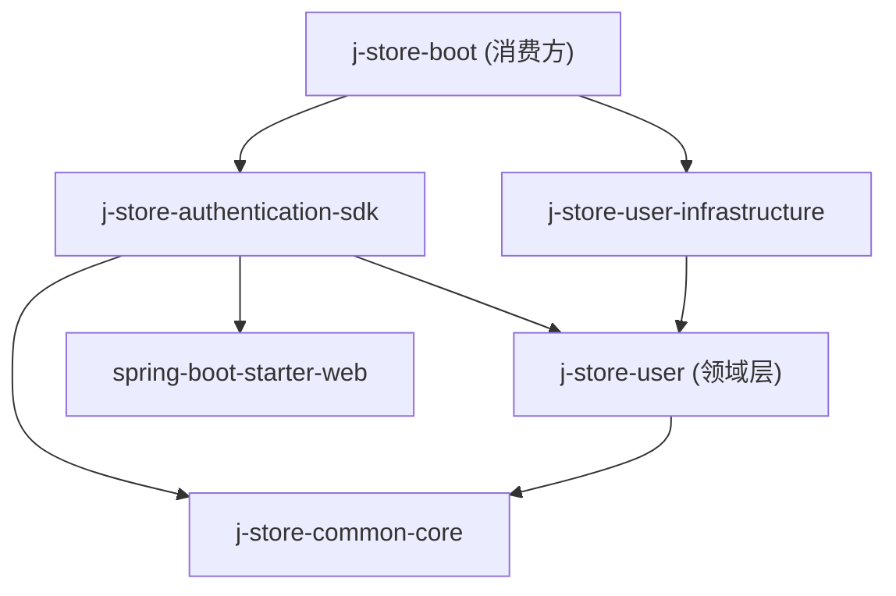
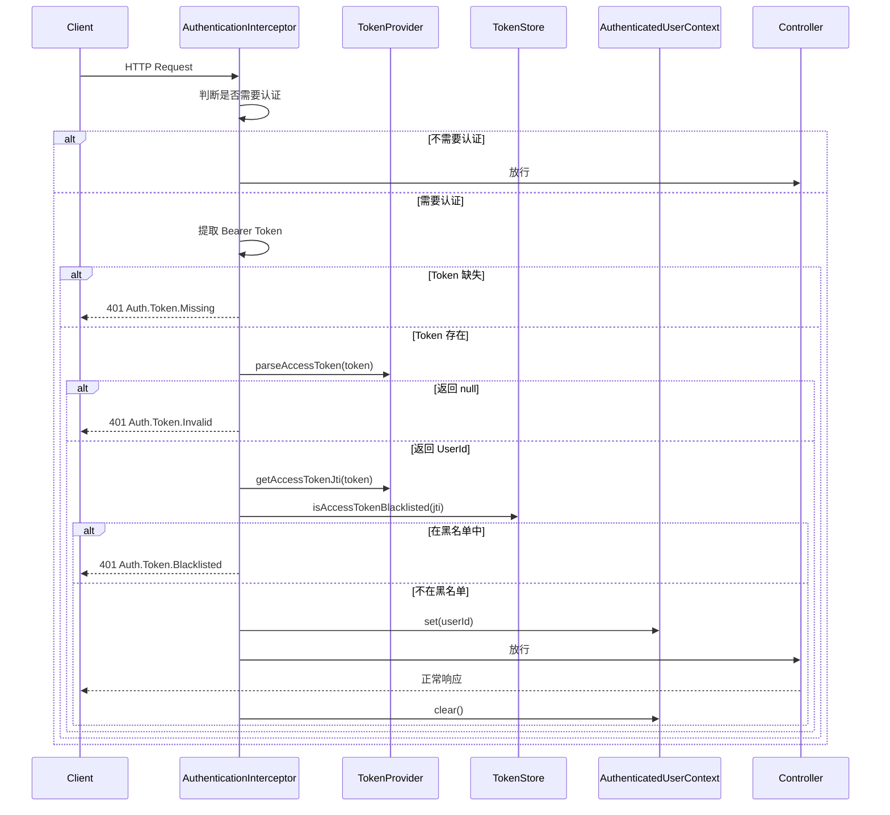

# 设计文档：Authentication SDK

## 概述

`j-store-authentication-sdk` 是一个轻量级的 Spring MVC 认证拦截器 SDK，为 j-store 项目提供声明式的接口认证能力。SDK 通过两种互补的方式声明"需要登录"：注解方式（`@RequireLogin` / `@SkipLogin`）和路径配置方式（`AuthenticationConfigurer`），并在 Spring MVC `HandlerInterceptor` 中统一执行 Token 验证逻辑。

SDK 遵循 DDD 架构规范，仅依赖 `j-store-user` 领域层接口（`TokenProvider`、`TokenStore`）和 `j-store-common-core`，不包含任何 JWT 或 Redis 实现。通过 Spring Boot 自动配置机制，消费方应用引入依赖后即可零配置启用。

### 设计目标

1. 将现有 `JwtAuthenticationFilter`（Servlet Filter）替换为基于 `HandlerInterceptor` 的方案，获得对 `HandlerMethod` 注解的感知能力
2. 注解类和 `AuthenticatedUserContext` 不依赖 Spring，可在领域层安全引用
3. 拦截器和自动配置类放置在独立的 Spring 集成包中
4. 通过 `@ConditionalOnBean` 实现条件激活，缺少 `TokenProvider` 或 `TokenStore` 时自动跳过

### 与现有系统的关系

当前 `j-store-boot` 中的 `JwtAuthenticationFilter` 使用硬编码白名单路径，通过 `request.setAttribute` 传递 userId。SDK 将替代该 Filter，提供更灵活的注解 + 路径配置方案，并通过 `AuthenticatedUserContext`（ThreadLocal）和 `@CurrentUserId` 参数解析器传递用户身份。

## 架构

### 模块依赖关系



SDK 不依赖 `j-store-user-infrastructure`，消费方应用（如 `j-store-boot`）负责提供 `TokenProvider` 和 `TokenStore` 的具体实现 Bean。

### 包结构

```
j-store-authentication-sdk/src/main/kotlin/com/jstore/authentication/
├── annotation/                          # 纯 Kotlin 注解（无 Spring 依赖）
│   ├── RequireLogin.kt
│   ├── SkipLogin.kt
│   └── CurrentUserId.kt
├── context/                             # 用户上下文（无 Spring 依赖）
│   ├── AuthenticatedUserContext.kt
│   └── AuthenticationException.kt
├── error/                               # 错误常量（无 Spring 依赖）
│   └── AuthenticationErrors.kt
├── config/                              # 配置接口（无 Spring 依赖）
│   └── AuthenticationConfigurer.kt
└── spring/                              # Spring MVC 集成（依赖 Spring）
    ├── AuthenticationInterceptor.kt
    ├── CurrentUserIdArgumentResolver.kt
    └── AuthenticationAutoConfiguration.kt
```

关键设计决策：`annotation/`、`context/`、`error/`、`config/` 包不引入任何 Spring 依赖，确保可在领域层安全引用。`spring/` 包集中所有 Spring MVC 相关代码。

### 请求处理流程



### 认证判定优先级

拦截器按以下优先级判定请求是否需要认证：

1. `@SkipLogin` 注解（最高优先级）→ 放行
2. `@RequireLogin` 注解（方法级或类级）→ 需要认证
3. 路径排除模式匹配 → 放行
4. 路径认证模式匹配 → 需要认证
5. 以上均不匹配 → 放行

## 组件与接口

### 1. 注解定义（`annotation/` 包）

#### `@RequireLogin`

```kotlin
@Target(AnnotationTarget.CLASS, AnnotationTarget.FUNCTION)
@Retention(AnnotationRetention.RUNTIME)
annotation class RequireLogin
```

- 标注在 Controller 类上：该类所有处理器方法均需登录
- 标注在方法上：仅该方法需登录

#### `@SkipLogin`

```kotlin
@Target(AnnotationTarget.FUNCTION)
@Retention(AnnotationRetention.RUNTIME)
annotation class SkipLogin
```

- 仅支持方法级别，用于在类级 `@RequireLogin` 下豁免特定方法

#### `@CurrentUserId`

```kotlin
@Target(AnnotationTarget.VALUE_PARAMETER)
@Retention(AnnotationRetention.RUNTIME)
annotation class CurrentUserId
```

- 标注在 Controller 方法参数上，配合 `HandlerMethodArgumentResolver` 自动注入当前 `UserId`

### 2. 用户上下文（`context/` 包）

#### `AuthenticatedUserContext`

```kotlin
object AuthenticatedUserContext {
    private val holder: ThreadLocal<UserId> = ThreadLocal()

    fun set(userId: UserId) { holder.set(userId) }
    fun getCurrentUserId(): UserId = holder.get() ?: throw AuthenticationException("当前上下文中无已认证用户")
    fun getCurrentUserIdOrNull(): UserId? = holder.get()
    fun clear() { holder.remove() }
}
```

- 使用 `ThreadLocal` 存储，线程安全
- `object` 单例，通过静态方法访问
- 不依赖 Spring

#### `AuthenticationException`

```kotlin
class AuthenticationException(message: String) : RuntimeException(message)
```

- 纯 Kotlin 异常，在未认证上下文中调用 `getCurrentUserId()` 时抛出

### 3. 错误常量（`error/` 包）

#### `AuthenticationErrors`

```kotlin
object AuthenticationErrors {
    val TOKEN_MISSING = BusinessError("令牌缺失", "Auth.Token.Missing", 401)
    val TOKEN_INVALID = BusinessError("令牌无效", "Auth.Token.Invalid", 401)
    val TOKEN_BLACKLISTED = BusinessError("令牌已被吊销", "Auth.Token.Blacklisted", 401)
    val INTERNAL_ERROR = BusinessError("认证服务内部错误", "Auth.InternalError", 500)
}
```

- 复用 `j-store-common-core` 的 `BusinessError` 类型
- 不依赖 Spring

### 4. 配置接口（`config/` 包）

#### `AuthenticationConfigurer`

```kotlin
interface AuthenticationConfigurer {
    /** 需要认证的 URL 路径模式，如 "/api/**" */
    fun authenticatedPathPatterns(): List<String> = emptyList()

    /** 排除认证的 URL 路径模式，如 "/api/users/login" */
    fun excludedPathPatterns(): List<String> = emptyList()
}
```

- 纯 Kotlin 接口，不依赖 Spring
- 消费方应用实现此接口并注册为 Spring Bean
- 提供默认空实现，消费方可选择性覆盖

### 5. Spring MVC 集成（`spring/` 包）

#### `AuthenticationInterceptor`

```kotlin
class AuthenticationInterceptor(
    private val tokenProvider: TokenProvider,
    private val tokenStore: TokenStore,
    private val configurers: List<AuthenticationConfigurer>,
) : HandlerInterceptor {

    private val objectMapper = ObjectMapper()

    override fun preHandle(request: HttpServletRequest, response: HttpServletResponse, handler: Any): Boolean {
        // 1. 非 HandlerMethod 直接放行（静态资源等）
        // 2. 按优先级判定是否需要认证
        // 3. 需要认证时执行 Token 验证流程
        // 4. 验证通过后设置 AuthenticatedUserContext
    }

    override fun afterCompletion(request: HttpServletRequest, response: HttpServletResponse, handler: Any, ex: Exception?) {
        AuthenticatedUserContext.clear()
    }
}
```

核心逻辑 — `requiresAuthentication(handler, request)` 判定方法：

```kotlin
private fun requiresAuthentication(handlerMethod: HandlerMethod, request: HttpServletRequest): Boolean {
    // 1. @SkipLogin → false（最高优先级）
    if (handlerMethod.hasMethodAnnotation(SkipLogin::class.java)) return false

    // 2. @RequireLogin（方法级或类级）→ true
    if (handlerMethod.hasMethodAnnotation(RequireLogin::class.java)) return true
    if (handlerMethod.beanType.isAnnotationPresent(RequireLogin::class.java)) return true

    // 3. 路径排除模式 → false
    val requestPath = request.requestURI
    if (matchesAnyPattern(requestPath, excludedPatterns)) return false

    // 4. 路径认证模式 → true
    if (matchesAnyPattern(requestPath, authenticatedPatterns)) return true

    // 5. 默认放行
    return false
}
```

路径匹配使用 Spring 的 `AntPathMatcher`。

Token 验证流程：
1. 从 `Authorization` 头提取 Bearer Token
2. 调用 `tokenProvider.parseAccessToken(token)` 获取 `UserId`
3. 调用 `tokenProvider.getAccessTokenJti(token)` 获取 JTI
4. 调用 `tokenStore.isAccessTokenBlacklisted(jti)` 检查黑名单
5. 验证通过后调用 `AuthenticatedUserContext.set(userId)`

错误响应写入：
```kotlin
private fun writeErrorResponse(response: HttpServletResponse, error: BusinessError) {
    response.status = error.httpCode
    response.contentType = "application/json"
    response.characterEncoding = "UTF-8"
    val body = mapOf("message" to error.message, "errorCode" to error.errorCode)
    response.writer.write(objectMapper.writeValueAsString(body))
}
```

异常处理：`preHandle` 中的 Token 验证逻辑包裹在 `try-catch` 中，捕获非预期异常时返回 `AuthenticationErrors.INTERNAL_ERROR`，不泄露异常详情。

#### `CurrentUserIdArgumentResolver`

```kotlin
class CurrentUserIdArgumentResolver : HandlerMethodArgumentResolver {

    override fun supportsParameter(parameter: MethodParameter): Boolean {
        return parameter.hasParameterAnnotation(CurrentUserId::class.java)
                && parameter.parameterType == UserId::class.java
    }

    override fun resolveArgument(
        parameter: MethodParameter,
        mavContainer: ModelAndViewContainer?,
        webRequest: NativeWebRequest,
        binderFactory: WebDataBinderFactory?,
    ): UserId {
        return AuthenticatedUserContext.getCurrentUserId()
    }
}
```

- 仅支持参数类型为 `UserId` 且标注了 `@CurrentUserId` 的参数
- 从 `AuthenticatedUserContext` 获取当前用户 ID

#### `AuthenticationAutoConfiguration`

```kotlin
@AutoConfiguration
@ConditionalOnWebApplication(type = ConditionalOnWebApplication.Type.SERVLET)
@ConditionalOnBean(TokenProvider::class, TokenStore::class)
class AuthenticationAutoConfiguration {

    @Bean
    @ConditionalOnMissingBean
    fun authenticationInterceptor(
        tokenProvider: TokenProvider,
        tokenStore: TokenStore,
        configurers: List<AuthenticationConfigurer>,
    ): AuthenticationInterceptor {
        return AuthenticationInterceptor(tokenProvider, tokenStore, configurers)
    }

    @Bean
    @ConditionalOnMissingBean
    fun currentUserIdArgumentResolver(): CurrentUserIdArgumentResolver {
        return CurrentUserIdArgumentResolver()
    }

    @Bean
    fun authenticationWebMvcConfigurer(
        interceptor: AuthenticationInterceptor,
        resolver: CurrentUserIdArgumentResolver,
    ): WebMvcConfigurer {
        return object : WebMvcConfigurer {
            override fun addInterceptors(registry: InterceptorRegistry) {
                registry.addInterceptor(interceptor).addPathPatterns("/**")
            }
            override fun addArgumentResolvers(resolvers: MutableList<HandlerMethodArgumentResolver>) {
                resolvers.add(resolver)
            }
        }
    }
}
```

- `@ConditionalOnBean(TokenProvider::class, TokenStore::class)` 确保仅在容器中存在这两个 Bean 时激活
- `@ConditionalOnWebApplication(type = SERVLET)` 确保仅在 Servlet Web 环境中激活
- 通过 `META-INF/spring/org.springframework.boot.autoconfigure.AutoConfiguration.imports` 文件注册（Spring Boot 3.x 方式）

### 自动配置注册

在 `src/main/resources/META-INF/spring/org.springframework.boot.autoconfigure.AutoConfiguration.imports` 中：

```
com.jstore.authentication.spring.AuthenticationAutoConfiguration
```

## 数据模型

本 SDK 不引入新的持久化数据模型。涉及的数据结构如下：

### 认证错误响应 JSON

```json
{
  "message": "令牌无效",
  "errorCode": "Auth.Token.Invalid"
}
```

### 依赖的领域模型

| 类型 | 来源模块 | 说明 |
|------|---------|------|
| `UserId` | j-store-user | `data class UserId(val value: Long) : Id<Long>(value)` |
| `TokenProvider` | j-store-user | 令牌解析接口 |
| `TokenStore` | j-store-user | 令牌黑名单检查接口 |
| `BusinessError` | j-store-common-core | 错误定义类型 |

### build.gradle.kts 变更

```kotlin
plugins {
    alias(libs.plugins.kotlin.jvm)
}

repositories {
    mavenCentral()
}

dependencies {
    api(libs.kotlin.stdlib)
    api(libs.kotlin.reflect)
    api(project(":j-store-common-core"))
    api(project(":j-store-user"))

    // Spring MVC（仅 spring/ 包使用）
    implementation(platform(libs.spring.boot.dependencies))
    implementation(libs.spring.boot.starter.web)

    // Jackson（拦截器写 JSON 错误响应）
    implementation(libs.jackson.databind)

    // 测试
    testImplementation(libs.mockito)
    testImplementation(libs.mockito.kotlin)
    testImplementation(libs.kotlin.test)
    testImplementation(libs.kotest.runner.junit5)
    testImplementation(libs.kotest.assertions.core)
    testImplementation(libs.kotest.property)
    testImplementation(libs.spring.boot.starter.test)
}

kotlin {
    jvmToolchain(21)
}

tasks.test {
    useJUnitPlatform()
}
```


## 正确性属性

*属性（Property）是在系统所有合法执行中都应成立的特征或行为——本质上是对系统应做什么的形式化陈述。属性是人类可读规格说明与机器可验证正确性保证之间的桥梁。*

### 属性 1：统一认证判定

*对于任意* HandlerMethod 和任意 HTTP 请求路径，给定任意注解组合（类级 `@RequireLogin`、方法级 `@RequireLogin`、方法级 `@SkipLogin`）和任意路径模式配置（认证路径模式列表、排除路径模式列表），`requiresAuthentication` 的返回值应严格遵循以下优先级：
1. 方法标注 `@SkipLogin` → `false`
2. 方法或类标注 `@RequireLogin` → `true`
3. 路径匹配排除模式 → `false`
4. 路径匹配认证模式 → `true`
5. 以上均不满足 → `false`

**验证需求：1.2, 1.3, 1.4, 1.5, 2.2, 2.3, 2.4, 2.5, 3.2, 3.3**

### 属性 2：Bearer Token 提取

*对于任意*字符串 `s`，当 `Authorization` 头的值为 `"Bearer " + s` 时，Token 提取应返回 `s`；当 `Authorization` 头缺失、为空、或不以 `"Bearer "` 为前缀时，应判定为 Token 缺失。

**验证需求：4.1, 4.2**

### 属性 3：Token 验证错误映射

*对于任意* Token 验证场景，当 `parseAccessToken` 返回 `null` 时应产生 `Auth.Token.Invalid` 错误响应；当 `isAccessTokenBlacklisted` 返回 `true` 时应产生 `Auth.Token.Blacklisted` 错误响应；当 Token 缺失时应产生 `Auth.Token.Missing` 错误响应。所有错误响应的 JSON 结构应包含 `message` 和 `errorCode` 两个字段。

**验证需求：4.4, 4.6, 4.7**

### 属性 4：AuthenticatedUserContext 存取 round-trip

*对于任意* `UserId`，调用 `AuthenticatedUserContext.set(userId)` 后，`getCurrentUserId()` 应返回相同的 `UserId`，`getCurrentUserIdOrNull()` 也应返回相同的 `UserId`；调用 `clear()` 后，`getCurrentUserIdOrNull()` 应返回 `null`。

**验证需求：5.1, 5.3, 5.5**

### 属性 5：AuthenticatedUserContext 线程隔离

*对于任意*两个不同的 `UserId`（`userIdA` 和 `userIdB`），在线程 A 中 `set(userIdA)` 且在线程 B 中 `set(userIdB)` 后，线程 A 中 `getCurrentUserId()` 应返回 `userIdA`，线程 B 中 `getCurrentUserId()` 应返回 `userIdB`。

**验证需求：5.2**

## 错误处理

### 认证错误

| 场景 | 错误码 | HTTP 状态码 | 错误消息 |
|------|--------|------------|---------|
| Authorization 头缺失或格式不符 | Auth.Token.Missing | 401 | 令牌缺失 |
| Token 解析失败（无效或过期） | Auth.Token.Invalid | 401 | 令牌无效 |
| Token JTI 在黑名单中 | Auth.Token.Blacklisted | 401 | 令牌已被吊销 |
| Token 验证过程中非预期异常 | Auth.InternalError | 500 | 认证服务内部错误 |

### 错误响应格式

所有认证错误以 JSON 格式返回：

```json
{
  "message": "错误消息",
  "errorCode": "Auth.Token.XXX"
}
```

### 异常处理策略

- `preHandle` 中的 Token 验证逻辑包裹在 `try-catch(Exception)` 中
- 捕获非预期异常时返回 `AuthenticationErrors.INTERNAL_ERROR`，不泄露异常堆栈或详情
- `afterCompletion` 中始终调用 `AuthenticatedUserContext.clear()`，确保无论请求成功或异常都清理 ThreadLocal

### AuthenticatedUserContext 异常

- `getCurrentUserId()` 在未认证上下文中抛出 `AuthenticationException("当前上下文中无已认证用户")`
- `getCurrentUserIdOrNull()` 在未认证上下文中返回 `null`，不抛异常

## 测试策略

### 属性测试（Property-Based Testing）

使用 Kotest Property Testing（`io.kotest:kotest-property`）实现属性测试，每个属性测试最少运行 100 次迭代。

| 属性 | 测试类 | 说明 |
|------|--------|------|
| 属性 1：统一认证判定 | `AuthenticationDecisionPropertyTest` | 生成随机注解组合 + 路径模式 + 请求路径，验证判定结果 |
| 属性 2：Bearer Token 提取 | `BearerTokenExtractionPropertyTest` | 生成随机字符串作为 Authorization 头值，验证提取逻辑 |
| 属性 3：Token 验证错误映射 | `TokenValidationErrorPropertyTest` | 生成随机 Token 验证场景（mock 不同返回值），验证错误响应 |
| 属性 4：Context 存取 round-trip | `AuthenticatedUserContextPropertyTest` | 生成随机 UserId，验证 set/get/clear 行为 |
| 属性 5：Context 线程隔离 | `AuthenticatedUserContextPropertyTest` | 生成随机 UserId 对，验证跨线程隔离 |

每个属性测试必须包含注释引用设计文档属性：
```kotlin
// Feature: authentication-sdk, Property 1: 统一认证判定
```

### 单元测试（Example-Based）

| 测试类 | 覆盖需求 | 说明 |
|--------|---------|------|
| `AuthenticationInterceptorTest` | 3.1, 6.4 | 验证重复验证只执行一次；非预期异常返回 500 |
| `AuthenticationErrorsTest` | 6.1, 6.2 | 验证错误常量定义正确 |
| `CurrentUserIdArgumentResolverTest` | 5.6 | 验证参数解析器行为 |
| `AuthenticatedUserContextTest` | 5.4 | 验证未认证上下文的边界行为 |

### 集成测试

| 测试类 | 覆盖需求 | 说明 |
|--------|---------|------|
| `AuthenticationAutoConfigurationTest` | 7.1, 7.3, 7.4 | Spring Boot 上下文测试，验证条件配置激活/不激活 |
| `AuthenticationIntegrationTest` | 4.3, 4.5, 6.3 | 完整请求链路测试，验证拦截器与 TokenProvider/TokenStore 的协作 |

### 架构约束验证

需求 8 的架构约束通过以下方式验证：
- `build.gradle.kts` 代码审查确认依赖边界（8.1, 8.2）
- 编译时验证：SDK 不依赖 infrastructure 模块，编译即可验证（8.3）
- 包结构审查：注解和 Context 类不含 Spring import（8.4, 8.5）
