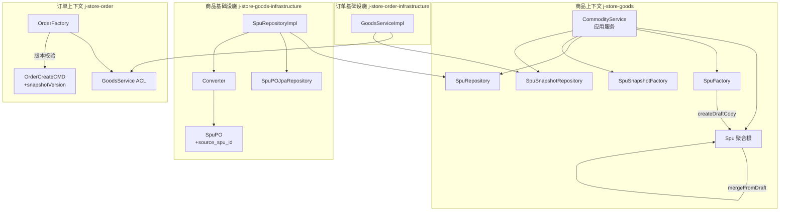
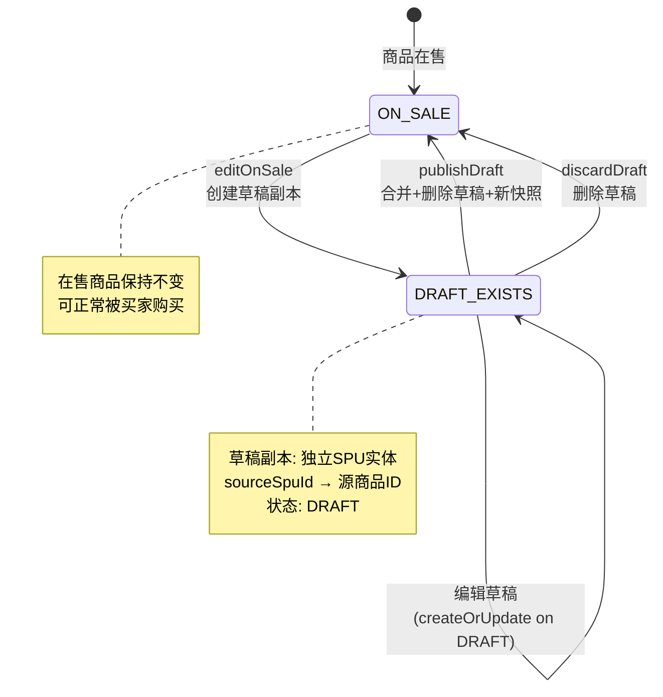
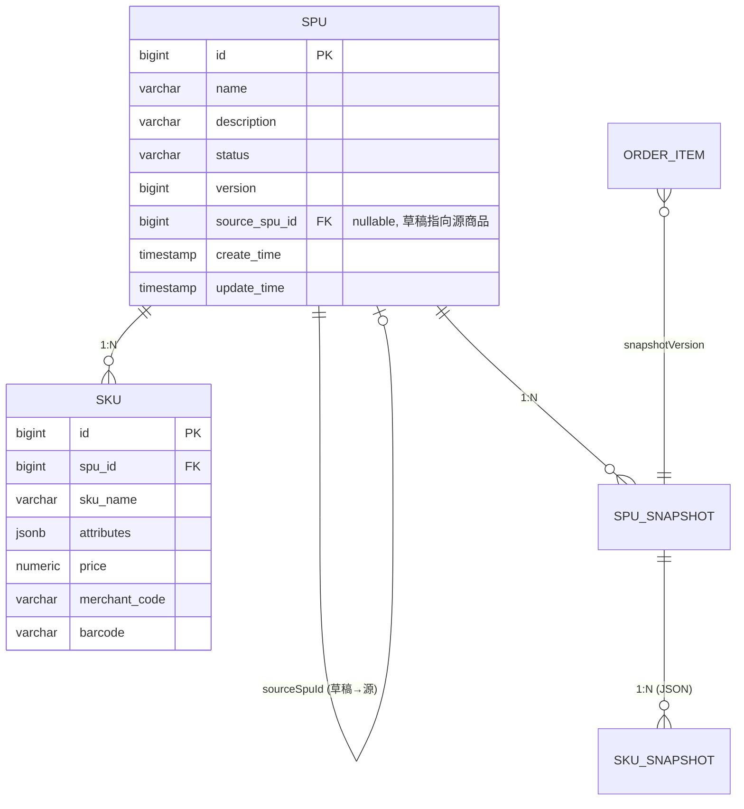
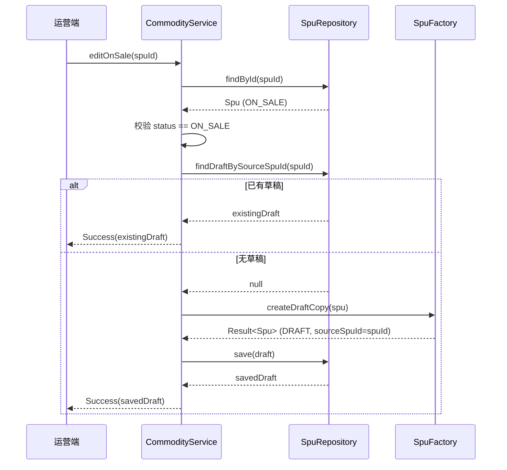
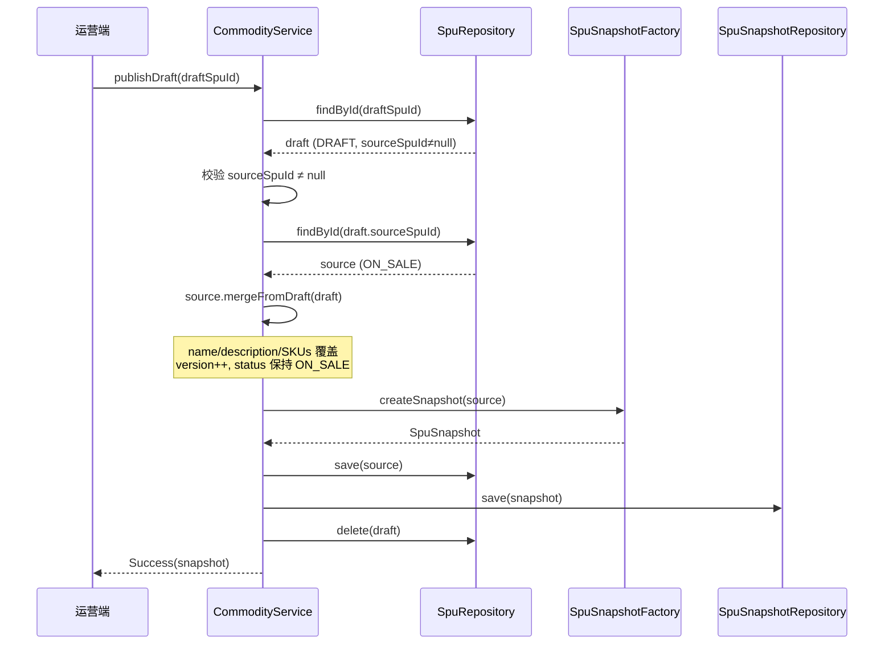
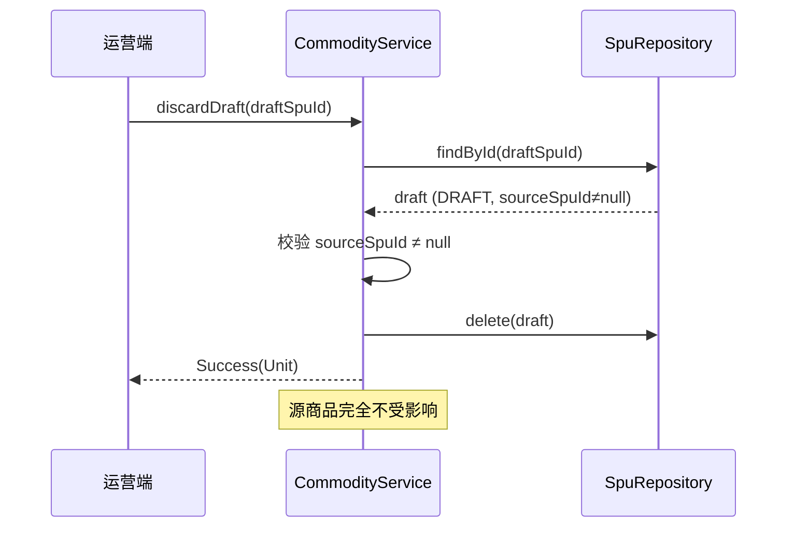
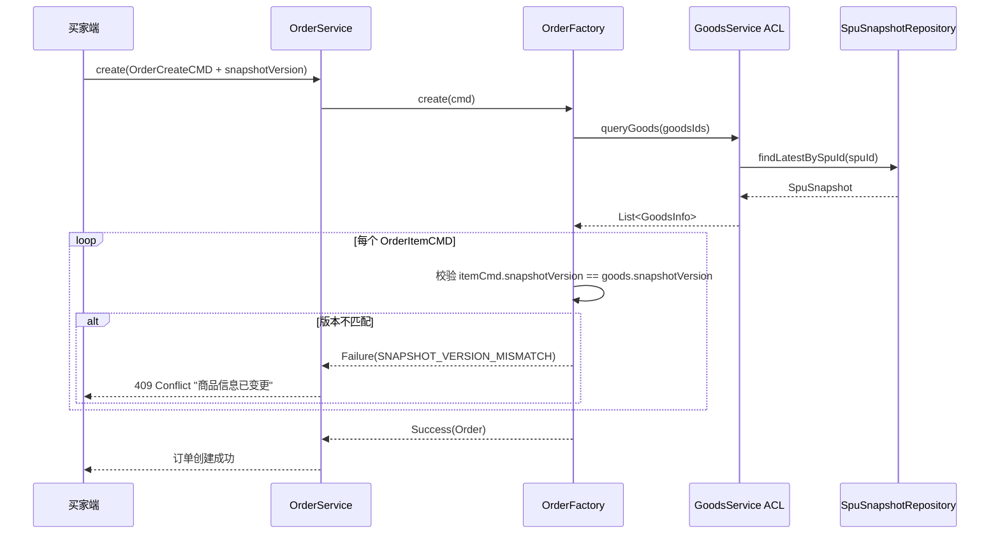

# 设计文档：商品 Copy-on-Write 草稿编辑模型

## 概述

本设计为在售商品（ON_SALE）引入 Copy-on-Write 草稿编辑模型。核心思路：当运营人员需要编辑在售商品时，系统自动创建一份独立的 DRAFT 副本（携带 `sourceSpuId` 指向源商品），所有编辑在 DRAFT 副本上进行，在售商品在整个编辑期间保持不变、可正常购买。编辑完成后可选择发布草稿（合并回源商品、递增版本号、生成新快照）或丢弃草稿。同时在订单创建时增加快照版本校验，防止买家基于过期商品信息下单。

### 设计目标

1. **Spu 聚合根扩展**：新增 `sourceSpuId` 字段和 `mergeFromDraft` 领域方法
2. **SpuFactory 扩展**：新增 `createDraftCopy` 工厂方法
3. **SpuRepository 扩展**：新增 `findDraftBySourceSpuId` 和 `delete` 方法
4. **CommodityService 编排**：新增 `editOnSale`、`publishDraft`、`discardDraft` 用例；拦截 ON_SALE 商品的直接编辑
5. **持久化层适配**：SpuPO 新增 `source_spu_id` 列，Converter 双向映射，JPA 查询方法
6. **订单侧版本校验**：OrderCreateCMD 携带 `snapshotVersion`，OrderFactory 校验版本一致性
7. **错误类型定义**：商品模块和订单模块各新增相关错误常量

### 设计决策

| 决策 | 选择 | 理由 |
|------|------|------|
| 草稿副本的实体身份 | 独立 SPU 实体，新 SpuId | 草稿是独立聚合根实例，拥有自己的生命周期，通过 sourceSpuId 关联源商品 |
| 版本校验粒度 | SPU 级别 | 同一 SPU 下所有 SKU 共享版本号，简化校验逻辑，与现有快照模型一致 |
| OFF_SALE 商品编辑 | 直接编辑，不走草稿流程 | 下架商品不影响买家，无需保护 |
| mergeFromDraft 的位置 | Spu 聚合根领域方法 | 数据合并是领域行为，应封装在聚合根内部，遵循 DDD 原则 |
| 草稿删除方式 | SpuRepository.delete | JPA cascade 自动删除关联 SKU，保持数据一致性 |
| 草稿 version 初始值 | 复制源商品的 version | 发布时由 mergeFromDraft 递增，避免版本号跳跃 |

## 架构

### 整体架构图



### 草稿生命周期状态图



## 组件与接口

### 1. Spu 接口（变更）

**文件**: `j-store-goods/src/main/kotlin/com/jstore/goods/domain/commodity/Spu.kt`

```kotlin
interface Spu : AgreeGate<SpuId> {
    val name: String
    val description: String
    val skus: List<Sku>
    val status: CommodityStatus
    val version: Long
    val sourceSpuId: SpuId?          // 新增：null=原始商品，非null=草稿副本

    fun addSku(sku: Sku): Result<Unit, BusinessError>
    fun publish(): Result<Unit, BusinessError>
    fun putOnSale(): Result<Unit, BusinessError>
    fun takeOffSale(): Result<Unit, BusinessError>
    fun mergeFromDraft(draft: Spu): Result<Unit, BusinessError>  // 新增
}
```

**变更说明**：
- 新增 `sourceSpuId: SpuId?` 只读属性
- 新增 `mergeFromDraft(draft: Spu)` 领域方法

### 2. SpuImpl（变更）

**文件**: `j-store-goods/src/main/kotlin/com/jstore/goods/domain/commodity/SpuImpl.kt`

```kotlin
class SpuImpl(
    override val id: SpuId,
    override val name: String,
    override val description: String = "",
    private var _status: CommodityStatus,
    private val _skus: MutableList<Sku>,
    private var _version: Long = 1L,
    override val sourceSpuId: SpuId? = null,  // 新增
) : Spu {
    // ... 现有字段和方法不变 ...

    // 新增：内部可变字段用于 mergeFromDraft
    private var _name: String = name
    private var _description: String = description

    override val name: String get() = _name          // 改为通过 getter 暴露
    override val description: String get() = _description

    /**
     * 将草稿副本的内容合并到当前 SPU（领域方法）
     * 前置条件：当前 SPU 必须是 ON_SALE 状态，草稿 SKU 列表不能为空
     */
    override fun mergeFromDraft(draft: Spu): Result<Unit, BusinessError> {
        if (_status != CommodityStatus.ON_SALE) {
            return Failure(CommodityErrors.INVALID_STATUS_TRANSITION
                .msg("只有在售商品可以合并草稿，当前状态: $_status"))
        }
        if (draft.skus.isEmpty()) {
            return Failure(CommodityErrors.DRAFT_NO_SKU_FOR_PUBLISH)
        }
        _name = draft.name
        _description = draft.description
        _skus.clear()
        _skus.addAll(draft.skus)
        _version++
        return Success(Unit)
    }
}
```

**关键设计**：
- `name` 和 `description` 改为通过 `_name` / `_description` 可变字段 + getter 暴露，以支持 `mergeFromDraft` 修改
- 构造函数新增 `sourceSpuId` 参数，默认 null（兼容现有代码）
- `mergeFromDraft` 校验当前状态必须为 ON_SALE，草稿 SKU 不能为空
- 合并后 `_version++`，状态保持不变

### 3. SpuFactory 接口与实现（变更）

**文件**: `j-store-goods/src/main/kotlin/com/jstore/goods/domain/commodity/SpuFactory.kt`

```kotlin
interface SpuFactory {
    fun create(createCmd: CommodityCreateCmd): Spu
    fun update(createCmd: CommodityCreateCmd, old: Spu): Spu
    fun createSku(cmd: SkuCreateCmd): Sku
    fun createDraftCopy(source: Spu): Result<Spu, BusinessError>  // 新增
}

class SpuFactoryImpl(
    private val snowFlakSequence: SnowFlakSequence,
) : SpuFactory {

    // ... 现有方法不变，update 方法保留 sourceSpuId ...

    override fun update(createCmd: CommodityCreateCmd, old: Spu): Spu {
        return SpuImpl(
            id = old.id,
            name = createCmd.spuName,
            description = createCmd.description,
            _status = old.status,
            _skus = old.skus.toMutableList(),
            _version = old.version,
            sourceSpuId = old.sourceSpuId,  // 新增：保留原始 sourceSpuId
        )
    }

    /**
     * 从在售商品创建草稿副本
     * 前置条件：源商品必须是 ON_SALE 状态
     */
    override fun createDraftCopy(source: Spu): Result<Spu, BusinessError> {
        if (source.status != CommodityStatus.ON_SALE) {
            return Failure(CommodityErrors.ONLY_ON_SALE_NEEDS_DRAFT)
        }
        val draft = SpuImpl(
            id = SpuId(snowFlakSequence.nextId()),
            name = source.name,
            description = source.description,
            _status = CommodityStatus.DRAFT,
            _skus = source.skus.toMutableList(),
            _version = source.version,
            sourceSpuId = source.id,
        )
        return Success(draft)
    }
}
```

### 4. SpuRepository 接口（变更）

**文件**: `j-store-goods/src/main/kotlin/com/jstore/goods/domain/commodity/SpuRepository.kt`

```kotlin
interface SpuRepository : Repository<SpuId, Spu> {
    /** 根据源商品 ID 查询其草稿副本 */
    fun findDraftBySourceSpuId(sourceSpuId: SpuId): Spu?

    /** 删除 SPU（含关联 SKU），仅用于草稿副本清理 */
    fun delete(spu: Spu)
}
```

### 5. CommodityService（变更）

**文件**: `j-store-goods/src/main/kotlin/com/jstore/goods/service/CommodityService.kt`

```kotlin
class CommodityService(
    private val spuFactory: SpuFactory,
    private val spuRepository: SpuRepository,
    private val domainEventPublisher: DomainEventPublisher,
    private val snapshotFactory: SpuSnapshotFactory,
    private val snapshotRepository: SpuSnapshotRepository,
    private val goodsStyleRepository: GoodsStyleRepository,
    private val goodsStyleFactory: GoodsStyleFactory,
) {

    /**
     * 创建/更新SPU（变更：拦截 ON_SALE 商品的直接编辑）
     */
    fun createOrUpdate(cmd: CommodityCreateCmd): Result<Spu, BusinessError> {
        return cmd.verify()
            .map {
                cmd.spuId?.let {
                    val old = spuRepository.findById(it)
                        ?: return Failure(CommonBusinessError.OBJECT_NOT_FOUNT)
                    // 新增：拦截 ON_SALE 商品直接编辑
                    if (old.status == CommodityStatus.ON_SALE) {
                        return Failure(CommodityErrors.ON_SALE_DIRECT_EDIT_REJECTED)
                    }
                    val update = spuFactory.update(cmd, old)
                    return@map spuRepository.save(update)
                }
                val spu = spuFactory.create(cmd)
                spuRepository.save(spu)
            }
    }

    /**
     * 新增：获取在售商品的可编辑草稿副本
     * - 已有草稿 → 直接返回
     * - 无草稿 → 创建并持久化后返回
     */
    fun editOnSale(spuId: SpuId): Result<Spu, BusinessError> {
        val spu = spuRepository.findById(spuId)
            ?: return Failure(CommodityErrors.SPU_NOT_FOUND)
        if (spu.status != CommodityStatus.ON_SALE) {
            return Failure(CommodityErrors.ONLY_ON_SALE_NEEDS_DRAFT)
        }
        // 幂等：已有草稿直接返回
        val existingDraft = spuRepository.findDraftBySourceSpuId(spuId)
        if (existingDraft != null) {
            return Success(existingDraft)
        }
        // 创建草稿副本
        val draft = spuFactory.createDraftCopy(spu)
            .getOrElse { return Failure(it) }
        return Success(spuRepository.save(draft))
    }

    /**
     * 新增：发布草稿 — 合并回源商品、递增版本、生成快照、删除草稿
     */
    fun publishDraft(draftSpuId: SpuId): Result<SpuSnapshot, BusinessError> {
        val draft = spuRepository.findById(draftSpuId)
            ?: return Failure(CommodityErrors.SPU_NOT_FOUND)
        if (draft.sourceSpuId == null) {
            return Failure(CommodityErrors.NOT_A_DRAFT_COPY)
        }
        val source = spuRepository.findById(draft.sourceSpuId!!)
            ?: return Failure(CommodityErrors.SPU_NOT_FOUND)

        // 领域方法：合并草稿内容到源商品
        source.mergeFromDraft(draft).onFailure { return Failure(it) }

        // 创建新快照
        val snapshot = snapshotFactory.createSnapshot(source)

        // 持久化
        spuRepository.save(source)
        snapshotRepository.save(snapshot)
        spuRepository.delete(draft)

        source.getDomainEvent().forEach { domainEventPublisher.publishEvent(it) }
        return Success(snapshot)
    }

    /**
     * 新增：丢弃草稿 — 删除草稿副本，源商品不受影响
     */
    fun discardDraft(draftSpuId: SpuId): Result<Unit, BusinessError> {
        val draft = spuRepository.findById(draftSpuId)
            ?: return Failure(CommodityErrors.SPU_NOT_FOUND)
        if (draft.sourceSpuId == null) {
            return Failure(CommodityErrors.NOT_A_DRAFT_COPY)
        }
        spuRepository.delete(draft)
        return Success(Unit)
    }

    // ... 其余现有方法不变 ...
}
```

### 6. OrderCreateCMD（变更）

**文件**: `j-store-order/src/main/kotlin/com/jstore/order/domain/order/command/OrderCreateCMD.kt`

```kotlin
data class OrderCreateCMD(
    val buyerUid: Long,
    val buyerPhone: String?,
    val buyerName: String?,
    val recipientInfo: RecipientInfoCMD,
    val items: List<OrderItemCMD>,
) : Serializable {
    data class OrderItemCMD(
        val spuId: Long,
        val skuId: Long,
        val quantity: Int,
        val snapshotVersion: Long,  // 新增：买家看到的快照版本号
    )
    // ... 其余不变 ...
}
```

### 7. OrderFactory（变更）

**文件**: `j-store-order/src/main/kotlin/com/jstore/order/domain/order/OrderFactory.kt`

核心变更在 `create()` 方法中新增版本校验：

```kotlin
override fun create(cmd: OrderCreateCMD): Result<Order, BusinessError> {
    // 1. 通过 ACL 查询商品信息
    val goodsIds = cmd.items.map { GoodsId(it.spuId, it.skuId) }
    val goodsInfoMap = goodsService.queryGoods(goodsIds).associateBy { it.id }

    // 2. 构建 OrderItem（新增版本校验）
    val orderItems = cmd.items.map { itemCmd ->
        val goods = goodsInfoMap[GoodsId(itemCmd.spuId, itemCmd.skuId)]
            ?: return Failure(OrderErrors.CORRESPONDING_GOODS_NOT_FOUND
                .msg("商品 SPU ID=${itemCmd.spuId} 快照不存在"))

        // 新增：快照版本校验（SPU 粒度）
        if (itemCmd.snapshotVersion != goods.snapshotVersion) {
            return Failure(OrderErrors.SNAPSHOT_VERSION_MISMATCH
                .msg("商品 SPU ID=${itemCmd.spuId} 信息已变更，请刷新页面"))
        }

        OrderItemImpl(
            id = OrderItemId(snowFlakSequence.nextId()),
            spuId = itemCmd.spuId,
            skuId = itemCmd.skuId,
            goodsName = goods.spuName,
            skuDescription = buildSkuDescription(goods.skuName, goods.attributes),
            quantity = itemCmd.quantity,
            unitPrice = goods.price,
            snapshotVersion = goods.snapshotVersion,
        )
    }

    // ... 后续逻辑不变 ...
}
```

### 8. CommodityErrors（变更）

**文件**: `j-store-goods/src/main/kotlin/com/jstore/goods/domain/commodity/CommodityErrors.kt`

```kotlin
object CommodityErrors {
    // ... 现有错误不变 ...

    // 新增：草稿流程相关错误
    val DRAFT_ALREADY_EXISTS = BusinessError(
        "该商品已存在草稿副本", "Goods.Draft.AlreadyExists", 409)
    val ON_SALE_DIRECT_EDIT_REJECTED = BusinessError(
        "在售商品不允许直接编辑，请通过草稿流程修改", "Goods.Draft.OnSaleDirectEditRejected", 400)
    val NOT_A_DRAFT_COPY = BusinessError(
        "该商品不是草稿副本", "Goods.Draft.NotADraftCopy", 400)
    val ONLY_ON_SALE_NEEDS_DRAFT = BusinessError(
        "只有在售商品需要通过草稿编辑", "Goods.Draft.OnlyOnSaleNeedsDraft", 400)
    val DRAFT_NO_SKU_FOR_PUBLISH = BusinessError(
        "草稿至少需要一个SKU才能发布", "Goods.Draft.NoSkuForPublish", 400)
}
```

### 9. OrderErrors（变更）

**文件**: `j-store-order/src/main/kotlin/com/jstore/order/domain/order/OrderErrors.kt`

```kotlin
object OrderErrors {
    // ... 现有错误不变 ...

    // 新增：快照版本不匹配
    val SNAPSHOT_VERSION_MISMATCH = BusinessError(
        "商品信息已变更，请刷新页面后重新下单",
        "Order.Snapshot.VersionMismatch", 409)
}
```


## 数据模型

### Spu 聚合根字段（变更后）

| 字段 | 类型 | 说明 | 变更 |
|------|------|------|------|
| id | SpuId | SPU ID | 不变 |
| name | String | 商品名称 | **改为可变**（支持 mergeFromDraft） |
| description | String | 商品描述 | **改为可变**（支持 mergeFromDraft） |
| skus | List\<Sku\> | SKU 列表 | 不变（已可变） |
| status | CommodityStatus | 商品状态 | 不变 |
| version | Long | 版本号 | 不变（已可变） |
| sourceSpuId | SpuId? | 源商品 ID | **新增** |

### SpuPO 持久化对象（变更后）

| 列名 | 类型 | 说明 | 变更 |
|------|------|------|------|
| id | BIGINT PK | SPU ID | 不变 |
| name | VARCHAR(256) | 商品名称 | 不变 |
| description | VARCHAR(2000) | 商品描述 | 不变 |
| status | VARCHAR(32) | 商品状态 | 不变 |
| version | BIGINT | 版本号 | 不变 |
| source_spu_id | BIGINT NULL | 源商品 ID | **新增** |
| create_time | TIMESTAMP | 创建时间 | 不变 |
| update_time | TIMESTAMP | 更新时间 | 不变 |

### OrderCreateCMD.OrderItemCMD（变更后）

| 字段 | 类型 | 说明 | 变更 |
|------|------|------|------|
| spuId | Long | SPU ID | 不变 |
| skuId | Long | SKU ID | 不变 |
| quantity | Int | 数量 | 不变 |
| snapshotVersion | Long | 买家看到的快照版本号 | **新增** |

### 数据库 ER 关系



## 持久化层变更

### 1. SpuPO（变更）

**文件**: `j-store-goods-infrastructure/.../persistence/SpuPO.kt`

```kotlin
@Entity
@Table(name = "spu")
class SpuPO(
    @Id
    @Column(name = "id")
    var id: Long = 0,

    @Column(name = "name", nullable = false, length = 256)
    var name: String = "",

    @Column(name = "description", length = 2000)
    var description: String = "",

    @Enumerated(EnumType.STRING)
    @Column(name = "status", nullable = false, length = 32)
    var status: CommodityStatus = CommodityStatus.DRAFT,

    @Column(name = "version", nullable = false)
    var version: Long = 1,

    @Column(name = "source_spu_id")              // 新增
    var sourceSpuId: Long? = null,

    @Column(name = "create_time", nullable = false)
    var createTime: LocalDateTime = LocalDateTime.now(),

    @Column(name = "update_time", nullable = false)
    var updateTime: LocalDateTime = LocalDateTime.now(),

    @OneToMany(cascade = [CascadeType.ALL], orphanRemoval = true, fetch = FetchType.EAGER)
    @JoinColumn(name = "spu_id")
    var skus: MutableList<SkuPO> = mutableListOf(),
)
```

### 2. SpuPOJpaRepository（变更）

**文件**: `j-store-goods-infrastructure/.../persistence/SpuPOJpaRepository.kt`

```kotlin
interface SpuPOJpaRepository : JpaRepository<SpuPO, Long> {
    /** 根据 source_spu_id 和 status 查询草稿副本 */
    fun findBySourceSpuIdAndStatus(sourceSpuId: Long, status: CommodityStatus): SpuPO?
}
```

### 3. SpuRepositoryImpl（变更）

**文件**: `j-store-goods-infrastructure/.../SpuRepositoryImpl.kt`

```kotlin
@Repository
class SpuRepositoryImpl(
    private val jpaRepository: SpuPOJpaRepository,
) : SpuRepository {

    override fun save(entity: Spu): Spu {
        val po = Converter.toPO(entity)
        po.updateTime = LocalDateTime.now()
        val saved = jpaRepository.save(po)
        return Converter.toDomain(saved)
    }

    override fun findById(id: SpuId): Spu? {
        return jpaRepository.findById(id.value).orElse(null)?.let { Converter.toDomain(it) }
    }

    /** 新增：根据源商品 ID 查询草稿副本 */
    override fun findDraftBySourceSpuId(sourceSpuId: SpuId): Spu? {
        return jpaRepository.findBySourceSpuIdAndStatus(
            sourceSpuId.value, CommodityStatus.DRAFT
        )?.let { Converter.toDomain(it) }
    }

    /** 新增：删除 SPU（JPA cascade 自动删除关联 SKU） */
    override fun delete(spu: Spu) {
        jpaRepository.deleteById(spu.id.value)
    }

    private object Converter {

        fun toPO(spu: Spu): SpuPO {
            return SpuPO(
                id = spu.id.value,
                name = spu.name,
                description = spu.description,
                status = spu.status,
                version = spu.version,
                sourceSpuId = spu.sourceSpuId?.value,  // 新增
                skus = spu.skus.map { toSkuPO(it, spu.id.value) }.toMutableList(),
            )
        }

        fun toDomain(po: SpuPO): Spu {
            return SpuImpl(
                id = SpuId(po.id),
                name = po.name,
                description = po.description,
                _status = po.status,
                _skus = po.skus.map { toDomainSku(it) }.toMutableList(),
                _version = po.version,
                sourceSpuId = po.sourceSpuId?.let { SpuId(it) },  // 新增
            )
        }

        // ... toSkuPO / toDomainSku 不变 ...
    }
}
```

### 4. 数据库迁移脚本

**文件**: `docker/postgres/init/09-goods-spu-source-spu-id.sql`

```sql
-- Migration: SPU 表新增 source_spu_id 列，支持 Copy-on-Write 草稿模型

ALTER TABLE spu ADD COLUMN IF NOT EXISTS source_spu_id BIGINT;

COMMENT ON COLUMN spu.source_spu_id IS '源商品SPU ID，null表示原始商品，非null表示草稿副本';

-- 索引：加速按 source_spu_id 查询草稿副本
CREATE INDEX IF NOT EXISTS idx_spu_source_spu_id ON spu(source_spu_id) WHERE source_spu_id IS NOT NULL;
```

## 数据流

### editOnSale 流程



### publishDraft 流程



### discardDraft 流程



### 订单创建（含版本校验）流程




## 正确性属性

*属性（Property）是一种在系统所有合法执行中都应成立的特征或行为——本质上是对系统应做什么的形式化陈述。属性是人类可读规格说明与机器可验证正确性保证之间的桥梁。*

### Property 1: createDraftCopy 保持源商品数据完整性

*For any* 有效的 ON_SALE 状态 SPU（包含任意 name、description、SKU 列表和 version），通过 `SpuFactory.createDraftCopy` 创建的草稿副本应满足：草稿的 name 等于源商品的 name，草稿的 description 等于源商品的 description，草稿的 SKU 列表与源商品的 SKU 列表内容一致，草稿的 version 等于源商品的 version，草稿的 status 为 DRAFT，草稿的 sourceSpuId 等于源商品的 id，草稿的 id 不等于源商品的 id。

**Validates: Requirements 2.2, 2.3**

### Property 2: createDraftCopy 拒绝非 ON_SALE 源商品

*For any* 状态不是 ON_SALE 的 SPU（即 DRAFT 或 OFF_SALE），调用 `SpuFactory.createDraftCopy` 应返回 Failure。

**Validates: Requirements 2.4**

### Property 3: createOrUpdate 状态守卫

*For any* SPU 和任意有效的 CommodityCreateCmd，当 SPU 状态为 ON_SALE 时，`CommodityService.createOrUpdate` 应返回 Failure（ON_SALE_DIRECT_EDIT_REJECTED）；当 SPU 状态为 DRAFT 或 OFF_SALE 时，应正常执行更新。

**Validates: Requirements 5.1, 5.2**

### Property 4: mergeFromDraft 正确合并数据并递增版本

*For any* ON_SALE 状态的源 SPU 和任意包含至少一个 SKU 的草稿 SPU，调用 `source.mergeFromDraft(draft)` 后，源 SPU 应满足：name 等于草稿的 name，description 等于草稿的 description，SKU 列表与草稿的 SKU 列表内容一致，version 等于合并前的 version + 1，status 保持 ON_SALE 不变。

**Validates: Requirements 6.2, 6.3, 6.4, 9.2, 9.3, 9.4**

### Property 5: mergeFromDraft 拒绝非 ON_SALE 目标

*For any* 状态不是 ON_SALE 的 SPU（即 DRAFT 或 OFF_SALE），调用 `mergeFromDraft` 应返回 Failure，且 SPU 的所有字段保持不变。

**Validates: Requirements 9.5**

### Property 6: 快照版本不匹配时 OrderFactory 拒绝创建订单

*For any* OrderCreateCMD，其中至少一个 OrderItemCMD 的 snapshotVersion 与 GoodsService 返回的最新 snapshotVersion 不一致，`OrderFactory.create` 应返回 Failure（SNAPSHOT_VERSION_MISMATCH），且错误信息中包含不匹配的商品 SPU ID。

**Validates: Requirements 10.2, 10.3, 11.2**

### Property 7: SpuPO ↔ Spu 转换往返保持 sourceSpuId

*For any* 有效的 Spu（sourceSpuId 为 null 或非 null），经过 `Converter.toPO` 转换为 SpuPO，再经过 `Converter.toDomain` 转换回 Spu 后，sourceSpuId 应与原始值相等（null 对 null，非 null 对非 null 且 value 相等）。

**Validates: Requirements 13.2, 13.3**

### Property 8: discardDraft 不影响源商品

*For any* ON_SALE 状态的源 SPU 及其草稿副本，执行 `discardDraft` 后，源 SPU 的 name、description、SKU 列表、version、status 均保持不变。

**Validates: Requirements 7.2, 7.4**

## 错误处理

### 商品模块错误场景

| 场景 | 错误常量 | 错误码 | HTTP 状态码 | 触发条件 |
|------|----------|--------|-------------|----------|
| 在售商品直接编辑 | ON_SALE_DIRECT_EDIT_REJECTED | Goods.Draft.OnSaleDirectEditRejected | 400 | createOrUpdate 目标为 ON_SALE 商品 |
| 非在售商品调用 editOnSale | ONLY_ON_SALE_NEEDS_DRAFT | Goods.Draft.OnlyOnSaleNeedsDraft | 400 | editOnSale 目标不是 ON_SALE |
| 草稿已存在（保留用） | DRAFT_ALREADY_EXISTS | Goods.Draft.AlreadyExists | 409 | 同一商品重复创建草稿（当前 editOnSale 幂等处理，此错误备用） |
| 非草稿执行发布/丢弃 | NOT_A_DRAFT_COPY | Goods.Draft.NotADraftCopy | 400 | publishDraft/discardDraft 目标的 sourceSpuId 为 null |
| 草稿无 SKU 发布 | DRAFT_NO_SKU_FOR_PUBLISH | Goods.Draft.NoSkuForPublish | 400 | publishDraft 时草稿 SKU 列表为空 |
| mergeFromDraft 状态不合法 | INVALID_STATUS_TRANSITION | Goods.InvalidStatusTransition | 400 | 非 ON_SALE 商品调用 mergeFromDraft |

### 订单模块错误场景

| 场景 | 错误常量 | 错误码 | HTTP 状态码 | 触发条件 |
|------|----------|--------|-------------|----------|
| 快照版本不匹配 | SNAPSHOT_VERSION_MISMATCH | Order.Snapshot.VersionMismatch | 409 | OrderItemCMD.snapshotVersion ≠ GoodsInfo.snapshotVersion |
| 商品快照不存在 | CORRESPONDING_GOODS_NOT_FOUND | Order.Resource.NotFound | 404 | GoodsService 未返回对应商品信息 |

### 兼容性处理

- 历史 SPU 数据的 `source_spu_id` 为 null，表示原始商品，无需迁移
- `SpuImpl` 构造函数中 `sourceSpuId` 默认值为 null，兼容现有代码
- `OrderCreateCMD.OrderItemCMD` 新增 `snapshotVersion` 字段，前端需同步升级传入该字段

## 测试策略

### 属性测试（Property-Based Testing）

本项目使用 **Kotest Property**（`io.kotest:kotest-property`）作为属性测试框架。

每个属性测试：
- 最少运行 **100 次迭代**
- 使用 `checkAll(100, arb) { ... }` 语法
- 测试类注释中标注对应的设计属性编号
- 标签格式：**Feature: commodity-draft-copy-on-write, Property {number}: {property_text}**

| 属性 | 测试类 | 模块 | 说明 |
|------|--------|------|------|
| Property 1 | `CreateDraftCopyDataIntegrityPropertyTest` | j-store-goods | 验证 createDraftCopy 保持源商品数据完整性 |
| Property 2 | `CreateDraftCopyStatusGuardPropertyTest` | j-store-goods | 验证 createDraftCopy 拒绝非 ON_SALE 源商品 |
| Property 3 | `CreateOrUpdateStatusGuardPropertyTest` | j-store-goods | 验证 createOrUpdate 对 ON_SALE 商品的拦截 |
| Property 4 | `MergeFromDraftPropertyTest` | j-store-goods | 验证 mergeFromDraft 正确合并数据并递增版本 |
| Property 5 | `MergeFromDraftStatusGuardPropertyTest` | j-store-goods | 验证 mergeFromDraft 拒绝非 ON_SALE 目标 |
| Property 6 | `SnapshotVersionMismatchPropertyTest` | j-store-order | 验证快照版本不匹配时 OrderFactory 拒绝创建订单 |
| Property 7 | `SpuPOSourceSpuIdRoundTripPropertyTest` | j-store-goods-infrastructure | 验证 SpuPO ↔ Spu 转换往返保持 sourceSpuId |
| Property 8 | `DiscardDraftSourceUnchangedPropertyTest` | j-store-goods | 验证 discardDraft 不影响源商品 |

### 单元测试（Example-Based）

| 测试类 | 模块 | 说明 |
|--------|------|------|
| `SpuFactoryCreateDraftCopyTest` | j-store-goods | 验证 createDraftCopy 的具体场景（正常创建、状态校验） |
| `SpuImplMergeFromDraftTest` | j-store-goods | 验证 mergeFromDraft 的具体场景（正常合并、空 SKU 拒绝、状态校验） |
| `CommodityServiceEditOnSaleTest` | j-store-goods | 验证 editOnSale 的幂等性、草稿创建、状态校验 |
| `CommodityServicePublishDraftTest` | j-store-goods | 验证 publishDraft 的完整流程（合并、快照、删除） |
| `CommodityServiceDiscardDraftTest` | j-store-goods | 验证 discardDraft 的完整流程（删除草稿、源商品不变） |
| `CommodityServiceCreateOrUpdateGuardTest` | j-store-goods | 验证 ON_SALE 商品直接编辑被拦截 |
| `OrderFactorySnapshotVersionCheckTest` | j-store-order | 验证版本匹配通过、版本不匹配拒绝的具体场景 |

### 集成测试

| 测试类 | 模块 | 说明 |
|--------|------|------|
| `SpuRepositoryDraftQueryTest` | j-store-goods-infrastructure | 验证 findDraftBySourceSpuId 的查询和 delete 的级联删除 |

### 测试依赖

- 属性测试和单元测试均使用 Mock（Mockito/MockK）模拟 `SpuRepository`、`SpuSnapshotRepository`、`GoodsService` 等
- 不依赖数据库或 Spring 容器（集成测试除外）
- 使用 Kotest `Arb` 生成器构造随机 SPU、SKU、CommodityCreateCmd 等测试数据
- 属性测试的 Arb 生成器需覆盖：随机字符串（name/description）、随机 SKU 列表（1~10 个）、随机 version（1~Long.MAX_VALUE）、随机 sourceSpuId（null 或随机 SpuId）
