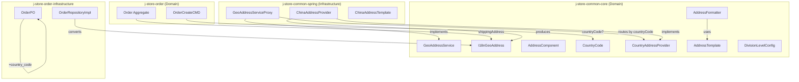
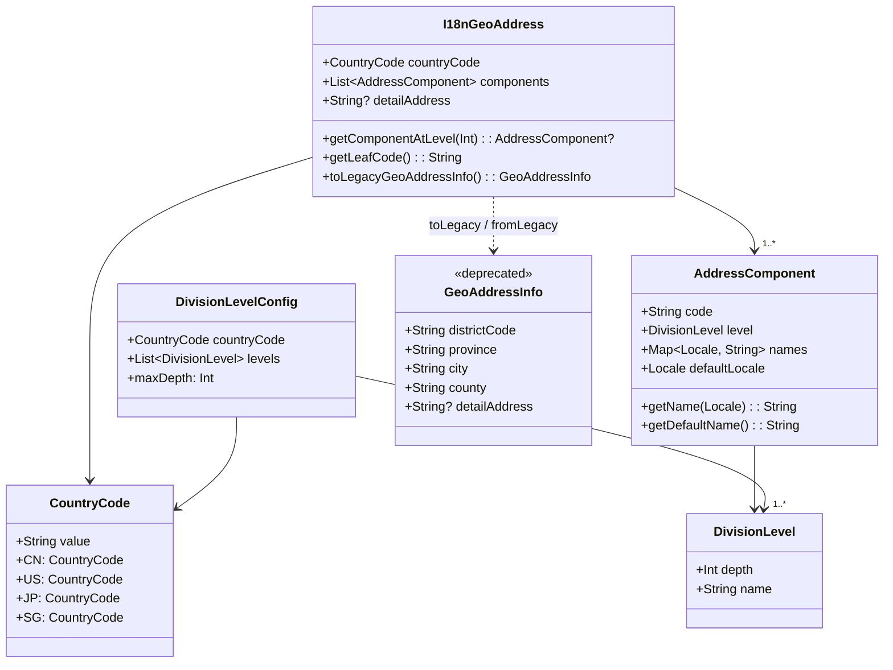

# 设计文档：i18n 多国家地理地址系统支持

## 概述

本设计将 `com.jstore.common.geo` 包中的地址模块从中国专用模型泛化为支持多国家的 i18n 地址系统。核心思路是：

1. 引入通用地址值对象 `I18nGeoAddress` 替代硬编码的 `GeoAddressInfo`，用有序的 `AddressComponent` 列表表达任意国家的行政区划层级
2. 定义 `CountryAddressProvider` 策略接口，每个国家一个实现，负责地址查询、编码验证、层级配置和格式化模板
3. `GeoAddressServiceProxy` 演进为按 `countryCode` 路由的分发器，保留旧接口向后兼容
4. 订单聚合根的 `shippingAddress` 类型从 `GeoAddressInfo` 迁移到 `I18nGeoAddress`，持久化层新增 `country_code` 列并兼容历史数据

设计遵循项目 DDD 准则：值对象不可变、接口定义在 common-core（无 Spring 依赖）、实现放在 common-spring、`Result<T, BusinessError>` 错误处理。

## 架构

### 模块职责划分

```
j-store-common-core (无 Spring 依赖)
├── com.jstore.common.geo
│   ├── I18nGeoAddress          # 通用地址值对象
│   ├── AddressComponent        # 地址组件值对象（含多语言名称）
│   ├── CountryCode             # ISO 3166-1 alpha-2 值对象
│   ├── DivisionLevel           # 通用行政区划层级（替代 DistrictLevel）
│   ├── DivisionLevelConfig     # 国家层级配置值对象
│   ├── AddressTemplate         # 地址格式化模板接口
│   ├── CountryAddressProvider  # 国家地址提供者接口
│   ├── GeoAddressService       # 服务接口（扩展新方法）
│   ├── GeoAddressInfo          # [保留] 旧值对象，标记 @Deprecated
│   ├── AddressErrors           # 错误常量（扩展）
│   └── AddressFormatter        # 地址格式化工具

j-store-common-spring (Spring 依赖)
├── com.jstore.common.geo
│   ├── GeoAddressServiceProxy       # @Service 路由分发器
│   ├── ChinaAddressProvider         # CN 实现（复用 Excel 数据加载）
│   ├── ChinaGeoAddressServiceExcelImpl  # [保留] 旧实现，标记 @Deprecated
│   └── ChinaAddressTemplate         # 中国地址格式化模板
```

### 整体架构图



### 关键设计决策

| 决策 | 选择 | 理由 |
|------|------|------|
| 通用地址用有序列表而非固定字段 | `List<AddressComponent>` | 不同国家层级数量不同（1~4级），固定字段无法泛化 |
| `GeoAddressInfo` 保留但标记废弃 | `@Deprecated` + 兼容构造 | 避免一次性大规模重构，允许渐进迁移 |
| `CountryCode` 作为值对象 | `data class CountryCode(val value: String)` | 封装 ISO 3166-1 验证逻辑，避免原始字符串传播 |
| 格式化模板作为接口 | `AddressTemplate` 接口 | 各国格式化逻辑差异大（排列顺序、分隔符），策略模式更灵活 |
| Provider 自动发现 | Spring DI `List<CountryAddressProvider>` | 新增国家只需实现接口并注册 Bean，无需修改路由代码 |
| 历史数据默认 CN | `country_code` 列 DEFAULT 'CN' | 现有数据全部为中国地址，保证无缝兼容 |


## 组件与接口

### 1. CountryCode 值对象

位置：`j-store-common-core` / `com.jstore.common.geo`

```kotlin
data class CountryCode(val value: String) {
    init {
        require(value.length == 2 && value.all { it.isUpperCase() }) {
            "CountryCode must be ISO 3166-1 alpha-2 format: $value"
        }
    }

    companion object {
        val CN = CountryCode("CN")
        val US = CountryCode("US")
        val JP = CountryCode("JP")
        val SG = CountryCode("SG")
    }
}
```

### 2. DivisionLevel 与 DivisionLevelConfig

位置：`j-store-common-core` / `com.jstore.common.geo`

```kotlin
/**
 * 通用行政区划层级，Level 0 = 国家级，Level 1 = 最高行政区划，依次递增
 */
data class DivisionLevel(val depth: Int, val name: String) {
    init {
        require(depth >= 0) { "Division level depth must be non-negative" }
    }
}

/**
 * 国家行政区划层级配置
 */
data class DivisionLevelConfig(
    val countryCode: CountryCode,
    val levels: List<DivisionLevel>
) {
    init {
        require(levels.isNotEmpty()) { "Division levels must not be empty" }
    }

    val maxDepth: Int get() = levels.maxOf { it.depth }
}
```

### 3. AddressComponent 值对象

位置：`j-store-common-core` / `com.jstore.common.geo`

```kotlin
/**
 * 地址组件：一个行政区划节点
 * 包含编码、层级、多语言名称映射
 */
data class AddressComponent(
    val code: String,
    val level: DivisionLevel,
    val names: Map<Locale, String>,
    val defaultLocale: Locale
) {
    init {
        require(code.isNotBlank()) { "Address component code must not be blank" }
        require(names.isNotEmpty()) { "Address component must have at least one locale name" }
        require(names.containsKey(defaultLocale)) {
            "Default locale $defaultLocale must exist in names map"
        }
    }

    /** 获取指定 Locale 的名称，不存在则回退到默认 Locale */
    fun getName(locale: Locale): String = names[locale] ?: names.getValue(defaultLocale)

    /** 获取默认 Locale 的名称 */
    fun getDefaultName(): String = names.getValue(defaultLocale)
}
```

### 4. I18nGeoAddress 通用地址值对象

位置：`j-store-common-core` / `com.jstore.common.geo`

```kotlin
/**
 * 通用 i18n 地址值对象
 * 不可变，表达任意国家的行政区划地址
 */
data class I18nGeoAddress(
    val countryCode: CountryCode,
    val components: List<AddressComponent>,
    val detailAddress: String? = null
) {
    init {
        require(components.isNotEmpty()) { "Address components must not be empty" }
    }

    /** 获取指定层级的组件 */
    fun getComponentAtLevel(depth: Int): AddressComponent? =
        components.find { it.level.depth == depth }

    /** 获取最高层级组件的编码（通常用作地址主编码） */
    fun getLeafCode(): String = components.last().code

    /**
     * 向后兼容：转换为旧 GeoAddressInfo（仅适用于中国地址）
     */
    @Deprecated("Use I18nGeoAddress directly")
    fun toLegacyGeoAddressInfo(): GeoAddressInfo {
        val province = getComponentAtLevel(1)?.getDefaultName() ?: ""
        val city = getComponentAtLevel(2)?.getDefaultName() ?: ""
        val county = getComponentAtLevel(3)?.getDefaultName() ?: ""
        val districtCode = getLeafCode()
        return GeoAddressInfo(districtCode, province, city, county, detailAddress)
    }

    companion object {
        /**
         * 向后兼容：从旧 GeoAddressInfo 构造（默认中国地址）
         */
        @Deprecated("Use I18nGeoAddress constructor directly")
        fun fromLegacyGeoAddressInfo(info: GeoAddressInfo): I18nGeoAddress {
            val zhCN = Locale.SIMPLIFIED_CHINESE
            val components = mutableListOf<AddressComponent>()

            if (info.province.isNotBlank()) {
                components.add(AddressComponent(
                    code = GeoAddressInfo.getProvinceCode(info.districtCode),
                    level = DivisionLevel(1, "省"),
                    names = mapOf(zhCN to info.province),
                    defaultLocale = zhCN
                ))
            }
            if (info.city.isNotBlank()) {
                components.add(AddressComponent(
                    code = GeoAddressInfo.getCityCode(info.districtCode),
                    level = DivisionLevel(2, "市"),
                    names = mapOf(zhCN to info.city),
                    defaultLocale = zhCN
                ))
            }
            if (info.county.isNotBlank()) {
                components.add(AddressComponent(
                    code = info.districtCode,
                    level = DivisionLevel(3, "区/县"),
                    names = mapOf(zhCN to info.county),
                    defaultLocale = zhCN
                ))
            }

            return I18nGeoAddress(
                countryCode = CountryCode.CN,
                components = components,
                detailAddress = info.detailAddress
            )
        }
    }
}
```

### 5. AddressTemplate 接口与 AddressFormatter

位置：`j-store-common-core` / `com.jstore.common.geo`

```kotlin
/**
 * 地址格式化模板接口
 * 每个国家提供自己的实现，定义排列顺序和分隔符
 */
interface AddressTemplate {
    fun format(components: List<AddressComponent>, detailAddress: String?, locale: Locale): String
}

/**
 * 地址格式化工具
 */
object AddressFormatter {
    fun format(address: I18nGeoAddress, template: AddressTemplate, locale: Locale): String {
        if (address.components.isEmpty()) return ""
        return template.format(address.components, address.detailAddress, locale)
    }
}
```

### 6. CountryAddressProvider 接口

位置：`j-store-common-core` / `com.jstore.common.geo`

```kotlin
/**
 * 国家地址提供者接口
 * 每个支持的国家实现此接口，负责地址查询、编码验证、层级配置和格式化
 */
interface CountryAddressProvider {
    /** 该 Provider 支持的国家编码 */
    fun supportedCountryCode(): CountryCode

    /** 根据地址编码查询地址 */
    fun getByCode(addressCode: String): Result<I18nGeoAddress, BusinessError>

    /** 验证地址编码格式是否合法 */
    fun validateCode(addressCode: String): Result<Unit, BusinessError>

    /** 获取该国家的行政区划层级配置 */
    fun getDivisionLevelConfig(): DivisionLevelConfig

    /** 获取该国家的地址格式化模板 */
    fun getAddressTemplate(): AddressTemplate
}
```

### 7. GeoAddressService 接口演进

位置：`j-store-common-core` / `com.jstore.common.geo`

```kotlin
interface GeoAddressService {
    /** [保留] 旧方法，默认中国地址查询 */
    fun getByDistrictCode(districtCode: String): Result<GeoAddressInfo, BusinessError>

    /** [新增] 按国家编码查询地址 */
    fun getByCode(countryCode: String, addressCode: String): Result<I18nGeoAddress, BusinessError>
}
```

### 8. GeoAddressServiceProxy 演进

位置：`j-store-common-spring` / `com.jstore.common.geo`

```kotlin
@Service
class GeoAddressServiceProxy(
    providers: List<CountryAddressProvider>
) : GeoAddressService {

    private val providerMap: Map<CountryCode, CountryAddressProvider>

    init {
        val grouped = providers.groupBy { it.supportedCountryCode() }
        grouped.forEach { (code, list) ->
            require(list.size == 1) {
                "Duplicate CountryAddressProvider for $code: ${list.map { it::class.simpleName }}"
            }
        }
        providerMap = grouped.mapValues { it.value.single() }
    }

    override fun getByDistrictCode(districtCode: String): Result<GeoAddressInfo, BusinessError> {
        // 向后兼容：默认中国
        return getByCode(CountryCode.CN.value, districtCode).map { it.toLegacyGeoAddressInfo() }
    }

    override fun getByCode(countryCode: String, addressCode: String): Result<I18nGeoAddress, BusinessError> {
        val code = try {
            CountryCode(countryCode)
        } catch (e: IllegalArgumentException) {
            return Failure(AddressErrors.UnsupportedCountry.msg("非法国家编码: $countryCode"))
        }
        val provider = providerMap[code]
            ?: return Failure(AddressErrors.UnsupportedCountry.msg("不支持的国家: $countryCode"))
        return provider.getByCode(addressCode)
    }
}
```

### 9. ChinaAddressProvider 实现

位置：`j-store-common-spring` / `com.jstore.common.geo`

```kotlin
@Component
class ChinaAddressProvider : CountryAddressProvider {

    // 复用现有 Excel 数据加载逻辑
    private val excelService = ChinaGeoAddressServiceExcelImpl()
    private val template = ChinaAddressTemplate()

    override fun supportedCountryCode(): CountryCode = CountryCode.CN

    override fun getByCode(addressCode: String): Result<I18nGeoAddress, BusinessError> {
        return validateCode(addressCode).fold(
            onSuccess = {
                excelService.getByDistrictCode(addressCode).map { info ->
                    I18nGeoAddress.fromLegacyGeoAddressInfo(info)
                }
            },
            onFailure = { Failure(it) }
        )
    }

    override fun validateCode(addressCode: String): Result<Unit, BusinessError> {
        if (addressCode.length != 6 || !addressCode.all { it.isDigit() }) {
            return Failure(AddressErrors.InvalidCode.msg("中国地址编码必须为6位数字: $addressCode"))
        }
        return Success(Unit)
    }

    override fun getDivisionLevelConfig(): DivisionLevelConfig = DivisionLevelConfig(
        countryCode = CountryCode.CN,
        levels = listOf(
            DivisionLevel(1, "省"),
            DivisionLevel(2, "市"),
            DivisionLevel(3, "区/县")
        )
    )

    override fun getAddressTemplate(): AddressTemplate = template
}
```

### 10. ChinaAddressTemplate

位置：`j-store-common-spring` / `com.jstore.common.geo`

```kotlin
class ChinaAddressTemplate : AddressTemplate {
    /** 中国地址：从大到小排列（省 → 市 → 区/县 → 详细地址） */
    override fun format(
        components: List<AddressComponent>,
        detailAddress: String?,
        locale: Locale
    ): String {
        val sorted = components.sortedBy { it.level.depth }
        val parts = sorted.map { it.getName(locale) } +
            listOfNotNull(detailAddress)
        return parts.filter { it.isNotBlank() }.joinToString("")
    }
}
```

### 11. AddressErrors 扩展

位置：`j-store-common-core` / `com.jstore.common.geo`

```kotlin
object AddressErrors {
    val IllegalAddressCode = BusinessError("Illegal address code", "Address.Code.Illegal", 400)
    val InvalidCode = BusinessError("Invalid address code", "Address.Code.Invalid", 400)
    val UnsupportedCountry = BusinessError("Unsupported country", "Address.Country.Unsupported", 400)
    val ComponentsEmpty = BusinessError("Address components empty", "Address.Components.Empty", 400)
}
```


## 数据模型

### 值对象关系图



### 数据库 Schema 变更

#### orders 表新增列

```sql
ALTER TABLE orders ADD COLUMN country_code VARCHAR(2) NOT NULL DEFAULT 'CN';
```

现有数据自动获得 `CN` 默认值，无需数据迁移。

#### OrderPO 变更

```kotlin
@Entity
@Table(name = "orders")
class OrderPO(
    // ... 现有字段保持不变 ...

    @Column(name = "country_code", nullable = false, length = 2)
    var countryCode: String = "CN",  // 新增

    // districtCode, province, city, county, detailAddress 保持不变
)
```

### 订单聚合根适配

#### Order 接口变更

```kotlin
interface Order : AgreeGate<OrderId> {
    // shippingAddress 类型从 GeoAddressInfo 变更为 I18nGeoAddress
    val shippingAddress: I18nGeoAddress
    // ... 其余不变
}
```

#### OrderCreateCMD 变更

```kotlin
data class OrderCreateCMD(
    val buyerUid: Long,
    val buyerPhone: String?,
    val buyerName: String?,
    val shippingDistrictCode: String,
    val countryCode: String? = null,  // 新增，缺省为 CN
    val items: List<OrderItemCMD>,
)
```

#### OrderRepositoryImpl Converter 变更

```kotlin
// toPO: 从 I18nGeoAddress 提取字段写入 PO
fun toPO(order: Order): OrderPO {
    val address = order.shippingAddress
    return OrderPO(
        // ...
        countryCode = address.countryCode.value,
        districtCode = address.getLeafCode(),
        province = address.getComponentAtLevel(1)?.getDefaultName() ?: "",
        city = address.getComponentAtLevel(2)?.getDefaultName() ?: "",
        county = address.getComponentAtLevel(3)?.getDefaultName() ?: "",
        detailAddress = address.detailAddress,
        // ...
    )
}

// toDomain: 从 PO 字段还原 I18nGeoAddress
fun toDomain(po: OrderPO): Order {
    val countryCode = CountryCode(po.countryCode)
    val defaultLocale = Locale.SIMPLIFIED_CHINESE // 历史数据默认中文
    val components = mutableListOf<AddressComponent>()

    if (po.province.isNotBlank()) {
        components.add(AddressComponent(
            code = GeoAddressInfo.getProvinceCode(po.districtCode),
            level = DivisionLevel(1, "省"),
            names = mapOf(defaultLocale to po.province),
            defaultLocale = defaultLocale
        ))
    }
    if (po.city.isNotBlank()) {
        components.add(AddressComponent(
            code = GeoAddressInfo.getCityCode(po.districtCode),
            level = DivisionLevel(2, "市"),
            names = mapOf(defaultLocale to po.city),
            defaultLocale = defaultLocale
        ))
    }
    if (po.county.isNotBlank()) {
        components.add(AddressComponent(
            code = po.districtCode,
            level = DivisionLevel(3, "区/县"),
            names = mapOf(defaultLocale to po.county),
            defaultLocale = defaultLocale
        ))
    }

    val address = I18nGeoAddress(
        countryCode = countryCode,
        components = components,
        detailAddress = po.detailAddress
    )
    // ... 构造 OrderImpl
}
```

### 各国地址数据示例

| 国家 | CountryCode | 层级 | 示例地址 |
|------|-------------|------|----------|
| 中国 | CN | 省→市→区/县 | 北京市 / 朝阳区 / 三里屯街道xx号 |
| 美国 | US | State→City | CA / San Francisco / 123 Main St |
| 日本 | JP | 都道府県→市区町村→町域 | 東京都 / 渋谷区 / 神宮前1-2-3 |
| 新加坡 | SG | Planning Area | Orchard / 123 Orchard Rd |

### JSON 序列化格式

```json
{
  "countryCode": "CN",
  "components": [
    {
      "code": "110000",
      "level": { "depth": 1, "name": "省" },
      "names": { "zh-CN": "北京市", "en-US": "Beijing" },
      "defaultLocale": "zh-CN"
    },
    {
      "code": "110100",
      "level": { "depth": 2, "name": "市" },
      "names": { "zh-CN": "北京市", "en-US": "Beijing" },
      "defaultLocale": "zh-CN"
    },
    {
      "code": "110105",
      "level": { "depth": 3, "name": "区/县" },
      "names": { "zh-CN": "朝阳区", "en-US": "Chaoyang" },
      "defaultLocale": "zh-CN"
    }
  ],
  "detailAddress": "三里屯街道xx号"
}
```


## 正确性属性

*正确性属性是一种在系统所有合法执行中都应成立的特征或行为——本质上是对系统应做什么的形式化陈述。属性是人类可读规格说明与机器可验证正确性保证之间的桥梁。*

### Property 1: 值对象构造不变量

*For any* 合法的 `I18nGeoAddress`，其 `countryCode` 必须是有效的 ISO 3166-1 alpha-2 编码，`components` 列表必须非空，且每个 `AddressComponent` 的 `code` 非空、`names` 映射非空、`defaultLocale` 存在于 `names` 映射中。

**Validates: Requirements 1.1, 1.3, 1.4, 3.1, 3.4**

### Property 2: CountryCode 验证

*For any* 字符串，`CountryCode` 构造应当且仅当该字符串恰好为2个大写字母时成功；其他任何输入都应被拒绝。

**Validates: Requirements 1.2**

### Property 3: Locale 名称解析与回退

*For any* `AddressComponent` 和任意 `Locale`，如果该 `Locale` 存在于 `names` 映射中，`getName(locale)` 应返回对应名称；如果不存在，应回退返回 `defaultLocale` 对应的名称。

**Validates: Requirements 3.2, 3.3**

### Property 4: 国家特定地址格式化顺序

*For any* 合法的 `I18nGeoAddress`，使用对应国家的 `AddressTemplate` 格式化后，中国和日本地址的行政区划应按层级从大到小排列（depth 升序），美国地址应按从小到大排列（detail 在前，depth 降序）。

**Validates: Requirements 4.2, 4.3, 4.4**

### Property 5: 格式化使用指定 Locale 的名称

*For any* 合法的 `I18nGeoAddress` 和任意目标 `Locale`，使用 `AddressFormatter.format` 格式化后的字符串应包含每个 `AddressComponent` 在该 `Locale` 下的名称（或回退名称）。

**Validates: Requirements 4.5**

### Property 6: 国家特定地址编码验证

*For any* 字符串，中国的 `validateCode` 应当且仅当该字符串为恰好6位数字时返回成功；美国的 `validateCode` 应当且仅当该字符串为恰好2位大写字母时返回成功。不合法的编码应返回错误码 `Address.Code.Invalid`。

**Validates: Requirements 5.1, 5.2, 5.3**

### Property 7: 不支持的国家编码错误

*For any* 合法的 `CountryCode`，如果该国家未在系统中注册 `CountryAddressProvider`，`getByCode` 应返回包含错误码 `Address.Country.Unsupported` 的 `BusinessError`。

**Validates: Requirements 2.6, 6.4**

### Property 8: 服务路由与向后兼容

*For any* 合法的中国行政区划编码，`getByDistrictCode(code)` 的返回结果应等价于 `getByCode("CN", code)` 转换为 `GeoAddressInfo` 后的结果。

**Validates: Requirements 6.2, 6.3**

### Property 9: 旧地址模型往返转换

*For any* 合法的 `GeoAddressInfo`（中国地址），`I18nGeoAddress.fromLegacyGeoAddressInfo(info).toLegacyGeoAddressInfo()` 应产生与原始 `info` 在 `districtCode`、`province`、`city`、`county`、`detailAddress` 字段上等价的结果。

**Validates: Requirements 7.1, 7.6**

### Property 10: JSON 序列化往返

*For any* 合法的 `I18nGeoAddress`，序列化为 JSON 后再反序列化应产生与原始对象等价的结果。

**Validates: Requirements 9.1, 9.2, 9.3, 9.4**

### Property 11: JSON 反序列化缺失字段错误处理

*For any* 缺少必要字段（`countryCode` 或 `components`）的 JSON，反序列化应产生描述性的错误信息而非静默失败。

**Validates: Requirements 9.5**


## 错误处理

### 错误常量定义

所有错误通过 `AddressErrors` 对象集中定义，遵循项目 `Result<T, BusinessError>` 模式：

| 错误常量 | errorCode | httpCode | 触发场景 |
|----------|-----------|----------|----------|
| `IllegalAddressCode` | `Address.Code.Illegal` | 400 | [保留] 旧接口编码格式错误 |
| `InvalidCode` | `Address.Code.Invalid` | 400 | 地址编码不符合国家格式规则 |
| `UnsupportedCountry` | `Address.Country.Unsupported` | 400 | 国家编码未注册或非法 |
| `ComponentsEmpty` | `Address.Components.Empty` | 400 | 地址组件列表为空 |

### 错误传播策略

```kotlin
// CountryAddressProvider 内部错误 → 通过 Result 传播
fun getByCode(addressCode: String): Result<I18nGeoAddress, BusinessError>

// GeoAddressServiceProxy 路由错误 → 直接返回 Failure
val provider = providerMap[code]
    ?: return Failure(AddressErrors.UnsupportedCountry.msg("不支持的国家: $countryCode"))

// 值对象构造错误 → init 块 require（编程错误，非业务错误）
data class CountryCode(val value: String) {
    init { require(value.length == 2 && value.all { it.isUpperCase() }) }
}
```

### 错误处理原则

1. **业务错误**（用户输入不合法）：使用 `Result<T, BusinessError>` + `Failure` 返回，调用方通过 `fold`/`onFailure` 处理
2. **编程错误**（违反值对象不变量）：使用 `require` / `IllegalArgumentException`，表示调用方代码有 bug
3. **启动错误**（Provider 重复注册）：使用 `require` 在 `init` 块中抛出，阻止应用启动
4. **JSON 反序列化错误**：捕获 Jackson 异常，转换为描述性 `BusinessError` 返回

## 测试策略

### 属性测试（Property-Based Testing）

使用 **Kotest Property Testing**（`io.kotest:kotest-property:5.9.1`），项目已在 `gradle/libs.versions.toml` 中配置。

每个属性测试：
- 最少运行 **100 次迭代**
- 使用注释标注对应的设计属性：`// Feature: geo-address-i18n, Property {N}: {title}`
- 使用 Kotest 的 `Arb`（Arbitrary）生成器生成随机输入

#### 需要实现的自定义生成器

| 生成器 | 描述 |
|--------|------|
| `Arb.countryCode()` | 生成合法的 ISO 3166-1 alpha-2 编码 |
| `Arb.addressComponent()` | 生成包含随机多语言名称的 AddressComponent |
| `Arb.i18nGeoAddress()` | 生成合法的 I18nGeoAddress（随机国家、随机组件） |
| `Arb.geoAddressInfo()` | 生成合法的旧 GeoAddressInfo（中国地址） |
| `Arb.locale()` | 从支持的 Locale 集合中随机选取 |
| `Arb.invalidCountryCode()` | 生成不合法的国家编码字符串 |

#### 属性测试清单

| Property | 测试文件 | 模块 |
|----------|----------|------|
| Property 1: 值对象构造不变量 | `I18nGeoAddressPropertyTest.kt` | common-core |
| Property 2: CountryCode 验证 | `CountryCodePropertyTest.kt` | common-core |
| Property 3: Locale 名称解析与回退 | `AddressComponentPropertyTest.kt` | common-core |
| Property 4: 格式化顺序 | `AddressFormatterPropertyTest.kt` | common-spring |
| Property 5: 格式化使用指定 Locale | `AddressFormatterPropertyTest.kt` | common-spring |
| Property 6: 编码验证 | `AddressCodeValidationPropertyTest.kt` | common-spring |
| Property 7: 不支持的国家错误 | `GeoAddressServiceProxyPropertyTest.kt` | common-spring |
| Property 8: 服务路由与向后兼容 | `GeoAddressServiceProxyPropertyTest.kt` | common-spring |
| Property 9: 旧地址模型往返 | `I18nGeoAddressPropertyTest.kt` | common-core |
| Property 10: JSON 序列化往返 | `I18nGeoAddressSerializationPropertyTest.kt` | common-core |
| Property 11: JSON 反序列化错误 | `I18nGeoAddressSerializationPropertyTest.kt` | common-core |

### 单元测试（Example-Based）

| 测试场景 | 测试文件 | 对应需求 |
|----------|----------|----------|
| 各国层级配置正确性 | `DivisionLevelConfigTest.kt` | 2.2, 2.3, 2.4, 2.5 |
| 中国双语名称查询 | `AddressComponentTest.kt` | 3.5 |
| 各国 AddressTemplate 存在性 | `AddressTemplateTest.kt` | 4.1 |
| 空组件格式化返回空串 | `AddressFormatterTest.kt` | 4.6 |
| 历史数据默认 CN | `OrderPOConverterTest.kt` | 7.4 |
| OrderCreateCMD 缺省 CN | `OrderFactoryTest.kt` | 7.5 |
| Provider 重复注册报错 | `GeoAddressServiceProxyTest.kt` | 8.4 |
| ChinaAddressProvider 存在性 | `ChinaAddressProviderTest.kt` | 8.5 |

### 集成测试

| 测试场景 | 测试文件 | 对应需求 |
|----------|----------|----------|
| Spring 自动发现 Provider | `GeoAddressServiceIntegrationTest.kt` | 8.3 |
| 订单持久化地址往返 | `OrderRepositoryIntegrationTest.kt` | 7.2, 7.3 |

### 测试配置

```kotlin
// Kotest 属性测试配置示例
class I18nGeoAddressPropertyTest : FunSpec({
    test("Property 10: JSON serialization round-trip") {
        // Feature: geo-address-i18n, Property 10: JSON 序列化往返
        checkAll(100, Arb.i18nGeoAddress()) { address ->
            val json = objectMapper.writeValueAsString(address)
            val deserialized = objectMapper.readValue<I18nGeoAddress>(json)
            deserialized shouldBe address
        }
    }
})
```
