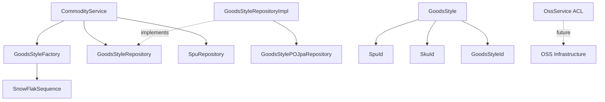
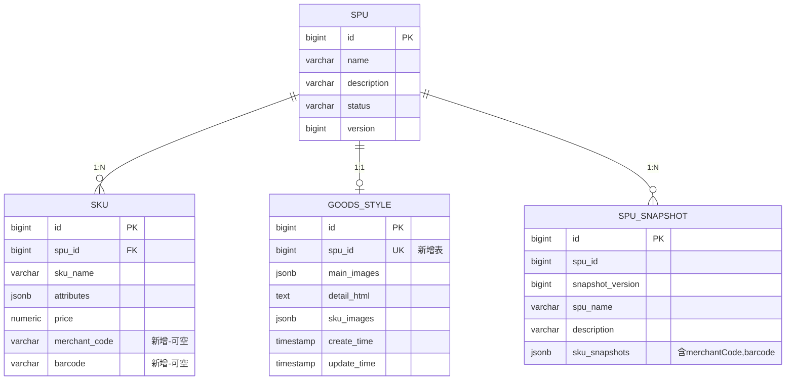

# 设计文档：商品展示样式（GoodsStyle）与 SKU 编码增强

## 概述

本设计为 j-store 商品模块引入两项增强：

1. **GoodsStyle 独立实体**：管理 SPU 的前端展示内容（主图、详情 HTML、SKU 图片），作为独立实体存在于 `domain/commodity/` 包下，通过 `SpuId` 关联 SPU，避免 SPU 聚合过重。
2. **SKU 编码字段扩展**：为 SKU 实体新增 `merchantCode`（商家内部货号）和 `barcode`（EAN/UPC 标准条形码）两个可空字段，同步扩展到快照体系。

### 设计决策与理由

| 决策 | 理由 |
|---|---|
| GoodsStyle 作为独立实体而非 SPU 聚合内的值对象 | 展示内容（图片列表、HTML 富文本）数据量大，放入 SPU 聚合会导致每次加载 SPU 时都携带大量展示数据，影响性能 |
| SKU 图片集中在 GoodsStyle 中管理（`Map<SkuId, List<ImageKey>>`） | 展示资源统一管理，避免 SKU 实体膨胀；SKU 图片的生命周期与展示样式一致 |
| 图片仅存储 key 标识，不存储完整 URL | URL 可能过期或变更，通过 OSS ACL 接口动态生成，保持数据稳定性 |
| OSS 服务仅定义 ACL 接口 | 本次聚焦数据模型，OSS 实现属于基础设施关注点，后续独立迭代 |
| merchantCode 和 barcode 均为可空 | 并非所有商家都有内部货号或条形码，保持灵活性 |

## 架构

### 模块归属

```
j-store-goods (领域层)
├── domain/commodity/
│   ├── GoodsStyle.kt              # GoodsStyle 实体接口 + 实现
│   ├── GoodsStyleId.kt            # GoodsStyle ID 值对象
│   ├── GoodsStyleFactory.kt       # GoodsStyle 工厂
│   ├── GoodsStyleRepository.kt    # GoodsStyle 仓储接口
│   ├── Sku.kt                     # (修改) 新增 merchantCode, barcode
│   ├── SpuFactory.kt              # (修改) createSku 支持新字段
│   ├── CommodityErrors.kt         # (修改) 新增图片重复错误
│   ├── comand/
│   │   ├── SkuCreateCmd.kt        # (修改) 新增 merchantCode, barcode
│   │   └── GoodsStyleSaveCmd.kt   # GoodsStyle 保存命令
│   └── snapshot/
│       ├── SpuSnapshot.kt         # (修改) SkuSnapshot 新增编码字段
│       └── SpuSnapshotFactory.kt  # (修改) 快照包含编码字段
├── acl/
│   └── OssService.kt              # OSS 服务 ACL 接口
└── service/
    └── CommodityService.kt        # (修改) 新增 GoodsStyle 保存/更新方法

j-store-goods-infrastructure (基础设施层)
├── domain/commodity/
│   ├── GoodsStyleRepositoryImpl.kt    # GoodsStyle 仓储实现
│   ├── SpuRepositoryImpl.kt           # (修改) Converter 支持新字段
│   ├── SpuSnapshotRepositoryImpl.kt   # (修改) Converter 支持编码字段
│   └── persistence/
│       ├── GoodsStylePO.kt            # GoodsStyle JPA 持久化对象
│       ├── GoodsStylePOJpaRepository.kt # Spring Data JPA 接口
│       └── SkuPO.kt                   # (修改) 新增 merchant_code, barcode

docker/postgres/init/
└── 07-goods-style-sku-code.sql        # 数据库迁移脚本
```

### 依赖关系



## 组件与接口

### 1. GoodsStyleId — ID 值对象

```kotlin
// domain/commodity/GoodsStyleId.kt
class GoodsStyleId(override val value: Long) : Id<Long>(value)
```

遵循项目中 `SpuId`、`SkuId` 的既有模式。

### 2. GoodsStyle — 独立实体

```kotlin
// domain/commodity/GoodsStyle.kt
interface GoodsStyle : Entity<GoodsStyleId> {
    val spuId: SpuId
    val mainImages: List<String>
    val detailHtml: String
    val skuImages: Map<SkuId, List<String>>

    fun updateMainImages(images: List<String>): Result<Unit, BusinessError>
    fun updateDetailHtml(html: String): Result<Unit, BusinessError>
    fun updateSkuImages(skuId: SkuId, images: List<String>): Result<Unit, BusinessError>
}
```

**设计说明**：
- 实现 `Entity<GoodsStyleId>` 接口，不实现 `AgreeGate`，因为 GoodsStyle 不是聚合根（不需要领域事件队列）
- `mainImages` 和 `skuImages` 中的 `String` 即为 `ImageKey`，使用 `String` 类型保持简洁
- 提供 `updateXxx` 方法封装业务校验逻辑（如重复图片检测），避免贫血模型
- 通过 `SpuId` 关联 SPU，跨聚合仅通过 ID 引用

**实现类 GoodsStyleImpl**：
```kotlin
class GoodsStyleImpl(
    override val id: GoodsStyleId,
    override val spuId: SpuId,
    private var _mainImages: MutableList<String>,
    private var _detailHtml: String,
    private val _skuImages: MutableMap<SkuId, List<String>>,
) : GoodsStyle {
    override val mainImages: List<String> get() = _mainImages.toList()
    override val detailHtml: String get() = _detailHtml
    override val skuImages: Map<SkuId, List<String>> get() = _skuImages.toMap()

    override fun updateMainImages(images: List<String>): Result<Unit, BusinessError> {
        if (images.size != images.distinct().size) {
            return Failure(CommodityErrors.DUPLICATE_IMAGE_KEY)
        }
        _mainImages = images.toMutableList()
        return Success(Unit)
    }

    override fun updateDetailHtml(html: String): Result<Unit, BusinessError> {
        _detailHtml = html
        return Success(Unit)
    }

    override fun updateSkuImages(skuId: SkuId, images: List<String>): Result<Unit, BusinessError> {
        if (images.size != images.distinct().size) {
            return Failure(CommodityErrors.DUPLICATE_IMAGE_KEY)
        }
        _skuImages[skuId] = images.toList()
        return Success(Unit)
    }
}
```

### 3. GoodsStyleRepository — 仓储接口

```kotlin
// domain/commodity/GoodsStyleRepository.kt
interface GoodsStyleRepository : Repository<GoodsStyleId, GoodsStyle> {
    fun findBySpuId(spuId: SpuId): GoodsStyle?
}
```

扩展基础 `Repository` 接口，新增按 `SpuId` 查询方法，因为业务场景中主要通过 SPU 关联查找展示样式。

### 4. GoodsStyleFactory — 工厂

```kotlin
// domain/commodity/GoodsStyleFactory.kt
interface GoodsStyleFactory {
    fun create(
        spuId: SpuId,
        mainImages: List<String>,
        detailHtml: String,
        skuImages: Map<SkuId, List<String>>,
    ): GoodsStyle
}

class GoodsStyleFactoryImpl(
    private val snowFlakSequence: SnowFlakSequence,
) : GoodsStyleFactory {
    override fun create(
        spuId: SpuId,
        mainImages: List<String>,
        detailHtml: String,
        skuImages: Map<SkuId, List<String>>,
    ): GoodsStyle {
        return GoodsStyleImpl(
            id = GoodsStyleId(snowFlakSequence.nextId()),
            spuId = spuId,
            _mainImages = mainImages.toMutableList(),
            _detailHtml = detailHtml,
            _skuImages = skuImages.toMutableMap(),
        )
    }
}
```

### 5. GoodsStyleSaveCmd — 保存命令

```kotlin
// domain/commodity/comand/GoodsStyleSaveCmd.kt
data class GoodsStyleSaveCmd(
    val spuId: SpuId,
    val mainImages: List<String>,
    val detailHtml: String,
    val skuImages: Map<SkuId, List<String>>,
) {
    fun verify(): Result<Boolean, BusinessError> {
        if (mainImages.size != mainImages.distinct().size) {
            return Failure(CommodityErrors.DUPLICATE_IMAGE_KEY)
        }
        for ((_, images) in skuImages) {
            if (images.size != images.distinct().size) {
                return Failure(CommodityErrors.DUPLICATE_IMAGE_KEY)
            }
        }
        return Success(true)
    }
}
```

### 6. OssService — ACL 接口

```kotlin
// acl/OssService.kt
interface OssService {
    fun generateUrl(imageKey: String): String
    fun generateUrls(imageKeys: List<String>): List<String>
}
```

纯接口定义，不依赖任何框架。未来在 `j-store-goods-infrastructure` 中提供实现。

### 7. SKU 实体扩展

**Sku 接口新增**：
```kotlin
interface Sku : Entity<SkuId> {
    val skuName: String
    val attributes: List<Attribute<String, String>>
    val price: Price
    val merchantCode: String?   // 新增：商家内部货号
    val barcode: String?        // 新增：标准条形码
}
```

**SkuImpl 扩展**：
```kotlin
class SkuImpl(
    override val id: SkuId,
    override val skuName: String,
    override val attributes: List<Attribute<String, String>>,
    override val price: Price,
    override val merchantCode: String? = null,  // 新增
    override val barcode: String? = null,        // 新增
) : Sku
```

**SkuCreateCmd 扩展**：
```kotlin
data class SkuCreateCmd(
    val spuId: SpuId,
    val skuName: String,
    val attributes: List<Attribute<String, String>>,
    val price: Price,
    val merchantCode: String? = null,  // 新增
    val barcode: String? = null,       // 新增
)
```

### 8. SkuSnapshot 扩展

```kotlin
data class SkuSnapshot(
    val skuId: SkuId,
    val skuName: String,
    val attributes: List<Attribute<String, String>>,
    val price: Price,
    val merchantCode: String? = null,  // 新增
    val barcode: String? = null,       // 新增
)
```

### 9. CommodityService 扩展

```kotlin
// 新增方法
fun saveGoodsStyle(cmd: GoodsStyleSaveCmd): Result<GoodsStyle, BusinessError> {
    cmd.verify().onFailure { return Failure(it) }
    
    // 验证 SPU 存在
    spuRepository.findById(cmd.spuId) ?: return Failure(CommodityErrors.SPU_NOT_FOUND)
    
    // 查找已有的 GoodsStyle，存在则更新，不存在则创建
    val existing = goodsStyleRepository.findBySpuId(cmd.spuId)
    val goodsStyle = if (existing != null) {
        existing.updateMainImages(cmd.mainImages).onFailure { return Failure(it) }
        existing.updateDetailHtml(cmd.detailHtml).onFailure { return Failure(it) }
        for ((skuId, images) in cmd.skuImages) {
            existing.updateSkuImages(skuId, images).onFailure { return Failure(it) }
        }
        existing
    } else {
        goodsStyleFactory.create(cmd.spuId, cmd.mainImages, cmd.detailHtml, cmd.skuImages)
    }
    
    return Success(goodsStyleRepository.save(goodsStyle))
}
```

### 10. CommodityErrors 扩展

```kotlin
object CommodityErrors {
    // ... 现有错误 ...
    val DUPLICATE_IMAGE_KEY = BusinessError("图片标识重复", "Goods.DuplicateImageKey", 400)
}
```

## 数据模型

### 新增表：goods_style

```sql
CREATE TABLE IF NOT EXISTS goods_style (
    id              BIGINT       PRIMARY KEY,
    spu_id          BIGINT       NOT NULL,
    main_images     JSONB        NOT NULL DEFAULT '[]',
    detail_html     TEXT         NOT NULL DEFAULT '',
    sku_images      JSONB        NOT NULL DEFAULT '{}',
    create_time     TIMESTAMP    NOT NULL DEFAULT NOW(),
    update_time     TIMESTAMP    NOT NULL DEFAULT NOW()
);

COMMENT ON TABLE goods_style IS '商品展示样式表';
COMMENT ON COLUMN goods_style.main_images IS 'SPU主图列表，有序的ImageKey JSON数组';
COMMENT ON COLUMN goods_style.detail_html IS 'SPU详情页富文本HTML内容';
COMMENT ON COLUMN goods_style.sku_images IS 'SKU图片映射，JSON对象 {skuId: [imageKey]}';

CREATE UNIQUE INDEX IF NOT EXISTS idx_goods_style_spu_id ON goods_style(spu_id);
```

### 修改表：sku

```sql
ALTER TABLE sku ADD COLUMN IF NOT EXISTS merchant_code VARCHAR(128);
ALTER TABLE sku ADD COLUMN IF NOT EXISTS barcode VARCHAR(64);

COMMENT ON COLUMN sku.merchant_code IS '商家内部货号';
COMMENT ON COLUMN sku.barcode IS '标准条形码（EAN/UPC）';
```

### GoodsStylePO — JPA 持久化对象

```kotlin
@Entity
@Table(name = "goods_style")
class GoodsStylePO(
    @Id
    @Column(name = "id")
    var id: Long = 0,

    @Column(name = "spu_id", nullable = false)
    var spuId: Long = 0,

    @Column(name = "main_images", columnDefinition = "jsonb", nullable = false)
    var mainImages: String = "[]",

    @Column(name = "detail_html", columnDefinition = "text", nullable = false)
    var detailHtml: String = "",

    @Column(name = "sku_images", columnDefinition = "jsonb", nullable = false)
    var skuImages: String = "{}",

    @Column(name = "create_time", nullable = false)
    var createTime: LocalDateTime = LocalDateTime.now(),

    @Column(name = "update_time", nullable = false)
    var updateTime: LocalDateTime = LocalDateTime.now(),
)
```

### SkuPO 扩展

```kotlin
@Entity
@Table(name = "sku")
class SkuPO(
    // ... 现有字段 ...
    @Column(name = "merchant_code", length = 128)
    var merchantCode: String? = null,

    @Column(name = "barcode", length = 64)
    var barcode: String? = null,
)
```

### ER 关系图



## 正确性属性

*属性（Property）是指在系统所有有效执行中都应成立的特征或行为——本质上是对系统应做什么的形式化陈述。属性是人类可读规格说明与机器可验证正确性保证之间的桥梁。*

### Property 1: 主图列表顺序保持

*For any* 有效的不含重复元素的 ImageKey 列表，调用 `updateMainImages` 后读取 `mainImages`，返回的列表应与输入列表完全相等（元素和顺序均一致）。

**Validates: Requirements 1.3, 2.1, 2.2, 2.3**

### Property 2: 重复图片标识拒绝

*For any* 包含至少一个重复元素的 ImageKey 列表，调用 `updateMainImages` 或 `updateSkuImages` 应返回 `Failure`，且 GoodsStyle 的原有状态不变。

**Validates: Requirements 2.4, 4.4**

### Property 3: 详情 HTML 存储保持

*For any* 字符串（包括空字符串），调用 `updateDetailHtml` 后读取 `detailHtml`，返回的字符串应与输入完全相等。

**Validates: Requirements 3.1, 3.2**

### Property 4: SKU 图片列表顺序保持

*For any* SkuId 和不含重复元素的 ImageKey 列表，调用 `updateSkuImages` 后读取 `skuImages[skuId]`，返回的列表应与输入列表完全相等（元素和顺序均一致）。

**Validates: Requirements 4.1, 4.2, 4.3**

### Property 5: GoodsStyle Converter 往返一致性

*For any* 有效的 GoodsStyle 领域对象，经过 `Converter.toPO` 转换为 GoodsStylePO 再经过 `Converter.toDomain` 转换回领域对象，结果应与原始对象在所有业务字段上等价（id、spuId、mainImages、detailHtml、skuImages）。

**Validates: Requirements 5.6, 5.7**

### Property 6: SKU Converter 往返一致性（含编码字段）

*For any* 有效的 SKU 领域对象（包含任意 merchantCode 和 barcode 值，含 null），经过 `Converter.toSkuPO` 转换为 SkuPO 再经过 `Converter.toDomainSku` 转换回领域对象，结果应与原始对象在所有字段上等价（包括 merchantCode 和 barcode）。

**Validates: Requirements 8.5, 9.5**

### Property 7: 快照保持 SKU 编码字段

*For any* SPU 及其包含的 SKU 列表（SKU 具有任意 merchantCode 和 barcode 值，含 null），通过 `SpuSnapshotFactory.createSnapshot` 创建快照后，每个 SkuSnapshot 的 merchantCode 和 barcode 应与对应 SKU 的值完全一致。

**Validates: Requirements 10.3, 10.4**

## 错误处理

| 场景 | 错误码 | HTTP 状态码 | 描述 |
|---|---|---|---|
| 主图列表包含重复 ImageKey | `Goods.DuplicateImageKey` | 400 | 调用 `updateMainImages` 时检测到重复 |
| SKU 图片列表包含重复 ImageKey | `Goods.DuplicateImageKey` | 400 | 调用 `updateSkuImages` 时检测到重复 |
| 保存 GoodsStyle 时 SPU 不存在 | `Goods.SpuNotFound` | 404 | CommodityService 校验 SPU 存在性 |
| GoodsStyleSaveCmd 校验失败 | `Goods.DuplicateImageKey` | 400 | 命令层预校验重复图片 |

错误处理遵循项目既有模式：
- 使用 `Result<T, BusinessError>` 返回类型，不抛异常
- 在 `CommodityErrors` 对象中定义错误常量
- 实体方法内部校验业务规则，返回 `Failure`
- 应用服务层使用 `onFailure { return Failure(it) }` 进行错误传播

## 测试策略

### 属性测试（Property-Based Testing）

使用 **Kotest** 的 property testing 模块（`kotest-property`）作为 PBT 框架，与项目 Kotlin 技术栈一致。

**配置要求**：
- 每个属性测试最少运行 **100 次迭代**
- 每个测试通过注释标注对应的设计属性编号
- 标注格式：`// Feature: goods-style-and-sku-code, Property {N}: {property_text}`

**属性测试覆盖**：

| Property | 测试内容 | 生成器 |
|---|---|---|
| Property 1 | 主图列表顺序保持 | 随机生成不含重复的 ImageKey 列表（含空列表） |
| Property 2 | 重复图片标识拒绝 | 随机生成含重复元素的 ImageKey 列表 |
| Property 3 | 详情 HTML 存储保持 | 随机生成任意字符串（含空串、特殊字符、HTML 标签） |
| Property 4 | SKU 图片列表顺序保持 | 随机生成 SkuId + 不含重复的 ImageKey 列表 |
| Property 5 | GoodsStyle Converter 往返 | 随机生成完整 GoodsStyle 对象 |
| Property 6 | SKU Converter 往返（含编码） | 随机生成 SKU 对象（merchantCode/barcode 可为 null） |
| Property 7 | 快照保持 SKU 编码字段 | 随机生成 SPU + SKU 列表（含编码字段） |

### 单元测试（Example-Based）

| 测试场景 | 验证内容 |
|---|---|
| GoodsStyleFactory 创建实例 | 工厂使用 SnowFlakSequence 生成 ID，字段正确赋值 |
| CommodityService.saveGoodsStyle — SPU 不存在 | 返回 SPU_NOT_FOUND 错误 |
| CommodityService.saveGoodsStyle — 新建 | 无已有 GoodsStyle 时创建新记录 |
| CommodityService.saveGoodsStyle — 更新 | 已有 GoodsStyle 时执行更新 |
| SKU 创建含 merchantCode/barcode | SkuCreateCmd 传入编码字段，SKU 正确携带 |
| SKU 创建不含编码字段 | merchantCode 和 barcode 默认为 null |
| OssService 接口编译验证 | 接口定义正确，无框架依赖 |

### 集成测试

| 测试场景 | 验证内容 |
|---|---|
| GoodsStyle 持久化往返 | 通过数据库保存和查询验证完整 round-trip |
| goods_style 表唯一索引 | 同一 SPU 创建两个 GoodsStyle 应失败 |
| SKU 新字段持久化 | merchantCode 和 barcode 正确存储和读取 |
| 快照含编码字段 | 创建快照后查询，验证 SkuSnapshot 包含编码信息 |

