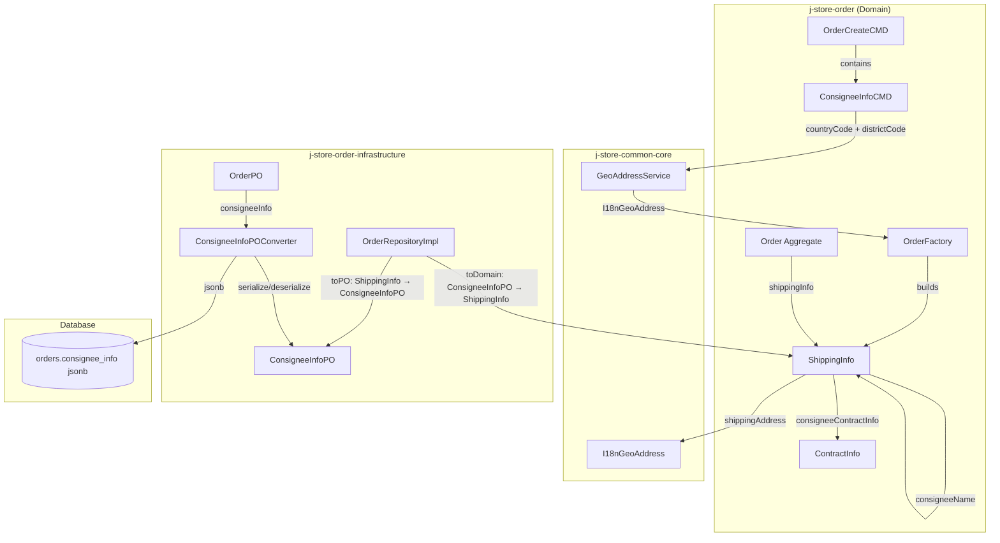
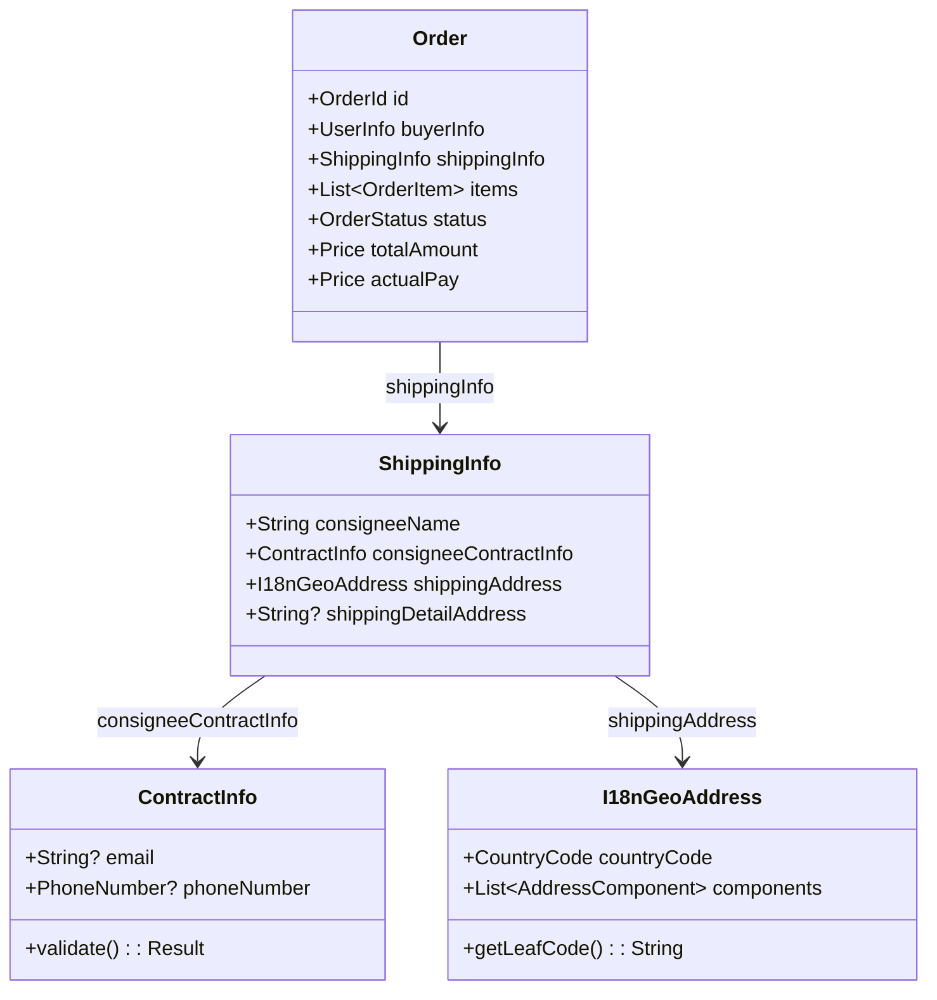
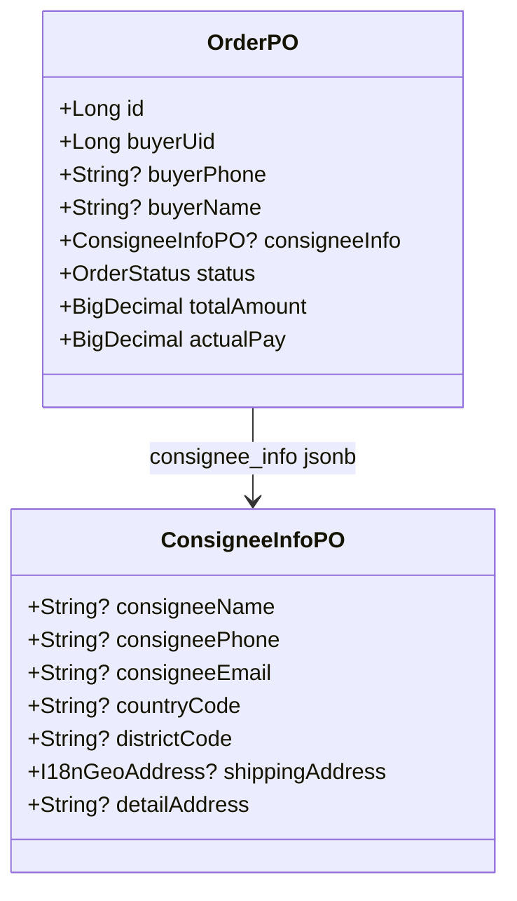

# 设计文档：订单收货人信息独立存储

## 概述

本设计将 Order 聚合根中分散的 `shippingAddress: I18nGeoAddress` 和 `shippingDetailAddress: String?` 替换为统一的 `ShippingInfo` 值对象，同时引入收货人姓名和联系方式。持久化层使用单个 `consignee_info` jsonb 列替代现有的 `country_code`、`district_code`、`shipping_address`、`detail_address` 四个独立列。

核心改造链路：
1. **领域层**：Order 聚合根持有 `ShippingInfo`（含 consigneeName、ContractInfo、I18nGeoAddress、detailAddress）
2. **工厂层**：OrderFactory 从 `ConsigneeInfoCMD` + GeoAddressService 查询结果组装 `ShippingInfo`
3. **命令层**：OrderCreateCMD 清理冗余字段，收货信息统一由 `ConsigneeInfoCMD` 承载
4. **持久化层**：OrderPO 使用 `consignee_info` jsonb 列 + `ConsigneeInfoPO` 数据结构 + JPA AttributeConverter
5. **数据库迁移**：合并旧列数据到 jsonb，删除旧列，创建 GIN 索引
6. **历史兼容**：jsonb 反序列化时缺失字段使用默认值

设计遵循项目 DDD 准则：值对象不可变、领域层无基础设施依赖、`Result<T, BusinessError>` 错误处理。

## 架构

### 改造涉及的模块

```
j-store-order (领域层)
├── domain/order/
│   ├── Order.kt              # 接口：shippingAddress/shippingDetailAddress → shippingInfo
│   ├── OrderImpl.kt          # 实现：同步替换
│   ├── ShippingInfo.kt       # [已有] 收货信息值对象
│   ├── ContractInfo.kt       # [已有] 联系方式值对象
│   ├── OrderFactory.kt       # 改造：从 ConsigneeInfoCMD 构建 ShippingInfo
│   └── command/
│       └── OrderCreateCMD.kt # 改造：移除冗余字段，增加验证

j-store-order-infrastructure (基础设施层)
├── domain/order/
│   ├── OrderRepositoryImpl.kt    # 改造：Converter 适配 ShippingInfo ↔ ConsigneeInfoPO
│   └── persistence/
│       ├── OrderPO.kt            # 改造：替换四列为 consigneeInfo jsonb
│       ├── ConsigneeInfoPO.kt    # [新增] jsonb 序列化数据结构
│       └── ConsigneeInfoPOConverter.kt  # [新增] JPA AttributeConverter

docker/postgres/init/
└── 05-order-consignee-info.sql   # [新增] 数据库迁移脚本
```

### 整体架构图



### 关键设计决策

| 决策 | 选择 | 理由 |
|------|------|------|
| 收货信息合并为单个 jsonb 列 | `consignee_info` jsonb | 收货人姓名、联系方式、地址在业务上是一个整体，jsonb 避免多列分散且支持灵活扩展 |
| 使用 ConsigneeInfoPO 而非直接序列化 ShippingInfo | 独立 PO 数据结构 | ShippingInfo 是领域值对象，PO 是基础设施层关注点，解耦序列化格式与领域模型 |
| JPA AttributeConverter 处理 jsonb | `ConsigneeInfoPOConverter` | 复用项目已有的 `I18nGeoAddressConverter` 模式，与 JPA 集成一致 |
| 历史数据缺失字段使用默认值 | consigneeName="" , ContractInfo(null, null) | 保证旧数据可正常加载，不阻塞系统升级 |
| ContractInfo 允许 phone 和 email 均为 null | 仅在反序列化历史数据时 | 新建订单通过 CMD 验证保证至少一个非空，历史数据无此信息需兼容 |

## 组件与接口

### 1. ShippingInfo 值对象（已有，无需修改）

位置：`j-store-order` / `com.jstore.order.domain.order`

```kotlin
data class ShippingInfo(
    val consigneeName: String,
    val consigneeContractInfo: ContractInfo,
    val shippingAddress: I18nGeoAddress,
    val shippingDetailAddress: String?,
)
```

### 2. ContractInfo 值对象（已有，无需修改）

位置：`j-store-order` / `com.jstore.order.domain.order`

```kotlin
data class ContractInfo(
    val email: String? = null,
    val phoneNumber: PhoneNumber? = null,
) {
    fun validate(): Result<ContractInfo, BusinessError> {
        if (email.isNullOrBlank() && phoneNumber == null) {
            return Failure(OrderErrors.CONTRACT_INFO_INVALID)
        }
        return Success(this)
    }
}
```

### 3. Order 接口变更

位置：`j-store-order` / `com.jstore.order.domain.order`

```kotlin
interface Order : AgreeGate<OrderId> {
    // 移除:
    // val shippingAddress: I18nGeoAddress
    // val shippingDetailAddress: String?

    // 新增:
    val shippingInfo: ShippingInfo

    // ... 其余不变
}
```

### 4. OrderImpl 变更

位置：`j-store-order` / `com.jstore.order.domain.order`

```kotlin
class OrderImpl(
    override val id: OrderId,
    override val buyerInfo: UserInfo,
    private val _items: MutableList<OrderItem>,
    override val shippingInfo: ShippingInfo,  // 替代 shippingAddress + shippingDetailAddress
    private var _status: OrderStatus,
    override val totalAmount: Price,
    private var _actualPay: Price,
    // ...
) : Order {
    // 内部逻辑不变，仅构造参数替换
}
```

### 5. OrderCreateCMD 变更

位置：`j-store-order` / `com.jstore.order.domain.order.command`

```kotlin
data class OrderCreateCMD(
    val buyerUid: Long,
    val buyerPhone: String?,
    val buyerName: String?,
    val consigneeInfo: ConsigneeInfoCMD,
    // 移除: shippingDistrictCode, countryCode, shippingDetailAddress
    val items: List<OrderItemCMD>,
) {
    // ConsigneeInfoCMD 和 ContractInfoCMD 内部类保持不变

    fun validate(): Result<OrderCreateCMD, BusinessError> {
        if (items.isEmpty()) return Failure(OrderErrors.ITEMS_EMPTY)
        if (buyerUid <= 0) return Failure(OrderErrors.BUYER_INVALID)
        consigneeInfo.validate().onFailure { return Failure(it) }
        return Success(this)
    }
}
```

### 6. ConsigneeInfoCMD 验证增强

```kotlin
data class ConsigneeInfoCMD(
    val consigneeName: String,
    val countryCode: String? = null,
    val consigneeContractInfo: ContractInfoCMD,
    val shippingDistrictCode: String,
    val shippingDetailAddress: String,
) {
    fun validate(): Result<ConsigneeInfoCMD, BusinessError> {
        if (consigneeName.isBlank()) return Failure(OrderErrors.CONSIGNEE_NAME_BLANK)
        if (shippingDistrictCode.isBlank()) return Failure(OrderErrors.DISTRICT_CODE_BLANK)
        consigneeContractInfo.validate().onFailure { return Failure(it) }
        return Success(this)
    }
}
```

### 7. OrderFactory 改造

位置：`j-store-order` / `com.jstore.order.domain.order`

```kotlin
override fun create(cmd: OrderCreateCMD): Result<Order, BusinessError> {
    // 1. 查询商品信息（不变）
    // 2. 构建 OrderItem（不变）
    // 3. 计算总金额（不变）

    // 4. 从 ConsigneeInfoCMD 构建 ShippingInfo
    val consigneeCmd = cmd.consigneeInfo
    val countryCode = consigneeCmd.countryCode ?: "CN"
    val address = geoAddressService.getByCode(countryCode, consigneeCmd.shippingDistrictCode)
        .fold(
            onSuccess = { it },
            onFailure = { return Failure(it) }
        )

    val contractInfo = ContractInfo(
        email = consigneeCmd.consigneeContractInfo.emailAddress,
        phoneNumber = consigneeCmd.consigneeContractInfo.phoneNumber,
    )

    val shippingInfo = ShippingInfo(
        consigneeName = consigneeCmd.consigneeName,
        consigneeContractInfo = contractInfo,
        shippingAddress = address,
        shippingDetailAddress = consigneeCmd.shippingDetailAddress,
    )

    // 5. 组装聚合根
    val order = OrderImpl(
        id = OrderId(snowFlakSequence.nextId()),
        buyerInfo = UserInfo(
            uid = cmd.buyerUid,
            phoneNumber = cmd.buyerPhone?.let { PhoneNumber(it) },
            userName = cmd.buyerName,
        ),
        _items = orderItems.toMutableList(),
        shippingInfo = shippingInfo,
        _status = OrderStatus.PENDING_STOCK,
        totalAmount = totalAmount,
        _actualPay = totalAmount,
    )
    // 发布事件（不变）
    return Success(order)
}
```

### 8. ConsigneeInfoPO（新增）

位置：`j-store-order-infrastructure` / `com.jstore.order.domain.order.persistence`

```kotlin
/**
 * 收货人信息持久化数据结构
 * 仅用于 consignee_info jsonb 列的序列化/反序列化，非领域对象
 */
data class ConsigneeInfoPO(
    val consigneeName: String? = null,
    val consigneePhone: String? = null,
    val consigneeEmail: String? = null,
    val countryCode: String? = null,
    val districtCode: String? = null,
    val shippingAddress: I18nGeoAddress? = null,
    val detailAddress: String? = null,
)
```

所有字段均可空 + 默认 null，确保 Jackson 反序列化历史数据时缺失字段不报错。

### 9. ConsigneeInfoPOConverter（新增）

位置：`j-store-order-infrastructure` / `com.jstore.order.domain.order.persistence`

```kotlin
@Converter(autoApply = false)
class ConsigneeInfoPOConverter : AttributeConverter<ConsigneeInfoPO, String> {

    override fun convertToDatabaseColumn(attribute: ConsigneeInfoPO?): String {
        return attribute?.let { JsonUtils.toJsonString(it) } ?: "{}"
    }

    override fun convertToEntityAttribute(dbData: String?): ConsigneeInfoPO? {
        if (dbData.isNullOrBlank() || dbData == "{}") return null
        return JsonUtils.deserialize(dbData, ConsigneeInfoPO::class.java)
    }
}
```

### 10. OrderPO 变更

位置：`j-store-order-infrastructure` / `com.jstore.order.domain.order.persistence`

```kotlin
@Entity
@Table(name = "orders")
class OrderPO(
    // ... id, buyer 字段不变 ...

    // 移除: countryCode, districtCode, shippingAddress(I18nGeoAddress), detailAddress

    // 新增:
    @Convert(converter = ConsigneeInfoPOConverter::class)
    @Column(name = "consignee_info", columnDefinition = "jsonb")
    var consigneeInfo: ConsigneeInfoPO? = null,

    // ... status, amount, time, items 不变 ...
)
```

### 11. OrderRepositoryImpl Converter 变更

```kotlin
private object Converter {

    fun toPO(order: Order): OrderPO {
        val si = order.shippingInfo
        val consigneeInfoPO = ConsigneeInfoPO(
            consigneeName = si.consigneeName,
            consigneePhone = si.consigneeContractInfo.phoneNumber?.value,
            consigneeEmail = si.consigneeContractInfo.email,
            countryCode = si.shippingAddress.countryCode.value,
            districtCode = si.shippingAddress.getLeafCode(),
            shippingAddress = si.shippingAddress,
            detailAddress = si.shippingDetailAddress,
        )
        return OrderPO(
            // ... id, buyer 不变 ...
            consigneeInfo = consigneeInfoPO,
            // ... status, amount, time, items 不变 ...
        )
    }

    fun toDomain(po: OrderPO): Order {
        val cipo = po.consigneeInfo
            ?: error("Order ${po.id} has no consignee_info")

        val address = cipo.shippingAddress
            ?: error("Order ${po.id} consignee_info has no shippingAddress")

        val contractInfo = ContractInfo(
            email = cipo.consigneeEmail,
            phoneNumber = cipo.consigneePhone?.let { PhoneNumber(it) },
        )

        val shippingInfo = ShippingInfo(
            consigneeName = cipo.consigneeName ?: "",
            consigneeContractInfo = contractInfo,
            shippingAddress = address,
            shippingDetailAddress = cipo.detailAddress,
        )

        return OrderImpl(
            // ... id, buyer 不变 ...
            shippingInfo = shippingInfo,
            // ... status, amount, time 不变 ...
        )
    }
}
```

### 12. OrderErrors 扩展

```kotlin
object OrderErrors {
    // ... 现有错误不变 ...
    val CONSIGNEE_NAME_BLANK = BusinessError("收货人姓名不能为空", "Order.Consignee.NameBlank", 400)
    val DISTRICT_CODE_BLANK = BusinessError("行政区划编码不能为空", "Order.Consignee.DistrictCodeBlank", 400)
}
```

## 数据模型

### 领域模型关系图



### 持久化模型



### consignee_info jsonb 结构示例

```json
{
  "consigneeName": "张三",
  "consigneePhone": "13800138000",
  "consigneeEmail": "zhangsan@example.com",
  "countryCode": "CN",
  "districtCode": "110105",
  "shippingAddress": {
    "countryCode": "CN",
    "components": [
      {
        "code": "110000",
        "level": { "depth": 1, "name": "省" },
        "names": { "zh-CN": "北京市" },
        "defaultLocale": "zh-CN"
      },
      {
        "code": "110100",
        "level": { "depth": 2, "name": "市" },
        "names": { "zh-CN": "北京市" },
        "defaultLocale": "zh-CN"
      },
      {
        "code": "110105",
        "level": { "depth": 3, "name": "区/县" },
        "names": { "zh-CN": "朝阳区" },
        "defaultLocale": "zh-CN"
      }
    ]
  },
  "detailAddress": "三里屯街道xx号"
}
```

### 历史数据 jsonb 示例（迁移后，缺少收货人字段）

```json
{
  "countryCode": "CN",
  "districtCode": "110105",
  "shippingAddress": { ... },
  "detailAddress": "三里屯街道xx号"
}
```

反序列化时 `consigneeName` → `null` → 默认 `""`，`consigneePhone`/`consigneeEmail` → `null` → `ContractInfo(null, null)`。

### 数据库迁移脚本

文件：`docker/postgres/init/05-order-consignee-info.sql`

```sql
-- Migration: Merge scattered consignee columns into single consignee_info jsonb

-- Step 1: Add consignee_info jsonb column
ALTER TABLE orders ADD COLUMN IF NOT EXISTS consignee_info jsonb;

-- Step 2: Migrate existing data into consignee_info
UPDATE orders
SET consignee_info = jsonb_build_object(
    'countryCode', country_code,
    'districtCode', district_code,
    'shippingAddress', shipping_address,
    'detailAddress', detail_address
)
WHERE consignee_info IS NULL;

-- Step 3: Set NOT NULL constraint
ALTER TABLE orders ALTER COLUMN consignee_info SET NOT NULL;

-- Step 4: Drop old columns
ALTER TABLE orders DROP COLUMN IF EXISTS country_code;
ALTER TABLE orders DROP COLUMN IF EXISTS district_code;
ALTER TABLE orders DROP COLUMN IF EXISTS shipping_address;
ALTER TABLE orders DROP COLUMN IF EXISTS detail_address;

-- Step 5: Create GIN index
CREATE INDEX IF NOT EXISTS idx_orders_consignee_info ON orders USING gin (consignee_info);
```


## 正确性属性

*正确性属性是一种在系统所有合法执行中都应成立的特征或行为——本质上是对系统应做什么的形式化陈述。属性是人类可读规格说明与机器可验证正确性保证之间的桥梁。*

### Property 1: 工厂正确组装 ShippingInfo

*For any* 合法的 `ConsigneeInfoCMD`（含随机 consigneeName、ContractInfoCMD、countryCode、districtCode、detailAddress），当 GeoAddressService 返回成功的 `I18nGeoAddress` 时，OrderFactory 创建的 Order 的 `shippingInfo` 应满足：
- `consigneeName` 等于 CMD 中的 `consigneeName`
- `consigneeContractInfo.phoneNumber` 等于 CMD 中的 `consigneeContractInfo.phoneNumber`
- `consigneeContractInfo.email` 等于 CMD 中的 `consigneeContractInfo.emailAddress`
- `shippingAddress` 等于 GeoAddressService 返回的 `I18nGeoAddress`
- `shippingDetailAddress` 等于 CMD 中的 `shippingDetailAddress`

**Validates: Requirements 2.1, 2.3, 2.4, 7.4**

### Property 2: ConsigneeInfoCMD 空白字段验证

*For any* 仅由空白字符组成的字符串，当用作 `ConsigneeInfoCMD` 的 `consigneeName` 时，`validate()` 应返回 Failure；当用作 `shippingDistrictCode` 时，`validate()` 同样应返回 Failure。

**Validates: Requirements 3.1, 3.2**

### Property 3: OrderCreateCMD 验证错误传播

*For any* 会导致 `ConsigneeInfoCMD.validate()` 失败的输入组合，`OrderCreateCMD.validate()` 也应返回 Failure，且错误信息与 `ConsigneeInfoCMD.validate()` 返回的一致。

**Validates: Requirements 3.4**

### Property 4: ShippingInfo ↔ ConsigneeInfoPO 序列化往返

*For any* 合法的 `ShippingInfo`（含随机 consigneeName、ContractInfo、I18nGeoAddress、detailAddress），通过 Converter 转换为 `ConsigneeInfoPO` 再转换回 `ShippingInfo`，应产生与原始对象在所有字段上等价的结果。

**Validates: Requirements 4.4, 4.5, 6.3**

### Property 5: 历史数据反序列化默认值

*For any* 合法的 `ConsigneeInfoPO` JSON，当 `consigneeName` 字段缺失或为 null 时，反序列化后重建的 `ShippingInfo.consigneeName` 应为空字符串 `""`；当 `consigneePhone` 和 `consigneeEmail` 均缺失或为 null 时，重建的 `ContractInfo` 的 `phoneNumber` 和 `email` 均应为 null。

**Validates: Requirements 6.1, 6.2**

## 错误处理

### 错误常量定义

新增错误常量在 `OrderErrors` 对象中：

| 错误常量 | errorCode | httpCode | 触发场景 |
|----------|-----------|----------|----------|
| `CONSIGNEE_NAME_BLANK` | `Order.Consignee.NameBlank` | 400 | ConsigneeInfoCMD.consigneeName 为空白 |
| `DISTRICT_CODE_BLANK` | `Order.Consignee.DistrictCodeBlank` | 400 | ConsigneeInfoCMD.shippingDistrictCode 为空白 |
| `CONTRACT_INFO_INVALID` | `Order.ContractInfo.Invalid` | 400 | [已有] phoneNumber 和 email 均为空 |

### 错误传播策略

```
ConsigneeInfoCMD.validate()
  ├── consigneeName.isBlank() → Failure(CONSIGNEE_NAME_BLANK)
  ├── shippingDistrictCode.isBlank() → Failure(DISTRICT_CODE_BLANK)
  └── consigneeContractInfo.validate()
        └── both null → Failure(CONTRACT_INFO_INVALID)

OrderCreateCMD.validate()
  ├── items.isEmpty() → Failure(ITEMS_EMPTY)
  ├── buyerUid <= 0 → Failure(BUYER_INVALID)
  └── consigneeInfo.validate() → 传播 Failure

OrderFactory.create()
  └── geoAddressService.getByCode() → 传播 Failure（地址查询失败）
```

### 错误处理原则

1. **CMD 验证错误**：通过 `Result<T, BusinessError>` + `onFailure { return Failure(it) }` 逐层传播
2. **GeoAddressService 查询失败**：工厂直接传播 ACL 层返回的 `BusinessError`
3. **反序列化缺失字段**：不报错，使用默认值（历史兼容策略）
4. **consignee_info 为 null**：`error()` 抛出异常（数据完整性问题，属编程错误）

## 测试策略

### 属性测试（Property-Based Testing）

使用 **Kotest Property Testing**（`io.kotest:kotest-property`），与项目现有属性测试保持一致。

每个属性测试：
- 最少运行 **100 次迭代**
- 使用注释标注对应的设计属性：`// Feature: order-consignee-info, Property {N}: {title}`
- 使用 Kotest 的 `Arb`（Arbitrary）生成器生成随机输入

#### 需要实现的自定义生成器

| 生成器 | 描述 |
|--------|------|
| `Arb.consigneeInfoCMD()` | 生成合法的 ConsigneeInfoCMD（随机姓名、联系方式、地址编码） |
| `Arb.contractInfoCMD()` | 生成合法的 ContractInfoCMD（至少一个非空联系方式） |
| `Arb.shippingInfo()` | 生成合法的 ShippingInfo（随机收货人信息 + I18nGeoAddress） |
| `Arb.consigneeInfoPO()` | 生成合法的 ConsigneeInfoPO（随机字段组合） |
| `Arb.whitespaceString()` | 生成仅由空白字符组成的字符串 |

#### 属性测试清单

| Property | 测试文件 | 模块 |
|----------|----------|------|
| Property 1: 工厂正确组装 ShippingInfo | `OrderFactoryShippingInfoPropertyTest.kt` | j-store-order |
| Property 2: ConsigneeInfoCMD 空白字段验证 | `ConsigneeInfoCMDValidationPropertyTest.kt` | j-store-order |
| Property 3: OrderCreateCMD 验证错误传播 | `OrderCreateCMDValidationPropertyTest.kt` | j-store-order |
| Property 4: ShippingInfo ↔ ConsigneeInfoPO 往返 | `ConsigneeInfoPORoundTripPropertyTest.kt` | j-store-order-infrastructure |
| Property 5: 历史数据反序列化默认值 | `ConsigneeInfoPOBackwardCompatPropertyTest.kt` | j-store-order-infrastructure |

### 单元测试（Example-Based）

| 测试场景 | 对应需求 |
|----------|----------|
| OrderFactory countryCode 为 null 时默认 "CN" | 2.2 |
| GeoAddressService 查询失败时 Factory 返回 Failure | 2.5 |
| ContractInfoCMD phone 和 email 均为 null 时验证失败 | 3.3 |
| Order 聚合根使用默认 ShippingInfo 执行全部状态转移 | 6.4 |

### 集成测试

| 测试场景 | 对应需求 |
|----------|----------|
| 数据库迁移脚本正确执行（添加列、迁移数据、删除旧列） | 5.1, 5.2, 5.3 |
| 迁移脚本可重复执行 | 5.4 |
| GIN 索引创建成功 | 5.5 |
| 订单持久化 consignee_info jsonb 往返 | 4.1, 4.2, 4.3, 4.6 |
