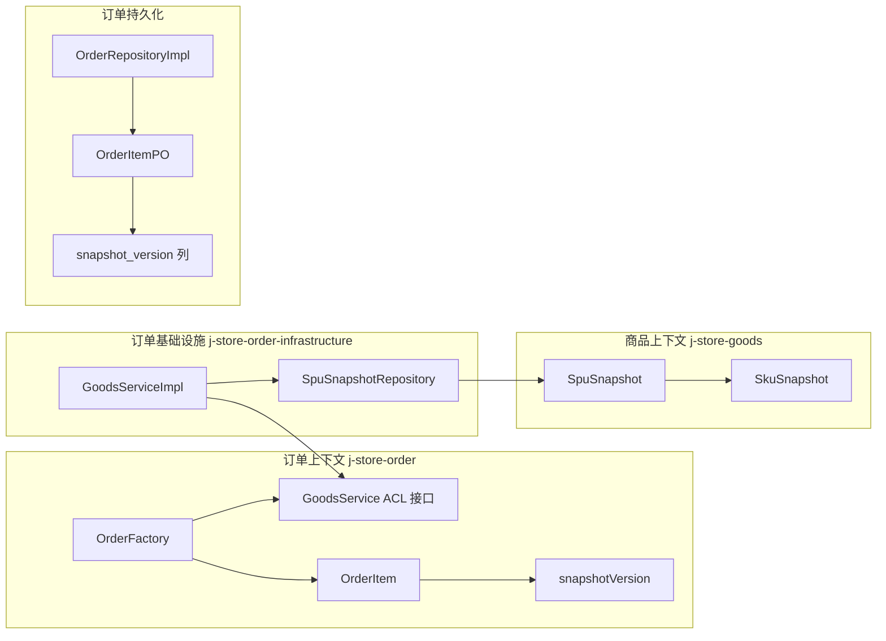
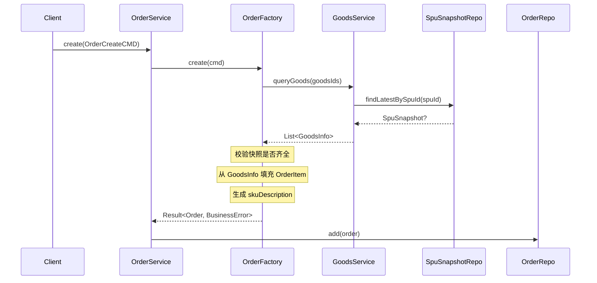

# 设计文档：订单商品快照

## 概述

本设计实现订单模块与商品快照的集成，使订单创建时能够从商品快照中读取完整的商品信息（名称、SKU 描述、销售属性、价格、快照版本号），并将这些信息冻结在订单行项中，确保订单商品信息的不可变性。

### 设计目标

1. **扩展 GoodsService ACL**：将 `GoodsInfo` 从仅包含 ID 和价格，扩展为包含快照版本号、商品名称、SKU 名称、销售属性等完整信息
2. **填充订单行项快照数据**：`OrderFactory` 创建订单时从 `GoodsInfo` 读取快照数据，填充 `OrderItem` 的 `goodsName`、`skuDescription`、`unitPrice`、`snapshotVersion`
3. **持久化快照版本号**：`OrderItemPO` 新增 `snapshot_version` 列，实现快照版本的完整追溯
4. **快照缺失校验**：商品无可用快照时拒绝创建订单

### 设计决策

| 决策 | 选择 | 理由 |
|------|------|------|
| GoodsInfo 中的 attributes 类型 | `List<Pair<String, String>>` | 订单上下文不应依赖商品上下文的 `Attribute` 类型，使用 Kotlin 标准库类型实现 ACL 解耦 |
| skuDescription 生成位置 | `OrderFactory` 内部 | 规格描述的拼接逻辑属于订单创建的组装职责，不应泄漏到 ACL 层 |
| 快照查询策略 | 按 SPU ID 查询最新快照 | 复用 `SpuSnapshotRepository.findLatestBySpuId()`，无需引入版本号参数 |
| snapshotVersion 默认值 | 0 | 兼容历史数据，历史订单行项的 snapshotVersion 为 0 表示"未记录快照版本" |
| GoodsServiceImpl 的批量查询 | 逐个 SPU 查询最新快照 | 当前 `SpuSnapshotRepository` 已提供 `findLatestBySpuId`，批量查询可后续优化 |

## 架构

### 跨上下文集成架构



### 数据流



## 组件与接口

### 1. GoodsService ACL 接口（变更）

**文件**: `j-store-order/src/main/kotlin/com/jstore/order/acl/GoodsService.kt`

```kotlin
interface GoodsService {
    fun queryGoods(goodsId: List<GoodsId>): List<GoodsInfo>
}

data class GoodsId(val spuId: Long, val skuId: Long)

data class GoodsInfo(
    val id: GoodsId,
    val snapshotVersion: Long,
    val spuName: String,
    val skuName: String,
    val attributes: List<Pair<String, String>>,
    val price: Price
)
```

**变更说明**：
- `GoodsInfo` 移除 `version` 字段，新增 `snapshotVersion`、`spuName`、`skuName`、`attributes`
- `attributes` 使用 `List<Pair<String, String>>` 而非商品上下文的 `Attribute<String, String>`，实现 ACL 类型隔离

### 2. GoodsServiceImpl 基础设施实现（新增）

**文件**: `j-store-order-infrastructure/src/main/kotlin/com/jstore/order/acl/GoodsServiceImpl.kt`

```kotlin
@Service
class GoodsServiceImpl(
    private val spuSnapshotRepository: SpuSnapshotRepository,
) : GoodsService {

    override fun queryGoods(goodsId: List<GoodsId>): List<GoodsInfo> {
        // 按 spuId 分组，每个 SPU 只查一次最新快照
        val spuIds = goodsId.map { it.spuId }.distinct()
        val snapshotMap = spuIds.mapNotNull { spuId ->
            spuSnapshotRepository.findLatestBySpuId(SpuId(spuId))?.let { spuId to it }
        }.toMap()

        return goodsId.mapNotNull { gid ->
            val snapshot = snapshotMap[gid.spuId] ?: return@mapNotNull null
            val skuSnapshot = snapshot.skuSnapshots.find { it.skuId.value == gid.skuId }
                ?: return@mapNotNull null
            GoodsInfo(
                id = gid,
                snapshotVersion = snapshot.snapshotVersion,
                spuName = snapshot.spuName,
                skuName = skuSnapshot.skuName,
                attributes = skuSnapshot.attributes.map { it.key to it.value },
                price = skuSnapshot.price,
            )
        }
    }
}
```

**关键设计**：
- 依赖 `SpuSnapshotRepository`（商品上下文的仓储接口），通过 Spring DI 注入
- 按 `spuId` 去重查询，避免同一 SPU 多次查库
- 快照不存在或 SKU 不在快照中时，该 `GoodsId` 不出现在返回列表中（由 `OrderFactory` 负责校验缺失）

### 3. OrderItem 接口（变更）

**文件**: `j-store-order/src/main/kotlin/com/jstore/order/domain/order/OrderItem.kt`

```kotlin
interface OrderItem : Entity<OrderItemId> {
    val skuId: Long
    val spuId: Long
    val goodsName: String
    val skuDescription: String
    val quantity: Int
    val unitPrice: Price
    val snapshotVersion: Long  // 新增
    val status: OrderItemStatus
    val previousItemStatus: OrderItemStatus?
    fun subtotal(): Price
}
```

### 4. OrderItemImpl（变更）

**文件**: `j-store-order/src/main/kotlin/com/jstore/order/domain/order/OrderItemImpl.kt`

构造函数新增 `snapshotVersion` 参数：

```kotlin
class OrderItemImpl(
    override val id: OrderItemId,
    override val skuId: Long,
    override val spuId: Long,
    override val goodsName: String,
    override val skuDescription: String,
    override val quantity: Int,
    override val unitPrice: Price,
    override val snapshotVersion: Long = 0,  // 新增，默认 0 兼容历史
    override var status: OrderItemStatus = OrderItemStatus.NONE,
    private var _previousItemStatus: OrderItemStatus? = null,
) : OrderItem { ... }
```

### 5. OrderFactory（变更）

**文件**: `j-store-order/src/main/kotlin/com/jstore/order/domain/order/OrderFactory.kt`

核心变更在 `create()` 方法中：

```kotlin
// 构建 OrderItem 时填充快照数据
val orderItems = cmd.items.map { itemCmd ->
    val goods = goodsInfoMap[GoodsId(itemCmd.spuId, itemCmd.skuId)]
        ?: return Failure(OrderErrors.CORRESPONDING_GOODS_NOT_FOUND
            .msg("商品 SPU ID=${itemCmd.spuId} 快照不存在"))
    OrderItemImpl(
        id = OrderItemId(snowFlakSequence.nextId()),
        spuId = itemCmd.spuId,
        skuId = itemCmd.skuId,
        goodsName = goods.spuName,
        skuDescription = buildSkuDescription(goods.skuName, goods.attributes),
        quantity = itemCmd.quantity,
        unitPrice = goods.price,
        snapshotVersion = goods.snapshotVersion,
    )
}
```

**skuDescription 生成逻辑**（新增私有方法）：

```kotlin
private fun buildSkuDescription(
    skuName: String,
    attributes: List<Pair<String, String>>
): String {
    if (attributes.isEmpty()) return skuName
    return attributes.joinToString(" ") { "${it.first}:${it.second}" }
}
```

### 6. OrderItemPO（变更）

**文件**: `j-store-order-infrastructure/.../persistence/OrderPO.kt`

`OrderItemPO` 新增字段：

```kotlin
@Column(name = "snapshot_version", nullable = false)
var snapshotVersion: Long = 0,
```

### 7. OrderRepositoryImpl Converter（变更）

`toItemPO` 和 `toDomainItem` 方法新增 `snapshotVersion` 映射：

```kotlin
fun toItemPO(item: OrderItem, orderId: Long): OrderItemPO {
    return OrderItemPO(
        // ... 现有字段 ...
        snapshotVersion = item.snapshotVersion,  // 新增
    )
}

fun toDomainItem(po: OrderItemPO): OrderItem {
    return OrderItemImpl(
        // ... 现有字段 ...
        snapshotVersion = po.snapshotVersion,  // 新增
    )
}
```

### 8. 数据库迁移脚本（新增）

**文件**: `docker/postgres/init/08-order-item-snapshot-version.sql`

```sql
ALTER TABLE order_items ADD COLUMN IF NOT EXISTS snapshot_version BIGINT NOT NULL DEFAULT 0;
COMMENT ON COLUMN order_items.snapshot_version IS '商品快照版本号，对应 spu_snapshot.snapshot_version';
```

## 数据模型

### OrderItem 实体字段（变更后）

| 字段 | 类型 | 说明 | 变更 |
|------|------|------|------|
| id | OrderItemId | 行项 ID | 不变 |
| skuId | Long | SKU ID | 不变 |
| spuId | Long | SPU ID | 不变 |
| goodsName | String | 商品名称（来自快照 spuName） | **填充逻辑变更** |
| skuDescription | String | SKU 规格描述（拼接自快照 attributes） | **填充逻辑变更** |
| quantity | Int | 数量 | 不变 |
| unitPrice | Price | 单价（来自快照 price） | 不变 |
| snapshotVersion | Long | 快照版本号 | **新增** |
| status | OrderItemStatus | 行项状态 | 不变 |
| previousItemStatus | OrderItemStatus? | 退款前状态 | 不变 |

### GoodsInfo ACL 数据类型（变更后）

| 字段 | 类型 | 说明 | 变更 |
|------|------|------|------|
| id | GoodsId | SPU ID + SKU ID | 不变 |
| snapshotVersion | Long | 快照版本号 | **新增**（替代原 version） |
| spuName | String | 商品名称 | **新增** |
| skuName | String | SKU 名称 | **新增** |
| attributes | List<Pair<String, String>> | 销售属性列表 | **新增** |
| price | Price | SKU 单价 | 不变 |

### 数据库 order_items 表（变更后）

| 列名 | 类型 | 说明 | 变更 |
|------|------|------|------|
| snapshot_version | BIGINT NOT NULL DEFAULT 0 | 商品快照版本号 | **新增** |


## 正确性属性

*属性（Property）是一种在系统所有合法执行中都应成立的特征或行为——本质上是对系统应做什么的形式化陈述。属性是人类可读规格说明与机器可验证正确性保证之间的桥梁。*

### Property 1: 快照到 GoodsInfo 的转换保持字段完整性

*For any* 有效的 SpuSnapshot（包含任意数量的 SkuSnapshot），GoodsServiceImpl 将其转换为 GoodsInfo 后，GoodsInfo 的 spuName 应等于 SpuSnapshot 的 spuName，skuName 应等于对应 SkuSnapshot 的 skuName，attributes 应与 SkuSnapshot 的 attributes 一一对应（key→first, value→second），price 应等于 SkuSnapshot 的 price，snapshotVersion 应等于 SpuSnapshot 的 snapshotVersion。

**Validates: Requirements 3.1, 3.2**

### Property 2: GoodsServiceImpl 返回最新快照版本

*For any* SPU ID，当存在多个不同版本的快照时，GoodsServiceImpl.queryGoods 返回的 GoodsInfo 的 snapshotVersion 应等于该 SPU 所有快照中的最大版本号。

**Validates: Requirements 1.2**

### Property 3: 缺失快照的商品被排除

*For any* GoodsId 列表，其中部分 SPU 在 SpuSnapshotRepository 中不存在快照，GoodsServiceImpl.queryGoods 返回的 GoodsInfo 列表不应包含这些缺失快照的商品，且返回列表的大小应等于有快照的商品数量。

**Validates: Requirements 1.3, 3.3**

### Property 4: OrderFactory 正确映射 GoodsInfo 到 OrderItem

*For any* 有效的 GoodsInfo（包含非空 spuName、skuName、attributes、price、snapshotVersion），OrderFactory 创建的 OrderItem 应满足：goodsName 等于 GoodsInfo.spuName，unitPrice 等于 GoodsInfo.price，snapshotVersion 等于 GoodsInfo.snapshotVersion。

**Validates: Requirements 2.2, 2.3, 2.4**

### Property 5: skuDescription 往返一致性

*For any* 有效的销售属性列表（key 和 value 不包含冒号和空格），通过 `buildSkuDescription` 生成 skuDescription 后，再按空格分割、按冒号拆分 key:value，应产生与原始属性列表等价的结果。

**Validates: Requirements 5.1, 5.2, 5.3**

### Property 6: OrderItem PO 转换往返保持 snapshotVersion

*For any* 有效的 OrderItem（包含任意 snapshotVersion 值），经过 Converter.toItemPO 转换为 OrderItemPO，再经过 Converter.toDomainItem 转换回 OrderItem 后，snapshotVersion 应与原始值相等。

**Validates: Requirements 4.2, 4.3**

### Property 7: 快照缺失时 OrderFactory 快速失败

*For any* OrderCreateCMD 包含至少一个快照缺失的商品，OrderFactory.create 应返回 Failure，且错误信息中应包含缺失快照的商品 SPU ID。

**Validates: Requirements 6.1, 6.2, 6.3**

## 错误处理

### 错误场景

| 场景 | 错误类型 | 错误码 | HTTP 状态码 | 处理方式 |
|------|----------|--------|-------------|----------|
| 商品快照不存在 | BusinessError | Order.Resource.NotFound | 404 | OrderFactory 返回 Failure，携带缺失的 SPU ID |
| SKU 不在快照中 | BusinessError | Order.Resource.NotFound | 404 | GoodsServiceImpl 跳过该 GoodsId，OrderFactory 检测缺失后返回 Failure |

### 错误信息增强

现有 `OrderErrors.CORRESPONDING_GOODS_NOT_FOUND` 的错误消息将通过 `.msg()` 方法增强，包含具体的 SPU ID：

```kotlin
OrderErrors.CORRESPONDING_GOODS_NOT_FOUND
    .msg("商品 SPU ID=${itemCmd.spuId} 快照不存在")
```

### 兼容性处理

- 历史订单行项的 `snapshotVersion` 默认为 0，表示"未记录快照版本"
- `OrderItemImpl` 构造函数中 `snapshotVersion` 默认值为 0，确保从旧数据反序列化时不会报错

## 测试策略

### 属性测试（Property-Based Testing）

本项目使用 **Kotest Property** 作为属性测试框架（已在 `build.gradle.kts` 中配置）。

每个属性测试：
- 最少运行 **100 次迭代**
- 使用 `checkAll(100, arb) { ... }` 语法
- 测试类注释中标注对应的设计属性编号
- 标签格式：**Feature: order-goods-snapshot, Property {number}: {property_text}**

| 属性 | 测试类 | 模块 | 说明 |
|------|--------|------|------|
| Property 1 | `GoodsServiceSnapshotConversionPropertyTest` | j-store-order-infrastructure | 验证 SpuSnapshot → GoodsInfo 转换的字段完整性 |
| Property 2 | `GoodsServiceLatestVersionPropertyTest` | j-store-order-infrastructure | 验证返回最新快照版本 |
| Property 3 | `GoodsServiceMissingSnapshotPropertyTest` | j-store-order-infrastructure | 验证缺失快照被排除 |
| Property 4 | `OrderFactoryGoodsInfoMappingPropertyTest` | j-store-order | 验证 GoodsInfo → OrderItem 字段映射 |
| Property 5 | `SkuDescriptionRoundTripPropertyTest` | j-store-order | 验证 skuDescription 往返一致性 |
| Property 6 | `OrderItemPOConversionPropertyTest` | j-store-order-infrastructure | 验证 OrderItem ↔ PO 转换保持 snapshotVersion |
| Property 7 | `OrderFactoryMissingSnapshotFailurePropertyTest` | j-store-order | 验证快照缺失时快速失败 |

### 单元测试（Example-Based）

| 测试类 | 模块 | 说明 |
|--------|------|------|
| `OrderFactorySnapshotIntegrationTest` | j-store-order | 验证 OrderFactory 创建订单时正确填充快照数据的具体示例 |
| `GoodsServiceImplTest` | j-store-order-infrastructure | 验证 GoodsServiceImpl 的具体查询场景（单个商品、多个商品、部分缺失） |

### 测试依赖

- 属性测试和单元测试均使用 Mock（Mockito）模拟 `SpuSnapshotRepository` 和 `GoodsService`
- 不依赖数据库或 Spring 容器
- 使用 Kotest `Arb` 生成器构造随机测试数据
