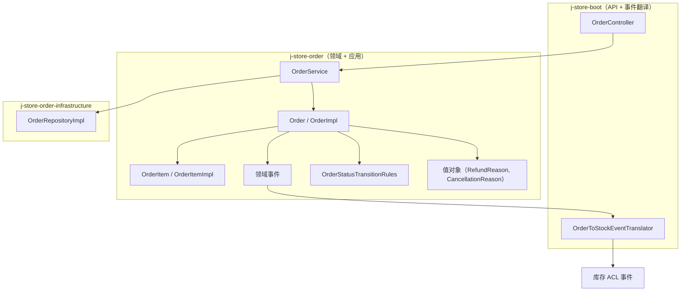
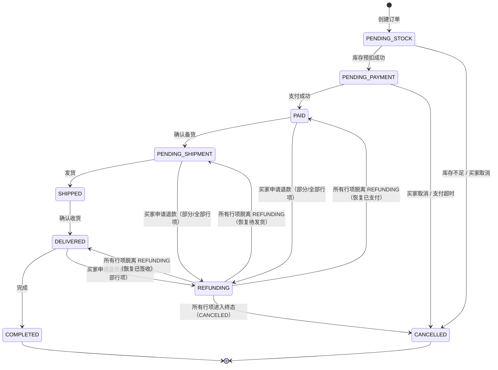
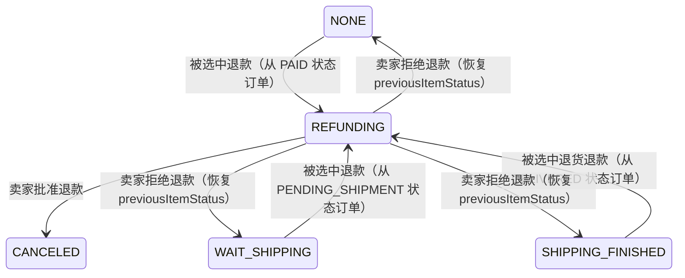

# 技术设计文档：订单逆向业务流程

## 概述

本设计为 j-store 订单领域模型实现完整的逆向业务流程。当前系统已实现正向流程（PENDING_STOCK → PENDING_PAYMENT → PAID → PENDING_SHIPMENT → SHIPPED → DELIVERED → COMPLETED），并在 `OrderStatus` 枚举和 `OrderStatusTransitionRules` 中预留了 CANCELLED 和 REFUNDING 状态。现有的逆向逻辑仅限于库存不足时的被动取消（`markStockInsufficient`）。

本次设计将补全以下逆向场景：
- 买家主动取消（未支付阶段）
- 支付超时自动取消
- 买家申请退款（已支付未发货）— 支持行项级别粒度
- 买家申请退货退款（已签收）— 支持行项级别粒度
- 卖家审批退款（批准/拒绝）— 支持行项级别粒度

核心设计决策：
1. **行项级别退款粒度**：退款/退货操作接受 `List<OrderItemId>` 参数，仅操作指定行项。全单退款是部分退款的特例（选中所有行项）
2. **退款金额按选中行项计算**：退款金额 = 选中行项的 `subtotal()` 之和，而非全额 `actualPay`
3. **OrderItem 独立状态与 previousItemStatus**：每个 OrderItem 在进入 REFUNDING 时记录自身的 `previousItemStatus`，退款拒绝时独立恢复
4. **Order 级别 previousStatus**：聚合根记录进入 REFUNDING 前的状态，当所有行项脱离 REFUNDING 时恢复
5. **Order 状态推导规则**：当任意行项处于 REFUNDING 时，Order 状态为 REFUNDING；当所有行项进入 CANCELED 时，Order 状态为 CANCELLED；当所有行项脱离 REFUNDING 时，Order 恢复 previousStatus
6. **值对象封装**：新增 `RefundReason` 和 `CancellationReason` 值对象
7. **事件驱动集成**：新增 `OrderRefundRequestedEvent`、`OrderRefundApprovedEvent`、`OrderRefundRejectedEvent` 领域事件，均携带行项 ID 列表

## 架构

### 整体架构

遵循现有 DDD 分层架构，变更集中在领域层和应用层，事件翻译器扩展在 boot 组装层。



### 逆向流程状态机

#### Order 级别状态机



#### OrderItem 级别状态转移（退款场景）



## 组件与接口

### 1. Order 聚合根接口扩展

在 `Order` 接口中新增逆向操作方法：

```kotlin
interface Order : AgreeGate<OrderId> {
    // ... 现有属性和方法 ...

    /** 进入 REFUNDING 前的 Order 级别状态，用于退款拒绝时恢复 */
    val previousStatus: OrderStatus?

    /** 买家主动取消订单（未支付阶段） */
    fun cancel(reason: CancellationReason): Result<Unit, BusinessError>

    /** 申请退款（已支付未发货 / 已签收退货退款），指定行项 */
    fun requestRefund(reason: RefundReason, itemIds: List<OrderItemId>): Result<Unit, BusinessError>

    /** 卖家批准退款，指定行项 */
    fun approveRefund(itemIds: List<OrderItemId>): Result<Unit, BusinessError>

    /** 卖家拒绝退款，指定行项 */
    fun rejectRefund(rejectReason: String, itemIds: List<OrderItemId>): Result<Unit, BusinessError>
}
```

### 2. OrderItem 实体接口扩展

在 `OrderItem` 接口中新增 `previousItemStatus` 属性：

```kotlin
interface OrderItem : Entity<OrderItemId> {
    // ... 现有属性 ...
    val status: OrderItemStatus

    /** 进入 REFUNDING 前的行项状态，用于退款拒绝时恢复 */
    val previousItemStatus: OrderItemStatus?

    fun subtotal(): Price
}
```

### 3. OrderItemImpl 实体实现扩展

```kotlin
class OrderItemImpl(
    // ... 现有构造参数 ...
    override var status: OrderItemStatus = OrderItemStatus.NONE,
    private var _previousItemStatus: OrderItemStatus? = null,
) : OrderItem {
    override val previousItemStatus: OrderItemStatus? get() = _previousItemStatus

    /** 进入退款状态，记录当前状态以便恢复 */
    fun enterRefunding() {
        _previousItemStatus = status
        status = OrderItemStatus.REFUNDING
    }

    /** 退款被批准，进入 CANCELED */
    fun markCanceled() {
        _previousItemStatus = null
        status = OrderItemStatus.CANCELED
    }

    /** 退款被拒绝，恢复到进入退款前的状态 */
    fun restoreFromRefunding() {
        val restoreTo = _previousItemStatus
            ?: throw IllegalStateException("previousItemStatus 为空，无法恢复")
        status = restoreTo
        _previousItemStatus = null
    }
}
```

### 4. OrderImpl 聚合根实现扩展

```kotlin
class OrderImpl(
    // ... 现有构造参数 ...
    private var _previousStatus: OrderStatus? = null,
) : Order {
    override val previousStatus: OrderStatus? get() = _previousStatus

    override fun cancel(reason: CancellationReason): Result<Unit, BusinessError> {
        if (!OrderStatusTransitionRules.isValidTransition(_status, OrderStatus.CANCELLED)) {
            return Failure(OrderErrors.ILLEGAL_STATE.msg("当前状态${_status.name}无法取消"))
        }
        _status = OrderStatus.CANCELLED
        _updateTime = LocalDateTime.now()
        _items.filterIsInstance<OrderItemImpl>().forEach { it.status = OrderItemStatus.CANCELED }
        publishEvent(OrderCancelledEvent(orderId = id, reason = reason.description))
        return Success(Unit)
    }

    override fun requestRefund(
        reason: RefundReason,
        itemIds: List<OrderItemId>
    ): Result<Unit, BusinessError> {
        // 1. 校验 Order 状态
        if (!OrderStatusTransitionRules.isValidTransition(_status, OrderStatus.REFUNDING)) {
            return Failure(OrderErrors.ILLEGAL_STATE.msg("当前状态${_status.name}无法申请退款"))
        }
        // 2. 校验 itemIds 非空
        if (itemIds.isEmpty()) {
            return Failure(OrderErrors.REFUND_ITEMS_EMPTY)
        }
        // 3. 校验 itemIds 属于本订单
        val itemMap = _items.filterIsInstance<OrderItemImpl>().associateBy { it.id }
        val targetItems = itemIds.map { itemId ->
            itemMap[itemId] ?: return Failure(OrderErrors.REFUND_ITEM_NOT_FOUND.msg("行项 $itemId 不属于本订单"))
        }
        // 4. 校验目标行项状态（不能是 REFUNDING 或 CANCELED）
        targetItems.forEach { item ->
            if (item.status == OrderItemStatus.REFUNDING || item.status == OrderItemStatus.CANCELED) {
                return Failure(OrderErrors.REFUND_ITEM_INVALID_STATE.msg("行项 ${item.id} 状态为 ${item.status.name}，无法申请退款"))
            }
        }
        // 5. 记录 Order 级别 previousStatus（仅首次进入 REFUNDING 时记录）
        if (_status != OrderStatus.REFUNDING) {
            _previousStatus = _status
            _status = OrderStatus.REFUNDING
        }
        _updateTime = LocalDateTime.now()
        // 6. 将选中行项进入 REFUNDING，记录 previousItemStatus
        targetItems.forEach { it.enterRefunding() }
        // 7. 计算退款金额
        val refundAmount = Price.sumOf(targetItems.map { it.subtotal() })
        // 8. 发布事件
        publishEvent(OrderRefundRequestedEvent(
            orderId = id,
            refundAmount = refundAmount,
            reason = reason,
            requireReturn = (_previousStatus == OrderStatus.DELIVERED),
            refundItemIds = itemIds
        ))
        return Success(Unit)
    }

    override fun approveRefund(itemIds: List<OrderItemId>): Result<Unit, BusinessError> {
        if (_status != OrderStatus.REFUNDING) {
            return Failure(OrderErrors.ILLEGAL_STATE.msg("仅 REFUNDING 状态可批准退款"))
        }
        if (itemIds.isEmpty()) {
            return Failure(OrderErrors.REFUND_ITEMS_EMPTY)
        }
        val itemMap = _items.filterIsInstance<OrderItemImpl>().associateBy { it.id }
        val targetItems = itemIds.map { itemId ->
            itemMap[itemId] ?: return Failure(OrderErrors.REFUND_ITEM_NOT_FOUND.msg("行项 $itemId 不属于本订单"))
        }
        // 校验目标行项必须处于 REFUNDING 状态
        targetItems.forEach { item ->
            if (item.status != OrderItemStatus.REFUNDING) {
                return Failure(OrderErrors.REFUND_ITEM_INVALID_STATE.msg("行项 ${item.id} 状态为 ${item.status.name}，无法批准退款"))
            }
        }
        // 将选中行项标记为 CANCELED
        targetItems.forEach { it.markCanceled() }
        _updateTime = LocalDateTime.now()
        // 计算退款金额
        val refundAmount = Price.sumOf(targetItems.map { it.subtotal() })
        // 判断 Order 级别状态：所有行项是否都已进入终态
        val allItemsTerminal = _items.filterIsInstance<OrderItemImpl>()
            .all { it.status == OrderItemStatus.CANCELED }
        if (allItemsTerminal) {
            _status = OrderStatus.CANCELLED
            _previousStatus = null
        }
        publishEvent(OrderRefundApprovedEvent(
            orderId = id,
            refundAmount = refundAmount,
            approvedItemIds = itemIds
        ))
        return Success(Unit)
    }

    override fun rejectRefund(
        rejectReason: String,
        itemIds: List<OrderItemId>
    ): Result<Unit, BusinessError> {
        if (_status != OrderStatus.REFUNDING) {
            return Failure(OrderErrors.ILLEGAL_STATE.msg("仅 REFUNDING 状态可拒绝退款"))
        }
        if (itemIds.isEmpty()) {
            return Failure(OrderErrors.REFUND_ITEMS_EMPTY)
        }
        val itemMap = _items.filterIsInstance<OrderItemImpl>().associateBy { it.id }
        val targetItems = itemIds.map { itemId ->
            itemMap[itemId] ?: return Failure(OrderErrors.REFUND_ITEM_NOT_FOUND.msg("行项 $itemId 不属于本订单"))
        }
        // 校验目标行项必须处于 REFUNDING 状态
        targetItems.forEach { item ->
            if (item.status != OrderItemStatus.REFUNDING) {
                return Failure(OrderErrors.REFUND_ITEM_INVALID_STATE.msg("行项 ${item.id} 状态为 ${item.status.name}，无法拒绝退款"))
            }
        }
        // 恢复选中行项状态
        targetItems.forEach { it.restoreFromRefunding() }
        _updateTime = LocalDateTime.now()
        // 判断 Order 级别状态：是否还有行项处于 REFUNDING
        val anyItemRefunding = _items.filterIsInstance<OrderItemImpl>()
            .any { it.status == OrderItemStatus.REFUNDING }
        if (!anyItemRefunding) {
            val restoreStatus = _previousStatus
                ?: return Failure(OrderErrors.ILLEGAL_STATE.msg("无法恢复状态：previousStatus 为空"))
            _status = restoreStatus
            _previousStatus = null
        }
        publishEvent(OrderRefundRejectedEvent(
            orderId = id,
            rejectReason = rejectReason,
            rejectedItemIds = itemIds
        ))
        return Success(Unit)
    }
}
```

### 5. OrderService 应用服务扩展

```kotlin
class OrderService(/* 现有依赖 */) {
    // ... 现有方法 ...

    fun cancelOrder(orderId: OrderId, reason: CancellationReason): Result<Unit, BusinessError>
    fun requestRefund(orderId: OrderId, reason: RefundReason, itemIds: List<OrderItemId>): Result<Unit, BusinessError>
    fun approveRefund(orderId: OrderId, itemIds: List<OrderItemId>): Result<Unit, BusinessError>
    fun rejectRefund(orderId: OrderId, rejectReason: String, itemIds: List<OrderItemId>): Result<Unit, BusinessError>
}
```

每个方法遵循统一编排模式：加载聚合 → 执行领域行为 → 保存 → 发布事件。

### 6. OrderToStockEventTranslator 扩展

新增对 `OrderRefundApprovedEvent` 的监听，仅释放被批准行项的库存：

```kotlin
@EventListener
fun onOrderRefundApproved(event: OrderRefundApprovedEvent) {
    val order = orderRepository.findById(OrderId(event.orderId.value)) ?: return
    val approvedItemIds = event.approvedItemIds.toSet()
    val releaseItems = order.items
        .filter { it.id in approvedItemIds }
        .map { ReleaseItem(skuId = it.skuId) }
    domainEventPublisher.publishEvent(
        StockReleaseRequestedEvent(
            orderId = event.orderId.value,
            items = releaseItems
        )
    )
}
```

### 7. OrderStatusTransitionRules 扩展

```kotlin
private val validTransitions = mapOf(
    // ... 现有规则 ...
    OrderStatus.REFUNDING to setOf(
        OrderStatus.CANCELLED,        // 退款批准（所有行项终态）
        OrderStatus.PAID,             // 退款拒绝，恢复已支付
        OrderStatus.PENDING_SHIPMENT, // 退款拒绝，恢复待发货
        OrderStatus.DELIVERED         // 退款拒绝，恢复已签收
    ),
)
```

## 数据模型

### 新增值对象

#### RefundReason（退款原因）

```kotlin
data class RefundReason(
    val category: RefundCategory,
    val description: String
) {
    init {
        require(description.isNotBlank()) { "退款原因描述不能为空" }
    }
}

enum class RefundCategory {
    NO_LONGER_NEEDED,
    NOT_AS_DESCRIBED,
    QUALITY_ISSUE,
    OTHER
}
```

#### CancellationReason（取消原因）

```kotlin
data class CancellationReason(
    val category: CancellationCategory,
    val description: String
) {
    init {
        require(description.isNotBlank()) { "取消原因描述不能为空" }
    }
}

enum class CancellationCategory {
    BUYER_CANCELLED,
    PAYMENT_TIMEOUT,
    STOCK_INSUFFICIENT
}
```

### 新增领域事件

#### OrderRefundRequestedEvent

```kotlin
data class OrderRefundRequestedEvent(
    override val orderId: OrderId,
    val refundAmount: Price,
    val reason: RefundReason,
    val requireReturn: Boolean,
    val refundItemIds: List<OrderItemId>,
    override val occurredAt: Instant = Instant.now()
) : OrderDomainEvent(orderId, occurredAt)
```

#### OrderRefundApprovedEvent

```kotlin
data class OrderRefundApprovedEvent(
    override val orderId: OrderId,
    val refundAmount: Price,
    val approvedItemIds: List<OrderItemId>,
    override val occurredAt: Instant = Instant.now()
) : OrderDomainEvent(orderId, occurredAt)
```

#### OrderRefundRejectedEvent

```kotlin
data class OrderRefundRejectedEvent(
    override val orderId: OrderId,
    val rejectReason: String,
    val rejectedItemIds: List<OrderItemId>,
    override val occurredAt: Instant = Instant.now()
) : OrderDomainEvent(orderId, occurredAt)
```

### OrderItemImpl 新增字段

| 字段 | 类型 | 说明 |
|------|------|------|
| `_previousItemStatus` | `OrderItemStatus?` | 进入 REFUNDING 前的行项状态，退款拒绝时用于恢复，初始为 null |

### OrderImpl 新增字段

| 字段 | 类型 | 说明 |
|------|------|------|
| `_previousStatus` | `OrderStatus?` | 进入 REFUNDING 前的 Order 状态，退款拒绝时用于恢复，初始为 null |

### OrderErrors 新增错误常量

```kotlin
object OrderErrors {
    // ... 现有错误 ...
    val REFUND_ITEMS_EMPTY = BusinessError("退款行项列表不能为空", "Order.Refund.ItemsEmpty", 400)
    val REFUND_ITEM_NOT_FOUND = BusinessError("退款行项不存在", "Order.Refund.ItemNotFound", 400)
    val REFUND_ITEM_INVALID_STATE = BusinessError("退款行项状态不合法", "Order.Refund.ItemInvalidState", 400)
}
```

### 持久化映射扩展

#### OrderPO 扩展

| 列名 | 类型 | 说明 |
|------|------|------|
| `previous_status` | `VARCHAR(32) NULL` | 对应 `_previousStatus`，可为空 |

#### OrderItemPO 扩展

| 列名 | 类型 | 说明 |
|------|------|------|
| `previous_item_status` | `VARCHAR(32) NULL` | 对应 `_previousItemStatus`，可为空 |


## 正确性属性

*正确性属性是在系统所有合法执行中都应成立的特征或行为——本质上是对系统应做什么的形式化陈述。属性是人类可读规格说明与机器可验证正确性保证之间的桥梁。*

### 属性 1：取消操作的状态转移与副作用

*对于任意*处于可取消状态（PENDING_STOCK、PENDING_PAYMENT）的订单，以及任意合法的 CancellationReason，执行 cancel 操作后：
- 订单状态 SHALL 变为 CANCELLED
- 所有 OrderItem 状态 SHALL 变为 CANCELED
- 领域事件队列 SHALL 包含一个 OrderCancelledEvent，其 orderId 与订单一致，reason 与取消原因一致

**验证需求：1.1, 1.2, 1.3, 2.1, 2.2, 2.3**

### 属性 2：非法状态下取消操作被拒绝

*对于任意*处于不可取消状态（PAID、PENDING_SHIPMENT、SHIPPED、DELIVERED、COMPLETED、CANCELLED、REFUNDING）的订单，执行 cancel 操作 SHALL 返回 Failure，且订单状态和所有 OrderItem 状态保持不变。

**验证需求：1.5, 1.6**

### 属性 3：部分退款申请的状态转移与副作用

*对于任意*处于可退款状态（PAID、PENDING_SHIPMENT、DELIVERED）的订单，以及任意合法的 RefundReason 和任意非空的、属于该订单且状态合法的 OrderItemId 子集，执行 requestRefund 操作后：
- 选中行项的状态 SHALL 变为 REFUNDING
- 未选中行项的状态 SHALL 保持不变
- 每个选中行项的 previousItemStatus SHALL 等于操作前的状态
- 订单状态 SHALL 变为 REFUNDING
- 订单的 previousStatus SHALL 等于操作前的状态
- 领域事件队列 SHALL 包含一个 OrderRefundRequestedEvent，其 refundAmount 等于选中行项 subtotal() 之和，refundItemIds 等于选中的 OrderItemId 列表，requireReturn 等于 (操作前状态 == DELIVERED)

**验证需求：3.1, 3.2, 3.3, 3.4, 3.5, 3.6, 3.7, 3.8, 4.1, 4.2, 4.3, 6.6, 6.7, 7.1**

### 属性 4：非法状态下退款申请被拒绝

*对于任意*处于不可退款状态（PENDING_STOCK、PENDING_PAYMENT、SHIPPED、COMPLETED、CANCELLED）的订单，执行 requestRefund 操作 SHALL 返回 Failure，且订单状态和所有 OrderItem 状态保持不变。

**验证需求：3.12**

### 属性 5：无效行项选择下退款申请被拒绝

*对于任意*处于可退款状态的订单：
- 当 itemIds 为空列表时，requestRefund SHALL 返回 Failure 且状态不变
- 当 itemIds 包含不属于该订单的 OrderItemId 时，requestRefund SHALL 返回 Failure 且状态不变
- 当 itemIds 包含已处于 REFUNDING 或 CANCELED 状态的行项时，requestRefund SHALL 返回 Failure 且状态不变

**验证需求：3.9, 3.10, 3.11**

### 属性 6：批准退款的行项状态转移与 Order 状态推导

*对于任意*处于 REFUNDING 状态的订单，以及任意非空的、处于 REFUNDING 状态的 OrderItemId 子集，执行 approveRefund 操作后：
- 选中行项的状态 SHALL 变为 CANCELED
- 未选中行项的状态 SHALL 保持不变
- 退款金额 SHALL 等于选中行项 subtotal() 之和
- 若所有行项均已进入 CANCELED 状态，订单状态 SHALL 变为 CANCELLED
- 若仍有行项处于非终态，订单状态 SHALL 保持 REFUNDING
- 领域事件队列 SHALL 包含一个 OrderRefundApprovedEvent，其 approvedItemIds 等于选中的 OrderItemId 列表

**验证需求：5.1, 5.2, 5.3, 5.4, 5.5, 7.2**

### 属性 7：拒绝退款的行项状态恢复（往返属性）

*对于任意*处于可退款状态的订单，先对一组行项执行 requestRefund 进入 REFUNDING，再对同一组行项执行 rejectRefund 后：
- 选中行项的状态 SHALL 恢复为 requestRefund 之前的状态
- 选中行项的 previousItemStatus SHALL 变为 null
- 若所有行项均已脱离 REFUNDING 状态，订单状态 SHALL 恢复为 previousStatus，且 previousStatus 变为 null
- 若仍有行项处于 REFUNDING 状态，订单状态 SHALL 保持 REFUNDING
- 领域事件队列 SHALL 包含一个 OrderRefundRejectedEvent，其 rejectedItemIds 等于选中的 OrderItemId 列表

**验证需求：5.7, 5.8, 5.9, 5.10, 6.6, 6.7, 7.3**

### 属性 8：非 REFUNDING 状态下审批操作被拒绝

*对于任意*处于非 REFUNDING 状态的订单，执行 approveRefund 或 rejectRefund 操作 SHALL 返回 Failure，且订单状态和所有 OrderItem 状态保持不变。

**验证需求：5.11**

### 属性 9：状态转移规则完备性

*对于任意*两个 OrderStatus 值 (from, to)，OrderStatusTransitionRules.isValidTransition(from, to) 的返回值 SHALL 与预定义的合法转移集合一致——当且仅当 (from, to) 在合法集合中时返回 true。

**验证需求：6.1, 6.2, 6.3, 6.4, 6.5**

### 属性 10：不存在的订单返回 ORDER_NOT_FOUND

*对于任意*不存在于仓储中的 orderId，OrderService 的所有逆向操作方法（cancelOrder、requestRefund、approveRefund、rejectRefund）SHALL 返回包含 ORDER_NOT_FOUND 错误的 Failure。

**验证需求：8.6**

## 错误处理

### 领域层错误

| 错误场景 | 错误码 | HTTP 状态码 | 说明 |
|----------|--------|-------------|------|
| 非法状态转移 | `Order.State.Invalid` | 400 | 当前状态不支持请求的操作 |
| 订单不存在 | `Order.NotFound` | 404 | 指定 orderId 未找到 |
| previousStatus 为空 | `Order.State.Invalid` | 400 | 退款拒绝时无法恢复 Order 状态 |
| 退款行项列表为空 | `Order.Refund.ItemsEmpty` | 400 | 未指定退款行项 |
| 退款行项不存在 | `Order.Refund.ItemNotFound` | 400 | 指定的 OrderItemId 不属于该订单 |
| 退款行项状态不合法 | `Order.Refund.ItemInvalidState` | 400 | 行项状态不允许当前操作（如已 REFUNDING 的行项再次申请退款） |

所有领域层错误通过 `Result<Unit, BusinessError>` 返回，不抛出异常。使用 `OrderErrors` 对象中的预定义错误常量。

### 值对象校验错误

| 错误场景 | 处理方式 |
|----------|----------|
| RefundReason.description 为空白 | `require` 抛出 IllegalArgumentException |
| CancellationReason.description 为空白 | `require` 抛出 IllegalArgumentException |

### 应用服务层错误传播

应用服务方法使用 `onFailure { return Failure(it) }` 模式传播领域层错误，不吞没也不转换错误类型。

### 事件翻译器容错

`OrderToStockEventTranslator` 在处理事件时，如果 `orderRepository.findById` 返回 null，则静默跳过（`?: return`），避免因数据不一致导致事件处理失败。

## 测试策略

### 属性测试（Property-Based Testing）

本特性的核心逻辑是纯领域行为（状态转移、事件发布、状态恢复、行项级别操作），非常适合属性测试。

- **测试库**：Kotest Property Testing（`io.kotest:kotest-property`）
- **最小迭代次数**：每个属性测试 100 次
- **标签格式**：`// Feature: order-reverse-flow, Property {N}: {属性描述}`

属性测试覆盖范围：
- 属性 1-2：Order 聚合根的取消操作行为
- 属性 3-5：Order 聚合根的部分退款申请行为（行项级别）
- 属性 6：批准退款的行项状态转移与 Order 状态推导
- 属性 7：拒绝退款的行项状态恢复（往返属性）
- 属性 8：非 REFUNDING 状态下审批操作被拒绝
- 属性 9：OrderStatusTransitionRules 的完备性
- 属性 10：OrderService 的 ORDER_NOT_FOUND 处理

生成器策略：
- `Arb.orderInStatus(status)`: 生成指定状态的 Order 实例，随机化 buyerInfo、items（1-5 个行项）、shippingAddress、totalAmount
- `Arb.orderWithRefundingItems(previousStatus, refundingItemCount, totalItemCount)`: 生成处于 REFUNDING 状态的订单，其中指定数量的行项处于 REFUNDING 状态，其余行项保持原状态
- `Arb.refundReason()`: 生成随机 RefundReason（随机 category + 随机 description）
- `Arb.cancellationReason()`: 生成随机 CancellationReason
- `Arb.orderStatus()`: 从 OrderStatus 枚举中随机选取
- `Arb.orderItemIdSubset(order)`: 从订单的行项中随机选取非空子集的 OrderItemId

### 单元测试（Example-Based）

单元测试覆盖：
- 需求 6.1-6.4：具体的状态转移规则验证（isValidTransition 的具体调用）
- 需求 7.4：OrderCancelledEvent 向后兼容性
- 需求 8.1-8.5：OrderService 方法的编排模式验证（使用 mock 验证调用顺序）
- 边界场景：单行项订单的部分退款（等同于全单退款）

### 集成测试

集成测试覆盖：
- 需求 1.4、5.6：OrderToStockEventTranslator 的事件翻译（Spring 上下文中验证事件监听和转发，验证仅释放被批准行项的库存）
- 持久化层：OrderPO 的 previousStatus 字段映射、OrderItemPO 的 previousItemStatus 字段映射
