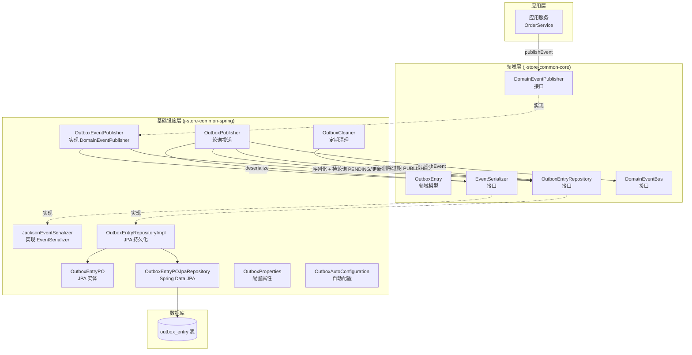
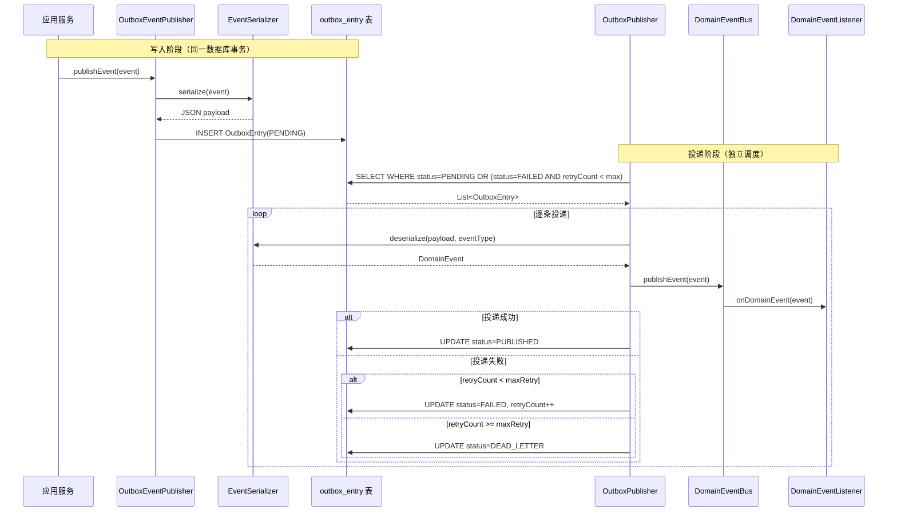

# 设计文档：Transactional Outbox（事务性发件箱）

## 概述

本设计为 j-store 系统引入 Transactional Outbox 模式，解决当前领域事件发布（纯内存 `ApplicationEventPublisher`）与业务数据持久化不在同一原子操作中的问题。核心思路：在业务事务中将领域事件写入 `outbox_entry` 表，由独立的后台轮询进程异步投递到现有的 `DomainEventBus`，从而保证事件投递的可靠性和最终一致性。

设计遵循项目 DDD 架构规范：
- 领域模型（`OutboxEntry`、`OutboxEntryRepository`、`EventSerializer` 接口）放在 `j-store-common-core`，不依赖任何框架
- Spring 集成实现（`OutboxEventPublisher`、`OutboxPublisher`、JPA 持久化、调度配置）放在 `j-store-common-spring`
- DDL 脚本放在 `j-store-boot`

## 架构

### 系统组件图



### 数据流



## 组件与接口

### 1. OutboxEntry — 领域模型（j-store-common-core）

Outbox 条目的领域模型，表示一条待发布的领域事件记录。

```kotlin
// 包路径: com.jstore.common.framework.event.outbox

/** Outbox 条目状态 */
enum class OutboxEntryStatus {
    PENDING,      // 待投递
    PUBLISHED,    // 已投递
    FAILED,       // 投递失败，待重试
    DEAD_LETTER   // 死信，超过最大重试次数
}

/** Outbox 条目领域模型 */
data class OutboxEntry(
    val id: String,                        // 唯一事件 ID（UUID）
    val eventType: String,                 // 事件类型（全限定类名）
    val payload: String,                   // 事件载荷（JSON）
    val aggregateType: String,             // 聚合根类型
    val aggregateId: String,               // 聚合根 ID
    val status: OutboxEntryStatus,         // 状态
    val createdAt: Instant,                // 创建时间
    val updatedAt: Instant,                // 更新时间
    val retryCount: Int = 0               // 重试次数
)
```

### 2. OutboxEntryRepository — 领域仓储接口（j-store-common-core）

```kotlin
// 包路径: com.jstore.common.framework.event.outbox

interface OutboxEntryRepository {
    fun save(entry: OutboxEntry): OutboxEntry
    fun findPendingAndRetryable(maxRetryCount: Int, batchSize: Int): List<OutboxEntry>
    fun deletePublishedBefore(before: Instant, batchSize: Int): Int
}
```

### 3. EventSerializer — 序列化接口（j-store-common-core）

```kotlin
// 包路径: com.jstore.common.framework.event.outbox

interface EventSerializer {
    fun serialize(event: DomainEvent): String
    fun deserialize(payload: String, eventType: String): DomainEvent
}
```

### 4. OutboxEventPublisher — 事件发布者实现（j-store-common-spring）

实现 `DomainEventPublisher` 接口，将事件序列化后写入 Outbox 表，替代 `SpringDomainEventPublisher`。

```kotlin
// 包路径: com.jstore.common.framework.event.outbox

class OutboxEventPublisher(
    private val outboxEntryRepository: OutboxEntryRepository,
    private val eventSerializer: EventSerializer,
) : DomainEventPublisher {

    override fun <T : DomainEvent> publishEvent(event: T) {
        val entry = OutboxEntry(
            id = UUID.randomUUID().toString(),
            eventType = event::class.java.name,
            payload = eventSerializer.serialize(event),
            aggregateType = extractAggregateType(event),
            aggregateId = extractAggregateId(event),
            status = OutboxEntryStatus.PENDING,
            createdAt = Instant.now(),
            updatedAt = Instant.now(),
            retryCount = 0
        )
        outboxEntryRepository.save(entry)
    }
}
```

### 5. OutboxPublisher — 轮询投递（j-store-common-spring）

后台调度任务，轮询 Outbox 表中待投递的事件并分发到 `DomainEventBus`。

```kotlin
// 包路径: com.jstore.common.framework.event.outbox

class OutboxPublisher(
    private val outboxEntryRepository: OutboxEntryRepository,
    private val eventSerializer: EventSerializer,
    private val domainEventBus: DomainEventBus,
    private val properties: OutboxProperties,
) {
    // 由 @Scheduled 调度
    fun pollAndPublish() {
        val entries = outboxEntryRepository.findPendingAndRetryable(
            maxRetryCount = properties.maxRetryCount,
            batchSize = properties.batchSize
        )
        var successCount = 0
        var failCount = 0
        for (entry in entries) {
            try {
                val event = eventSerializer.deserialize(entry.payload, entry.eventType)
                domainEventBus.publishEvent(event)
                outboxEntryRepository.save(entry.copy(
                    status = OutboxEntryStatus.PUBLISHED,
                    updatedAt = Instant.now()
                ))
                successCount++
            } catch (e: Exception) {
                val newRetryCount = entry.retryCount + 1
                val newStatus = if (newRetryCount >= properties.maxRetryCount)
                    OutboxEntryStatus.DEAD_LETTER else OutboxEntryStatus.FAILED
                outboxEntryRepository.save(entry.copy(
                    status = newStatus,
                    retryCount = newRetryCount,
                    updatedAt = Instant.now()
                ))
                failCount++
            }
        }
        // 记录日志
    }
}
```

### 6. OutboxCleaner — 定期清理（j-store-common-spring）

```kotlin
// 包路径: com.jstore.common.framework.event.outbox

class OutboxCleaner(
    private val outboxEntryRepository: OutboxEntryRepository,
    private val properties: OutboxProperties,
) {
    // 由 @Scheduled 调度
    fun cleanup() {
        val before = Instant.now().minus(properties.retentionDays.toLong(), ChronoUnit.DAYS)
        val deleted = outboxEntryRepository.deletePublishedBefore(before, properties.cleanupBatchSize)
        // 记录日志
    }
}
```

### 7. JacksonEventSerializer — Jackson 序列化实现（j-store-common-spring）

```kotlin
// 包路径: com.jstore.common.framework.event.outbox

class JacksonEventSerializer(
    private val objectMapper: ObjectMapper
) : EventSerializer {

    override fun serialize(event: DomainEvent): String {
        return objectMapper.writeValueAsString(event)
    }

    override fun deserialize(payload: String, eventType: String): DomainEvent {
        val clazz = try {
            Class.forName(eventType)
        } catch (e: ClassNotFoundException) {
            throw OutboxSerializationException(
                "无法识别的事件类型: $eventType", e
            )
        }
        return try {
            objectMapper.readValue(payload, clazz) as DomainEvent
        } catch (e: Exception) {
            val summary = if (payload.length > 200) payload.substring(0, 200) + "..." else payload
            throw OutboxSerializationException(
                "JSON 反序列化失败, eventType=$eventType, payload=$summary", e
            )
        }
    }
}
```

### 8. OutboxProperties — 配置属性（j-store-common-spring）

```kotlin
// 包路径: com.jstore.common.framework.event.outbox

@ConfigurationProperties(prefix = "jstore.outbox")
data class OutboxProperties(
    val enabled: Boolean = false,                  // 是否启用 Outbox 模式
    val pollingInterval: Long = 5000,              // 轮询间隔（毫秒），默认 5 秒
    val batchSize: Int = 100,                      // 每次轮询批次大小
    val maxRetryCount: Int = 5,                    // 最大重试次数
    val retentionDays: Int = 7,                    // 已发布事件保留天数
    val cleanupBatchSize: Int = 500,               // 清理批次大小
    val cleanupCron: String = "0 0 3 * * ?"        // 清理任务 cron 表达式，默认每天凌晨 3 点
)
```

### 9. OutboxAutoConfiguration — 自动配置（j-store-common-spring）

```kotlin
// 包路径: com.jstore.common.framework.event.outbox

@Configuration
@EnableConfigurationProperties(OutboxProperties::class)
@ConditionalOnProperty(prefix = "jstore.outbox", name = ["enabled"], havingValue = "true")
@EnableScheduling
class OutboxAutoConfiguration {

    @Bean
    fun eventSerializer(objectMapper: ObjectMapper): EventSerializer {
        return JacksonEventSerializer(objectMapper)
    }

    @Bean
    fun outboxEntryRepository(jpaRepository: OutboxEntryPOJpaRepository): OutboxEntryRepository {
        return OutboxEntryRepositoryImpl(jpaRepository)
    }

    @Bean
    fun domainEventPublisher(
        outboxEntryRepository: OutboxEntryRepository,
        eventSerializer: EventSerializer,
    ): DomainEventPublisher {
        return OutboxEventPublisher(outboxEntryRepository, eventSerializer)
    }

    @Bean
    fun outboxPublisher(
        outboxEntryRepository: OutboxEntryRepository,
        eventSerializer: EventSerializer,
        domainEventBus: DomainEventBus,
        properties: OutboxProperties,
    ): OutboxPublisher {
        return OutboxPublisher(outboxEntryRepository, eventSerializer, domainEventBus, properties)
    }

    @Bean
    fun outboxCleaner(
        outboxEntryRepository: OutboxEntryRepository,
        properties: OutboxProperties,
    ): OutboxCleaner {
        return OutboxCleaner(outboxEntryRepository, properties)
    }
}
```

当 `jstore.outbox.enabled=true` 时，`OutboxAutoConfiguration` 注册 `OutboxEventPublisher` 作为 `DomainEventPublisher` Bean，覆盖 `OrderBootConfiguration` 中原有的 `SpringDomainEventPublisher`。当 `enabled=false`（默认）时，该配置类不生效，系统回退到原有的 `SpringDomainEventPublisher`。

### 10. JPA 持久化层（j-store-common-spring）

```kotlin
// OutboxEntryPO — JPA 实体
@Entity
@Table(name = "outbox_entry")
class OutboxEntryPO(
    @Id
    @Column(name = "id", length = 36)
    var id: String = "",

    @Column(name = "event_type", nullable = false, length = 512)
    var eventType: String = "",

    @Column(name = "payload", nullable = false, columnDefinition = "TEXT")
    var payload: String = "",

    @Column(name = "aggregate_type", nullable = false, length = 256)
    var aggregateType: String = "",

    @Column(name = "aggregate_id", nullable = false, length = 128)
    var aggregateId: String = "",

    @Enumerated(EnumType.STRING)
    @Column(name = "status", nullable = false, length = 20)
    var status: OutboxEntryStatus = OutboxEntryStatus.PENDING,

    @Column(name = "created_at", nullable = false)
    var createdAt: Instant = Instant.now(),

    @Column(name = "updated_at", nullable = false)
    var updatedAt: Instant = Instant.now(),

    @Column(name = "retry_count", nullable = false)
    var retryCount: Int = 0
)

// OutboxEntryPOJpaRepository — Spring Data JPA
interface OutboxEntryPOJpaRepository : JpaRepository<OutboxEntryPO, String> {

    @Query("""
        SELECT e FROM OutboxEntryPO e 
        WHERE e.status = 'PENDING' 
           OR (e.status = 'FAILED' AND e.retryCount < :maxRetryCount)
        ORDER BY e.createdAt ASC
    """)
    fun findPendingAndRetryable(
        @Param("maxRetryCount") maxRetryCount: Int,
        pageable: Pageable
    ): List<OutboxEntryPO>

    @Modifying
    @Query("""
        DELETE FROM OutboxEntryPO e 
        WHERE e.status = 'PUBLISHED' AND e.createdAt < :before
    """)
    fun deletePublishedBefore(@Param("before") before: Instant, pageable: Pageable): Int
}

// OutboxEntryRepositoryImpl — 仓储实现
class OutboxEntryRepositoryImpl(
    private val jpaRepository: OutboxEntryPOJpaRepository
) : OutboxEntryRepository {

    override fun save(entry: OutboxEntry): OutboxEntry {
        val po = Converter.toPO(entry)
        val saved = jpaRepository.save(po)
        return Converter.toDomain(saved)
    }

    override fun findPendingAndRetryable(maxRetryCount: Int, batchSize: Int): List<OutboxEntry> {
        return jpaRepository.findPendingAndRetryable(
            maxRetryCount, PageRequest.of(0, batchSize)
        ).map(Converter::toDomain)
    }

    override fun deletePublishedBefore(before: Instant, batchSize: Int): Int {
        return jpaRepository.deletePublishedBefore(before, PageRequest.of(0, batchSize))
    }

    private object Converter {
        fun toPO(entry: OutboxEntry) = OutboxEntryPO(
            id = entry.id,
            eventType = entry.eventType,
            payload = entry.payload,
            aggregateType = entry.aggregateType,
            aggregateId = entry.aggregateId,
            status = entry.status,
            createdAt = entry.createdAt,
            updatedAt = entry.updatedAt,
            retryCount = entry.retryCount
        )

        fun toDomain(po: OutboxEntryPO) = OutboxEntry(
            id = po.id,
            eventType = po.eventType,
            payload = po.payload,
            aggregateType = po.aggregateType,
            aggregateId = po.aggregateId,
            status = po.status,
            createdAt = po.createdAt,
            updatedAt = po.updatedAt,
            retryCount = po.retryCount
        )
    }
}
```

## 数据模型

### outbox_entry 表 DDL（PostgreSQL）

```sql
CREATE TABLE IF NOT EXISTS outbox_entry (
    id              VARCHAR(36)     PRIMARY KEY,
    event_type      VARCHAR(512)    NOT NULL,
    payload         TEXT            NOT NULL,
    aggregate_type  VARCHAR(256)    NOT NULL,
    aggregate_id    VARCHAR(128)    NOT NULL,
    status          VARCHAR(20)     NOT NULL DEFAULT 'PENDING',
    created_at      TIMESTAMPTZ     NOT NULL DEFAULT NOW(),
    updated_at      TIMESTAMPTZ     NOT NULL DEFAULT NOW(),
    retry_count     INTEGER         NOT NULL DEFAULT 0
);

-- 轮询查询索引：按状态 + 创建时间排序
CREATE INDEX IF NOT EXISTS idx_outbox_entry_status_created 
    ON outbox_entry (status, created_at ASC);

-- 清理查询索引：按状态 + 创建时间
CREATE INDEX IF NOT EXISTS idx_outbox_entry_cleanup 
    ON outbox_entry (status, created_at) 
    WHERE status = 'PUBLISHED';

-- 聚合根维度查询索引（可选，用于排查）
CREATE INDEX IF NOT EXISTS idx_outbox_entry_aggregate 
    ON outbox_entry (aggregate_type, aggregate_id, created_at ASC);
```

### 配置属性

| 属性 | 类型 | 默认值 | 说明 |
|------|------|--------|------|
| `jstore.outbox.enabled` | Boolean | `false` | 是否启用 Outbox 模式 |
| `jstore.outbox.polling-interval` | Long | `5000` | 轮询间隔（毫秒） |
| `jstore.outbox.batch-size` | Int | `100` | 每次轮询批次大小 |
| `jstore.outbox.max-retry-count` | Int | `5` | 最大重试次数 |
| `jstore.outbox.retention-days` | Int | `7` | 已发布事件保留天数 |
| `jstore.outbox.cleanup-batch-size` | Int | `500` | 清理批次大小 |
| `jstore.outbox.cleanup-cron` | String | `0 0 3 * * ?` | 清理任务 cron 表达式 |


## 正确性属性

*正确性属性是一种在系统所有有效执行中都应成立的特征或行为——本质上是对系统应做什么的形式化陈述。属性是人类可读规格说明与机器可验证正确性保证之间的桥梁。*

### Property 1: 事件持久化为 PENDING 状态

*For any* 有效的 `DomainEvent` 对象，通过 `OutboxEventPublisher.publishEvent()` 发布后，`OutboxEntryRepository` 中应存在一条对应的 `OutboxEntry`，其 `status` 为 `PENDING`，`eventType` 为事件的全限定类名，`payload` 为事件的 JSON 序列化结果。

**Validates: Requirements 1.1**

### Property 2: 序列化/反序列化 Round-Trip

*For any* 有效的 `DomainEvent` 对象，通过 `EventSerializer.serialize()` 序列化为 JSON 字符串后，再通过 `EventSerializer.deserialize()` 反序列化，应产生与原始对象等价的对象。

**Validates: Requirements 4.1, 4.2, 4.3, 1.5**

### Property 3: 成功投递后状态变更为 PUBLISHED

*For any* 状态为 `PENDING` 的 `OutboxEntry`，当 `OutboxPublisher` 成功将其反序列化并投递到 `DomainEventBus` 后，该条目的 `status` 应更新为 `PUBLISHED`。

**Validates: Requirements 2.2, 2.3**

### Property 4: 事件按创建时间升序投递

*For any* 一组状态为 `PENDING` 或可重试 `FAILED` 的 `OutboxEntry`，`OutboxPublisher` 投递到 `DomainEventBus` 的事件顺序应与这些条目的 `createdAt` 升序一致。

**Validates: Requirements 2.4**

### Property 5: 批次大小限制

*For any* 轮询操作，当 Outbox 表中待投递的条目数量超过配置的 `batchSize` 时，`OutboxPublisher` 每次轮询获取的条目数量不应超过 `batchSize`。

**Validates: Requirements 2.5**

### Property 6: 失败处理与死信转换

*For any* `OutboxEntry`，当投递到 `DomainEventBus` 失败时：若 `retryCount + 1 < maxRetryCount`，则 `status` 应更新为 `FAILED` 且 `retryCount` 加 1；若 `retryCount + 1 >= maxRetryCount`，则 `status` 应更新为 `DEAD_LETTER`。

**Validates: Requirements 3.1, 3.3**

### Property 7: 重试资格查询

*For any* Outbox 表中的条目集合，`findPendingAndRetryable` 查询应仅返回 `status = PENDING` 或 `(status = FAILED AND retryCount < maxRetryCount)` 的条目，不应返回 `PUBLISHED` 或 `DEAD_LETTER` 状态的条目。

**Validates: Requirements 3.2**

### Property 8: 清理仅删除符合条件的已发布条目

*For any* 清理操作，仅 `status = PUBLISHED` 且 `createdAt` 早于保留期限的条目应被删除；`DEAD_LETTER` 状态的条目无论创建时间多久都不应被删除；`PENDING` 和 `FAILED` 状态的条目也不应被删除。

**Validates: Requirements 6.1, 6.3, 6.4**

## 错误处理

| 场景 | 处理方式 |
|------|----------|
| 事件序列化失败 | `OutboxEventPublisher` 抛出异常，业务事务回滚，事件和业务数据均不持久化 |
| 事件反序列化失败（未知类型） | `JacksonEventSerializer` 抛出 `OutboxSerializationException`，包含事件类型信息；`OutboxPublisher` 捕获后标记为 FAILED/DEAD_LETTER |
| 事件反序列化失败（JSON 格式错误） | `JacksonEventSerializer` 抛出 `OutboxSerializationException`，包含载荷摘要；`OutboxPublisher` 捕获后标记为 FAILED/DEAD_LETTER |
| `DomainEventBus` 投递失败 | `OutboxPublisher` 捕获异常，更新条目状态为 FAILED，`retryCount++`；达到上限则标记为 DEAD_LETTER |
| `OutboxPublisher` 轮询过程中自身异常 | 捕获顶层异常，记录 ERROR 日志，不中断调度，下一个 `pollingInterval` 继续轮询 |
| 数据库连接异常 | JPA 层抛出异常，`OutboxPublisher` 捕获后记录日志，等待下次轮询重试 |

自定义异常类（放在 `j-store-common-core`）：

```kotlin
class OutboxSerializationException(
    message: String,
    cause: Throwable? = null
) : RuntimeException(message, cause)
```

## 测试策略

### 属性测试（Property-Based Testing）

使用 [Kotest](https://kotest.io/) 的 property testing 模块（`kotest-property`）进行属性测试。

- 每个属性测试运行最少 100 次迭代
- 每个测试通过注释标注对应的设计属性
- 标注格式：`Feature: transactional-outbox, Property {number}: {property_text}`

重点属性测试：
- **Property 2（Round-Trip）**：生成随机 `DomainEvent` 对象（包括各种 `OrderDomainEvent` 子类），验证序列化/反序列化的等价性。这是序列化正确性的核心保证。
- **Property 6（失败处理）**：生成不同 `retryCount` 的 `OutboxEntry`，模拟投递失败，验证状态转换逻辑。
- **Property 7（重试资格）**：生成混合状态和重试次数的条目集合，验证查询结果的正确性。
- **Property 8（清理逻辑）**：生成不同状态和创建时间的条目集合，验证清理操作的选择性。

### 单元测试

- `OutboxEventPublisher`：验证 `publishEvent` 正确创建 `OutboxEntry` 并调用 `save`
- `OutboxPublisher`：验证轮询、投递、状态更新的完整流程；验证异常不中断调度
- `OutboxCleaner`：验证清理逻辑的正确性
- `JacksonEventSerializer`：验证未知类型和格式错误 JSON 的异常处理

### 集成测试

- 事务原子性：验证业务数据和 Outbox 条目在同一事务中提交/回滚
- Spring Bean 装配：验证 `enabled=true` 时注册 `OutboxEventPublisher`，`enabled=false` 时回退到 `SpringDomainEventPublisher`
- 端到端流程：验证从 `OrderService.createOrder()` 到事件最终被 `DomainEventListener` 接收的完整链路
