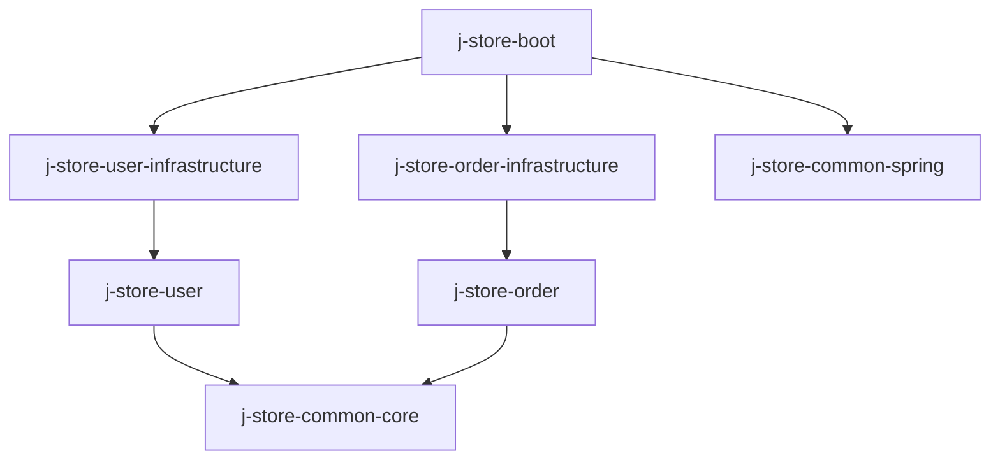

# 设计文档：平台统一用户账号模型

## 概述

本设计在 j-store 项目中实现平台统一自然人账号限界上下文。核心聚合根 `UserAccount` 只封装登录身份、凭据和账号生命周期，不携带 C/B 类型；商户经营身份由 shop 上下文的 `MerchantMembership` 独立表达。认证采用双 Token 机制（短期 AccessToken + 长期 RefreshToken），配合 Redis Token 黑名单实现即时强制下线。

### 设计决策

1. **模块拆分**：`j-store-user`（领域 + 应用层）和 `j-store-user-infrastructure`（JPA 持久化、Redis Token 存储、JWT 实现、BCrypt 密码哈希）
2. **接口隔离**：`TokenProvider` 和 `PasswordHasher` 接口定义在领域层，实现在基础设施层，保持领域层零框架依赖
3. **Token 策略**：AccessToken（15min JWT，无状态校验 + Redis 黑名单检查）+ RefreshToken（7d，Redis 存储，支持 Rotation）
4. **聚合根模式**：采用接口 + Impl 模式，与 Order 聚合保持一致
5. **跨上下文引用**：其他限界上下文通过 `UserId` 值引用用户，不直接依赖 UserAccount
6. **业务身份分离**：同一 `UserId` 可同时作为买家和多个商户的成员；商户权限不写入全局账号或 Token

## 架构

### 模块依赖关系



### 分层架构

```
j-store-user (领域 + 应用层，无 Spring 依赖)
├── domain/useraccount/
│   ├── UserAccount.kt              # 聚合根接口
│   ├── UserAccountImpl.kt          # 聚合根实现
│   ├── UserAccountFactory.kt       # 工厂
│   ├── UserAccountRepository.kt    # 仓储接口
│   ├── UserAccountErrors.kt        # 错误常量
│   ├── UserId.kt                   # 类型化 ID
│   ├── Nickname.kt                 # 昵称值对象
│   ├── Password.kt                 # 密码值对象（哈希密文）
│   ├── UserAccountStatus.kt        # 状态枚举
│   ├── AuthTokenPair.kt            # 令牌对值对象
│   ├── TokenProvider.kt            # 令牌提供者接口
│   ├── PasswordHasher.kt           # 密码哈希接口
│   ├── TokenStore.kt               # Token 存储接口（RefreshToken + 黑名单）
│   ├── command/
│   │   └── UserRegisterCMD.kt      # 注册命令
│   └── event/
│       ├── UserAccountRegisteredEvent.kt
│       ├── UserAccountLoggedInEvent.kt
│       └── UserAccountForcedOfflineEvent.kt
└── service/
    └── UserAccountService.kt       # 应用服务

j-store-user-infrastructure (基础设施层)
├── domain/useraccount/
│   ├── UserAccountRepositoryImpl.kt
│   ├── persistence/
│   │   ├── UserAccountPO.kt
│   │   └── UserAccountPOJpaRepository.kt
│   ├── JwtTokenProvider.kt         # JWT 实现
│   ├── BCryptPasswordHasher.kt     # BCrypt 实现
│   └── RedisTokenStore.kt          # Redis Token 存储实现

j-store-boot (接口层)
├── com/jstore/user/
│   ├── config/UserBootConfiguration.kt
│   ├── controller/UserAccountController.kt
│   └── filter/JwtAuthenticationFilter.kt
```

## 组件与接口

### 1. UserAccount 聚合根

```kotlin
// 聚合根接口
interface UserAccount : AgreeGate<UserId> {
    override val id: UserId
    val phoneNumber: PhoneNumber
    val nickname: Nickname
    val passwordHash: Password
    val status: UserAccountStatus
    val createTime: LocalDateTime
    val updateTime: LocalDateTime

    /** 修改昵称 */
    fun changeNickname(newNickname: Nickname): Result<Unit, BusinessError>
    /** 修改密码（需传入新的哈希密文） */
    fun changePassword(newPasswordHash: Password): Result<Unit, BusinessError>
    /** 禁用账号 */
    fun disable(): Result<Unit, BusinessError>
    /** 启用账号 */
    fun enable(): Result<Unit, BusinessError>
}
```

### 2. 值对象

```kotlin
// 类型化 ID
data class UserId(override val value: Long) : Id<Long>(value)

// 昵称值对象
data class Nickname(val value: String) {
    init {
        require(value.isNotBlank()) { "昵称不能为空" }
        require(value.length <= 20) { "昵称长度不能超过20个字符" }
    }
}

// 密码值对象（存储哈希密文）
data class Password(val hashedValue: String) {
    init {
        require(hashedValue.isNotBlank()) { "密码哈希不能为空" }
    }
}

// 账号状态枚举
enum class UserAccountStatus {
    ACTIVE,   // 正常
    DISABLED  // 禁用
}

// 认证令牌对
data class AuthTokenPair(
    val accessToken: String,
    val accessTokenExpiresAt: LocalDateTime,
    val refreshToken: String,
    val refreshTokenExpiresAt: LocalDateTime,
)
```

### 3. 领域接口（基础设施实现）

```kotlin
// 令牌提供者接口
interface TokenProvider {
    /** 签发 AccessToken，返回 token 字符串 */
    fun issueAccessToken(userId: UserId): String
    /** 签发 RefreshToken，返回 token 字符串 */
    fun issueRefreshToken(userId: UserId): String
    /** 解析 AccessToken，返回 userId；无效则返回 null */
    fun parseAccessToken(token: String): UserId?
    /** 解析 RefreshToken，返回 userId；无效则返回 null */
    fun parseRefreshToken(token: String): UserId?
    /** 获取 AccessToken 的 jti */
    fun getAccessTokenJti(token: String): String?
    /** 获取 AccessToken 的剩余有效期（秒） */
    fun getAccessTokenRemainingSeconds(token: String): Long
}

// 密码哈希接口
interface PasswordHasher {
    /** 将明文密码哈希 */
    fun hash(rawPassword: String): String
    /** 验证明文密码与哈希值是否匹配 */
    fun matches(rawPassword: String, hashedPassword: String): Boolean
}

// Token 存储接口（Redis）
interface TokenStore {
    /** 存储 RefreshToken */
    fun storeRefreshToken(userId: UserId, refreshToken: String, ttlSeconds: Long)
    /** 获取存储的 RefreshToken */
    fun getRefreshToken(userId: UserId): String?
    /** 删除 RefreshToken */
    fun removeRefreshToken(userId: UserId)
    /** 将 AccessToken 加入黑名单 */
    fun blacklistAccessToken(jti: String, ttlSeconds: Long)
    /** 检查 AccessToken 是否在黑名单中 */
    fun isAccessTokenBlacklisted(jti: String): Boolean
}
```

### 4. 仓储接口

```kotlin
interface UserAccountRepository : Repository<UserId, UserAccount> {
    fun add(userAccount: UserAccount)
    override fun save(entity: UserAccount): UserAccount
    override fun findById(id: UserId): UserAccount?
    fun findByPhoneNumber(phoneNumber: PhoneNumber): UserAccount?
    fun existsById(id: UserId): Boolean
    fun existsByPhoneNumber(phoneNumber: PhoneNumber): Boolean
}
```

### 5. 工厂

```kotlin
interface UserAccountFactory {
    fun create(
        cmd: UserRegisterCMD,
        passwordHasher: PasswordHasher,
    ): Result<UserAccount, BusinessError>
}
```

### 6. 应用服务

```kotlin
class UserAccountService(
    private val userAccountFactory: UserAccountFactory,
    private val userAccountRepository: UserAccountRepository,
    private val passwordHasher: PasswordHasher,
    private val tokenProvider: TokenProvider,
    private val tokenStore: TokenStore,
    private val domainEventPublisher: DomainEventPublisher,
) {
    fun register(cmd: UserRegisterCMD): Result<UserAccount, BusinessError>
    fun login(phoneNumber: PhoneNumber, rawPassword: String): Result<AuthTokenPair, BusinessError>
    fun refreshToken(refreshToken: String): Result<AuthTokenPair, BusinessError>
    fun findById(userId: UserId): Result<UserAccount, BusinessError>
    fun changeNickname(userId: UserId, newNickname: Nickname): Result<Unit, BusinessError>
    fun changePassword(userId: UserId, oldPassword: String, newPassword: String): Result<Unit, BusinessError>
    fun disable(userId: UserId): Result<Unit, BusinessError>
    fun enable(userId: UserId): Result<Unit, BusinessError>
    fun forceOffline(userId: UserId): Result<Unit, BusinessError>
}
```

### 7. 认证过滤器

```kotlin
// j-store-boot 中的 Spring Filter
class JwtAuthenticationFilter(
    private val tokenProvider: TokenProvider,
    private val tokenStore: TokenStore,
) : OncePerRequestFilter() {
    // 拦截请求 → 解析 JWT → 检查黑名单 → 注入 userId 到请求上下文
}
```

### 8. 领域事件

```kotlin
data class UserAccountRegisteredEvent(
    override val source: Any,
    val userId: UserId,
    val phoneNumber: PhoneNumber,
) : DomainEvent

data class UserAccountLoggedInEvent(
    override val source: Any,
    val userId: UserId,
    val loginTime: LocalDateTime,
) : DomainEvent

data class UserAccountForcedOfflineEvent(
    override val source: Any,
    val userId: UserId,
    val operationTime: LocalDateTime,
) : DomainEvent
```

## 数据模型

### UserAccount 表（user_accounts）

| 列名 | 类型 | 约束 | 说明 |
|------|------|------|------|
| id | BIGINT | PK, AUTO_INCREMENT | 用户 ID |
| phone_number | VARCHAR(11) | NOT NULL, UNIQUE | 手机号 |
| nickname | VARCHAR(20) | NOT NULL | 昵称 |
| password_hash | VARCHAR(255) | NOT NULL | BCrypt 哈希密文 |
| status | VARCHAR(16) | NOT NULL, DEFAULT 'ACTIVE' | 账号状态 |
| create_time | TIMESTAMP | NOT NULL | 创建时间 |
| update_time | TIMESTAMP | NOT NULL | 更新时间 |

### Redis 数据结构

| Key 模式 | 类型 | TTL | 说明 |
|----------|------|-----|------|
| `refresh_token:{userId}` | STRING | 7 天 | 存储用户当前有效的 RefreshToken |
| `token_blacklist:{jti}` | STRING | AccessToken 剩余有效期 | 已吊销的 AccessToken 标记 |

### PO 类映射

```kotlin
@Entity
@Table(name = "user_accounts")
class UserAccountPO(
    @Id
    @GeneratedValue(strategy = GenerationType.IDENTITY)
    @Column(name = "id")
    var id: Long = 0,

    @Column(name = "phone_number", nullable = false, unique = true, length = 11)
    var phoneNumber: String = "",

    @Column(name = "nickname", nullable = false, length = 20)
    var nickname: String = "",

    @Column(name = "password_hash", nullable = false, length = 255)
    var passwordHash: String = "",

    @Enumerated(EnumType.STRING)
    @Column(name = "status", nullable = false, length = 16)
    var status: UserAccountStatus = UserAccountStatus.ACTIVE,

    @Column(name = "create_time", nullable = false)
    var createTime: LocalDateTime = LocalDateTime.now(),

    @Column(name = "update_time", nullable = false)
    var updateTime: LocalDateTime = LocalDateTime.now(),
)
```


## 正确性属性

*属性（Property）是在系统所有合法执行中都应成立的特征或行为——本质上是对系统应做之事的形式化陈述。属性是人类可读规格说明与机器可验证正确性保证之间的桥梁。*

### Property 1: 注册创建不变量

*For any* 合法的注册参数（有效 PhoneNumber、有效 Nickname、满足强度要求的密码），UserAccountFactory 创建的 UserAccount 状态应为 ACTIVE，且其 domainEventQueue 中应包含一个 UserAccountRegisteredEvent，事件携带的 userId 和 phoneNumber 与聚合根一致。

**Validates: Requirements 1.1, 1.3, 11.1**

### Property 2: 密码哈希 round-trip

*For any* 满足强度要求的明文密码字符串，经 PasswordHasher.hash() 哈希后，再用 PasswordHasher.matches() 验证原始明文与哈希值，结果应为 true。

**Validates: Requirements 1.4, 2.2, 6.1, 6.2**

### Property 3: 无效密码拒绝

*For any* 不满足强度要求的字符串（长度不在 8-32 范围内，或不同时包含字母和数字），密码强度校验应返回失败。

**Validates: Requirements 1.6, 6.4**

### Property 4: Nickname 值对象校验

*For any* 空白字符串或长度超过 20 个字符的字符串，Nickname 构造应抛出异常（拒绝创建）。*For any* 非空且长度 ≤ 20 的字符串，Nickname 构造应成功。

**Validates: Requirements 1.7, 5.2**

### Property 5: 账号状态转移规则

*For any* UserAccount，当状态为 ACTIVE 时执行 disable() 应成功且状态变为 DISABLED；当状态为 DISABLED 时执行 enable() 应成功且状态变为 ACTIVE。当状态为 ACTIVE 时执行 enable() 应返回失败；当状态为 DISABLED 时执行 disable() 应返回失败。

**Validates: Requirements 3.1, 3.2, 3.3, 3.4**

### Property 6: 昵称修改生效

*For any* ACTIVE 状态的 UserAccount 和任意合法的新 Nickname，执行 changeNickname 后，UserAccount 的 nickname 应等于新值。

**Validates: Requirements 5.1**

### Property 7: Token 签发解析 round-trip

*For any* 有效的 UserId，TokenProvider 签发 AccessToken 后解析应返回相同的 UserId，且解析结果包含 jti。签发 RefreshToken 后解析应返回相同的 UserId。

**Validates: Requirements 7.1, 9.5**

## 错误处理

### 错误常量定义

```kotlin
object UserAccountErrors {
    val USER_NOT_FOUND = BusinessError("用户不存在", "User.NotFound", 404)
    val PHONE_ALREADY_REGISTERED = BusinessError("手机号已注册", "User.Phone.Duplicate", 400)
    val PASSWORD_STRENGTH_INSUFFICIENT = BusinessError("密码强度不足", "User.Password.Weak", 400)
    val NICKNAME_INVALID = BusinessError("昵称无效", "User.Nickname.Invalid", 400)
    val PASSWORD_MISMATCH = BusinessError("密码错误", "User.Password.Mismatch", 400)
    val OLD_PASSWORD_MISMATCH = BusinessError("旧密码错误", "User.Password.OldMismatch", 400)
    val ACCOUNT_DISABLED = BusinessError("账号已禁用", "User.Account.Disabled", 403)
    val ILLEGAL_STATE = BusinessError("账号状态不合法", "User.State.Invalid", 400)
    val TOKEN_INVALID = BusinessError("令牌无效", "User.Token.Invalid", 401)
    val TOKEN_EXPIRED = BusinessError("令牌已过期", "User.Token.Expired", 401)
    val REFRESH_TOKEN_REVOKED = BusinessError("令牌已失效，请重新登录", "User.Token.Revoked", 401)
}
```

### 错误处理策略

| 场景 | 错误码 | HTTP 状态码 | 处理方式 |
|------|--------|------------|---------|
| 用户不存在 | User.NotFound | 404 | 返回 Failure |
| 手机号重复 | User.Phone.Duplicate | 400 | 应用服务层查重后返回 Failure |
| 密码强度不足 | User.Password.Weak | 400 | 工厂/应用服务校验后返回 Failure |
| 密码错误 | User.Password.Mismatch | 400 | 应用服务层验证后返回 Failure |
| 账号已禁用 | User.Account.Disabled | 403 | 领域层状态校验返回 Failure |
| 状态不合法 | User.State.Invalid | 400 | 领域层状态转移校验返回 Failure |
| Token 无效/过期 | User.Token.Invalid/Expired | 401 | 认证过滤器拦截 |
| RefreshToken 被吊销 | User.Token.Revoked | 401 | 应用服务层校验后返回 Failure，同时删除 Redis 中的 RefreshToken |

## 测试策略

### 属性测试（Property-Based Testing）

使用 **Kotest Property Testing**（项目已引入 `kotest-property` 依赖）。

- 每个属性测试至少运行 **100 次迭代**
- 每个测试用注释标注对应的设计属性：`// Feature: user-account, Property {N}: {title}`
- 测试文件位于 `j-store-user/src/test/kotlin/com/jstore/user/`

需要实现的属性测试：

| 属性 | 测试目标 | 生成器 |
|------|---------|--------|
| Property 1: 注册创建不变量 | UserAccountFactory.create | 随机合法 PhoneNumber + Nickname + 密码 |
| Property 2: 密码哈希 round-trip | PasswordHasher.hash/matches | 随机合法密码字符串 |
| Property 3: 无效密码拒绝 | 密码强度校验函数 | 随机不合法密码（纯字母/纯数字/过短/过长） |
| Property 4: Nickname 值对象校验 | Nickname 构造函数 | 随机字符串（空白/超长/合法） |
| Property 5: 账号状态转移规则 | UserAccount.disable/enable | 随机 UserAccount（ACTIVE/DISABLED 状态） |
| Property 6: 昵称修改生效 | UserAccount.changeNickname | 随机 ACTIVE UserAccount + 随机合法 Nickname |
| Property 7: Token round-trip | TokenProvider.issue/parse | 随机 UserId |

### 单元测试

- 应用服务层（UserAccountService）：使用 Mockito mock 仓储和基础设施接口，验证编排逻辑
- 重点覆盖：登录流程、Token 刷新流程、强制下线流程、禁用自动下线
- 错误场景：用户不存在、密码错误、账号禁用、Token 无效等

### 集成测试

- 仓储层：验证 PO ↔ 领域对象转换的正确性
- Redis Token 存储：验证 RefreshToken 存取和黑名单操作
- 认证过滤器：验证 HTTP 请求的认证校验流程
