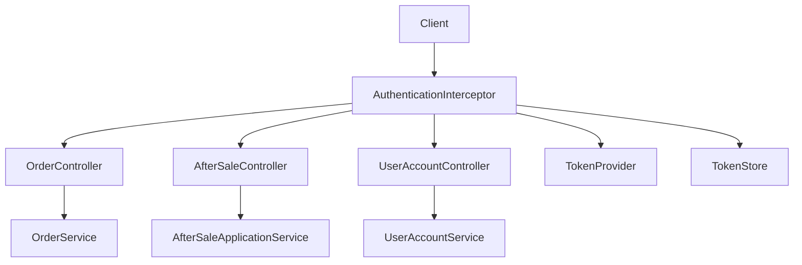
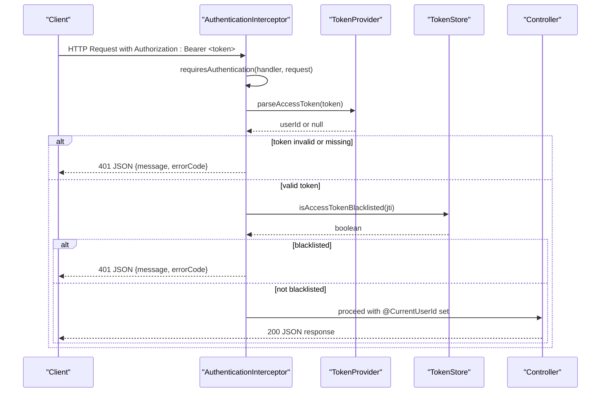
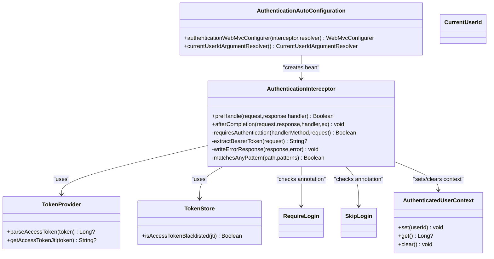
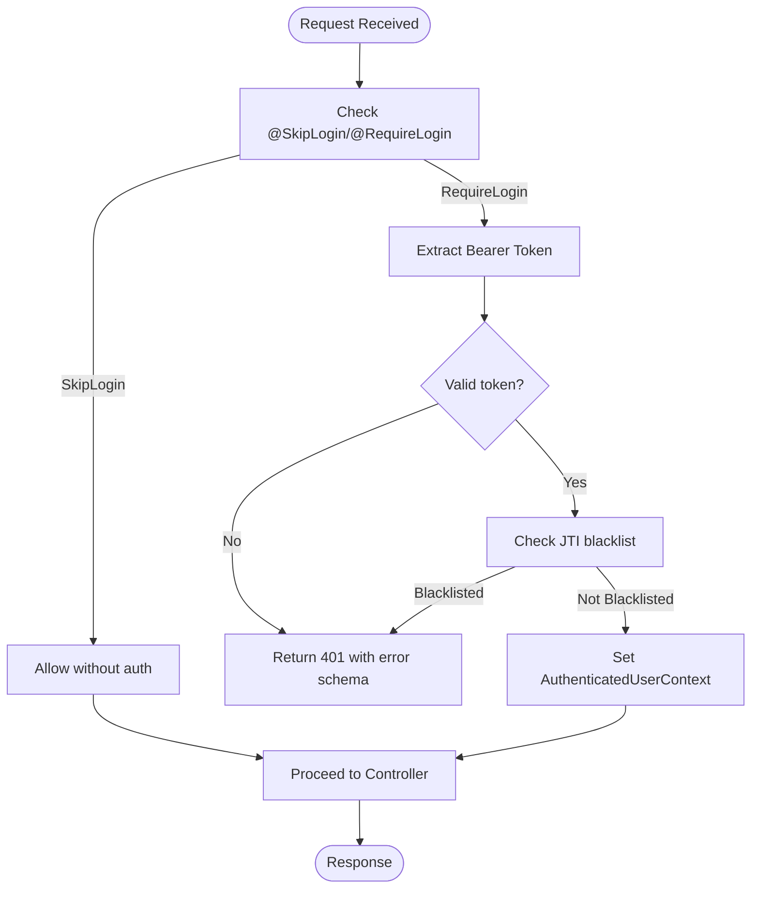
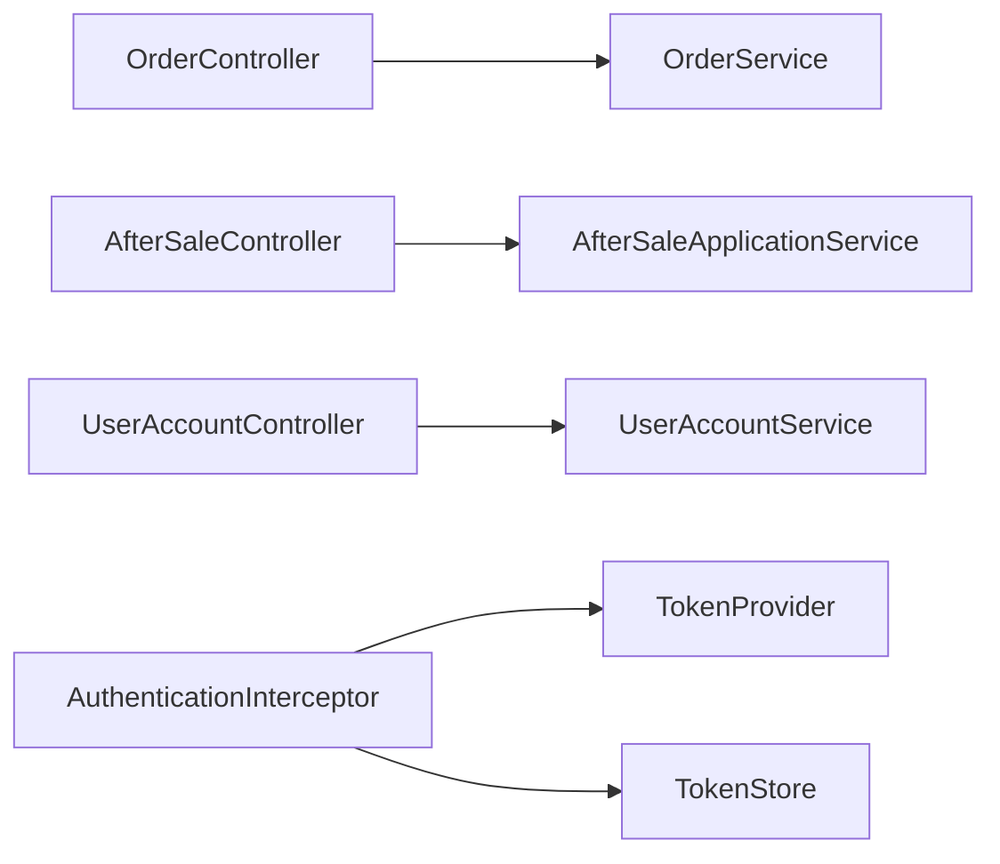

# API Documentation

<cite>
**Referenced Files in This Document**
- [OrderController.kt](file://j-store-boot/src/main/kotlin/com/jstore/order/controller/OrderController.kt)
- [AfterSaleController.kt](file://j-store-boot/src/main/kotlin/com/jstore/order/controller/AfterSaleController.kt)
- [UserAccountController.kt](file://j-store-boot/src/main/kotlin/com/jstore/user/controller/UserAccountController.kt)
- [AuthenticationInterceptor.kt](file://j-store-authentication-spring-sdk/src/main/kotlin/com/jstore/authentication/spring/AuthenticationInterceptor.kt)
- [AuthenticationAutoConfiguration.kt](file://j-store-authentication-spring-sdk/src/main/kotlin/com/jstore/authentication/spring/AuthenticationAutoConfiguration.kt)
- [RequireLogin.kt](file://j-store-authentication-spring-sdk/src/main/kotlin/com/jstore/authentication/annotation/RequireLogin.kt)
- [SkipLogin.kt](file://j-store-authentication-spring-sdk/src/main/kotlin/com/jstore/authentication/annotation/SkipLogin.kt)
- [CurrentUserId.kt](file://j-store-authentication-spring-sdk/src/main/kotlin/com/jstore/authentication/annotation/CurrentUserId.kt)
- [AuthenticatedUserContext.kt](file://j-store-authentication-spring-sdk/src/main/kotlin/com/jstore/authentication/context/AuthenticatedUserContext.kt)
- [AuthenticationErrors.kt](file://j-store-authentication-spring-sdk/src/main/kotlin/com/jstore/authentication/error/AuthenticationErrors.kt)
- [AuthenticationConfigurer.kt](file://j-store-authentication-spring-sdk/src/main/kotlin/com/jstore/authentication/config/AuthenticationConfigurer.kt)
- [TokenProvider.kt](file://j-store-user/src/main/kotlin/com/jstore/user/domain/useraccount/TokenProvider.kt)
- [TokenStore.kt](file://j-store-user/src/main/kotlin/com/jstore/user/domain/useraccount/TokenStore.kt)
- [JwtTokenProvider.kt](file://j-store-user-infrastructure/src/main/kotlin/com/jstore/user/domain/useraccount/JwtTokenProvider.kt)
- [RedisTokenStore.kt](file://j-store-user-infrastructure/src/main/kotlin/com/jstore/user/domain/useraccount/RedisTokenStore.kt)
- [README.md](file://README.md)
</cite>

## Table of Contents
1. [Introduction](#introduction)
2. [Project Structure](#project-structure)
3. [Core Components](#core-components)
4. [Architecture Overview](#architecture-overview)
5. [Detailed Component Analysis](#detailed-component-analysis)
6. [Dependency Analysis](#dependency-analysis)
7. [Performance Considerations](#performance-considerations)
8. [Troubleshooting Guide](#troubleshooting-guide)
9. [Conclusion](#conclusion)
10. [Appendices](#appendices)

## Introduction
This document provides comprehensive API documentation for J-Store’s REST endpoints and authentication interfaces. It covers order management, after-sale processing, and user account operations. It also documents the reusable authentication SDK components, Spring MVC integration, and security annotations used across controllers. The guide includes protocol-specific examples, error handling strategies, security considerations, common use cases, client implementation guidelines, performance optimization tips, and migration/backward compatibility notes where applicable.

## Project Structure
J-Store is a modular Spring Boot application with separate modules for domain logic, infrastructure, and bootstrapping:
- j-store-boot exposes REST controllers for orders, after-sales, and users.
- j-store-authentication-spring-sdk provides a reusable authentication interceptor, annotations, and Spring auto-configuration.
- j-store-user and j-store-user-infrastructure implement token generation and storage (JWT + Redis).
- j-store-order and j-store-order-infrastructure implement order and after-sale business logic.

**Diagram sources**
- [OrderController.kt:1-256](file://j-store-boot/src/main/kotlin/com/jstore/order/controller/OrderController.kt#L1-L256)
- [AfterSaleController.kt:1-36](file://j-store-boot/src/main/kotlin/com/jstore/order/controller/AfterSaleController.kt#L1-L36)
- [UserAccountController.kt:1-182](file://j-store-boot/src/main/kotlin/com/jstore/user/controller/UserAccountController.kt#L1-L182)
- [AuthenticationInterceptor.kt:1-113](file://j-store-authentication-spring-sdk/src/main/kotlin/com/jstore/authentication/spring/AuthenticationInterceptor.kt#L1-L113)
- [TokenProvider.kt](file://j-store-user/src/main/kotlin/com/jstore/user/domain/useraccount/TokenProvider.kt)
- [TokenStore.kt](file://j-store-user/src/main/kotlin/com/jstore/user/domain/useraccount/TokenStore.kt)

**Section sources**
- [README.md:1-53](file://README.md#L1-L53)

## Core Components
- Authentication SDK
  - Interceptor-based security enforcement via HandlerInterceptor.
  - Annotations: @RequireLogin, @SkipLogin, @CurrentUserId.
  - Context propagation through ThreadLocal for authenticated user ID.
  - Auto-configuration registers the interceptor and argument resolver.
- Controllers
  - OrderController: buyer and seller/admin endpoints for orders.
  - AfterSaleController: after-sale lifecycle endpoints.
  - UserAccountController: registration, login, token refresh, profile updates, and account lifecycle.

**Section sources**
- [AuthenticationInterceptor.kt:1-113](file://j-store-authentication-spring-sdk/src/main/kotlin/com/jstore/authentication/spring/AuthenticationInterceptor.kt#L1-L113)
- [AuthenticationAutoConfiguration.kt:26-53](file://j-store-authentication-spring-sdk/src/main/kotlin/com/jstore/authentication/spring/AuthenticationAutoConfiguration.kt#L26-L53)
- [OrderController.kt:1-256](file://j-store-boot/src/main/kotlin/com/jstore/order/controller/OrderController.kt#L1-L256)
- [AfterSaleController.kt:1-36](file://j-store-boot/src/main/kotlin/com/jstore/order/controller/AfterSaleController.kt#L1-L36)
- [UserAccountController.kt:1-182](file://j-store-boot/src/main/kotlin/com/jstore/user/controller/UserAccountController.kt#L1-L182)

## Architecture Overview
The authentication flow uses Bearer tokens validated by the SDK interceptor before reaching controllers. Tokens are parsed using a TokenProvider and optionally checked against a blacklist via TokenStore. Controllers receive the authenticated user ID via @CurrentUserId injection.

**Diagram sources**
- [AuthenticationInterceptor.kt:35-94](file://j-store-authentication-spring-sdk/src/main/kotlin/com/jstore/authentication/spring/AuthenticationInterceptor.kt#L35-L94)
- [AuthenticationInterceptor.kt:96-111](file://j-store-authentication-spring-sdk/src/main/kotlin/com/jstore/authentication/spring/AuthenticationInterceptor.kt#L96-L111)
- [TokenProvider.kt](file://j-store-user/src/main/kotlin/com/jstore/user/domain/useraccount/TokenProvider.kt)
- [TokenStore.kt](file://j-store-user/src/main/kotlin/com/jstore/user/domain/useraccount/TokenStore.kt)

## Detailed Component Analysis

### Authentication SDK
- Interceptor behavior
  - Path-based decisions: supports authenticated and excluded patterns via AuthenticationConfigurer.
  - Annotation priority: @SkipLogin > @RequireLogin > path exclusion > path authentication > default allow.
  - Token extraction from Authorization header with Bearer scheme.
  - Blacklist check via TokenStore to support forced offline/logout.
- Spring integration
  - Auto-configuration registers the interceptor globally and adds CurrentUserIdArgumentResolver.
- Context
  - AuthenticatedUserContext stores current user ID per request thread.

**Diagram sources**
- [AuthenticationInterceptor.kt:18-113](file://j-store-authentication-spring-sdk/src/main/kotlin/com/jstore/authentication/spring/AuthenticationInterceptor.kt#L18-L113)
- [AuthenticationAutoConfiguration.kt:26-53](file://j-store-authentication-spring-sdk/src/main/kotlin/com/jstore/authentication/spring/AuthenticationAutoConfiguration.kt#L26-L53)
- [RequireLogin.kt](file://j-store-authentication-spring-sdk/src/main/kotlin/com/jstore/authentication/annotation/RequireLogin.kt)
- [SkipLogin.kt](file://j-store-authentication-spring-sdk/src/main/kotlin/com/jstore/authentication/annotation/SkipLogin.kt)
- [CurrentUserId.kt](file://j-store-authentication-spring-sdk/src/main/kotlin/com/jstore/authentication/annotation/CurrentUserId.kt)
- [AuthenticatedUserContext.kt](file://j-store-authentication-spring-sdk/src/main/kotlin/com/jstore/authentication/context/AuthenticatedUserContext.kt)
- [TokenProvider.kt](file://j-store-user/src/main/kotlin/com/jstore/user/domain/useraccount/TokenProvider.kt)
- [TokenStore.kt](file://j-store-user/src/main/kotlin/com/jstore/user/domain/useraccount/TokenStore.kt)

**Section sources**
- [AuthenticationInterceptor.kt:1-113](file://j-store-authentication-spring-sdk/src/main/kotlin/com/jstore/authentication/spring/AuthenticationInterceptor.kt#L1-L113)
- [AuthenticationAutoConfiguration.kt:26-53](file://j-store-authentication-spring-sdk/src/main/kotlin/com/jstore/authentication/spring/AuthenticationAutoConfiguration.kt#L26-L53)

### Order Management API
- Base path: /api/orders
- Authentication: Requires login at class level (@RequireLogin), except explicitly skipped.
- Endpoints
  - POST /api/orders — Create order
    - Headers: Authorization: Bearer <accessToken>
    - Body: CreateOrderRequest
    - Response: 200 OK with OrderResponse or error body
  - GET /api/orders/{orderId} — Get order by ID
    - Headers: Authorization: Bearer <accessToken>
    - Response: 200 OK with OrderResponse or error body
  - GET /api/orders — List my orders (pagination)
    - Query params: page (default 1), size (default 10)
    - Response: 200 OK with PageResponse<OrderResponse> or error body
  - POST /api/orders/{orderId}/cancel — Cancel order
    - Headers: Authorization: Bearer <accessToken>
    - Body: CancelOrderRequest
  - POST /api/orders/{orderId}/confirm-delivery — Confirm delivery
    - Headers: Authorization: Bearer <accessToken>
  - POST /api/orders/{orderId}/confirm-shipment — Seller confirm shipment
  - POST /api/orders/{orderId}/ship — Ship order
  - POST /api/orders/{orderId}/complete — Complete order
  - POST /api/orders/{orderId}/pay-callback — Payment callback (internal/system)
    - Body: PayCallbackRequest

Notes:
- All responses wrap success/failure into ResponseEntity with consistent error schema {message, errorCode}.
- Buyer endpoints inject @CurrentUserId; seller/admin endpoints may not require it depending on configuration.

**Section sources**
- [OrderController.kt:17-256](file://j-store-boot/src/main/kotlin/com/jstore/order/controller/OrderController.kt#L17-L256)

### After-Sale Processing API
- Base path: /api/after-sales
- Authentication: Requires login at class level (@RequireLogin).
- Endpoints
  - POST /api/after-sales — Create after-sale
    - Headers: Authorization: Bearer <accessToken>, Idempotency-Key
    - Body: CreateRequest
  - GET /api/after-sales/{id} — Get after-sale by ID
    - Headers: Authorization: Bearer <accessToken>
  - GET /api/after-sales — List after-sales by orderId
    - Query param: orderId
  - POST /api/after-sales/{id}/approve — Approve after-sale
    - Headers: Authorization: Bearer <accessToken>, Idempotency-Key
  - POST /api/after-sales/{id}/reject — Reject after-sale
    - Headers: Authorization: Bearer <accessToken>, Idempotency-Key
    - Body: RejectRequest
  - POST /api/after-sales/{id}/cancel — Cancel after-sale
    - Headers: Authorization: Bearer <accessToken>, Idempotency-Key

Notes:
- Idempotency-Key header is required for mutating operations to ensure idempotent execution.
- Responses follow the same error schema pattern.

**Section sources**
- [AfterSaleController.kt:1-36](file://j-store-boot/src/main/kotlin/com/jstore/order/controller/AfterSaleController.kt#L1-L36)

### User Account API
- Base path: /api/users
- Authentication: No global @RequireLogin; endpoints are public unless otherwise configured.
- Endpoints
  - POST /api/users/register — Register new user
    - Body: RegisterRequest
  - POST /api/users/login — Login
    - Body: LoginRequest
    - Response: TokenResponse {accessToken, accessTokenExpiresAt, refreshToken, refreshTokenExpiresAt}
  - POST /api/users/refresh-token — Refresh access token
    - Body: RefreshTokenRequest
    - Response: TokenResponse
  - GET /api/users/{id} — Get user by ID
  - PUT /api/users/{id}/nickname — Change nickname
    - Body: ChangeNicknameRequest
  - PUT /api/users/{id}/password — Change password
    - Body: ChangePasswordRequest
  - POST /api/users/{id}/disable — Disable account
  - POST /api/users/{id}/enable — Enable account
  - POST /api/users/{id}/force-offline — Force logout (invalidate tokens)

Notes:
- Successful responses return typed DTOs; failures return {message, errorCode}.
- force-offline triggers token invalidation via TokenStore.

**Section sources**
- [UserAccountController.kt:14-182](file://j-store-boot/src/main/kotlin/com/jstore/user/controller/UserAccountController.kt#L14-L182)

### Authentication Flow and Token Validation
- Token issuance and refresh are handled by UserAccountService and persisted via TokenStore.
- Access token validation:
  - Extract Bearer token from Authorization header.
  - Parse user ID and optional JTI.
  - Check blacklist via TokenStore if JTI present.
- Security annotations:
  - @RequireLogin enforces authentication on controller/method.
  - @SkipLogin bypasses authentication even if paths require it.
  - @CurrentUserId injects the authenticated user ID into handler methods.

**Diagram sources**
- [AuthenticationInterceptor.kt:76-94](file://j-store-authentication-spring-sdk/src/main/kotlin/com/jstore/authentication/spring/AuthenticationInterceptor.kt#L76-L94)
- [AuthenticationInterceptor.kt:96-111](file://j-store-authentication-spring-sdk/src/main/kotlin/com/jstore/authentication/spring/AuthenticationInterceptor.kt#L96-L111)

**Section sources**
- [AuthenticationInterceptor.kt:1-113](file://j-store-authentication-spring-sdk/src/main/kotlin/com/jstore/authentication/spring/AuthenticationInterceptor.kt#L1-L113)
- [UserAccountController.kt:90-115](file://j-store-boot/src/main/kotlin/com/jstore/user/controller/UserAccountController.kt#L90-L115)

### Request/Response Schemas
- Common error schema:
  - Fields: message (string), errorCode (string)
  - HTTP status codes vary by error type (e.g., 401 for auth errors, domain-specific codes for business errors).
- Order schemas:
  - CreateOrderRequest: recipientInfo, items[]
  - RecipientInfoRequest: consigneeName, countryCode?, contactPhone?, contactEmail?, shippingDistrictCode, shippingDetailAddress
  - OrderItemRequest: spuId, skuId, quantity, snapshotVersion
  - CancelOrderRequest: category, description
  - OrderResponse: id, buyerUid, buyerPhone?, buyerName?, tradeStatus, paymentStatus, fulfillmentStatus, totalRefundedAmount, totalAmount, actualPay, items[], createTime, updateTime
  - OrderItemResponse: id, skuId, spuId, goodsName, skuDescription, quantity, unitPrice, status, refundedQuantity, refundedAmount
  - PageResponse<T>: current, size, records[]
- After-sale schemas:
  - ItemRequest: orderItemId, quantity, amount, currency="CNY"
  - CreateRequest: orderId, category, description, items[]
  - RejectRequest: rejectionReason
  - ItemResponse: id, orderItemId, requestedQuantity, requestedAmount, currency, eligibleQuantity, eligibleAmount, skuId, spuId, goodsName, skuDescription
  - Response: id, orderId, applicantId, merchantId, status, reason, fulfillmentSnapshot, items[], reviewDecision?, cancelledAt?, createTime, updateTime
- User schemas:
  - RegisterRequest: phoneNumber, nickname, password
  - LoginRequest: phoneNumber, password
  - RefreshTokenRequest: refreshToken
  - ChangeNicknameRequest: nickname
  - ChangePasswordRequest: oldPassword, newPassword
  - UserResponse: id, phoneNumber, nickname, status, createTime, updateTime
  - TokenResponse: accessToken, accessTokenExpiresAt, refreshToken, refreshTokenExpiresAt

**Section sources**
- [OrderController.kt:24-92](file://j-store-boot/src/main/kotlin/com/jstore/order/controller/OrderController.kt#L24-L92)
- [OrderController.kt:216-243](file://j-store-boot/src/main/kotlin/com/jstore/order/controller/OrderController.kt#L216-L243)
- [AfterSaleController.kt:20-35](file://j-store-boot/src/main/kotlin/com/jstore/order/controller/AfterSaleController.kt#L20-L35)
- [UserAccountController.kt:22-67](file://j-store-boot/src/main/kotlin/com/jstore/user/controller/UserAccountController.kt#L22-L67)

### Authentication SDK Usage Guidelines
- Configure protected paths:
  - Implement AuthenticationConfigurer to define authenticatedPathPatterns and excludedPathPatterns.
- Use annotations:
  - @RequireLogin on controllers/methods to enforce authentication.
  - @SkipLogin to bypass authentication for specific methods.
  - @CurrentUserId to inject the authenticated user ID into handlers.
- Integration points:
  - Ensure TokenProvider and TokenStore beans are available (provided by user module infrastructure).
  - Auto-configuration registers the interceptor and argument resolver automatically.

**Section sources**
- [AuthenticationConfigurer.kt](file://j-store-authentication-spring-sdk/src/main/kotlin/com/jstore/authentication/config/AuthenticationConfigurer.kt)
- [AuthenticationAutoConfiguration.kt:38-52](file://j-store-authentication-spring-sdk/src/main/kotlin/com/jstore/authentication/spring/AuthenticationAutoConfiguration.kt#L38-L52)
- [RequireLogin.kt](file://j-store-authentication-spring-sdk/src/main/kotlin/com/jstore/authentication/annotation/RequireLogin.kt)
- [SkipLogin.kt](file://j-store-authentication-spring-sdk/src/main/kotlin/com/jstore/authentication/annotation/SkipLogin.kt)
- [CurrentUserId.kt](file://j-store-authentication-spring-sdk/src/main/kotlin/com/jstore/authentication/annotation/CurrentUserId.kt)

### Error Handling Strategies
- Authentication errors:
  - TOKEN_MISSING, TOKEN_INVALID, TOKEN_BLACKLISTED, INTERNAL_ERROR mapped to appropriate HTTP statuses and JSON error bodies.
- Business errors:
  - Controllers map Result<T, BusinessError> to ResponseEntity with error.httpCode and error.message/errorCode.
- Consistent error schema:
  - {message: string, errorCode: string}

**Section sources**
- [AuthenticationErrors.kt](file://j-store-authentication-spring-sdk/src/main/kotlin/com/jstore/authentication/error/AuthenticationErrors.kt)
- [OrderController.kt:245-254](file://j-store-boot/src/main/kotlin/com/jstore/order/controller/OrderController.kt#L245-L254)
- [AfterSaleController.kt:32-35](file://j-store-boot/src/main/kotlin/com/jstore/order/controller/AfterSaleController.kt#L32-L35)
- [UserAccountController.kt:171-181](file://j-store-boot/src/main/kotlin/com/jstore/user/controller/UserAccountController.kt#L171-L181)

### Security Considerations
- Always validate Authorization header format (Bearer scheme).
- Enforce short-lived access tokens and refresh tokens rotation.
- Use Idempotency-Key headers for state-changing requests to prevent duplicate processing.
- Store sensitive data securely; avoid logging tokens.
- Use HTTPS in production.

[No sources needed since this section provides general guidance]

### Migration and Backwards Compatibility Notes
- Deprecated features:
  - If any legacy endpoints exist, prefer migrating clients to new versions under /api/vX paths and deprecate old routes gradually.
- Token store changes:
  - When switching TokenStore implementations, ensure backward-compatible JTI formats and TTL policies.
- Schema evolution:
  - Add new fields as optional to maintain backwards compatibility.

[No sources needed since this section provides general guidance]

## Dependency Analysis
The controllers depend on services and the authentication SDK. The SDK depends on TokenProvider and TokenStore for token validation.

**Diagram sources**
- [OrderController.kt:1-256](file://j-store-boot/src/main/kotlin/com/jstore/order/controller/OrderController.kt#L1-L256)
- [AfterSaleController.kt:1-36](file://j-store-boot/src/main/kotlin/com/jstore/order/controller/AfterSaleController.kt#L1-L36)
- [UserAccountController.kt:1-182](file://j-store-boot/src/main/kotlin/com/jstore/user/controller/UserAccountController.kt#L1-L182)
- [AuthenticationInterceptor.kt:1-113](file://j-store-authentication-spring-sdk/src/main/kotlin/com/jstore/authentication/spring/AuthenticationInterceptor.kt#L1-L113)
- [TokenProvider.kt](file://j-store-user/src/main/kotlin/com/jstore/user/domain/useraccount/TokenProvider.kt)
- [TokenStore.kt](file://j-store-user/src/main/kotlin/com/jstore/user/domain/useraccount/TokenStore.kt)

**Section sources**
- [OrderController.kt:1-256](file://j-store-boot/src/main/kotlin/com/jstore/order/controller/OrderController.kt#L1-L256)
- [AfterSaleController.kt:1-36](file://j-store-boot/src/main/kotlin/com/jstore/order/controller/AfterSaleController.kt#L1-L36)
- [UserAccountController.kt:1-182](file://j-store-boot/src/main/kotlin/com/jstore/user/controller/UserAccountController.kt#L1-L182)
- [AuthenticationInterceptor.kt:1-113](file://j-store-authentication-spring-sdk/src/main/kotlin/com/jstore/authentication/spring/AuthenticationInterceptor.kt#L1-L113)

## Performance Considerations
- Pagination: Use page and size parameters for list endpoints to limit payload sizes.
- Idempotency: Leverage Idempotency-Key headers to avoid duplicate processing on retries.
- Token caching: TokenStore should cache blacklist checks efficiently (e.g., Redis with TTL).
- Stateless design: Keep access tokens self-contained to reduce server-side lookups.
- Connection pooling: Ensure DB and Redis connection pools are tuned for expected load.

[No sources needed since this section provides general guidance]

## Troubleshooting Guide
- 401 Unauthorized
  - Missing Authorization header or malformed Bearer token.
  - Invalid token signature or expired token.
  - Token blacklisted due to logout or forced offline.
- 400 Bad Request
  - Malformed request body or missing required fields.
- 404 Not Found
  - Resource not found (e.g., invalid orderId or userId).
- 409 Conflict
  - Duplicate operations despite idempotency key or conflicting state transitions.
- Debugging steps
  - Verify Authorization header presence and format.
  - Check TokenProvider parsing results and TokenStore blacklist entries.
  - Inspect controller logs for business error mappings.

**Section sources**
- [AuthenticationInterceptor.kt:40-64](file://j-store-authentication-spring-sdk/src/main/kotlin/com/jstore/authentication/spring/AuthenticationInterceptor.kt#L40-L64)
- [OrderController.kt:245-254](file://j-store-boot/src/main/kotlin/com/jstore/order/controller/OrderController.kt#L245-L254)
- [AfterSaleController.kt:32-35](file://j-store-boot/src/main/kotlin/com/jstore/order/controller/AfterSaleController.kt#L32-L35)
- [UserAccountController.kt:171-181](file://j-store-boot/src/main/kotlin/com/jstore/user/controller/UserAccountController.kt#L171-L181)

## Conclusion
J-Store provides a clear separation between API exposure and authentication enforcement. The authentication SDK offers flexible, annotation-driven security with robust token validation and blacklist support. Controllers expose well-defined endpoints for orders, after-sales, and user accounts with consistent error handling. Clients should follow the documented request/response schemas, use idempotency keys for mutations, and manage tokens securely.

[No sources needed since this section summarizes without analyzing specific files]

## Appendices

### Local Environment Setup
- Docker Compose for PostgreSQL and Redis is provided for local development.
- Connection details are available in README.

**Section sources**
- [README.md:1-53](file://README.md#L1-L53)

### Implementation References
- JWT token provider and Redis token store implementations are available in user infrastructure.

**Section sources**
- [JwtTokenProvider.kt](file://j-store-user-infrastructure/src/main/kotlin/com/jstore/user/domain/useraccount/JwtTokenProvider.kt)
- [RedisTokenStore.kt](file://j-store-user-infrastructure/src/main/kotlin/com/jstore/user/domain/useraccount/RedisTokenStore.kt)