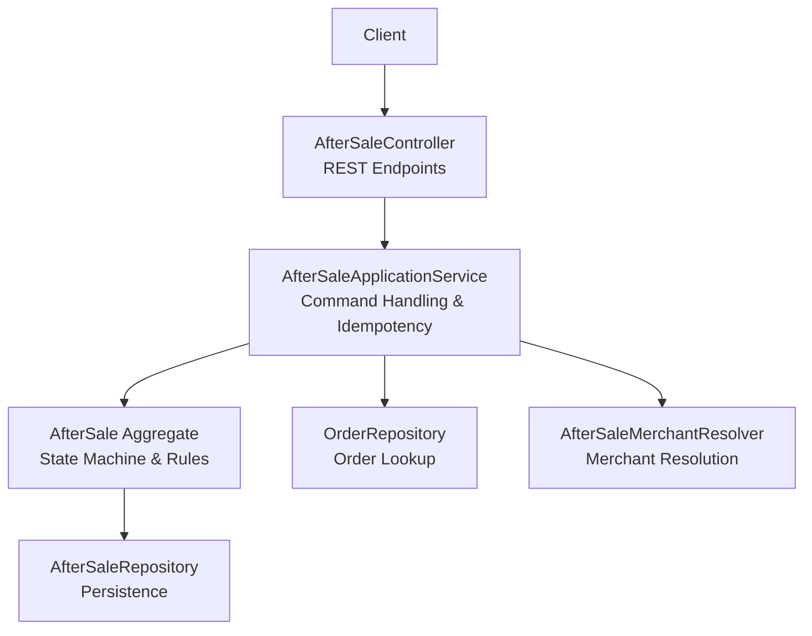
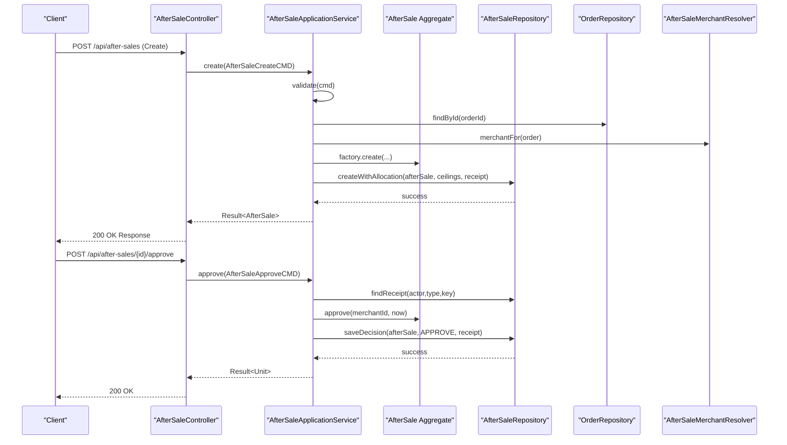
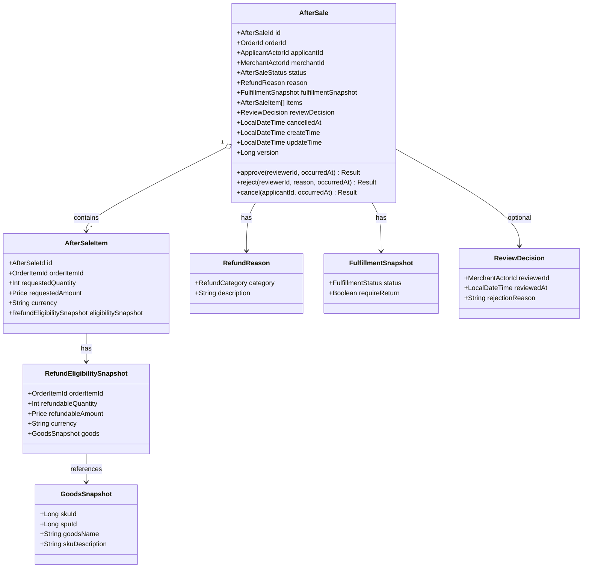
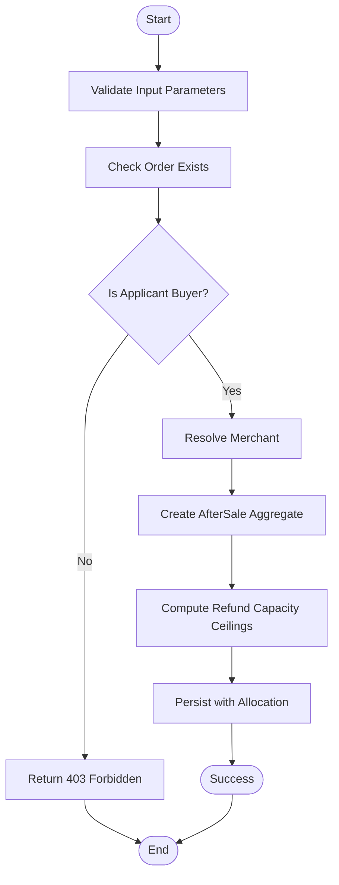
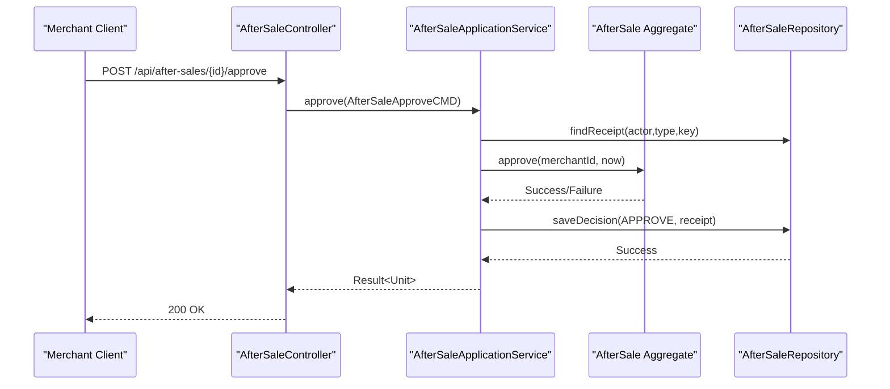
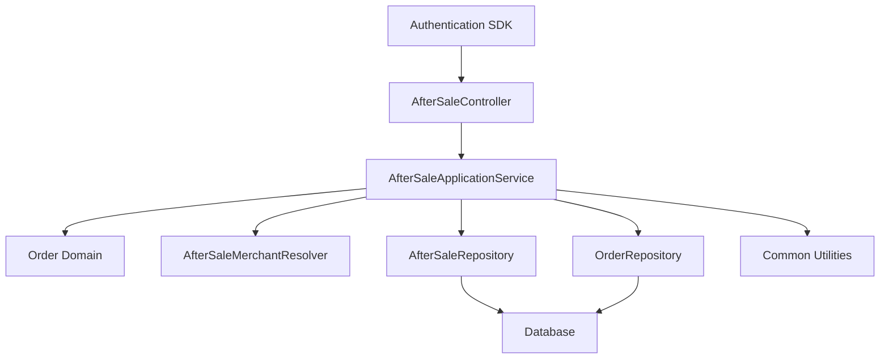

# After-Sale Processing API

<cite>
**Referenced Files in This Document**
- [AfterSaleController.kt](file://j-store-boot/src/main/kotlin/com/jstore/order/controller/AfterSaleController.kt)
- [AfterSaleApplicationService.kt](file://j-store-order/src/main/kotlin/com/jstore/order/service/AfterSaleApplicationService.kt)
- [AfterSale.kt](file://j-store-order/src/main/kotlin/com/jstore/order/domain/aftersale/AfterSale.kt)
- [AfterSaleImpl.kt](file://j-store-order/src/main/kotlin/com/jstore/order/domain/aftersale/AfterSaleImpl.kt)
- [AfterSaleStatus.kt](file://j-store-order/src/main/kotlin/com/jstore/order/domain/aftersale/AfterSaleStatus.kt)
- [AfterSaleErrors.kt](file://j-store-order/src/main/kotlin/com/jstore/order/domain/aftersale/AfterSaleErrors.kt)
- [AfterSaleValueObjects.kt](file://j-store-order/src/main/kotlin/com/jstore/order/domain/aftersale/AfterSaleValueObjects.kt)
- [AfterSaleCommands.kt](file://j-store-order/src/main/kotlin/com/jstore/order/domain/aftersale/command/AfterSaleCommands.kt)
- [AfterSaleControllerContractTest.kt](file://j-store-boot/src/test/kotlin/com/jstore/order/controller/AfterSaleControllerContractTest.kt)
</cite>

## Table of Contents
1. [Introduction](#introduction)
2. [Project Structure](#project-structure)
3. [Core Components](#core-components)
4. [Architecture Overview](#architecture-overview)
5. [Detailed Component Analysis](#detailed-component-analysis)
6. [Dependency Analysis](#dependency-analysis)
7. [Performance Considerations](#performance-considerations)
8. [Troubleshooting Guide](#troubleshooting-guide)
9. [Conclusion](#conclusion)
10. [Appendices](#appendices)

## Introduction
This document provides comprehensive API documentation for the After-Sale Processing endpoints exposed by the order service. It covers HTTP methods, URL patterns, request and response schemas, and business rules for return requests, refund processing, and after-sale status management. It also includes integration examples for merchant workflows and customer self-service returns, as well as error handling guidance for invalid reasons, expired windows, and insufficient stock scenarios.

## Project Structure
The After-Sale Processing feature is implemented across a thin REST controller layer, an application service orchestrating domain logic, and a domain model that enforces state transitions and business rules. The controller exposes six resource routes: create, get, list, approve, reject, and cancel. Authentication is enforced via a login requirement, and actor identity (buyer vs merchant) is injected from the authenticated context to prevent forgery.



**Diagram sources**
- [AfterSaleController.kt](file://j-store-boot/src/main/kotlin/com/jstore/order/controller/AfterSaleController.kt)
- [AfterSaleApplicationService.kt](file://j-store-order/src/main/kotlin/com/jstore/order/service/AfterSaleApplicationService.kt)
- [AfterSale.kt](file://j-store-order/src/main/kotlin/com/jstore/order/domain/aftersale/AfterSale.kt)

**Section sources**
- [AfterSaleController.kt](file://j-store-boot/src/main/kotlin/com/jstore/order/controller/AfterSaleController.kt)
- [AfterSaleControllerContractTest.kt](file://j-store-boot/src/test/kotlin/com/jstore/order/controller/AfterSaleControllerContractTest.kt)

## Core Components
- AfterSaleController: Exposes REST endpoints with authentication and idempotency support. Maps request/response DTOs to domain commands and results.
- AfterSaleApplicationService: Validates commands, enforces idempotency, resolves merchants, checks eligibility, and persists decisions with allocation actions.
- AfterSale Aggregate: Encapsulates state transitions (REQUESTED, APPROVED, REJECTED, CANCELLED), validates actor permissions, and publishes domain events.
- Value Objects and Commands: Define refund categories, reasons, fulfillment snapshots, eligibility snapshots, and command payloads with validation.

Key responsibilities:
- Create: Validate items, currency, amounts, quantities; ensure buyer permission; resolve merchant; compute refund capacity ceilings; persist with allocation.
- Approve/Reject/Cancel: Enforce actor roles, idempotency keys, and state machine transitions; record review decisions or cancellation timestamps.
- Get/List: Return after-sale details filtered by actor ownership (buyer or merchant).

**Section sources**
- [AfterSaleController.kt](file://j-store-boot/src/main/kotlin/com/jstore/order/controller/AfterSaleController.kt)
- [AfterSaleApplicationService.kt](file://j-store-order/src/main/kotlin/com/jstore/order/service/AfterSaleApplicationService.kt)
- [AfterSale.kt](file://j-store-order/src/main/kotlin/com/jstore/order/domain/aftersale/AfterSale.kt)
- [AfterSaleImpl.kt](file://j-store-order/src/main/kotlin/com/jstore/order/domain/aftersale/AfterSaleImpl.kt)
- [AfterSaleStatus.kt](file://j-store-order/src/main/kotlin/com/jstore/order/domain/aftersale/AfterSaleStatus.kt)
- [AfterSaleValueObjects.kt](file://j-store-order/src/main/kotlin/com/jstore/order/domain/aftersale/AfterSaleValueObjects.kt)
- [AfterSaleCommands.kt](file://j-store-order/src/main/kotlin/com/jstore/order/domain/aftersale/command/AfterSaleCommands.kt)

## Architecture Overview
The API follows a layered architecture:
- Controller layer handles HTTP requests/responses and maps to commands.
- Application service coordinates orchestration, idempotency, and repository interactions.
- Domain aggregate enforces business rules and state transitions.
- Repositories provide persistence for aggregates and command receipts.



**Diagram sources**
- [AfterSaleController.kt](file://j-store-boot/src/main/kotlin/com/jstore/order/controller/AfterSaleController.kt)
- [AfterSaleApplicationService.kt](file://j-store-order/src/main/kotlin/com/jstore/order/service/AfterSaleApplicationService.kt)
- [AfterSaleImpl.kt](file://j-store-order/src/main/kotlin/com/jstore/order/domain/aftersale/AfterSaleImpl.kt)

## Detailed Component Analysis

### REST Endpoints
Base path: /api/after-sales
Authentication: Required (login enforced)
Idempotency: All mutating endpoints require Idempotency-Key header

Endpoints:
- POST /api/after-sales
  - Purpose: Create a new after-sale request
  - Request body fields: orderId, category, description, items[]
  - Items fields: orderItemId, quantity, amount, currency
  - Headers: Idempotency-Key
  - Success response: AfterSale object with items, status, reason, fulfillmentSnapshot, reviewDecision, timestamps
  - Error responses: Business errors mapped to HTTP codes (e.g., 400, 403, 404, 409)

- GET /api/after-sales/{id}
  - Purpose: Retrieve after-sale by ID
  - Authorization: Buyer or merchant who owns the after-sale
  - Success response: AfterSale object
  - Error responses: Not found, forbidden

- GET /api/after-sales?orderId={orderId}
  - Purpose: List after-sales for an order
  - Authorization: Buyer or merchant who owns the order
  - Success response: Array of AfterSale objects
  - Error responses: Not found, forbidden

- POST /api/after-sales/{id}/approve
  - Purpose: Approve after-sale (merchant only)
  - Headers: Idempotency-Key
  - Success response: Empty or confirmation
  - Error responses: Forbidden, illegal state, idempotency conflict

- POST /api/after-sales/{id}/reject
  - Purpose: Reject after-sale (merchant only)
  - Request body: rejectionReason
  - Headers: Idempotency-Key
  - Success response: Empty or confirmation
  - Error responses: Forbidden, illegal state, invalid reason, idempotency conflict

- POST /api/after-sales/{id}/cancel
  - Purpose: Cancel after-sale (applicant/buyer only)
  - Headers: Idempotency-Key
  - Success response: Empty or confirmation
  - Error responses: Forbidden, illegal state, idempotency conflict

Request and Response Schemas:
- CreateRequest:
  - orderId: Long
  - category: RefundCategory (NO_LONGER_NEEDED, NOT_AS_DESCRIBED, QUALITY_ISSUE, OTHER)
  - description: String
  - items: Array of ItemRequest
    - orderItemId: Long
    - quantity: Int
    - amount: Long (in smallest currency unit)
    - currency: String (must be "CNY")

- ItemResponse:
  - id: Long
  - orderItemId: Long
  - requestedQuantity: Int
  - requestedAmount: Long
  - currency: String
  - eligibleQuantity: Int
  - eligibleAmount: Long
  - skuId: Long
  - spuId: Long
  - goodsName: String
  - skuDescription: String

- Response:
  - id: Long
  - orderId: Long
  - applicantId: Long
  - merchantId: Long
  - status: String (REQUESTED, APPROVED, REJECTED, CANCELLED)
  - reason: RefundReason
  - fulfillmentSnapshot: FulfillmentSnapshot
  - items: Array of ItemResponse
  - reviewDecision: ReviewDecision?
  - cancelledAt: LocalDateTime?
  - createTime: LocalDateTime
  - updateTime: LocalDateTime

Error Response:
- message: String
- errorCode: String

**Section sources**
- [AfterSaleController.kt](file://j-store-boot/src/main/kotlin/com/jstore/order/controller/AfterSaleController.kt)
- [AfterSaleControllerContractTest.kt](file://j-store-boot/src/test/kotlin/com/jstore/order/controller/AfterSaleControllerContractTest.kt)

### Business Rules and State Transitions
- Statuses: REQUESTED, APPROVED, REJECTED, CANCELLED
- Transitions:
  - REQUESTED -> APPROVED: Merchant approves
  - REQUESTED -> REJECTED: Merchant rejects with reason
  - REQUESTED -> CANCELLED: Applicant cancels
- Actor Permissions:
  - Only the merchant associated with the order can approve/reject
  - Only the buyer (applicant) can cancel
- Eligibility:
  - Order must exist and allow after-sale
  - No refund capacity available triggers failure
  - Capacity exceeded on subsequent requests is rejected
- Currency Constraint:
  - All amounts must be in "CNY"
- Quantity and Amount Validation:
  - Quantities must be positive
  - Amounts must be greater than zero
- Reason Validation:
  - Refund reason description must be non-blank and within length limits
  - Rejection reason must be non-blank and within length limits
- Idempotency:
  - All mutating operations require a unique Idempotency-Key header
  - Duplicate keys with different payloads are rejected

**Section sources**
- [AfterSaleStatus.kt](file://j-store-order/src/main/kotlin/com/jstore/order/domain/aftersale/AfterSaleStatus.kt)
- [AfterSaleImpl.kt](file://j-store-order/src/main/kotlin/com/jstore/order/domain/aftersale/AfterSaleImpl.kt)
- [AfterSaleValueObjects.kt](file://j-store-order/src/main/kotlin/com/jstore/order/domain/aftersale/AfterSaleValueObjects.kt)
- [AfterSaleCommands.kt](file://j-store-order/src/main/kotlin/com/jstore/order/domain/aftersale/command/AfterSaleCommands.kt)
- [AfterSaleErrors.kt](file://j-store-order/src/main/kotlin/com/jstore/order/domain/aftersale/AfterSaleErrors.kt)

### Data Models and Relationships


**Diagram sources**
- [AfterSale.kt](file://j-store-order/src/main/kotlin/com/jstore/order/domain/aftersale/AfterSale.kt)
- [AfterSaleValueObjects.kt](file://j-store-order/src/main/kotlin/com/jstore/order/domain/aftersale/AfterSaleValueObjects.kt)

### Workflow Sequences

#### Return Initiation Flow


**Diagram sources**
- [AfterSaleApplicationService.kt](file://j-store-order/src/main/kotlin/com/jstore/order/service/AfterSaleApplicationService.kt)
- [AfterSaleCommands.kt](file://j-store-order/src/main/kotlin/com/jstore/order/domain/aftersale/command/AfterSaleCommands.kt)

#### Refund Approval Workflow


**Diagram sources**
- [AfterSaleController.kt](file://j-store-boot/src/main/kotlin/com/jstore/order/controller/AfterSaleController.kt)
- [AfterSaleApplicationService.kt](file://j-store-order/src/main/kotlin/com/jstore/order/service/AfterSaleApplicationService.kt)
- [AfterSaleImpl.kt](file://j-store-order/src/main/kotlin/com/jstore/order/domain/aftersale/AfterSaleImpl.kt)

#### Status Tracking Responses
- GET /api/after-sales/{id} returns current status and full after-sale details
- GET /api/after-sales?orderId={orderId} returns all after-sales for an order
- Status values: REQUESTED, APPROVED, REJECTED, CANCELLED
- Review decision includes reviewer ID, timestamp, and optional rejection reason
- Cancellation timestamp recorded when applicant cancels

**Section sources**
- [AfterSaleController.kt](file://j-store-boot/src/main/kotlin/com/jstore/order/controller/AfterSaleController.kt)
- [AfterSaleStatus.kt](file://j-store-order/src/main/kotlin/com/jstore/order/domain/aftersale/AfterSaleStatus.kt)
- [AfterSaleValueObjects.kt](file://j-store-order/src/main/kotlin/com/jstore/order/domain/aftersale/AfterSaleValueObjects.kt)

## Dependency Analysis
The After-Sale Processing module depends on several core components:
- Authentication SDK for user context and login enforcement
- Order domain for order lookup and buyer information
- Merchant resolver for determining the responsible merchant
- Repository interfaces for persistence
- Common utilities for result handling and hashing



**Diagram sources**
- [AfterSaleController.kt](file://j-store-boot/src/main/kotlin/com/jstore/order/controller/AfterSaleController.kt)
- [AfterSaleApplicationService.kt](file://j-store-order/src/main/kotlin/com/jstore/order/service/AfterSaleApplicationService.kt)

**Section sources**
- [AfterSaleApplicationService.kt](file://j-store-order/src/main/kotlin/com/jstore/order/service/AfterSaleApplicationService.kt)

## Performance Considerations
- Idempotency: Use unique Idempotency-Key headers to prevent duplicate processing
- Validation: Early input validation reduces unnecessary database calls
- Caching: Consider caching frequently accessed order and merchant data
- Pagination: For large lists of after-sales, implement pagination
- Concurrency: Handle concurrent modifications with optimistic locking
- Database Indexing: Ensure proper indexing on order IDs and after-sale IDs

## Troubleshooting Guide
Common errors and their causes:
- AfterSale.NotFound (404): After-sale ID does not exist
- AfterSale.Order.NotFound (404): Order ID does not exist
- AfterSale.Items.Empty (400): No items provided in request
- AfterSale.Items.Duplicated (400): Duplicate order item IDs in request
- AfterSale.Items.NotFound (400): Order item ID does not exist
- AfterSale.Request.QuantityInvalid (400): Invalid quantity (must be positive)
- AfterSale.Request.AmountInvalid (400): Invalid amount (must be > 0)
- AfterSale.Request.CurrencyMismatch (400): Currency must be "CNY"
- AfterSale.Order.NotEligible (409): Order does not allow after-sale
- AfterSale.Order.NoRefundCapacity (409): No refund capacity available
- AfterSale.Capacity.Exceeded (409): After-sale capacity exceeded
- AfterSale.State.Invalid (409): Illegal state transition
- AfterSale.Actor.ApplicantForbidden (403): Unauthorized applicant action
- AfterSale.Actor.MerchantForbidden (403): Unauthorized merchant action
- AfterSale.Reason.Invalid (400): Invalid refund reason
- AfterSale.Reason.RejectionInvalid (400): Invalid rejection reason
- AfterSale.IdempotencyKey.Invalid (400): Invalid idempotency key format
- AfterSale.Idempotency.Conflict (409): Duplicate idempotency key with different payload
- AfterSale.ConcurrentModification (409): Concurrent modification detected

Debugging steps:
- Verify authentication context and actor permissions
- Check idempotency key uniqueness and format
- Validate request parameters against schema requirements
- Inspect order eligibility and refund capacity
- Review after-sale status transitions and timing

**Section sources**
- [AfterSaleErrors.kt](file://j-store-order/src/main/kotlin/com/jstore/order/domain/aftersale/AfterSaleErrors.kt)
- [AfterSaleCommands.kt](file://j-store-order/src/main/kotlin/com/jstore/order/domain/aftersale/command/AfterSaleCommands.kt)

## Conclusion
The After-Sale Processing API provides a robust foundation for managing return requests, refund approvals, and status tracking. The design emphasizes security through authentication and authorization, reliability through idempotency, and correctness through strict business rule enforcement. Integration points with order and inventory systems enable seamless end-to-end after-sale workflows.

## Appendices

### Integration Examples

#### Customer Self-Service Returns
```json
POST /api/after-sales
Headers:
  Idempotency-Key: "unique-key-123"
  Authorization: "Bearer <token>"
Body:
{
  "orderId": 12345,
  "category": "NOT_AS_DESCRIBED",
  "description": "Product received was damaged",
  "items": [
    {
      "orderItemId": 67890,
      "quantity": 1,
      "amount": 2999,
      "currency": "CNY"
    }
  ]
}
```

#### Merchant Approval Workflow
```json
POST /api/after-sales/123/approve
Headers:
  Idempotency-Key: "<merchant-approval-request-id>"
  Authorization: "Bearer <merchant-token>"
```

#### Status Tracking
```json
GET /api/after-sales/123
Headers:
  Authorization: "Bearer <token>"
```

### Business Rules Summary
- Return eligibility depends on order status and fulfillment state
- Refund calculations consider purchased amounts and quantities
- Inventory restoration occurs upon approval and return completion
- All monetary values must be in cents (smallest currency unit)
- Time-based constraints apply to return windows and processing times
