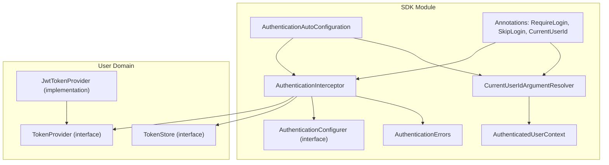
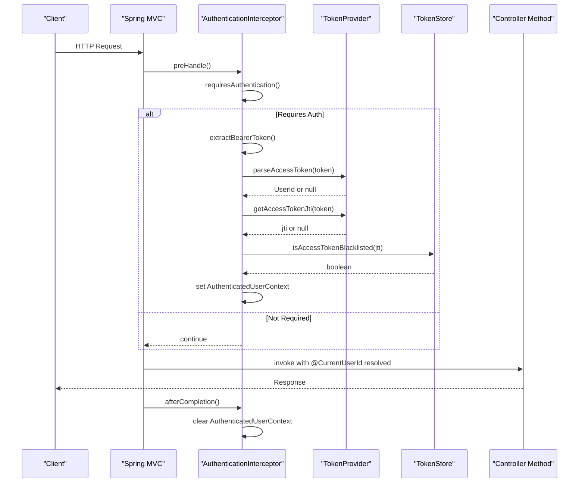
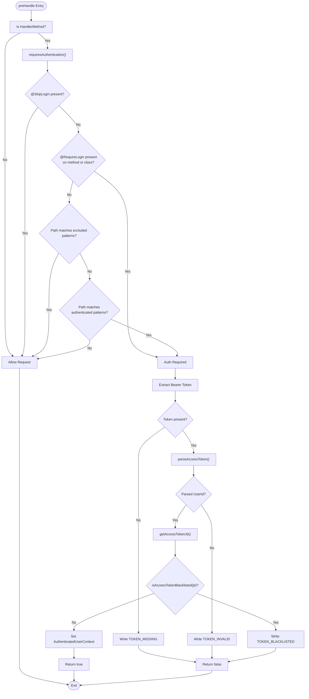
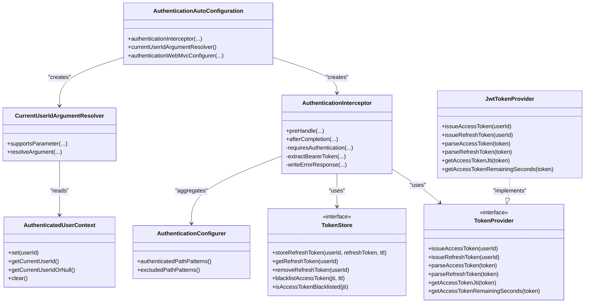

# Authentication SDK

<cite>
**Referenced Files in This Document**
- [RequireLogin.kt](file://j-store-authentication-spring-sdk/src/main/kotlin/com/jstore/authentication/annotation/RequireLogin.kt)
- [SkipLogin.kt](file://j-store-authentication-spring-sdk/src/main/kotlin/com/jstore/authentication/annotation/SkipLogin.kt)
- [CurrentUserId.kt](file://j-store-authentication-spring-sdk/src/main/kotlin/com/jstore/authentication/annotation/CurrentUserId.kt)
- [AuthenticationConfigurer.kt](file://j-store-authentication-spring-sdk/src/main/kotlin/com/jstore/authentication/config/AuthenticationConfigurer.kt)
- [AuthenticatedUserContext.kt](file://j-store-authentication-spring-sdk/src/main/kotlin/com/jstore/authentication/context/AuthenticatedUserContext.kt)
- [AuthenticationException.kt](file://j-store-authentication-spring-sdk/src/main/kotlin/com/jstore/authentication/context/AuthenticationException.kt)
- [AuthenticationErrors.kt](file://j-store-authentication-spring-sdk/src/main/kotlin/com/jstore/authentication/error/AuthenticationErrors.kt)
- [AuthenticationInterceptor.kt](file://j-store-authentication-spring-sdk/src/main/kotlin/com/jstore/authentication/spring/AuthenticationInterceptor.kt)
- [AuthenticationAutoConfiguration.kt](file://j-store-authentication-spring-sdk/src/main/kotlin/com/jstore/authentication/spring/AuthenticationAutoConfiguration.kt)
- [CurrentUserIdArgumentResolver.kt](file://j-store-authentication-spring-sdk/src/main/kotlin/com/jstore/authentication/spring/CurrentUserIdArgumentResolver.kt)
- [TokenProvider.kt](file://j-store-user/src/main/kotlin/com/jstore/user/domain/useraccount/TokenProvider.kt)
- [TokenStore.kt](file://j-store-user/src/main/kotlin/com/jstore/user/domain/useraccount/TokenStore.kt)
- [JwtTokenProvider.kt](file://j-store-user-infrastructure/src/main/kotlin/com/jstore/user/domain/useraccount/JwtTokenProvider.kt)
- [AfterSaleController.kt](file://j-store-boot/src/main/kotlin/com/jstore/order/controller/AfterSaleController.kt)
- [OrderController.kt](file://j-store-boot/src/main/kotlin/com/jstore/order/controller/OrderController.kt)
- [AuthenticationInterceptorTest.kt](file://j-store-authentication-spring-sdk/src/test/kotlin/com/jstore/authentication/spring/AuthenticationInterceptorTest.kt)
- [AuthenticationAutoConfigurationTest.kt](file://j-store-authentication-spring-sdk/src/test/kotlin/com/jstore/authentication/spring/AuthenticationAutoConfigurationTest.kt)
</cite>

## Table of Contents
1. [Introduction](#introduction)
2. [Project Structure](#project-structure)
3. [Core Components](#core-components)
4. [Architecture Overview](#architecture-overview)
5. [Detailed Component Analysis](#detailed-component-analysis)
6. [Dependency Analysis](#dependency-analysis)
7. [Performance Considerations](#performance-considerations)
8. [Troubleshooting Guide](#troubleshooting-guide)
9. [Conclusion](#conclusion)
10. [Appendices](#appendices)

## Introduction
This document explains the reusable Authentication SDK for Spring MVC applications within the project. It covers how to integrate the SDK into Spring Boot, configure authentication providers, use security annotations (@RequireLogin, @SkipLogin), and manage user context via JWT tokens. It also provides guidance on custom authorization logic, configuration properties, best practices, troubleshooting, and performance optimization for high-throughput scenarios.

## Project Structure
The Authentication SDK is implemented as a standalone module that auto-configures itself when required beans are present. Key parts include:
- Annotations for request-level access control
- An interceptor that validates requests based on annotations and path patterns
- A thread-local user context for passing authenticated user identity across layers
- Auto-configuration that registers the interceptor and argument resolver
- Integration with TokenProvider and TokenStore for JWT handling and token lifecycle management

**Diagram sources**
- [AuthenticationAutoConfiguration.kt](file://j-store-authentication-spring-sdk/src/main/kotlin/com/jstore/authentication/spring/AuthenticationAutoConfiguration.kt)
- [AuthenticationInterceptor.kt](file://j-store-authentication-spring-sdk/src/main/kotlin/com/jstore/authentication/spring/AuthenticationInterceptor.kt)
- [CurrentUserIdArgumentResolver.kt](file://j-store-authentication-spring-sdk/src/main/kotlin/com/jstore/authentication/spring/CurrentUserIdArgumentResolver.kt)
- [AuthenticatedUserContext.kt](file://j-store-authentication-spring-sdk/src/main/kotlin/com/jstore/authentication/context/AuthenticatedUserContext.kt)
- [AuthenticationConfigurer.kt](file://j-store-authentication-spring-sdk/src/main/kotlin/com/jstore/authentication/config/AuthenticationConfigurer.kt)
- [RequireLogin.kt](file://j-store-authentication-spring-sdk/src/main/kotlin/com/jstore/authentication/annotation/RequireLogin.kt)
- [SkipLogin.kt](file://j-store-authentication-spring-sdk/src/main/kotlin/com/jstore/authentication/annotation/SkipLogin.kt)
- [CurrentUserId.kt](file://j-store-authentication-spring-sdk/src/main/kotlin/com/jstore/authentication/annotation/CurrentUserId.kt)
- [AuthenticationErrors.kt](file://j-store-authentication-spring-sdk/src/main/kotlin/com/jstore/authentication/error/AuthenticationErrors.kt)
- [TokenProvider.kt](file://j-store-user/src/main/kotlin/com/jstore/user/domain/useraccount/TokenProvider.kt)
- [TokenStore.kt](file://j-store-user/src/main/kotlin/com/jstore/user/domain/useraccount/TokenStore.kt)
- [JwtTokenProvider.kt](file://j-store-user-infrastructure/src/main/kotlin/com/jstore/user/domain/useraccount/JwtTokenProvider.kt)

**Section sources**
- [AuthenticationAutoConfiguration.kt](file://j-store-authentication-spring-sdk/src/main/kotlin/com/jstore/authentication/spring/AuthenticationAutoConfiguration.kt)
- [AuthenticationInterceptor.kt](file://j-store-authentication-spring-sdk/src/main/kotlin/com/jstore/authentication/spring/AuthenticationInterceptor.kt)
- [TokenProvider.kt](file://j-store-user/src/main/kotlin/com/jstore/user/domain/useraccount/TokenProvider.kt)
- [TokenStore.kt](file://j-store-user/src/main/kotlin/com/jstore/user/domain/useraccount/TokenStore.kt)
- [JwtTokenProvider.kt](file://j-store-user-infrastructure/src/main/kotlin/com/jstore/user/domain/useraccount/JwtTokenProvider.kt)

## Core Components
- Security Annotations:
  - RequireLogin: Marks controllers or methods that require authentication.
  - SkipLogin: Overrides authentication for specific endpoints.
  - CurrentUserId: Injects the authenticated UserId into controller method parameters.
- Interceptor:
  - Validates Authorization header, extracts Bearer token, parses it via TokenProvider, checks blacklist via TokenStore, and sets AuthenticatedUserContext.
- Auto-Configuration:
  - Registers the interceptor globally and adds the argument resolver when TokenProvider and TokenStore beans exist.
- User Context:
  - ThreadLocal-based storage of the current UserId for the duration of the request.
- Error Handling:
  - Standardized error responses for missing, invalid, blacklisted tokens, and internal errors.

**Section sources**
- [RequireLogin.kt](file://j-store-authentication-spring-sdk/src/main/kotlin/com/jstore/authentication/annotation/RequireLogin.kt)
- [SkipLogin.kt](file://j-store-authentication-spring-sdk/src/main/kotlin/com/jstore/authentication/annotation/SkipLogin.kt)
- [CurrentUserId.kt](file://j-store-authentication-spring-sdk/src/main/kotlin/com/jstore/authentication/annotation/CurrentUserId.kt)
- [AuthenticationInterceptor.kt](file://j-store-authentication-spring-sdk/src/main/kotlin/com/jstore/authentication/spring/AuthenticationInterceptor.kt)
- [AuthenticationAutoConfiguration.kt](file://j-store-authentication-spring-sdk/src/main/kotlin/com/jstore/authentication/spring/AuthenticationAutoConfiguration.kt)
- [AuthenticatedUserContext.kt](file://j-store-authentication-spring-sdk/src/main/kotlin/com/jstore/authentication/context/AuthenticatedUserContext.kt)
- [AuthenticationErrors.kt](file://j-store-authentication-spring-sdk/src/main/kotlin/com/jstore/authentication/error/AuthenticationErrors.kt)

## Architecture Overview
The SDK integrates into Spring MVC through an auto-configured interceptor and argument resolver. Requests flow through the interceptor, which enforces authentication based on annotations and configured path patterns. Successful validation populates the thread-local user context, enabling controllers to inject the current user ID seamlessly.

**Diagram sources**
- [AuthenticationAutoConfiguration.kt](file://j-store-authentication-spring-sdk/src/main/kotlin/com/jstore/authentication/spring/AuthenticationAutoConfiguration.kt)
- [AuthenticationInterceptor.kt](file://j-store-authentication-spring-sdk/src/main/kotlin/com/jstore/authentication/spring/AuthenticationInterceptor.kt)
- [TokenProvider.kt](file://j-store-user/src/main/kotlin/com/jstore/user/domain/useraccount/TokenProvider.kt)
- [TokenStore.kt](file://j-store-user/src/main/kotlin/com/jstore/user/domain/useraccount/TokenStore.kt)

## Detailed Component Analysis

### AuthenticationInterceptor
Responsibilities:
- Determine if a request requires authentication using annotation precedence and path patterns.
- Extract and validate Bearer tokens.
- Check token blacklist status.
- Set and clear the authenticated user context per request.
- Write standardized JSON error responses for authentication failures.

Key behaviors:
- Annotation priority: @SkipLogin overrides all; @RequireLogin at method or class level enables auth.
- Path-based rules: excluded patterns bypass auth; authenticated patterns enforce it.
- Default behavior: no auth unless explicitly required by annotations or patterns.

**Diagram sources**
- [AuthenticationInterceptor.kt](file://j-store-authentication-spring-sdk/src/main/kotlin/com/jstore/authentication/spring/AuthenticationInterceptor.kt)

**Section sources**
- [AuthenticationInterceptor.kt](file://j-store-authentication-spring-sdk/src/main/kotlin/com/jstore/authentication/spring/AuthenticationInterceptor.kt)

### AuthenticationAutoConfiguration
Responsibilities:
- Conditionally activate when both TokenProvider and TokenStore beans are present.
- Register AuthenticationInterceptor globally for all paths.
- Register CurrentUserIdArgumentResolver to support @CurrentUserId injection.

Activation conditions:
- Web application type must be SERVLET.
- Both TokenProvider and TokenStore beans must exist.

**Section sources**
- [AuthenticationAutoConfiguration.kt](file://j-store-authentication-spring-sdk/src/main/kotlin/com/jstore/authentication/spring/AuthenticationAutoConfiguration.kt)

### CurrentUserIdArgumentResolver
Responsibilities:
- Resolve method parameters annotated with @CurrentUserId to the current UserId from AuthenticatedUserContext.
- Support optional parameters gracefully.

Behavior:
- If parameter is optional and no user is present, returns null.
- Otherwise, throws an exception when no authenticated user exists.

**Section sources**
- [CurrentUserIdArgumentResolver.kt](file://j-store-authentication-spring-sdk/src/main/kotlin/com/jstore/authentication/spring/CurrentUserIdArgumentResolver.kt)
- [AuthenticatedUserContext.kt](file://j-store-authentication-spring-sdk/src/main/kotlin/com/jstore/authentication/context/AuthenticatedUserContext.kt)

### AuthenticatedUserContext
Responsibilities:
- Provide thread-local storage for the current UserId during request processing.
- Offer safe retrieval methods and cleanup.

Usage:
- Set by the interceptor upon successful authentication.
- Cleared in afterCompletion to prevent memory leaks.

**Section sources**
- [AuthenticatedUserContext.kt](file://j-store-authentication-spring-sdk/src/main/kotlin/com/jstore/authentication/context/AuthenticatedUserContext.kt)
- [AuthenticationException.kt](file://j-store-authentication-spring-sdk/src/main/kotlin/com/jstore/authentication/context/AuthenticationException.kt)

### AuthenticationConfigurer
Responsibilities:
- Define lists of authenticated and excluded path patterns.
- Enable modular configuration across modules.

Integration:
- The interceptor aggregates patterns from all registered configurers.

**Section sources**
- [AuthenticationConfigurer.kt](file://j-store-authentication-spring-sdk/src/main/kotlin/com/jstore/authentication/config/AuthenticationConfigurer.kt)

### TokenProvider and JwtTokenProvider
Responsibilities:
- Issue and parse JWT access and refresh tokens.
- Provide token metadata such as jti and remaining validity.

Implementation details:
- HS256 signing with configurable secret key.
- Access token expiry and claims include userId and token type.
- Refresh token expiry and separate token type.

**Section sources**
- [TokenProvider.kt](file://j-store-user/src/main/kotlin/com/jstore/user/domain/useraccount/TokenProvider.kt)
- [JwtTokenProvider.kt](file://j-store-user-infrastructure/src/main/kotlin/com/jstore/user/domain/useraccount/JwtTokenProvider.kt)

### TokenStore
Responsibilities:
- Manage refresh tokens and access token blacklist.
- Provide TTL-based storage operations.

Integration:
- Used by the interceptor to check if an access token has been revoked.

**Section sources**
- [TokenStore.kt](file://j-store-user/src/main/kotlin/com/jstore/user/domain/useraccount/TokenStore.kt)

### Usage Examples in Controllers
Controllers demonstrate annotation usage:
- Class-level @RequireLogin to protect entire controllers.
- Method-level @CurrentUserId to inject the authenticated user ID.

Examples:
- AfterSaleController uses @RequireLogin and @CurrentUserId.
- OrderController uses @RequireLogin and multiple @CurrentUserId usages.

**Section sources**
- [AfterSaleController.kt](file://j-store-boot/src/main/kotlin/com/jstore/order/controller/AfterSaleController.kt)
- [OrderController.kt](file://j-store-boot/src/main/kotlin/com/jstore/order/controller/OrderController.kt)

## Dependency Analysis
The SDK depends on:
- Spring MVC components for interceptor registration and argument resolution.
- TokenProvider and TokenStore abstractions for token lifecycle and validation.
- Jackson ObjectMapper for error response serialization.

**Diagram sources**
- [AuthenticationAutoConfiguration.kt](file://j-store-authentication-spring-sdk/src/main/kotlin/com/jstore/authentication/spring/AuthenticationAutoConfiguration.kt)
- [AuthenticationInterceptor.kt](file://j-store-authentication-spring-sdk/src/main/kotlin/com/jstore/authentication/spring/AuthenticationInterceptor.kt)
- [CurrentUserIdArgumentResolver.kt](file://j-store-authentication-spring-sdk/src/main/kotlin/com/jstore/authentication/spring/CurrentUserIdArgumentResolver.kt)
- [AuthenticatedUserContext.kt](file://j-store-authentication-spring-sdk/src/main/kotlin/com/jstore/authentication/context/AuthenticatedUserContext.kt)
- [AuthenticationConfigurer.kt](file://j-store-authentication-spring-sdk/src/main/kotlin/com/jstore/authentication/config/AuthenticationConfigurer.kt)
- [TokenProvider.kt](file://j-store-user/src/main/kotlin/com/jstore/user/domain/useraccount/TokenProvider.kt)
- [TokenStore.kt](file://j-store-user/src/main/kotlin/com/jstore/user/domain/useraccount/TokenStore.kt)
- [JwtTokenProvider.kt](file://j-store-user-infrastructure/src/main/kotlin/com/jstore/user/domain/useraccount/JwtTokenProvider.kt)

**Section sources**
- [AuthenticationAutoConfiguration.kt](file://j-store-authentication-spring-sdk/src/main/kotlin/com/jstore/authentication/spring/AuthenticationAutoConfiguration.kt)
- [AuthenticationInterceptor.kt](file://j-store-authentication-spring-sdk/src/main/kotlin/com/jstore/authentication/spring/AuthenticationInterceptor.kt)
- [TokenProvider.kt](file://j-store-user/src/main/kotlin/com/jstore/user/domain/useraccount/TokenProvider.kt)
- [TokenStore.kt](file://j-store-user/src/main/kotlin/com/jstore/user/domain/useraccount/TokenStore.kt)
- [JwtTokenProvider.kt](file://j-store-user-infrastructure/src/main/kotlin/com/jstore/user/domain/useraccount/JwtTokenProvider.kt)

## Performance Considerations
- Minimal overhead: The interceptor performs lightweight checks and only invokes TokenProvider and TokenStore when authentication is required.
- Single validation: Even when both annotations and path patterns match, token parsing occurs once per request.
- Thread-local cleanup: Ensures no memory leaks by clearing context in afterCompletion.
- High-throughput tips:
  - Use efficient TokenStore implementations (e.g., Redis with short TTLs).
  - Keep JWT payloads small to reduce parsing overhead.
  - Avoid heavy logging inside the interceptor to minimize latency.
  - Configure ObjectMapper once and reuse it (already provided by auto-configuration).

[No sources needed since this section provides general guidance]

## Troubleshooting Guide
Common issues and resolutions:
- Missing Authorization header:
  - Symptom: HTTP 401 with Auth.Token.Missing.
  - Resolution: Ensure clients send Authorization: Bearer <token>.
- Invalid token:
  - Symptom: HTTP 401 with Auth.Token.Invalid.
  - Resolution: Verify token signature and expiration; ensure correct secret key.
- Blacklisted token:
  - Symptom: HTTP 401 with Auth.Token.Blacklisted.
  - Resolution: Revoke tokens intentionally; refresh access tokens using refresh tokens.
- Internal error:
  - Symptom: HTTP 500 with Auth.InternalError.
  - Resolution: Inspect server logs; avoid leaking exception details in responses.
- Auto-configuration not activating:
  - Symptom: Interceptor not registered.
  - Resolution: Ensure both TokenProvider and TokenStore beans are present and web application type is SERVLET.

Validation references:
- Unexpected exceptions return standardized errors without leaking details.
- Auto-activation tests confirm bean dependencies and activation conditions.

**Section sources**
- [AuthenticationErrors.kt](file://j-store-authentication-spring-sdk/src/main/kotlin/com/jstore/authentication/error/AuthenticationErrors.kt)
- [AuthenticationInterceptorTest.kt](file://j-store-authentication-spring-sdk/src/test/kotlin/com/jstore/authentication/spring/AuthenticationInterceptorTest.kt)
- [AuthenticationAutoConfigurationTest.kt](file://j-store-authentication-spring-sdk/src/test/kotlin/com/jstore/authentication/spring/AuthenticationAutoConfigurationTest.kt)

## Conclusion
The Authentication SDK provides a clean, extensible way to secure Spring MVC endpoints using annotations and path patterns. It integrates seamlessly with JWT-based authentication through TokenProvider and TokenStore, offers robust error handling, and supports high-throughput environments with minimal overhead. By following the integration patterns and best practices outlined here, teams can implement secure, maintainable authentication flows across their services.

[No sources needed since this section summarizes without analyzing specific files]

## Appendices

### Integration Checklist
- Implement TokenProvider and TokenStore beans.
- Optionally define AuthenticationConfigurer instances to specify authenticated and excluded path patterns.
- Apply @RequireLogin to controllers or methods requiring authentication.
- Use @SkipLogin to exempt public endpoints.
- Inject @CurrentUserId parameters where needed.

### Best Practices
- Keep JWT claims minimal and secure.
- Use short-lived access tokens and long-lived refresh tokens.
- Centralize error responses and avoid leaking sensitive information.
- Test authentication decisions and edge cases thoroughly.

[No sources needed since this section provides general guidance]