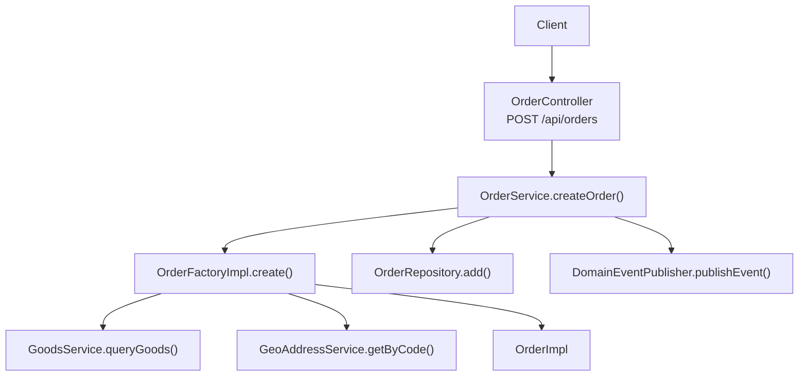
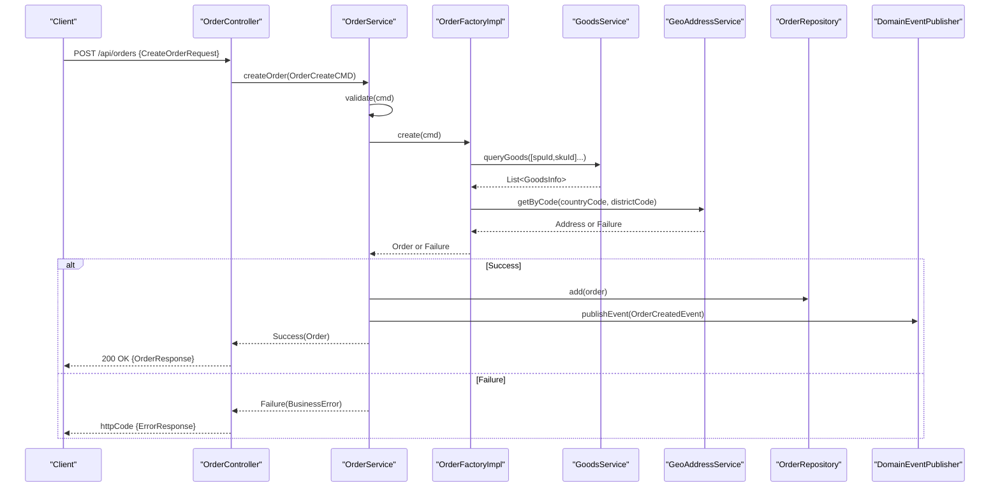
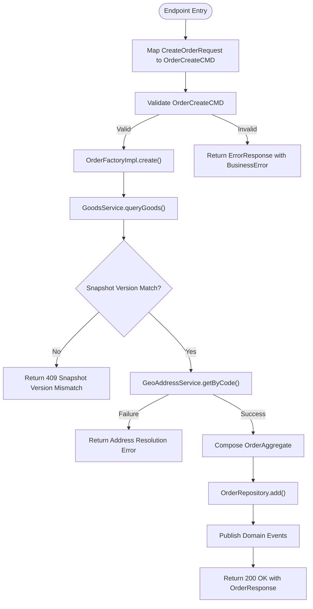
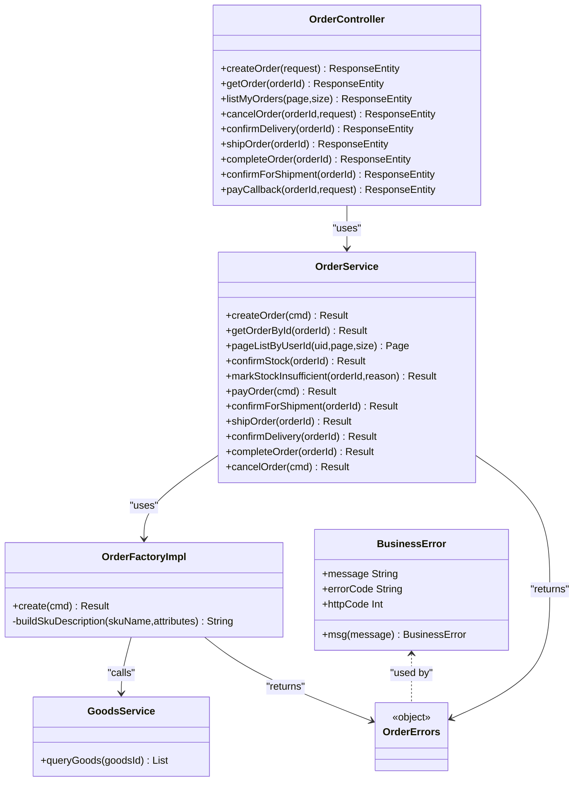

# Order Creation API

<cite>
**Referenced Files in This Document**
- [OrderController.kt](file://j-store-boot/src/main/kotlin/com/jstore/order/controller/OrderController.kt)
- [OrderService.kt](file://j-store-order/src/main/kotlin/com/jstore/order/service/OrderService.kt)
- [OrderCreateCMD.kt](file://j-store-order/src/main/kotlin/com/jstore/order/domain/order/command/OrderCreateCMD.kt)
- [OrderFactory.kt](file://j-store-order/src/main/kotlin/com/jstore/order/domain/order/OrderFactory.kt)
- [GoodsService.kt](file://j-store-order/src/main/kotlin/com/jstore/order/acl/GoodsService.kt)
- [OrderErrors.kt](file://j-store-order/src/main/kotlin/com/jstore/order/domain/order/OrderErrors.kt)
- [Inventory.kt](file://j-store-goods/src/main/kotlin/com/jstore/goods/domain/inventory/Inventory.kt)
- [StorageErrors.kt](file://j-store-goods/src/main/kotlin/com/jstore/goods/domain/inventory/StorageErrors.kt)
- [BusinessError.kt](file://j-store-common-core/src/main/kotlin/com/jstore/common/errors/BusinessError.kt)
</cite>

## Table of Contents
1. [Introduction](#introduction)
2. [Project Structure](#project-structure)
3. [Core Components](#core-components)
4. [Architecture Overview](#architecture-overview)
5. [Detailed Component Analysis](#detailed-component-analysis)
6. [Dependency Analysis](#dependency-analysis)
7. [Performance Considerations](#performance-considerations)
8. [Troubleshooting Guide](#troubleshooting-guide)
9. [Conclusion](#conclusion)

## Introduction
This document provides detailed API documentation for the order creation endpoint POST /api/orders. It defines request and response schemas, validation rules for shipping information and product items (including SPU/SKU IDs, quantities, and snapshot versions), error handling scenarios (validation failures, insufficient inventory, and product availability checks), and client implementation guidelines for proper request formatting and error response handling.

## Project Structure
The order creation flow spans the web controller, application service, domain factory, and external goods ACL:
- Controller layer exposes the REST endpoint and maps DTOs to domain commands.
- Application service orchestrates validation, creation, persistence, and event publishing.
- Domain factory validates and builds the order aggregate using goods information and address resolution.
- External goods service is used to fetch product snapshots and validate version consistency.

**Diagram sources**
- [OrderController.kt:96-125](file://j-store-boot/src/main/kotlin/com/jstore/order/controller/OrderController.kt#L96-L125)
- [OrderService.kt:44-50](file://j-store-order/src/main/kotlin/com/jstore/order/service/OrderService.kt#L44-L50)
- [OrderFactory.kt:33-108](file://j-store-order/src/main/kotlin/com/jstore/order/domain/order/OrderFactory.kt#L33-L108)
- [GoodsService.kt:1-18](file://j-store-order/src/main/kotlin/com/jstore/order/acl/GoodsService.kt#L1-L18)

**Section sources**
- [OrderController.kt:17-256](file://j-store-boot/src/main/kotlin/com/jstore/order/controller/OrderController.kt#L17-L256)
- [OrderService.kt:25-50](file://j-store-order/src/main/kotlin/com/jstore/order/service/OrderService.kt#L25-L50)
- [OrderFactory.kt:27-108](file://j-store-order/src/main/kotlin/com/jstore/order/domain/order/OrderFactory.kt#L27-L108)

## Core Components
- POST /api/orders
  - Authentication: Requires login via @RequireLogin; buyer identity injected via @CurrentUserId.
  - Request body: CreateOrderRequest with RecipientInfoRequest and a list of OrderItemRequest.
  - Response: OrderResponse on success; ErrorResponse on failure with HTTP status derived from BusinessError.httpCode.

- Request schema
  - CreateOrderRequest
    - recipientInfo: RecipientInfoRequest
    - items: List<OrderItemRequest>
  - RecipientInfoRequest
    - consigneeName: String (required, non-blank)
    - countryCode: String? (optional; defaults to "CN" if not provided during domain construction)
    - contactPhone: String? (optional; must be valid when present)
    - contactEmail: String? (optional)
    - shippingDistrictCode: String (required, non-blank)
    - shippingDetailAddress: String (required)
  - OrderItemRequest
    - spuId: Long (required)
    - skuId: Long (required)
    - quantity: Int (required, positive)
    - snapshotVersion: Long (required; must match goods snapshot version)

- Response schema
  - OrderResponse
    - id: Long
    - buyerUid: Long
    - buyerPhone: String?
    - buyerName: String?
    - tradeStatus: String
    - paymentStatus: String
    - fulfillmentStatus: String
    - totalRefundedAmount: Long
    - totalAmount: Long
    - actualPay: Long
    - items: List<OrderItemResponse>
    - createTime: LocalDateTime
    - updateTime: LocalDateTime
  - OrderItemResponse
    - id: Long
    - skuId: Long
    - spuId: Long
    - goodsName: String
    - skuDescription: String
    - quantity: Int
    - unitPrice: Long
    - status: String
    - refundedQuantity: Int
    - refundedAmount: Long

- Error response schema
  - ErrorResponse
    - message: String
    - errorCode: String

**Section sources**
- [OrderController.kt:26-92](file://j-store-boot/src/main/kotlin/com/jstore/order/controller/OrderController.kt#L26-L92)
- [OrderController.kt:96-125](file://j-store-boot/src/main/kotlin/com/jstore/order/controller/OrderController.kt#L96-L125)
- [OrderController.kt:216-254](file://j-store-boot/src/main/kotlin/com/jstore/order/controller/OrderController.kt#L216-L254)

## Architecture Overview
The order creation sequence involves mapping the HTTP request into a domain command, validating it, building the order aggregate, persisting it, and publishing domain events.

**Diagram sources**
- [OrderController.kt:96-125](file://j-store-boot/src/main/kotlin/com/jstore/order/controller/OrderController.kt#L96-L125)
- [OrderService.kt:44-50](file://j-store-order/src/main/kotlin/com/jstore/order/service/OrderService.kt#L44-L50)
- [OrderFactory.kt:33-108](file://j-store-order/src/main/kotlin/com/jstore/order/domain/order/OrderFactory.kt#L33-L108)

## Detailed Component Analysis

### Endpoint: POST /api/orders
- Path: /api/orders
- Method: POST
- Authentication: Required (@RequireLogin)
- Request body: CreateOrderRequest
- Success response: 200 OK with OrderResponse
- Failure responses: Non-2xx with ErrorResponse based on BusinessError.httpCode

Validation rules enforced:
- Shipping information
  - consigneeName must be non-blank
  - shippingDistrictCode must be non-blank
  - At least one of contactPhone or contactEmail must be provided
- Product items
  - items list must be non-empty
  - Each item requires spuId, skuId, quantity > 0, and snapshotVersion
  - snapshotVersion must match the latest snapshot returned by GoodsService
- Buyer identification
  - buyerUid must be positive (injected from authentication context)

Error handling:
- Validation failures return appropriate BusinessError codes with corresponding HTTP status codes.
- Snapshot version mismatch returns 409 Conflict with guidance to refresh and retry.
- Missing goods resources return 404 Not Found.

Client implementation guidelines:
- Ensure all required fields are present and valid before sending the request.
- Use the latest snapshotVersion obtained from the goods catalog to avoid conflicts.
- Handle both success and error responses according to the defined schemas.

**Section sources**
- [OrderController.kt:96-125](file://j-store-boot/src/main/kotlin/com/jstore/order/controller/OrderController.kt#L96-L125)
- [OrderCreateCMD.kt:15-61](file://j-store-order/src/main/kotlin/com/jstore/order/domain/order/command/OrderCreateCMD.kt#L15-L61)
- [OrderFactory.kt:33-108](file://j-store-order/src/main/kotlin/com/jstore/order/domain/order/OrderFactory.kt#L33-L108)
- [OrderErrors.kt:5-23](file://j-store-order/src/main/kotlin/com/jstore/order/domain/order/OrderErrors.kt#L5-L23)

### Request and Response Schemas

- CreateOrderRequest
  - Fields: recipientInfo, items
- RecipientInfoRequest
  - Fields: consigneeName, countryCode?, contactPhone?, contactEmail?, shippingDistrictCode, shippingDetailAddress
- OrderItemRequest
  - Fields: spuId, skuId, quantity, snapshotVersion
- OrderResponse
  - Fields: id, buyerUid, buyerPhone?, buyerName?, tradeStatus, paymentStatus, fulfillmentStatus, totalRefundedAmount, totalAmount, actualPay, items[], createTime, updateTime
- OrderItemResponse
  - Fields: id, skuId, spuId, goodsName, skuDescription, quantity, unitPrice, status, refundedQuantity, refundedAmount
- ErrorResponse
  - Fields: message, errorCode

Example request structure (conceptual):
- Include buyer information implicitly via authenticated user ID.
- Provide complete shipping details including country code, district code, and detail address.
- Include multiple items with correct SPU/SKU IDs, positive quantities, and matching snapshot versions.

Example response structure (conceptual):
- Returns created order with aggregated totals and item-level pricing/status.

**Section sources**
- [OrderController.kt:26-92](file://j-store-boot/src/main/kotlin/com/jstore/order/controller/OrderController.kt#L26-L92)

### Validation Rules and Error Codes

Shipping validation:
- Consignee name blank → Order.Consignee.NameBlank (400)
- District code blank → Order.Consignee.DistrictCodeBlank (400)
- Contact info invalid (both phone and email null) → Order.ContractInfo.Invalid (400)

Items validation:
- Items empty → Order.Items.Empty (400)
- Buyer invalid (buyerUid <= 0) → Order.Buyer.Invalid (400)
- Snapshot version mismatch → Order.Snapshot.VersionMismatch (409)
- Goods resource not found → Order.Resource.NotFound (404)

Inventory considerations:
- Inventory reservation occurs outside this endpoint; insufficient inventory errors are modeled in the goods module and may surface through downstream processes.

**Section sources**
- [OrderCreateCMD.kt:33-61](file://j-store-order/src/main/kotlin/com/jstore/order/domain/order/command/OrderCreateCMD.kt#L33-L61)
- [OrderFactory.kt:33-108](file://j-store-order/src/main/kotlin/com/jstore/order/domain/order/OrderFactory.kt#L33-L108)
- [OrderErrors.kt:5-23](file://j-store-order/src/main/kotlin/com/jstore/order/domain/order/OrderErrors.kt#L5-L23)
- [Inventory.kt:44-51](file://j-store-goods/src/main/kotlin/com/jstore/goods/domain/inventory/Inventory.kt#L44-L51)
- [StorageErrors.kt:5-11](file://j-store-goods/src/main/kotlin/com/jstore/goods/domain/inventory/StorageErrors.kt#L5-L11)

### Data Flow and Processing Logic

**Diagram sources**
- [OrderController.kt:96-125](file://j-store-boot/src/main/kotlin/com/jstore/order/controller/OrderController.kt#L96-L125)
- [OrderService.kt:44-50](file://j-store-order/src/main/kotlin/com/jstore/order/service/OrderService.kt#L44-L50)
- [OrderFactory.kt:33-108](file://j-store-order/src/main/kotlin/com/jstore/order/domain/order/OrderFactory.kt#L33-L108)

## Dependency Analysis
Key dependencies and relationships:
- OrderController depends on OrderService and uses authentication annotations.
- OrderService depends on OrderFactory, OrderRepository, and DomainEventPublisher.
- OrderFactory depends on GoodsService and GeoAddressService to build aggregates.
- GoodsService is an ACL interface providing product snapshot data.
- BusinessError models define error codes and HTTP statuses.

**Diagram sources**
- [OrderController.kt:17-256](file://j-store-boot/src/main/kotlin/com/jstore/order/controller/OrderController.kt#L17-L256)
- [OrderService.kt:25-131](file://j-store-order/src/main/kotlin/com/jstore/order/service/OrderService.kt#L25-L131)
- [OrderFactory.kt:27-119](file://j-store-order/src/main/kotlin/com/jstore/order/domain/order/OrderFactory.kt#L27-L119)
- [GoodsService.kt:1-18](file://j-store-order/src/main/kotlin/com/jstore/order/acl/GoodsService.kt#L1-L18)
- [OrderErrors.kt:5-23](file://j-store-order/src/main/kotlin/com/jstore/order/domain/order/OrderErrors.kt#L5-L23)
- [BusinessError.kt:1-20](file://j-store-common-core/src/main/kotlin/com/jstore/common/errors/BusinessError.kt#L1-L20)

**Section sources**
- [OrderController.kt:17-256](file://j-store-boot/src/main/kotlin/com/jstore/order/controller/OrderController.kt#L17-L256)
- [OrderService.kt:25-131](file://j-store-order/src/main/kotlin/com/jstore/order/service/OrderService.kt#L25-L131)
- [OrderFactory.kt:27-119](file://j-store-order/src/main/kotlin/com/jstore/order/domain/order/OrderFactory.kt#L27-L119)
- [GoodsService.kt:1-18](file://j-store-order/src/main/kotlin/com/jstore/order/acl/GoodsService.kt#L1-L18)
- [OrderErrors.kt:5-23](file://j-store-order/src/main/kotlin/com/jstore/order/domain/order/OrderErrors.kt#L5-L23)
- [BusinessError.kt:1-20](file://j-store-common-core/src/main/kotlin/com/jstore/common/errors/BusinessError.kt#L1-L20)

## Performance Considerations
- Minimize payload size by only including necessary fields.
- Cache product snapshot data at the client side to reduce repeated lookups and avoid snapshot mismatches.
- Batch requests where possible to reduce network overhead.
- Implement retries with exponential backoff for transient errors (e.g., concurrent conflicts).

[No sources needed since this section provides general guidance]

## Troubleshooting Guide
Common errors and resolutions:
- Validation failures
  - Consignee name blank: Ensure consigneeName is provided and non-blank.
  - District code blank: Provide a valid shippingDistrictCode.
  - Contact info invalid: Supply at least one of contactPhone or contactEmail.
- Snapshot version mismatch
  - Refresh product details to obtain the latest snapshotVersion and retry the request.
- Goods resource not found
  - Verify that the specified spuId and skuId exist and are active.
- Insufficient inventory
  - Inventory reservation is handled downstream; monitor stock confirmation callbacks and handle insufficient inventory errors accordingly.

Error response format:
- ErrorResponse includes message and errorCode; use errorCode to programmatically handle different failure modes.

**Section sources**
- [OrderCreateCMD.kt:33-61](file://j-store-order/src/main/kotlin/com/jstore/order/domain/order/command/OrderCreateCMD.kt#L33-L61)
- [OrderFactory.kt:33-108](file://j-store-order/src/main/kotlin/com/jstore/order/domain/order/OrderFactory.kt#L33-L108)
- [OrderErrors.kt:5-23](file://j-store-order/src/main/kotlin/com/jstore/order/domain/order/OrderErrors.kt#L5-L23)
- [Inventory.kt:44-51](file://j-store-goods/src/main/kotlin/com/jstore/goods/domain/inventory/Inventory.kt#L44-L51)
- [StorageErrors.kt:5-11](file://j-store-goods/src/main/kotlin/com/jstore/goods/domain/inventory/StorageErrors.kt#L5-L11)
- [BusinessError.kt:1-20](file://j-store-common-core/src/main/kotlin/com/jstore/common/errors/BusinessError.kt#L1-L20)

## Conclusion
The POST /api/orders endpoint provides a robust mechanism for creating orders with comprehensive validation and clear error handling. Clients should ensure accurate request payloads, maintain up-to-date product snapshots, and handle error responses appropriately. The architecture separates concerns across controller, service, and domain layers, enabling maintainability and extensibility.

[No sources needed since this section summarizes without analyzing specific files]