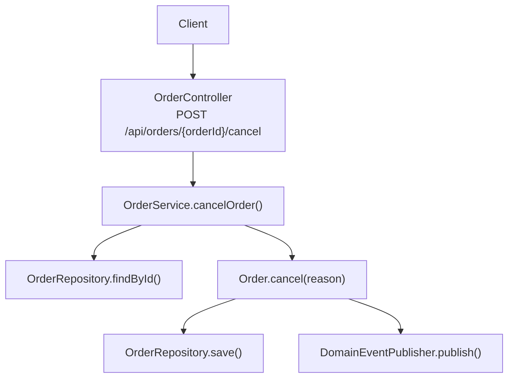
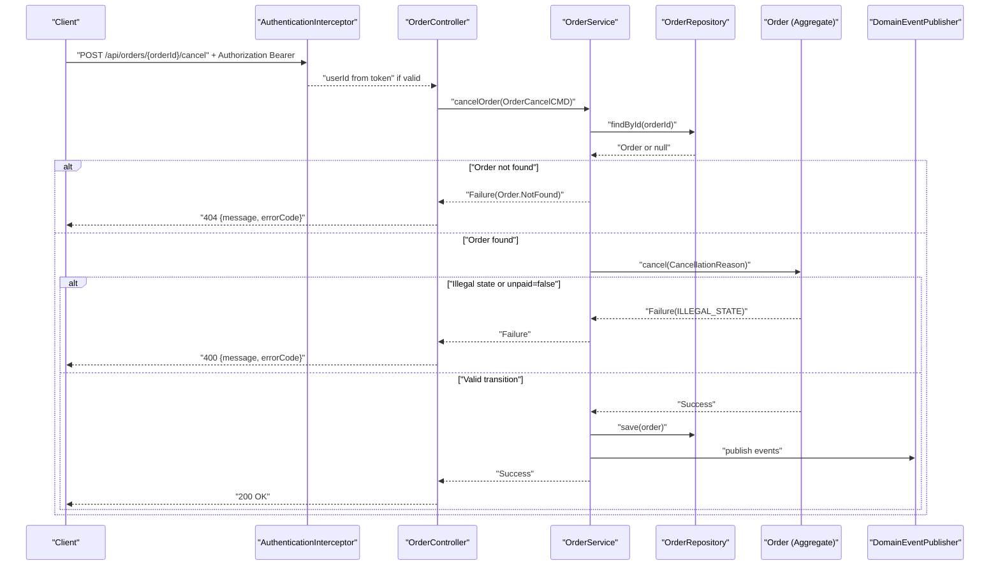
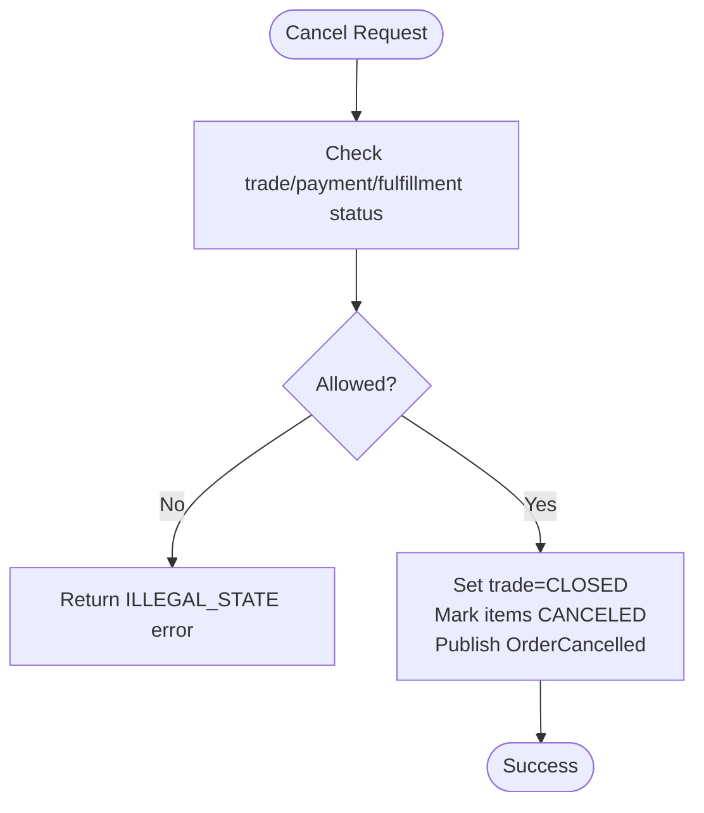
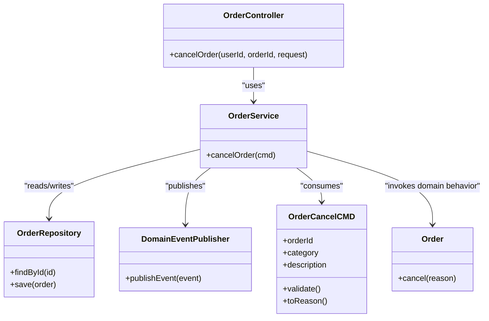

# Order Cancellation API

<cite>
**Referenced Files in This Document**
- [OrderController.kt](file://j-store-boot/src/main/kotlin/com/jstore/order/controller/OrderController.kt)
- [OrderService.kt](file://j-store-order/src/main/kotlin/com/jstore/order/service/OrderService.kt)
- [OrderCancelCMD.kt](file://j-store-order/src/main/kotlin/com/jstore/order/domain/order/command/OrderCancelCMD.kt)
- [CancellationReason.kt](file://j-store-order/src/main/kotlin/com/jstore/order/domain/order/CancellationReason.kt)
- [OrderImpl.kt](file://j-store-order/src/main/kotlin/com/jstore/order/domain/order/OrderImpl.kt)
- [TradeStatus.kt](file://j-store-order/src/main/kotlin/com/jstore/order/domain/order/TradeStatus.kt)
- [PaymentStatus.kt](file://j-store-order/src/main/kotlin/com/jstore/order/domain/order/PaymentStatus.kt)
- [OrderErrors.kt](file://j-store-order/src/main/kotlin/com/jstore/order/domain/order/OrderErrors.kt)
- [RequireLogin.kt](file://j-store-authentication-spring-sdk/src/main/kotlin/com/jstore/authentication/annotation/RequireLogin.kt)
- [AuthenticationInterceptor.kt](file://j-store-authentication-spring-sdk/src/main/kotlin/com/jstore/authentication/spring/AuthenticationInterceptor.kt)
</cite>

## Table of Contents
1. [Introduction](#introduction)
2. [Project Structure](#project-structure)
3. [Core Components](#core-components)
4. [Architecture Overview](#architecture-overview)
5. [Detailed Component Analysis](#detailed-component-analysis)
6. [Dependency Analysis](#dependency-analysis)
7. [Performance Considerations](#performance-considerations)
8. [Troubleshooting Guide](#troubleshooting-guide)
9. [Conclusion](#conclusion)

## Introduction
This document provides detailed API documentation for the order cancellation endpoint POST /api/orders/{orderId}/cancel. It explains the request structure, allowed cancellation categories, state transition rules that govern when an order can be cancelled, authentication requirements via @RequireLogin, and example responses for both success and error scenarios.

## Project Structure
The cancellation feature spans three layers:
- Controller layer exposes the REST endpoint and maps the request to a domain command.
- Application service orchestrates loading the order, executing domain behavior, persisting changes, and publishing events.
- Domain layer enforces business rules and state transitions on the Order aggregate.

**Diagram sources**
- [OrderController.kt:151-163](file://j-store-boot/src/main/kotlin/com/jstore/order/controller/OrderController.kt#L151-L163)
- [OrderService.kt:119-128](file://j-store-order/src/main/kotlin/com/jstore/order/service/OrderService.kt#L119-L128)
- [OrderImpl.kt:46](file://j-store-order/src/main/kotlin/com/jstore/order/domain/order/OrderImpl.kt#L46)

**Section sources**
- [OrderController.kt:151-163](file://j-store-boot/src/main/kotlin/com/jstore/order/controller/OrderController.kt#L151-L163)
- [OrderService.kt:119-128](file://j-store-order/src/main/kotlin/com/jstore/order/service/OrderService.kt#L119-L128)

## Core Components
- Endpoint: POST /api/orders/{orderId}/cancel
  - Path parameter: orderId (Long)
  - Request body: CancelOrderRequest with fields category and description
  - Authentication: Requires login via @RequireLogin at class level
  - Response: HTTP 200 on success; HTTP error with message and errorCode on failure

- CancelOrderRequest
  - category: CancellationCategory enum value
  - description: Non-blank string describing the reason for cancellation

- CancellationCategory values and business meaning
  - BUYER_CANCELLED: Buyer-initiated cancellation
  - PAYMENT_TIMEOUT: Cancellation due to payment timeout
  - STOCK_INSUFFICIENT: Cancellation due to insufficient stock

- State transition rules for cancellation
  - Allowed when:
    - Trade status is CREATED or ACTIVE
    - Payment status is UNPAID
    - Fulfillment status is UNFULFILLED
  - On success:
    - Trade status becomes CLOSED
    - All order items are marked as CANCELED
    - An OrderCancelled event is published

- Error conditions
  - Missing or invalid token (authentication)
  - Order not found
  - Invalid cancellation reason (blank description)
  - Illegal state (order already paid or beyond allowed states)

**Section sources**
- [OrderController.kt:17-22](file://j-store-boot/src/main/kotlin/com/jstore/order/controller/OrderController.kt#L17-L22)
- [OrderController.kt:47-50](file://j-store-boot/src/main/kotlin/com/jstore/order/controller/OrderController.kt#L47-L50)
- [OrderController.kt:151-163](file://j-store-boot/src/main/kotlin/com/jstore/order/controller/OrderController.kt#L151-L163)
- [OrderCancelCMD.kt:15-26](file://j-store-order/src/main/kotlin/com/jstore/order/domain/order/command/OrderCancelCMD.kt#L15-L26)
- [CancellationReason.kt:6-10](file://j-store-order/src/main/kotlin/com/jstore/order/domain/order/CancellationReason.kt#L6-L10)
- [OrderImpl.kt:46](file://j-store-order/src/main/kotlin/com/jstore/order/domain/order/OrderImpl.kt#L46)
- [OrderErrors.kt:16](file://j-store-order/src/main/kotlin/com/jstore/order/domain/order/OrderErrors.kt#L16)

## Architecture Overview
The cancellation flow integrates authentication, controller mapping, application orchestration, and domain enforcement.

**Diagram sources**
- [AuthenticationInterceptor.kt:35-65](file://j-store-authentication-spring-sdk/src/main/kotlin/com/jstore/authentication/spring/AuthenticationInterceptor.kt#L35-L65)
- [OrderController.kt:151-163](file://j-store-boot/src/main/kotlin/com/jstore/order/controller/OrderController.kt#L151-L163)
- [OrderService.kt:119-128](file://j-store-order/src/main/kotlin/com/jstore/order/service/OrderService.kt#L119-L128)
- [OrderImpl.kt:46](file://j-store-order/src/main/kotlin/com/jstore/order/domain/order/OrderImpl.kt#L46)

## Detailed Component Analysis

### API Definition: POST /api/orders/{orderId}/cancel
- Path parameters
  - orderId: Long identifier of the order to cancel
- Request body (CancelOrderRequest)
  - category: One of CancellationCategory values
  - description: Non-blank text explaining the reason
- Authentication
  - The entire OrderController requires login via @RequireLogin
  - A valid Bearer token must be provided in the Authorization header
  - The authenticated buyer’s userId is injected into the handler via @CurrentUserId
- Success response
  - HTTP 200 OK with empty or minimal payload as defined by the controller’s response mapper
- Error responses
  - 401 Unauthorized: Missing, invalid, or blacklisted token
  - 404 Not Found: Order does not exist
  - 400 Bad Request: Invalid cancellation reason or illegal state
  - 409 Conflict: Snapshot/version mismatch or other conflict errors (if applicable elsewhere)

Example successful request
- Method: POST
- URL: /api/orders/12345/cancel
- Headers:
  - Authorization: Bearer <valid_access_token>
- Body:
  - category: BUYER_CANCELLED
  - description: Changed my mind

Example error scenarios
- Missing token
  - Headers: Authorization missing
  - Response: 401 with message and errorCode
- Invalid token
  - Headers: Authorization: Bearer <invalid_token>
  - Response: 401 with message and errorCode
- Blacklisted token
  - Headers: Authorization: Bearer <blacklisted_token>
  - Response: 401 with message and errorCode
- Order not found
  - Body: Valid category and description
  - Response: 404 with message and errorCode
- Blank description
  - Body: category=BUYER_CANCELLED, description=""
  - Response: 400 with message and errorCode
- Paid order cancellation attempt
  - Body: category=BUYER_CANCELLED, description="late"
  - Response: 400 with message and errorCode

**Section sources**
- [OrderController.kt:17-22](file://j-store-boot/src/main/kotlin/com/jstore/order/controller/OrderController.kt#L17-L22)
- [OrderController.kt:47-50](file://j-store-boot/src/main/kotlin/com/jstore/order/controller/OrderController.kt#L47-L50)
- [OrderController.kt:151-163](file://j-store-boot/src/main/kotlin/com/jstore/order/controller/OrderController.kt#L151-L163)
- [RequireLogin.kt:1-5](file://j-store-authentication-spring-sdk/src/main/kotlin/com/jstore/authentication/annotation/RequireLogin.kt#L1-L5)
- [AuthenticationInterceptor.kt:35-65](file://j-store-authentication-spring-sdk/src/main/kotlin/com/jstore/authentication/spring/AuthenticationInterceptor.kt#L35-L65)
- [OrderErrors.kt:6](file://j-store-order/src/main/kotlin/com/jstore/order/domain/order/OrderErrors.kt#L6)
- [OrderErrors.kt:16](file://j-store-order/src/main/kotlin/com/jstore/order/domain/order/OrderErrors.kt#L16)

### Request Model: CancelOrderRequest
- Fields
  - category: CancellationCategory
  - description: String (must be non-blank)
- Validation
  - Description must not be blank; otherwise returns a validation error

**Section sources**
- [OrderController.kt:47-50](file://j-store-boot/src/main/kotlin/com/jstore/order/controller/OrderController.kt#L47-L50)
- [OrderCancelCMD.kt:15-26](file://j-store-order/src/main/kotlin/com/jstore/order/domain/order/command/OrderCancelCMD.kt#L15-L26)

### Domain Command: OrderCancelCMD
- Purpose: Carries orderId, category, and description into the application layer
- Validation: Ensures description is not blank; otherwise fails with a specific error code
- Conversion: Produces a CancellationReason used by the domain aggregate

**Section sources**
- [OrderCancelCMD.kt:15-26](file://j-store-order/src/main/kotlin/com/jstore/order/domain/order/command/OrderCancelCMD.kt#L15-L26)

### Cancellation Category Enum
- Values
  - BUYER_CANCELLED: Buyer initiated cancellation
  - PAYMENT_TIMEOUT: Cancellation due to payment timeout
  - STOCK_INSUFFICIENT: Cancellation due to insufficient stock

**Section sources**
- [CancellationReason.kt:6-10](file://j-store-order/src/main/kotlin/com/jstore/order/domain/order/CancellationReason.kt#L6-L10)

### State Transition Rules
- Allowed transitions for cancellation
  - Trade status must be CREATED or ACTIVE
  - Payment status must be UNPAID
  - Fulfillment status must be UNFULFILLED
- On successful cancellation
  - Trade status becomes CLOSED
  - All order items are marked as CANCELED
  - An OrderCancelled event is published

**Diagram sources**
- [OrderImpl.kt:46](file://j-store-order/src/main/kotlin/com/jstore/order/domain/order/OrderImpl.kt#L46)
- [OrderImpl.kt:66](file://j-store-order/src/main/kotlin/com/jstore/order/domain/order/OrderImpl.kt#L66)

**Section sources**
- [OrderImpl.kt:46](file://j-store-order/src/main/kotlin/com/jstore/order/domain/order/OrderImpl.kt#L46)
- [OrderImpl.kt:66](file://j-store-order/src/main/kotlin/com/jstore/order/domain/order/OrderImpl.kt#L66)
- [TradeStatus.kt:1-3](file://j-store-order/src/main/kotlin/com/jstore/order/domain/order/TradeStatus.kt#L1-L3)
- [PaymentStatus.kt:1-3](file://j-store-order/src/main/kotlin/com/jstore/order/domain/order/PaymentStatus.kt#L1-L3)

### Authentication Requirements
- @RequireLogin annotation
  - Applied at the controller class level to require authentication for all endpoints
- Interceptor behavior
  - Extracts Bearer token from Authorization header
  - Parses access token to obtain userId and JTI
  - Checks token blacklist
  - Sets authenticated user context for downstream use
- Identity validation
  - If token is missing, invalid, or blacklisted, returns appropriate 401 error
  - On success, userId is available via @CurrentUserId in controller methods

**Section sources**
- [OrderController.kt:17-22](file://j-store-boot/src/main/kotlin/com/jstore/order/controller/OrderController.kt#L17-L22)
- [RequireLogin.kt:1-5](file://j-store-authentication-spring-sdk/src/main/kotlin/com/jstore/authentication/annotation/RequireLogin.kt#L1-L5)
- [AuthenticationInterceptor.kt:35-65](file://j-store-authentication-spring-sdk/src/main/kotlin/com/jstore/authentication/spring/AuthenticationInterceptor.kt#L35-L65)

## Dependency Analysis
The cancellation feature depends on authentication, controller mapping, application orchestration, and domain logic.

**Diagram sources**
- [OrderController.kt:151-163](file://j-store-boot/src/main/kotlin/com/jstore/order/controller/OrderController.kt#L151-L163)
- [OrderService.kt:119-128](file://j-store-order/src/main/kotlin/com/jstore/order/service/OrderService.kt#L119-L128)
- [OrderCancelCMD.kt:15-26](file://j-store-order/src/main/kotlin/com/jstore/order/domain/order/command/OrderCancelCMD.kt#L15-L26)
- [OrderImpl.kt:46](file://j-store-order/src/main/kotlin/com/jstore/order/domain/order/OrderImpl.kt#L46)

**Section sources**
- [OrderController.kt:151-163](file://j-store-boot/src/main/kotlin/com/jstore/order/controller/OrderController.kt#L151-L163)
- [OrderService.kt:119-128](file://j-store-order/src/main/kotlin/com/jstore/order/service/OrderService.kt#L119-L128)

## Performance Considerations
- Keep requests small and focused; only include required fields in the request body.
- Ensure tokens are valid and not blacklisted to avoid repeated authentication failures.
- Avoid frequent cancellation attempts on orders that are already in terminal states to reduce unnecessary load.

[No sources needed since this section provides general guidance]

## Troubleshooting Guide
Common issues and resolutions:
- 401 Unauthorized
  - Cause: Missing, invalid, or blacklisted token
  - Resolution: Provide a valid Bearer token; ensure it has not been revoked
- 404 Not Found
  - Cause: Order ID does not exist
  - Resolution: Verify the orderId and permissions to access the order
- 400 Bad Request
  - Cause: Blank description or illegal state (e.g., order already paid)
  - Resolution: Provide a non-blank description; ensure the order is still cancellable per state rules

**Section sources**
- [AuthenticationInterceptor.kt:35-65](file://j-store-authentication-spring-sdk/src/main/kotlin/com/jstore/authentication/spring/AuthenticationInterceptor.kt#L35-L65)
- [OrderErrors.kt:6](file://j-store-order/src/main/kotlin/com/jstore/order/domain/order/OrderErrors.kt#L6)
- [OrderErrors.kt:16](file://j-store-order/src/main/kotlin/com/jstore/order/domain/order/OrderErrors.kt#L16)

## Conclusion
The order cancellation endpoint enforces strict authentication and domain-driven state transitions. Clients must provide a valid Bearer token and a non-blank cancellation reason. Cancellations are permitted only when the order remains unpaid and within allowed trade statuses. Successful cancellations update the order state, mark items as canceled, and publish relevant domain events. Errors are clearly categorized with descriptive messages and error codes for robust client handling.