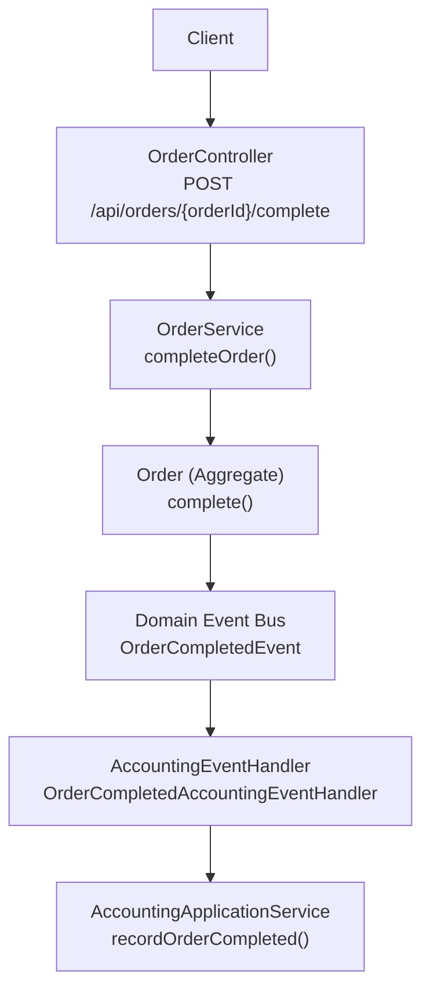
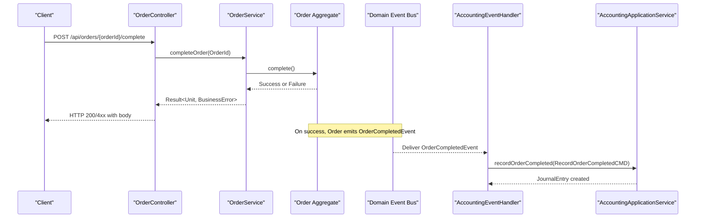
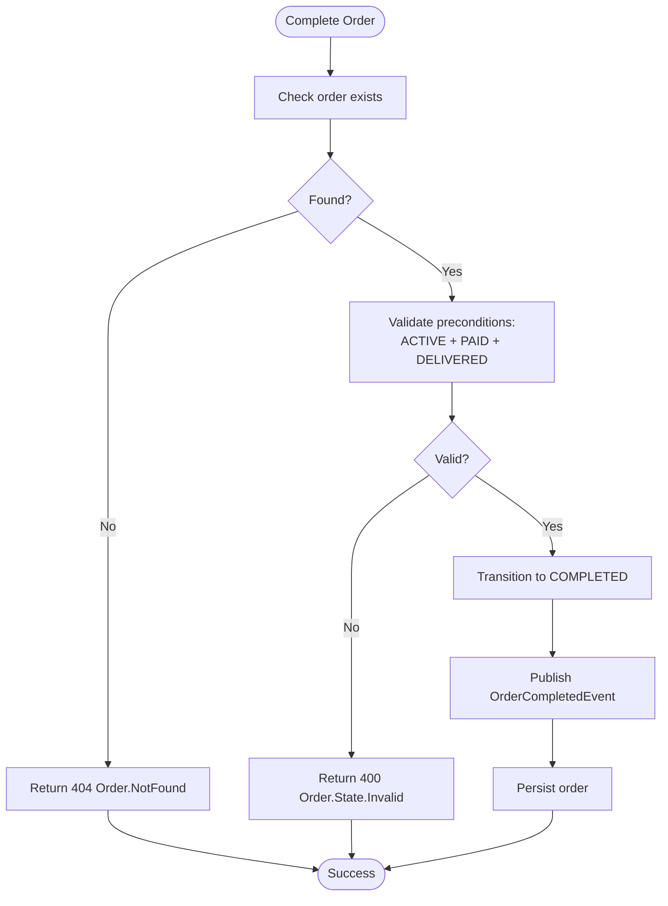
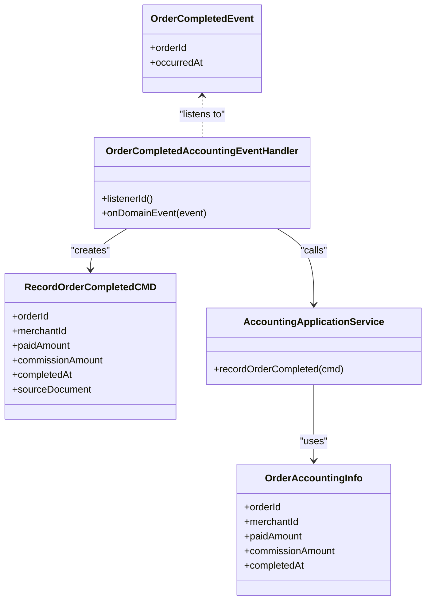
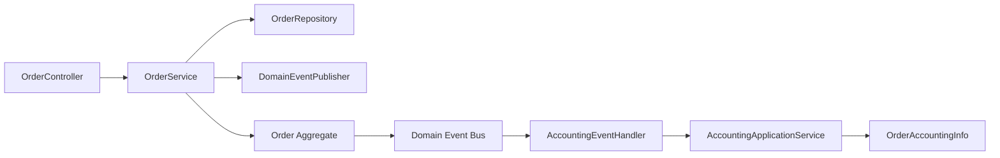

# Order Completion API

<cite>
**Referenced Files in This Document**
- [OrderController.kt](file://j-store-boot/src/main/kotlin/com/jstore/order/controller/OrderController.kt)
- [OrderService.kt](file://j-store-order/src/main/kotlin/com/jstore/order/service/OrderService.kt)
- [OrderImpl.kt](file://j-store-order/src/main/kotlin/com/jstore/order/domain/order/OrderImpl.kt)
- [Order.kt](file://j-store-order/src/main/kotlin/com/jstore/order/domain/order/Order.kt)
- [FulfillmentStatus.kt](file://j-store-order/src/main/kotlin/com/jstore/order/domain/order/FulfillmentStatus.kt)
- [TradeStatus.kt](file://j-store-order/src/main/kotlin/com/jstore/order/domain/order/TradeStatus.kt)
- [OrderErrors.kt](file://j-store-order/src/main/kotlin/com/jstore/order/domain/order/OrderErrors.kt)
- [OrderDomainEvent.kt](file://j-store-order/src/main/kotlin/com/jstore/order/domain/order/event/OrderDomainEvent.kt)
- [AccountingEventHandler.kt](file://j-store-accounting/src/main/kotlin/com/jstore/accounting/service/AccountingEventHandler.kt)
- [AccountingApplicationService.kt](file://j-store-accounting/src/main/kotlin/com/jstore/accounting/service/AccountingApplicationService.kt)
- [RecordOrderCompletedCMD.kt](file://j-store-accounting/src/main/kotlin/com/jstore/accounting/service/command/RecordOrderCompletedCMD.kt)
- [OrderAccountingInfo.kt](file://j-store-accounting/src/main/kotlin/com/jstore/accounting/acl/OrderAccountingInfo.kt)
</cite>

## Table of Contents
1. [Introduction](#introduction)
2. [Project Structure](#project-structure)
3. [Core Components](#core-components)
4. [Architecture Overview](#architecture-overview)
5. [Detailed Component Analysis](#detailed-component-analysis)
6. [Dependency Analysis](#dependency-analysis)
7. [Performance Considerations](#performance-considerations)
8. [Troubleshooting Guide](#troubleshooting-guide)
9. [Conclusion](#conclusion)

## Introduction
This document provides detailed API documentation for the order completion endpoint POST /api/orders/{orderId}/complete. It explains how an order is finalized after delivery confirmation, including state transitions from delivered to completed and the business implications. It also covers post-completion operations such as accounting entries and event-driven integrations. Examples of successful scenarios and error cases are included to guide implementation and troubleshooting.

## Project Structure
The order completion flow spans three layers:
- Controller layer exposes the REST endpoint.
- Service layer orchestrates domain logic and persistence.
- Domain layer enforces state transitions and emits domain events.
- Accounting subsystem reacts to completion events to record financial entries.

**Diagram sources**
- [OrderController.kt:189-194](file://j-store-boot/src/main/kotlin/com/jstore/order/controller/OrderController.kt#L189-L194)
- [OrderService.kt:111-117](file://j-store-order/src/main/kotlin/com/jstore/order/service/OrderService.kt#L111-L117)
- [OrderImpl.kt:45](file://j-store-order/src/main/kotlin/com/jstore/order/domain/order/OrderImpl.kt#L45)
- [OrderDomainEvent.kt:13](file://j-store-order/src/main/kotlin/com/jstore/order/domain/order/event/OrderDomainEvent.kt#L13)
- [AccountingEventHandler.kt:44-61](file://j-store-accounting/src/main/kotlin/com/jstore/accounting/service/AccountingEventHandler.kt#L44-L61)
- [AccountingApplicationService.kt:67](file://j-store-accounting/src/main/kotlin/com/jstore/accounting/service/AccountingApplicationService.kt#L67)

**Section sources**
- [OrderController.kt:189-194](file://j-store-boot/src/main/kotlin/com/jstore/order/controller/OrderController.kt#L189-L194)
- [OrderService.kt:111-117](file://j-store-order/src/main/kotlin/com/jstore/order/service/OrderService.kt#L111-L117)
- [OrderImpl.kt:45](file://j-store-order/src/main/kotlin/com/jstore/order/domain/order/OrderImpl.kt#L45)
- [OrderDomainEvent.kt:13](file://j-store-order/src/main/kotlin/com/jstore/order/domain/order/event/OrderDomainEvent.kt#L13)
- [AccountingEventHandler.kt:44-61](file://j-store-accounting/src/main/kotlin/com/jstore/accounting/service/AccountingEventHandler.kt#L44-L61)
- [AccountingApplicationService.kt:67](file://j-store-accounting/src/main/kotlin/com/jstore/accounting/service/AccountingApplicationService.kt#L67)

## Core Components
- Endpoint: POST /api/orders/{orderId}/complete
  - Path parameter: orderId (Long)
  - Authentication: Requires login via @RequireLogin
  - Response: Standardized Result-based response with success or error body

- Service method: completeOrder(orderId)
  - Loads order by ID
  - Invokes domain complete() transition
  - Persists changes
  - Returns standardized Result

- Domain aggregate: Order.complete()
  - Validates preconditions (active trade status, paid payment status, delivered fulfillment status)
  - Transitions trade status to COMPLETED
  - Emits OrderCompletedEvent

- Accounting integration: OrderCompletedAccountingEventHandler
  - Subscribes to OrderCompletedEvent
  - Converts event into RecordOrderCompletedCMD
  - Calls AccountingApplicationService.recordOrderCompleted()
  - Creates journal entries and updates accounting records

**Section sources**
- [OrderController.kt:189-194](file://j-store-boot/src/main/kotlin/com/jstore/order/controller/OrderController.kt#L189-L194)
- [OrderService.kt:111-117](file://j-store-order/src/main/kotlin/com/jstore/order/service/OrderService.kt#L111-L117)
- [Order.kt:60-61](file://j-store-order/src/main/kotlin/com/jstore/order/domain/order/Order.kt#L60-L61)
- [OrderImpl.kt:45](file://j-store-order/src/main/kotlin/com/jstore/order/domain/order/OrderImpl.kt#L45)
- [OrderDomainEvent.kt:13](file://j-store-order/src/main/kotlin/com/jstore/order/domain/order/event/OrderDomainEvent.kt#L13)
- [AccountingEventHandler.kt:44-61](file://j-store-accounting/src/main/kotlin/com/jstore/accounting/service/AccountingEventHandler.kt#L44-L61)
- [AccountingApplicationService.kt:67](file://j-store-accounting/src/main/kotlin/com/jstore/accounting/service/AccountingApplicationService.kt#L67)
- [RecordOrderCompletedCMD.kt:7](file://j-store-accounting/src/main/kotlin/com/jstore/accounting/service/command/RecordOrderCompletedCMD.kt#L7)
- [OrderAccountingInfo.kt:6-12](file://j-store-accounting/src/main/kotlin/com/jstore/accounting/acl/OrderAccountingInfo.kt#L6-L12)

## Architecture Overview
The completion workflow follows a layered architecture with event-driven side effects:

**Diagram sources**
- [OrderController.kt:189-194](file://j-store-boot/src/main/kotlin/com/jstore/order/controller/OrderController.kt#L189-L194)
- [OrderService.kt:111-117](file://j-store-order/src/main/kotlin/com/jstore/order/service/OrderService.kt#L111-L117)
- [OrderImpl.kt:45](file://j-store-order/src/main/kotlin/com/jstore/order/domain/order/OrderImpl.kt#L45)
- [OrderDomainEvent.kt:13](file://j-store-order/src/main/kotlin/com/jstore/order/domain/order/event/OrderDomainEvent.kt#L13)
- [AccountingEventHandler.kt:44-61](file://j-store-accounting/src/main/kotlin/com/jstore/accounting/service/AccountingEventHandler.kt#L44-L61)
- [AccountingApplicationService.kt:67](file://j-store-accounting/src/main/kotlin/com/jstore/accounting/service/AccountingApplicationService.kt#L67)

## Detailed Component Analysis

### API Definition: POST /api/orders/{orderId}/complete
- Purpose: Finalize an order that has been delivered and paid, marking it as completed.
- Path parameters:
  - orderId: Long identifier of the order to complete.
- Authentication:
  - Requires authenticated user context (@RequireLogin).
- Request body: None.
- Responses:
  - Success: HTTP 200 with empty or minimal payload depending on mapping.
  - Error: HTTP 4xx with ErrorResponse containing message and errorCode.

Common success scenario:
- Order exists, is active, paid, and fulfilled as DELIVERED.
- Trade status transitions to COMPLETED.
- OrderCompletedEvent emitted; accounting subsystem records commission and settlement entries.

Common error scenarios:
- Order not found: returns 404 with Order.NotFound.
- Illegal state: returns 400 with Order.State.Invalid if preconditions fail (e.g., not paid, not delivered).
- Other validation errors may be surfaced through standardized error mapping.

**Section sources**
- [OrderController.kt:189-194](file://j-store-boot/src/main/kotlin/com/jstore/order/controller/OrderController.kt#L189-L194)
- [OrderController.kt:245-254](file://j-store-boot/src/main/kotlin/com/jstore/order/controller/OrderController.kt#L245-L254)
- [OrderErrors.kt:6-8](file://j-store-order/src/main/kotlin/com/jstore/order/domain/order/OrderErrors.kt#L6-L8)

### State Transitions: Delivered to Completed
Preconditions enforced by the domain:
- Trade status must be ACTIVE.
- Payment status must be PAID.
- Fulfillment status must be DELIVERED.

On success:
- Trade status transitions to COMPLETED.
- OrderCompletedEvent is published.

Fulfillment and trade statuses involved:
- FulfillmentStatus: UNFULFILLED → PENDING_SHIPMENT → SHIPPED → DELIVERED
- TradeStatus: CREATED → ACTIVE → COMPLETED (or CLOSED on cancellation/refund)

**Diagram sources**
- [OrderService.kt:111-117](file://j-store-order/src/main/kotlin/com/jstore/order/service/OrderService.kt#L111-L117)
- [OrderImpl.kt:45](file://j-store-order/src/main/kotlin/com/jstore/order/domain/order/OrderImpl.kt#L45)
- [FulfillmentStatus.kt:3](file://j-store-order/src/main/kotlin/com/jstore/order/domain/order/FulfillmentStatus.kt#L3)
- [TradeStatus.kt:3](file://j-store-order/src/main/kotlin/com/jstore/order/domain/order/TradeStatus.kt#L3)
- [OrderErrors.kt:6-8](file://j-store-order/src/main/kotlin/com/jstore/order/domain/order/OrderErrors.kt#L6-L8)

**Section sources**
- [OrderImpl.kt:45](file://j-store-order/src/main/kotlin/com/jstore/order/domain/order/OrderImpl.kt#L45)
- [FulfillmentStatus.kt:3](file://j-store-order/src/main/kotlin/com/jstore/order/domain/order/FulfillmentStatus.kt#L3)
- [TradeStatus.kt:3](file://j-store-order/src/main/kotlin/com/jstore/order/domain/order/TradeStatus.kt#L3)
- [OrderErrors.kt:6-8](file://j-store-order/src/main/kotlin/com/jstore/order/domain/order/OrderErrors.kt#L6-L8)

### Post-Completion Operations: Accounting Entries
After completion:
- OrderCompletedEvent is emitted by the order aggregate.
- AccountingEventHandler listens to this event and converts it into RecordOrderCompletedCMD.
- AccountingApplicationService.recordOrderCompleted processes the command to create journal entries and update settlement statements.
- OrderAccountingInfo includes fields like orderId, merchantId, paidAmount, commissionAmount, and completedAt for accounting purposes.

Business implications:
- Platform commission is recorded upon order completion.
- Settlement statements can be generated based on completed orders.
- Financial reporting reflects finalized revenue and commissions.

**Diagram sources**
- [OrderDomainEvent.kt:13](file://j-store-order/src/main/kotlin/com/jstore/order/domain/order/event/OrderDomainEvent.kt#L13)
- [AccountingEventHandler.kt:44-61](file://j-store-accounting/src/main/kotlin/com/jstore/accounting/service/AccountingEventHandler.kt#L44-L61)
- [RecordOrderCompletedCMD.kt:7](file://j-store-accounting/src/main/kotlin/com/jstore/accounting/service/command/RecordOrderCompletedCMD.kt#L7)
- [AccountingApplicationService.kt:67](file://j-store-accounting/src/main/kotlin/com/jstore/accounting/service/AccountingApplicationService.kt#L67)
- [OrderAccountingInfo.kt:6-12](file://j-store-accounting/src/main/kotlin/com/jstore/accounting/acl/OrderAccountingInfo.kt#L6-L12)

**Section sources**
- [OrderDomainEvent.kt:13](file://j-store-order/src/main/kotlin/com/jstore/order/domain/order/event/OrderDomainEvent.kt#L13)
- [AccountingEventHandler.kt:44-61](file://j-store-accounting/src/main/kotlin/com/jstore/accounting/service/AccountingEventHandler.kt#L44-L61)
- [RecordOrderCompletedCMD.kt:7](file://j-store-accounting/src/main/kotlin/com/jstore/accounting/service/command/RecordOrderCompletedCMD.kt#L7)
- [AccountingApplicationService.kt:67](file://j-store-accounting/src/main/kotlin/com/jstore/accounting/service/AccountingApplicationService.kt#L67)
- [OrderAccountingInfo.kt:6-12](file://j-store-accounting/src/main/kotlin/com/jstore/accounting/acl/OrderAccountingInfo.kt#L6-L12)

### Inventory Updates
- The completion endpoint does not directly modify inventory.
- Inventory reservations are typically confirmed earlier in the order lifecycle (stock confirmation).
- Upon completion, no additional inventory adjustments are performed by this endpoint.

[No sources needed since this section provides general guidance]

### Notification Triggers
- No direct notification triggers are implemented within the completion endpoint.
- Notifications can be triggered downstream via domain events or external integrations reacting to OrderCompletedEvent.

[No sources needed since this section provides general guidance]

## Dependency Analysis
Key dependencies and relationships:
- OrderController depends on OrderService for orchestration.
- OrderService depends on OrderRepository and DomainEventPublisher.
- Order aggregate encapsulates state transitions and event emission.
- AccountingEventHandler depends on OrderCompletedEvent and AccountingApplicationService.
- AccountingApplicationService uses OrderAccountingInfo for financial processing.

**Diagram sources**
- [OrderController.kt:189-194](file://j-store-boot/src/main/kotlin/com/jstore/order/controller/OrderController.kt#L189-L194)
- [OrderService.kt:111-117](file://j-store-order/src/main/kotlin/com/jstore/order/service/OrderService.kt#L111-L117)
- [OrderImpl.kt:45](file://j-store-order/src/main/kotlin/com/jstore/order/domain/order/OrderImpl.kt#L45)
- [OrderDomainEvent.kt:13](file://j-store-order/src/main/kotlin/com/jstore/order/domain/order/event/OrderDomainEvent.kt#L13)
- [AccountingEventHandler.kt:44-61](file://j-store-accounting/src/main/kotlin/com/jstore/accounting/service/AccountingEventHandler.kt#L44-L61)
- [AccountingApplicationService.kt:67](file://j-store-accounting/src/main/kotlin/com/jstore/accounting/service/AccountingApplicationService.kt#L67)
- [OrderAccountingInfo.kt:6-12](file://j-store-accounting/src/main/kotlin/com/jstore/accounting/acl/OrderAccountingInfo.kt#L6-L12)

**Section sources**
- [OrderController.kt:189-194](file://j-store-boot/src/main/kotlin/com/jstore/order/controller/OrderController.kt#L189-L194)
- [OrderService.kt:111-117](file://j-store-order/src/main/kotlin/com/jstore/order/service/OrderService.kt#L111-L117)
- [OrderImpl.kt:45](file://j-store-order/src/main/kotlin/com/jstore/order/domain/order/OrderImpl.kt#L45)
- [OrderDomainEvent.kt:13](file://j-store-order/src/main/kotlin/com/jstore/order/domain/order/event/OrderDomainEvent.kt#L13)
- [AccountingEventHandler.kt:44-61](file://j-store-accounting/src/main/kotlin/com/jstore/accounting/service/AccountingEventHandler.kt#L44-L61)
- [AccountingApplicationService.kt:67](file://j-store-accounting/src/main/kotlin/com/jstore/accounting/service/AccountingApplicationService.kt#L67)
- [OrderAccountingInfo.kt:6-12](file://j-store-accounting/src/main/kotlin/com/jstore/accounting/acl/OrderAccountingInfo.kt#L6-L12)

## Performance Considerations
- Idempotency: Ensure completion requests are idempotent to handle retries safely.
- Concurrency: Use optimistic locking or version checks on order persistence to prevent race conditions.
- Event throughput: Account for asynchronous event processing; monitor backlogs in event consumers.
- Database transactions: Keep transaction boundaries tight around order state changes to reduce lock contention.

[No sources needed since this section provides general guidance]

## Troubleshooting Guide
Common errors and resolutions:
- Order not found (404): Verify orderId exists and is accessible to the caller.
- Illegal state (400): Ensure order is ACTIVE, PAID, and DELIVERED before completing.
- Validation failures: Confirm required fields and constraints in upstream steps (payment, shipping).
- Accounting discrepancies: Inspect OrderCompletedEvent handling and journal entry creation.

Diagnostic tips:
- Check order state via GET /api/orders/{orderId}.
- Review domain events emitted during completion.
- Monitor accounting logs for journal entry creation.

**Section sources**
- [OrderErrors.kt:6-8](file://j-store-order/src/main/kotlin/com/jstore/order/domain/order/OrderErrors.kt#L6-L8)
- [OrderController.kt:245-254](file://j-store-boot/src/main/kotlin/com/jstore/order/controller/OrderController.kt#L245-L254)
- [AccountingEventHandler.kt:44-61](file://j-store-accounting/src/main/kotlin/com/jstore/accounting/service/AccountingEventHandler.kt#L44-L61)

## Conclusion
The POST /api/orders/{orderId}/complete endpoint finalizes orders that have been delivered and paid, transitioning them to COMPLETED and triggering accounting entries via domain events. Proper validation ensures only eligible orders are completed, while event-driven architecture enables scalable side effects such as commission recording and settlement processing. Adhering to idempotency and concurrency best practices will ensure robust operation in production environments.