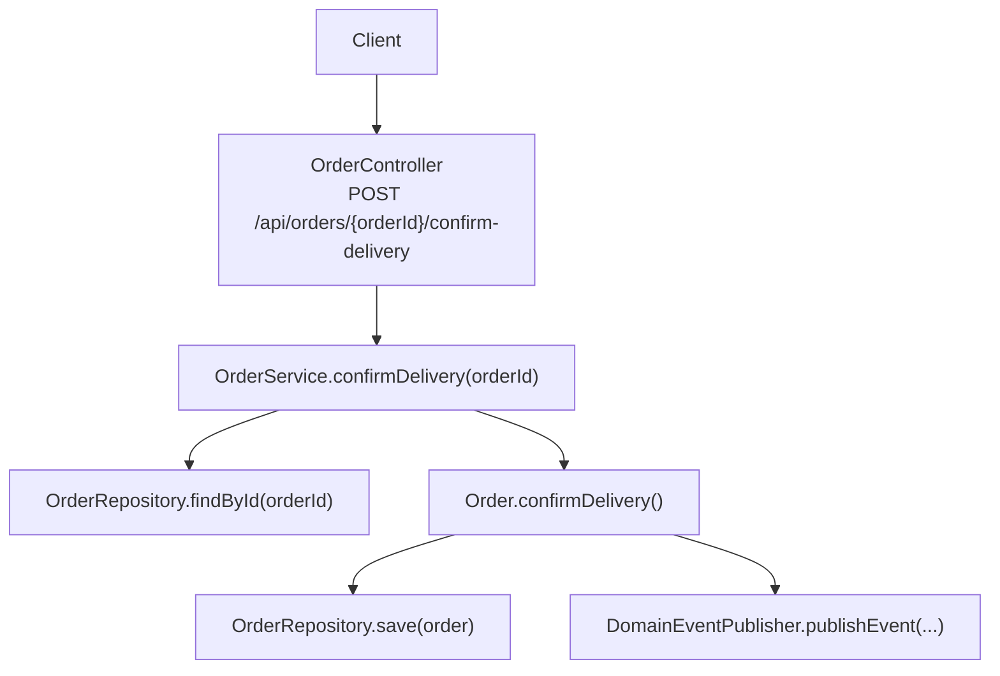
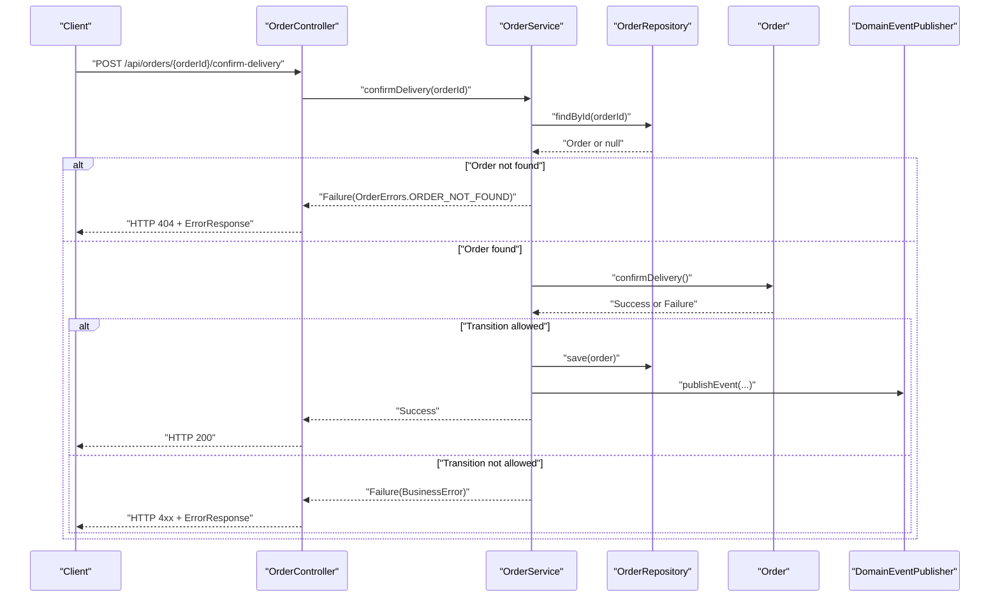
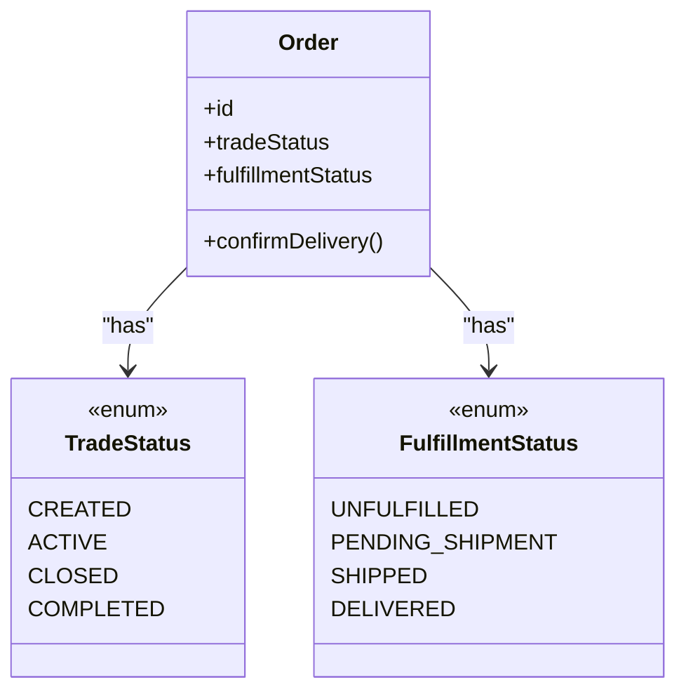
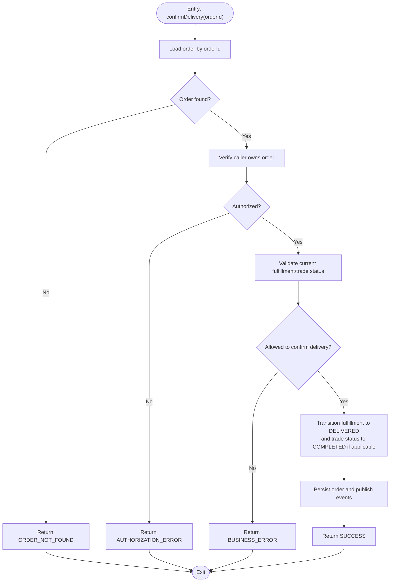
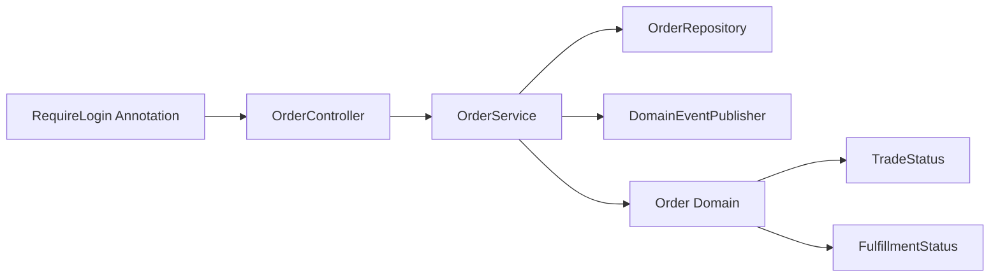

# Order Delivery Confirmation API

<cite>
**Referenced Files in This Document**
- [OrderController.kt](file://j-store-boot/src/main/kotlin/com/jstore/order/controller/OrderController.kt)
- [OrderService.kt](file://j-store-order/src/main/kotlin/com/jstore/order/service/OrderService.kt)
- [TradeStatus.kt](file://j-store-order/src/main/kotlin/com/jstore/order/domain/order/TradeStatus.kt)
- [FulfillmentStatus.kt](file://j-store-order/src/main/kotlin/com/jstore/order/domain/order/FulfillmentStatus.kt)
- [RequireLogin.kt](file://j-store-authentication-spring-sdk/src/main/kotlin/com/jstore/authentication/annotation/RequireLogin.kt)
</cite>

## Table of Contents
1. [Introduction](#introduction)
2. [Project Structure](#project-structure)
3. [Core Components](#core-components)
4. [Architecture Overview](#architecture-overview)
5. [Detailed Component Analysis](#detailed-component-analysis)
6. [Dependency Analysis](#dependency-analysis)
7. [Performance Considerations](#performance-considerations)
8. [Troubleshooting Guide](#troubleshooting-guide)
9. [Conclusion](#conclusion)

## Introduction
This document provides detailed API documentation for the delivery confirmation endpoint that allows a buyer to confirm receipt of delivered goods: POST /api/orders/{orderId}/confirm-delivery. It explains the buyer’s ability to confirm delivery, the resulting state transitions in the order lifecycle, business rules governing when confirmation is allowed, authentication and authorization requirements, and examples of successful and error scenarios.

## Project Structure
The delivery confirmation feature spans three layers:
- Controller layer exposes the HTTP endpoint and handles request/response mapping.
- Application service orchestrates loading the order aggregate, invoking domain behavior, and persisting changes.
- Domain layer defines order status enums and encapsulates business rules for state transitions.

**Diagram sources**
- [OrderController.kt:165-171](file://j-store-boot/src/main/kotlin/com/jstore/order/controller/OrderController.kt#L165-L171)
- [OrderService.kt:102-108](file://j-store-order/src/main/kotlin/com/jstore/order/service/OrderService.kt#L102-L108)

**Section sources**
- [OrderController.kt:165-171](file://j-store-boot/src/main/kotlin/com/jstore/order/controller/OrderController.kt#L165-L171)
- [OrderService.kt:102-108](file://j-store-order/src/main/kotlin/com/jstore/order/service/OrderService.kt#L102-L108)

## Core Components
- Endpoint: POST /api/orders/{orderId}/confirm-delivery
  - Path parameter: orderId (Long)
  - Authentication: Requires login via @RequireLogin on controller class
  - Authorization: The current user ID is injected via @CurrentUserId; the application enforces ownership at the service/repository level
  - Request body: None
  - Response: Success returns HTTP 200 with an empty or minimal payload; failure returns HTTP 4xx/5xx with ErrorResponse containing message and errorCode

- Application Service: OrderService.confirmDelivery(orderId)
  - Loads the order by ID
  - Invokes Order.confirmDelivery() to apply business rules and transition states
  - Persists the updated order and publishes any domain events

- Domain Entities and Enums:
  - TradeStatus: CREATED, ACTIVE, CLOSED, COMPLETED
  - FulfillmentStatus: UNFULFILLED, PENDING_SHIPMENT, SHIPPED, DELIVERED

**Section sources**
- [OrderController.kt:165-171](file://j-store-boot/src/main/kotlin/com/jstore/order/controller/OrderController.kt#L165-L171)
- [OrderService.kt:102-108](file://j-store-order/src/main/kotlin/com/jstore/order/service/OrderService.kt#L102-L108)
- [TradeStatus.kt:1-4](file://j-store-order/src/main/kotlin/com/jstore/order/domain/order/TradeStatus.kt#L1-L4)
- [FulfillmentStatus.kt:1-4](file://j-store-order/src/main/kotlin/com/jstore/order/domain/order/FulfillmentStatus.kt#L1-L4)

## Architecture Overview
The delivery confirmation flow follows a typical DDD pattern:
- The controller receives the request, extracts the authenticated user ID, and delegates to the application service.
- The application service loads the order from persistence, applies domain logic, persists changes, and publishes domain events.
- The domain object enforces business rules and performs state transitions.

**Diagram sources**
- [OrderController.kt:165-171](file://j-store-boot/src/main/kotlin/com/jstore/order/controller/OrderController.kt#L165-L171)
- [OrderService.kt:102-108](file://j-store-order/src/main/kotlin/com/jstore/order/service/OrderService.kt#L102-L108)

## Detailed Component Analysis

### API Definition: POST /api/orders/{orderId}/confirm-delivery
- Method: POST
- Path: /api/orders/{orderId}/confirm-delivery
- Path parameters:
  - orderId: Long — unique identifier of the order to confirm delivery for
- Headers:
  - Authorization: Bearer <token> (required due to @RequireLogin)
- Request body: None
- Success response:
  - HTTP 200 OK
  - Body: minimal or empty success payload (framework maps Result<T> to appropriate response)
- Error responses:
  - HTTP 401 Unauthorized if not authenticated
  - HTTP 403 Forbidden if not authorized to act on this order
  - HTTP 404 Not Found if order does not exist
  - HTTP 4xx/5xx with ErrorResponse { message, errorCode } for business rule violations

Authentication and Authorization:
- Authentication is enforced by @RequireLogin on the controller class.
- Authorization is handled by injecting @CurrentUserId into the method; ownership checks are expected to be enforced within the service/repository layer before allowing state transitions.

Business Rules and State Transitions:
- Allowed only when the order is in a deliverable state (e.g., fulfillment status indicates shipped/delivered).
- On success, fulfillment status transitions to DELIVERED and trade status may transition to COMPLETED depending on domain rules.
- If the order is already completed or closed, or not yet shipped, the operation must fail with a business error.

Examples:
- Successful confirmation:
  - Precondition: Order exists, authenticated buyer owns the order, fulfillment status is SHIPPED or DELIVERED.
  - Action: POST /api/orders/{orderId}/confirm-delivery
  - Result: FulfillmentStatus becomes DELIVERED; TradeStatus may become COMPLETED; HTTP 200 returned.
- Error cases:
  - Order not found: HTTP 404 with ErrorResponse.
  - Not authenticated: HTTP 401.
  - Not authorized: HTTP 403.
  - Invalid state (e.g., order still PENDING_SHIPMENT): HTTP 4xx with ErrorResponse indicating business rule violation.

**Section sources**
- [OrderController.kt:165-171](file://j-store-boot/src/main/kotlin/com/jstore/order/controller/OrderController.kt#L165-L171)
- [OrderService.kt:102-108](file://j-store-order/src/main/kotlin/com/jstore/order/service/OrderService.kt#L102-L108)
- [TradeStatus.kt:1-4](file://j-store-order/src/main/kotlin/com/jstore/order/domain/order/TradeStatus.kt#L1-L4)
- [FulfillmentStatus.kt:1-4](file://j-store-order/src/main/kotlin/com/jstore/order/domain/order/FulfillmentStatus.kt#L1-L4)

### Class Diagram: Order Lifecycle States

**Diagram sources**
- [TradeStatus.kt:1-4](file://j-store-order/src/main/kotlin/com/jstore/order/domain/order/TradeStatus.kt#L1-L4)
- [FulfillmentStatus.kt:1-4](file://j-store-order/src/main/kotlin/com/jstore/order/domain/order/FulfillmentStatus.kt#L1-L4)
- [OrderService.kt:102-108](file://j-store-order/src/main/kotlin/com/jstore/order/service/OrderService.kt#L102-L108)

### Flowchart: Delivery Confirmation Decision Logic

[No sources needed since this diagram shows conceptual workflow, not actual code structure]

## Dependency Analysis
The delivery confirmation endpoint depends on:
- Authentication SDK for login enforcement (@RequireLogin) and current user injection (@CurrentUserId).
- Order controller delegating to OrderService.
- OrderService using OrderRepository and publishing domain events.
- Domain enums defining valid states.

**Diagram sources**
- [RequireLogin.kt:1-6](file://j-store-authentication-spring-sdk/src/main/kotlin/com/jstore/authentication/annotation/RequireLogin.kt#L1-L6)
- [OrderController.kt:165-171](file://j-store-boot/src/main/kotlin/com/jstore/order/controller/OrderController.kt#L165-L171)
- [OrderService.kt:102-108](file://j-store-order/src/main/kotlin/com/jstore/order/service/OrderService.kt#L102-L108)
- [TradeStatus.kt:1-4](file://j-store-order/src/main/kotlin/com/jstore/order/domain/order/TradeStatus.kt#L1-L4)
- [FulfillmentStatus.kt:1-4](file://j-store-order/src/main/kotlin/com/jstore/order/domain/order/FulfillmentStatus.kt#L1-L4)

**Section sources**
- [RequireLogin.kt:1-6](file://j-store-authentication-spring-sdk/src/main/kotlin/com/jstore/authentication/annotation/RequireLogin.kt#L1-L6)
- [OrderController.kt:165-171](file://j-store-boot/src/main/kotlin/com/jstore/order/controller/OrderController.kt#L165-L171)
- [OrderService.kt:102-108](file://j-store-order/src/main/kotlin/com/jstore/order/service/OrderService.kt#L102-L108)

## Performance Considerations
- Single read followed by single write per confirmation request; ensure efficient indexing on orderId and buyerUid for fast lookups.
- Avoid unnecessary serialization overhead by returning minimal payloads on success.
- Publish domain events asynchronously where possible to reduce latency.

[No sources needed since this section provides general guidance]

## Troubleshooting Guide
Common errors and resolutions:
- 401 Unauthorized: Ensure a valid bearer token is included in the Authorization header.
- 403 Forbidden: Verify the authenticated user owns the order; check ownership checks in service/repository.
- 404 Not Found: Confirm the orderId exists and is accessible to the caller.
- Business rule violation: Check current order status; confirm delivery is only allowed when the order is in a deliverable state (e.g., SHIPPED or DELIVERED).

**Section sources**
- [OrderController.kt:165-171](file://j-store-boot/src/main/kotlin/com/jstore/order/controller/OrderController.kt#L165-L171)
- [OrderService.kt:102-108](file://j-store-order/src/main/kotlin/com/jstore/order/service/OrderService.kt#L102-L108)

## Conclusion
The delivery confirmation endpoint enables buyers to finalize fulfillment by confirming receipt of goods. It enforces authentication via @RequireLogin, validates ownership through the current user context, and delegates business rules to the Order domain. Successful confirmation transitions fulfillment status to DELIVERED and may complete the trade status. Proper error handling ensures clear feedback for invalid states or unauthorized access.

[No sources needed since this section summarizes without analyzing specific files]