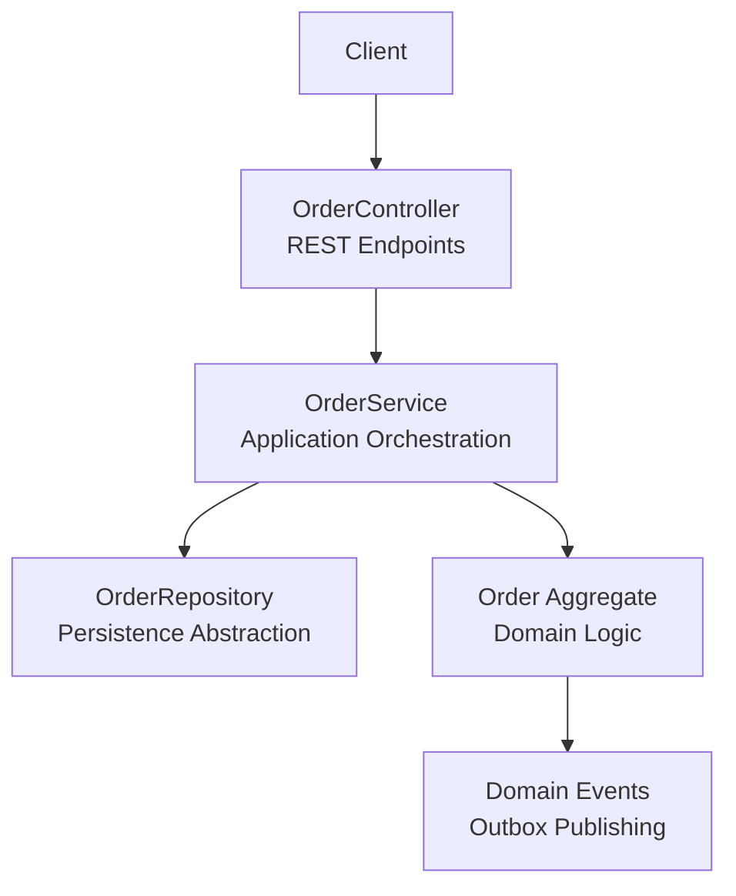
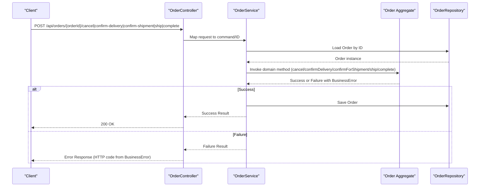
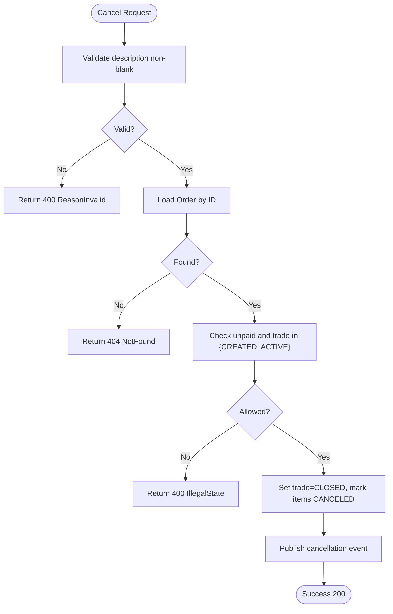
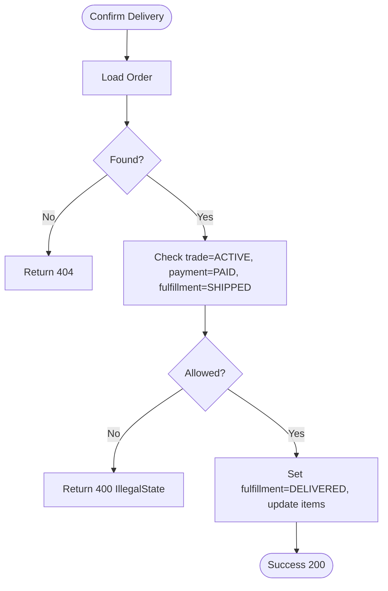
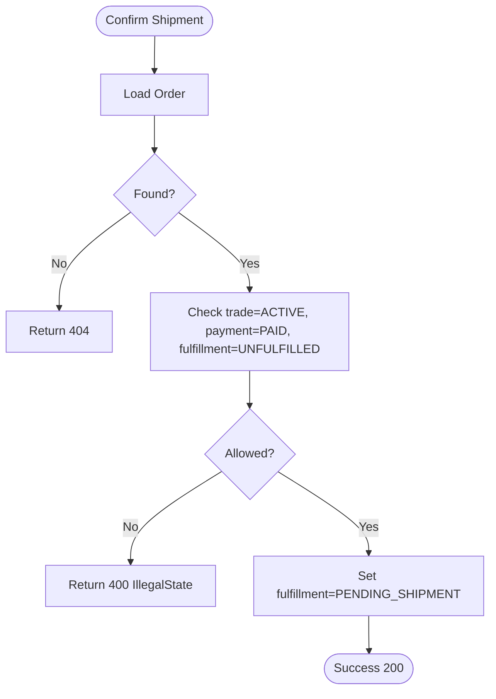
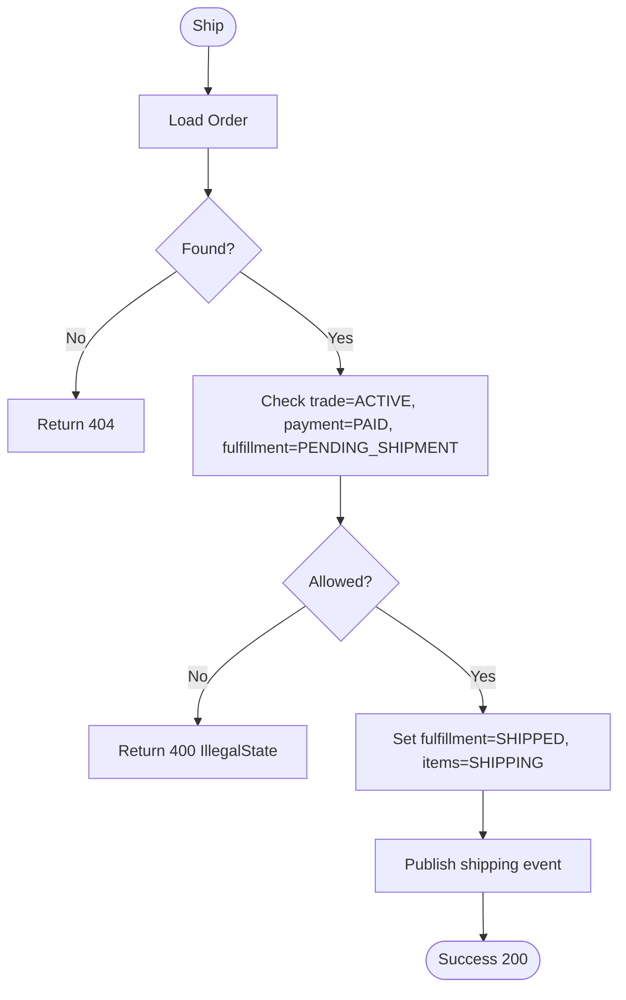
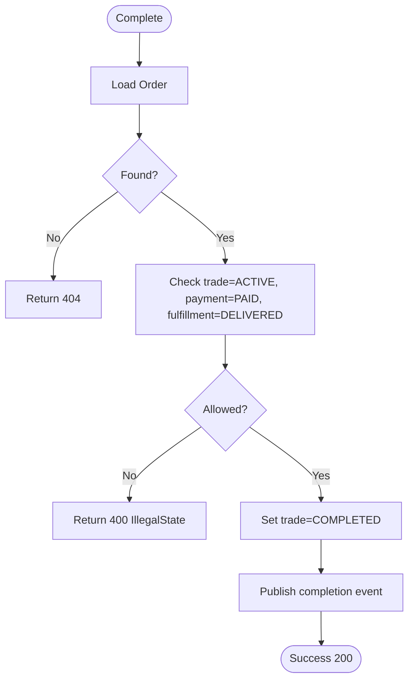
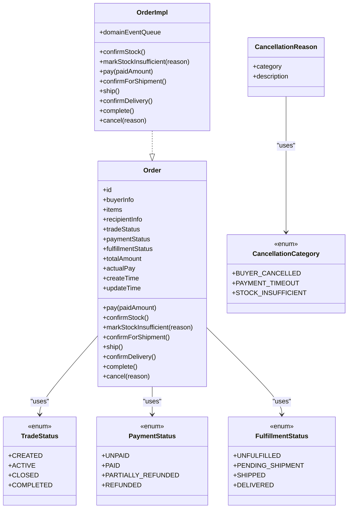
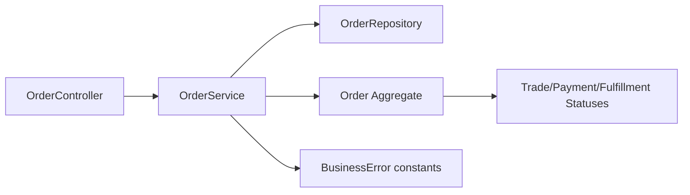

# Order Lifecycle Management API

<cite>
**Referenced Files in This Document**
- [OrderController.kt](file://j-store-boot/src/main/kotlin/com/jstore/order/controller/OrderController.kt)
- [OrderService.kt](file://j-store-order/src/main/kotlin/com/jstore/order/service/OrderService.kt)
- [Order.kt](file://j-store-order/src/main/kotlin/com/jstore/order/domain/order/Order.kt)
- [OrderImpl.kt](file://j-store-order/src/main/kotlin/com/jstore/order/domain/order/OrderImpl.kt)
- [TradeStatus.kt](file://j-store-order/src/main/kotlin/com/jstore/order/domain/order/TradeStatus.kt)
- [PaymentStatus.kt](file://j-store-order/src/main/kotlin/com/jstore/order/domain/order/PaymentStatus.kt)
- [FulfillmentStatus.kt](file://j-store-order/src/main/kotlin/com/jstore/order/domain/order/FulfillmentStatus.kt)
- [CancellationReason.kt](file://j-store-order/src/main/kotlin/com/jstore/order/domain/order/CancellationReason.kt)
- [OrderCancelCMD.kt](file://j-store-order/src/main/kotlin/com/jstore/order/domain/order/command/OrderCancelCMD.kt)
- [OrderErrors.kt](file://j-store-order/src/main/kotlin/com/jstore/order/domain/order/OrderErrors.kt)
</cite>

## Table of Contents
1. [Introduction](#introduction)
2. [Project Structure](#project-structure)
3. [Core Components](#core-components)
4. [Architecture Overview](#architecture-overview)
5. [Detailed Component Analysis](#detailed-component-analysis)
6. [Dependency Analysis](#dependency-analysis)
7. [Performance Considerations](#performance-considerations)
8. [Troubleshooting Guide](#troubleshooting-guide)
9. [Conclusion](#conclusion)

## Introduction
This document provides detailed API documentation for order lifecycle management endpoints, focusing on cancellation, delivery confirmation, shipment confirmation, shipping, and completion operations. It explains the request structure for cancellation, state transition rules enforced by the domain model, and business constraints that determine whether an operation is allowed based on the current order status. Examples of successful transitions and error scenarios are included to guide integration and testing.

## Project Structure
The order lifecycle endpoints are exposed via a REST controller that delegates to an application service, which in turn invokes domain methods on the Order aggregate. The domain enforces state transitions across three orthogonal dimensions: trade status, payment status, and fulfillment status.

**Diagram sources**
- [OrderController.kt](file://j-store-boot/src/main/kotlin/com/jstore/order/controller/OrderController.kt)
- [OrderService.kt](file://j-store-order/src/main/kotlin/com/jstore/order/service/OrderService.kt)
- [Order.kt](file://j-store-order/src/main/kotlin/com/jstore/order/domain/order/Order.kt)

**Section sources**
- [OrderController.kt](file://j-store-boot/src/main/kotlin/com/jstore/order/controller/OrderController.kt)
- [OrderService.kt](file://j-store-order/src/main/kotlin/com/jstore/order/service/OrderService.kt)

## Core Components
- OrderController: Exposes REST endpoints for order lifecycle operations and maps requests to commands or IDs.
- OrderService: Orchestrates use cases by loading the order, invoking domain behavior, persisting changes, and publishing domain events.
- Order (Aggregate): Encapsulates business rules and state transitions across trade, payment, and fulfillment statuses.
- Status Enums: TradeStatus, PaymentStatus, FulfillmentStatus define the valid states and constrain transitions.
- CancellationReason and OrderCancelCMD: Define cancellation input validation and reason modeling.

Key responsibilities:
- Input validation at the command layer (e.g., cancel reason must be non-blank).
- State checks inside the domain before allowing transitions.
- Persistence and event publication after successful transitions.

**Section sources**
- [OrderController.kt](file://j-store-boot/src/main/kotlin/com/jstore/order/controller/OrderController.kt)
- [OrderService.kt](file://j-store-order/src/main/kotlin/com/jstore/order/service/OrderService.kt)
- [Order.kt](file://j-store-order/src/main/kotlin/com/jstore/order/domain/order/Order.kt)
- [TradeStatus.kt](file://j-store-order/src/main/kotlin/com/jstore/order/domain/order/TradeStatus.kt)
- [PaymentStatus.kt](file://j-store-order/src/main/kotlin/com/jstore/order/domain/order/PaymentStatus.kt)
- [FulfillmentStatus.kt](file://j-store-order/src/main/kotlin/com/jstore/order/domain/order/FulfillmentStatus.kt)
- [CancellationReason.kt](file://j-store-order/src/main/kotlin/com/jstore/order/domain/order/CancellationReason.kt)
- [OrderCancelCMD.kt](file://j-store-order/src/main/kotlin/com/jstore/order/domain/order/command/OrderCancelCMD.kt)

## Architecture Overview
The lifecycle endpoints follow a consistent flow: HTTP request → Controller → Application Service → Domain Aggregate → Persistence and Events.

**Diagram sources**
- [OrderController.kt](file://j-store-boot/src/main/kotlin/com/jstore/order/controller/OrderController.kt)
- [OrderService.kt](file://j-store-order/src/main/kotlin/com/jstore/order/service/OrderService.kt)
- [Order.kt](file://j-store-order/src/main/kotlin/com/jstore/order/domain/order/Order.kt)

## Detailed Component Analysis

### Cancel Order (POST /api/orders/{orderId}/cancel)
- Endpoint: POST /api/orders/{orderId}/cancel
- Request body: CancelOrderRequest
  - category: CancellationCategory (BUYER_CANCELLED, PAYMENT_TIMEOUT, STOCK_INSUFFICIENT)
  - description: String (must be non-blank)
- Behavior:
  - Validates the command (description cannot be blank).
  - Loads the order; if not found, returns NOT_FOUND.
  - Allows cancellation only when unpaid and in CREATED or ACTIVE trade status.
  - On success, sets trade status to CLOSED and marks items canceled; publishes cancellation event.
- Successful transition example:
  - Unpaid order in ACTIVE state → CLOSED (items marked CANCELED).
- Error scenarios:
  - Order not found → 404.
  - Description blank → 400 (reason invalid).
  - Order already paid or not in allowed trade status → 400 (illegal state).

**Diagram sources**
- [OrderController.kt](file://j-store-boot/src/main/kotlin/com/jstore/order/controller/OrderController.kt)
- [OrderService.kt](file://j-store-order/src/main/kotlin/com/jstore/order/service/OrderService.kt)
- [OrderImpl.kt](file://j-store-order/src/main/kotlin/com/jstore/order/domain/order/OrderImpl.kt)
- [OrderCancelCMD.kt](file://j-store-order/src/main/kotlin/com/jstore/order/domain/order/command/OrderCancelCMD.kt)
- [CancellationReason.kt](file://j-store-order/src/main/kotlin/com/jstore/order/domain/order/CancellationReason.kt)
- [OrderErrors.kt](file://j-store-order/src/main/kotlin/com/jstore/order/domain/order/OrderErrors.kt)

**Section sources**
- [OrderController.kt](file://j-store-boot/src/main/kotlin/com/jstore/order/controller/OrderController.kt)
- [OrderService.kt](file://j-store-order/src/main/kotlin/com/jstore/order/service/OrderService.kt)
- [OrderImpl.kt](file://j-store-order/src/main/kotlin/com/jstore/order/domain/order/OrderImpl.kt)
- [OrderCancelCMD.kt](file://j-store-order/src/main/kotlin/com/jstore/order/domain/order/command/OrderCancelCMD.kt)
- [CancellationReason.kt](file://j-store-order/src/main/kotlin/com/jstore/order/domain/order/CancellationReason.kt)
- [OrderErrors.kt](file://j-store-order/src/main/kotlin/com/jstore/order/domain/order/OrderErrors.kt)

### Confirm Delivery (POST /api/orders/{orderId}/confirm-delivery)
- Endpoint: POST /api/orders/{orderId}/confirm-delivery
- Behavior:
  - Loads the order; if not found, returns NOT_FOUND.
  - Requires trade=ACTIVE, payment=PAID, fulfillment=SHIPPED.
  - On success, sets fulfillment=DELIVERED and updates item statuses accordingly.
- Successful transition example:
  - Paid order shipped → DELIVERED.
- Error scenarios:
  - Order not found → 404.
  - Not in SHIPPED state or not paid → 400 (illegal state).

**Diagram sources**
- [OrderController.kt](file://j-store-boot/src/main/kotlin/com/jstore/order/controller/OrderController.kt)
- [OrderService.kt](file://j-store-order/src/main/kotlin/com/jstore/order/service/OrderService.kt)
- [OrderImpl.kt](file://j-store-order/src/main/kotlin/com/jstore/order/domain/order/OrderImpl.kt)
- [OrderErrors.kt](file://j-store-order/src/main/kotlin/com/jstore/order/domain/order/OrderErrors.kt)

**Section sources**
- [OrderController.kt](file://j-store-boot/src/main/kotlin/com/jstore/order/controller/OrderController.kt)
- [OrderService.kt](file://j-store-order/src/main/kotlin/com/jstore/order/service/OrderService.kt)
- [OrderImpl.kt](file://j-store-order/src/main/kotlin/com/jstore/order/domain/order/OrderImpl.kt)
- [OrderErrors.kt](file://j-store-order/src/main/kotlin/com/jstore/order/domain/order/OrderErrors.kt)

### Confirm Shipment (POST /api/orders/{orderId}/confirm-shipment)
- Endpoint: POST /api/orders/{orderId}/confirm-shipment
- Behavior:
  - Loads the order; if not found, returns NOT_FOUND.
  - Requires trade=ACTIVE, payment=PAID, fulfillment=UNFULFILLED.
  - On success, sets fulfillment=PENDING_SHIPMENT.
- Successful transition example:
  - Paid order ready to ship → PENDING_SHIPMENT.
- Error scenarios:
  - Order not found → 404.
  - Not UNFULFILLED or not paid → 400 (illegal state).

**Diagram sources**
- [OrderController.kt](file://j-store-boot/src/main/kotlin/com/jstore/order/controller/OrderController.kt)
- [OrderService.kt](file://j-store-order/src/main/kotlin/com/jstore/order/service/OrderService.kt)
- [OrderImpl.kt](file://j-store-order/src/main/kotlin/com/jstore/order/domain/order/OrderImpl.kt)
- [OrderErrors.kt](file://j-store-order/src/main/kotlin/com/jstore/order/domain/order/OrderErrors.kt)

**Section sources**
- [OrderController.kt](file://j-store-boot/src/main/kotlin/com/jstore/order/controller/OrderController.kt)
- [OrderService.kt](file://j-store-order/src/main/kotlin/com/jstore/order/service/OrderService.kt)
- [OrderImpl.kt](file://j-store-order/src/main/kotlin/com/jstore/order/domain/order/OrderImpl.kt)
- [OrderErrors.kt](file://j-store-order/src/main/kotlin/com/jstore/order/domain/order/OrderErrors.kt)

### Ship (POST /api/orders/{orderId}/ship)
- Endpoint: POST /api/orders/{orderId}/ship
- Behavior:
  - Loads the order; if not found, returns NOT_FOUND.
  - Requires trade=ACTIVE, payment=PAID, fulfillment=PENDING_SHIPMENT.
  - On success, sets fulfillment=SHIPPED and updates item statuses to SHIPPING; publishes shipping event.
- Successful transition example:
  - PENDING_SHIPMENT → SHIPPED.
- Error scenarios:
  - Order not found → 404.
  - Not PENDING_SHIPMENT or not paid → 400 (illegal state).

**Diagram sources**
- [OrderController.kt](file://j-store-boot/src/main/kotlin/com/jstore/order/controller/OrderController.kt)
- [OrderService.kt](file://j-store-order/src/main/kotlin/com/jstore/order/service/OrderService.kt)
- [OrderImpl.kt](file://j-store-order/src/main/kotlin/com/jstore/order/domain/order/OrderImpl.kt)
- [OrderErrors.kt](file://j-store-order/src/main/kotlin/com/jstore/order/domain/order/OrderErrors.kt)

**Section sources**
- [OrderController.kt](file://j-store-boot/src/main/kotlin/com/jstore/order/controller/OrderController.kt)
- [OrderService.kt](file://j-store-order/src/main/kotlin/com/jstore/order/service/OrderService.kt)
- [OrderImpl.kt](file://j-store-order/src/main/kotlin/com/jstore/order/domain/order/OrderImpl.kt)
- [OrderErrors.kt](file://j-store-order/src/main/kotlin/com/jstore/order/domain/order/OrderErrors.kt)

### Complete (POST /api/orders/{orderId}/complete)
- Endpoint: POST /api/orders/{orderId}/complete
- Behavior:
  - Loads the order; if not found, returns NOT_FOUND.
  - Requires trade=ACTIVE, payment=PAID, fulfillment=DELIVERED.
  - On success, sets trade=COMPLETED and publishes completion event.
- Successful transition example:
  - DELIVERED → COMPLETED.
- Error scenarios:
  - Order not found → 404.
  - Not DELIVERED or not paid → 400 (illegal state).

**Diagram sources**
- [OrderController.kt](file://j-store-boot/src/main/kotlin/com/jstore/order/controller/OrderController.kt)
- [OrderService.kt](file://j-store-order/src/main/kotlin/com/jstore/order/service/OrderService.kt)
- [OrderImpl.kt](file://j-store-order/src/main/kotlin/com/jstore/order/domain/order/OrderImpl.kt)
- [OrderErrors.kt](file://j-store-order/src/main/kotlin/com/jstore/order/domain/order/OrderErrors.kt)

**Section sources**
- [OrderController.kt](file://j-store-boot/src/main/kotlin/com/jstore/order/controller/OrderController.kt)
- [OrderService.kt](file://j-store-order/src/main/kotlin/com/jstore/order/service/OrderService.kt)
- [OrderImpl.kt](file://j-store-order/src/main/kotlin/com/jstore/order/domain/order/OrderImpl.kt)
- [OrderErrors.kt](file://j-store-order/src/main/kotlin/com/jstore/order/domain/order/OrderErrors.kt)

### Class Diagram: Order Aggregate and Statuses

**Diagram sources**
- [Order.kt](file://j-store-order/src/main/kotlin/com/jstore/order/domain/order/Order.kt)
- [OrderImpl.kt](file://j-store-order/src/main/kotlin/com/jstore/order/domain/order/OrderImpl.kt)
- [TradeStatus.kt](file://j-store-order/src/main/kotlin/com/jstore/order/domain/order/TradeStatus.kt)
- [PaymentStatus.kt](file://j-store-order/src/main/kotlin/com/jstore/order/domain/order/PaymentStatus.kt)
- [FulfillmentStatus.kt](file://j-store-order/src/main/kotlin/com/jstore/order/domain/order/FulfillmentStatus.kt)
- [CancellationReason.kt](file://j-store-order/src/main/kotlin/com/jstore/order/domain/order/CancellationReason.kt)

## Dependency Analysis
The endpoints depend on the controller mapping, service orchestration, and domain enforcement. Errors propagate through a consistent result pattern, ensuring clear HTTP responses.

**Diagram sources**
- [OrderController.kt](file://j-store-boot/src/main/kotlin/com/jstore/order/controller/OrderController.kt)
- [OrderService.kt](file://j-store-order/src/main/kotlin/com/jstore/order/service/OrderService.kt)
- [OrderErrors.kt](file://j-store-order/src/main/kotlin/com/jstore/order/domain/order/OrderErrors.kt)

**Section sources**
- [OrderController.kt](file://j-store-boot/src/main/kotlin/com/jstore/order/controller/OrderController.kt)
- [OrderService.kt](file://j-store-order/src/main/kotlin/com/jstore/order/service/OrderService.kt)
- [OrderErrors.kt](file://j-store-order/src/main/kotlin/com/jstore/order/domain/order/OrderErrors.kt)

## Performance Considerations
- Each endpoint performs a single load-save cycle per call; ensure repository implementations are efficient and indexed by orderId.
- Domain event publishing occurs post-save; consider asynchronous processing for downstream consumers to avoid blocking response time.
- Avoid unnecessary object conversions in controllers; map only required fields to commands.

[No sources needed since this section provides general guidance]

## Troubleshooting Guide
Common errors and their causes:
- 404 Order not found: The specified orderId does not exist in storage.
- 400 Illegal state: Operation invoked in an invalid order state (e.g., confirm delivery when not shipped).
- 400 Cancel reason invalid: Cancel request missing or blank description.
- 409 Snapshot/version mismatch: Underlying goods snapshot version changed during creation (relevant for create flows; not directly applicable to lifecycle endpoints but may affect preconditions).

Resolution steps:
- Verify order existence and current status via GET /api/orders/{orderId}.
- Ensure correct sequence of operations (e.g., confirm shipment before shipping, shipping before delivery confirmation).
- Provide valid cancellation reason with non-blank description.

**Section sources**
- [OrderErrors.kt](file://j-store-order/src/main/kotlin/com/jstore/order/domain/order/OrderErrors.kt)
- [OrderImpl.kt](file://j-store-order/src/main/kotlin/com/jstore/order/domain/order/OrderImpl.kt)

## Conclusion
The order lifecycle endpoints provide a robust, state-driven interface for managing orders through cancellation, shipment confirmation, shipping, delivery confirmation, and completion. The domain model enforces strict transitions across trade, payment, and fulfillment statuses, ensuring consistency and preventing illegal operations. Integrators should validate inputs, handle business errors appropriately, and respect the required operational sequence.

[No sources needed since this section summarizes without analyzing specific files]