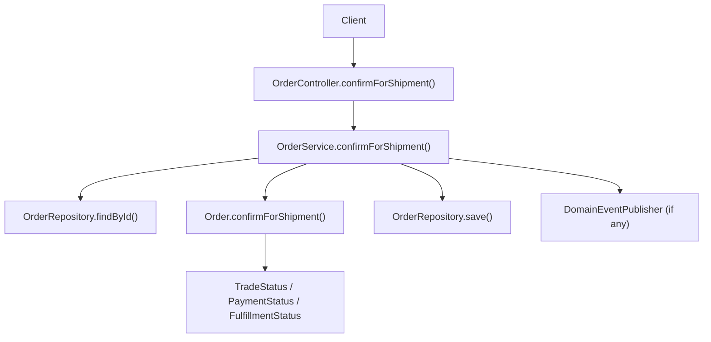
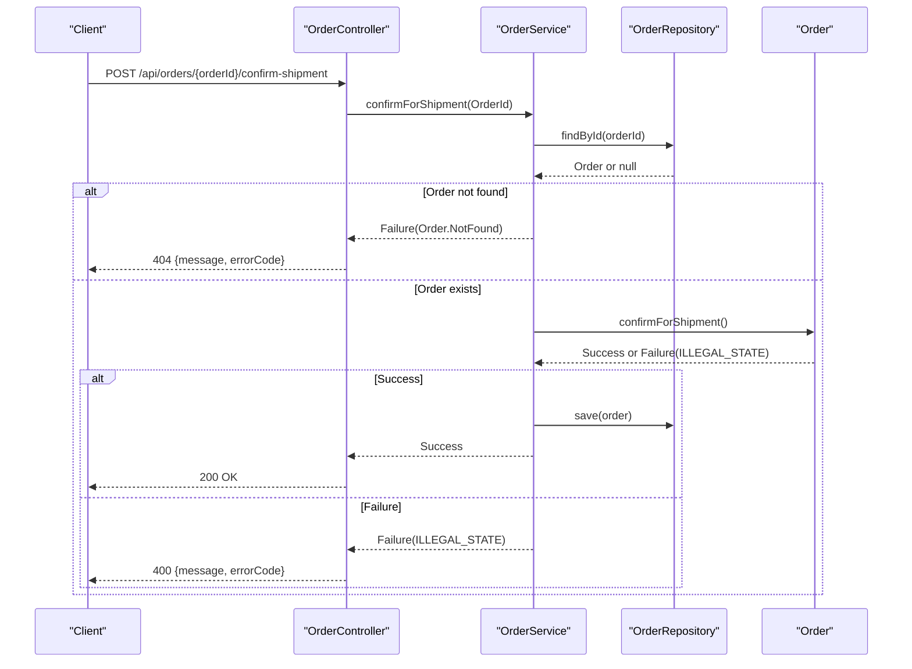
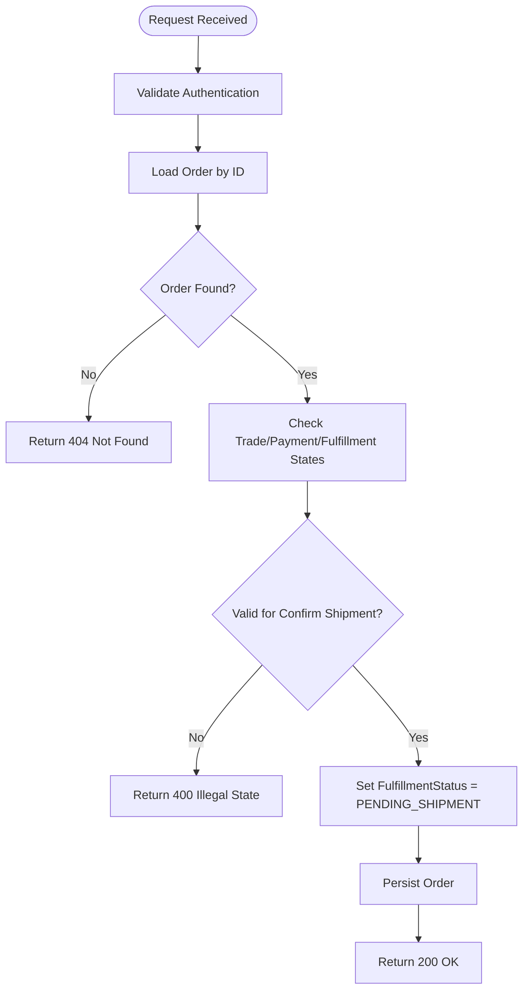
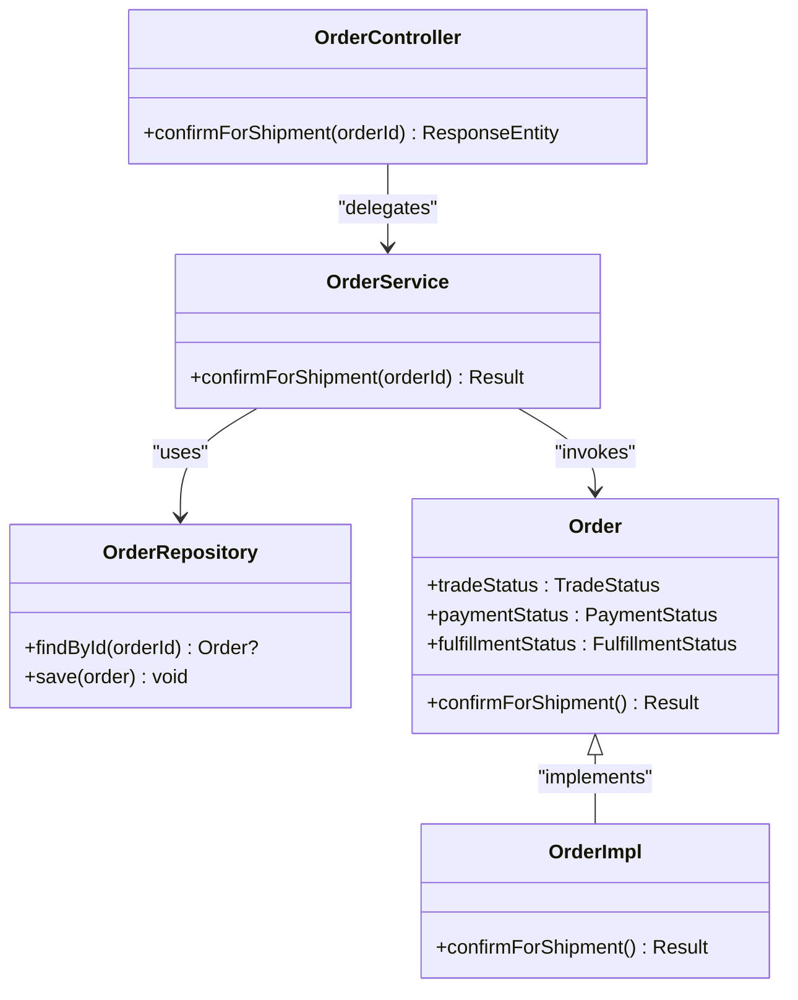

# Order Shipment Confirmation API

<cite>
**Referenced Files in This Document**
- [OrderController.kt](file://j-store-boot/src/main/kotlin/com/jstore/order/controller/OrderController.kt)
- [OrderService.kt](file://j-store-order/src/main/kotlin/com/jstore/order/service/OrderService.kt)
- [Order.kt](file://j-store-order/src/main/kotlin/com/jstore/order/domain/order/Order.kt)
- [OrderImpl.kt](file://j-store-order/src/main/kotlin/com/jstore/order/domain/order/OrderImpl.kt)
- [FulfillmentStatus.kt](file://j-store-order/src/main/kotlin/com/jstore/order/domain/order/FulfillmentStatus.kt)
- [PaymentStatus.kt](file://j-store-order/src/main/kotlin/com/jstore/order/domain/order/PaymentStatus.kt)
- [TradeStatus.kt](file://j-store-order/src/main/kotlin/com/jstore/order/domain/order/TradeStatus.kt)
- [OrderErrors.kt](file://j-store-order/src/main/kotlin/com/jstore/order/domain/order/OrderErrors.kt)
</cite>

## Table of Contents
1. [Introduction](#introduction)
2. [Project Structure](#project-structure)
3. [Core Components](#core-components)
4. [Architecture Overview](#architecture-overview)
5. [Detailed Component Analysis](#detailed-component-analysis)
6. [Dependency Analysis](#dependency-analysis)
7. [Performance Considerations](#performance-considerations)
8. [Troubleshooting Guide](#troubleshooting-guide)
9. [Conclusion](#conclusion)

## Introduction
This document provides detailed API documentation for the shipment confirmation endpoint: POST /api/orders/{orderId}/confirm-shipment. It explains how a seller or merchant confirms that an order has been prepared for shipment, the state transitions involved, and the business constraints that must be satisfied before the operation is allowed. It also includes examples of successful responses and common error scenarios.

## Project Structure
The shipment confirmation feature spans three layers:
- Controller layer exposes the HTTP endpoint and maps it to the application service.
- Application service orchestrates loading the order aggregate, invoking domain behavior, and persisting changes.
- Domain layer enforces business rules and state transitions on the Order aggregate.

**Diagram sources**
- [OrderController.kt:175-180](file://j-store-boot/src/main/kotlin/com/jstore/order/controller/OrderController.kt#L175-L180)
- [OrderService.kt:83-90](file://j-store-order/src/main/kotlin/com/jstore/order/service/OrderService.kt#L83-L90)
- [Order.kt:51-52](file://j-store-order/src/main/kotlin/com/jstore/order/domain/order/Order.kt#L51-L52)
- [OrderImpl.kt:42](file://j-store-order/src/main/kotlin/com/jstore/order/domain/order/OrderImpl.kt#L42)
- [FulfillmentStatus.kt:1-4](file://j-store-order/src/main/kotlin/com/jstore/order/domain/order/FulfillmentStatus.kt#L1-L4)
- [PaymentStatus.kt:1-4](file://j-store-order/src/main/kotlin/com/jstore/order/domain/order/PaymentStatus.kt#L1-L4)
- [TradeStatus.kt:1-4](file://j-store-order/src/main/kotlin/com/jstore/order/domain/order/TradeStatus.kt#L1-L4)

**Section sources**
- [OrderController.kt:175-180](file://j-store-boot/src/main/kotlin/com/jstore/order/controller/OrderController.kt#L175-L180)
- [OrderService.kt:83-90](file://j-store-order/src/main/kotlin/com/jstore/order/service/OrderService.kt#L83-L90)

## Core Components
- Endpoint: POST /api/orders/{orderId}/confirm-shipment
  - Purpose: Seller/merchant confirms that the order is prepared for shipment.
  - Authentication: Requires login; no request body is needed.
  - Path parameter: orderId (Long)
  - Success response: Empty body with HTTP 200 OK
  - Error response: JSON object with message and errorCode; HTTP status reflects the error code

- Application Service: OrderService.confirmForShipment(orderId)
  - Loads the order by ID
  - Invokes domain method confirmForShipment()
  - Persists the updated order
  - Returns Result<Unit, BusinessError>

- Domain Aggregate: Order.confirmForShipment()
  - Validates current states across TradeStatus, PaymentStatus, and FulfillmentStatus
  - Transitions fulfillment status from UNFULFILLED to PENDING_SHIPMENT when valid
  - Updates update time and returns success or failure

**Section sources**
- [OrderController.kt:175-180](file://j-store-boot/src/main/kotlin/com/jstore/order/controller/OrderController.kt#L175-L180)
- [OrderService.kt:83-90](file://j-store-order/src/main/kotlin/com/jstore/order/service/OrderService.kt#L83-L90)
- [Order.kt:51-52](file://j-store-order/src/main/kotlin/com/jstore/order/domain/order/Order.kt#L51-L52)
- [OrderImpl.kt:42](file://j-store-order/src/main/kotlin/com/jstore/order/domain/order/OrderImpl.kt#L42)

## Architecture Overview
The endpoint follows a layered architecture:
- HTTP controller receives the request and delegates to the application service.
- Application service coordinates persistence and domain logic.
- Domain aggregate enforces state machine rules and updates internal state.

**Diagram sources**
- [OrderController.kt:175-180](file://j-store-boot/src/main/kotlin/com/jstore/order/controller/OrderController.kt#L175-L180)
- [OrderService.kt:83-90](file://j-store-order/src/main/kotlin/com/jstore/order/service/OrderService.kt#L83-L90)
- [OrderImpl.kt:42](file://j-store-order/src/main/kotlin/com/jstore/order/domain/order/OrderImpl.kt#L42)
- [OrderErrors.kt:6-8](file://j-store-order/src/main/kotlin/com/jstore/order/domain/order/OrderErrors.kt#L6-L8)

## Detailed Component Analysis

### API Definition
- Method: POST
- Path: /api/orders/{orderId}/confirm-shipment
- Headers: Authorization (Bearer token) required by @RequireLogin
- Path Parameters:
  - orderId: Long — unique identifier of the order
- Request Body: None
- Success Response:
  - Status: 200 OK
  - Body: Empty
- Error Responses:
  - 404 Not Found: Order does not exist
  - 400 Bad Request: Illegal state transition (e.g., payment not completed, already shipped)
  - 401 Unauthorized: Missing or invalid authentication
- Response Format for Errors:
  - { "message": "...", "errorCode": "..." }

**Section sources**
- [OrderController.kt:175-180](file://j-store-boot/src/main/kotlin/com/jstore/order/controller/OrderController.kt#L175-L180)
- [OrderErrors.kt:6-8](file://j-store-order/src/main/kotlin/com/jstore/order/domain/order/OrderErrors.kt#L6-L8)

### Business Rules and Validation
Before confirming shipment, the following conditions must hold:
- TradeStatus must be ACTIVE
- PaymentStatus must be PAID
- FulfillmentStatus must be UNFULFILLED

If any condition fails, the operation is rejected with ILLEGAL_STATE.

State Transition:
- From: TradeStatus.ACTIVE, PaymentStatus.PAID, FulfillmentStatus.UNFULFILLED
- To: FulfillmentStatus.PENDING_SHIPMENT

No domain events are published during this transition.

**Section sources**
- [OrderImpl.kt:42](file://j-store-order/src/main/kotlin/com/jstore/order/domain/order/OrderImpl.kt#L42)
- [FulfillmentStatus.kt:1-4](file://j-store-order/src/main/kotlin/com/jstore/order/domain/order/FulfillmentStatus.kt#L1-L4)
- [PaymentStatus.kt:1-4](file://j-store-order/src/main/kotlin/com/jstore/order/domain/order/PaymentStatus.kt#L1-L4)
- [TradeStatus.kt:1-4](file://j-store-order/src/main/kotlin/com/jstore/order/domain/order/TradeStatus.kt#L1-L4)

### End-to-End Flow

**Diagram sources**
- [OrderController.kt:175-180](file://j-store-boot/src/main/kotlin/com/jstore/order/controller/OrderController.kt#L175-L180)
- [OrderService.kt:83-90](file://j-store-order/src/main/kotlin/com/jstore/order/service/OrderService.kt#L83-L90)
- [OrderImpl.kt:42](file://j-store-order/src/main/kotlin/com/jstore/order/domain/order/OrderImpl.kt#L42)

### Example Scenarios
- Successful confirmation:
  - Preconditions: Order exists, TradeStatus=ACTIVE, PaymentStatus=PAID, FulfillmentStatus=UNFULFILLED
  - Action: POST /api/orders/{orderId}/confirm-shipment
  - Result: 200 OK, empty body; order fulfillment status becomes PENDING_SHIPMENT

- Error: Order not found
  - Condition: orderId does not correspond to any order
  - Result: 404 Not Found with error code Order.NotFound

- Error: Illegal state transition
  - Conditions include:
    - PaymentStatus != PAID
    - FulfillmentStatus != UNFULFILLED
    - TradeStatus != ACTIVE
  - Result: 400 Bad Request with error code Order.State.Invalid

**Section sources**
- [OrderController.kt:175-180](file://j-store-boot/src/main/kotlin/com/jstore/order/controller/OrderController.kt#L175-L180)
- [OrderService.kt:83-90](file://j-store-order/src/main/kotlin/com/jstore/order/service/OrderService.kt#L83-L90)
- [OrderImpl.kt:42](file://j-store-order/src/main/kotlin/com/jstore/order/domain/order/OrderImpl.kt#L42)
- [OrderErrors.kt:6-8](file://j-store-order/src/main/kotlin/com/jstore/order/domain/order/OrderErrors.kt#L6-L8)

## Dependency Analysis
The endpoint depends on:
- Authentication framework (@RequireLogin)
- Spring MVC for REST endpoints
- OrderService for orchestration
- OrderRepository for persistence
- Order aggregate for business rules

**Diagram sources**
- [OrderController.kt:175-180](file://j-store-boot/src/main/kotlin/com/jstore/order/controller/OrderController.kt#L175-L180)
- [OrderService.kt:83-90](file://j-store-order/src/main/kotlin/com/jstore/order/service/OrderService.kt#L83-L90)
- [Order.kt:51-52](file://j-store-order/src/main/kotlin/com/jstore/order/domain/order/Order.kt#L51-L52)
- [OrderImpl.kt:42](file://j-store-order/src/main/kotlin/com/jstore/order/domain/order/OrderImpl.kt#L42)

**Section sources**
- [OrderController.kt:175-180](file://j-store-boot/src/main/kotlin/com/jstore/order/controller/OrderController.kt#L175-L180)
- [OrderService.kt:83-90](file://j-store-order/src/main/kotlin/com/jstore/order/service/OrderService.kt#L83-L90)

## Performance Considerations
- The operation performs a single read and write to the repository.
- No heavy external calls are made within the flow.
- Ensure database indexes on orderId for fast retrieval.
- Avoid unnecessary logging or serialization overhead in hot paths.

[No sources needed since this section provides general guidance]

## Troubleshooting Guide
Common errors and resolutions:
- 404 Not Found (Order.NotFound): Verify the orderId exists and is accessible to the caller.
- 400 Bad Request (Order.State.Invalid): Ensure the order is paid and not yet prepared for shipment. Check current statuses:
  - TradeStatus should be ACTIVE
  - PaymentStatus should be PAID
  - FulfillmentStatus should be UNFULFILLED
- 401 Unauthorized: Provide a valid authentication token.

**Section sources**
- [OrderErrors.kt:6-8](file://j-store-order/src/main/kotlin/com/jstore/order/domain/order/OrderErrors.kt#L6-L8)

## Conclusion
The POST /api/orders/{orderId}/confirm-shipment endpoint enables sellers or merchants to mark an order as prepared for shipment. It enforces strict state validation to ensure orders are only confirmed when fully paid and unfulfilled. Successful calls transition the fulfillment status to PENDING_SHIPMENT, allowing subsequent shipping operations. Proper error handling ensures clear feedback for invalid states or missing resources.