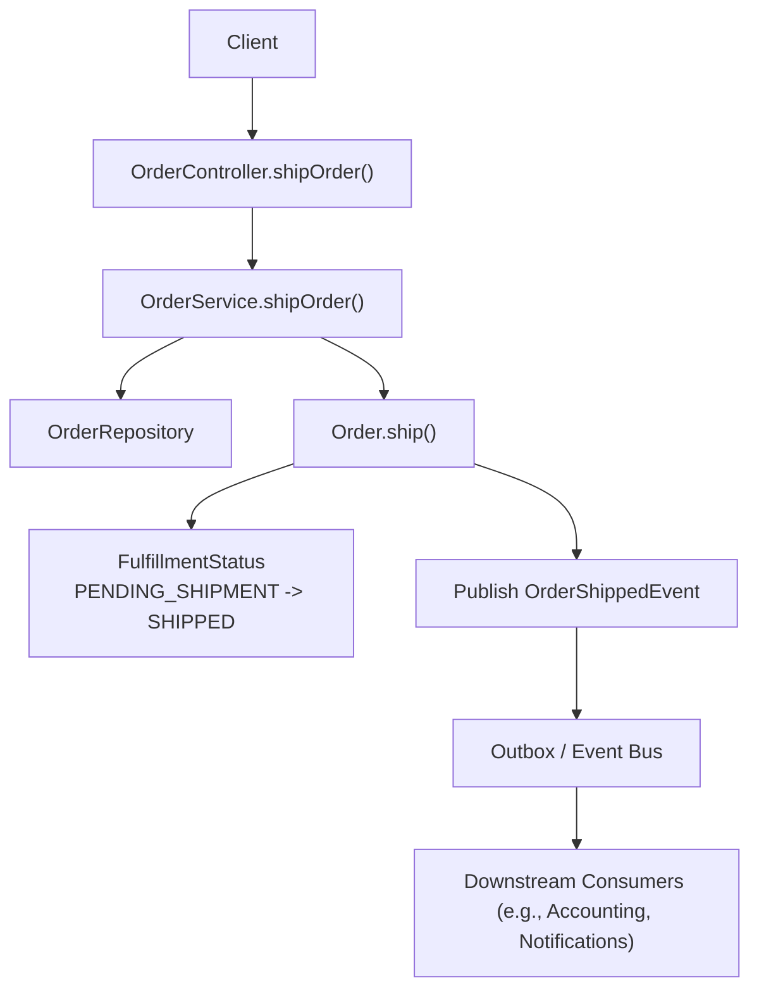
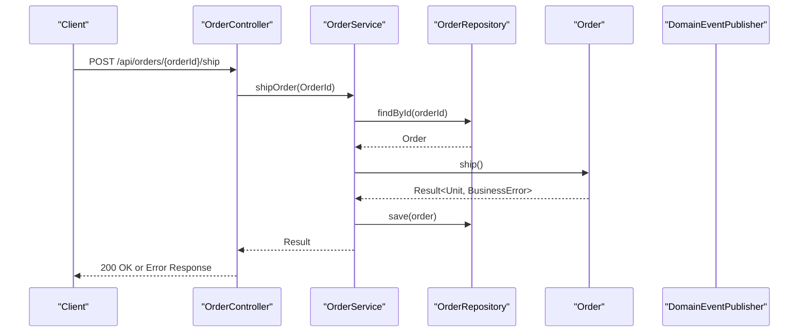
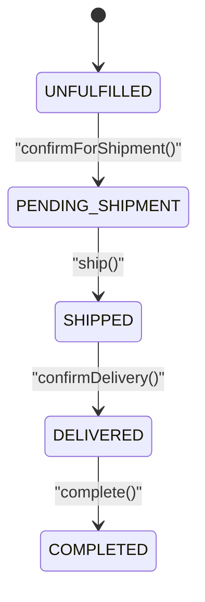
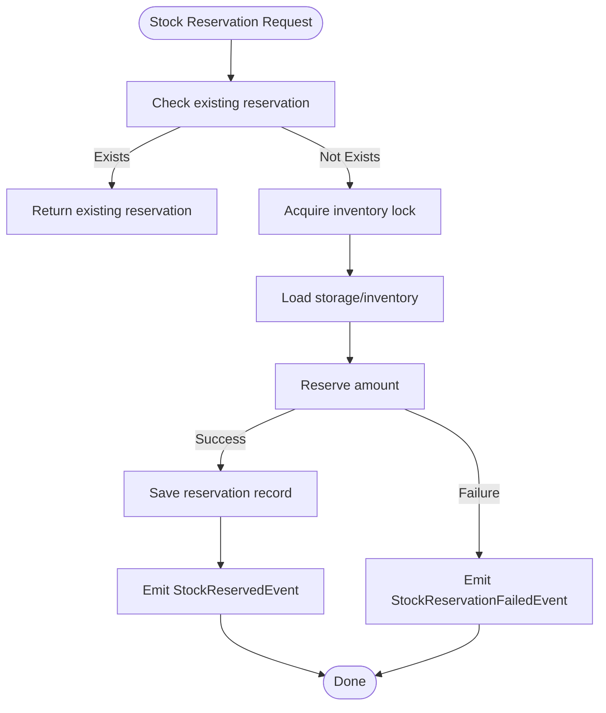
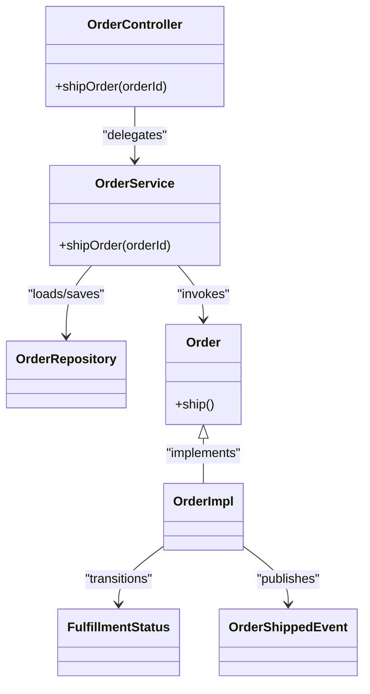

# Order Shipping API

<cite>
**Referenced Files in This Document**
- [OrderController.kt](file://j-store-boot/src/main/kotlin/com/jstore/order/controller/OrderController.kt)
- [OrderService.kt](file://j-store-order/src/main/kotlin/com/jstore/order/service/OrderService.kt)
- [Order.kt](file://j-store-order/src/main/kotlin/com/jstore/order/domain/order/Order.kt)
- [OrderImpl.kt](file://j-store-order/src/main/kotlin/com/jstore/order/domain/order/OrderImpl.kt)
- [FulfillmentStatus.kt](file://j-store-order/src/main/kotlin/com/jstore/order/domain/order/FulfillmentStatus.kt)
- [OrderErrors.kt](file://j-store-order/src/main/kotlin/com/jstore/order/domain/order/OrderErrors.kt)
- [OrderDomainEvent.kt](file://j-store-order/src/main/kotlin/com/jstore/order/domain/order/event/OrderDomainEvent.kt)
- [InventoryService.kt](file://j-store-goods/src/main/kotlin/com/jstore/goods/service/InventoryService.kt)
- [InventoryEventHandler.kt](file://j-store-goods/src/main/kotlin/com/jstore/goods/service/InventoryEventHandler.kt)
</cite>

## Table of Contents
1. [Introduction](#introduction)
2. [Project Structure](#project-structure)
3. [Core Components](#core-components)
4. [Architecture Overview](#architecture-overview)
5. [Detailed Component Analysis](#detailed-component-analysis)
6. [Dependency Analysis](#dependency-analysis)
7. [Performance Considerations](#performance-considerations)
8. [Troubleshooting Guide](#troubleshooting-guide)
9. [Conclusion](#conclusion)

## Introduction
This document provides detailed API documentation for the order shipping endpoint POST /api/orders/{orderId}/ship. It explains how an order is marked as shipped, the associated state transitions in the fulfillment workflow, business rules that govern when shipping is permitted, and integration points with inventory management and shipping providers. It also includes examples of successful operations and error handling for invalid states or insufficient inventory.

## Project Structure
The shipping operation flows through a layered architecture:
- Controller layer exposes the HTTP endpoint.
- Application service orchestrates loading the aggregate, invoking domain behavior, and persisting changes.
- Domain layer enforces business rules and state transitions on the Order aggregate.
- Infrastructure and event-driven integrations handle side effects such as inventory confirmations and downstream notifications.

**Diagram sources**
- [OrderController.kt:182-187](file://j-store-boot/src/main/kotlin/com/jstore/order/controller/OrderController.kt#L182-L187)
- [OrderService.kt:92-99](file://j-store-order/src/main/kotlin/com/jstore/order/service/OrderService.kt#L92-L99)
- [OrderImpl.kt:43](file://j-store-order/src/main/kotlin/com/jstore/order/domain/order/OrderImpl.kt#L43)
- [FulfillmentStatus.kt:1-3](file://j-store-order/src/main/kotlin/com/jstore/order/domain/order/FulfillmentStatus.kt#L1-L3)
- [OrderDomainEvent.kt:12-14](file://j-store-order/src/main/kotlin/com/jstore/order/domain/order/event/OrderDomainEvent.kt#L12-L14)

**Section sources**
- [OrderController.kt:182-187](file://j-store-boot/src/main/kotlin/com/jstore/order/controller/OrderController.kt#L182-L187)
- [OrderService.kt:92-99](file://j-store-order/src/main/kotlin/com/jstore/order/service/OrderService.kt#L92-L99)

## Core Components
- OrderController.shipOrder: Maps the HTTP request to a command and delegates to OrderService.
- OrderService.shipOrder: Loads the Order by ID, invokes domain ship(), persists changes, and returns success or error.
- Order.ship(): Enforces preconditions and transitions FulfillmentStatus from PENDING_SHIPMENT to SHIPPED; updates item statuses and publishes OrderShippedEvent.
- FulfillmentStatus: Enumerates UNFULFILLED, PENDING_SHIPMENT, SHIPPED, DELIVERED.
- OrderErrors: Defines error codes and HTTP status mappings used throughout the flow.

Key responsibilities:
- Controller: Request/response mapping and authentication gating.
- Service: Orchestration and persistence.
- Domain: Business rules and state transitions.

**Section sources**
- [OrderController.kt:182-187](file://j-store-boot/src/main/kotlin/com/jstore/order/controller/OrderController.kt#L182-L187)
- [OrderService.kt:92-99](file://j-store-order/src/main/kotlin/com/jstore/order/service/OrderService.kt#L92-L99)
- [Order.kt:54-55](file://j-store-order/src/main/kotlin/com/jstore/order/domain/order/Order.kt#L54-L55)
- [OrderImpl.kt:43](file://j-store-order/src/main/kotlin/com/jstore/order/domain/order/OrderImpl.kt#L43)
- [FulfillmentStatus.kt:1-3](file://j-store-order/src/main/kotlin/com/jstore/order/domain/order/FulfillmentStatus.kt#L1-L3)
- [OrderErrors.kt:1-24](file://j-store-order/src/main/kotlin/com/jstore/order/domain/order/OrderErrors.kt#L1-L24)

## Architecture Overview
The shipping endpoint follows a clear sequence:
1. The client calls POST /api/orders/{orderId}/ship.
2. OrderController validates the path and delegates to OrderService.
3. OrderService loads the Order via repository and calls Order.ship().
4. Order.ship() validates state and transitions FulfillmentStatus to SHIPPED, updates items, and publishes OrderShippedEvent.
5. Changes are persisted; events are emitted for downstream consumers.

**Diagram sources**
- [OrderController.kt:182-187](file://j-store-boot/src/main/kotlin/com/jstore/order/controller/OrderController.kt#L182-L187)
- [OrderService.kt:92-99](file://j-store-order/src/main/kotlin/com/jstore/order/service/OrderService.kt#L92-L99)
- [OrderImpl.kt:43](file://j-store-order/src/main/kotlin/com/jstore/order/domain/order/OrderImpl.kt#L43)

## Detailed Component Analysis

### API Endpoint: POST /api/orders/{orderId}/ship
- Path: /api/orders/{orderId}/ship
- Method: POST
- Authentication: Requires login (controller-level guard).
- Request body: None.
- Success response: 200 OK with empty body or minimal acknowledgment.
- Error responses:
  - 404 Not Found if order does not exist.
  - 400 Bad Request if state transition is illegal (e.g., order not in PENDING_SHIPMENT).
  - Other errors mapped from BusinessError.httpCode.

Behavior:
- Controller maps orderId to OrderId and calls OrderService.shipOrder.
- Service loads order, invokes domain ship(), persists result, and returns.

**Section sources**
- [OrderController.kt:182-187](file://j-store-boot/src/main/kotlin/com/jstore/order/controller/OrderController.kt#L182-L187)
- [OrderService.kt:92-99](file://j-store-order/src/main/kotlin/com/jstore/order/service/OrderService.kt#L92-L99)

### Domain Logic: Order.ship()
Preconditions enforced by Order.ship():
- TradeStatus must be ACTIVE.
- PaymentStatus must be PAID.
- FulfillmentStatus must be PENDING_SHIPMENT.

On success:
- FulfillmentStatus transitions to SHIPPED.
- All order items transition to SHIPPING status.
- OrderShippedEvent is published.

State transitions:
- FulfillmentStatus: PENDING_SHIPMENT → SHIPPED.
- Item statuses updated accordingly.

Business rule summary:
- Shipping is only allowed after payment confirmation and explicit preparation for shipment.

**Section sources**
- [OrderImpl.kt:43](file://j-store-order/src/main/kotlin/com/jstore/order/domain/order/OrderImpl.kt#L43)
- [FulfillmentStatus.kt:1-3](file://j-store-order/src/main/kotlin/com/jstore/order/domain/order/FulfillmentStatus.kt#L1-L3)
- [OrderDomainEvent.kt:12-14](file://j-store-order/src/main/kotlin/com/jstore/order/domain/order/event/OrderDomainEvent.kt#L12-L14)

### Fulfillment Workflow and State Machine

Notes:
- Ship can only be invoked from PENDING_SHIPMENT.
- Confirm delivery requires SHIPPED.
- Completion requires DELIVERED.

**Diagram sources**
- [FulfillmentStatus.kt:1-3](file://j-store-order/src/main/kotlin/com/jstore/order/domain/order/FulfillmentStatus.kt#L1-L3)
- [OrderImpl.kt:42-45](file://j-store-order/src/main/kotlin/com/jstore/order/domain/order/OrderImpl.kt#L42-L45)

### Inventory Integration
While the ship endpoint itself focuses on order state transitions, inventory integration typically occurs earlier in the order lifecycle:
- Stock reservation is requested via events (e.g., StockReservationRequestedEvent).
- InventoryService.reserve handles locking, deduction, and reservation records.
- On insufficient stock, events like StockReservationFailedEvent may be emitted, leading to order cancellation or other compensating actions.

Integration points relevant to shipping:
- Ensure stock reservations are confirmed before confirmForShipment.
- If reservations fail, orders should be canceled or remain unpaid per policy.

**Diagram sources**
- [InventoryService.kt:37-65](file://j-store-goods/src/main/kotlin/com/jstore/goods/service/InventoryService.kt#L37-L65)
- [InventoryEventHandler.kt:18-35](file://j-store-goods/src/main/kotlin/com/jstore/goods/service/InventoryEventHandler.kt#L18-L35)

**Section sources**
- [InventoryService.kt:37-65](file://j-store-goods/src/main/kotlin/com/jstore/goods/service/InventoryService.kt#L37-L65)
- [InventoryEventHandler.kt:18-35](file://j-store-goods/src/main/kotlin/com/jstore/goods/service/InventoryEventHandler.kt#L18-L35)

### Shipping Provider Integration
The current implementation emits OrderShippedEvent upon successful shipping. A typical integration pattern would involve:
- A consumer listening to OrderShippedEvent.
- Creating a shipment with a third-party shipping provider.
- Updating tracking information back into the system via subsequent events or commands.

Note: No direct shipping provider code is present in the analyzed files; integration is expected via event consumers.

[No sources needed since this section describes conceptual integration patterns without analyzing specific files]

## Dependency Analysis
- OrderController depends on OrderService for business orchestration.
- OrderService depends on OrderRepository and DomainEventPublisher.
- OrderImpl encapsulates business rules and state transitions.
- Events are decoupled via DomainEventPublisher, enabling integration with accounting, notifications, and shipping providers.

**Diagram sources**
- [OrderController.kt:182-187](file://j-store-boot/src/main/kotlin/com/jstore/order/controller/OrderController.kt#L182-L187)
- [OrderService.kt:92-99](file://j-store-order/src/main/kotlin/com/jstore/order/service/OrderService.kt#L92-L99)
- [Order.kt:54-55](file://j-store-order/src/main/kotlin/com/jstore/order/domain/order/Order.kt#L54-L55)
- [OrderImpl.kt:43](file://j-store-order/src/main/kotlin/com/jstore/order/domain/order/OrderImpl.kt#L43)
- [FulfillmentStatus.kt:1-3](file://j-store-order/src/main/kotlin/com/jstore/order/domain/order/FulfillmentStatus.kt#L1-L3)
- [OrderDomainEvent.kt:12-14](file://j-store-order/src/main/kotlin/com/jstore/order/domain/order/event/OrderDomainEvent.kt#L12-L14)

**Section sources**
- [OrderController.kt:182-187](file://j-store-boot/src/main/kotlin/com/jstore/order/controller/OrderController.kt#L182-L187)
- [OrderService.kt:92-99](file://j-store-order/src/main/kotlin/com/jstore/order/service/OrderService.kt#L92-L99)
- [OrderImpl.kt:43](file://j-store-order/src/main/kotlin/com/jstore/order/domain/order/OrderImpl.kt#L43)

## Performance Considerations
- Idempotency: Ensure ship requests are idempotent at the application level to avoid duplicate shipments due to retries.
- Concurrency: Use optimistic concurrency control in repositories to prevent race conditions during save.
- Event processing: Offload heavy tasks (e.g., external shipping provider calls) to async consumers to keep API latency low.
- Database indexing: Ensure orderId indexes support fast lookups in repositories.

[No sources needed since this section provides general guidance]

## Troubleshooting Guide
Common errors and resolutions:
- Order not found (404): Verify orderId exists and is accessible to the caller.
- Illegal state (400): Ensure the order is in PENDING_SHIPMENT and paid before calling ship.
- Insufficient inventory: Address stock reservation failures upstream; cancel or adjust order as needed.
- Event delivery issues: Check outbox and event bus configurations; ensure consumers are running.

Relevant error definitions:
- ORDER_NOT_FOUND: 404
- ILLEGAL_STATE: 400

**Section sources**
- [OrderErrors.kt:1-24](file://j-store-order/src/main/kotlin/com/jstore/order/domain/order/OrderErrors.kt#L1-L24)

## Conclusion
The POST /api/orders/{orderId}/ship endpoint enables marking an order as shipped after payment and preparation for shipment. It enforces strict state transitions within the Order aggregate and emits domain events to decouple downstream processes. Proper integration with inventory management ensures stock availability prior to shipping, while event-driven consumers can handle shipping provider interactions and further workflow steps.