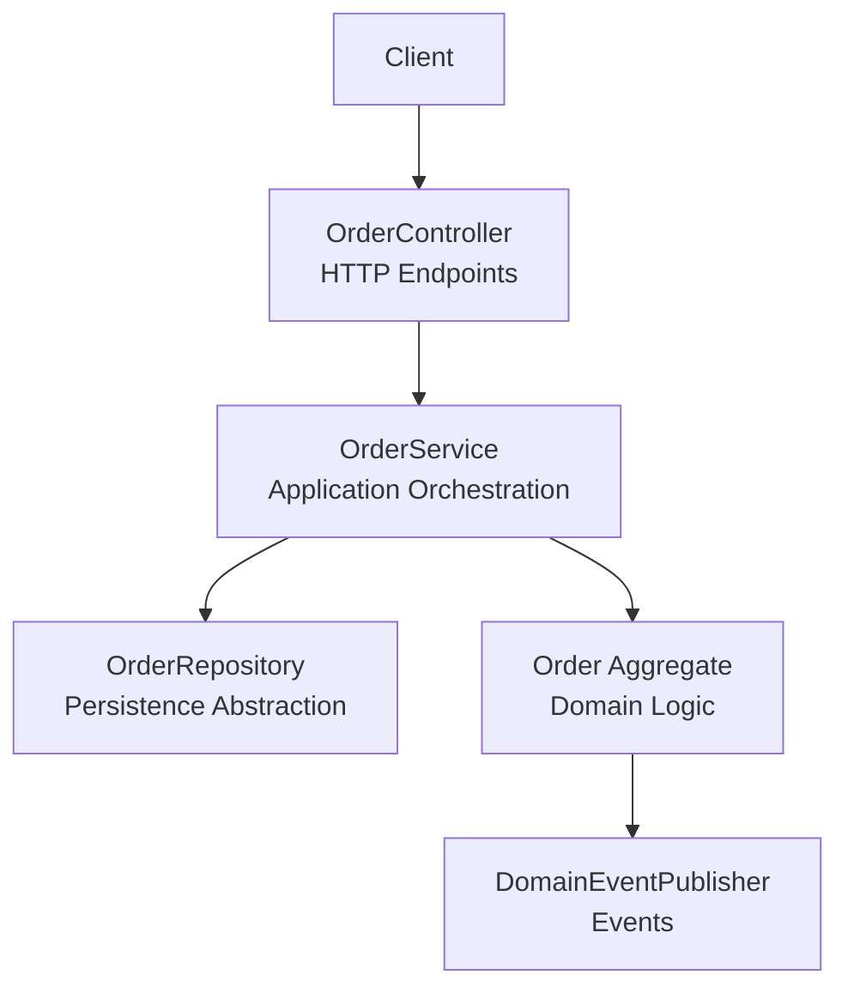
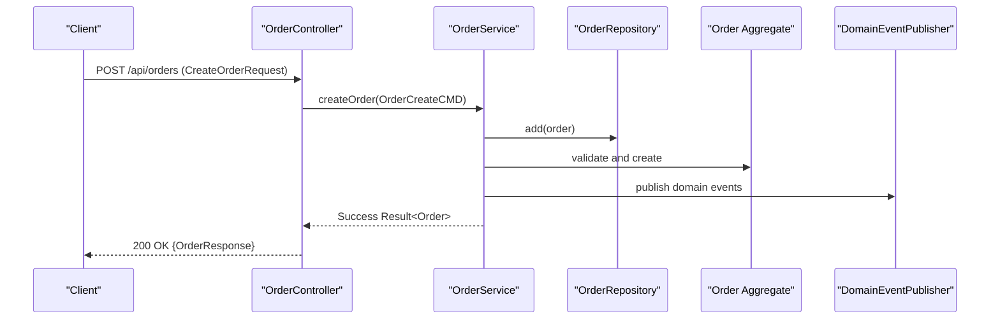
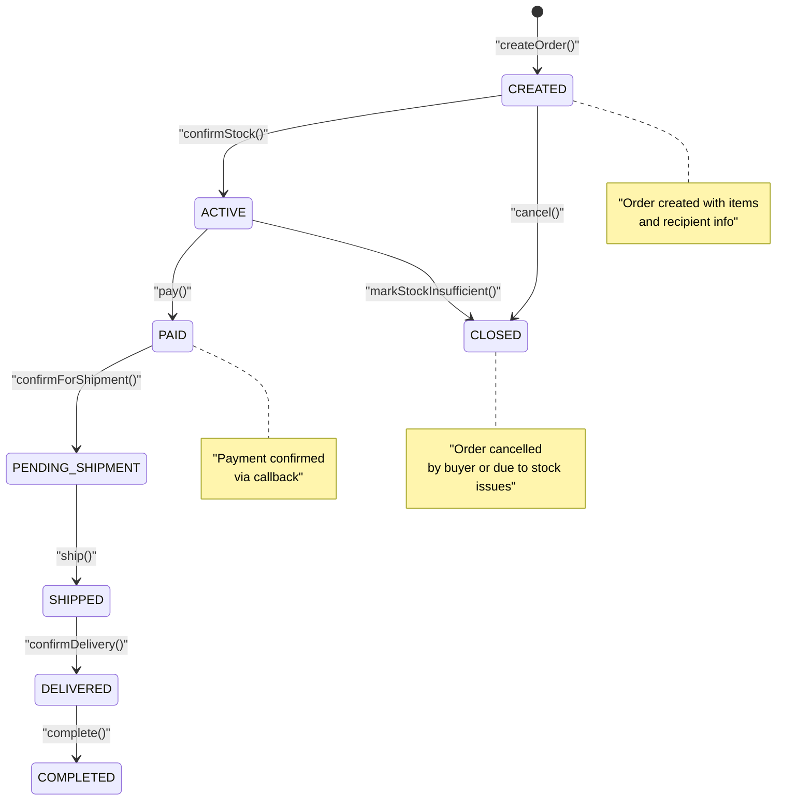
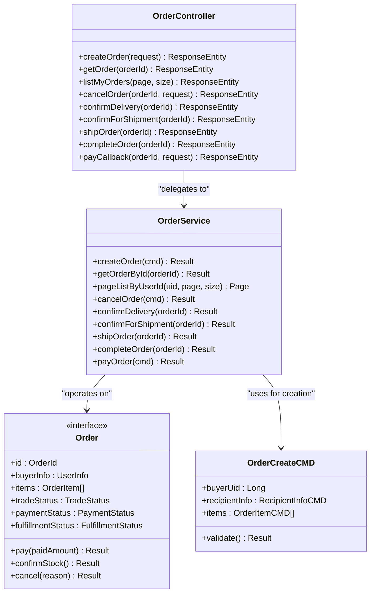

# Order Management API

<cite>
**Referenced Files in This Document**
- [OrderController.kt](file://j-store-boot/src/main/kotlin/com/jstore/order/controller/OrderController.kt)
- [OrderService.kt](file://j-store-order/src/main/kotlin/com/jstore/order/service/OrderService.kt)
- [Order.kt](file://j-store-order/src/main/kotlin/com/jstore/order/domain/order/Order.kt)
- [TradeStatus.kt](file://j-store-order/src/main/kotlin/com/jstore/order/domain/order/TradeStatus.kt)
- [PaymentStatus.kt](file://j-store-order/src/main/kotlin/com/jstore/order/domain/order/PaymentStatus.kt)
- [FulfillmentStatus.kt](file://j-store-order/src/main/kotlin/com/jstore/order/domain/order/FulfillmentStatus.kt)
- [OrderCreateCMD.kt](file://j-store-order/src/main/kotlin/com/jstore/order/domain/order/command/OrderCreateCMD.kt)
- [OrderPayCMD.kt](file://j-store-order/src/main/kotlin/com/jstore/order/domain/order/command/OrderPayCMD.kt)
- [OrderCancelCMD.kt](file://j-store-order/src/main/kotlin/com/jstore/order/domain/order/command/OrderCancelCMD.kt)
- [OrderErrors.kt](file://j-store-order/src/main/kotlin/com/jstore/order/domain/order/OrderErrors.kt)
</cite>

## Table of Contents
1. [Introduction](#introduction)
2. [Project Structure](#project-structure)
3. [Core Components](#core-components)
4. [Architecture Overview](#architecture-overview)
5. [Detailed Component Analysis](#detailed-component-analysis)
6. [Dependency Analysis](#dependency-analysis)
7. [Performance Considerations](#performance-considerations)
8. [Troubleshooting Guide](#troubleshooting-guide)
9. [Conclusion](#conclusion)

## Introduction
This document provides comprehensive API documentation for the Order Management endpoints exposed by the system. It covers HTTP methods, URL patterns, request/response schemas, authentication requirements, and order lifecycle operations including creation, payment processing, status tracking, and cancellation. It also includes error handling strategies and client implementation guidelines for common use cases such as placing orders, confirming payments, and canceling orders.

## Project Structure
The Order Management API is implemented as a Spring REST controller that delegates to an application service, which orchestrates domain logic via an order aggregate and repository. The key files are:
- Controller: defines HTTP endpoints and DTOs
- Service: orchestrates commands and domain operations
- Domain: models order state, statuses, and commands

**Diagram sources**
- [OrderController.kt:17-256](file://j-store-boot/src/main/kotlin/com/jstore/order/controller/OrderController.kt#L17-L256)
- [OrderService.kt:25-131](file://j-store-order/src/main/kotlin/com/jstore/order/service/OrderService.kt#L25-L131)
- [Order.kt:12-69](file://j-store-order/src/main/kotlin/com/jstore/order/domain/order/Order.kt#L12-L69)

**Section sources**
- [OrderController.kt:17-256](file://j-store-boot/src/main/kotlin/com/jstore/order/controller/OrderController.kt#L17-L256)
- [OrderService.kt:25-131](file://j-store-order/src/main/kotlin/com/jstore/order/service/OrderService.kt#L25-L131)

## Core Components
- OrderController: Exposes REST endpoints under /api/orders with authentication enforced at the class level.
- OrderService: Orchestrates order lifecycle operations using commands and domain aggregates.
- Order Aggregate: Encapsulates business rules for trade, payment, and fulfillment states.
- Commands: Typed payloads for create, pay, and cancel operations with validation.
- Errors: Centralized error definitions with HTTP codes and machine-readable error codes.

Key responsibilities:
- Input validation and mapping from HTTP requests to domain commands
- State transitions and persistence via repository
- Publishing domain events after successful operations
- Returning standardized success/error responses

**Section sources**
- [OrderController.kt:17-256](file://j-store-boot/src/main/kotlin/com/jstore/order/controller/OrderController.kt#L17-L256)
- [OrderService.kt:25-131](file://j-store-order/src/main/kotlin/com/jstore/order/service/OrderService.kt#L25-L131)
- [Order.kt:12-69](file://j-store-order/src/main/kotlin/com/jstore/order/domain/order/Order.kt#L12-L69)
- [OrderCreateCMD.kt:15-62](file://j-store-order/src/main/kotlin/com/jstore/order/domain/order/command/OrderCreateCMD.kt#L15-L62)
- [OrderPayCMD.kt:14-23](file://j-store-order/src/main/kotlin/com/jstore/order/domain/order/command/OrderPayCMD.kt#L14-L23)
- [OrderCancelCMD.kt:15-27](file://j-store-order/src/main/kotlin/com/jstore/order/domain/order/command/OrderCancelCMD.kt#L15-L27)
- [OrderErrors.kt:5-24](file://j-store-order/src/main/kotlin/com/jstore/order/domain/order/OrderErrors.kt#L5-L24)

## Architecture Overview
The API follows a layered architecture:
- Presentation Layer (Controller): Validates inputs, maps to commands, returns HTTP responses
- Application Layer (Service): Orchestrates workflows, invokes domain logic, persists changes
- Domain Layer (Aggregate): Enforces business rules and state transitions
- Infrastructure Layer (Repository): Persists order data and queries

**Diagram sources**
- [OrderController.kt:96-125](file://j-store-boot/src/main/kotlin/com/jstore/order/controller/OrderController.kt#L96-L125)
- [OrderService.kt:44-50](file://j-store-order/src/main/kotlin/com/jstore/order/service/OrderService.kt#L44-L50)
- [Order.kt:12-69](file://j-store-order/src/main/kotlin/com/jstore/order/domain/order/Order.kt#L12-L69)

## Detailed Component Analysis

### Authentication and Security
- All endpoints require authentication via @RequireLogin annotation at the controller level
- User identity is injected via @CurrentUserId parameter
- Responses include standardized error format with message and errorCode fields

**Section sources**
- [OrderController.kt:17-22](file://j-store-boot/src/main/kotlin/com/jstore/order/controller/OrderController.kt#L17-L22)
- [OrderController.kt:245-254](file://j-store-boot/src/main/kotlin/com/jstore/order/controller/OrderController.kt#L245-L254)

### Order Creation Endpoint
**POST /api/orders**
- Authentication: Required (@RequireLogin)
- Request Body: CreateOrderRequest with recipient information and order items
- Response: OrderResponse with full order details or ErrorResponse on failure

Request Schema:
- recipientInfo: Consignee name, country code, contact phone/email, shipping district code, detailed address
- items: List of order items with spuId, skuId, quantity, and snapshotVersion

Response Schema:
- id, buyerUid, buyerPhone, buyerName, tradeStatus, paymentStatus, fulfillmentStatus
- totalRefundedAmount, totalAmount, actualPay, items array, createTime, updateTime

**Section sources**
- [OrderController.kt:26-45](file://j-store-boot/src/main/kotlin/com/jstore/order/controller/OrderController.kt#L26-L45)
- [OrderController.kt:54-81](file://j-store-boot/src/main/kotlin/com/jstore/order/controller/OrderController.kt#L54-L81)
- [OrderController.kt:96-125](file://j-store-boot/src/main/kotlin/com/jstore/order/controller/OrderController.kt#L96-L125)
- [OrderCreateCMD.kt:15-62](file://j-store-order/src/main/kotlin/com/jstore/order/domain/order/command/OrderCreateCMD.kt#L15-L62)

### Order Query Endpoints
**GET /api/orders/{orderId}**
- Retrieves a specific order by ID
- Returns OrderResponse or error if order not found

**GET /api/orders**
- Lists orders for the current user with pagination
- Parameters: page (default 1), size (default 10)
- Returns PageResponse with records array

**Section sources**
- [OrderController.kt:127-149](file://j-store-boot/src/main/kotlin/com/jstore/order/controller/OrderController.kt#L127-L149)

### Payment Processing Endpoint
**POST /api/orders/{orderId}/pay-callback**
- Internal/system endpoint for payment callbacks
- Request: PayCallbackRequest with paidAmountFen
- Processes payment confirmation and updates order status

**Section sources**
- [OrderController.kt:198-208](file://j-store-boot/src/main/kotlin/com/jstore/order/controller/OrderController.kt#L198-L208)
- [OrderService.kt:72-81](file://j-store-order/src/main/kotlin/com/jstore/order/service/OrderService.kt#L72-L81)
- [OrderPayCMD.kt:14-23](file://j-store-order/src/main/kotlin/com/jstore/order/domain/order/command/OrderPayCMD.kt#L14-L23)

### Order Status Management Endpoints
**POST /api/orders/{orderId}/cancel**
- Buyer-initiated order cancellation
- Requires cancellation category and description

**POST /api/orders/{orderId}/confirm-delivery**
- Customer confirms receipt of goods

**POST /api/orders/{orderId}/confirm-shipment**
- Seller confirms order is ready for shipment

**POST /api/orders/{orderId}/ship**
- Marks order as shipped

**POST /api/orders/{orderId}/complete**
- Completes the order lifecycle

**Section sources**
- [OrderController.kt:151-194](file://j-store-boot/src/main/kotlin/com/jstore/order/controller/OrderController.kt#L151-L194)
- [OrderService.kt:119-128](file://j-store-order/src/main/kotlin/com/jstore/order/service/OrderService.kt#L119-L128)

### Order Lifecycle State Machine

**Diagram sources**
- [Order.kt:42-64](file://j-store-order/src/main/kotlin/com/jstore/order/domain/order/Order.kt#L42-L64)
- [TradeStatus.kt:3](file://j-store-order/src/main/kotlin/com/jstore/order/domain/order/TradeStatus.kt#L3)
- [PaymentStatus.kt:3](file://j-store-order/src/main/kotlin/com/jstore/order/domain/order/PaymentStatus.kt#L3)
- [FulfillmentStatus.kt:3](file://j-store-order/src/main/kotlin/com/jstore/order/domain/order/FulfillmentStatus.kt#L3)

### Error Handling Strategy
All endpoints return standardized error responses with:
- HTTP status code based on error type
- message: Human-readable error description
- errorCode: Machine-readable error code for programmatic handling

Common error scenarios:
- Validation failures: 400 Bad Request
- Resource not found: 404 Not Found
- Business rule violations: 400/409 depending on context
- Payment amount validation: 400 Bad Request

**Section sources**
- [OrderController.kt:245-254](file://j-store-boot/src/main/kotlin/com/jstore/order/controller/OrderController.kt#L245-L254)
- [OrderErrors.kt:5-24](file://j-store-order/src/main/kotlin/com/jstore/order/domain/order/OrderErrors.kt#L5-L24)

## Dependency Analysis
The order management system has clear separation of concerns with minimal coupling between layers.

**Diagram sources**
- [OrderController.kt:17-256](file://j-store-boot/src/main/kotlin/com/jstore/order/controller/OrderController.kt#L17-L256)
- [OrderService.kt:25-131](file://j-store-order/src/main/kotlin/com/jstore/order/service/OrderService.kt#L25-L131)
- [Order.kt:12-69](file://j-store-order/src/main/kotlin/com/jstore/order/domain/order/Order.kt#L12-L69)
- [OrderCreateCMD.kt:15-62](file://j-store-order/src/main/kotlin/com/jstore/order/domain/order/command/OrderCreateCMD.kt#L15-L62)

**Section sources**
- [OrderController.kt:17-256](file://j-store-boot/src/main/kotlin/com/jstore/order/controller/OrderController.kt#L17-L256)
- [OrderService.kt:25-131](file://j-store-order/src/main/kotlin/com/jstore/order/service/OrderService.kt#L25-L131)

## Performance Considerations
For optimal performance when implementing the Order Management API:

### Bulk Operations
- Use batch endpoints where available for creating multiple orders
- Implement optimistic concurrency control using snapshotVersion field
- Consider implementing bulk cancellation endpoints for administrative tasks

### Caching Strategies
- Cache frequently accessed order data with appropriate TTL
- Implement read-through caching for order queries
- Use cache invalidation strategies when order status changes
- Consider Redis for session-based order state caching

### Database Optimization
- Implement proper indexing on frequently queried fields (userId, orderId)
- Use pagination for list operations to avoid large result sets
- Consider read replicas for high-volume query operations
- Implement connection pooling for database connections

### API Design Best Practices
- Use efficient JSON serialization/deserialization
- Implement request validation at the controller level
- Return only necessary fields in responses
- Use compression for large payloads

[No sources needed since this section provides general guidance]

## Troubleshooting Guide
Common issues and their resolution strategies:

### Validation Failures
- **Empty Items**: Ensure order contains at least one item
- **Invalid Buyer Information**: Verify buyerUid is positive and valid
- **Missing Contact Info**: Provide either phone number or email for recipient
- **Blank Fields**: Check consignee name and district code are not empty

### Business Rule Violations
- **Invalid State Transitions**: Orders can only transition through valid states
- **Payment Amount Issues**: Ensure payment amount is positive and matches expected value
- **Cancellation Restrictions**: Orders may have restrictions on when they can be canceled

### System Errors
- **Order Not Found**: Verify order ID exists and belongs to current user
- **Resource Not Found**: Check related resources (goods, inventory) exist
- **Snapshot Version Mismatch**: Refresh product data and retry order creation

**Section sources**
- [OrderErrors.kt:5-24](file://j-store-order/src/main/kotlin/com/jstore/order/domain/order/OrderErrors.kt#L5-L24)
- [OrderCreateCMD.kt:54-60](file://j-store-order/src/main/kotlin/com/jstore/order/domain/order/command/OrderCreateCMD.kt#L54-L60)
- [OrderPayCMD.kt:18-21](file://j-store-order/src/main/kotlin/com/jstore/order/domain/order/command/OrderPayCMD.kt#L18-L21)

## Conclusion
The Order Management API provides a comprehensive set of endpoints for managing the complete order lifecycle. The design follows clean architecture principles with clear separation between presentation, application, and domain layers. The API supports all essential order operations including creation, payment processing, status tracking, and cancellation while maintaining robust error handling and validation.

Key benefits of this implementation:
- Strong typing and validation through command objects
- Clear state management with explicit status transitions
- Comprehensive error handling with meaningful error codes
- Extensible architecture supporting future enhancements
- Well-documented API contracts for client integration

The system is designed to scale horizontally and supports both real-time and asynchronous processing patterns through domain events.

[No sources needed since this section summarizes without analyzing specific files]