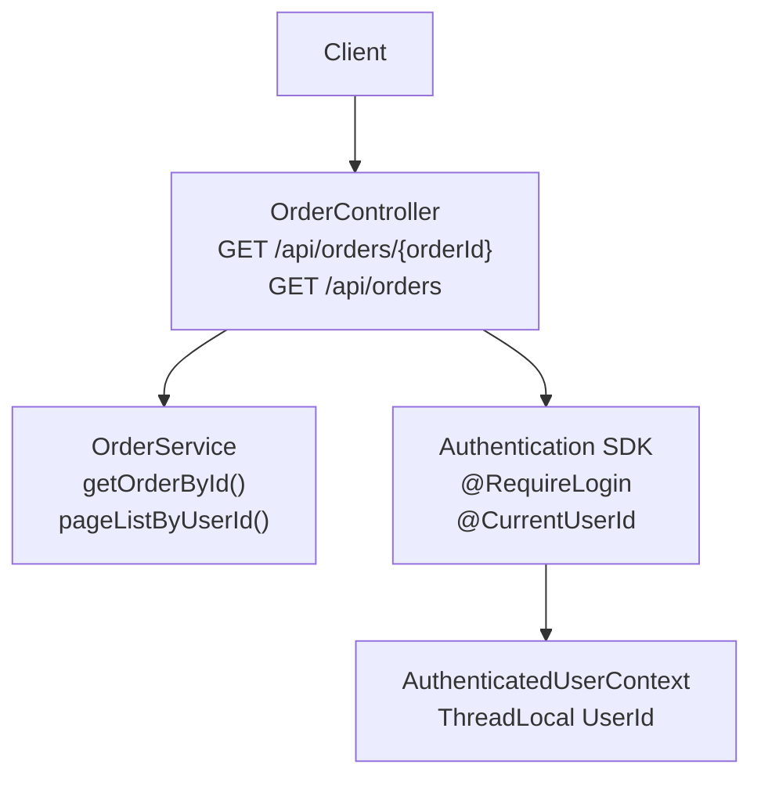
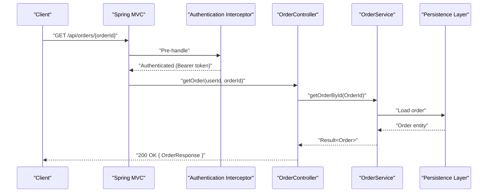
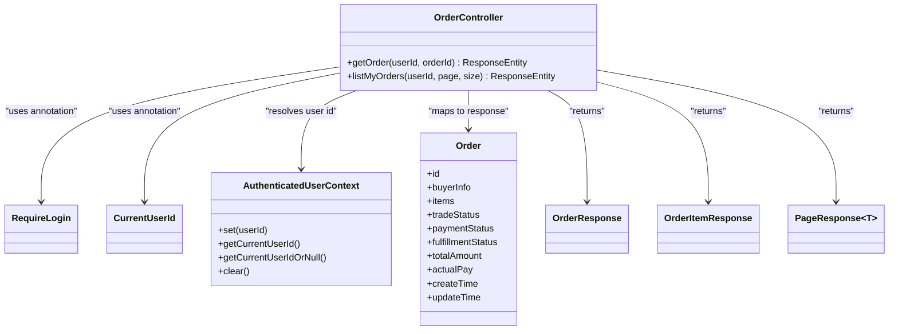

# Order Query API

<cite>
**Referenced Files in This Document**
- [OrderController.kt](file://j-store-boot/src/main/kotlin/com/jstore/order/controller/OrderController.kt)
- [Page.kt](file://j-store-common-core/src/main/kotlin/com/jstore/common/framework/Page.kt)
- [RequireLogin.kt](file://j-store-authentication-spring-sdk/src/main/kotlin/com/jstore/authentication/annotation/RequireLogin.kt)
- [CurrentUserId.kt](file://j-store-authentication-spring-sdk/src/main/kotlin/com/jstore/authentication/annotation/CurrentUserId.kt)
- [AuthenticatedUserContext.kt](file://j-store-authentication-spring-sdk/src/main/kotlin/com/jstore/authentication/context/AuthenticatedUserContext.kt)
- [TradeStatus.kt](file://j-store-order/src/main/kotlin/com/jstore/order/domain/order/TradeStatus.kt)
- [PaymentStatus.kt](file://j-store-order/src/main/kotlin/com/jstore/order/domain/order/PaymentStatus.kt)
- [FulfillmentStatus.kt](file://j-store-order/src/main/kotlin/com/jstore/order/domain/order/FulfillmentStatus.kt)
- [Order.kt](file://j-store-order/src/main/kotlin/com/jstore/order/domain/order/Order.kt)
- [OrderControllerStatusContractTest.kt](file://j-store-boot/src/test/kotlin/com/jstore/order/controller/OrderControllerStatusContractTest.kt)
</cite>

## Table of Contents
1. [Introduction](#introduction)
2. [Project Structure](#project-structure)
3. [Core Components](#core-components)
4. [Architecture Overview](#architecture-overview)
5. [Detailed Component Analysis](#detailed-component-analysis)
6. [Dependency Analysis](#dependency-analysis)
7. [Performance Considerations](#performance-considerations)
8. [Troubleshooting Guide](#troubleshooting-guide)
9. [Conclusion](#conclusion)

## Introduction
This document provides comprehensive API documentation for order query endpoints:
- GET /api/orders/{orderId}: Retrieve details of a specific order by its ID.
- GET /api/orders: List orders belonging to the current user with pagination support.

It also documents the response schemas (OrderResponse and OrderItemResponse), including trade status, payment status, fulfillment status, and item-level details. Pagination parameters page and size are explained along with the PageResponse structure. Authentication requirements using @RequireLogin and current user context via @CurrentUserId are covered.

## Project Structure
The order query endpoints are implemented in the order controller module, which exposes REST endpoints under /api/orders. The authentication SDK provides annotations and runtime mechanisms to enforce login and inject the current user identity into controller methods.

**Diagram sources**
- [OrderController.kt:17-22](file://j-store-boot/src/main/kotlin/com/jstore/order/controller/OrderController.kt#L17-L22)
- [RequireLogin.kt:1-6](file://j-store-authentication-spring-sdk/src/main/kotlin/com/jstore/authentication/annotation/RequireLogin.kt#L1-L6)
- [CurrentUserId.kt:1-6](file://j-store-authentication-spring-sdk/src/main/kotlin/com/jstore/authentication/annotation/CurrentUserId.kt#L1-L6)
- [AuthenticatedUserContext.kt:1-20](file://j-store-authentication-spring-sdk/src/main/kotlin/com/jstore/authentication/context/AuthenticatedUserContext.kt#L1-L20)

**Section sources**
- [OrderController.kt:17-22](file://j-store-boot/src/main/kotlin/com/jstore/order/controller/OrderController.kt#L17-L22)

## Core Components
- OrderController defines the REST endpoints for order queries and maps domain objects to response DTOs.
- OrderResponse and OrderItemResponse define the shape of returned data for single and list responses.
- PageResponse is used for paginated lists.
- Authentication annotations (@RequireLogin, @CurrentUserId) ensure requests are authenticated and provide the current user ID.

Key responsibilities:
- GET /api/orders/{orderId} returns a single OrderResponse.
- GET /api/orders returns a PageResponse<OrderResponse> with fields current, size, records.

**Section sources**
- [OrderController.kt:54-87](file://j-store-boot/src/main/kotlin/com/jstore/order/controller/OrderController.kt#L54-L87)
- [OrderController.kt:127-149](file://j-store-boot/src/main/kotlin/com/jstore/order/controller/OrderController.kt#L127-L149)

## Architecture Overview
The request flow for order queries involves Spring MVC routing to OrderController, authentication enforcement via @RequireLogin, user identity injection via @CurrentUserId, and service calls to retrieve order data. Responses are transformed from domain models to DTOs.

**Diagram sources**
- [OrderController.kt:127-133](file://j-store-boot/src/main/kotlin/com/jstore/order/controller/OrderController.kt#L127-L133)
- [RequireLogin.kt:1-6](file://j-store-authentication-spring-sdk/src/main/kotlin/com/jstore/authentication/annotation/RequireLogin.kt#L1-L6)

## Detailed Component Analysis

### Endpoint: GET /api/orders/{orderId}
- Path: /api/orders/{orderId}
- Method: GET
- Authentication: Requires valid Bearer token; enforced by @RequireLogin at class level.
- User Context: Current user ID injected via @CurrentUserId parameter.
- Path Parameter:
  - orderId: Long — the unique identifier of the order to retrieve.
- Response:
  - On success: HTTP 200 with OrderResponse body.
  - On business error: HTTP status derived from BusinessError with ErrorResponse body.

OrderResponse schema:
- id: Long
- buyerUid: Long
- buyerPhone: String?
- buyerName: String?
- tradeStatus: String — one of CREATED, ACTIVE, CLOSED, COMPLETED
- paymentStatus: String — one of UNPAID, PAID, PARTIALLY_REFUNDED, REFUNDED
- fulfillmentStatus: String — one of UNFULFILLED, PENDING_SHIPMENT, SHIPPED, DELIVERED
- totalRefundedAmount: Long (fen)
- totalAmount: Long (fen)
- actualPay: Long (fen)
- items: List<OrderItemResponse>
- createTime: LocalDateTime
- updateTime: LocalDateTime

OrderItemResponse schema:
- id: Long
- skuId: Long
- spuId: Long
- goodsName: String
- skuDescription: String
- quantity: Int
- unitPrice: Long (fen)
- status: String — item-level status (e.g., CANCELED)
- refundedQuantity: Int
- refundedAmount: Long (fen)

Example response highlights:
- Trade, payment, and fulfillment statuses are exposed as string enums.
- Item list includes per-item pricing, quantities, and refund summaries.
- Timestamps reflect creation and update times.

Notes:
- The endpoint does not expose afterSaleStatus or legacy status fields in the response.
- Amounts are represented in fen (smallest currency unit).

**Section sources**
- [OrderController.kt:127-133](file://j-store-boot/src/main/kotlin/com/jstore/order/controller/OrderController.kt#L127-L133)
- [OrderController.kt:54-81](file://j-store-boot/src/main/kotlin/com/jstore/order/controller/OrderController.kt#L54-L81)
- [TradeStatus.kt:1-4](file://j-store-order/src/main/kotlin/com/jstore/order/domain/order/TradeStatus.kt#L1-L4)
- [PaymentStatus.kt:1-4](file://j-store-order/src/main/kotlin/com/jstore/order/domain/order/PaymentStatus.kt#L1-L4)
- [FulfillmentStatus.kt:1-3](file://j-store-order/src/main/kotlin/com/jstore/order/domain/order/FulfillmentStatus.kt#L1-L3)
- [OrderControllerStatusContractTest.kt:27-70](file://j-store-boot/src/test/kotlin/com/jstore/order/controller/OrderControllerStatusContractTest.kt#L27-L70)

### Endpoint: GET /api/orders
- Path: /api/orders
- Method: GET
- Authentication: Requires valid Bearer token; enforced by @RequireLogin at class level.
- User Context: Current user ID injected via @CurrentUserId parameter.
- Query Parameters:
  - page: Int (default 1) — page number
  - size: Int (default 10) — page size
- Response:
  - On success: HTTP 200 with PageResponse<OrderResponse> body.
  - On business error: HTTP status derived from BusinessError with ErrorResponse body.

PageResponse schema:
- current: Int — current page number
- size: Int — page size
- records: Collection<OrderResponse> — list of order summaries for the current page

Behavior:
- Returns only orders belonging to the authenticated user.
- Each record contains the same fields as OrderResponse.

**Section sources**
- [OrderController.kt:135-149](file://j-store-boot/src/main/kotlin/com/jstore/order/controller/OrderController.kt#L135-L149)
- [OrderController.kt:83-87](file://j-store-boot/src/main/kotlin/com/jstore/order/controller/OrderController.kt#L83-L87)

### Authentication and Current User Context
- @RequireLogin: Applied at the controller class level to require authentication for all endpoints in the controller.
- @CurrentUserId: Used on method parameters to inject the authenticated user’s ID into the handler.
- AuthenticatedUserContext: Thread-local storage that holds the current UserId during request processing.

Flow:
- Request arrives with Authorization: Bearer <token>.
- Authentication interceptor validates token and sets AuthenticatedUserContext.
- HandlerMethodArgumentResolver resolves @CurrentUserId to the UserId from context.
- Controller methods receive userId directly.

**Section sources**
- [OrderController.kt:17-22](file://j-store-boot/src/main/kotlin/com/jstore/order/controller/OrderController.kt#L17-L22)
- [RequireLogin.kt:1-6](file://j-store-authentication-spring-sdk/src/main/kotlin/com/jstore/authentication/annotation/RequireLogin.kt#L1-L6)
- [CurrentUserId.kt:1-6](file://j-store-authentication-spring-sdk/src/main/kotlin/com/jstore/authentication/annotation/CurrentUserId.kt#L1-L6)
- [AuthenticatedUserContext.kt:1-20](file://j-store-authentication-spring-sdk/src/main/kotlin/com/jstore/authentication/context/AuthenticatedUserContext.kt#L1-L20)

### Data Models and Status Enumerations
- Order interface defines core fields including tradeStatus, paymentStatus, fulfillmentStatus, amounts, timestamps, and items.
- Enums define allowed values for statuses:
  - TradeStatus: CREATED, ACTIVE, CLOSED, COMPLETED
  - PaymentStatus: UNPAID, PAID, PARTIALLY_REFUNDED, REFUNDED
  - FulfillmentStatus: UNFULFILLED, PENDING_SHIPMENT, SHIPPED, DELIVERED

These enumerations are serialized as strings in API responses.

**Section sources**
- [Order.kt:24-40](file://j-store-order/src/main/kotlin/com/jstore/order/domain/order/Order.kt#L24-L40)
- [TradeStatus.kt:1-4](file://j-store-order/src/main/kotlin/com/jstore/order/domain/order/TradeStatus.kt#L1-L4)
- [PaymentStatus.kt:1-4](file://j-store-order/src/main/kotlin/com/jstore/order/domain/order/PaymentStatus.kt#L1-L4)
- [FulfillmentStatus.kt:1-3](file://j-store-order/src/main/kotlin/com/jstore/order/domain/order/FulfillmentStatus.kt#L1-L3)

### Pagination Model
- Page<T> interface defines current(), size(), and record().
- SortedPage<T> implements Page<T> with concrete fields for current page, size, and records collection.
- Controller wraps service results into PageResponse<T> for JSON serialization.

**Section sources**
- [Page.kt:1-24](file://j-store-common-core/src/main/kotlin/com/jstore/common/framework/Page.kt#L1-L24)
- [OrderController.kt:83-87](file://j-store-boot/src/main/kotlin/com/jstore/order/controller/OrderController.kt#L83-L87)

## Dependency Analysis
The following diagram shows how the controller depends on the authentication SDK and domain models to produce API responses.

**Diagram sources**
- [OrderController.kt:17-22](file://j-store-boot/src/main/kotlin/com/jstore/order/controller/OrderController.kt#L17-L22)
- [OrderController.kt:54-87](file://j-store-boot/src/main/kotlin/com/jstore/order/controller/OrderController.kt#L54-L87)
- [RequireLogin.kt:1-6](file://j-store-authentication-spring-sdk/src/main/kotlin/com/jstore/authentication/annotation/RequireLogin.kt#L1-L6)
- [CurrentUserId.kt:1-6](file://j-store-authentication-spring-sdk/src/main/kotlin/com/jstore/authentication/annotation/CurrentUserId.kt#L1-L6)
- [AuthenticatedUserContext.kt:1-20](file://j-store-authentication-spring-sdk/src/main/kotlin/com/jstore/authentication/context/AuthenticatedUserContext.kt#L1-L20)
- [Order.kt:24-40](file://j-store-order/src/main/kotlin/com/jstore/order/domain/order/Order.kt#L24-L40)

**Section sources**
- [OrderController.kt:17-22](file://j-store-boot/src/main/kotlin/com/jstore/order/controller/OrderController.kt#L17-L22)

## Performance Considerations
- Pagination defaults (page=1, size=10) help limit payload sizes and database load.
- Use appropriate size values to balance client-side rendering performance and server throughput.
- Ensure backend services implement efficient paging queries to avoid full-table scans.

[No sources needed since this section provides general guidance]

## Troubleshooting Guide
Common issues and resolutions:
- Missing or invalid Authorization header: Ensure a valid Bearer token is provided. The @RequireLogin annotation enforces authentication.
- Unauthorized access: Verify token validity and that the user has permission to view the requested order.
- Incorrect page or size values: Validate integer ranges; default values are applied if omitted.
- Unexpected status fields: The API exposes tradeStatus, paymentStatus, and fulfillmentStatus; legacy status fields are not included.

**Section sources**
- [OrderController.kt:17-22](file://j-store-boot/src/main/kotlin/com/jstore/order/controller/OrderController.kt#L17-L22)
- [OrderControllerStatusContractTest.kt:57-70](file://j-store-boot/src/test/kotlin/com/jstore/order/controller/OrderControllerStatusContractTest.kt#L57-L70)

## Conclusion
The order query endpoints provide secure, authenticated access to order details and paginated lists for users. The response schemas clearly expose trade, payment, and fulfillment statuses along with item-level information. Authentication is enforced via @RequireLogin, and current user context is injected through @CurrentUserId, ensuring safe and consistent access control.

[No sources needed since this section summarizes without analyzing specific files]