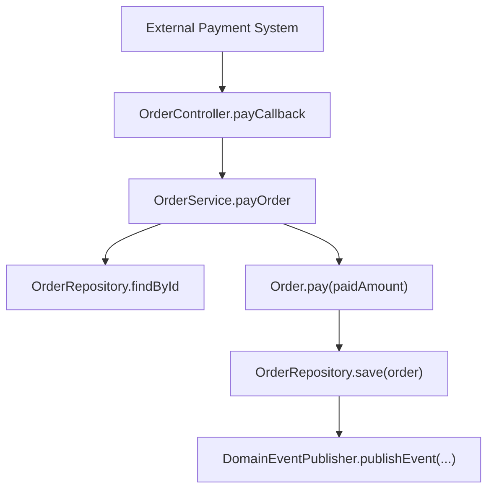
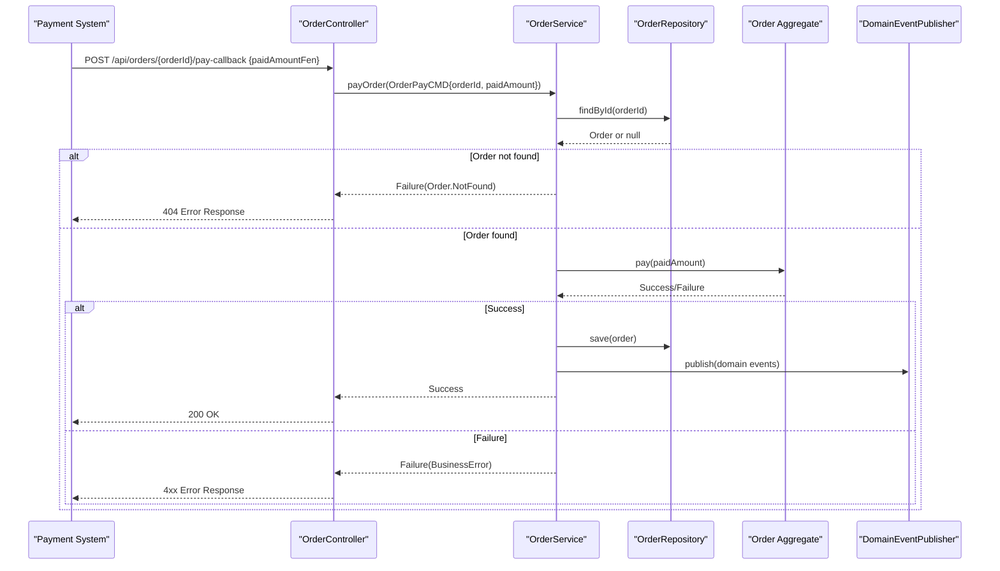
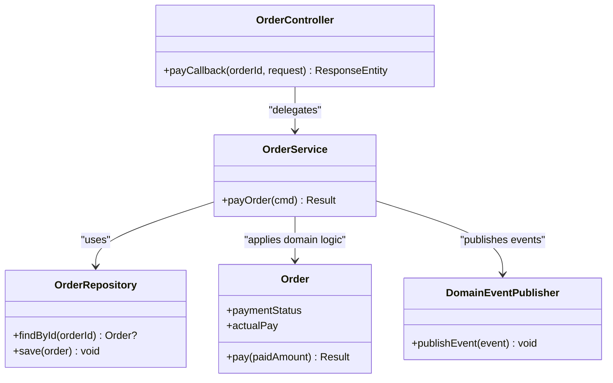

# Payment Callback API

<cite>
**Referenced Files in This Document**
- [OrderController.kt](file://j-store-boot/src/main/kotlin/com/jstore/order/controller/OrderController.kt)
- [OrderService.kt](file://j-store-order/src/main/kotlin/com/jstore/order/service/OrderService.kt)
- [OrderPayCMD.kt](file://j-store-order/src/main/kotlin/com/jstore/order/domain/order/command/OrderPayCMD.kt)
- [Order.kt](file://j-store-order/src/main/kotlin/com/jstore/order/domain/order/Order.kt)
- [OrderImpl.kt](file://j-store-order/src/main/kotlin/com/jstore/order/domain/order/OrderImpl.kt)
- [OrderErrors.kt](file://j-store-order/src/main/kotlin/com/jstore/order/domain/order/OrderErrors.kt)
- [OrderLifecycleRegressionTest.kt](file://j-store-order/src/test/kotlin/com/jstore/order/domain/order/OrderLifecycleRegressionTest.kt)
</cite>

## Table of Contents
1. [Introduction](#introduction)
2. [Project Structure](#project-structure)
3. [Core Components](#core-components)
4. [Architecture Overview](#architecture-overview)
5. [Detailed Component Analysis](#detailed-component-analysis)
6. [Dependency Analysis](#dependency-analysis)
7. [Performance Considerations](#performance-considerations)
8. [Troubleshooting Guide](#troubleshooting-guide)
9. [Conclusion](#conclusion)

## Introduction
This document provides comprehensive API documentation for the payment callback endpoint used to process payment confirmations from external payment systems. It focuses on the POST /api/orders/{orderId}/pay-callback endpoint, detailing the request structure, validation rules, processing workflow, idempotency considerations, transaction safety, error handling, and security recommendations.

## Project Structure
The payment callback is exposed via a Spring REST controller that delegates to an application service, which orchestrates domain logic within the Order aggregate. The command object encapsulates payment data and performs validation before state transitions are applied.

**Diagram sources**
- [OrderController.kt:198-208](file://j-store-boot/src/main/kotlin/com/jstore/order/controller/OrderController.kt#L198-L208)
- [OrderService.kt:72-81](file://j-store-order/src/main/kotlin/com/jstore/order/service/OrderService.kt#L72-L81)
- [Order.kt:42-43](file://j-store-order/src/main/kotlin/com/jstore/order/domain/order/Order.kt#L42-L43)

**Section sources**
- [OrderController.kt:198-208](file://j-store-boot/src/main/kotlin/com/jstore/order/controller/OrderController.kt#L198-L208)
- [OrderService.kt:72-81](file://j-store-order/src/main/kotlin/com/jstore/order/service/OrderService.kt#L72-L81)

## Core Components
- Endpoint: POST /api/orders/{orderId}/pay-callback
- Request DTO: PayCallbackRequest with field paidAmountFen (Long)
- Command: OrderPayCMD with orderId and paidAmount (Price), includes validate() ensuring paidAmount > 0
- Application Service: OrderService.payOrder(cmd) validates, loads order, applies domain pay(), persists, and publishes events
- Domain Aggregate: Order.pay(paidAmount) enforces business rules and state transitions atomically

Key behaviors:
- Amount validation rejects non-positive amounts
- State transitions are guarded by the Order aggregate
- Persistence and event publishing occur only on success

**Section sources**
- [OrderController.kt:198-212](file://j-store-boot/src/main/kotlin/com/jstore/order/controller/OrderController.kt#L198-L212)
- [OrderPayCMD.kt:14-22](file://j-store-order/src/main/kotlin/com/jstore/order/domain/order/command/OrderPayCMD.kt#L14-L22)
- [OrderService.kt:72-81](file://j-store-order/src/main/kotlin/com/jstore/order/service/OrderService.kt#L72-L81)
- [Order.kt:42-43](file://j-store-order/src/main/kotlin/com/jstore/order/domain/order/Order.kt#L42-L43)

## Architecture Overview
The payment callback follows a layered architecture:
- Presentation layer (Controller) maps HTTP requests to commands
- Application layer (Service) orchestrates use cases
- Domain layer (Order aggregate) enforces business rules and state transitions
- Infrastructure layer (Repositories and Event Publisher) handles persistence and asynchronous side effects

**Diagram sources**
- [OrderController.kt:198-208](file://j-store-boot/src/main/kotlin/com/jstore/order/controller/OrderController.kt#L198-L208)
- [OrderService.kt:72-81](file://j-store-order/src/main/kotlin/com/jstore/order/service/OrderService.kt#L72-L81)
- [Order.kt:42-43](file://j-store-order/src/main/kotlin/com/jstore/order/domain/order/Order.kt#L42-L43)

## Detailed Component Analysis

### Endpoint: POST /api/orders/{orderId}/pay-callback
- Path parameter: orderId (Long)
- Request body: PayCallbackRequest with paidAmountFen (Long)
- Behavior: Converts paidAmountFen to Price, constructs OrderPayCMD, calls OrderService.payOrder, returns standardized response

Response mapping:
- Success: 200 OK with empty or minimal payload
- Failure: HTTP status derived from BusinessError.httpCode with ErrorResponse containing message and errorCode

**Section sources**
- [OrderController.kt:198-212](file://j-store-boot/src/main/kotlin/com/jstore/order/controller/OrderController.kt#L198-L212)
- [OrderController.kt:245-254](file://j-store-boot/src/main/kotlin/com/jstore/order/controller/OrderController.kt#L245-L254)

### Request Structure: PayCallbackRequest
- Field: paidAmountFen (Long) — amount in smallest currency unit (fen)
- Validation: Must be positive after conversion to Price; zero or negative triggers PAY_AMOUNT_INVALID

Example request:
- Method: POST
- URL: /api/orders/12345/pay-callback
- Body: {"paidAmountFen": 10000}

**Section sources**
- [OrderController.kt:210-212](file://j-store-boot/src/main/kotlin/com/jstore/order/controller/OrderController.kt#L210-L212)
- [OrderPayCMD.kt:14-22](file://j-store-order/src/main/kotlin/com/jstore/order/domain/order/command/OrderPayCMD.kt#L14-L22)

### Command Validation: OrderPayCMD.validate()
- Ensures paidAmount > 0
- Returns Failure with OrderErrors.PAY_AMOUNT_INVALID if invalid
- Returns Success otherwise

Complexity: O(1) validation check

**Section sources**
- [OrderPayCMD.kt:18-21](file://j-store-order/src/main/kotlin/com/jstore/order/domain/order/command/OrderPayCMD.kt#L18-L21)

### Application Service: OrderService.payOrder()
Workflow:
1. Validate command
2. Load order by ID
3. Apply domain pay(paidAmount)
4. Persist changes
5. Publish domain events

Transaction safety:
- Single transactional boundary around load, domain operation, save, and event publishing ensures atomicity

Concurrency:
- Optimistic concurrency control via repository/versioning prevents lost updates

**Section sources**
- [OrderService.kt:72-81](file://j-store-order/src/main/kotlin/com/jstore/order/service/OrderService.kt#L72-L81)

### Domain Logic: Order.pay(paidAmount)
- Enforces business rules for payment state transitions
- Updates paymentStatus and actualPay atomically
- Guards against illegal states using transition helpers

State machine highlights:
- Only valid transitions allowed based on current trade/payment/fulfillment statuses
- Invalid attempts return Failure without mutating state

**Section sources**
- [Order.kt:42-43](file://j-store-order/src/main/kotlin/com/jstore/order/domain/order/Order.kt#L42-L43)
- [OrderImpl.kt:66-67](file://j-store-order/src/main/kotlin/com/jstore/order/domain/order/OrderImpl.kt#L66-L67)

### Error Handling
Common errors:
- Order.NotFound (404): Order does not exist
- Order.Pay.AmountInvalid (400): Non-positive paidAmount
- Order.State.Invalid (400): Illegal state transition

Error response format:
- HTTP status code from BusinessError.httpCode
- JSON body with message and errorCode fields

Examples:
- Invalid amount: 400 with errorCode "Order.Pay.AmountInvalid"
- Duplicate payment attempt may result in state conflict depending on domain rules

**Section sources**
- [OrderErrors.kt:5-17](file://j-store-order/src/main/kotlin/com/jstore/order/domain/order/OrderErrors.kt#L5-L17)
- [OrderController.kt:245-254](file://j-store-boot/src/main/kotlin/com/jstore/order/controller/OrderController.kt#L245-L254)

### Idempotency Considerations
Current implementation:
- No explicit idempotency key mechanism in the payment callback path
- Repeated callbacks may cause duplicate payments unless domain rules prevent it

Recommendations:
- Add idempotency key support (e.g., request signature hash or external payment system's outTradeNo)
- Store processed callback identifiers to reject duplicates
- Implement at service or repository level with database constraints

**Section sources**
- [OrderService.kt:72-81](file://j-store-order/src/main/kotlin/com/jstore/order/service/OrderService.kt#L72-L81)

### Transaction Safety Mechanisms
- Single transaction per callback ensures consistency
- Domain operations are atomic within the aggregate
- Event publishing occurs after successful persistence

Optimistic locking:
- Prevents concurrent modifications through version checks
- Conflicts result in failures requiring retry logic

**Section sources**
- [OrderService.kt:72-81](file://j-store-order/src/main/kotlin/com/jstore/order/service/OrderService.kt#L72-L81)

## Dependency Analysis
The payment callback depends on several components:

**Diagram sources**
- [OrderController.kt:198-208](file://j-store-boot/src/main/kotlin/com/jstore/order/controller/OrderController.kt#L198-L208)
- [OrderService.kt:25-29](file://j-store-order/src/main/kotlin/com/jstore/order/service/OrderService.kt#L25-L29)
- [Order.kt:12-43](file://j-store-order/src/main/kotlin/com/jstore/order/domain/order/Order.kt#L12-L43)

**Section sources**
- [OrderController.kt:198-208](file://j-store-boot/src/main/kotlin/com/jstore/order/controller/OrderController.kt#L198-L208)
- [OrderService.kt:25-29](file://j-store-order/src/main/kotlin/com/jstore/order/service/OrderService.kt#L25-L29)

## Performance Considerations
- Validation is O(1) and lightweight
- Database operations dominate performance (load/save)
- Event publishing is asynchronous to avoid blocking
- Consider connection pooling and query optimization for high-throughput scenarios

[No sources needed since this section provides general guidance]

## Troubleshooting Guide
Common issues and resolutions:

1. Invalid Amount Errors
   - Symptom: 400 Bad Request with "Order.Pay.AmountInvalid"
   - Cause: paidAmountFen ≤ 0
   - Resolution: Ensure payment amount is positive

2. Order Not Found
   - Symptom: 404 Not Found with "Order.NotFound"
   - Cause: Invalid or expired orderId
   - Resolution: Verify order exists and is active

3. State Conflicts
   - Symptom: 400 Bad Request with "Order.State.Invalid"
   - Cause: Attempting invalid state transition
   - Resolution: Check current order state and payment status

4. Duplicate Payments
   - Symptom: Unexpected multiple payment applications
   - Cause: Missing idempotency handling
   - Resolution: Implement idempotency keys and deduplication

**Section sources**
- [OrderErrors.kt:5-17](file://j-store-order/src/main/kotlin/com/jstore/order/domain/order/OrderErrors.kt#L5-L17)
- [OrderLifecycleRegressionTest.kt:35-41](file://j-store-order/src/test/kotlin/com/jstore/order/domain/order/OrderLifecycleRegressionTest.kt#L35-L41)

## Conclusion
The payment callback endpoint provides a robust foundation for processing payment confirmations with proper validation, domain-driven state management, and transaction safety. To enhance production readiness, implement idempotency mechanisms and strengthen security measures including signature verification and request validation. The modular architecture supports future enhancements while maintaining clear separation of concerns.

[No sources needed since this section summarizes without analyzing specific files]