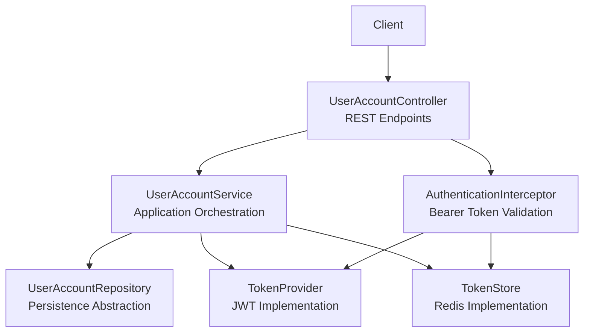
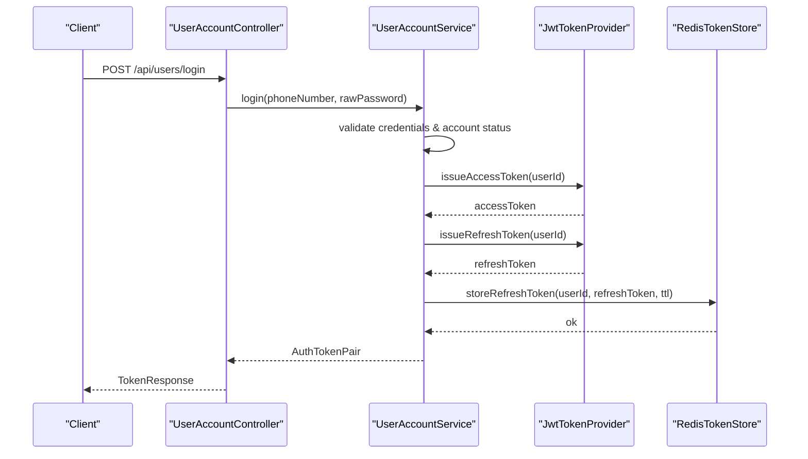
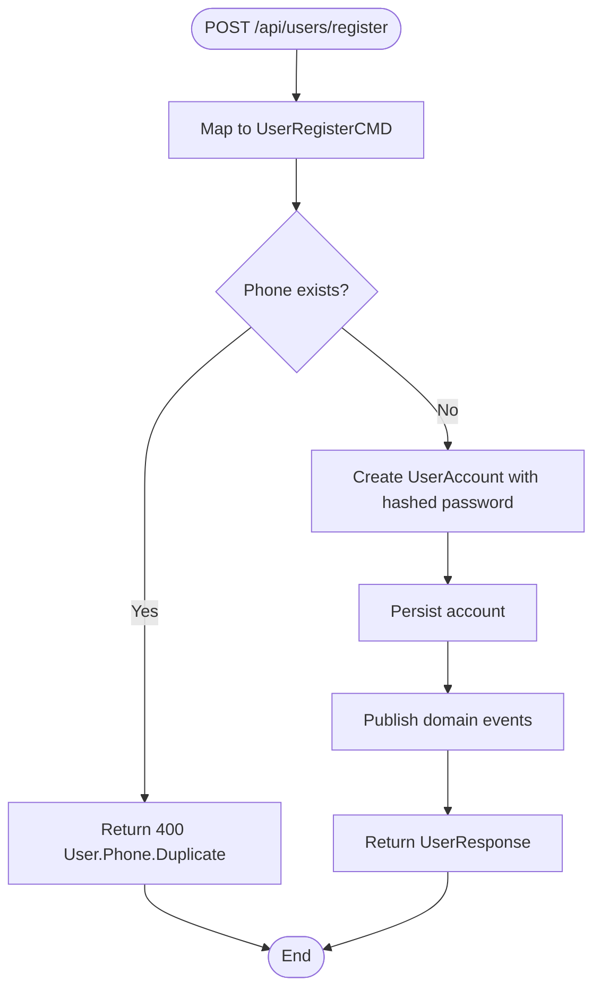
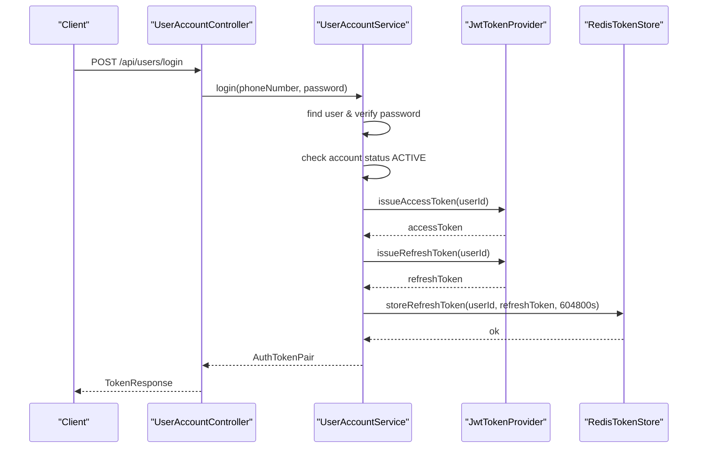
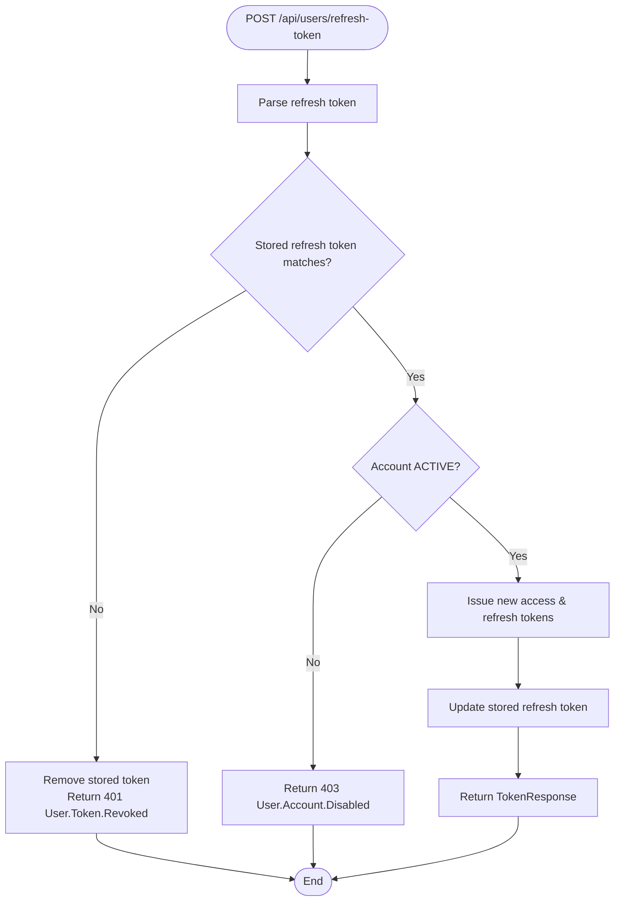
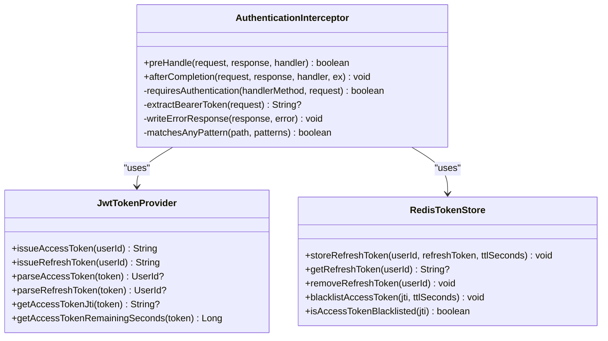
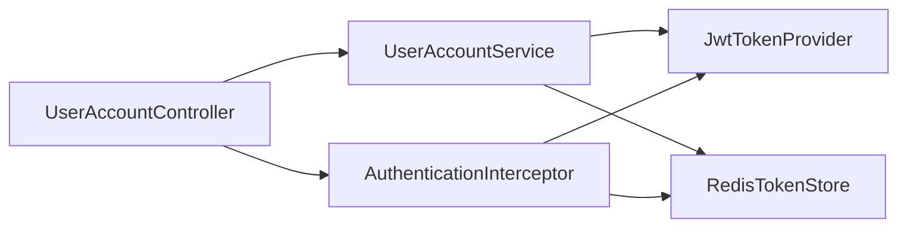

# User Account API

<cite>
**Referenced Files in This Document**
- [UserAccountController.kt](file://j-store-boot/src/main/kotlin/com/jstore/user/controller/UserAccountController.kt)
- [UserAccountService.kt](file://j-store-user/src/main/kotlin/com/jstore/user/service/UserAccountService.kt)
- [UserAccount.kt](file://j-store-user/src/main/kotlin/com/jstore/user/domain/useraccount/UserAccount.kt)
- [Password.kt](file://j-store-user/src/main/kotlin/com/jstore/user/domain/useraccount/Password.kt)
- [AuthTokenPair.kt](file://j-store-user/src/main/kotlin/com/jstore/user/domain/useraccount/AuthTokenPair.kt)
- [UserAccountErrors.kt](file://j-store-user/src/main/kotlin/com/jstore/user/domain/useraccount/UserAccountErrors.kt)
- [AuthenticationInterceptor.kt](file://j-store-authentication-spring-sdk/src/main/kotlin/com/jstore/authentication/spring/AuthenticationInterceptor.kt)
- [AuthenticatedUserContext.kt](file://j-store-authentication-spring-sdk/src/main/kotlin/com/jstore/authentication/context/AuthenticatedUserContext.kt)
- [JwtTokenProvider.kt](file://j-store-user-infrastructure/src/main/kotlin/com/jstore/user/domain/useraccount/JwtTokenProvider.kt)
- [RedisTokenStore.kt](file://j-store-user-infrastructure/src/main/kotlin/com/jstore/user/domain/useraccount/RedisTokenStore.kt)
</cite>

## Table of Contents
1. [Introduction](#introduction)
2. [Project Structure](#project-structure)
3. [Core Components](#core-components)
4. [Architecture Overview](#architecture-overview)
5. [Detailed Component Analysis](#detailed-component-analysis)
6. [Dependency Analysis](#dependency-analysis)
7. [Performance Considerations](#performance-considerations)
8. [Troubleshooting Guide](#troubleshooting-guide)
9. [Conclusion](#conclusion)
10. [Appendices](#appendices)

## Introduction
This document provides comprehensive API documentation for the User Account Management endpoints, including registration, login, logout (via forced offline), token refresh, and profile management. It covers HTTP methods, URL patterns, request/response schemas, security considerations (password hashing, token expiration, session management), error handling, and client implementation guidelines for secure authentication flows and token refresh mechanisms.

## Project Structure
The user account functionality is implemented across three layers:
- Controller layer exposes REST endpoints under /api/users.
- Service layer orchestrates domain operations and integrates with token providers and stores.
- Infrastructure layer implements JWT-based token generation and Redis-backed token storage.

**Diagram sources**
- [UserAccountController.kt](file://j-store-boot/src/main/kotlin/com/jstore/user/controller/UserAccountController.kt)
- [UserAccountService.kt](file://j-store-user/src/main/kotlin/com/jstore/user/service/UserAccountService.kt)
- [JwtTokenProvider.kt](file://j-store-user-infrastructure/src/main/kotlin/com/jstore/user/domain/useraccount/JwtTokenProvider.kt)
- [RedisTokenStore.kt](file://j-store-user-infrastructure/src/main/kotlin/com/jstore/user/domain/useraccount/RedisTokenStore.kt)
- [AuthenticationInterceptor.kt](file://j-store-authentication-spring-sdk/src/main/kotlin/com/jstore/authentication/spring/AuthenticationInterceptor.kt)

**Section sources**
- [UserAccountController.kt](file://j-store-boot/src/main/kotlin/com/jstore/user/controller/UserAccountController.kt)
- [UserAccountService.kt](file://j-store-user/src/main/kotlin/com/jstore/user/service/UserAccountService.kt)
- [JwtTokenProvider.kt](file://j-store-user-infrastructure/src/main/kotlin/com/jstore/user/domain/useraccount/JwtTokenProvider.kt)
- [RedisTokenStore.kt](file://j-store-user-infrastructure/src/main/kotlin/com/jstore/user/domain/useraccount/RedisTokenStore.kt)
- [AuthenticationInterceptor.kt](file://j-store-authentication-spring-sdk/src/main/kotlin/com/jstore/authentication/spring/AuthenticationInterceptor.kt)

## Core Components
- UserAccountController: Defines REST endpoints for user registration, login, token refresh, profile retrieval, nickname/password updates, and account lifecycle controls.
- UserAccountService: Implements business orchestration for registration, login, token refresh, profile changes, and account status transitions; publishes domain events.
- JwtTokenProvider: Issues and validates JWT access and refresh tokens with HS256 signing and claims validation.
- RedisTokenStore: Stores refresh tokens and maintains an access token blacklist using Redis keys with TTLs.
- AuthenticationInterceptor: Validates Bearer tokens on protected routes, enforces path-based rules, and populates authenticated context.

Key data models:
- AuthTokenPair: Encapsulates access and refresh tokens with their expiration timestamps.
- Password: Represents a hashed password value object.
- UserAccountErrors: Centralized error definitions with HTTP codes and error codes.

**Section sources**
- [UserAccountController.kt](file://j-store-boot/src/main/kotlin/com/jstore/user/controller/UserAccountController.kt)
- [UserAccountService.kt](file://j-store-user/src/main/kotlin/com/jstore/user/service/UserAccountService.kt)
- [JwtTokenProvider.kt](file://j-store-user-infrastructure/src/main/kotlin/com/jstore/user/domain/useraccount/JwtTokenProvider.kt)
- [RedisTokenStore.kt](file://j-store-user-infrastructure/src/main/kotlin/com/jstore/user/domain/useraccount/RedisTokenStore.kt)
- [UserAccount.kt](file://j-store-user/src/main/kotlin/com/jstore/user/domain/useraccount/UserAccount.kt)
- [Password.kt](file://j-store-user/src/main/kotlin/com/jstore/user/domain/useraccount/Password.kt)
- [AuthTokenPair.kt](file://j-store-user/src/main/kotlin/com/jstore/user/domain/useraccount/AuthTokenPair.kt)
- [UserAccountErrors.kt](file://j-store-user/src/main/kotlin/com/jstore/user/domain/useraccount/UserAccountErrors.kt)

## Architecture Overview
The system uses a layered architecture with clear separation of concerns:
- Controllers handle HTTP I/O and DTO mapping.
- Services coordinate domain logic and external integrations (token provider/store).
- Interceptors enforce authentication at the framework level.
- Infrastructure components implement persistence and cryptographic operations.

**Diagram sources**
- [UserAccountController.kt](file://j-store-boot/src/main/kotlin/com/jstore/user/controller/UserAccountController.kt)
- [UserAccountService.kt](file://j-store-user/src/main/kotlin/com/jstore/user/service/UserAccountService.kt)
- [JwtTokenProvider.kt](file://j-store-user-infrastructure/src/main/kotlin/com/jstore/user/domain/useraccount/JwtTokenProvider.kt)
- [RedisTokenStore.kt](file://j-store-user-infrastructure/src/main/kotlin/com/jstore/user/domain/useraccount/RedisTokenStore.kt)

## Detailed Component Analysis

### Registration Flow
- Endpoint: POST /api/users/register
- Request schema:
  - phoneNumber: string
  - nickname: string
  - password: string
- Response schema (on success):
  - id: long
  - phoneNumber: string
  - nickname: string
  - status: string
  - createTime: datetime
  - updateTime: datetime
- Behavior:
  - Validates phone uniqueness.
  - Creates user account with hashed password.
  - Persists account and publishes domain events.
- Error responses:
  - Duplicate phone number returns HTTP 400 with code "User.Phone.Duplicate".
  - Other validation errors return appropriate HTTP codes and codes defined in UserAccountErrors.

**Diagram sources**
- [UserAccountController.kt](file://j-store-boot/src/main/kotlin/com/jstore/user/controller/UserAccountController.kt)
- [UserAccountService.kt](file://j-store-user/src/main/kotlin/com/jstore/user/service/UserAccountService.kt)
- [UserAccountErrors.kt](file://j-store-user/src/main/kotlin/com/jstore/user/domain/useraccount/UserAccountErrors.kt)

**Section sources**
- [UserAccountController.kt](file://j-store-boot/src/main/kotlin/com/jstore/user/controller/UserAccountController.kt)
- [UserAccountService.kt](file://j-store-user/src/main/kotlin/com/jstore/user/service/UserAccountService.kt)
- [UserAccountErrors.kt](file://j-store-user/src/main/kotlin/com/jstore/user/domain/useraccount/UserAccountErrors.kt)

### Login Flow
- Endpoint: POST /api/users/login
- Request schema:
  - phoneNumber: string
  - password: string
- Response schema (on success):
  - accessToken: string
  - accessTokenExpiresAt: datetime
  - refreshToken: string
  - refreshTokenExpiresAt: datetime
- Behavior:
  - Verifies credentials and active account status.
  - Issues short-lived access token (15 minutes) and longer refresh token (7 days).
  - Stores refresh token in Redis with TTL.
  - Publishes login event.
- Error responses:
  - Invalid credentials: HTTP 400 with code "User.Password.Mismatch".
  - Disabled account: HTTP 403 with code "User.Account.Disabled".
  - User not found: HTTP 404 with code "User.NotFound".

**Diagram sources**
- [UserAccountController.kt](file://j-store-boot/src/main/kotlin/com/jstore/user/controller/UserAccountController.kt)
- [UserAccountService.kt](file://j-store-user/src/main/kotlin/com/jstore/user/service/UserAccountService.kt)
- [JwtTokenProvider.kt](file://j-store-user-infrastructure/src/main/kotlin/com/jstore/user/domain/useraccount/JwtTokenProvider.kt)
- [RedisTokenStore.kt](file://j-store-user-infrastructure/src/main/kotlin/com/jstore/user/domain/useraccount/RedisTokenStore.kt)

**Section sources**
- [UserAccountController.kt](file://j-store-boot/src/main/kotlin/com/jstore/user/controller/UserAccountController.kt)
- [UserAccountService.kt](file://j-store-user/src/main/kotlin/com/jstore/user/service/UserAccountService.kt)
- [JwtTokenProvider.kt](file://j-store-user-infrastructure/src/main/kotlin/com/jstore/user/domain/useraccount/JwtTokenProvider.kt)
- [RedisTokenStore.kt](file://j-store-user-infrastructure/src/main/kotlin/com/jstore/user/domain/useraccount/RedisTokenStore.kt)
- [UserAccountErrors.kt](file://j-store-user/src/main/kotlin/com/jstore/user/domain/useraccount/UserAccountErrors.kt)

### Token Refresh Flow
- Endpoint: POST /api/users/refresh-token
- Request schema:
  - refreshToken: string
- Response schema (on success):
  - accessToken: string
  - accessTokenExpiresAt: datetime
  - refreshToken: string
  - refreshTokenExpiresAt: datetime
- Behavior:
  - Parses refresh token and verifies it matches stored value.
  - Checks account status ACTIVE.
  - Issues new access and refresh tokens; updates stored refresh token.
- Error responses:
  - Invalid token: HTTP 401 with code "User.Token.Invalid".
  - Revoked token: HTTP 401 with code "User.Token.Revoked".
  - Disabled account: HTTP 403 with code "User.Account.Disabled".

**Diagram sources**
- [UserAccountController.kt](file://j-store-boot/src/main/kotlin/com/jstore/user/controller/UserAccountController.kt)
- [UserAccountService.kt](file://j-store-user/src/main/kotlin/com/jstore/user/service/UserAccountService.kt)
- [JwtTokenProvider.kt](file://j-store-user-infrastructure/src/main/kotlin/com/jstore/user/domain/useraccount/JwtTokenProvider.kt)
- [RedisTokenStore.kt](file://j-store-user-infrastructure/src/main/kotlin/com/jstore/user/domain/useraccount/RedisTokenStore.kt)
- [UserAccountErrors.kt](file://j-store-user/src/main/kotlin/com/jstore/user/domain/useraccount/UserAccountErrors.kt)

**Section sources**
- [UserAccountController.kt](file://j-store-boot/src/main/kotlin/com/jstore/user/controller/UserAccountController.kt)
- [UserAccountService.kt](file://j-store-user/src/main/kotlin/com/jstore/user/service/UserAccountService.kt)
- [JwtTokenProvider.kt](file://j-store-user-infrastructure/src/main/kotlin/com/jstore/user/domain/useraccount/JwtTokenProvider.kt)
- [RedisTokenStore.kt](file://j-store-user-infrastructure/src/main/kotlin/com/jstore/user/domain/useraccount/RedisTokenStore.kt)
- [UserAccountErrors.kt](file://j-store-user/src/main/kotlin/com/jstore/user/domain/useraccount/UserAccountErrors.kt)

### Logout (Forced Offline)
- Endpoint: POST /api/users/{id}/force-offline
- Behavior:
  - Optionally blacklists provided access token by jti if present.
  - Removes stored refresh token for the user.
  - Publishes forced offline event.
- Error responses:
  - User not found: HTTP 404 with code "User.NotFound".

Note: There is no dedicated logout endpoint that consumes a token; clients should use force-offline or rely on token expiration. For immediate invalidation, include the current access token in the request body if supported by your client integration.

**Section sources**
- [UserAccountController.kt](file://j-store-boot/src/main/kotlin/com/jstore/user/controller/UserAccountController.kt)
- [UserAccountService.kt](file://j-store-user/src/main/kotlin/com/jstore/user/service/UserAccountService.kt)
- [JwtTokenProvider.kt](file://j-store-user-infrastructure/src/main/kotlin/com/jstore/user/domain/useraccount/JwtTokenProvider.kt)
- [RedisTokenStore.kt](file://j-store-user-infrastructure/src/main/kotlin/com/jstore/user/domain/useraccount/RedisTokenStore.kt)
- [UserAccountErrors.kt](file://j-store-user/src/main/kotlin/com/jstore/user/domain/useraccount/UserAccountErrors.kt)

### Profile Management
- Get user by ID: GET /api/users/{id}
  - Response schema: UserResponse (id, phoneNumber, nickname, status, createTime, updateTime)
  - Error: User not found (HTTP 404, "User.NotFound")
- Change nickname: PUT /api/users/{id}/nickname
  - Request schema: { nickname: string }
  - Success: Empty body (HTTP 200)
  - Errors: Invalid nickname (HTTP 400, "User.Nickname.Invalid"), user not found (HTTP 404)
- Change password: PUT /api/users/{id}/password
  - Request schema: { oldPassword: string, newPassword: string }
  - Success: Empty body (HTTP 200)
  - Errors: Old password mismatch (HTTP 400, "User.Password.OldMismatch"), insufficient strength (HTTP 400, "User.Password.Weak"), user not found (HTTP 404)

Security considerations:
- Password changes require verification of old password.
- New passwords must meet strength requirements enforced by the factory/validation logic.

**Section sources**
- [UserAccountController.kt](file://j-store-boot/src/main/kotlin/com/jstore/user/controller/UserAccountController.kt)
- [UserAccountService.kt](file://j-store-user/src/main/kotlin/com/jstore/user/service/UserAccountService.kt)
- [UserAccountErrors.kt](file://j-store-user/src/main/kotlin/com/jstore/user/domain/useraccount/UserAccountErrors.kt)

### Security and Authentication Interceptor
- The interceptor validates Bearer tokens for protected endpoints based on configuration.
- Extracts userId from access token and checks blacklist via Redis.
- Sets authenticated user context for downstream processing.
- Returns standardized error responses for missing, invalid, or blacklisted tokens.

**Diagram sources**
- [AuthenticationInterceptor.kt](file://j-store-authentication-spring-sdk/src/main/kotlin/com/jstore/authentication/spring/AuthenticationInterceptor.kt)
- [JwtTokenProvider.kt](file://j-store-user-infrastructure/src/main/kotlin/com/jstore/user/domain/useraccount/JwtTokenProvider.kt)
- [RedisTokenStore.kt](file://j-store-user-infrastructure/src/main/kotlin/com/jstore/user/domain/useraccount/RedisTokenStore.kt)

**Section sources**
- [AuthenticationInterceptor.kt](file://j-store-authentication-spring-sdk/src/main/kotlin/com/jstore/authentication/spring/AuthenticationInterceptor.kt)
- [AuthenticatedUserContext.kt](file://j-store-authentication-spring-sdk/src/main/kotlin/com/jstore/authentication/context/AuthenticatedUserContext.kt)
- [JwtTokenProvider.kt](file://j-store-user-infrastructure/src/main/kotlin/com/jstore/user/domain/useraccount/JwtTokenProvider.kt)
- [RedisTokenStore.kt](file://j-store-user-infrastructure/src/main/kotlin/com/jstore/user/domain/useraccount/RedisTokenStore.kt)

## Dependency Analysis
The following diagram shows key dependencies between controller, service, and infrastructure components:

**Diagram sources**
- [UserAccountController.kt](file://j-store-boot/src/main/kotlin/com/jstore/user/controller/UserAccountController.kt)
- [UserAccountService.kt](file://j-store-user/src/main/kotlin/com/jstore/user/service/UserAccountService.kt)
- [JwtTokenProvider.kt](file://j-store-user-infrastructure/src/main/kotlin/com/jstore/user/domain/useraccount/JwtTokenProvider.kt)
- [RedisTokenStore.kt](file://j-store-user-infrastructure/src/main/kotlin/com/jstore/user/domain/useraccount/RedisTokenStore.kt)
- [AuthenticationInterceptor.kt](file://j-store-authentication-spring-sdk/src/main/kotlin/com/jstore/authentication/spring/AuthenticationInterceptor.kt)

**Section sources**
- [UserAccountController.kt](file://j-store-boot/src/main/kotlin/com/jstore/user/controller/UserAccountController.kt)
- [UserAccountService.kt](file://j-store-user/src/main/kotlin/com/jstore/user/service/UserAccountService.kt)
- [JwtTokenProvider.kt](file://j-store-user-infrastructure/src/main/kotlin/com/jstore/user/domain/useraccount/JwtTokenProvider.kt)
- [RedisTokenStore.kt](file://j-store-user-infrastructure/src/main/kotlin/com/jstore/user/domain/useraccount/RedisTokenStore.kt)
- [AuthenticationInterceptor.kt](file://j-store-authentication-spring-sdk/src/main/kotlin/com/jstore/authentication/spring/AuthenticationInterceptor.kt)

## Performance Considerations
- Short-lived access tokens reduce exposure window and minimize server-side state.
- Refresh tokens are stored in Redis with TTL; ensure Redis availability and proper key naming to avoid collisions.
- Blacklisting access tokens by jti enables immediate invalidation without full session revocation.
- Avoid unnecessary database queries by caching frequently accessed user profiles when appropriate.
- Use efficient JSON serialization and minimal payload sizes for high-throughput scenarios.

[No sources needed since this section provides general guidance]

## Troubleshooting Guide
Common errors and resolutions:
- Duplicate phone number during registration: Ensure unique phone numbers per user; handle 400 "User.Phone.Duplicate" by prompting re-entry.
- Invalid credentials: Verify password input and account existence; handle 400 "User.Password.Mismatch".
- Disabled account: Confirm account status before login attempts; handle 403 "User.Account.Disabled".
- Token invalid or revoked: Validate refresh token format and presence; handle 401 "User.Token.Invalid" or "User.Token.Revoked" by redirecting to login.
- Access token blacklisted: Indicates forced offline or logout; prompt re-login.

Error response format:
- message: human-readable description
- errorCode: machine-readable code (e.g., "User.Password.Mismatch")

**Section sources**
- [UserAccountErrors.kt](file://j-store-user/src/main/kotlin/com/jstore/user/domain/useraccount/UserAccountErrors.kt)
- [AuthenticationInterceptor.kt](file://j-store-authentication-spring-sdk/src/main/kotlin/com/jstore/authentication/spring/AuthenticationInterceptor.kt)

## Conclusion
The User Account API provides robust endpoints for registration, authentication, token refresh, and profile management. Security is enforced through hashed passwords, short-lived access tokens, and server-side refresh token storage with optional blacklist support. Clients should implement secure flows for token handling, refresh strategies, and error handling to ensure a seamless user experience.

[No sources needed since this section summarizes without analyzing specific files]

## Appendices

### API Endpoints Summary
- POST /api/users/register
  - Request: { phoneNumber: string, nickname: string, password: string }
  - Response: { id: long, phoneNumber: string, nickname: string, status: string, createTime: datetime, updateTime: datetime }
- POST /api/users/login
  - Request: { phoneNumber: string, password: string }
  - Response: { accessToken: string, accessTokenExpiresAt: datetime, refreshToken: string, refreshTokenExpiresAt: datetime }
- POST /api/users/refresh-token
  - Request: { refreshToken: string }
  - Response: { accessToken: string, accessTokenExpiresAt: datetime, refreshToken: string, refreshTokenExpiresAt: datetime }
- GET /api/users/{id}
  - Response: { id: long, phoneNumber: string, nickname: string, status: string, createTime: datetime, updateTime: datetime }
- PUT /api/users/{id}/nickname
  - Request: { nickname: string }
  - Response: empty
- PUT /api/users/{id}/password
  - Request: { oldPassword: string, newPassword: string }
  - Response: empty
- POST /api/users/{id}/disable
  - Response: empty
- POST /api/users/{id}/enable
  - Response: empty
- POST /api/users/{id}/force-offline
  - Response: empty

**Section sources**
- [UserAccountController.kt](file://j-store-boot/src/main/kotlin/com/jstore/user/controller/UserAccountController.kt)

### Security Notes
- Password hashing: Use strong hashing (e.g., BCrypt) via PasswordHasher abstraction.
- Token lifetimes: Access tokens expire in 15 minutes; refresh tokens in 7 days.
- Session management: Use Redis to store refresh tokens and blacklist access tokens for immediate invalidation.
- Authentication enforcement: Configure path patterns and annotations to protect endpoints.

**Section sources**
- [JwtTokenProvider.kt](file://j-store-user-infrastructure/src/main/kotlin/com/jstore/user/domain/useraccount/JwtTokenProvider.kt)
- [RedisTokenStore.kt](file://j-store-user-infrastructure/src/main/kotlin/com/jstore/user/domain/useraccount/RedisTokenStore.kt)
- [AuthenticationInterceptor.kt](file://j-store-authentication-spring-sdk/src/main/kotlin/com/jstore/authentication/spring/AuthenticationInterceptor.kt)

### Client Implementation Guidelines
- Securely store tokens in memory or secure storage; never log sensitive values.
- On 401 Unauthorized, attempt refresh-token flow; if still failing, redirect to login.
- Include Authorization header with Bearer scheme for protected endpoints.
- Handle rate limiting and retries gracefully; back off on failures.
- Validate server time and token expiration locally to avoid unnecessary network calls.

[No sources needed since this section provides general guidance]