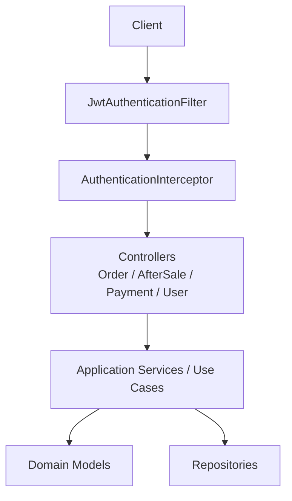
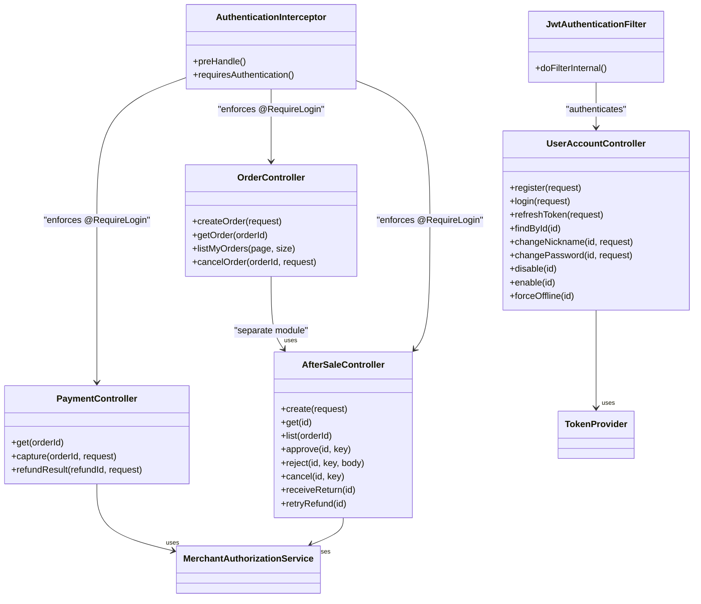
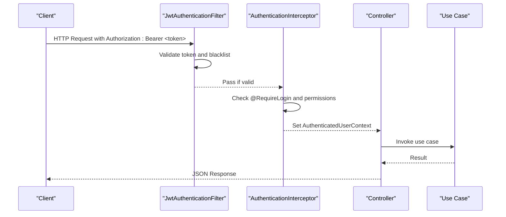
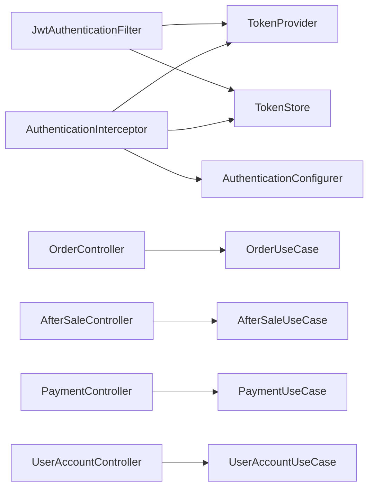

# API Reference

<cite>
**Referenced Files in This Document**
- [OrderController.kt](file://j-store-order-boot/src/main/kotlin/com/jstore/order/controller/OrderController.kt)
- [AfterSaleController.kt](file://j-store-order-boot/src/main/kotlin/com/jstore/order/controller/AfterSaleController.kt)
- [PaymentController.kt](file://j-store-payment-boot/src/main/kotlin/com/jstore/payment/controller/PaymentController.kt)
- [UserAccountController.kt](file://j-store-user-boot/src/main/kotlin/com/jstore/user/controller/UserAccountController.kt)
- [JwtAuthenticationFilter.kt](file://j-store-user-boot/src/main/kotlin/com/jstore/user/filter/JwtAuthenticationFilter.kt)
- [AuthenticationInterceptor.kt](file://j-store-authentication-spring-sdk/src/main/kotlin/com/jstore/authentication/spring/AuthenticationInterceptor.kt)
- [RequireLogin.kt](file://j-store-authentication-spring-sdk/src/main/kotlin/com/jstore/authentication/annotation/RequireLogin.kt)
- [AuthenticatedUserContext.kt](file://j-store-authentication-spring-sdk/src/main/kotlin/com/jstore/authentication/context/AuthenticatedUserContext.kt)
- [AuthenticationErrors.kt](file://j-store-authentication-spring-sdk/src/main/kotlin/com/jstore/authentication/error/AuthenticationErrors.kt)
- [BusinessError.kt](file://j-store-common-core/src/main/kotlin/com/jstore/common/errors/BusinessError.kt)
</cite>

## Table of Contents
1. Introduction
2. Project Structure
3. Core Components
4. Architecture Overview
5. Detailed Component Analysis
6. Dependency Analysis
7. Performance Considerations
8. Troubleshooting Guide
9. Conclusion

## Introduction
This document provides a comprehensive API reference for the J-Store platform’s REST endpoints. It covers order management, after-sale processing, payment operations, and user account management. For each endpoint, you will find HTTP methods, URL patterns, request/response schemas, authentication requirements, error codes, status codes, and practical examples. Authentication is implemented using JWT tokens with role-based access control via merchant permissions where applicable. Pagination and filtering are supported on specific endpoints. Rate limiting is not implemented at the API layer in the referenced code.

## Project Structure
The API surface is exposed through Spring Boot controllers in separate boot modules:
- Order APIs under j-store-order-boot
- After-sale APIs under j-store-order-boot
- Payment APIs under j-store-payment-boot
- User account APIs under j-store-user-boot

Authentication is enforced by:
- A servlet filter (JwtAuthenticationFilter) that validates Bearer tokens and whitelists public endpoints
- An interceptor (AuthenticationInterceptor) that enforces @RequireLogin and sets authenticated context
- Annotations (@RequireLogin) to mark protected endpoints

[No sources needed since this diagram shows conceptual workflow, not actual code structure]

**Section sources**
- [OrderController.kt:17-20](file://j-store-order-boot/src/main/kotlin/com/jstore/order/controller/OrderController.kt#L17-L20)
- [AfterSaleController.kt:49-55](file://j-store-order-boot/src/main/kotlin/com/jstore/order/controller/AfterSaleController.kt#L49-L55)
- [PaymentController.kt:27-33](file://j-store-payment-boot/src/main/kotlin/com/jstore/payment/controller/PaymentController.kt#L27-L33)
- [UserAccountController.kt:14-16](file://j-store-user-boot/src/main/kotlin/com/jstore/user/controller/UserAccountController.kt#L14-L16)
- [JwtAuthenticationFilter.kt:12-28](file://j-store-user-boot/src/main/kotlin/com/jstore/user/filter/JwtAuthenticationFilter.kt#L12-L28)
- [AuthenticationInterceptor.kt:18-23](file://j-store-authentication-spring-sdk/src/main/kotlin/com/jstore/authentication/spring/AuthenticationInterceptor.kt#L18-L23)

## Core Components
- OrderController: Buyer-facing order lifecycle (create, get, list, cancel). Requires login.
- AfterSaleController: After-sale requests and approvals/rejections. Requires login; merchant-specific actions require merchant permissions.
- PaymentController: Payment capture and refund result callbacks. Requires login; merchant-specific actions require merchant permissions.
- UserAccountController: Registration, login, token refresh, profile updates, and account lifecycle management. Public endpoints for auth flows; others may be restricted.

Authentication and authorization:
- JWT Bearer tokens validated by JwtAuthenticationFilter and AuthenticationInterceptor
- @RequireLogin marks protected endpoints
- MerchantPermission checks enforce RBAC for merchant operations

**Section sources**
- [OrderController.kt:17-20](file://j-store-order-boot/src/main/kotlin/com/jstore/order/controller/OrderController.kt#L17-L20)
- [AfterSaleController.kt:49-55](file://j-store-order-boot/src/main/kotlin/com/jstore/order/controller/AfterSaleController.kt#L49-L55)
- [PaymentController.kt:27-33](file://j-store-payment-boot/src/main/kotlin/com/jstore/payment/controller/PaymentController.kt#L27-L33)
- [UserAccountController.kt:14-16](file://j-store-user-boot/src/main/kotlin/com/jstore/user/controller/UserAccountController.kt#L14-L16)
- [RequireLogin.kt:1-6](file://j-store-authentication-spring-sdk/src/main/kotlin/com/jstore/authentication/annotation/RequireLogin.kt#L1-L6)
- [AuthenticationInterceptor.kt:80-101](file://j-store-authentication-spring-sdk/src/main/kotlin/com/jstore/authentication/spring/AuthenticationInterceptor.kt#L80-L101)
- [JwtAuthenticationFilter.kt:22-28](file://j-store-user-boot/src/main/kotlin/com/jstore/user/filter/JwtAuthenticationFilter.kt#L22-L28)

## Architecture Overview
The API follows a layered architecture:
- Controllers handle HTTP I/O and DTO mapping
- Application services orchestrate use cases
- Domain models encapsulate business logic
- Infrastructure repositories persist data

**Diagram sources**
- [OrderController.kt:17-20](file://j-store-order-boot/src/main/kotlin/com/jstore/order/controller/OrderController.kt#L17-L20)
- [AfterSaleController.kt:49-55](file://j-store-order-boot/src/main/kotlin/com/jstore/order/controller/AfterSaleController.kt#L49-L55)
- [PaymentController.kt:27-33](file://j-store-payment-boot/src/main/kotlin/com/jstore/payment/controller/PaymentController.kt#L27-L33)
- [UserAccountController.kt:14-16](file://j-store-user-boot/src/main/kotlin/com/jstore/user/controller/UserAccountController.kt#L14-L16)
- [JwtAuthenticationFilter.kt:12-28](file://j-store-user-boot/src/main/kotlin/com/jstore/user/filter/JwtAuthenticationFilter.kt#L12-L28)
- [AuthenticationInterceptor.kt:18-23](file://j-store-authentication-spring-sdk/src/main/kotlin/com/jstore/authentication/spring/AuthenticationInterceptor.kt#L18-L23)

## Detailed Component Analysis

### Order Management API
Base path: /api/orders
Authentication: Requires login via JWT Bearer token.

Endpoints:
- POST /api/orders
  - Purpose: Create an order
  - Request body fields:
    - merchantId: Long
    - recipientInfo: object with consigneeName, countryCode?, contactPhone?, contactEmail?, shippingDistrictCode, shippingDetailAddress
    - items: array of objects with spuId, skuId, quantity, snapshotVersion
  - Response: OrderResponse or ErrorResponse
  - Status codes: 200 on success; error status codes mapped from BusinessError
  - Example:
    - Request: {"merchantId":123,"recipientInfo":{"consigneeName":"Alice","shippingDistrictCode":"CN-110","shippingDetailAddress":"Room 101"},"items":[{"spuId":1,"skuId":10,"quantity":2,"snapshotVersion":1}]}
    - Response: {"id":1,"merchantId":123,"buyerUid":1,"tradeStatus":"CREATED","paymentStatus":"UNPAID","fulfillmentStatus":"PENDING","currency":"CNY","itemsSubtotal":20000,"discountAmount":0,"shippingAmount":1000,"taxAmount":0,"payableAmount":21000,"paidAmount":0,"refundedAmount":0,"items":[...],"createTime":"...","updateTime":"..."}

- GET /api/orders/{orderId}
  - Purpose: Get order details
  - Path parameter: orderId (Long)
  - Response: OrderResponse or ErrorResponse

- GET /api/orders
  - Purpose: List current user’s orders
  - Query parameters: page (default 1), size (default 10)
  - Response: PageResponse<OrderResponse> or ErrorResponse

- POST /api/orders/{orderId}/cancel
  - Purpose: Cancel an order
  - Path parameter: orderId (Long)
  - Request body fields: category (enum), description (String)
  - Response: Success payload or ErrorResponse

Notes:
- Pagination uses page and size query parameters
- Error responses follow a consistent schema with message and errorCode

**Section sources**
- [OrderController.kt:101-136](file://j-store-order-boot/src/main/kotlin/com/jstore/order/controller/OrderController.kt#L101-L136)
- [OrderController.kt:138-144](file://j-store-order-boot/src/main/kotlin/com/jstore/order/controller/OrderController.kt#L138-L144)
- [OrderController.kt:146-160](file://j-store-order-boot/src/main/kotlin/com/jstore/order/controller/OrderController.kt#L146-L160)
- [OrderController.kt:162-175](file://j-store-order-boot/src/main/kotlin/com/jstore/order/controller/OrderController.kt#L162-L175)
- [OrderController.kt:216-224](file://j-store-order-boot/src/main/kotlin/com/jstore/order/controller/OrderController.kt#L216-L224)

### After-Sale Processing API
Base path: /api/after-sales
Authentication: Requires login via JWT Bearer token. Merchant operations require merchant permissions.

Endpoints:
- POST /api/after-sales
  - Purpose: Create an after-sale request
  - Headers: Idempotency-Key (required)
  - Request body fields:
    - orderId: Long
    - category: enum (refund category)
    - description: String (max 500)
    - items: array of objects with orderItemId (positive), quantity (positive), amount (positive), currency (default "CNY")
  - Response: AfterSaleResponse or ErrorResponse

- GET /api/after-sales/{id}
  - Purpose: Get after-sale details
  - Path parameter: id (Long)
  - Authorization: Buyer or merchant with AFTER_SALE_READ permission
  - Response: AfterSaleResponse or ErrorResponse

- GET /api/after-sales?orderId={orderId}
  - Purpose: List after-sales for an order
  - Query parameter: orderId (Long)
  - Authorization: Buyer or merchant with AFTER_SALE_READ permission
  - Response: Array of AfterSaleResponse or ErrorResponse

- POST /api/after-sales/{id}/approve
  - Purpose: Approve after-sale (merchant only)
  - Headers: Idempotency-Key (required)
  - Authorization: Merchant with AFTER_SALE_MANAGE permission
  - Response: Success payload or ErrorResponse

- POST /api/after-sales/{id}/reject
  - Purpose: Reject after-sale (merchant only)
  - Headers: Idempotency-Key (required)
  - Request body fields: rejectionReason (String, max 500)
  - Authorization: Merchant with AFTER_SALE_MANAGE permission
  - Response: Success payload or ErrorResponse

- POST /api/after-sales/{id}/cancel
  - Purpose: Cancel after-sale (applicant)
  - Headers: Idempotency-Key (required)
  - Response: Success payload or ErrorResponse

- POST /api/after-sales/{id}/receive-return
  - Purpose: Mark return received (merchant only)
  - Authorization: Merchant with AFTER_SALE_MANAGE permission
  - Response: Success payload or ErrorResponse

- POST /api/after-sales/{id}/retry-refund
  - Purpose: Retry refund (merchant only)
  - Authorization: Merchant with AFTER_SALE_MANAGE permission
  - Response: Success payload or ErrorResponse

Notes:
- Idempotency-Key header ensures safe retries for state-changing operations
- Merchant permissions enforced via MerchantAuthorizationService

**Section sources**
- [AfterSaleController.kt:106-129](file://j-store-order-boot/src/main/kotlin/com/jstore/order/controller/AfterSaleController.kt#L106-L129)
- [AfterSaleController.kt:131-133](file://j-store-order-boot/src/main/kotlin/com/jstore/order/controller/AfterSaleController.kt#L131-L133)
- [AfterSaleController.kt:135-148](file://j-store-order-boot/src/main/kotlin/com/jstore/order/controller/AfterSaleController.kt#L135-L148)
- [AfterSaleController.kt:150-158](file://j-store-order-boot/src/main/kotlin/com/jstore/order/controller/AfterSaleController.kt#L150-L158)
- [AfterSaleController.kt:160-171](file://j-store-order-boot/src/main/kotlin/com/jstore/order/controller/AfterSaleController.kt#L160-L171)
- [AfterSaleController.kt:173-181](file://j-store-order-boot/src/main/kotlin/com/jstore/order/controller/AfterSaleController.kt#L173-L181)
- [AfterSaleController.kt:183-187](file://j-store-order-boot/src/main/kotlin/com/jstore/order/controller/AfterSaleController.kt#L183-L187)
- [AfterSaleController.kt:189-193](file://j-store-order-boot/src/main/kotlin/com/jstore/order/controller/AfterSaleController.kt#L189-L193)
- [AfterSaleController.kt:195-217](file://j-store-order-boot/src/main/kotlin/com/jstore/order/controller/AfterSaleController.kt#L195-L217)

### Payment Operations API
Base path: /api/payments
Authentication: Requires login via JWT Bearer token. Merchant operations require merchant permissions.

Endpoints:
- GET /api/payments/orders/{orderId}
  - Purpose: Get payment details for an order
  - Path parameter: orderId (Long)
  - Authorization: Merchant with PAYMENT_READ permission
  - Response: PaymentResponse or ErrorResponse

- POST /api/payments/orders/{orderId}/capture
  - Purpose: Capture payment (simulated callback)
  - Path parameter: orderId (Long)
  - Request body fields: providerTransactionId (String), amount (Long), currency (default "CNY")
  - Authorization: Merchant with PAYMENT_MANAGE permission
  - Response: Success payload or ErrorResponse

- POST /api/payments/refunds/{refundId}/result
  - Purpose: Submit refund result (simulated callback)
  - Path parameter: refundId (Long)
  - Request body fields: providerRefundId? (String), failureReason? (String)
  - Authorization: Merchant with PAYMENT_MANAGE permission
  - Response: Success payload or ErrorResponse

Notes:
- These endpoints simulate external payment channel callbacks during pre-launch
- Merchant permissions enforced via MerchantAuthorizationService

**Section sources**
- [PaymentController.kt:66-68](file://j-store-payment-boot/src/main/kotlin/com/jstore/payment/controller/PaymentController.kt#L66-L68)
- [PaymentController.kt:71-89](file://j-store-payment-boot/src/main/kotlin/com/jstore/payment/controller/PaymentController.kt#L71-L89)
- [PaymentController.kt:92-108](file://j-store-payment-boot/src/main/kotlin/com/jstore/payment/controller/PaymentController.kt#L92-L108)
- [PaymentController.kt:110-152](file://j-store-payment-boot/src/main/kotlin/com/jstore/payment/controller/PaymentController.kt#L110-L152)

### User Account Management API
Base path: /api/users
Authentication: Public endpoints for registration/login/token refresh; other endpoints may require authentication depending on configuration.

Endpoints:
- POST /api/users/register
  - Purpose: Register a new user
  - Request body fields: phoneNumber (String), nickname (String), password (String)
  - Response: UserResponse or ErrorResponse

- POST /api/users/login
  - Purpose: Authenticate and obtain tokens
  - Request body fields: phoneNumber (String), password (String)
  - Response: TokenResponse with accessToken, accessTokenExpiresAt, refreshToken, refreshTokenExpiresAt

- POST /api/users/refresh-token
  - Purpose: Refresh access token using refresh token
  - Request body fields: refreshToken (String)
  - Response: TokenResponse

- GET /api/users/{id}
  - Purpose: Get user details
  - Path parameter: id (Long)
  - Response: UserResponse or ErrorResponse

- PUT /api/users/{id}/nickname
  - Purpose: Change user nickname
  - Path parameter: id (Long)
  - Request body fields: nickname (String)
  - Response: Success payload or ErrorResponse

- PUT /api/users/{id}/password
  - Purpose: Change user password
  - Path parameter: id (Long)
  - Request body fields: oldPassword (String), newPassword (String)
  - Response: Success payload or ErrorResponse

- POST /api/users/{id}/disable
  - Purpose: Disable user account
  - Path parameter: id (Long)
  - Response: Success payload or ErrorResponse

- POST /api/users/{id}/enable
  - Purpose: Enable user account
  - Path parameter: id (Long)
  - Response: Success payload or ErrorResponse

- POST /api/users/{id}/force-offline
  - Purpose: Force user offline (invalidate sessions)
  - Path parameter: id (Long)
  - Response: Success payload or ErrorResponse

Notes:
- Whitelisted paths for JWT validation include register, login, and refresh-token
- Token refresh returns new access and refresh tokens with expiration times

**Section sources**
- [UserAccountController.kt:65-83](file://j-store-user-boot/src/main/kotlin/com/jstore/user/controller/UserAccountController.kt#L65-L83)
- [UserAccountController.kt:85-100](file://j-store-user-boot/src/main/kotlin/com/jstore/user/controller/UserAccountController.kt#L85-L100)
- [UserAccountController.kt:102-112](file://j-store-user-boot/src/main/kotlin/com/jstore/user/controller/UserAccountController.kt#L102-L112)
- [UserAccountController.kt:114-126](file://j-store-user-boot/src/main/kotlin/com/jstore/user/controller/UserAccountController.kt#L114-L126)
- [UserAccountController.kt:128-139](file://j-store-user-boot/src/main/kotlin/com/jstore/user/controller/UserAccountController.kt#L128-L139)
- [UserAccountController.kt:141-153](file://j-store-user-boot/src/main/kotlin/com/jstore/user/controller/UserAccountController.kt#L141-L153)
- [UserAccountController.kt:155-168](file://j-store-user-boot/src/main/kotlin/com/jstore/user/controller/UserAccountController.kt#L155-L168)
- [JwtAuthenticationFilter.kt:22-28](file://j-store-user-boot/src/main/kotlin/com/jstore/user/filter/JwtAuthenticationFilter.kt#L22-L28)

### Authentication and Authorization Flow
JWT-based authentication is enforced by:
- JwtAuthenticationFilter: Validates Bearer tokens, checks blacklist, whitelists public endpoints
- AuthenticationInterceptor: Enforces @RequireLogin, sets AuthenticatedUserContext
- RequireLogin annotation: Marks protected endpoints

**Diagram sources**
- [JwtAuthenticationFilter.kt:32-68](file://j-store-user-boot/src/main/kotlin/com/jstore/user/filter/JwtAuthenticationFilter.kt#L32-L68)
- [AuthenticationInterceptor.kt:35-68](file://j-store-authentication-spring-sdk/src/main/kotlin/com/jstore/authentication/spring/AuthenticationInterceptor.kt#L35-L68)
- [RequireLogin.kt:1-6](file://j-store-authentication-spring-sdk/src/main/kotlin/com/jstore/authentication/annotation/RequireLogin.kt#L1-L6)

## Dependency Analysis
Controllers depend on application services and domain models. Authentication components provide cross-cutting concerns:
- JwtAuthenticationFilter depends on TokenProvider and TokenStore
- AuthenticationInterceptor depends on TokenProvider, TokenStore, and AuthenticationConfigurer
- Controllers use @CurrentUserId to extract authenticated user context

**Diagram sources**
- [JwtAuthenticationFilter.kt:12-15](file://j-store-user-boot/src/main/kotlin/com/jstore/user/filter/JwtAuthenticationFilter.kt#L12-L15)
- [AuthenticationInterceptor.kt:18-23](file://j-store-authentication-spring-sdk/src/main/kotlin/com/jstore/authentication/spring/AuthenticationInterceptor.kt#L18-L23)
- [OrderController.kt:20](file://j-store-order-boot/src/main/kotlin/com/jstore/order/controller/OrderController.kt#L20)
- [AfterSaleController.kt:52-55](file://j-store-order-boot/src/main/kotlin/com/jstore/order/controller/AfterSaleController.kt#L52-L55)
- [PaymentController.kt:30-33](file://j-store-payment-boot/src/main/kotlin/com/jstore/payment/controller/PaymentController.kt#L30-L33)
- [UserAccountController.kt:16](file://j-store-user-boot/src/main/kotlin/com/jstore/user/controller/UserAccountController.kt#L16)

**Section sources**
- [JwtAuthenticationFilter.kt:12-15](file://j-store-user-boot/src/main/kotlin/com/jstore/user/filter/JwtAuthenticationFilter.kt#L12-L15)
- [AuthenticationInterceptor.kt:18-23](file://j-store-authentication-spring-sdk/src/main/kotlin/com/jstore/authentication/spring/AuthenticationInterceptor.kt#L18-L23)

## Performance Considerations
- Pagination: Order listing supports page and size parameters to limit response size
- Idempotency: After-sale operations require Idempotency-Key header to prevent duplicate processing
- Database indexing: After-sale tables include indexes for common queries (order_id, applicant_id, merchant_id)
- No rate limiting: The codebase does not implement API rate limiting; consider adding gateway-level throttling if needed

[No sources needed since this section provides general guidance]

## Troubleshooting Guide
Common errors and their causes:
- 401 Unauthorized: Missing or invalid JWT token
  - Ensure Authorization header contains "Bearer <token>"
  - Verify token is not blacklisted
- 403 Forbidden: Insufficient merchant permissions
  - Check merchant has required permission (e.g., AFTER_SALE_MANAGE, PAYMENT_MANAGE)
- 404 Not Found: Resource not found
  - Verify orderId, afterSaleId, or userId exists
- 400 Bad Request: Invalid parameters
  - Validate request body fields and constraints
- 500 Internal Server Error: Business errors or internal failures
  - Check errorCode and message in response body

Debugging tips:
- Log request headers to verify token presence
- Validate Idempotency-Key for after-sale operations
- Check merchant permissions in authorization service
- Review BusinessError mappings for consistent error responses

**Section sources**
- [AuthenticationErrors.kt:5-10](file://j-store-authentication-spring-sdk/src/main/kotlin/com/jstore/authentication/error/AuthenticationErrors.kt#L5-L10)
- [BusinessError.kt:3-21](file://j-store-common-core/src/main/kotlin/com/jstore/common/errors/BusinessError.kt#L3-L21)
- [JwtAuthenticationFilter.kt:43-67](file://j-store-user-boot/src/main/kotlin/com/jstore/user/filter/JwtAuthenticationFilter.kt#L43-L67)
- [AuthenticationInterceptor.kt:44-68](file://j-store-authentication-spring-sdk/src/main/kotlin/com/jstore/authentication/spring/AuthenticationInterceptor.kt#L44-L68)

## Conclusion
The J-Store platform provides a comprehensive set of REST APIs for order management, after-sale processing, payment operations, and user account management. Authentication is implemented using JWT tokens with role-based access control for merchant operations. Pagination and idempotency are supported where appropriate. For production deployments, consider adding rate limiting and enhanced monitoring. The consistent error handling pattern ensures predictable client behavior across all endpoints.

[No sources needed since this section summarizes without analyzing specific files]