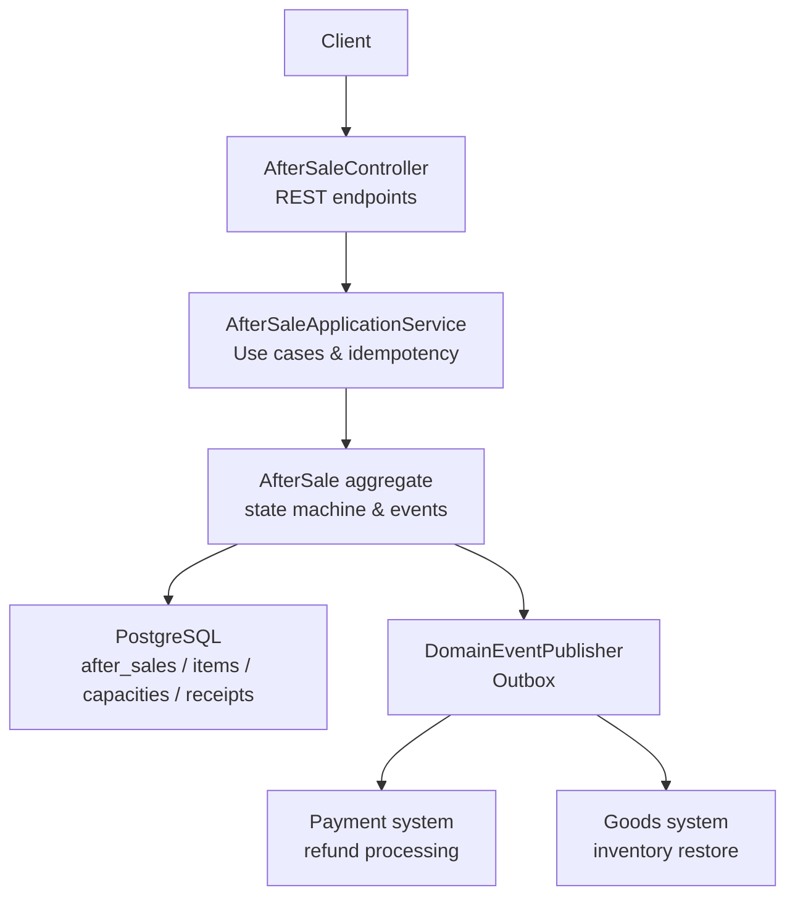
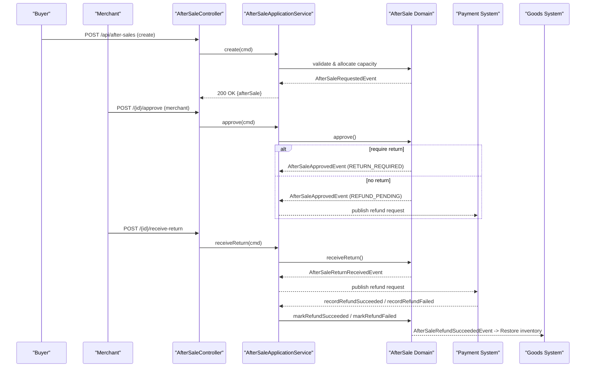
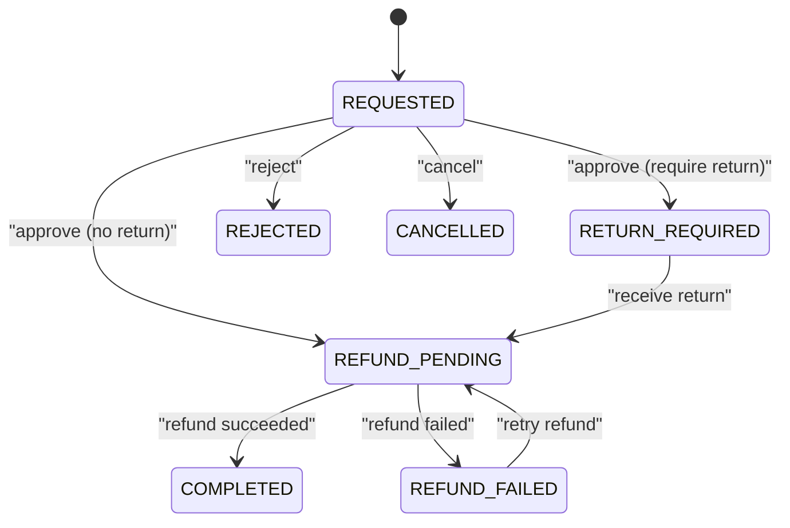
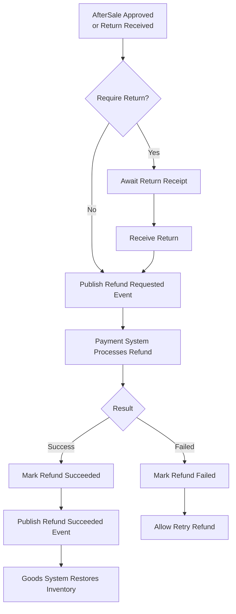
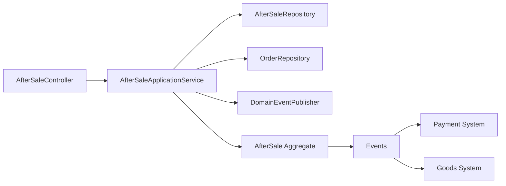

# After-Sale Management API

<cite>
**Referenced Files in This Document**
- [AfterSaleController.kt](file://j-store-order-boot/src/main/kotlin/com/jstore/order/controller/AfterSaleController.kt)
- [AfterSaleApplicationService.kt](file://j-store-order-application/src/main/kotlin/com/jstore/order/service/AfterSaleApplicationService.kt)
- [AfterSaleCommands.kt](file://j-store-order-domain/src/main/kotlin/com/jstore/order/domain/aftersale/command/AfterSaleCommands.kt)
- [AfterSale.kt](file://j-store-order-domain/src/main/kotlin/com/jstore/order/domain/aftersale/AfterSale.kt)
- [AfterSaleImpl.kt](file://j-store-order-domain/src/main/kotlin/com/jstore/order/domain/aftersale/AfterSaleImpl.kt)
- [AfterSaleStatus.kt](file://j-store-order-domain/src/main/kotlin/com/jstore/order/domain/aftersale/AfterSaleStatus.kt)
- [AfterSaleErrors.kt](file://j-store-order-domain/src/main/kotlin/com/jstore/order/domain/aftersale/AfterSaleErrors.kt)
- [V20260803__order_after_sale_aggregate.sql](file://j-store-boot/src/main/resources/db/migration/V20260803__order_after_sale_aggregate.sql)
- [V20260731__order_status_dimensions.sql](file://j-store-boot/src/main/resources/db/migration/V20260731__order_status_dimensions.sql)
- [AfterSaleStockRestoreEventHandler.kt](file://j-store-goods-application/src/main/kotlin/com/jstore/goods/service/AfterSaleStockRestoreEventHandler.kt)
</cite>

## Table of Contents
1. Introduction
2. Project Structure
3. Core Components
4. Architecture Overview
5. Detailed Component Analysis
6. Dependency Analysis
7. Performance Considerations
8. Troubleshooting Guide
9. Conclusion

## Introduction
This document specifies the After-Sale Management REST API exposed by the Order service. It covers after-sale creation, status updates (approve, reject, cancel), return receipt, refund retry, and read/list operations. It documents request/response schemas, authentication and authorization rules for buyers and merchants, error handling, integration with payment and goods systems, and the business rules governing after-sale lifecycle transitions.

## Project Structure
The After-Sale feature is implemented across several modules:
- HTTP endpoints are defined in the Order Boot module controller.
- Application orchestration and idempotency live in the Order Application service.
- Domain model, state machine, and events are in the Order Domain module.
- Persistence schema and projections are in database migrations.
- Goods integration restores inventory on refunds via an event handler.

**Diagram sources**
- [AfterSaleController.kt:49-193](file://j-store-order-boot/src/main/kotlin/com/jstore/order/controller/AfterSaleController.kt#L49-L193)
- [AfterSaleApplicationService.kt:61-245](file://j-store-order-application/src/main/kotlin/com/jstore/order/service/AfterSaleApplicationService.kt#L61-L245)
- [AfterSaleImpl.kt:95-251](file://j-store-order-domain/src/main/kotlin/com/jstore/order/domain/aftersale/AfterSaleImpl.kt#L95-L251)
- [V20260803__order_after_sale_aggregate.sql:11-21](file://j-store-boot/src/main/resources/db/migration/V20260803__order_after_sale_aggregate.sql#L11-L21)
- [AfterSaleStockRestoreEventHandler.kt:16-26](file://j-store-goods-application/src/main/kotlin/com/jstore/goods/service/AfterSaleStockRestoreEventHandler.kt#L16-L26)

**Section sources**
- [AfterSaleController.kt:49-193](file://j-store-order-boot/src/main/kotlin/com/jstore/order/controller/AfterSaleController.kt#L49-L193)
- [V20260803__order_after_sale_aggregate.sql:11-21](file://j-store-boot/src/main/resources/db/migration/V20260803__order_after_sale_aggregate.sql#L11-L21)

## Core Components
- REST Controller: Defines endpoints under /api/after-sales with login requirement and merchant/buyer authorization checks.
- Application Service: Implements create, approve, reject, cancel, receive-return, retry-refund, and read/list; enforces idempotency via command receipts and capacity allocation.
- Domain Aggregate: Encapsulates after-sale lifecycle, validation, and emits domain events for payment and goods integrations.
- Persistence Schema: Tables for after-sales, items, capacities, command receipts, and order refund facts; constraints enforce valid states and limits.
- Integration Handler: Consumes after-sale events to restore inventory in the goods system.

Key responsibilities:
- Buyers can create after-sale requests and cancel them while eligible.
- Merchants can approve/reject, receive returns, and retry refunds when applicable.
- Idempotency keys prevent duplicate operations.
- Capacity ceilings ensure refunds do not exceed purchased quantities and amounts.

**Section sources**
- [AfterSaleController.kt:49-193](file://j-store-order-boot/src/main/kotlin/com/jstore/order/controller/AfterSaleController.kt#L49-L193)
- [AfterSaleApplicationService.kt:61-245](file://j-store-order-application/src/main/kotlin/com/jstore/order/service/AfterSaleApplicationService.kt#L61-L245)
- [AfterSale.kt:11-56](file://j-store-order-domain/src/main/kotlin/com/jstore/order/domain/aftersale/AfterSale.kt#L11-L56)
- [AfterSaleStatus.kt:1-12](file://j-store-order-domain/src/main/kotlin/com/jstore/order/domain/aftersale/AfterSaleStatus.kt#L1-L12)
- [V20260803__order_after_sale_aggregate.sql:11-21](file://j-store-boot/src/main/resources/db/migration/V20260803__order_after_sale_aggregate.sql#L11-L21)

## Architecture Overview
End-to-end flows:
- Create after-sale: Buyer submits a request with items, amounts, and currency; application validates, allocates capacity, persists, and publishes events.
- Approve/Reject: Merchant reviews; approval routes to return-required or refund-pending; rejection finalizes as rejected.
- Receive Return: Merchant confirms receipt; triggers refund request.
- Retry Refund: When refund fails, merchant retries; system re-publishes refund request.
- Refund outcomes: External payment callbacks mark success or failure; goods system restores inventory on completion.

**Diagram sources**
- [AfterSaleController.kt:106-193](file://j-store-order-boot/src/main/kotlin/com/jstore/order/controller/AfterSaleController.kt#L106-L193)
- [AfterSaleApplicationService.kt:61-245](file://j-store-order-application/src/main/kotlin/com/jstore/order/service/AfterSaleApplicationService.kt#L61-L245)
- [AfterSaleImpl.kt:95-251](file://j-store-order-domain/src/main/kotlin/com/jstore/order/domain/aftersale/AfterSaleImpl.kt#L95-L251)
- [AfterSaleStockRestoreEventHandler.kt:16-26](file://j-store-goods-application/src/main/kotlin/com/jstore/goods/service/AfterSaleStockRestoreEventHandler.kt#L16-L26)

## Detailed Component Analysis

### REST Endpoints
Base path: /api/after-sales
Authentication: Requires login via @RequireLogin. Current user ID is injected via @CurrentUserId.

- POST /api/after-sales
  - Purpose: Create an after-sale request.
  - Headers: Idempotency-Key (required, 1–128 chars).
  - Request body:
    - orderId: positive integer
    - category: refund reason category
    - description: string up to 500 chars
    - items: array of item requests
      - orderItemId: positive integer
      - quantity: positive integer
      - amount: positive integer (in smallest currency unit)
      - currency: string (must be "CNY")
  - Success response: 200 OK with after-sale object.
  - Errors: Validation errors, idempotency conflicts, capacity exceeded, forbidden applicant.

- GET /api/after-sales/{id}
  - Purpose: Read a specific after-sale.
  - Authorization: Visible to buyer or merchant with read permission; otherwise 404.
  - Response: after-sale object.

- GET /api/after-sales?orderId={orderId}
  - Purpose: List after-sales for an order.
  - Authorization: Visible to buyer or merchant with read permission; otherwise 404.
  - Response: list of after-sale objects.

- POST /api/after-sales/{id}/approve
  - Purpose: Approve after-sale (merchant only).
  - Headers: Idempotency-Key (required, 1–128 chars).
  - Behavior: If return required, moves to RETURN_REQUIRED; otherwise moves to REFUND_PENDING and initiates refund.

- POST /api/after-sales/{id}/reject
  - Purpose: Reject after-sale (merchant only).
  - Headers: Idempotency-Key (required, 1–128 chars).
  - Request body: rejectionReason (string 1–500 chars).
  - Behavior: Moves to REJECTED.

- POST /api/after-sales/{id}/cancel
  - Purpose: Cancel after-sale (buyer only).
  - Headers: Idempotency-Key (required, 1–128 chars).
  - Behavior: Moves to CANCELLED if still REQUESTED.

- POST /api/after-sales/{id}/receive-return
  - Purpose: Merchant receives returned goods.
  - Behavior: Moves from RETURN_REQUIRED to REFUND_PENDING and initiates refund.

- POST /api/after-sales/{id}/retry-refund
  - Purpose: Retry failed refund (merchant only).
  - Behavior: Moves from REFUND_FAILED to REFUND_PENDING and re-initiates refund.

Response object fields:
- id, orderId, applicantId, merchantId, status, reason, fulfillmentSnapshot, items[], reviewDecision, cancelledAt, returnReceivedAt, refundId, refundFailureReason, createTime, updateTime.

Item response fields:
- id, orderItemId, requestedQuantity, requestedAmount, currency, eligibleQuantity, eligibleAmount, skuId, spuId, goodsName, skuDescription.

Error response:
- message: string
- errorCode: string

Authorization:
- Buyer actions: create, cancel.
- Merchant actions: approve, reject, receive-return, retry-refund, read (with permission).
- Read access enforced per after-sale owner and merchant role.

Idempotency:
- All mutating endpoints accept Idempotency-Key header.
- Duplicate keys within the same actor and operation are short-circuited to previous result or conflict based on payload hash.

**Section sources**
- [AfterSaleController.kt:49-193](file://j-store-order-boot/src/main/kotlin/com/jstore/order/controller/AfterSaleController.kt#L49-L193)
- [AfterSaleController.kt:219-259](file://j-store-order-boot/src/main/kotlin/com/jstore/order/controller/AfterSaleController.kt#L219-L259)
- [AfterSaleCommands.kt:19-74](file://j-store-order-domain/src/main/kotlin/com/jstore/order/domain/aftersale/command/AfterSaleCommands.kt#L19-L74)

### Domain Model and State Machine
States:
- REQUESTED
- RETURN_REQUIRED
- REFUND_PENDING
- REFUND_FAILED
- COMPLETED
- REJECTED
- CANCELLED

Transitions:
- REQUESTED → RETURN_REQUIRED (approve with require_return)
- REQUESTED → REFUND_PENDING (approve without require_return)
- REQUESTED → REJECTED (reject)
- REQUESTED → CANCELLED (cancel by applicant)
- RETURN_REQUIRED → REFUND_PENDING (receive return)
- REFUND_PENDING → COMPLETED (mark refund succeeded)
- REFUND_PENDING → REFUND_FAILED (mark refund failed)
- REFUND_FAILED → REFUND_PENDING (retry refund)

Business rules:
- Only the merchant can approve/reject and perform return/refund operations.
- Only the applicant can cancel while in REQUESTED.
- Refund capacity must not exceed purchased quantity and amount per order item.
- Currency must be CNY for all after-sale items.
- Rejection reason length validated.
- Idempotency key length validated.

**Diagram sources**
- [AfterSaleStatus.kt:1-12](file://j-store-order-domain/src/main/kotlin/com/jstore/order/domain/aftersale/AfterSaleStatus.kt#L1-L12)
- [AfterSaleImpl.kt:95-251](file://j-store-order-domain/src/main/kotlin/com/jstore/order/domain/aftersale/AfterSaleImpl.kt#L95-L251)

**Section sources**
- [AfterSaleStatus.kt:1-12](file://j-store-order-domain/src/main/kotlin/com/jstore/order/domain/aftersale/AfterSaleStatus.kt#L1-L12)
- [AfterSaleImpl.kt:95-251](file://j-store-order-domain/src/main/kotlin/com/jstore/order/domain/aftersale/AfterSaleImpl.kt#L95-L251)

### Data Models and Schemas
After-sale tables:
- after_sales: core after-sale record with status, reason, fulfillment flags, reviewer info, timestamps, version.
- after_sale_items: line items with requested and eligible quantities/amounts, SKU/SPU references, goods metadata.
- after_sale_capacities: per order-item ceilings and running totals for requested/approved quantities and amounts.
- after_sale_command_receipts: idempotency records keyed by actor, command type, and idempotency key.
- order_refund_facts: audit trail of refund facts per order item.

Order dimensions:
- orders.after_sale_status tracks overall after-sale progress at order level.

Constraints and indexes:
- Status and field constraints enforce valid combinations.
- Indexes optimize queries by order, applicant, merchant, and time.

**Section sources**
- [V20260803__order_after_sale_aggregate.sql:11-21](file://j-store-boot/src/main/resources/db/migration/V20260803__order_after_sale_aggregate.sql#L11-L21)
- [V20260731__order_status_dimensions.sql:8-24](file://j-store-boot/src/main/resources/db/migration/V20260731__order_status_dimensions.sql#L8-L24)

### Error Handling
Common errors:
- Not found: after-sale or order missing.
- Validation: empty/duplicated items, invalid quantity/amount/currency, invalid idempotency key, invalid rejection reason.
- Business: order not eligible, no refund capacity, capacity exceeded, illegal state transitions, actor forbidden, concurrent modification, refund reference conflict.

HTTP mapping:
- 400: validation failures
- 403: actor forbidden
- 404: not found
- 409: business conflicts (capacity exceeded, idempotency conflict, illegal state, refund reference conflict)

**Section sources**
- [AfterSaleErrors.kt:5-28](file://j-store-order-domain/src/main/kotlin/com/jstore/order/domain/aftersale/AfterSaleErrors.kt#L5-L28)
- [AfterSaleController.kt:255-259](file://j-store-order-boot/src/main/kotlin/com/jstore/order/controller/AfterSaleController.kt#L255-L259)

### Integration Points
- Payment system:
  - On approval without return or after receiving return, the domain emits a refund request event.
  - External callbacks update after-sale status to completed or failed with refund identifiers and reasons.
- Goods system:
  - On refund success, inventory restoration is triggered via an integration message handler that adds stock back per SKU and quantity.

**Diagram sources**
- [AfterSaleImpl.kt:95-251](file://j-store-order-domain/src/main/kotlin/com/jstore/order/domain/aftersale/AfterSaleImpl.kt#L95-L251)
- [AfterSaleStockRestoreEventHandler.kt:16-26](file://j-store-goods-application/src/main/kotlin/com/jstore/goods/service/AfterSaleStockRestoreEventHandler.kt#L16-L26)

**Section sources**
- [AfterSaleApplicationService.kt:161-208](file://j-store-order-application/src/main/kotlin/com/jstore/order/service/AfterSaleApplicationService.kt#L161-L208)
- [AfterSaleStockRestoreEventHandler.kt:16-26](file://j-store-goods-application/src/main/kotlin/com/jstore/goods/service/AfterSaleStockRestoreEventHandler.kt#L16-L26)

## Dependency Analysis
- Controller depends on Application Service and Merchant Authorization Service.
- Application Service depends on Domain Factory, Repositories, and Event Publisher.
- Domain Aggregate encapsulates state transitions and raises events consumed by external systems.
- Database schema enforces integrity and supports efficient querying.

**Diagram sources**
- [AfterSaleController.kt:49-193](file://j-store-order-boot/src/main/kotlin/com/jstore/order/controller/AfterSaleController.kt#L49-L193)
- [AfterSaleApplicationService.kt:39-44](file://j-store-order-application/src/main/kotlin/com/jstore/order/service/AfterSaleApplicationService.kt#L39-L44)
- [AfterSale.kt:11-56](file://j-store-order-domain/src/main/kotlin/com/jstore/order/domain/aftersale/AfterSale.kt#L11-L56)

**Section sources**
- [AfterSaleController.kt:49-193](file://j-store-order-boot/src/main/kotlin/com/jstore/order/controller/AfterSaleController.kt#L49-L193)
- [AfterSaleApplicationService.kt:39-44](file://j-store-order-application/src/main/kotlin/com/jstore/order/service/AfterSaleApplicationService.kt#L39-L44)

## Performance Considerations
- Idempotency via command receipts avoids duplicate processing and reduces load on downstream systems.
- Capacity allocation uses pessimistic locking to prevent over-allocation under concurrency.
- Indexes on after_sales and related tables optimize common queries by order, applicant, merchant, and status.
- Outbox-based event publishing decouples processing and improves resilience.

[No sources needed since this section provides general guidance]

## Troubleshooting Guide
Common issues and resolutions:
- Invalid order state: Ensure the after-sale is in a state that allows the requested transition (e.g., only REQUESTED can be approved/rejected/cancelled).
- Insufficient refund capacity: Check order item ceilings and already requested/approved amounts; reduce quantities or amounts.
- Payment reversal failures: Use retry-refund to re-attempt; inspect refundFailureReason for details.
- Idempotency conflicts: Verify Idempotency-Key uniqueness per actor and operation; check payload hash consistency.
- Unauthorized access: Confirm buyer identity for create/cancel; confirm merchant permissions for approve/reject/receive-return/retry-refund.

Operational tips:
- Monitor after_sale_status on orders for overall progress.
- Review after_sale_command_receipts for duplicate attempts.
- Inspect order_refund_facts for refund audit trails.

**Section sources**
- [AfterSaleErrors.kt:5-28](file://j-store-order-domain/src/main/kotlin/com/jstore/order/domain/aftersale/AfterSaleErrors.kt#L5-L28)
- [V20260803__order_after_sale_aggregate.sql:11-21](file://j-store-boot/src/main/resources/db/migration/V20260803__order_after_sale_aggregate.sql#L11-L21)

## Conclusion
The After-Sale Management API provides a robust, idempotent, and well-secured interface for managing post-purchase workflows. It enforces strict state transitions, capacity controls, and clear separation of concerns between buyer and merchant roles. Integrations with payment and goods systems ensure consistent financial and inventory outcomes. Use the documented endpoints, schemas, and error codes to implement reliable client integrations and operational monitoring.

[No sources needed since this section summarizes without analyzing specific files]