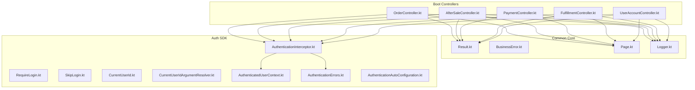
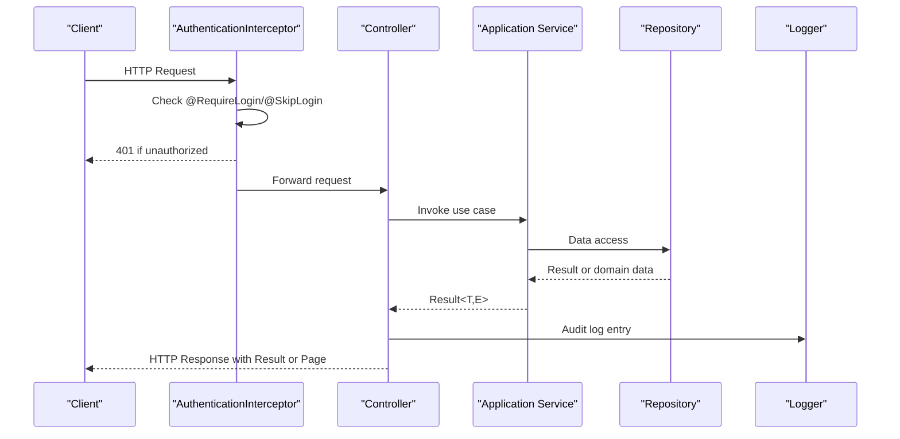
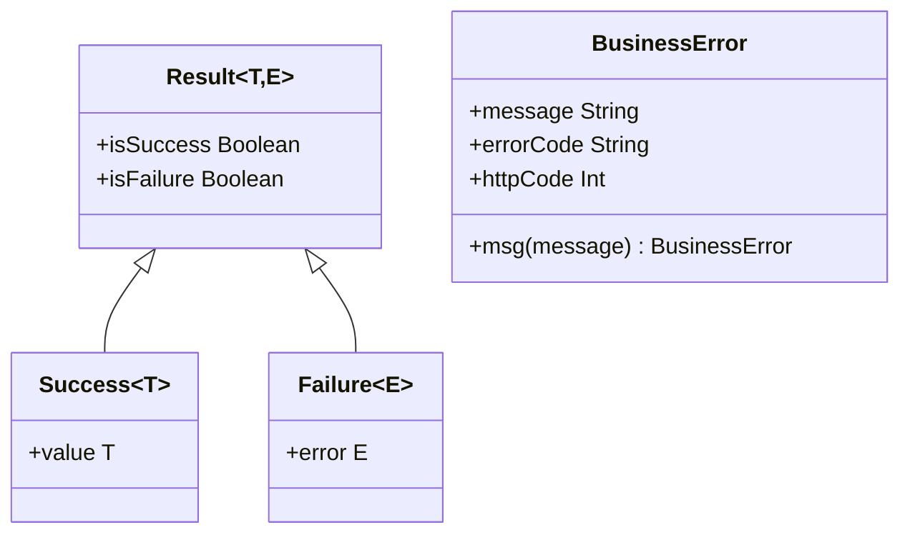
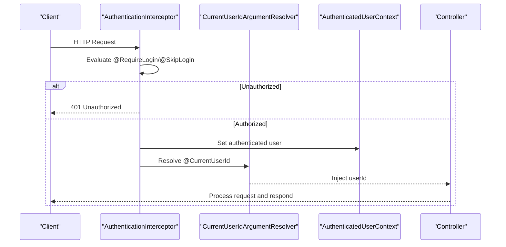
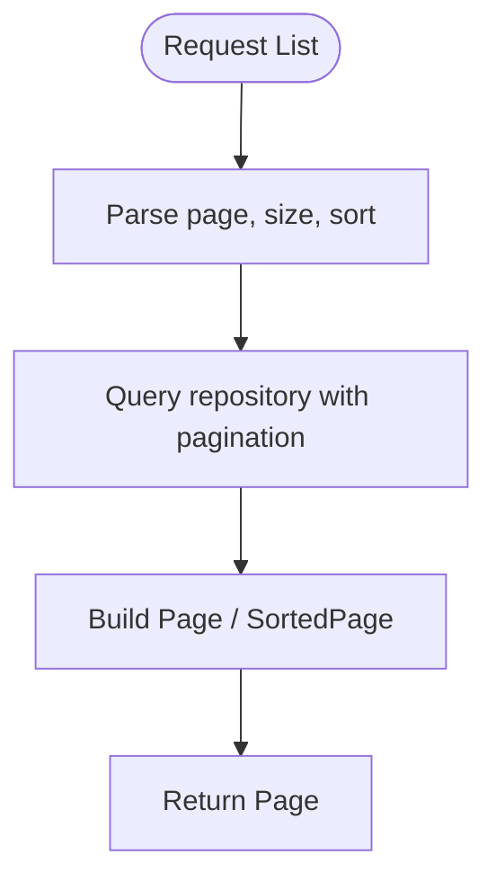
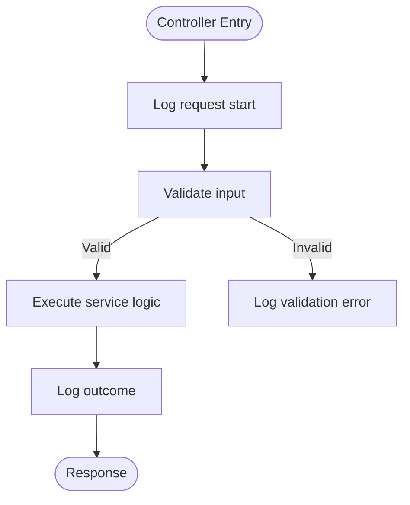
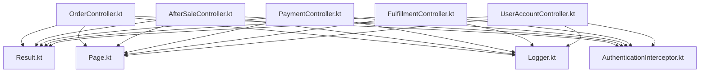

# Common API Patterns & Conventions

<cite>
**Referenced Files in This Document**
- [Result.kt](file://j-store-common-core/src/main/kotlin/com/jstore/common/utils/Result.kt)
- [BusinessError.kt](file://j-store-common-core/src/main/kotlin/com/jstore/common/errors/BusinessError.kt)
- [Page.kt](file://j-store-common-core/src/main/kotlin/com/jstore/common/query/Page.kt)
- [Logger.kt](file://j-store-common-core/src/main/kotlin/com/jstore/common/logging/Logger.kt)
- [RequireLogin.kt](file://j-store-authentication-spring-sdk/src/main/kotlin/com/jstore/authentication/annotation/RequireLogin.kt)
- [SkipLogin.kt](file://j-store-authentication-spring-sdk/src/main/kotlin/com/jstore/authentication/annotation/SkipLogin.kt)
- [CurrentUserId.kt](file://j-store-authentication-spring-sdk/src/main/kotlin/com/jstore/authentication/annotation/CurrentUserId.kt)
- [AuthenticationInterceptor.kt](file://j-store-authentication-spring-sdk/src/main/kotlin/com/jstore/authentication/spring/AuthenticationInterceptor.kt)
- [CurrentUserIdArgumentResolver.kt](file://j-store-authentication-spring-sdk/src/main/kotlin/com/jstore/authentication/spring/CurrentUserIdArgumentResolver.kt)
- [AuthenticatedUserContext.kt](file://j-store-authentication-spring-sdk/src/main/kotlin/com/jstore/authentication/context/AuthenticatedUserContext.kt)
- [AuthenticationErrors.kt](file://j-store-authentication-spring-sdk/src/main/kotlin/com/jstore/authentication/error/AuthenticationErrors.kt)
- [AuthenticationAutoConfiguration.kt](file://j-store-authentication-spring-sdk/src/main/kotlin/com/jstore/authentication/spring/AuthenticationAutoConfiguration.kt)
- [OrderController.kt](file://j-store-order-boot/src/main/kotlin/com/jstore/order/controller/OrderController.kt)
- [AfterSaleController.kt](file://j-store-order-boot/src/main/kotlin/com/jstore/order/controller/AfterSaleController.kt)
- [PaymentController.kt](file://j-store-payment-boot/src/main/kotlin/com/jstore/payment/controller/PaymentController.kt)
- [FulfillmentController.kt](file://j-store-fulfillment-boot/src/main/kotlin/com/jstore/fulfillment/controller/FulfillmentController.kt)
- [UserAccountController.kt](file://j-store-user-boot/src/main/kotlin/com/jstore/user/controller/UserAccountController.kt)
</cite>

## Table of Contents
1. [Introduction](#introduction)
2. [Project Structure](#project-structure)
3. [Core Components](#core-components)
4. [Architecture Overview](#architecture-overview)
5. [Detailed Component Analysis](#detailed-component-analysis)
6. [Dependency Analysis](#dependency-analysis)
7. [Performance Considerations](#performance-considerations)
8. [Troubleshooting Guide](#troubleshooting-guide)
9. [Conclusion](#conclusion)
10. [Appendices](#appendices)

## Introduction
This document defines the common API patterns and conventions used across the J-Store platform. It standardizes how responses are wrapped, how errors are represented, how authentication is enforced via annotations, how pagination is structured, and how logging and testing should be approached. The goal is to ensure consistency across all controllers and services, making client SDK development and integration predictable and reliable.

## Project Structure
The relevant components for API conventions live primarily in:
- j-store-common-core: shared utilities including Result wrapper, BusinessError, Page models, and Logger interface
- j-store-authentication-spring-sdk: Spring-based authentication with annotations and interceptors
- Boot modules (order, payment, fulfillment, user): controllers that implement the standardized patterns

**Diagram sources**
- [Result.kt:1-258](file://j-store-common-core/src/main/kotlin/com/jstore/common/utils/Result.kt#L1-L258)
- [BusinessError.kt:1-22](file://j-store-common-core/src/main/kotlin/com/jstore/common/errors/BusinessError.kt#L1-L22)
- [Page.kt:1-14](file://j-store-common-core/src/main/kotlin/com/jstore/common/query/Page.kt#L1-L14)
- [Logger.kt:1-38](file://j-store-common-core/src/main/kotlin/com/jstore/common/logging/Logger.kt#L1-L38)
- [RequireLogin.kt](file://j-store-authentication-spring-sdk/src/main/kotlin/com/jstore/authentication/annotation/RequireLogin.kt)
- [SkipLogin.kt](file://j-store-authentication-spring-sdk/src/main/kotlin/com/jstore/authentication/annotation/SkipLogin.kt)
- [CurrentUserId.kt](file://j-store-authentication-spring-sdk/src/main/kotlin/com/jstore/authentication/annotation/CurrentUserId.kt)
- [AuthenticationInterceptor.kt](file://j-store-authentication-spring-sdk/src/main/kotlin/com/jstore/authentication/spring/AuthenticationInterceptor.kt)
- [CurrentUserIdArgumentResolver.kt](file://j-store-authentication-spring-sdk/src/main/kotlin/com/jstore/authentication/spring/CurrentUserIdArgumentResolver.kt)
- [AuthenticatedUserContext.kt](file://j-store-authentication-spring-sdk/src/main/kotlin/com/jstore/authentication/context/AuthenticatedUserContext.kt)
- [AuthenticationErrors.kt](file://j-store-authentication-spring-sdk/src/main/kotlin/com/jstore/authentication/error/AuthenticationErrors.kt)
- [AuthenticationAutoConfiguration.kt](file://j-store-authentication-spring-sdk/src/main/kotlin/com/jstore/authentication/spring/AuthenticationAutoConfiguration.kt)
- [OrderController.kt](file://j-store-order-boot/src/main/kotlin/com/jstore/order/controller/OrderController.kt)
- [AfterSaleController.kt](file://j-store-order-boot/src/main/kotlin/com/jstore/order/controller/AfterSaleController.kt)
- [PaymentController.kt](file://j-store-payment-boot/src/main/kotlin/com/jstore/payment/controller/PaymentController.kt)
- [FulfillmentController.kt](file://j-store-fulfillment-boot/src/main/kotlin/com/jstore/fulfillment/controller/FulfillmentController.kt)
- [UserAccountController.kt](file://j-store-user-boot/src/main/kotlin/com/jstore/user/controller/UserAccountController.kt)

**Section sources**
- [Result.kt:1-258](file://j-store-common-core/src/main/kotlin/com/jstore/common/utils/Result.kt#L1-L258)
- [BusinessError.kt:1-22](file://j-store-common-core/src/main/kotlin/com/jstore/common/errors/BusinessError.kt#L1-L22)
- [Page.kt:1-14](file://j-store-common-core/src/main/kotlin/com/jstore/common/query/Page.kt#L1-L14)
- [Logger.kt:1-38](file://j-store-common-core/src/main/kotlin/com/jstore/common/logging/Logger.kt#L1-L38)
- [AuthenticationInterceptor.kt](file://j-store-authentication-spring-sdk/src/main/kotlin/com/jstore/authentication/spring/AuthenticationInterceptor.kt)
- [CurrentUserIdArgumentResolver.kt](file://j-store-authentication-spring-sdk/src/main/kotlin/com/jstore/authentication/spring/CurrentUserIdArgumentResolver.kt)
- [AuthenticatedUserContext.kt](file://j-store-authentication-spring-sdk/src/main/kotlin/com/jstore/authentication/context/AuthenticatedUserContext.kt)
- [AuthenticationErrors.kt](file://j-store-authentication-spring-sdk/src/main/kotlin/com/jstore/authentication/error/AuthenticationErrors.kt)
- [AuthenticationAutoConfiguration.kt](file://j-store-authentication-spring-sdk/src/main/kotlin/com/jstore/authentication/spring/AuthenticationAutoConfiguration.kt)

## Core Components
- Standardized response wrapper: Result<T, E> provides a type-safe success/failure model with utility methods for mapping, chaining, and safe unwrapping.
- Error model: BusinessError encapsulates message, errorCode, and httpCode; CommonBusinessError provides predefined error codes.
- Pagination: Page<T> and SortedPage<T> define consistent pagination contracts for list endpoints.
- Logging: Logger interface abstracts logging operations for consistent audit trails.
- Authentication annotations: @RequireLogin, @SkipLogin, and @CurrentUserId control access and inject authenticated user context.

Key implementation references:
- Result wrapper and utilities: [Result.kt:1-258](file://j-store-common-core/src/main/kotlin/com/jstore/common/utils/Result.kt#L1-L258)
- Business error definitions: [BusinessError.kt:1-22](file://j-store-common-core/src/main/kotlin/com/jstore/common/errors/BusinessError.kt#L1-L22)
- Pagination contract: [Page.kt:1-14](file://j-store-common-core/src/main/kotlin/com/jstore/common/query/Page.kt#L1-L14)
- Logging abstraction: [Logger.kt:1-38](file://j-store-common-core/src/main/kotlin/com/jstore/common/logging/Logger.kt#L1-L38)
- Auth annotations and interceptor: [RequireLogin.kt], [SkipLogin.kt], [CurrentUserId.kt], [AuthenticationInterceptor.kt]
- Current user injection: [CurrentUserIdArgumentResolver.kt], [AuthenticatedUserContext.kt]
- Auth error handling: [AuthenticationErrors.kt]
- Auto configuration: [AuthenticationAutoConfiguration.kt]

**Section sources**
- [Result.kt:1-258](file://j-store-common-core/src/main/kotlin/com/jstore/common/utils/Result.kt#L1-L258)
- [BusinessError.kt:1-22](file://j-store-common-core/src/main/kotlin/com/jstore/common/errors/BusinessError.kt#L1-L22)
- [Page.kt:1-14](file://j-store-common-core/src/main/kotlin/com/jstore/common/query/Page.kt#L1-L14)
- [Logger.kt:1-38](file://j-store-common-core/src/main/kotlin/com/jstore/common/logging/Logger.kt#L1-L38)
- [AuthenticationInterceptor.kt](file://j-store-authentication-spring-sdk/src/main/kotlin/com/jstore/authentication/spring/AuthenticationInterceptor.kt)
- [CurrentUserIdArgumentResolver.kt](file://j-store-authentication-spring-sdk/src/main/kotlin/com/jstore/authentication/spring/CurrentUserIdArgumentResolver.kt)
- [AuthenticatedUserContext.kt](file://j-store-authentication-spring-sdk/src/main/kotlin/com/jstore/authentication/context/AuthenticatedUserContext.kt)
- [AuthenticationErrors.kt](file://j-store-authentication-spring-sdk/src/main/kotlin/com/jstore/authentication/error/AuthenticationErrors.kt)
- [AuthenticationAutoConfiguration.kt](file://j-store-authentication-spring-sdk/src/main/kotlin/com/jstore/authentication/spring/AuthenticationAutoConfiguration.kt)

## Architecture Overview
The API layer follows a clear separation:
- Controllers expose endpoints and return Result-wrapped responses or Page data.
- Authentication is enforced by an interceptor based on annotations.
- Errors are modeled as BusinessError instances and mapped to HTTP responses.
- Logging is centralized through the Logger interface for auditability.

**Diagram sources**
- [AuthenticationInterceptor.kt](file://j-store-authentication-spring-sdk/src/main/kotlin/com/jstore/authentication/spring/AuthenticationInterceptor.kt)
- [OrderController.kt](file://j-store-order-boot/src/main/kotlin/com/jstore/order/controller/OrderController.kt)
- [AfterSaleController.kt](file://j-store-order-boot/src/main/kotlin/com/jstore/order/controller/AfterSaleController.kt)
- [PaymentController.kt](file://j-store-payment-boot/src/main/kotlin/com/jstore/payment/controller/PaymentController.kt)
- [FulfillmentController.kt](file://j-store-fulfillment-boot/src/main/kotlin/com/jstore/fulfillment/controller/FulfillmentController.kt)
- [UserAccountController.kt](file://j-store-user-boot/src/main/kotlin/com/jstore/user/controller/UserAccountController.kt)
- [Logger.kt:1-38](file://j-store-common-core/src/main/kotlin/com/jstore/common/logging/Logger.kt#L1-L38)

## Detailed Component Analysis

### Result Wrapper and Error Handling
- Success and Failure types provide explicit outcomes without exceptions for normal business flows.
- Utility functions support mapping, chaining, and safe unwrapping.
- BusinessError carries message, errorCode, and httpCode for consistent error payloads.

**Diagram sources**
- [Result.kt:1-258](file://j-store-common-core/src/main/kotlin/com/jstore/common/utils/Result.kt#L1-L258)
- [BusinessError.kt:1-22](file://j-store-common-core/src/main/kotlin/com/jstore/common/errors/BusinessError.kt#L1-L22)

**Section sources**
- [Result.kt:1-258](file://j-store-common-core/src/main/kotlin/com/jstore/common/utils/Result.kt#L1-L258)
- [BusinessError.kt:1-22](file://j-store-common-core/src/main/kotlin/com/jstore/common/errors/BusinessError.kt#L1-L22)

### Authentication Annotations and Interceptor Flow
- @RequireLogin enforces authentication before controller execution.
- @SkipLogin allows public endpoints.
- @CurrentUserId injects the authenticated user ID into controller method parameters.
- AuthenticationInterceptor validates tokens and sets context.
- CurrentUserIdArgumentResolver resolves the current user ID parameter.
- AuthenticatedUserContext holds the current user identity during request processing.
- AuthenticationErrors defines error messages for auth failures.

**Diagram sources**
- [AuthenticationInterceptor.kt](file://j-store-authentication-spring-sdk/src/main/kotlin/com/jstore/authentication/spring/AuthenticationInterceptor.kt)
- [CurrentUserIdArgumentResolver.kt](file://j-store-authentication-spring-sdk/src/main/kotlin/com/jstore/authentication/spring/CurrentUserIdArgumentResolver.kt)
- [AuthenticatedUserContext.kt](file://j-store-authentication-spring-sdk/src/main/kotlin/com/jstore/authentication/context/AuthenticatedUserContext.kt)
- [RequireLogin.kt](file://j-store-authentication-spring-sdk/src/main/kotlin/com/jstore/authentication/annotation/RequireLogin.kt)
- [SkipLogin.kt](file://j-store-authentication-spring-sdk/src/main/kotlin/com/jstore/authentication/annotation/SkipLogin.kt)
- [CurrentUserId.kt](file://j-store-authentication-spring-sdk/src/main/kotlin/com/jstore/authentication/annotation/CurrentUserId.kt)
- [AuthenticationErrors.kt](file://j-store-authentication-spring-sdk/src/main/kotlin/com/jstore/authentication/error/AuthenticationErrors.kt)

**Section sources**
- [AuthenticationInterceptor.kt](file://j-store-authentication-spring-sdk/src/main/kotlin/com/jstore/authentication/spring/AuthenticationInterceptor.kt)
- [CurrentUserIdArgumentResolver.kt](file://j-store-authentication-spring-sdk/src/main/kotlin/com/jstore/authentication/spring/CurrentUserIdArgumentResolver.kt)
- [AuthenticatedUserContext.kt](file://j-store-authentication-spring-sdk/src/main/kotlin/com/jstore/authentication/context/AuthenticatedUserContext.kt)
- [RequireLogin.kt](file://j-store-authentication-spring-sdk/src/main/kotlin/com/jstore/authentication/annotation/RequireLogin.kt)
- [SkipLogin.kt](file://j-store-authentication-spring-sdk/src/main/kotlin/com/jstore/authentication/annotation/SkipLogin.kt)
- [CurrentUserId.kt](file://j-store-authentication-spring-sdk/src/main/kotlin/com/jstore/authentication/annotation/CurrentUserId.kt)
- [AuthenticationErrors.kt](file://j-store-authentication-spring-sdk/src/main/kotlin/com/jstore/authentication/error/AuthenticationErrors.kt)

### Pagination Conventions
- Use Page<T> for generic pagination responses.
- SortedPage<T> provides concrete implementation with currentPage, totalElements, and records.
- Endpoints returning lists should accept standard pagination parameters (e.g., page number, size, sort fields).

**Diagram sources**
- [Page.kt:1-14](file://j-store-common-core/src/main/kotlin/com/jstore/common/query/Page.kt#L1-L14)

**Section sources**
- [Page.kt:1-14](file://j-store-common-core/src/main/kotlin/com/jstore/common/query/Page.kt#L1-L14)

### Logging Standards and Audit Trail
- Use Logger interface for consistent logging across modules.
- Log key events: request start/end, business decisions, errors, and idempotency checks.
- Include contextual information such as userId, requestId, and operation name.

**Diagram sources**
- [Logger.kt:1-38](file://j-store-common-core/src/main/kotlin/com/jstore/common/logging/Logger.kt#L1-L38)

**Section sources**
- [Logger.kt:1-38](file://j-store-common-core/src/main/kotlin/com/jstore/common/logging/Logger.kt#L1-L38)

### Request Validation and Input Sanitization
- Validate inputs at controller boundaries using framework validators.
- Sanitize strings and enforce constraints (length, format, allowed values).
- Map validation failures to BusinessError.INVALID_PARAM with appropriate errorCode and httpCode.

[No sources needed since this section provides general guidance]

### Rate Limiting Strategies and Throttling Mechanisms
- Implement rate limiting at gateway or interceptor level.
- Track per-client request counts and apply throttling policies.
- Return standardized error responses when limits are exceeded.

[No sources needed since this section provides general guidance]

### API Versioning, Backward Compatibility, and Deprecation Policies
- Version APIs via URL path or header negotiation.
- Maintain backward compatibility by deprecating fields gradually.
- Document deprecation timelines and migration guides.

[No sources needed since this section provides general guidance]

### Client SDK Development Guidelines and Error Handling Strategies
- Use Result<T, E> to handle success and failure uniformly.
- Map BusinessError to SDK-specific exceptions with errorCode and message.
- Provide retry strategies for transient errors and idempotent requests.

[No sources needed since this section provides general guidance]

### Testing Approaches for API Endpoints
- Use MockMvc for controller-level tests.
- Mock repositories and external dependencies.
- Create test fixtures for common entities and scenarios.
- Verify authentication behavior with @RequireLogin and @SkipLogin.

[No sources needed since this section provides general guidance]

## Dependency Analysis
Controllers depend on authentication infrastructure, logging, and shared result/pagination models.

**Diagram sources**
- [OrderController.kt](file://j-store-order-boot/src/main/kotlin/com/jstore/order/controller/OrderController.kt)
- [AfterSaleController.kt](file://j-store-order-boot/src/main/kotlin/com/jstore/order/controller/AfterSaleController.kt)
- [PaymentController.kt](file://j-store-payment-boot/src/main/kotlin/com/jstore/payment/controller/PaymentController.kt)
- [FulfillmentController.kt](file://j-store-fulfillment-boot/src/main/kotlin/com/jstore/fulfillment/controller/FulfillmentController.kt)
- [UserAccountController.kt](file://j-store-user-boot/src/main/kotlin/com/jstore/user/controller/UserAccountController.kt)
- [Result.kt:1-258](file://j-store-common-core/src/main/kotlin/com/jstore/common/utils/Result.kt#L1-L258)
- [Page.kt:1-14](file://j-store-common-core/src/main/kotlin/com/jstore/common/query/Page.kt#L1-L14)
- [Logger.kt:1-38](file://j-store-common-core/src/main/kotlin/com/jstore/common/logging/Logger.kt#L1-L38)
- [AuthenticationInterceptor.kt](file://j-store-authentication-spring-sdk/src/main/kotlin/com/jstore/authentication/spring/AuthenticationInterceptor.kt)

**Section sources**
- [OrderController.kt](file://j-store-order-boot/src/main/kotlin/com/jstore/order/controller/OrderController.kt)
- [AfterSaleController.kt](file://j-store-order-boot/src/main/kotlin/com/jstore/order/controller/AfterSaleController.kt)
- [PaymentController.kt](file://j-store-payment-boot/src/main/kotlin/com/jstore/payment/controller/PaymentController.kt)
- [FulfillmentController.kt](file://j-store-fulfillment-boot/src/main/kotlin/com/jstore/fulfillment/controller/FulfillmentController.kt)
- [UserAccountController.kt](file://j-store-user-boot/src/main/kotlin/com/jstore/user/controller/UserAccountController.kt)
- [Result.kt:1-258](file://j-store-common-core/src/main/kotlin/com/jstore/common/utils/Result.kt#L1-L258)
- [Page.kt:1-14](file://j-store-common-core/src/main/kotlin/com/jstore/common/query/Page.kt#L1-L14)
- [Logger.kt:1-38](file://j-store-common-core/src/main/kotlin/com/jstore/common/logging/Logger.kt#L1-L38)
- [AuthenticationInterceptor.kt](file://j-store-authentication-spring-sdk/src/main/kotlin/com/jstore/authentication/spring/AuthenticationInterceptor.kt)

## Performance Considerations
- Prefer Result-based flows over exceptions for expected business failures to reduce overhead.
- Use pagination to limit payload sizes and database queries.
- Cache frequently accessed read-only data where appropriate.
- Avoid N+1 queries by batching or using joins.

[No sources needed since this section provides general guidance]

## Troubleshooting Guide
- Authentication failures: Check token validity and interceptor configuration.
- Validation errors: Ensure input constraints match BusinessError.INVALID_PARAM usage.
- Pagination issues: Verify page and size parameters are within bounds.
- Logging gaps: Confirm Logger calls are present at critical points.

**Section sources**
- [AuthenticationErrors.kt](file://j-store-authentication-spring-sdk/src/main/kotlin/com/jstore/authentication/error/AuthenticationErrors.kt)
- [BusinessError.kt:1-22](file://j-store-common-core/src/main/kotlin/com/jstore/common/errors/BusinessError.kt#L1-L22)
- [Page.kt:1-14](file://j-store-common-core/src/main/kotlin/com/jstore/common/query/Page.kt#L1-L14)
- [Logger.kt:1-38](file://j-store-common-core/src/main/kotlin/com/jstore/common/logging/Logger.kt#L1-L38)

## Conclusion
By adopting these standardized patterns—Result wrapper, BusinessError, Page pagination, annotation-driven authentication, and consistent logging—the J-Store platform ensures predictable, maintainable, and secure APIs. Following these conventions simplifies client SDK development, improves error handling, and enhances observability.

[No sources needed since this section summarizes without analyzing specific files]

## Appendices
- Best practices checklist for new endpoints:
  - Wrap responses with Result<T, E> or return Page<T>.
  - Use @RequireLogin or @SkipLogin appropriately.
  - Inject @CurrentUserId where needed.
  - Log key operations and errors.
  - Validate inputs and map to BusinessError.
  - Test with MockMvc and fixtures.

[No sources needed since this section provides general guidance]