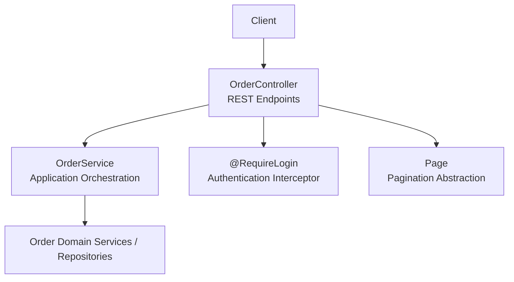
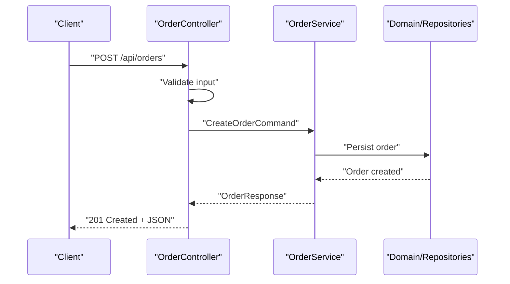
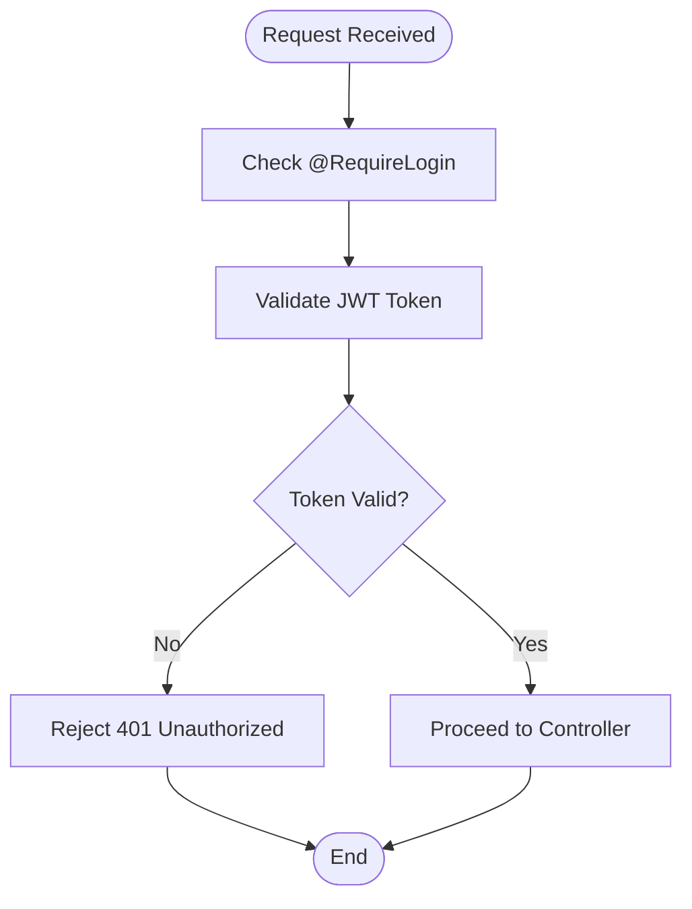
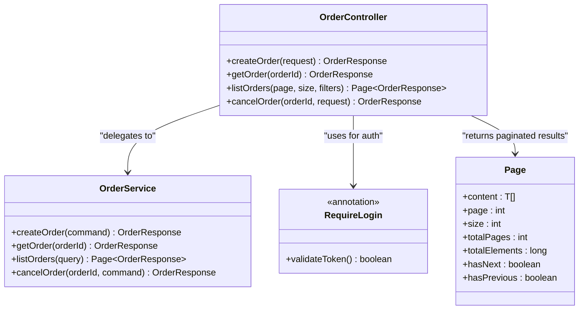

# Order Management API

<cite>
**Referenced Files in This Document**
- [OrderController.kt](file://j-store-order-boot/src/main/kotlin/com/jstore/order/controller/OrderController.kt)
- [OrderService.kt](file://j-store-order-application/src/main/kotlin/com/jstore/order/service/OrderService.kt)
- [RequireLogin.kt](file://j-store-authentication-spring-sdk/src/main/kotlin/com/jstore/authentication/annotation/RequireLogin.kt)
- [Page.kt](file://j-store-common-core/src/main/kotlin/com/jstore/common/query/Page.kt)
- [V20260731__order_status_dimensions.sql](file://j-store-boot/src/main/resources/db/migration/V20260731__order_status_dimensions.sql)
</cite>

## Table of Contents
1. [Introduction](#introduction)
2. [Project Structure](#project-structure)
3. [Core Components](#core-components)
4. [Architecture Overview](#architecture-overview)
5. [Detailed Component Analysis](#detailed-component-analysis)
6. [Dependency Analysis](#dependency-analysis)
7. [Performance Considerations](#performance-considerations)
8. [Troubleshooting Guide](#troubleshooting-guide)
9. [Conclusion](#conclusion)

## Introduction
This document provides the API specification for the Order Management REST endpoints exposed by the j-store application. It covers order creation, retrieval, listing with pagination, and cancellation. It also documents authentication requirements using the @RequireLogin annotation and JWT token validation, request/response schemas, error handling, and practical usage examples.

## Project Structure
The Order Management API is implemented as a Spring Boot module that exposes HTTP endpoints through a controller and delegates business logic to an application service. Authentication is enforced via a shared SDK annotation. Pagination support is provided by a common query abstraction.



**Diagram sources**
- [OrderController.kt](file://j-store-order-boot/src/main/kotlin/com/jstore/order/controller/OrderController.kt)
- [OrderService.kt](file://j-store-order-application/src/main/kotlin/com/jstore/order/service/OrderService.kt)
- [RequireLogin.kt](file://j-store-authentication-spring-sdk/src/main/kotlin/com/jstore/authentication/annotation/RequireLogin.kt)
- [Page.kt](file://j-store-common-core/src/main/kotlin/com/jstore/common/query/Page.kt)

**Section sources**
- [OrderController.kt](file://j-store-order-boot/src/main/kotlin/com/jstore/order/controller/OrderController.kt)
- [OrderService.kt](file://j-store-order-application/src/main/kotlin/com/jstore/order/service/OrderService.kt)
- [RequireLogin.kt](file://j-store-authentication-spring-sdk/src/main/kotlin/com/jstore/authentication/annotation/RequireLogin.kt)
- [Page.kt](file://j-store-common-core/src/main/kotlin/com/jstore/common/query/Page.kt)

## Core Components
- OrderController: Exposes REST endpoints for order operations (create, get, list, cancel).
- OrderService: Orchestrates order use cases and interacts with domain services/repositories.
- RequireLogin: Annotation used to enforce login and validate JWT tokens on protected endpoints.
- Page<T>: Generic pagination wrapper used by list endpoints.

Key responsibilities:
- Input validation and mapping to domain commands.
- Enforcing authentication and authorization.
- Returning standardized responses and errors.
- Supporting pagination and filtering where applicable.

**Section sources**
- [OrderController.kt](file://j-store-order-boot/src/main/kotlin/com/jstore/order/controller/OrderController.kt)
- [OrderService.kt](file://j-store-order-application/src/main/kotlin/com/jstore/order/service/OrderService.kt)
- [RequireLogin.kt](file://j-store-authentication-spring-sdk/src/main/kotlin/com/jstore/authentication/annotation/RequireLogin.kt)
- [Page.kt](file://j-store-common-core/src/main/kotlin/com/jstore/common/query/Page.kt)

## Architecture Overview
The Order Management API follows a layered architecture:
- Presentation Layer: OrderController handles HTTP requests/responses.
- Application Layer: OrderService implements use cases and orchestrates domain interactions.
- Domain Layer: Encapsulates order business rules and state transitions.
- Infrastructure Layer: Persistence and external integrations are abstracted behind interfaces.



**Diagram sources**
- [OrderController.kt](file://j-store-order-boot/src/main/kotlin/com/jstore/order/controller/OrderController.kt)
- [OrderService.kt](file://j-store-order-application/src/main/kotlin/com/jstore/order/service/OrderService.kt)

## Detailed Component Analysis

### Authentication Requirements
- All order endpoints require authentication via the @RequireLogin annotation.
- The system validates JWT tokens presented in the Authorization header.
- Requests without valid tokens will be rejected before reaching the controller logic.



**Diagram sources**
- [RequireLogin.kt](file://j-store-authentication-spring-sdk/src/main/kotlin/com/jstore/authentication/annotation/RequireLogin.kt)

**Section sources**
- [RequireLogin.kt](file://j-store-authentication-spring-sdk/src/main/kotlin/com/jstore/authentication/annotation/RequireLogin.kt)

### Create Order Endpoint
- Method: POST
- Path: /api/orders
- Authentication: Required (@RequireLogin)
- Request Body: CreateOrderRequest
- Response: OrderResponse (201 Created)

CreateOrderRequest Schema:
- recipientInfo: RecipientInfoRequest
- items: List<OrderItemRequest>
- shippingAddressId: Long
- paymentMethodId: Long
- couponCode: String (optional)
- notes: String (optional)

RecipientInfoRequest Schema:
- name: String
- phone: String
- email: String
- addressLine1: String
- addressLine2: String (optional)
- city: String
- state: String
- postalCode: String
- country: String

OrderItemRequest Schema:
- skuId: Long
- quantity: Integer
- unitPrice: Decimal
- currency: String

OrderResponse Schema:
- orderId: Long
- status: String
- totalAmount: Decimal
- currency: String
- createdAt: Timestamp
- items: List<OrderItemResponse>

OrderItemResponse Schema:
- itemId: Long
- skuId: Long
- productName: String
- quantity: Integer
- unitPrice: Decimal
- totalPrice: Decimal

Example Request:
```json
{
  "recipientInfo": {
    "name": "John Doe",
    "phone": "+1234567890",
    "email": "john@example.com",
    "addressLine1": "123 Main St",
    "city": "New York",
    "state": "NY",
    "postalCode": "10001",
    "country": "US"
  },
  "items": [
    {
      "skuId": 12345,
      "quantity": 2,
      "unitPrice": 29.99,
      "currency": "USD"
    }
  ],
  "shippingAddressId": 1001,
  "paymentMethodId": 2001,
  "notes": "Please deliver before 5 PM"
}
```

Example Response:
```json
{
  "orderId": 5001,
  "status": "CREATED",
  "totalAmount": 59.98,
  "currency": "USD",
  "createdAt": "2024-01-15T10:30:00Z",
  "items": [
    {
      "itemId": 6001,
      "skuId": 12345,
      "productName": "Wireless Headphones",
      "quantity": 2,
      "unitPrice": 29.99,
      "totalPrice": 59.98
    }
  ]
}
```

**Section sources**
- [OrderController.kt](file://j-store-order-boot/src/main/kotlin/com/jstore/order/controller/OrderController.kt)
- [OrderService.kt](file://j-store-order-application/src/main/kotlin/com/jstore/order/service/OrderService.kt)

### Get Order Endpoint
- Method: GET
- Path: /api/orders/{orderId}
- Authentication: Required (@RequireLogin)
- Path Parameter: orderId (Long)
- Response: OrderResponse (200 OK) or 404 Not Found

Example Request:
```
GET /api/orders/5001
Authorization: Bearer <jwt_token>
```

Example Response:
```json
{
  "orderId": 5001,
  "status": "ACTIVE",
  "totalAmount": 59.98,
  "currency": "USD",
  "createdAt": "2024-01-15T10:30:00Z",
  "updatedAt": "2024-01-15T11:00:00Z",
  "items": [
    {
      "itemId": 6001,
      "skuId": 12345,
      "productName": "Wireless Headphones",
      "quantity": 2,
      "unitPrice": 29.99,
      "totalPrice": 59.98
    }
  ]
}
```

**Section sources**
- [OrderController.kt](file://j-store-order-boot/src/main/kotlin/com/jstore/order/controller/OrderController.kt)
- [OrderService.kt](file://j-store-order-application/src/main/kotlin/com/jstore/order/service/OrderService.kt)

### List Orders Endpoint
- Method: GET
- Path: /api/orders
- Authentication: Required (@RequireLogin)
- Query Parameters:
  - page: Integer (default: 0)
  - size: Integer (default: 20, max: 100)
  - status: String (optional filter by order status)
  - startDate: String (optional, ISO 8601 format)
  - endDate: String (optional, ISO 8601 format)
- Response: Page<OrderResponse> (200 OK)

Page Schema:
- content: List<OrderResponse>
- page: Integer
- size: Integer
- totalPages: Integer
- totalElements: Long
- hasNext: Boolean
- hasPrevious: Boolean

Example Request:
```
GET /api/orders?page=0&size=10&status=ACTIVE&startDate=2024-01-01T00:00:00Z&endDate=2024-01-31T23:59:59Z
Authorization: Bearer <jwt_token>
```

Example Response:
```json
{
  "content": [
    {
      "orderId": 5001,
      "status": "ACTIVE",
      "totalAmount": 59.98,
      "currency": "USD",
      "createdAt": "2024-01-15T10:30:00Z"
    },
    {
      "orderId": 5002,
      "status": "CREATED",
      "totalAmount": 120.00,
      "currency": "USD",
      "createdAt": "2024-01-15T11:00:00Z"
    }
  ],
  "page": 0,
  "size": 10,
  "totalPages": 1,
  "totalElements": 2,
  "hasNext": false,
  "hasPrevious": false
}
```

**Section sources**
- [OrderController.kt](file://j-store-order-boot/src/main/kotlin/com/jstore/order/controller/OrderController.kt)
- [OrderService.kt](file://j-store-order-application/src/main/kotlin/com/jstore/order/service/OrderService.kt)
- [Page.kt](file://j-store-common-core/src/main/kotlin/com/jstore/common/query/Page.kt)

### Cancel Order Endpoint
- Method: POST
- Path: /api/orders/{orderId}/cancel
- Authentication: Required (@RequireLogin)
- Path Parameter: orderId (Long)
- Request Body: CancelOrderRequest
- Response: OrderResponse (200 OK) or appropriate error status

CancelOrderRequest Schema:
- reason: String
- category: String (e.g., "CUSTOMER_REQUEST", "PAYMENT_FAILED", "INVENTORY_ISSUE")
- description: String (optional)

Example Request:
```json
{
  "reason": "Customer changed mind",
  "category": "CUSTOMER_REQUEST",
  "description": "Ordered wrong item by mistake"
}
```

Example Response:
```json
{
  "orderId": 5001,
  "status": "CLOSED",
  "totalAmount": 59.98,
  "currency": "USD",
  "createdAt": "2024-01-15T10:30:00Z",
  "updatedAt": "2024-01-15T12:00:00Z",
  "cancelledAt": "2024-01-15T12:00:00Z",
  "cancellationReason": "Customer changed mind",
  "items": []
}
```

**Section sources**
- [OrderController.kt](file://j-store-order-boot/src/main/kotlin/com/jstore/order/controller/OrderController.kt)
- [OrderService.kt](file://j-store-order-application/src/main/kotlin/com/jstore/order/service/OrderService.kt)

## Dependency Analysis
The Order Management API has the following key dependencies:



**Diagram sources**
- [OrderController.kt](file://j-store-order-boot/src/main/kotlin/com/jstore/order/controller/OrderController.kt)
- [OrderService.kt](file://j-store-order-application/src/main/kotlin/com/jstore/order/service/OrderService.kt)
- [RequireLogin.kt](file://j-store-authentication-spring-sdk/src/main/kotlin/com/jstore/authentication/annotation/RequireLogin.kt)
- [Page.kt](file://j-store-common-core/src/main/kotlin/com/jstore/common/query/Page.kt)

**Section sources**
- [OrderController.kt](file://j-store-order-boot/src/main/kotlin/com/jstore/order/controller/OrderController.kt)
- [OrderService.kt](file://j-store-order-application/src/main/kotlin/com/jstore/order/service/OrderService.kt)
- [RequireLogin.kt](file://j-store-authentication-spring-sdk/src/main/kotlin/com/jstore/authentication/annotation/RequireLogin.kt)
- [Page.kt](file://j-store-common-core/src/main/kotlin/com/jstore/common/query/Page.kt)

## Performance Considerations
- Pagination: Use appropriate page sizes (recommended: 10-50) to avoid large result sets.
- Indexing: Ensure database indexes exist for frequently queried fields like status and timestamps.
- Caching: Consider caching order details for read-heavy scenarios.
- Connection Pooling: Configure appropriate connection pool sizes for database operations.
- Request Validation: Implement server-side validation to reduce unnecessary processing.

## Troubleshooting Guide

### Common Error Responses
All endpoints return standardized error responses in ErrorResponse format:

ErrorResponse Schema:
- message: String (human-readable error message)
- errorCode: String (machine-readable error code)
- timestamp: Timestamp (when the error occurred)
- path: String (the API path that caused the error)
- details: Map<String, String> (additional error details)

Common Error Codes:
- AUTHENTICATION_FAILED: Invalid or missing JWT token
- ORDER_NOT_FOUND: Order ID does not exist
- INVALID_REQUEST: Malformed request body or invalid parameters
- BUSINESS_ERROR: Business rule violation (e.g., order cannot be cancelled)
- INTERNAL_SERVER_ERROR: Unexpected server error

Example Error Response:
```json
{
  "message": "Order not found",
  "errorCode": "ORDER_NOT_FOUND",
  "timestamp": "2024-01-15T12:00:00Z",
  "path": "/api/orders/9999",
  "details": {
    "orderId": "9999"
  }
}
```

### Debugging Tips
- Enable detailed logging in development environments
- Use correlation IDs for request tracing
- Monitor API response times and error rates
- Validate JWT tokens using debugging tools
- Check database connectivity and query performance

**Section sources**
- [OrderController.kt](file://j-store-order-boot/src/main/kotlin/com/jstore/order/controller/OrderController.kt)
- [OrderService.kt](file://j-store-order-application/src/main/kotlin/com/jstore/order/service/OrderService.kt)

## Conclusion
The Order Management API provides comprehensive functionality for order lifecycle management with robust authentication, pagination, and error handling. The modular architecture ensures maintainability and scalability while providing clear separation of concerns between presentation, application, and domain layers.

Key benefits:
- Secure authentication via JWT tokens
- Flexible pagination and filtering capabilities
- Comprehensive error handling with standardized responses
- Clear API contracts with well-defined schemas
- Scalable architecture supporting future enhancements