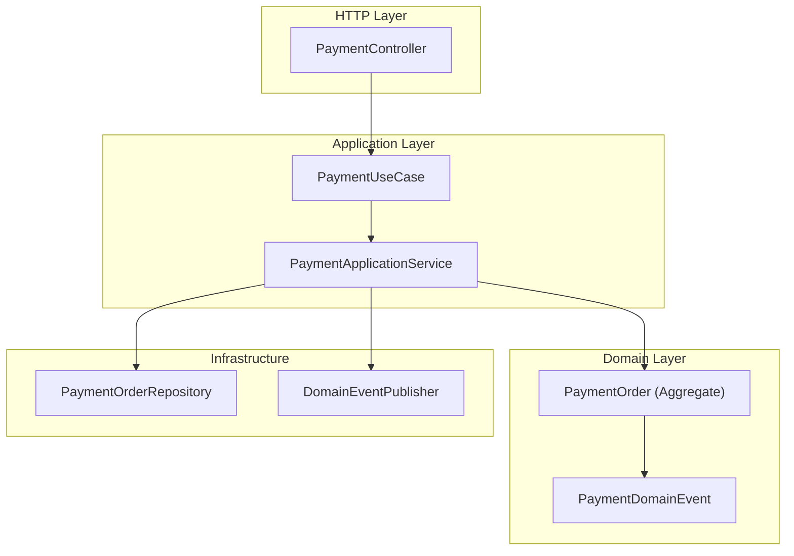
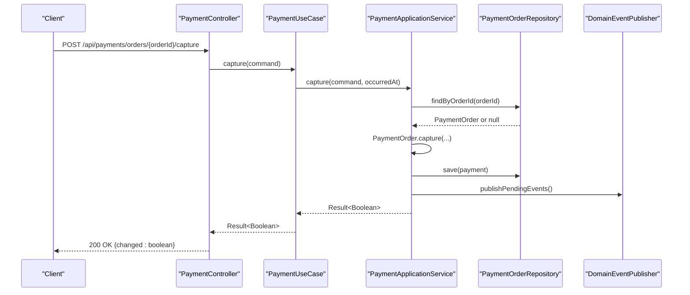
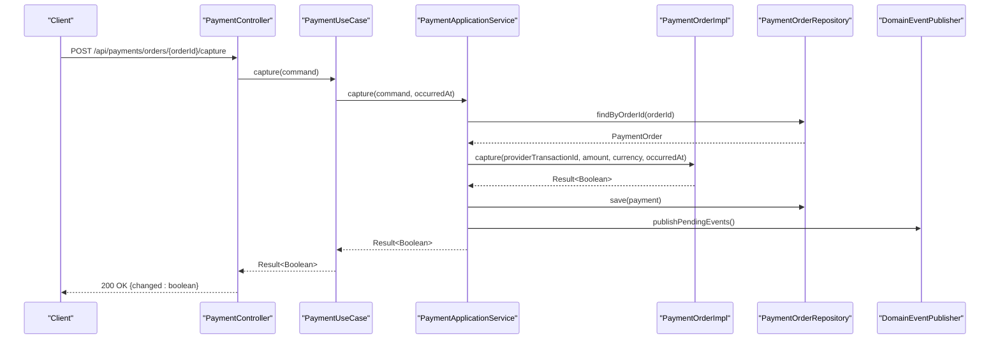
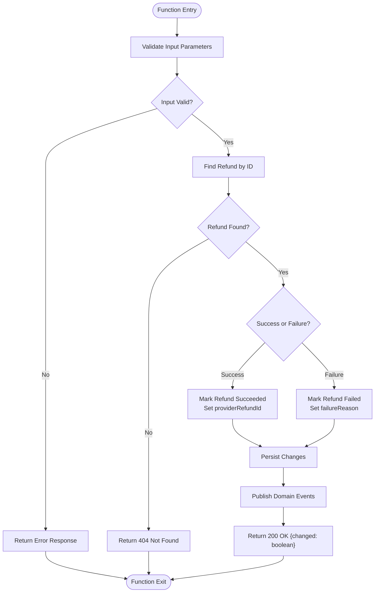

# Payment Processing API

<cite>
**Referenced Files in This Document**
- [PaymentController.kt](file://j-store-payment-boot/src/main/kotlin/com/jstore/payment/controller/PaymentController.kt)
- [PaymentUseCase.kt](file://j-store-payment-application/src/main/kotlin/com/jstore/payment/service/PaymentUseCase.kt)
- [PaymentApplicationService.kt](file://j-store-payment-application/src/main/kotlin/com/jstore/payment/service/PaymentApplicationService.kt)
- [PaymentOrder.kt](file://j-store-payment-domain/src/main/kotlin/com/jstore/payment/domain/payment/PaymentOrder.kt)
- [PaymentOrderImpl.kt](file://j-store-payment-domain/src/main/kotlin/com/jstore/payment/domain/payment/PaymentOrderImpl.kt)
- [PaymentErrors.kt](file://j-store-payment-domain/src/main/kotlin/com/jstore/payment/domain/payment/PaymentErrors.kt)
- [PaymentEvents.kt](file://j-store-payment-domain/src/main/kotlin/com/jstore/payment/domain/payment/event/PaymentEvents.kt)
- [Price.kt](file://j-store-common-core/src/main/kotlin/com/jstore/common/properties/Price.kt)
- [RequireLogin.kt](file://j-store-authentication-spring-sdk/src/main/kotlin/com/jstore/authentication/annotation/RequireLogin.kt)
- [PaymentIntegrationMessageHandlers.kt](file://j-store-payment-application/src/main/kotlin/com/jstore/payment/service/PaymentIntegrationMessageHandlers.kt)
</cite>

## Table of Contents
1. [Introduction](#introduction)
2. [Project Structure](#project-structure)
3. [Core Components](#core-components)
4. [Architecture Overview](#architecture-overview)
5. [Detailed Component Analysis](#detailed-component-analysis)
6. [Dependency Analysis](#dependency-analysis)
7. [Performance Considerations](#performance-considerations)
8. [Troubleshooting Guide](#troubleshooting-guide)
9. [Conclusion](#conclusion)
10. [Appendices](#appendices)

## Introduction
This document provides comprehensive API documentation for the Payment Processing REST endpoints exposed by the payment module. It covers payment initiation, status checking, and refund processing workflows, including request/response schemas, authentication and security requirements, error handling, idempotency considerations, webhook patterns for asynchronous confirmations, currency support, amount validation, and integration points with external payment gateways and internal accounting systems.

## Project Structure
The payment functionality is implemented across three layers:
- Controller layer (HTTP endpoints)
- Application layer (use cases and orchestration)
- Domain layer (business logic, state transitions, events)

**Diagram sources**
- [PaymentController.kt](file://j-store-payment-boot/src/main/kotlin/com/jstore/payment/controller/PaymentController.kt)
- [PaymentUseCase.kt](file://j-store-payment-application/src/main/kotlin/com/jstore/payment/service/PaymentUseCase.kt)
- [PaymentApplicationService.kt](file://j-store-payment-application/src/main/kotlin/com/jstore/payment/service/PaymentApplicationService.kt)
- [PaymentOrder.kt](file://j-store-payment-domain/src/main/kotlin/com/jstore/payment/domain/payment/PaymentOrder.kt)
- [PaymentEvents.kt](file://j-store-payment-domain/src/main/kotlin/com/jstore/payment/domain/payment/event/PaymentEvents.kt)

**Section sources**
- [PaymentController.kt](file://j-store-payment-boot/src/main/kotlin/com/jstore/payment/controller/PaymentController.kt)
- [PaymentUseCase.kt](file://j-store-payment-application/src/main/kotlin/com/jstore/payment/service/PaymentUseCase.kt)
- [PaymentApplicationService.kt](file://j-store-payment-application/src/main/kotlin/com/jstore/payment/service/PaymentApplicationService.kt)
- [PaymentOrder.kt](file://j-store-payment-domain/src/main/kotlin/com/jstore/payment/domain/payment/PaymentOrder.kt)
- [PaymentEvents.kt](file://j-store-payment-domain/src/main/kotlin/com/jstore/payment/domain/payment/event/PaymentEvents.kt)

## Core Components
- PaymentController: Exposes HTTP endpoints for payment capture and refund result callbacks; enforces login and merchant authorization.
- PaymentUseCase: Defines the application-level operations for creating payments, capturing, requesting/retrying refunds, and marking refund outcomes.
- PaymentApplicationService: Implements use case logic, persists changes, and publishes domain events.
- PaymentOrder (Aggregate): Encapsulates payment state machine, validations, and event emission.
- Price: Value object representing monetary amounts in cents to avoid floating-point precision issues.
- RequireLogin: Annotation enforcing authentication on endpoints.

Key responsibilities:
- Input validation and mapping to domain models
- State transitions and business rule enforcement
- Event-driven integration with other modules (e.g., accounting)

**Section sources**
- [PaymentController.kt](file://j-store-payment-boot/src/main/kotlin/com/jstore/payment/controller/PaymentController.kt)
- [PaymentUseCase.kt](file://j-store-payment-application/src/main/kotlin/com/jstore/payment/service/PaymentUseCase.kt)
- [PaymentApplicationService.kt](file://j-store-payment-application/src/main/kotlin/com/jstore/payment/service/PaymentApplicationService.kt)
- [PaymentOrder.kt](file://j-store-payment-domain/src/main/kotlin/com/jstore/payment/domain/payment/PaymentOrder.kt)
- [Price.kt](file://j-store-common-core/src/main/kotlin/com/jstore/common/properties/Price.kt)
- [RequireLogin.kt](file://j-store-authentication-spring-sdk/src/main/kotlin/com/jstore/authentication/annotation/RequireLogin.kt)

## Architecture Overview
The payment system follows a layered architecture with clear separation between HTTP, application, and domain concerns. Events are used to integrate with downstream systems such as accounting and fulfillment.

**Diagram sources**
- [PaymentController.kt](file://j-store-payment-boot/src/main/kotlin/com/jstore/payment/controller/PaymentController.kt)
- [PaymentUseCase.kt](file://j-store-payment-application/src/main/kotlin/com/jstore/payment/service/PaymentUseCase.kt)
- [PaymentApplicationService.kt](file://j-store-payment-application/src/main/kotlin/com/jstore/payment/service/PaymentApplicationService.kt)

## Detailed Component Analysis

### REST Endpoints

Base path: /api/payments

Authentication:
- All endpoints require login via @RequireLogin.
- Merchant authorization is enforced per resource using MerchantPermission checks.

Endpoints:
- GET /api/payments/orders/{orderId}
  - Purpose: Retrieve payment details for an order.
  - Authorization: Requires login and PAYMENT_READ permission for the merchant associated with the order.
  - Response schema:
    - id: Long
    - orderId: Long
    - merchantId: Long
    - payableAmount: Long (cents)
    - currency: String (ISO 4217, e.g., "CNY")
    - status: String (one of PENDING, CAPTURED, PARTIALLY_REFUNDED, REFUNDED)
    - providerTransactionId: String?
    - refunds: Array of RefundResponse
      - id: Long
      - afterSaleId: Long
      - amount: Long (cents)
      - status: String (PENDING, SUCCEEDED, FAILED)
      - failureReason: String?

- POST /api/payments/orders/{orderId}/capture
  - Purpose: Capture payment for an order (provider-side confirmation).
  - Authorization: Requires login and PAYMENT_MANAGE permission for the merchant associated with the order.
  - Request body:
    - providerTransactionId: String (non-blank)
    - amount: Long (cents)
    - currency: String (default "CNY", must match payment currency)
  - Response:
    - 200 OK: { changed: boolean }
    - Error responses follow standard ErrorResponse format.

- POST /api/payments/refunds/{refundId}/result
  - Purpose: Report refund outcome from provider (success or failure).
  - Authorization: Requires login and PAYMENT_MANAGE permission for the merchant associated with the refund.
  - Request body:
    - providerRefundId: String? (required when success)
    - failureReason: String? (required when failure)
  - Response:
    - 200 OK: { changed: boolean }
    - Error responses follow standard ErrorResponse format.

Error response schema:
- message: String
- errorCode: String

Notes:
- Amounts are represented in cents (integer) to ensure precision.
- Currency codes must be valid ISO 4217 three-letter codes.
- The capture endpoint validates that the provided amount equals the payable amount and currency matches the payment record.

**Section sources**
- [PaymentController.kt](file://j-store-payment-boot/src/main/kotlin/com/jstore/payment/controller/PaymentController.kt)
- [PaymentErrors.kt](file://j-store-payment-domain/src/main/kotlin/com/jstore/payment/domain/payment/PaymentErrors.kt)
- [Price.kt](file://j-store-common-core/src/main/kotlin/com/jstore/common/properties/Price.kt)

### Payment Initiation (Create Payment)
While not exposed directly via REST in the controller, payment creation is supported through application use cases and integration messages:
- Use case: createForOrder(request)
- Integration command handler: CreatePaymentForOrderCommandHandler maps incoming commands to create payment records.

Request schema (application level):
- orderId: Long
- merchantId: Long
- payableAmount: Price (cents)
- currency: String

Behavior:
- Idempotent creation: If a payment already exists with matching merchant, amount, and currency, it returns the existing record; otherwise creates a new one.
- Publishes pending domain events upon successful creation.

**Section sources**
- [PaymentUseCase.kt](file://j-store-payment-application/src/main/kotlin/com/jstore/payment/service/PaymentUseCase.kt)
- [PaymentApplicationService.kt](file://j-store-payment-application/src/main/kotlin/com/jstore/payment/service/PaymentApplicationService.kt)
- [PaymentIntegrationMessageHandlers.kt](file://j-store-payment-application/src/main/kotlin/com/jstore/payment/service/PaymentIntegrationMessageHandlers.kt)

### Status Checking
- Endpoint: GET /api/payments/orders/{orderId}
- Returns full payment state including capture info and refund list.
- Useful for polling or UI updates during asynchronous flows.

**Section sources**
- [PaymentController.kt](file://j-store-payment-boot/src/main/kotlin/com/jstore/payment/controller/PaymentController.kt)

### Refund Processing
Operations available:
- Request refund (application use case)
- Retry failed refund (application use case)
- Mark refund succeeded/failed (via REST callback endpoint)

Request schema (application level):
- orderId: Long
- afterSaleId: Long
- items: List<PaymentRefundItem>
  - orderItemId: Long
  - skuId: Long
  - quantity: Int
  - amount: Price (cents)
- amount: Price (cents), must equal sum of items.amount

Behavior:
- Validates refund amount against remaining payable amount.
- Emits domain events for refund lifecycle (requested, succeeded, failed).

REST endpoint for reporting outcomes:
- POST /api/payments/refunds/{refundId}/result
  - Success: provide providerRefundId
  - Failure: provide failureReason

**Section sources**
- [PaymentUseCase.kt](file://j-store-payment-application/src/main/kotlin/com/jstore/payment/service/PaymentUseCase.kt)
- [PaymentApplicationService.kt](file://j-store-payment-application/src/main/kotlin/com/jstore/payment/service/PaymentApplicationService.kt)
- [PaymentController.kt](file://j-store-payment-boot/src/main/kotlin/com/jstore/payment/controller/PaymentController.kt)

### Authentication and Security
- Login requirement: All endpoints annotated with @RequireLogin enforce authentication.
- Merchant authorization: Each endpoint verifies the authenticated user has the required MerchantPermission for the target merchant/resource.
- Financial transaction security:
  - Amounts validated against stored payable amounts.
  - Currency validated against ISO 4217 codes.
  - Provider identifiers validated for non-blank values.
  - Idempotency handled at domain level to prevent duplicate captures/refunds.

**Section sources**
- [RequireLogin.kt](file://j-store-authentication-spring-sdk/src/main/kotlin/com/jstore/authentication/annotation/RequireLogin.kt)
- [PaymentController.kt](file://j-store-payment-boot/src/main/kotlin/com/jstore/payment/controller/PaymentController.kt)

### Webhooks and Asynchronous Confirmations
- Capture confirmation: Simulated via POST /api/payments/orders/{orderId}/capture during pre-production; replace with signature verification adapter for production providers.
- Refund outcome: POST /api/payments/refunds/{refundId}/result accepts provider refund results.
- Domain events:
  - payment.captured
  - payment.refund-requested
  - payment.refund-succeeded
  - payment.refund-failed
- These events can be consumed by downstream services (e.g., accounting, notifications).

**Section sources**
- [PaymentController.kt](file://j-store-payment-boot/src/main/kotlin/com/jstore/payment/controller/PaymentController.kt)
- [PaymentEvents.kt](file://j-store-payment-domain/src/main/kotlin/com/jstore/payment/domain/payment/event/PaymentEvents.kt)

### Integration with External Payment Gateways and Internal Accounting
- External gateway integration:
  - Capture endpoint simulates provider confirmation; implement signature verification and provider-specific adapters in production.
  - Refund result endpoint accepts provider outcomes; map provider IDs to internal refund IDs.
- Internal accounting integration:
  - Domain events emitted on capture and refund lifecycle allow accounting system to reconcile transactions asynchronously.
  - Integration message handlers support creating payments and requesting refunds via commands.

**Section sources**
- [PaymentIntegrationMessageHandlers.kt](file://j-store-payment-application/src/main/kotlin/com/jstore/payment/service/PaymentIntegrationMessageHandlers.kt)
- [PaymentEvents.kt](file://j-store-payment-domain/src/main/kotlin/com/jstore/payment/domain/payment/event/PaymentEvents.kt)

### Idempotency Considerations
- Payment creation: Idempotent based on orderId, merchantId, payableAmount, and currency.
- Capture: Duplicate capture with identical providerTransactionId and amount returns success without side effects; conflicting values return conflict error.
- Refund outcomes:
  - Marking succeeded with same providerRefundId is idempotent; conflicting providerRefundId returns conflict error.
  - Marking failed with same reason is idempotent.

**Section sources**
- [PaymentApplicationService.kt](file://j-store-payment-application/src/main/kotlin/com/jstore/payment/service/PaymentApplicationService.kt)
- [PaymentOrderImpl.kt](file://j-store-payment-domain/src/main/kotlin/com/jstore/payment/domain/payment/PaymentOrderImpl.kt)

### Currency Support, Amount Validation, and Payment Method Restrictions
- Currency: Must be a valid three-letter ISO 4217 code; validated at domain level.
- Amounts: Stored and processed in cents (Price.fen); ensures precision and avoids floating-point errors.
- Payment method restrictions: Not explicitly enforced in current endpoints; capture validates amount and currency against payment record. Additional restrictions can be added at domain or controller level.

**Section sources**
- [PaymentOrderImpl.kt](file://j-store-payment-domain/src/main/kotlin/com/jstore/payment/domain/payment/PaymentOrderImpl.kt)
- [Price.kt](file://j-store-common-core/src/main/kotlin/com/jstore/common/properties/Price.kt)

## Dependency Analysis

```mermaid
classDiagram
class PaymentController {
+get(orderId)
+capture(orderId, body)
+refundResult(refundId, body)
}
class PaymentUseCase {
+createForOrder(request)
+getByOrderId(orderId)
+getByRefundId(refundId)
+capture(command, occurredAt)
+requestRefund(request, occurredAt)
+retryRefund(refundId, occurredAt)
+markRefundSucceeded(refundId, providerRefundId, occurredAt)
+markRefundFailed(refundId, reason, occurredAt)
}
class PaymentApplicationService {
-repository
-sequence
-publisher
}
class PaymentOrder {
+capture(...)
+requestRefund(...)
+retryRefund(...)
+markRefundSucceeded(...)
+markRefundFailed(...)
}
class PaymentOrderImpl {
}
class Price {
+fen : Long
+ofFen(fen)
+toYuan()
}
PaymentController --> PaymentUseCase : "uses"
PaymentApplicationService ..|> PaymentUseCase : "implements"
PaymentApplicationService --> PaymentOrder : "mutates"
PaymentOrder <|-- PaymentOrderImpl : "implemented by"
PaymentOrder --> Price : "uses"
```

**Diagram sources**
- [PaymentController.kt](file://j-store-payment-boot/src/main/kotlin/com/jstore/payment/controller/PaymentController.kt)
- [PaymentUseCase.kt](file://j-store-payment-application/src/main/kotlin/com/jstore/payment/service/PaymentUseCase.kt)
- [PaymentApplicationService.kt](file://j-store-payment-application/src/main/kotlin/com/jstore/payment/service/PaymentApplicationService.kt)
- [PaymentOrder.kt](file://j-store-payment-domain/src/main/kotlin/com/jstore/payment/domain/payment/PaymentOrder.kt)
- [PaymentOrderImpl.kt](file://j-store-payment-domain/src/main/kotlin/com/jstore/payment/domain/payment/PaymentOrderImpl.kt)
- [Price.kt](file://j-store-common-core/src/main/kotlin/com/jstore/common/properties/Price.kt)

**Section sources**
- [PaymentController.kt](file://j-store-payment-boot/src/main/kotlin/com/jstore/payment/controller/PaymentController.kt)
- [PaymentUseCase.kt](file://j-store-payment-application/src/main/kotlin/com/jstore/payment/service/PaymentUseCase.kt)
- [PaymentApplicationService.kt](file://j-store-payment-application/src/main/kotlin/com/jstore/payment/service/PaymentApplicationService.kt)
- [PaymentOrder.kt](file://j-store-payment-domain/src/main/kotlin/com/jstore/payment/domain/payment/PaymentOrder.kt)
- [PaymentOrderImpl.kt](file://j-store-payment-domain/src/main/kotlin/com/jstore/payment/domain/payment/PaymentOrderImpl.kt)
- [Price.kt](file://j-store-common-core/src/main/kotlin/com/jstore/common/properties/Price.kt)

## Performance Considerations
- Use integer-based amounts (cents) to avoid floating-point overhead and precision issues.
- Minimize database round-trips by batching persistence where possible; current implementation persists on each state change.
- Leverage domain events for asynchronous processing to keep request paths fast.
- Consider caching frequently accessed read-only data (e.g., payment status) if needed, ensuring consistency with write paths.

[No sources needed since this section provides general guidance]

## Troubleshooting Guide
Common errors and resolutions:
- Payment.Order.NotFound (404): Order does not exist; verify orderId and merchant association.
- Payment.Order.Conflict (409): Duplicate payment creation with mismatched attributes; check merchantId, payableAmount, and currency.
- Payment.State.Invalid (409): Operation attempted in invalid state; ensure correct sequence (e.g., capture only in PENDING).
- Payment.Capture.Invalid (409): Capture amount or currency mismatch; validate against payment record.
- Payment.Capture.Conflict (409): Duplicate capture with different providerTransactionId or amount; ensure idempotency.
- Payment.Refund.Invalid (409): Refund amount exceeds remaining payable amount; verify items and totals.
- Payment.Refund.NotFound (404): Refund ID not found; verify refundId and merchant access.
- Payment.Refund.ProviderConflict (409): Duplicate providerRefundId; ensure unique provider identifiers.

Debugging tips:
- Inspect domain events for accurate state transitions.
- Validate input payloads against schemas before sending.
- Check merchant permissions and user context.

**Section sources**
- [PaymentErrors.kt](file://j-store-payment-domain/src/main/kotlin/com/jstore/payment/domain/payment/PaymentErrors.kt)
- [PaymentOrderImpl.kt](file://j-store-payment-domain/src/main/kotlin/com/jstore/payment/domain/payment/PaymentOrderImpl.kt)

## Conclusion
The Payment Processing API provides robust endpoints for capturing payments and managing refunds with strong validation, idempotency, and event-driven integration. By adhering to the documented schemas and security measures, integrators can reliably implement credit card payments, digital wallet flows, and bank transfers while maintaining financial accuracy and auditability.

[No sources needed since this section summarizes without analyzing specific files]

## Appendices

### Practical Workflows

#### Credit Card Payment Flow
1. Create payment record via application use case or integration command.
2. Customer initiates payment through provider; provider confirms capture.
3. Call POST /api/payments/orders/{orderId}/capture with providerTransactionId, amount, and currency.
4. Verify status via GET /api/payments/orders/{orderId}.

#### Digital Wallet Integration
- Similar to credit card flow; ensure provider-specific identifiers and metadata are captured.
- Use refund result endpoint to report outcomes.

#### Bank Transfer Settlement
- Capture may occur after settlement; ensure timing aligns with provider behavior.
- Monitor domain events for reconciliation.

### Sequence Diagram: Capture Workflow

**Diagram sources**
- [PaymentController.kt](file://j-store-payment-boot/src/main/kotlin/com/jstore/payment/controller/PaymentController.kt)
- [PaymentUseCase.kt](file://j-store-payment-application/src/main/kotlin/com/jstore/payment/service/PaymentUseCase.kt)
- [PaymentApplicationService.kt](file://j-store-payment-application/src/main/kotlin/com/jstore/payment/service/PaymentApplicationService.kt)
- [PaymentOrderImpl.kt](file://j-store-payment-domain/src/main/kotlin/com/jstore/payment/domain/payment/PaymentOrderImpl.kt)

### Flowchart: Refund Outcome Handling

**Diagram sources**
- [PaymentController.kt](file://j-store-payment-boot/src/main/kotlin/com/jstore/payment/controller/PaymentController.kt)
- [PaymentApplicationService.kt](file://j-store-payment-application/src/main/kotlin/com/jstore/payment/service/PaymentApplicationService.kt)
- [PaymentOrderImpl.kt](file://j-store-payment-domain/src/main/kotlin/com/jstore/payment/domain/payment/PaymentOrderImpl.kt)