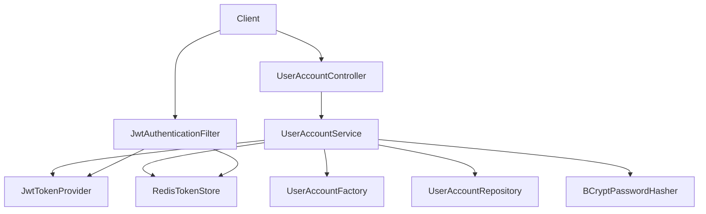
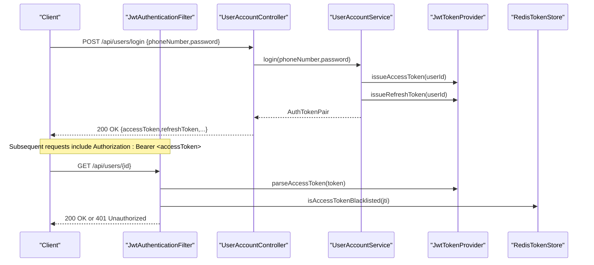
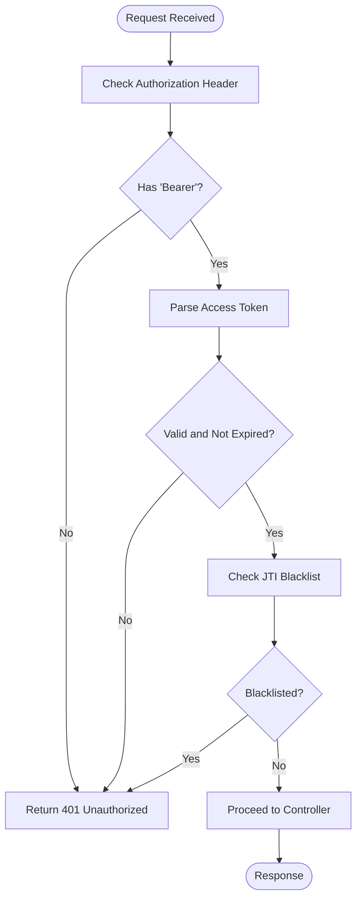
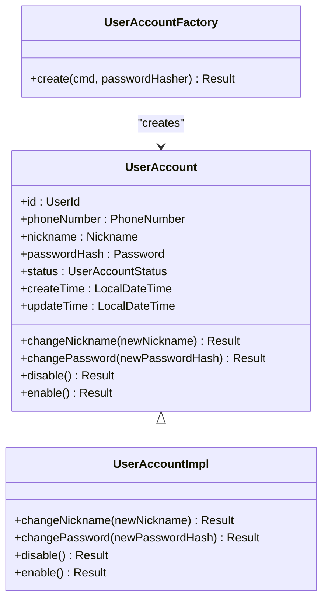
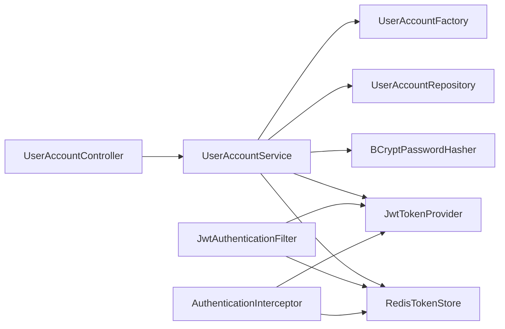

# User Account API

<cite>
**Referenced Files in This Document**
- [UserAccountController.kt](file://j-store-user-boot/src/main/kotlin/com/jstore/user/controller/UserAccountController.kt)
- [UserAccountService.kt](file://j-store-user-application/src/main/kotlin/com/jstore/user/service/UserAccountService.kt)
- [JwtAuthenticationFilter.kt](file://j-store-user-boot/src/main/kotlin/com/jstore/user/filter/JwtAuthenticationFilter.kt)
- [AuthenticationInterceptor.kt](file://j-store-authentication-spring-sdk/src/main/kotlin/com/jstore/authentication/spring/AuthenticationInterceptor.kt)
- [JwtTokenProvider.kt](file://j-store-user-infrastructure/src/main/kotlin/com/jstore/user/domain/useraccount/JwtTokenProvider.kt)
- [BCryptPasswordHasher.kt](file://j-store-user-infrastructure/src/main/kotlin/com/jstore/user/domain/useraccount/BCryptPasswordHasher.kt)
- [RedisTokenStore.kt](file://j-store-user-infrastructure/src/main/kotlin/com/jstore/user/domain/useraccount/RedisTokenStore.kt)
- [UserAccountErrors.kt](file://j-store-user-domain/src/main/kotlin/com/jstore/user/domain/useraccount/UserAccountErrors.kt)
- [UserAccountFactory.kt](file://j-store-user-domain/src/main/kotlin/com/jstore/user/domain/useraccount/UserAccountFactory.kt)
- [UserAccountImpl.kt](file://j-store-user-domain/src/main/kotlin/com/jstore/user/domain/useraccount/UserAccountImpl.kt)
- [UserBootConfiguration.kt](file://j-store-user-boot/src/main/kotlin/com/jstore/user/config/UserBootConfiguration.kt)
- [RequireLogin.kt](file://j-store-authentication-spring-sdk/src/main/kotlin/com/jstore/authentication/annotation/RequireLogin.kt)
- [AuthenticatedUserContext.kt](file://j-store-authentication-spring-sdk/src/main/kotlin/com/jstore/authentication/context/AuthenticatedUserContext.kt)
</cite>

## Table of Contents
1. Introduction
2. Project Structure
3. Core Components
4. Architecture Overview
5. Detailed Component Analysis
6. Dependency Analysis
7. Performance Considerations
8. Troubleshooting Guide
9. Conclusion

## Introduction
This document provides comprehensive API documentation for the User Account Management REST endpoints. It covers user registration, login, token refresh, profile management (nickname and password), account lifecycle operations (enable/disable/force offline), and JWT-based authentication flow including token generation, refresh mechanisms, and session management. It also documents security features such as password hashing, token blacklisting, and error handling for authentication failures and invalid credentials. Role-based access control is supported via annotations and interceptors. Integration with external authentication providers and social login are not implemented in this codebase and are noted accordingly.

## Project Structure
The User Account feature spans multiple layers:
- Boot layer exposes REST endpoints and registers filters.
- Application layer orchestrates use cases and domain interactions.
- Domain layer defines aggregates, factories, and errors.
- Infrastructure layer implements JWT token provider, password hasher, and Redis-backed token store.

**Diagram sources**
- [UserAccountController.kt](file://j-store-user-boot/src/main/kotlin/com/jstore/user/controller/UserAccountController.kt)
- [UserAccountService.kt](file://j-store-user-application/src/main/kotlin/com/jstore/user/service/UserAccountService.kt)
- [JwtAuthenticationFilter.kt](file://j-store-user-boot/src/main/kotlin/com/jstore/user/filter/JwtAuthenticationFilter.kt)
- [BCryptPasswordHasher.kt](file://j-store-user-infrastructure/src/main/kotlin/com/jstore/user/domain/useraccount/BCryptPasswordHasher.kt)
- [JwtTokenProvider.kt](file://j-store-user-infrastructure/src/main/kotlin/com/jstore/user/domain/useraccount/JwtTokenProvider.kt)
- [RedisTokenStore.kt](file://j-store-user-infrastructure/src/main/kotlin/com/jstore/user/domain/useraccount/RedisTokenStore.kt)

**Section sources**
- [UserAccountController.kt](file://j-store-user-boot/src/main/kotlin/com/jstore/user/controller/UserAccountController.kt)
- [UserBootConfiguration.kt](file://j-store-user-boot/src/main/kotlin/com/jstore/user/config/UserBootConfiguration.kt)

## Core Components
- REST Controller: Defines endpoints for register, login, refresh-token, get by id, change nickname, change password, disable, enable, force-offline.
- Application Service: Orchestrates business logic, validates inputs, interacts with domain, persists changes, publishes events, and manages tokens.
- JWT Authentication Filter: Validates Bearer tokens, checks blacklist, sets authenticated user context.
- Interceptor (SDK): Optional path-based or annotation-driven authentication enforcement across controllers.
- Token Provider: Issues and parses JWTs; supports access and refresh tokens.
- Password Hasher: BCrypt-based hashing and matching.
- Token Store: Redis-backed storage for refresh tokens and access token blacklist.

**Section sources**
- [UserAccountController.kt](file://j-store-user-boot/src/main/kotlin/com/jstore/user/controller/UserAccountController.kt)
- [UserAccountService.kt](file://j-store-user-application/src/main/kotlin/com/jstore/user/service/UserAccountService.kt)
- [JwtAuthenticationFilter.kt](file://j-store-user-boot/src/main/kotlin/com/jstore/user/filter/JwtAuthenticationFilter.kt)
- [AuthenticationInterceptor.kt](file://j-store-authentication-spring-sdk/src/main/kotlin/com/jstore/authentication/spring/AuthenticationInterceptor.kt)
- [JwtTokenProvider.kt](file://j-store-user-infrastructure/src/main/kotlin/com/jstore/user/domain/useraccount/JwtTokenProvider.kt)
- [BCryptPasswordHasher.kt](file://j-store-user-infrastructure/src/main/kotlin/com/jstore/user/domain/useraccount/BCryptPasswordHasher.kt)
- [RedisTokenStore.kt](file://j-store-user-infrastructure/src/main/kotlin/com/jstore/user/domain/useraccount/RedisTokenStore.kt)

## Architecture Overview
The system uses a layered architecture with clear separation of concerns. The controller maps HTTP requests to application use cases. The service coordinates domain operations and infrastructure services. JWT-based authentication is enforced at the filter level and optionally via interceptor patterns.

**Diagram sources**
- [UserAccountController.kt](file://j-store-user-boot/src/main/kotlin/com/jstore/user/controller/UserAccountController.kt)
- [UserAccountService.kt](file://j-store-user-application/src/main/kotlin/com/jstore/user/service/UserAccountService.kt)
- [JwtAuthenticationFilter.kt](file://j-store-user-boot/src/main/kotlin/com/jstore/user/filter/JwtAuthenticationFilter.kt)
- [JwtTokenProvider.kt](file://j-store-user-infrastructure/src/main/kotlin/com/jstore/user/domain/useraccount/JwtTokenProvider.kt)
- [RedisTokenStore.kt](file://j-store-user-infrastructure/src/main/kotlin/com/jstore/user/domain/useraccount/RedisTokenStore.kt)

## Detailed Component Analysis

### REST Endpoints and Request/Response Schemas
Base path: /api/users

- Register
  - Method: POST /api/users/register
  - Request body:
    - phoneNumber: string
    - nickname: string
    - password: string
  - Response:
    - id: number
    - phoneNumber: string
    - nickname: string
    - status: string
    - createTime: datetime
    - updateTime: datetime
  - Notes: Password strength validation enforced; duplicate phone number rejected.

- Login
  - Method: POST /api/users/login
  - Request body:
    - phoneNumber: string
    - password: string
  - Response:
    - accessToken: string
    - accessTokenExpiresAt: datetime
    - refreshToken: string
    - refreshTokenExpiresAt: datetime

- Refresh Token
  - Method: POST /api/users/refresh-token
  - Request body:
    - refreshToken: string
  - Response:
    - accessToken: string
    - accessTokenExpiresAt: datetime
    - refreshToken: string
    - refreshTokenExpiresAt: datetime

- Get User By Id
  - Method: GET /api/users/{id}
  - Path parameter:
    - id: number
  - Response: same as UserResponse above

- Change Nickname
  - Method: PUT /api/users/{id}/nickname
  - Path parameter:
    - id: number
  - Request body:
    - nickname: string
  - Response: success indicator

- Change Password
  - Method: PUT /api/users/{id}/password
  - Path parameter:
    - id: number
  - Request body:
    - oldPassword: string
    - newPassword: string
  - Response: success indicator

- Disable Account
  - Method: POST /api/users/{id}/disable
  - Path parameter:
    - id: number
  - Response: success indicator

- Enable Account
  - Method: POST /api/users/{id}/enable
  - Path parameter:
    - id: number
  - Response: success indicator

- Force Offline
  - Method: POST /api/users/{id}/force-offline
  - Path parameter:
    - id: number
  - Response: success indicator

Error response schema (used across endpoints on failure):
- message: string
- errorCode: string

**Section sources**
- [UserAccountController.kt](file://j-store-user-boot/src/main/kotlin/com/jstore/user/controller/UserAccountController.kt)
- [UserAccountErrors.kt](file://j-store-user-domain/src/main/kotlin/com/jstore/user/domain/useraccount/UserAccountErrors.kt)

### Authentication Flow and JWT Mechanics
- Access Token:
  - Issued on successful login.
  - Expiration: 15 minutes.
  - Claims include userId, jti, exp, iat, type=access.
- Refresh Token:
  - Issued on successful login.
  - Expiration: 7 days.
  - Stored in Redis per userId; rotation occurs on refresh.
- Blacklist:
  - Access tokens can be revoked using jti; checked during request filtering.

**Diagram sources**
- [JwtAuthenticationFilter.kt](file://j-store-user-boot/src/main/kotlin/com/jstore/user/filter/JwtAuthenticationFilter.kt)
- [JwtTokenProvider.kt](file://j-store-user-infrastructure/src/main/kotlin/com/jstore/user/domain/useraccount/JwtTokenProvider.kt)
- [RedisTokenStore.kt](file://j-store-user-infrastructure/src/main/kotlin/com/jstore/user/domain/useraccount/RedisTokenStore.kt)

**Section sources**
- [JwtTokenProvider.kt](file://j-store-user-infrastructure/src/main/kotlin/com/jstore/user/domain/useraccount/JwtTokenProvider.kt)
- [RedisTokenStore.kt](file://j-store-user-infrastructure/src/main/kotlin/com/jstore/user/domain/useraccount/RedisTokenStore.kt)
- [JwtAuthenticationFilter.kt](file://j-store-user-boot/src/main/kotlin/com/jstore/user/filter/JwtAuthenticationFilter.kt)

### Registration and Profile Management
- Registration:
  - Validates password strength (length 8–32, contains letter and digit).
  - Ensures unique phone number.
  - Creates aggregate, hashes password, records domain event.
- Profile updates:
  - Nickname change updates timestamp and persists.
  - Password change requires old password match and new password strength validation.

**Diagram sources**
- [UserAccount.kt](file://j-store-user-domain/src/main/kotlin/com/jstore/user/domain/useraccount/UserAccount.kt)
- [UserAccountImpl.kt](file://j-store-user-domain/src/main/kotlin/com/jstore/user/domain/useraccount/UserAccountImpl.kt)
- [UserAccountFactory.kt](file://j-store-user-domain/src/main/kotlin/com/jstore/user/domain/useraccount/UserAccountFactory.kt)

**Section sources**
- [UserAccountFactory.kt](file://j-store-user-domain/src/main/kotlin/com/jstore/user/domain/useraccount/UserAccountFactory.kt)
- [UserAccountImpl.kt](file://j-store-user-domain/src/main/kotlin/com/jstore/user/domain/useraccount/UserAccountImpl.kt)
- [UserAccountService.kt](file://j-store-user-application/src/main/kotlin/com/jstore/user/service/UserAccountService.kt)

### Security Features
- Password hashing:
  - BCryptPasswordEncoder used for secure hashing and matching.
- Token management:
  - Short-lived access tokens (15 min).
  - Long-lived refresh tokens (7 days) stored in Redis.
  - Blacklist support for revoking access tokens via jti.
- Authentication enforcement:
  - Filter-level Bearer token validation and blacklist check.
  - Optional interceptor-based enforcement using @RequireLogin and path patterns.

**Section sources**
- [BCryptPasswordHasher.kt](file://j-store-user-infrastructure/src/main/kotlin/com/jstore/user/domain/useraccount/BCryptPasswordHasher.kt)
- [JwtTokenProvider.kt](file://j-store-user-infrastructure/src/main/kotlin/com/jstore/user/domain/useraccount/JwtTokenProvider.kt)
- [RedisTokenStore.kt](file://j-store-user-infrastructure/src/main/kotlin/com/jstore/user/domain/useraccount/RedisTokenStore.kt)
- [JwtAuthenticationFilter.kt](file://j-store-user-boot/src/main/kotlin/com/jstore/user/filter/JwtAuthenticationFilter.kt)
- [AuthenticationInterceptor.kt](file://j-store-authentication-spring-sdk/src/main/kotlin/com/jstore/authentication/spring/AuthenticationInterceptor.kt)
- [RequireLogin.kt](file://j-store-authentication-spring-sdk/src/main/kotlin/com/jstore/authentication/annotation/RequireLogin.kt)

### Error Handling and Status Codes
Common error responses include:
- 400 Bad Request: Duplicate phone number, weak password, invalid nickname, mismatched passwords.
- 401 Unauthorized: Invalid or expired token, missing token, revoked refresh token.
- 403 Forbidden: Disabled account.
- 404 Not Found: User not found.

Error payload:
- message: string
- errorCode: string

**Section sources**
- [UserAccountErrors.kt](file://j-store-user-domain/src/main/kotlin/com/jstore/user/domain/useraccount/UserAccountErrors.kt)
- [UserAccountController.kt](file://j-store-user-boot/src/main/kotlin/com/jstore/user/controller/UserAccountController.kt)

### Practical Examples of User Lifecycle Operations
- Create an account:
  - POST /api/users/register with phoneNumber, nickname, password.
  - Expect 200 OK with UserResponse or error response if validation fails.
- Authenticate:
  - POST /api/users/login with phoneNumber, password.
  - Receive accessToken and refreshToken; attach Authorization header for subsequent calls.
- Refresh token:
  - POST /api/users/refresh-token with refreshToken.
  - Receive new accessToken and refreshToken pair.
- Update profile:
  - PUT /api/users/{id}/nickname with new nickname.
  - PUT /api/users/{id}/password with oldPassword and newPassword.
- Manage account state:
  - POST /api/users/{id}/disable to disable active accounts.
  - POST /api/users/{id}/enable to re-enable disabled accounts.
  - POST /api/users/{id}/force-offline to invalidate sessions (publishes forced offline event).

Note: Email verification and account recovery endpoints are not present in the current implementation.

**Section sources**
- [UserAccountController.kt](file://j-store-user-boot/src/main/kotlin/com/jstore/user/controller/UserAccountController.kt)
- [UserAccountService.kt](file://j-store-user-application/src/main/kotlin/com/jstore/user/service/UserAccountService.kt)

### Role-Based Access Control and Permission Validation
- Annotation-driven enforcement:
  - @RequireLogin can be applied at method or class level to require authentication.
- Interceptor behavior:
  - Extracts Bearer token, validates it, checks blacklist, and sets authenticated user context.
- Context usage:
  - AuthenticatedUserContext provides getCurrentUserId() within request scope.

**Section sources**
- [RequireLogin.kt](file://j-store-authentication-spring-sdk/src/main/kotlin/com/jstore/authentication/annotation/RequireLogin.kt)
- [AuthenticationInterceptor.kt](file://j-store-authentication-spring-sdk/src/main/kotlin/com/jstore/authentication/spring/AuthenticationInterceptor.kt)
- [AuthenticatedUserContext.kt](file://j-store-authentication-spring-sdk/src/main/kotlin/com/jstore/authentication/context/AuthenticatedUserContext.kt)

### External Authentication Providers and Social Login
- Not implemented in the current codebase.
- The design allows extension points through interfaces (TokenProvider, PasswordHasher, TokenStore), enabling future integration with OAuth/OIDC providers if desired.

[No sources needed since this section describes absence of features]

## Dependency Analysis
The following diagram shows key dependencies among components involved in authentication and user account operations.

**Diagram sources**
- [UserAccountController.kt](file://j-store-user-boot/src/main/kotlin/com/jstore/user/controller/UserAccountController.kt)
- [UserAccountService.kt](file://j-store-user-application/src/main/kotlin/com/jstore/user/service/UserAccountService.kt)
- [JwtAuthenticationFilter.kt](file://j-store-user-boot/src/main/kotlin/com/jstore/user/filter/JwtAuthenticationFilter.kt)
- [AuthenticationInterceptor.kt](file://j-store-authentication-spring-sdk/src/main/kotlin/com/jstore/authentication/spring/AuthenticationInterceptor.kt)
- [JwtTokenProvider.kt](file://j-store-user-infrastructure/src/main/kotlin/com/jstore/user/domain/useraccount/JwtTokenProvider.kt)
- [BCryptPasswordHasher.kt](file://j-store-user-infrastructure/src/main/kotlin/com/jstore/user/domain/useraccount/BCryptPasswordHasher.kt)
- [RedisTokenStore.kt](file://j-store-user-infrastructure/src/main/kotlin/com/jstore/user/domain/useraccount/RedisTokenStore.kt)

**Section sources**
- [UserBootConfiguration.kt](file://j-store-user-boot/src/main/kotlin/com/jstore/user/config/UserBootConfiguration.kt)

## Performance Considerations
- Short-lived access tokens reduce exposure window and minimize server-side state.
- Refresh token rotation improves security by invalidating previous refresh tokens upon use.
- Redis-backed token store enables fast lookups and efficient blacklist checks.
- Avoid excessive logging of sensitive data (tokens, passwords).
- Consider rate limiting on login and refresh endpoints to mitigate brute-force attempts (not implemented here).

[No sources needed since this section provides general guidance]

## Troubleshooting Guide
Common issues and resolutions:
- Invalid or missing token:
  - Ensure Authorization header is set with "Bearer <token>".
  - Verify token is not expired and not blacklisted.
- Token revoked:
  - Use refresh endpoint to obtain new tokens; ensure stored refresh token matches server-side value.
- Disabled account:
  - Re-enable account via enable endpoint before attempting login.
- Weak password:
  - Follow strength requirements (length 8–32, includes letter and digit).
- Duplicate phone number:
  - Use a different phone number for registration.

**Section sources**
- [UserAccountErrors.kt](file://j-store-user-domain/src/main/kotlin/com/jstore/user/domain/useraccount/UserAccountErrors.kt)
- [JwtAuthenticationFilter.kt](file://j-store-user-boot/src/main/kotlin/com/jstore/user/filter/JwtAuthenticationFilter.kt)
- [UserAccountService.kt](file://j-store-user-application/src/main/kotlin/com/jstore/user/service/UserAccountService.kt)

## Conclusion
The User Account API provides robust endpoints for registration, authentication, profile management, and account lifecycle operations. JWT-based authentication ensures secure access with short-lived tokens and refresh token rotation. BCrypt hashing protects passwords, and Redis-backed token storage supports efficient blacklist checks. While email verification and social login are not implemented, the modular design allows future extensions. Proper error handling and clear schemas facilitate client integration and troubleshooting.