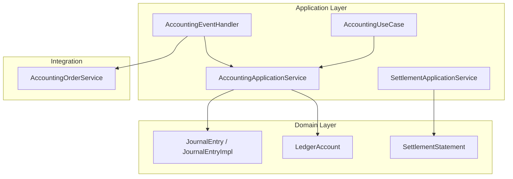
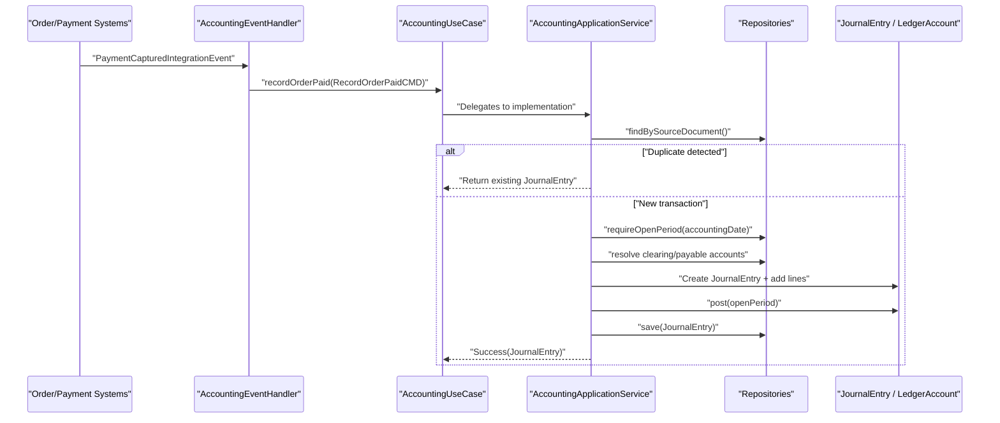
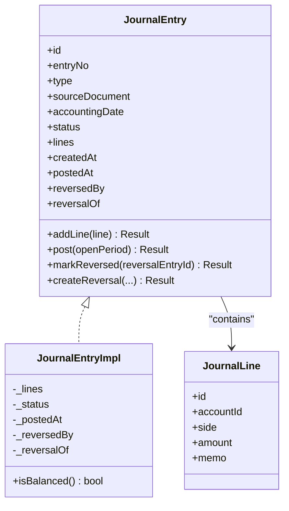
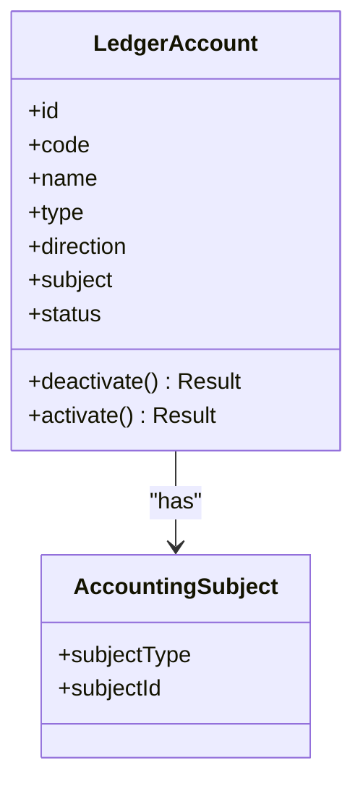
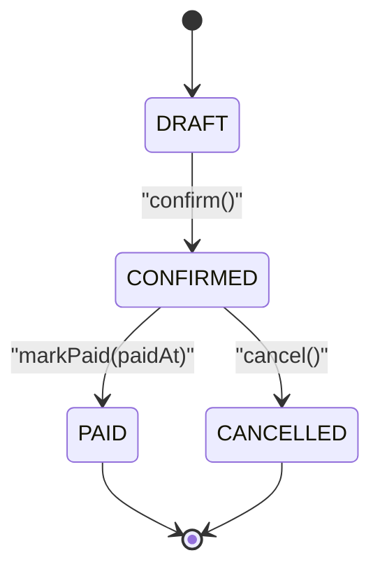
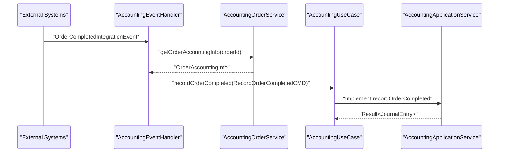
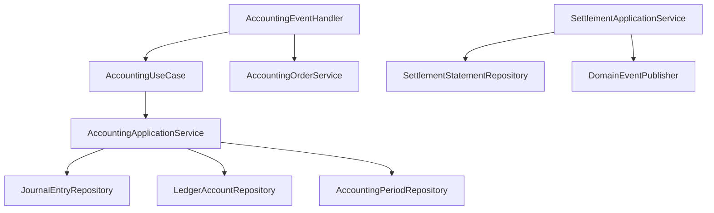

# Accounting Application Workflows

<cite>
**Referenced Files in This Document**
- [AccountingApplicationService.kt](file://j-store-accounting-application/src/main/kotlin/com/jstore/accounting/service/AccountingApplicationService.kt)
- [AccountingEventHandler.kt](file://j-store-accounting-application/src/main/kotlin/com/jstore/accounting/service/AccountingEventHandler.kt)
- [AccountingUseCase.kt](file://j-store-accounting-application/src/main/kotlin/com/jstore/accounting/service/AccountingUseCase.kt)
- [SettlementApplicationService.kt](file://j-store-accounting-application/src/main/kotlin/com/jstore/accounting/service/SettlementApplicationService.kt)
- [SettlementUseCase.kt](file://j-store-accounting-application/src/main/kotlin/com/jstore/accounting/service/SettlementUseCase.kt)
- [RecordOrderPaidCMD.kt](file://j-store-accounting-application/src/main/kotlin/com/jstore/accounting/service/command/RecordOrderPaidCMD.kt)
- [RecordOrderCompletedCMD.kt](file://j-store-accounting-application/src/main/kotlin/com/jstore/accounting/service/command/RecordOrderCompletedCMD.kt)
- [RecordOrderRefundApprovedCMD.kt](file://j-store-accounting-application/src/main/kotlin/com/jstore/accounting/service/command/RecordOrderRefundApprovedCMD.kt)
- [RecordSettlementPaidCMD.kt](file://j-store-accounting-application/src/main/kotlin/com/jstore/accounting/service/command/RecordSettlementPaidCMD.kt)
- [JournalEntry.kt](file://j-store-accounting-domain/src/main/kotlin/com/jstore/accounting/domain/journal/JournalEntry.kt)
- [JournalEntryImpl.kt](file://j-store-accounting-domain/src/main/kotlin/com/jstore/accounting/domain/journal/JournalEntryImpl.kt)
- [LedgerAccount.kt](file://j-store-accounting-domain/src/main/kotlin/com/jstore/accounting/domain/account/LedgerAccount.kt)
- [SettlementStatement.kt](file://j-store-accounting-domain/src/main/kotlin/com/jstore/accounting/domain/settlement/SettlementStatement.kt)
- [AccountingOrderService.kt](file://j-store-accounting-domain/src/main/kotlin/com/jstore/accounting/acl/AccountingOrderService.kt)
</cite>

## Table of Contents
1. [Introduction](#introduction)
2. [Project Structure](#project-structure)
3. [Core Components](#core-components)
4. [Architecture Overview](#architecture-overview)
5. [Detailed Component Analysis](#detailed-component-analysis)
6. [Dependency Analysis](#dependency-analysis)
7. [Performance Considerations](#performance-considerations)
8. [Troubleshooting Guide](#troubleshooting-guide)
9. [Conclusion](#conclusion)
10. [Appendices](#appendices)

## Introduction
This document explains the accounting application service workflows for recording financial transactions, event-driven automatic entries, and settlement automation. It focuses on the command-driven architecture used to create journal entries, the integration with order and payment systems via integration events, and the domain models that enforce accounting rules such as balanced entries, period validation, and reversal handling. Concrete examples include order payment recording, refund processing, settlement automation, and manual adjustments. Transaction boundaries, error handling strategies, and audit trail generation are also covered.

## Project Structure
The accounting subsystem is organized into:
- Application layer: use cases and event handlers that orchestrate business operations using commands and repositories.
- Domain layer: core accounting aggregates (journal entries, ledger accounts, settlement statements) and their repositories.
- Integration points: ACL interfaces to fetch order-related accounting information and integration message handlers to react to external events.

**Diagram sources**
- [AccountingUseCase.kt](file://j-store-accounting-application/src/main/kotlin/com/jstore/accounting/service/AccountingUseCase.kt)
- [AccountingApplicationService.kt](file://j-store-accounting-application/src/main/kotlin/com/jstore/accounting/service/AccountingApplicationService.kt)
- [AccountingEventHandler.kt](file://j-store-accounting-application/src/main/kotlin/com/jstore/accounting/service/AccountingEventHandler.kt)
- [SettlementApplicationService.kt](file://j-store-accounting-application/src/main/kotlin/com/jstore/accounting/service/SettlementApplicationService.kt)
- [JournalEntry.kt](file://j-store-accounting-domain/src/main/kotlin/com/jstore/accounting/domain/journal/JournalEntry.kt)
- [JournalEntryImpl.kt](file://j-store-accounting-domain/src/main/kotlin/com/jstore/accounting/domain/journal/JournalEntryImpl.kt)
- [LedgerAccount.kt](file://j-store-accounting-domain/src/main/kotlin/com/jstore/accounting/domain/account/LedgerAccount.kt)
- [SettlementStatement.kt](file://j-store-accounting-domain/src/main/kotlin/com/jstore/accounting/domain/settlement/SettlementStatement.kt)
- [AccountingOrderService.kt](file://j-store-accounting-domain/src/main/kotlin/com/jstore/accounting/acl/AccountingOrderService.kt)

**Section sources**
- [AccountingUseCase.kt](file://j-store-accounting-application/src/main/kotlin/com/jstore/accounting/service/AccountingUseCase.kt)
- [AccountingApplicationService.kt](file://j-store-accounting-application/src/main/kotlin/com/jstore/accounting/service/AccountingApplicationService.kt)
- [AccountingEventHandler.kt](file://j-store-accounting-application/src/main/kotlin/com/jstore/accounting/service/AccountingEventHandler.kt)
- [SettlementApplicationService.kt](file://j-store-accounting-application/src/main/kotlin/com/jstore/accounting/service/SettlementApplicationService.kt)
- [JournalEntry.kt](file://j-store-accounting-domain/src/main/kotlin/com/jstore/accounting/domain/journal/JournalEntry.kt)
- [JournalEntryImpl.kt](file://j-store-accounting-domain/src/main/kotlin/com/jstore/accounting/domain/journal/JournalEntryImpl.kt)
- [LedgerAccount.kt](file://j-store-accounting-domain/src/main/kotlin/com/jstore/accounting/domain/account/LedgerAccount.kt)
- [SettlementStatement.kt](file://j-store-accounting-domain/src/main/kotlin/com/jstore/accounting/domain/settlement/SettlementStatement.kt)
- [AccountingOrderService.kt](file://j-store-accounting-domain/src/main/kotlin/com/jstore/accounting/acl/AccountingOrderService.kt)

## Core Components
- Command classes encapsulate inputs for each accounting operation:
  - RecordOrderPaidCMD: captures order payment details and source document.
  - RecordOrderCompletedCMD: captures commission recognition upon order completion.
  - RecordOrderRefundApprovedCMD: captures refund reversal referencing original source document.
  - RecordSettlementPaidCMD: captures settlement payment details.
- Use case interface defines the entry points for recording financial transactions and querying by source document.
- Application service implements the command handlers, orchestrating repository access, account resolution, period checks, and journal entry creation/posting.
- Event handlers translate integration events from order/payment domains into commands for automatic journal entry creation.
- Settlement application service manages settlement statement lifecycle and publishes domain events when marked paid.

Key responsibilities:
- Idempotency: prevent duplicate entries by checking existing source documents before creating new ones.
- Period enforcement: ensure accounting periods are open and contain the accounting date.
- Account resolution: resolve ledger accounts by code and subject, with fallbacks where applicable.
- Validation: enforce balanced debits/credits and minimum line counts.
- Auditability: maintain source documents, entry numbers, statuses, timestamps, and reversal links.

**Section sources**
- [RecordOrderPaidCMD.kt](file://j-store-accounting-application/src/main/kotlin/com/jstore/accounting/service/command/RecordOrderPaidCMD.kt)
- [RecordOrderCompletedCMD.kt](file://j-store-accounting-application/src/main/kotlin/com/jstore/accounting/service/command/RecordOrderCompletedCMD.kt)
- [RecordOrderRefundApprovedCMD.kt](file://j-store-accounting-application/src/main/kotlin/com/jstore/accounting/service/command/RecordOrderRefundApprovedCMD.kt)
- [RecordSettlementPaidCMD.kt](file://j-store-accounting-application/src/main/kotlin/com/jstore/accounting/service/command/RecordSettlementPaidCMD.kt)
- [AccountingUseCase.kt](file://j-store-accounting-application/src/main/kotlin/com/jstore/accounting/service/AccountingUseCase.kt)
- [AccountingApplicationService.kt](file://j-store-accounting-application/src/main/kotlin/com/jstore/accounting/service/AccountingApplicationService.kt)
- [AccountingEventHandler.kt](file://j-store-accounting-application/src/main/kotlin/com/jstore/accounting/service/AccountingEventHandler.kt)
- [SettlementApplicationService.kt](file://j-store-accounting-application/src/main/kotlin/com/jstore/accounting/service/SettlementApplicationService.kt)

## Architecture Overview
The system uses a command-driven architecture for explicit financial operations and an event-driven architecture for automatic reactions to order and payment events.

**Diagram sources**
- [AccountingEventHandler.kt](file://j-store-accounting-application/src/main/kotlin/com/jstore/accounting/service/AccountingEventHandler.kt)
- [AccountingUseCase.kt](file://j-store-accounting-application/src/main/kotlin/com/jstore/accounting/service/AccountingUseCase.kt)
- [AccountingApplicationService.kt](file://j-store-accounting-application/src/main/kotlin/com/jstore/accounting/service/AccountingApplicationService.kt)
- [JournalEntry.kt](file://j-store-accounting-domain/src/main/kotlin/com/jstore/accounting/domain/journal/JournalEntry.kt)

## Detailed Component Analysis

### Command Pattern Implementation
Commands define the input contracts for each accounting operation. They carry identifiers, amounts, dates, and source documents to ensure traceability and idempotency.

- RecordOrderPaidCMD: includes orderId, merchantId, paidAmount, accountingDate, and sourceDocument.
- RecordOrderCompletedCMD: includes orderId, merchantId, commissionAmount, accountingDate, and sourceDocument.
- RecordOrderRefundApprovedCMD: includes orderId, merchantId, refundAmount, accountingDate, sourceDocument, and originalSourceDocument.
- RecordSettlementPaidCMD: includes settlementId, merchantId, paidAmount, accountingDate, and sourceDocument.

These commands are consumed by the application service to build and post journal entries.

**Section sources**
- [RecordOrderPaidCMD.kt](file://j-store-accounting-application/src/main/kotlin/com/jstore/accounting/service/command/RecordOrderPaidCMD.kt)
- [RecordOrderCompletedCMD.kt](file://j-store-accounting-application/src/main/kotlin/com/jstore/accounting/service/command/RecordOrderCompletedCMD.kt)
- [RecordOrderRefundApprovedCMD.kt](file://j-store-accounting-application/src/main/kotlin/com/jstore/accounting/service/command/RecordOrderRefundApprovedCMD.kt)
- [RecordSettlementPaidCMD.kt](file://j-store-accounting-application/src/main/kotlin/com/jstore/accounting/service/command/RecordSettlementPaidCMD.kt)

### Journal Entry Domain Model
The journal entry aggregate enforces critical accounting rules:
- Balanced entries: sum of debit amounts equals sum of credit amounts.
- Minimum lines: at least two lines required.
- Period validation: posting requires an open period containing the accounting date.
- State transitions: DRAFT -> POSTED; POSTED can be reversed or marked REVERSED.
- Reversal support: create reversal entries with inverted sides and reason memo.

**Diagram sources**
- [JournalEntry.kt](file://j-store-accounting-domain/src/main/kotlin/com/jstore/accounting/domain/journal/JournalEntry.kt)
- [JournalEntryImpl.kt](file://j-store-accounting-domain/src/main/kotlin/com/jstore/accounting/domain/journal/JournalEntryImpl.kt)

**Section sources**
- [JournalEntry.kt](file://j-store-accounting-domain/src/main/kotlin/com/jstore/accounting/domain/journal/JournalEntry.kt)
- [JournalEntryImpl.kt](file://j-store-accounting-domain/src/main/kotlin/com/jstore/accounting/domain/journal/JournalEntryImpl.kt)

### Ledger Accounts and Subjects
Ledger accounts represent financial accounts with codes, types, balance directions, subjects, and status. The application service resolves accounts by code and subject, with optional fallbacks for default subjects.

**Diagram sources**
- [LedgerAccount.kt](file://j-store-accounting-domain/src/main/kotlin/com/jstore/accounting/domain/account/LedgerAccount.kt)

**Section sources**
- [LedgerAccount.kt](file://j-store-accounting-domain/src/main/kotlin/com/jstore/accounting/domain/account/LedgerAccount.kt)

### Settlement Statement Lifecycle
Settlement statements track merchant settlements over periods, with states DRAFT, CONFIRMED, PAID, CANCELLED. The application service confirms statements and marks them paid, publishing pending domain events when appropriate.

**Diagram sources**
- [SettlementStatement.kt](file://j-store-accounting-domain/src/main/kotlin/com/jstore/accounting/domain/settlement/SettlementStatement.kt)

**Section sources**
- [SettlementStatement.kt](file://j-store-accounting-domain/src/main/kotlin/com/jstore/accounting/domain/settlement/SettlementStatement.kt)
- [SettlementApplicationService.kt](file://j-store-accounting-application/src/main/kotlin/com/jstore/accounting/service/SettlementApplicationService.kt)

### Event Handlers for Automatic Accounting Entries
Integration event handlers translate external events into commands:
- PaymentCapturedAccountingEventHandler: converts payment captured events into order payment journal entries.
- OrderCompletedAccountingEventHandler: converts order completed events into commission recognition journal entries.
- PaymentRefundSucceededAccountingEventHandler: converts refund succeeded events into reversal journal entries referencing the original source document.
- SettlementPaidAccountingEventHandler: listens to domain events for settlement payments and creates corresponding journal entries.

**Diagram sources**
- [AccountingEventHandler.kt](file://j-store-accounting-application/src/main/kotlin/com/jstore/accounting/service/AccountingEventHandler.kt)
- [AccountingOrderService.kt](file://j-store-accounting-domain/src/main/kotlin/com/jstore/accounting/acl/AccountingOrderService.kt)
- [AccountingUseCase.kt](file://j-store-accounting-application/src/main/kotlin/com/jstore/accounting/service/AccountingUseCase.kt)
- [AccountingApplicationService.kt](file://j-store-accounting-application/src/main/kotlin/com/jstore/accounting/service/AccountingApplicationService.kt)

**Section sources**
- [AccountingEventHandler.kt](file://j-store-accounting-application/src/main/kotlin/com/jstore/accounting/service/AccountingEventHandler.kt)
- [AccountingOrderService.kt](file://j-store-accounting-domain/src/main/kotlin/com/jstore/accounting/acl/AccountingOrderService.kt)

### Use Case Implementations for Common Operations
- Order payment recording:
  - Idempotency check via source document lookup.
  - Open period validation.
  - Resolve clearing and payable accounts.
  - Create journal entry with debit to clearing and credit to payable.
  - Post and save.
- Order completion commission:
  - Idempotency check.
  - Open period validation.
  - Resolve payable and commission accounts.
  - Create journal entry with debit to payable and credit to commission revenue.
  - Post and save.
- Refund reversal:
  - Idempotency check.
  - Validate original entry exists and is posted.
  - Open period validation.
  - Resolve payable and clearing accounts.
  - Create reversal entry with inverted sides.
  - Post and save.
- Settlement payment:
  - Idempotency check.
  - Open period validation.
  - Resolve payable and bank accounts.
  - Create journal entry with debit to payable and credit to bank.
  - Post and save.

**Section sources**
- [AccountingApplicationService.kt](file://j-store-accounting-application/src/main/kotlin/com/jstore/accounting/service/AccountingApplicationService.kt)

### Manual Adjustment Entries
Manual adjustments are supported through the domain model’s reversal mechanism:
- Create a reversal entry with inverted sides and a reason memo.
- The reversal type is MANUAL_ADJUSTMENT and references the original entry via reversalOf.
- This ensures auditability and maintains balanced entries.

**Section sources**
- [JournalEntryImpl.kt](file://j-store-accounting-domain/src/main/kotlin/com/jstore/accounting/domain/journal/JournalEntryImpl.kt)

## Dependency Analysis
The application service depends on repositories for journal entries, ledger accounts, and accounting periods. Event handlers depend on the ACL service to retrieve order accounting information. Settlement application service depends on settlement statement repository and optionally a domain event publisher.

**Diagram sources**
- [AccountingApplicationService.kt](file://j-store-accounting-application/src/main/kotlin/com/jstore/accounting/service/AccountingApplicationService.kt)
- [AccountingEventHandler.kt](file://j-store-accounting-application/src/main/kotlin/com/jstore/accounting/service/AccountingEventHandler.kt)
- [AccountingOrderService.kt](file://j-store-accounting-domain/src/main/kotlin/com/jstore/accounting/acl/AccountingOrderService.kt)
- [SettlementApplicationService.kt](file://j-store-accounting-application/src/main/kotlin/com/jstore/accounting/service/SettlementApplicationService.kt)

**Section sources**
- [AccountingApplicationService.kt](file://j-store-accounting-application/src/main/kotlin/com/jstore/accounting/service/AccountingApplicationService.kt)
- [AccountingEventHandler.kt](file://j-store-accounting-application/src/main/kotlin/com/jstore/accounting/service/AccountingEventHandler.kt)
- [AccountingOrderService.kt](file://j-store-accounting-domain/src/main/kotlin/com/jstore/accounting/acl/AccountingOrderService.kt)
- [SettlementApplicationService.kt](file://j-store-accounting-application/src/main/kotlin/com/jstore/accounting/service/SettlementApplicationService.kt)

## Performance Considerations
- Idempotency checks reduce redundant work by returning existing journal entries for duplicate source documents.
- Repository lookups should be optimized for frequent queries by source document and account code/subject combinations.
- Posting validations occur in-memory within the aggregate, minimizing database round-trips until save.
- Event handlers should be designed for asynchronous processing to avoid blocking external systems.

[No sources needed since this section provides general guidance]

## Troubleshooting Guide
Common issues and strategies:
- Duplicate entries: handled by checking existing source documents before creating new ones.
- Closed accounting periods: validated during posting; ensure periods are open and contain the accounting date.
- Unbalanced entries: enforced by domain logic; verify debit and credit sums match.
- Missing accounts: resolved by code and subject; fallbacks may apply for merchant subjects; otherwise return errors indicating account not found.
- Invalid state transitions: posting requires DRAFT state; reversing requires POSTED state; refunds require original entry to be posted.

Error handling patterns:
- Use Result types to propagate failures consistently.
- Business errors indicate specific conditions like closed periods, insufficient lines, unbalanced entries, invalid states, and missing accounts.

Audit trail:
- Source documents capture origin type, ID, and event type.
- Entry numbers and timestamps provide chronological tracking.
- Reversals link back to original entries and include reasons.

**Section sources**
- [AccountingApplicationService.kt](file://j-store-accounting-application/src/main/kotlin/com/jstore/accounting/service/AccountingApplicationService.kt)
- [JournalEntryImpl.kt](file://j-store-accounting-domain/src/main/kotlin/com/jstore/accounting/domain/journal/JournalEntryImpl.kt)
- [JournalEntry.kt](file://j-store-accounting-domain/src/main/kotlin/com/jstore/accounting/domain/journal/JournalEntry.kt)

## Conclusion
The accounting application employs a robust command-driven architecture for explicit financial operations and an event-driven approach for automatic reactions to order and payment events. The domain model enforces critical accounting rules, ensuring data integrity and auditability. Settlement automation integrates seamlessly with journal entry creation, while manual adjustments are supported through reversal mechanisms. Clear error handling and idempotency guarantees contribute to reliable financial processing.

[No sources needed since this section summarizes without analyzing specific files]

## Appendices

### Example Workflows

#### Order Payment Recording
- Trigger: Payment captured event.
- Steps:
  - Retrieve order accounting info.
  - Check for existing journal entry by source document.
  - Validate open period.
  - Resolve clearing and payable accounts.
  - Create and post journal entry with debit to clearing and credit to payable.
  - Save and return result.

**Section sources**
- [AccountingEventHandler.kt](file://j-store-accounting-application/src/main/kotlin/com/jstore/accounting/service/AccountingEventHandler.kt)
- [AccountingApplicationService.kt](file://j-store-accounting-application/src/main/kotlin/com/jstore/accounting/service/AccountingApplicationService.kt)

#### Refund Processing
- Trigger: Payment refund succeeded event.
- Steps:
  - Retrieve order accounting info and original source document.
  - Validate original entry exists and is posted.
  - Validate open period.
  - Resolve payable and clearing accounts.
  - Create reversal entry with inverted sides.
  - Post and save.

**Section sources**
- [AccountingEventHandler.kt](file://j-store-accounting-application/src/main/kotlin/com/jstore/accounting/service/AccountingEventHandler.kt)
- [AccountingApplicationService.kt](file://j-store-accounting-application/src/main/kotlin/com/jstore/accounting/service/AccountingApplicationService.kt)

#### Settlement Automation
- Trigger: Settlement paid domain event.
- Steps:
  - Create settlement payment command.
  - Validate open period.
  - Resolve payable and bank accounts.
  - Create and post journal entry with debit to payable and credit to bank.
  - Save and return result.

**Section sources**
- [AccountingEventHandler.kt](file://j-store-accounting-application/src/main/kotlin/com/jstore/accounting/service/AccountingEventHandler.kt)
- [AccountingApplicationService.kt](file://j-store-accounting-application/src/main/kotlin/com/jstore/accounting/service/AccountingApplicationService.kt)

#### Manual Adjustment Entries
- Mechanism: Create reversal entries with inverted sides and reason memo.
- Purpose: Correct errors or adjust balances while maintaining auditability.

**Section sources**
- [JournalEntryImpl.kt](file://j-store-accounting-domain/src/main/kotlin/com/jstore/accounting/domain/journal/JournalEntryImpl.kt)

### Extensibility Points
- Custom accounting rules: Extend journal entry validation or add new entry types in the domain model.
- New integration events: Implement additional event handlers to translate external events into commands.
- Account resolution: Customize account lookup logic in the application service to support new subjects or codes.
- Settlement processes: Add new settlement flows by extending settlement statement behavior and publishing relevant domain events.

[No sources needed since this section provides general guidance]