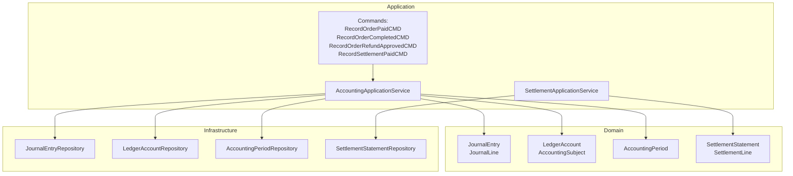
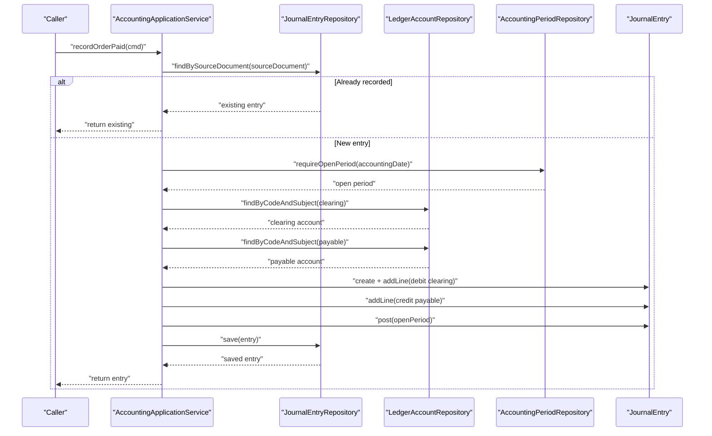
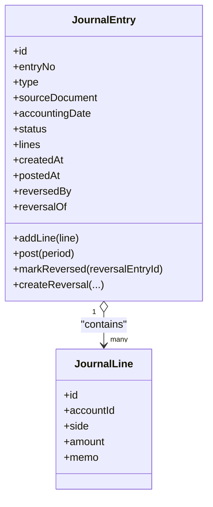
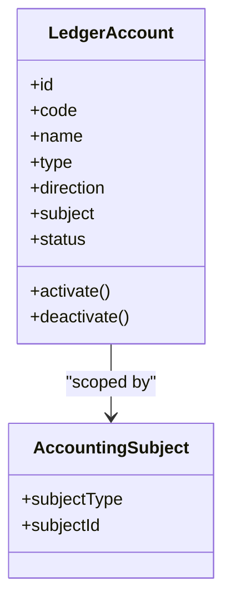
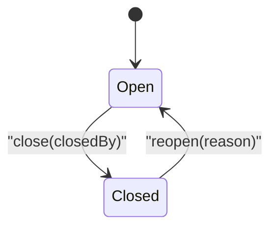
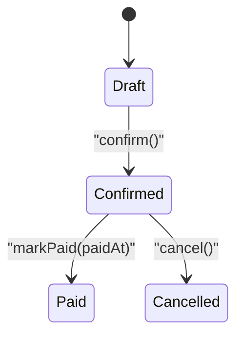
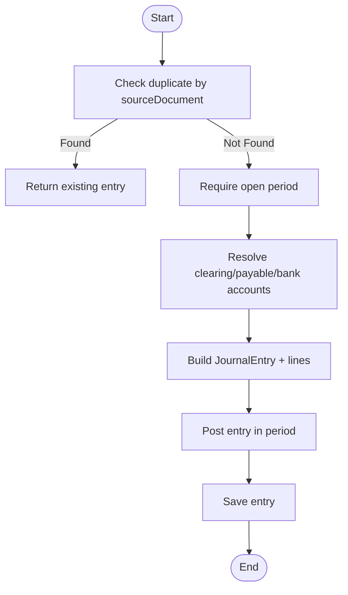
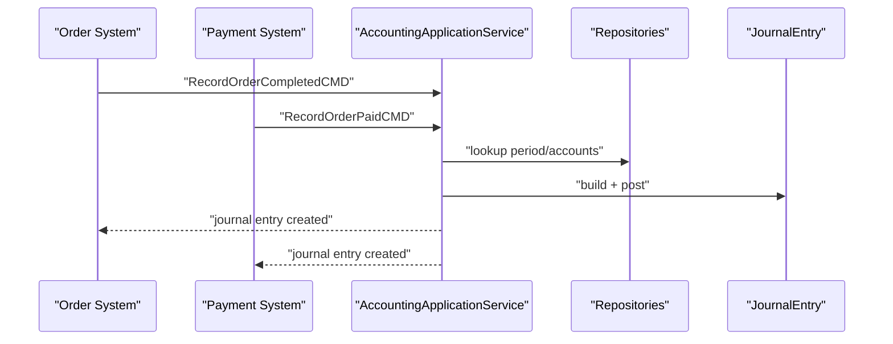
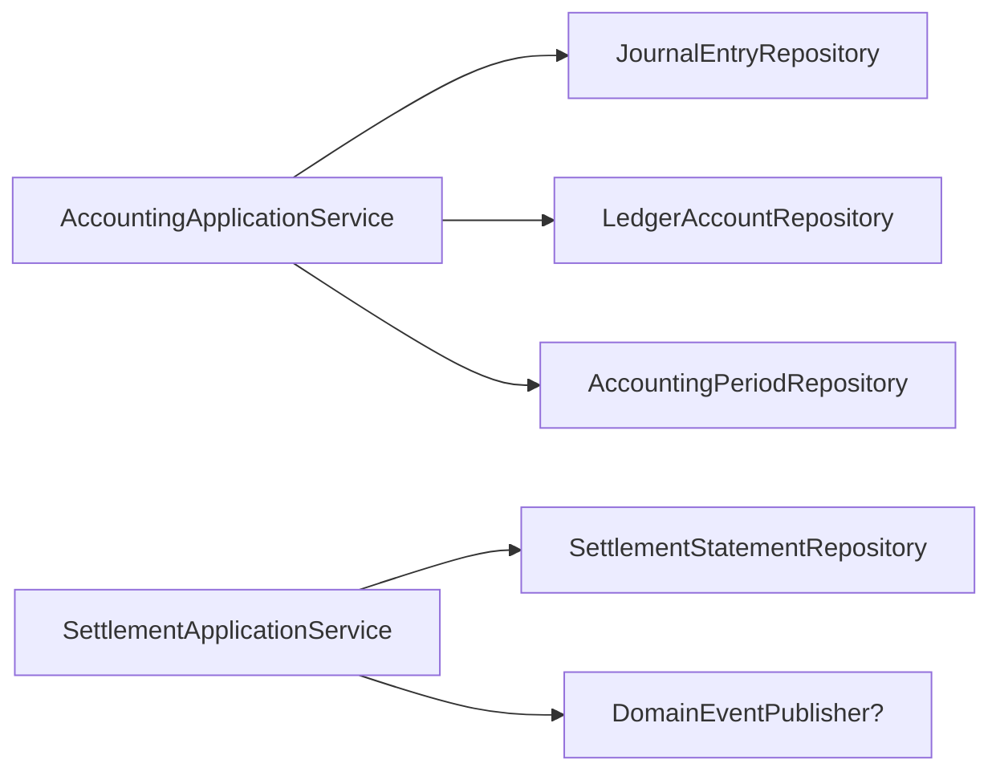

# Accounting System Module

<cite>
**Referenced Files in This Document**
- [JournalEntry.kt](file://j-store-accounting-domain/src/main/kotlin/com/jstore/accounting/domain/journal/JournalEntry.kt)
- [LedgerAccount.kt](file://j-store-accounting-domain/src/main/kotlin/com/jstore/accounting/domain/account/LedgerAccount.kt)
- [SettlementStatement.kt](file://j-store-accounting-domain/src/main/kotlin/com/jstore/accounting/domain/settlement/SettlementStatement.kt)
- [AccountingPeriod.kt](file://j-store-accounting-domain/src/main/kotlin/com/jstore/accounting/domain/journal/AccountingPeriod.kt)
- [AccountingPeriodImpl.kt](file://j-store-accounting-domain/src/main/kotlin/com/jstore/accounting/domain/journal/AccountingPeriodImpl.kt)
- [JournalEntryImpl.kt](file://j-store-accounting-domain/src/main/kotlin/com/jstore/accounting/domain/journal/JournalEntryImpl.kt)
- [SettlementStatementImpl.kt](file://j-store-accounting-domain/src/main/kotlin/com/jstore/accounting/domain/settlement/SettlementStatementImpl.kt)
- [AccountingApplicationService.kt](file://j-store-accounting-application/src/main/kotlin/com/jstore/accounting/service/AccountingApplicationService.kt)
- [SettlementApplicationService.kt](file://j-store-accounting-application/src/main/kotlin/com/jstore/accounting/service/SettlementApplicationService.kt)
- [RecordOrderPaidCMD.kt](file://j-store-accounting-application/src/main/kotlin/com/jstore/accounting/service/command/RecordOrderPaidCMD.kt)
- [RecordOrderCompletedCMD.kt](file://j-store-accounting-application/src/main/kotlin/com/jstore/accounting/service/command/RecordOrderCompletedCMD.kt)
- [RecordOrderRefundApprovedCMD.kt](file://j-store-accounting-application/src/main/kotlin/com/jstore/accounting/service/command/RecordOrderRefundApprovedCMD.kt)
- [RecordSettlementPaidCMD.kt](file://j-store-accounting-application/src/main/kotlin/com/jstore/accounting/service/command/RecordSettlementPaidCMD.kt)
- [AccountingOrderService.kt](file://j-store-accounting-domain/src/main/kotlin/com/jstore/accounting/acl/AccountingOrderService.kt)
</cite>

## Table of Contents
1. [Introduction](#introduction)
2. [Project Structure](#project-structure)
3. [Core Components](#core-components)
4. [Architecture Overview](#architecture-overview)
5. [Detailed Component Analysis](#detailed-component-analysis)
6. [Dependency Analysis](#dependency-analysis)
7. [Performance Considerations](#performance-considerations)
8. [Troubleshooting Guide](#troubleshooting-guide)
9. [Conclusion](#conclusion)
10. [Appendices](#appendices)

## Introduction
This document explains the Accounting System module that implements double-entry bookkeeping for order payments, completions (commission), refunds, and settlement payouts. It covers journal entries, ledger accounts, accounting periods, and settlement statements. It also documents workflows for automatic financial recording triggered by payment and order events, balance calculations, validation constraints, audit trail generation, and reporting considerations. The content is designed to be accessible to beginners while providing sufficient technical depth for experienced developers.

## Project Structure
The Accounting System is organized into domain, application, and infrastructure layers:
- Domain layer defines aggregates and value objects for journal entries, ledger accounts, accounting periods, and settlement statements.
- Application layer orchestrates use cases and commands to record financial events and manage settlements.
- Infrastructure layer provides persistence implementations for repositories.

**Diagram sources**
- [JournalEntry.kt](file://j-store-accounting-domain/src/main/kotlin/com/jstore/accounting/domain/journal/JournalEntry.kt)
- [LedgerAccount.kt](file://j-store-accounting-domain/src/main/kotlin/com/jstore/accounting/domain/account/LedgerAccount.kt)
- [AccountingPeriod.kt](file://j-store-accounting-domain/src/main/kotlin/com/jstore/accounting/domain/journal/AccountingPeriod.kt)
- [SettlementStatement.kt](file://j-store-accounting-domain/src/main/kotlin/com/jstore/accounting/domain/settlement/SettlementStatement.kt)
- [AccountingApplicationService.kt](file://j-store-accounting-application/src/main/kotlin/com/jstore/accounting/service/AccountingApplicationService.kt)
- [SettlementApplicationService.kt](file://j-store-accounting-application/src/main/kotlin/com/jstore/accounting/service/SettlementApplicationService.kt)

**Section sources**
- [JournalEntry.kt](file://j-store-accounting-domain/src/main/kotlin/com/jstore/accounting/domain/journal/JournalEntry.kt)
- [LedgerAccount.kt](file://j-store-accounting-domain/src/main/kotlin/com/jstore/accounting/domain/account/LedgerAccount.kt)
- [AccountingPeriod.kt](file://j-store-accounting-domain/src/main/kotlin/com/jstore/accounting/domain/journal/AccountingPeriod.kt)
- [SettlementStatement.kt](file://j-store-accounting-domain/src/main/kotlin/com/jstore/accounting/domain/settlement/SettlementStatement.kt)
- [AccountingApplicationService.kt](file://j-store-accounting-application/src/main/kotlin/com/jstore/accounting/service/AccountingApplicationService.kt)
- [SettlementApplicationService.kt](file://j-store-accounting-application/src/main/kotlin/com/jstore/accounting/service/SettlementApplicationService.kt)

## Core Components
- Journal Entry: Represents a double-entry transaction with lines (debit/credit), source document linkage, status lifecycle (draft/posted/reversed), and reversal support.
- Ledger Account: Defines chart-of-accounts entries with type (asset/liability/equity/revenue/expense), balance direction, subject scoping (platform/merchant/user/channel), and activation state.
- Accounting Period: Time window for posting entries; supports open/close/reopen operations and date containment checks.
- Settlement Statement: Aggregates merchant settlement lines per period, tracks payable amounts, and supports confirmation and payment marking.

Key behaviors:
- Double-entry rule enforced at entry level via balanced debit/credit lines.
- Period gating ensures postings only occur in open periods.
- Reversal entries maintain an audit trail and link back to original entries.
- Settlement statements summarize net payables after commissions and refunds.

**Section sources**
- [JournalEntry.kt](file://j-store-accounting-domain/src/main/kotlin/com/jstore/accounting/domain/journal/JournalEntry.kt)
- [LedgerAccount.kt](file://j-store-accounting-domain/src/main/kotlin/com/jstore/accounting/domain/account/LedgerAccount.kt)
- [AccountingPeriod.kt](file://j-store-accounting-domain/src/main/kotlin/com/jstore/accounting/domain/journal/AccountingPeriod.kt)
- [SettlementStatement.kt](file://j-store-accounting-domain/src/main/kotlin/com/jstore/accounting/domain/settlement/SettlementStatement.kt)

## Architecture Overview
The application service coordinates domain aggregates and repositories to record financial events and manage settlements. Commands encapsulate inputs from upstream systems (payment/order). Repositories abstract persistence details.

**Diagram sources**
- [AccountingApplicationService.kt](file://j-store-accounting-application/src/main/kotlin/com/jstore/accounting/service/AccountingApplicationService.kt)
- [JournalEntry.kt](file://j-store-accounting-domain/src/main/kotlin/com/jstore/accounting/domain/journal/JournalEntry.kt)
- [AccountingPeriod.kt](file://j-store-accounting-domain/src/main/kotlin/com/jstore/accounting/domain/journal/AccountingPeriod.kt)
- [LedgerAccount.kt](file://j-store-accounting-domain/src/main/kotlin/com/jstore/accounting/domain/account/LedgerAccount.kt)

## Detailed Component Analysis

### Journal Entry and Lines
- Purpose: Capture debits and credits against ledger accounts with strong validation and lifecycle management.
- Key elements:
  - Source document linkage for traceability.
  - Entry types for different business events (order payment, commission, refund reversal, settlement payment, manual adjustment).
  - Status transitions: draft → posted → reversed.
  - Reversal creation linking to original entry.
- Validation:
  - Line amount must be positive.
  - Memo required.
  - Posting requires an open accounting period.
- Balance calculation:
  - Sum of debits equals sum of credits for a posted entry.

**Diagram sources**
- [JournalEntry.kt](file://j-store-accounting-domain/src/main/kotlin/com/jstore/accounting/domain/journal/JournalEntry.kt)

**Section sources**
- [JournalEntry.kt](file://j-store-accounting-domain/src/main/kotlin/com/jstore/accounting/domain/journal/JournalEntry.kt)

### Ledger Accounts and Subjects
- Purpose: Define chart-of-accounts with type, balance direction, and subject scoping.
- Key elements:
  - Types: asset, liability, equity, revenue, expense.
  - Direction: debit or credit default.
  - Subject: platform, merchant, user, channel.
  - Lifecycle: active/inactive.
- Usage:
  - Application service resolves accounts by code and subject; falls back to DEFAULT for merchants when needed.

**Diagram sources**
- [LedgerAccount.kt](file://j-store-accounting-domain/src/main/kotlin/com/jstore/accounting/domain/account/LedgerAccount.kt)

**Section sources**
- [LedgerAccount.kt](file://j-store-accounting-domain/src/main/kotlin/com/jstore/accounting/domain/account/LedgerAccount.kt)

### Accounting Period Management
- Purpose: Control posting windows and ensure compliance with closed periods.
- Key elements:
  - Start/end dates and status (open/closed).
  - Methods to close/reopen with audit fields (closedAt, closedBy).
  - Date containment check used by application services.

**Diagram sources**
- [AccountingPeriod.kt](file://j-store-accounting-domain/src/main/kotlin/com/jstore/accounting/domain/journal/AccountingPeriod.kt)
- [AccountingPeriodImpl.kt](file://j-store-accounting-domain/src/main/kotlin/com/jstore/accounting/domain/journal/AccountingPeriodImpl.kt)

**Section sources**
- [AccountingPeriod.kt](file://j-store-accounting-domain/src/main/kotlin/com/jstore/accounting/domain/journal/AccountingPeriod.kt)
- [AccountingPeriodImpl.kt](file://j-store-accounting-domain/src/main/kotlin/com/jstore/accounting/domain/journal/AccountingPeriodImpl.kt)

### Settlement Statements
- Purpose: Aggregate merchant settlement lines per period and track payable amounts.
- Key elements:
  - Lines include gross/refund/commission/net amounts per order.
  - Status progression: draft → confirmed → paid → cancelled.
  - Confirm and markPaid operations.

**Diagram sources**
- [SettlementStatement.kt](file://j-store-accounting-domain/src/main/kotlin/com/jstore/accounting/domain/settlement/SettlementStatement.kt)

**Section sources**
- [SettlementStatement.kt](file://j-store-accounting-domain/src/main/kotlin/com/jstore/accounting/domain/settlement/SettlementStatement.kt)

### Financial Recording Workflows
The application service implements four primary workflows:

- Record Order Payment:
  - Debit clearing account (channel), credit payable (merchant).
  - Idempotency via source document lookup.
  - Requires open period and active accounts.

- Record Order Completion (Commission):
  - Debit payable (merchant), credit revenue (platform).
  - Uses commission amount from command.

- Record Order Refund Approved:
  - Creates reversal entry linked to original posted entry.
  - Debits payable (merchant), credits clearing (channel).

- Record Settlement Paid:
  - Debits payable (merchant), credits bank (platform).

**Diagram sources**
- [AccountingApplicationService.kt](file://j-store-accounting-application/src/main/kotlin/com/jstore/accounting/service/AccountingApplicationService.kt)
- [RecordOrderPaidCMD.kt](file://j-store-accounting-application/src/main/kotlin/com/jstore/accounting/service/command/RecordOrderPaidCMD.kt)
- [RecordOrderCompletedCMD.kt](file://j-store-accounting-application/src/main/kotlin/com/jstore/accounting/service/command/RecordOrderCompletedCMD.kt)
- [RecordOrderRefundApprovedCMD.kt](file://j-store-accounting-application/src/main/kotlin/com/jstore/accounting/service/command/RecordOrderRefundApprovedCMD.kt)
- [RecordSettlementPaidCMD.kt](file://j-store-accounting-application/src/main/kotlin/com/jstore/accounting/service/command/RecordSettlementPaidCMD.kt)

**Section sources**
- [AccountingApplicationService.kt](file://j-store-accounting-application/src/main/kotlin/com/jstore/accounting/service/AccountingApplicationService.kt)
- [RecordOrderPaidCMD.kt](file://j-store-accounting-application/src/main/kotlin/com/jstore/accounting/service/command/RecordOrderPaidCMD.kt)
- [RecordOrderCompletedCMD.kt](file://j-store-accounting-application/src/main/kotlin/com/jstore/accounting/service/command/RecordOrderCompletedCMD.kt)
- [RecordOrderRefundApprovedCMD.kt](file://j-store-accounting-application/src/main/kotlin/com/jstore/accounting/service/command/RecordOrderRefundApprovedCMD.kt)
- [RecordSettlementPaidCMD.kt](file://j-store-accounting-application/src/main/kotlin/com/jstore/accounting/service/command/RecordSettlementPaidCMD.kt)

### Integration with Payment and Order Systems
- ACL interface for order accounting info retrieval and refund source resolution.
- Commands carry orderId/merchantId and sourceDocument identifiers to tie entries back to business transactions.
- Event-driven publishing can be wired via DomainEventPublisher in settlement flow.

**Diagram sources**
- [AccountingOrderService.kt](file://j-store-accounting-domain/src/main/kotlin/com/jstore/accounting/acl/AccountingOrderService.kt)
- [AccountingApplicationService.kt](file://j-store-accounting-application/src/main/kotlin/com/jstore/accounting/service/AccountingApplicationService.kt)

**Section sources**
- [AccountingOrderService.kt](file://j-store-accounting-domain/src/main/kotlin/com/jstore/accounting/acl/AccountingOrderService.kt)
- [AccountingApplicationService.kt](file://j-store-accounting-application/src/main/kotlin/com/jstore/accounting/service/AccountingApplicationService.kt)

## Dependency Analysis
- Application service depends on:
  - JournalEntryRepository for CRUD and idempotency checks.
  - LedgerAccountRepository for resolving accounts by code and subject.
  - AccountingPeriodRepository for validating open periods.
- Domain aggregates are cohesive around their responsibilities and expose minimal interfaces.
- Settlement flow optionally publishes domain events through a publisher.

**Diagram sources**
- [AccountingApplicationService.kt](file://j-store-accounting-application/src/main/kotlin/com/jstore/accounting/service/AccountingApplicationService.kt)
- [SettlementApplicationService.kt](file://j-store-accounting-application/src/main/kotlin/com/jstore/accounting/service/SettlementApplicationService.kt)

**Section sources**
- [AccountingApplicationService.kt](file://j-store-accounting-application/src/main/kotlin/com/jstore/accounting/service/AccountingApplicationService.kt)
- [SettlementApplicationService.kt](file://j-store-accounting-application/src/main/kotlin/com/jstore/accounting/service/SettlementApplicationService.kt)

## Performance Considerations
- Idempotent recording via sourceDocument lookups prevents duplicate entries.
- Repository calls should be cached where appropriate (e.g., frequently accessed accounts).
- Batch operations for settlement line aggregation can reduce round-trips.
- Avoid heavy computations in hot paths; defer to background jobs if needed.

[No sources needed since this section provides general guidance]

## Troubleshooting Guide
Common issues and resolutions:
- Duplicate journal entry: Ensure sourceDocument uniqueness; verify idempotency logic.
- Invalid accounting period: Confirm period is open for the given accountingDate.
- Missing or inactive accounts: Verify accounts exist and are active; fallback to DEFAULT for merchant subjects if applicable.
- Refund reversal errors: Original entry must be posted; ensure correct originalSourceDocument reference.
- Settlement not found: Validate statementId and repository availability.

Validation constraints observed:
- Positive amounts for journal lines.
- Non-blank memos and identifiers.
- Period start/end ordering and non-empty closing metadata.

Audit trail:
- Entry statuses and timestamps (createdAt, postedAt).
- Reversal linkage to original entry.
- Period closure metadata (closedAt, closedBy).

**Section sources**
- [JournalEntry.kt](file://j-store-accounting-domain/src/main/kotlin/com/jstore/accounting/domain/journal/JournalEntry.kt)
- [AccountingPeriodImpl.kt](file://j-store-accounting-domain/src/main/kotlin/com/jstore/accounting/domain/journal/AccountingPeriodImpl.kt)
- [AccountingApplicationService.kt](file://j-store-accounting-application/src/main/kotlin/com/jstore/accounting/service/AccountingApplicationService.kt)

## Conclusion
The Accounting System module provides a robust double-entry framework with clear separation of concerns across domain, application, and infrastructure layers. It enforces accounting rules, supports reversals, manages periods, and integrates seamlessly with order and payment systems. With proper repository implementations and event publishing, it enables reliable financial recording, settlement processing, and auditability.

[No sources needed since this section summarizes without analyzing specific files]

## Appendices

### Example Scenarios

- Create a journal entry for order payment:
  - Inputs: orderId, merchantId, paidAmount, accountingDate, sourceDocument.
  - Actions: resolve clearing and payable accounts, build debits/credits, post in open period, save entry.
  - Outcome: balanced entry with audit fields and idempotency key.

- Calculate account balances:
  - For each ledger account, sum debits and credits across all posted entries within a period.
  - Net balance = totalDebits - totalCredits (respecting account direction).

- Process settlement:
  - Aggregate settlement lines per merchant and period.
  - Confirm statement, then mark paid; publish events if configured.

[No sources needed since this section provides conceptual examples]