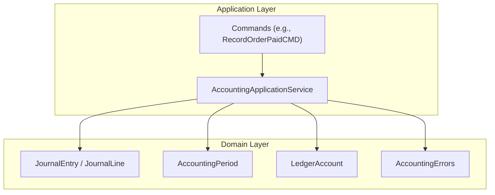
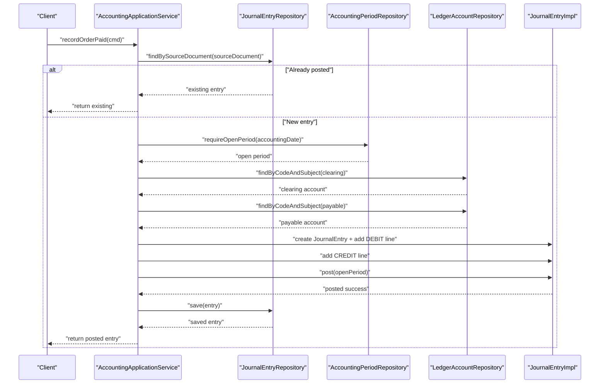
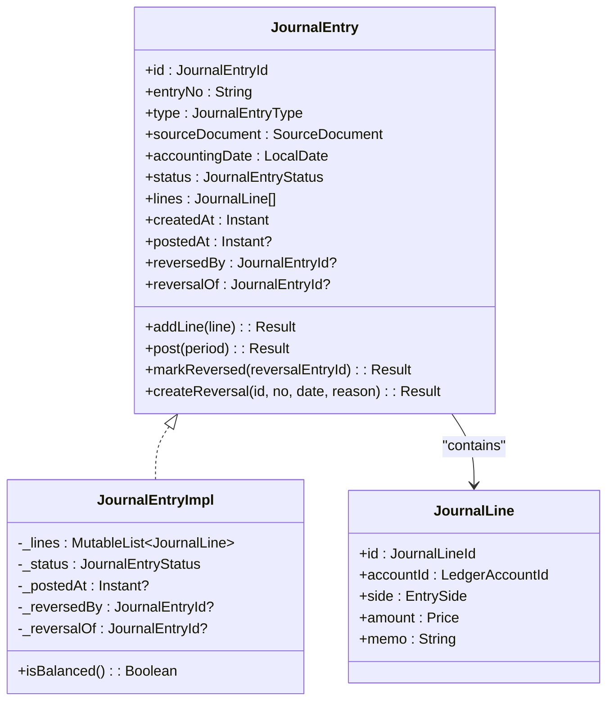
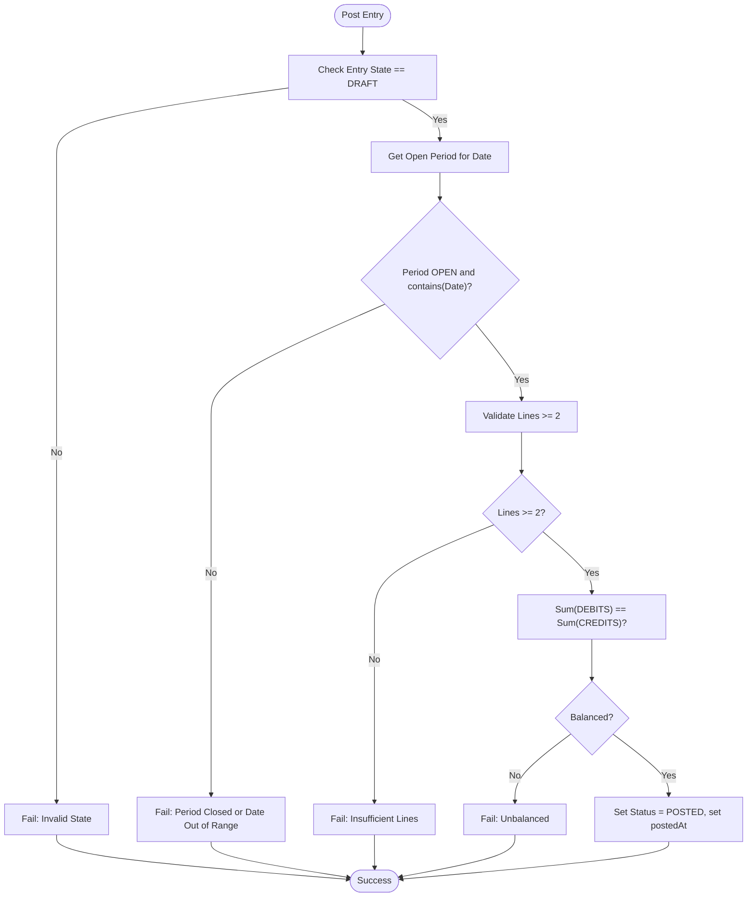
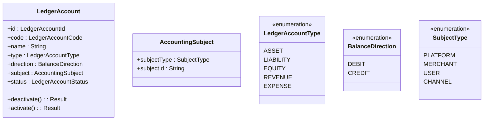
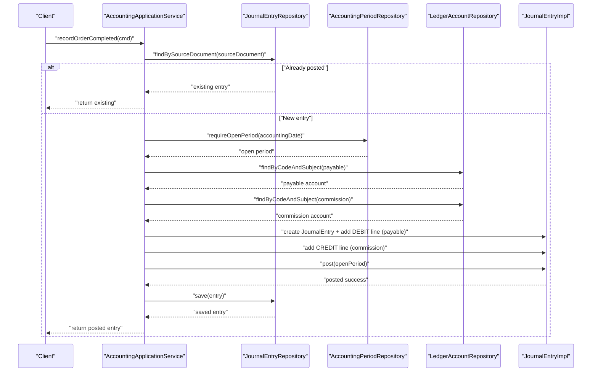
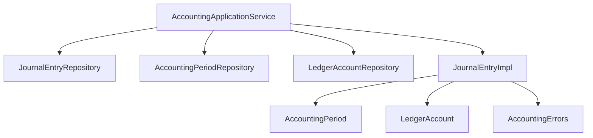

# Double-Entry Bookkeeping Core

<cite>
**Referenced Files in This Document**
- [JournalEntry.kt](file://j-store-accounting-domain/src/main/kotlin/com/jstore/accounting/domain/journal/JournalEntry.kt)
- [JournalEntryImpl.kt](file://j-store-accounting-domain/src/main/kotlin/com/jstore/accounting/domain/journal/JournalEntryImpl.kt)
- [AccountingPeriod.kt](file://j-store-accounting-domain/src/main/kotlin/com/jstore/accounting/domain/journal/AccountingPeriod.kt)
- [AccountingErrors.kt](file://j-store-accounting-domain/src/main/kotlin/com/jstore/accounting/domain/journal/AccountingErrors.kt)
- [LedgerAccount.kt](file://j-store-accounting-domain/src/main/kotlin/com/jstore/accounting/domain/account/LedgerAccount.kt)
- [AccountingApplicationService.kt](file://j-store-accounting-application/src/main/kotlin/com/jstore/accounting/service/AccountingApplicationService.kt)
- [RecordOrderPaidCMD.kt](file://j-store-accounting-application/src/main/kotlin/com/jstore/accounting/service/command/RecordOrderPaidCMD.kt)
- [JournalEntryUnitTest.kt](file://j-store-accounting-domain/src/test/kotlin/com/jstore/accounting/domain/journal/JournalEntryUnitTest.kt)
</cite>

## Table of Contents
1. Introduction
2. Project Structure
3. Core Components
4. Architecture Overview
5. Detailed Component Analysis
6. Dependency Analysis
7. Performance Considerations
8. Troubleshooting Guide
9. Conclusion

## Introduction
This document explains the double-entry bookkeeping core system implemented in the accounting domain. It focuses on how JournalEntry and JournalLine aggregates enforce accounting principles, maintain balance between debits and credits, and ensure financial integrity through strict validation rules. It also documents SourceDocument tracking for audit trails, supported entry types, status lifecycle (DRAFT, POSTED, REVERSED), and the relationship between journal lines and ledger accounts. Concrete examples illustrate creating balanced entries, handling different transaction types, and maintaining accounting accuracy.

## Project Structure
The double-entry bookkeeping core is primarily defined in the accounting domain module with application services orchestrating use cases:
- Domain layer defines aggregates, value objects, enumerations, and error definitions for journals, periods, and ledger accounts.
- Application layer composes commands and repositories to create and post journal entries for business events like order payments, completions, refunds, and settlements.

**Diagram sources**
- [JournalEntry.kt](file://j-store-accounting-domain/src/main/kotlin/com/jstore/accounting/domain/journal/JournalEntry.kt)
- [JournalEntryImpl.kt](file://j-store-accounting-domain/src/main/kotlin/com/jstore/accounting/domain/journal/JournalEntryImpl.kt)
- [AccountingPeriod.kt](file://j-store-accounting-domain/src/main/kotlin/com/jstore/accounting/domain/journal/AccountingPeriod.kt)
- [LedgerAccount.kt](file://j-store-accounting-domain/src/main/kotlin/com/jstore/accounting/domain/account/LedgerAccount.kt)
- [AccountingErrors.kt](file://j-store-accounting-domain/src/main/kotlin/com/jstore/accounting/domain/journal/AccountingErrors.kt)
- [AccountingApplicationService.kt](file://j-store-accounting-application/src/main/kotlin/com/jstore/accounting/service/AccountingApplicationService.kt)
- [RecordOrderPaidCMD.kt](file://j-store-accounting-application/src/main/kotlin/com/jstore/accounting/service/command/RecordOrderPaidCMD.kt)

**Section sources**
- [JournalEntry.kt](file://j-store-accounting-domain/src/main/kotlin/com/jstore/accounting/domain/journal/JournalEntry.kt)
- [JournalEntryImpl.kt](file://j-store-accounting-domain/src/main/kotlin/com/jstore/accounting/domain/journal/JournalEntryImpl.kt)
- [AccountingPeriod.kt](file://j-store-accounting-domain/src/main/kotlin/com/jstore/accounting/domain/journal/AccountingPeriod.kt)
- [LedgerAccount.kt](file://j-store-accounting-domain/src/main/kotlin/com/jstore/accounting/domain/account/LedgerAccount.kt)
- [AccountingErrors.kt](file://j-store-accounting-domain/src/main/kotlin/com/jstore/accounting/domain/journal/AccountingErrors.kt)
- [AccountingApplicationService.kt](file://j-store-accounting-application/src/main/kotlin/com/jstore/accounting/service/AccountingApplicationService.kt)
- [RecordOrderPaidCMD.kt](file://j-store-accounting-application/src/main/kotlin/com/jstore/accounting/service/command/RecordOrderPaidCMD.kt)

## Core Components
- JournalEntry aggregate: Represents a complete double-entry record with type, source document, accounting date, status, and a list of JournalLine items. It enforces posting rules, balance checks, and reversal creation.
- JournalLine entity: Represents a single debit or credit line with an account reference, side (DEBIT/CREDIT), amount, and memo. Amounts must be positive; memos are required.
- AccountingPeriod: Defines open/closed periods and validates that postings occur within open periods containing the accounting date.
- LedgerAccount: Represents chart-of-accounts entries with code, name, type, direction, subject, and active/inactive status.
- SourceDocument: Tracks origin of entries (ORDER, REFUND, SETTLEMENT, ADJUSTMENT) with sourceId and eventType for auditability.
- Entry types and statuses: Supported entry types include ORDER_PAYMENT, ORDER_COMPLETION_COMMISSION, ORDER_REFUND_REVERSAL, SETTLEMENT_PAYMENT, MANUAL_ADJUSTMENT. Statuses progress DRAFT → POSTED → REVERSED.

Key validation rules:
- JournalLine amount > 0 and memo non-blank.
- At least two lines required to post.
- Sum(DEBITS) must equal Sum(CREDITS).
- Posting allowed only when status is DRAFT and period is OPEN and contains accounting date.
- Reversal requires original entry in POSTED state and a non-blank reason; reversal flips sides and keeps original lines unchanged.

**Section sources**
- [JournalEntry.kt](file://j-store-accounting-domain/src/main/kotlin/com/jstore/accounting/domain/journal/JournalEntry.kt)
- [JournalEntryImpl.kt](file://j-store-accounting-domain/src/main/kotlin/com/jstore/accounting/domain/journal/JournalEntryImpl.kt)
- [AccountingPeriod.kt](file://j-store-accounting-domain/src/main/kotlin/com/jstore/accounting/domain/journal/AccountingPeriod.kt)
- [LedgerAccount.kt](file://j-store-accounting-domain/src/main/kotlin/com/jstore/accounting/domain/account/LedgerAccount.kt)
- [AccountingErrors.kt](file://j-store-accounting-domain/src/main/kotlin/com/jstore/accounting/domain/journal/AccountingErrors.kt)

## Architecture Overview
The application service coordinates command processing by:
- Ensuring idempotency via source document lookup.
- Resolving an open accounting period for the accounting date.
- Resolving ledger accounts by code and subject (with fallback for merchant defaults).
- Building a JournalEntry, adding balanced lines, and posting it.
- Persisting the entry via repository.

**Diagram sources**
- [AccountingApplicationService.kt](file://j-store-accounting-application/src/main/kotlin/com/jstore/accounting/service/AccountingApplicationService.kt)
- [JournalEntryImpl.kt](file://j-store-accounting-domain/src/main/kotlin/com/jstore/accounting/domain/journal/JournalEntryImpl.kt)
- [AccountingPeriod.kt](file://j-store-accounting-domain/src/main/kotlin/com/jstore/accounting/domain/journal/AccountingPeriod.kt)
- [LedgerAccount.kt](file://j-store-accounting-domain/src/main/kotlin/com/jstore/accounting/domain/account/LedgerAccount.kt)

## Detailed Component Analysis

### JournalEntry Aggregate
- Responsibilities:
  - Maintain entry metadata (type, source document, accounting date, status).
  - Manage lines and enforce posting constraints.
  - Provide reversal creation that flips sides and preserves original lines.
- Posting flow:
  - Validates state (must be DRAFT).
  - Validates period (OPEN and contains accounting date).
  - Requires at least two lines.
  - Enforces balance: sum(DEBITS) == sum(CREDITS).
  - Transitions to POSTED and records posted timestamp.
- Reversal flow:
  - Requires original entry in POSTED state.
  - Requires non-blank reason.
  - Creates new entry with flipped sides and links reversalOf.

**Diagram sources**
- [JournalEntry.kt](file://j-store-accounting-domain/src/main/kotlin/com/jstore/accounting/domain/journal/JournalEntry.kt)
- [JournalEntryImpl.kt](file://j-store-accounting-domain/src/main/kotlin/com/jstore/accounting/domain/journal/JournalEntryImpl.kt)

**Section sources**
- [JournalEntry.kt](file://j-store-accounting-domain/src/main/kotlin/com/jstore/accounting/domain/journal/JournalEntry.kt)
- [JournalEntryImpl.kt](file://j-store-accounting-domain/src/main/kotlin/com/jstore/accounting/domain/journal/JournalEntryImpl.kt)

### Accounting Period Validation
- Purpose: Ensure postings occur within open periods that contain the accounting date.
- Behavior:
  - Contains(date) checks if date falls within period boundaries.
  - close/reopen transitions manage period lifecycle.
  - Post operation fails if period is closed or does not contain accounting date.

**Diagram sources**
- [JournalEntryImpl.kt](file://j-store-accounting-domain/src/main/kotlin/com/jstore/accounting/domain/journal/JournalEntryImpl.kt)
- [AccountingPeriod.kt](file://j-store-accounting-domain/src/main/kotlin/com/jstore/accounting/domain/journal/AccountingPeriod.kt)

**Section sources**
- [JournalEntryImpl.kt](file://j-store-accounting-domain/src/main/kotlin/com/jstore/accounting/domain/journal/JournalEntryImpl.kt)
- [AccountingPeriod.kt](file://j-store-accounting-domain/src/main/kotlin/com/jstore/accounting/domain/journal/AccountingPeriod.kt)

### Ledger Accounts and Subjects
- LedgerAccount represents chart-of-accounts entities with:
  - Code (e.g., 1010 for clearing, 2101 for payable, 3001 for revenue).
  - Type (ASSET, LIABILITY, EQUITY, REVENUE, EXPENSE).
  - Direction (DEBIT, CREDIT).
  - Subject (PLATFORM, MERCHANT, USER, CHANNEL) and subjectId.
  - Status (ACTIVE, INACTIVE).
- Application service resolves accounts by code and subject, with fallback to DEFAULT for merchants.

**Diagram sources**
- [LedgerAccount.kt](file://j-store-accounting-domain/src/main/kotlin/com/jstore/accounting/domain/account/LedgerAccount.kt)

**Section sources**
- [LedgerAccount.kt](file://j-store-accounting-domain/src/main/kotlin/com/jstore/accounting/domain/account/LedgerAccount.kt)

### Application Use Cases and Transaction Types
- Order Payment:
  - DEBIT clearing account (channel), CREDIT payable account (merchant).
  - Ensures source document uniqueness to prevent duplicate postings.
- Order Completion Commission:
  - DEBIT payable account (merchant), CREDIT commission revenue (platform).
- Order Refund Reversal:
  - DEBIT payable account (merchant), CREDIT clearing account (channel).
  - Requires original entry to be POSTED.
- Settlement Paid:
  - DEBIT payable account (merchant), CREDIT bank account (platform).

**Diagram sources**
- [AccountingApplicationService.kt](file://j-store-accounting-application/src/main/kotlin/com/jstore/accounting/service/AccountingApplicationService.kt)
- [JournalEntryImpl.kt](file://j-store-accounting-domain/src/main/kotlin/com/jstore/accounting/domain/journal/JournalEntryImpl.kt)

**Section sources**
- [AccountingApplicationService.kt](file://j-store-accounting-application/src/main/kotlin/com/jstore/accounting/service/AccountingApplicationService.kt)

### Audit Trail and SourceDocument Tracking
- SourceDocument captures:
  - sourceType (ORDER, REFUND, SETTLEMENT, ADJUSTMENT).
  - sourceId (unique identifier from originating business entity).
  - eventType (event name triggering the entry).
- Idempotency:
  - Application service checks for existing entry by source document before creating a new one.
- Reversals:
  - Reversal entries link back to original entry via reversalOf and carry reason in memo.

**Section sources**
- [JournalEntry.kt](file://j-store-accounting-domain/src/main/kotlin/com/jstore/accounting/domain/journal/JournalEntry.kt)
- [AccountingApplicationService.kt](file://j-store-accounting-application/src/main/kotlin/com/jstore/accounting/service/AccountingApplicationService.kt)

### Status Management and Business Rules
- Status progression:
  - DRAFT: Initial state; lines can be added.
  - POSTED: After successful posting; immutable lines; can be reversed.
  - REVERSED: Marked by a reversal entry; prevents further modifications.
- Business rules enforced:
  - Cannot modify posted entries.
  - Must have at least two lines.
  - Debits must equal credits.
  - Posting requires open period containing accounting date.
  - Reversal requires non-blank reason and original entry in POSTED state.

**Section sources**
- [JournalEntryImpl.kt](file://j-store-accounting-domain/src/main/kotlin/com/jstore/accounting/domain/journal/JournalEntryImpl.kt)
- [AccountingErrors.kt](file://j-store-accounting-domain/src/main/kotlin/com/jstore/accounting/domain/journal/AccountingErrors.kt)

## Dependency Analysis
- Application service depends on:
  - JournalEntryRepository for persistence and ID generation.
  - AccountingPeriodRepository for period resolution.
  - LedgerAccountRepository for account resolution and activation checks.
- Domain aggregates depend on:
  - Common framework interfaces (AggregateRoot, RecordsDomainEvents).
  - Common properties (Price, Id).
  - Error definitions (BusinessError).

**Diagram sources**
- [AccountingApplicationService.kt](file://j-store-accounting-application/src/main/kotlin/com/jstore/accounting/service/AccountingApplicationService.kt)
- [JournalEntryImpl.kt](file://j-store-accounting-domain/src/main/kotlin/com/jstore/accounting/domain/journal/JournalEntryImpl.kt)
- [AccountingPeriod.kt](file://j-store-accounting-domain/src/main/kotlin/com/jstore/accounting/domain/journal/AccountingPeriod.kt)
- [LedgerAccount.kt](file://j-store-accounting-domain/src/main/kotlin/com/jstore/accounting/domain/account/LedgerAccount.kt)
- [AccountingErrors.kt](file://j-store-accounting-domain/src/main/kotlin/com/jstore/accounting/domain/journal/AccountingErrors.kt)

**Section sources**
- [AccountingApplicationService.kt](file://j-store-accounting-application/src/main/kotlin/com/jstore/accounting/service/AccountingApplicationService.kt)
- [JournalEntryImpl.kt](file://j-store-accounting-domain/src/main/kotlin/com/jstore/accounting/domain/journal/JournalEntryImpl.kt)
- [AccountingPeriod.kt](file://j-store-accounting-domain/src/main/kotlin/com/jstore/accounting/domain/journal/AccountingPeriod.kt)
- [LedgerAccount.kt](file://j-store-accounting-domain/src/main/kotlin/com/jstore/accounting/domain/account/LedgerAccount.kt)
- [AccountingErrors.kt](file://j-store-accounting-domain/src/main/kotlin/com/jstore/accounting/domain/journal/AccountingErrors.kt)

## Performance Considerations
- Idempotency checks via source document lookup avoid redundant work and ensure consistency.
- Minimal validation overhead: simple arithmetic sums for balance checks; efficient for typical entry sizes.
- Repository abstractions allow caching strategies if needed (e.g., account lookups).
- Avoid unnecessary object creation in hot paths; reuse where appropriate.

[No sources needed since this section provides general guidance]

## Troubleshooting Guide
Common errors and resolutions:
- JOURNAL_ENTRY_UNBALANCED: Ensure sum(DEBITS) equals sum(CREDITS); verify amounts and sides.
- JOURNAL_ENTRY_ALREADY_POSTED: Do not modify posted entries; create a reversal instead.
- ACCOUNTING_PERIOD_CLOSED: Verify period is OPEN and contains accounting date.
- JOURNAL_ENTRY_LINES_INSUFFICIENT: Add at least two lines.
- JOURNAL_ENTRY_INVALID_STATE: Ensure original entry is POSTED before reversing; provide non-blank reason.
- Account not found: Confirm ledger accounts exist and are ACTIVE; check subject mappings and fallback logic.

**Section sources**
- [AccountingErrors.kt](file://j-store-accounting-domain/src/main/kotlin/com/jstore/accounting/domain/journal/AccountingErrors.kt)
- [JournalEntryImpl.kt](file://j-store-accounting-domain/src/main/kotlin/com/jstore/accounting/domain/journal/JournalEntryImpl.kt)
- [AccountingApplicationService.kt](file://j-store-accounting-application/src/main/kotlin/com/jstore/accounting/service/AccountingApplicationService.kt)

## Conclusion
The double-entry bookkeeping core enforces fundamental accounting principles through robust domain models and application orchestration. JournalEntry and JournalLine aggregates guarantee balanced entries, while AccountingPeriod and LedgerAccount ensure valid posting contexts and correct account mapping. SourceDocument tracking provides auditability and idempotency. The system’s validation rules and status management protect financial integrity across order payments, commissions, refunds, and settlements.

[No sources needed since this section summarizes without analyzing specific files]