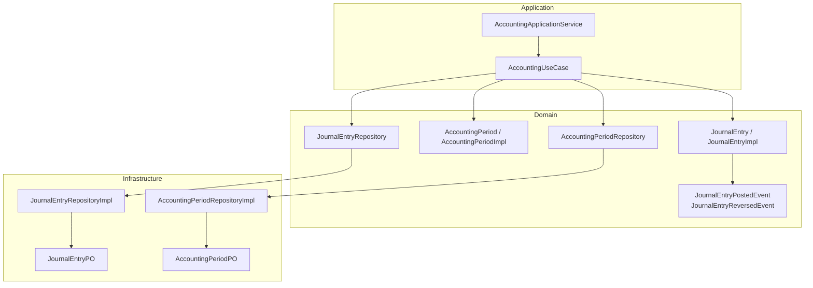
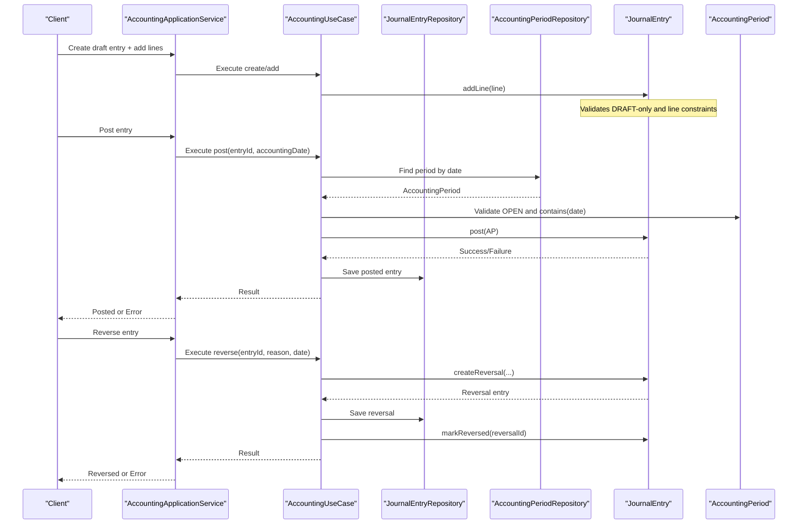
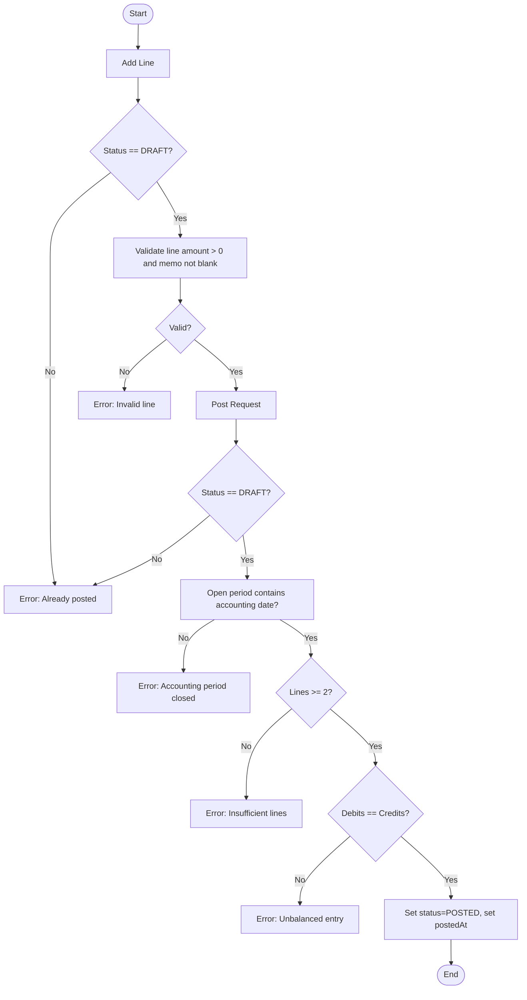
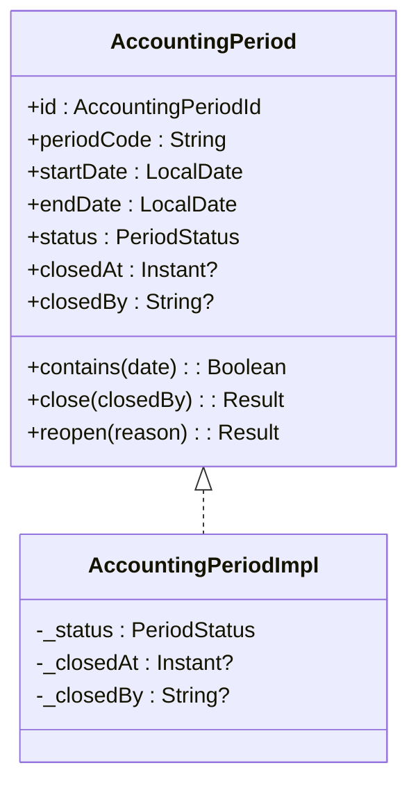
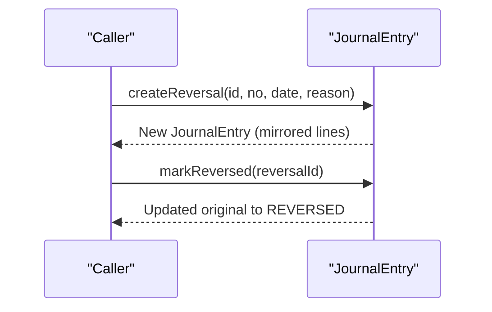
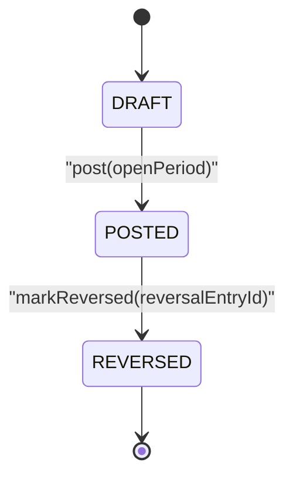
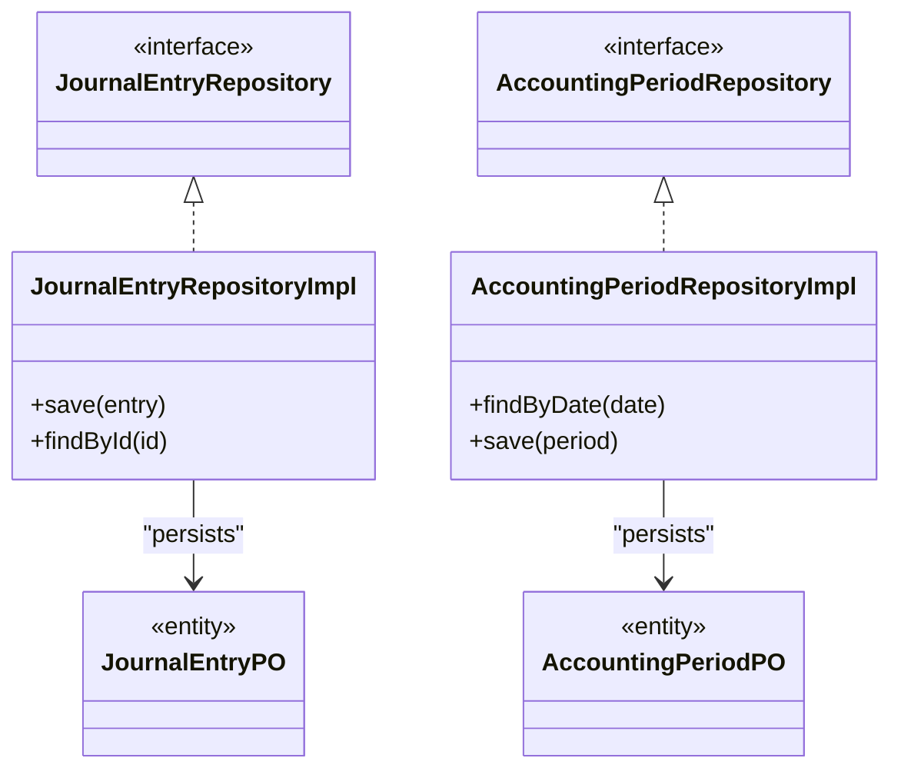
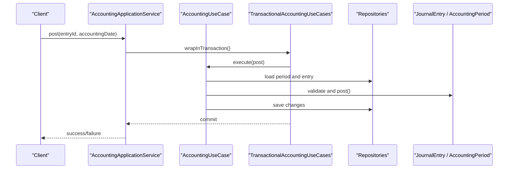
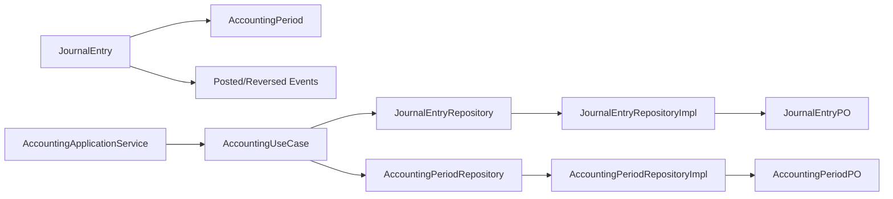

# Journal Entry Lifecycle

<cite>
**Referenced Files in This Document**
- [JournalEntry.kt](file://j-store-accounting-domain/src/main/kotlin/com/jstore/accounting/domain/journal/JournalEntry.kt)
- [JournalEntryImpl.kt](file://j-store-accounting-domain/src/main/kotlin/com/jstore/accounting/domain/journal/JournalEntryImpl.kt)
- [AccountingPeriod.kt](file://j-store-accounting-domain/src/main/kotlin/com/jstore/accounting/domain/journal/AccountingPeriod.kt)
- [AccountingPeriodImpl.kt](file://j-store-accounting-domain/src/main/kotlin/com/jstore/accounting/domain/journal/AccountingPeriodImpl.kt)
- [JournalEntryRepository.kt](file://j-store-accounting-domain/src/main/kotlin/com/jstore/accounting/domain/journal/JournalEntryRepository.kt)
- [AccountingPeriodRepository.kt](file://j-store-accounting-domain/src/main/kotlin/com/jstore/accounting/domain/journal/AccountingPeriodRepository.kt)
- [JournalEntryRepositoryImpl.kt](file://j-store-accounting-infrastructure/src/main/kotlin/com/jstore/accounting/domain/journal/JournalEntryRepositoryImpl.kt)
- [AccountingPeriodRepositoryImpl.kt](file://j-store-accounting-infrastructure/src/main/kotlin/com/jstore/accounting/domain/journal/AccountingPeriodRepositoryImpl.kt)
- [JournalEntryPO.kt](file://j-store-accounting-infrastructure/src/main/kotlin/com/jstore/accounting/domain/journal/persistence/JournalEntryPO.kt)
- [AccountingPeriodPO.kt](file://j-store-accounting-infrastructure/src/main/kotlin/com/jstore/accounting/domain/journal/persistence/AccountingPeriodPO.kt)
- [JournalEntryPostedEvent.kt](file://j-store-accounting-domain/src/main/kotlin/com/jstore/accounting/domain/journal/event/JournalEntryPostedEvent.kt)
- [JournalEntryReversedEvent.kt](file://j-store-accounting-domain/src/main/kotlin/com/jstore/accounting/domain/journal/event/JournalEntryReversedEvent.kt)
- [AccountingApplicationService.kt](file://j-store-accounting-application/src/main/kotlin/com/jstore/accounting/service/AccountingApplicationService.kt)
- [AccountingUseCase.kt](file://j-store-accounting-application/src/main/kotlin/com/jstore/accounting/service/AccountingUseCase.kt)
- [TransactionalAccountingUseCases.kt](file://j-store-accounting-boot/src/main/kotlin/com/jstore/accounting/config/TransactionalAccountingUseCases.kt)
</cite>

## Table of Contents
1. Introduction
2. Project Structure
3. Core Components
4. Architecture Overview
5. Detailed Component Analysis
6. Dependency Analysis
7. Performance Considerations
8. Troubleshooting Guide
9. Conclusion

## Introduction
This document explains the journal entry lifecycle management in the accounting domain, covering the complete workflow from draft creation to posting and reversal. It details validation rules at each stage, accounting period constraints, status transitions (DRAFT → POSTED → REVERSED), integration with AccountingPeriod for date-based restrictions, the post() method implementation, and reversal processes. It also includes examples, error scenarios, and audit trail considerations for financial reporting compliance.

## Project Structure
The journal entry lifecycle is implemented across three layers:
- Domain layer: defines aggregates, value objects, events, and repositories interfaces.
- Application layer: orchestrates use cases and commands.
- Infrastructure layer: implements persistence and repository adapters.

**Diagram sources**
- [JournalEntry.kt](file://j-store-accounting-domain/src/main/kotlin/com/jstore/accounting/domain/journal/JournalEntry.kt)
- [JournalEntryImpl.kt](file://j-store-accounting-domain/src/main/kotlin/com/jstore/accounting/domain/journal/JournalEntryImpl.kt)
- [AccountingPeriod.kt](file://j-store-accounting-domain/src/main/kotlin/com/jstore/accounting/domain/journal/AccountingPeriod.kt)
- [AccountingPeriodImpl.kt](file://j-store-accounting-domain/src/main/kotlin/com/jstore/accounting/domain/journal/AccountingPeriodImpl.kt)
- [JournalEntryRepository.kt](file://j-store-accounting-domain/src/main/kotlin/com/jstore/accounting/domain/journal/JournalEntryRepository.kt)
- [AccountingPeriodRepository.kt](file://j-store-accounting-domain/src/main/kotlin/com/jstore/accounting/domain/journal/AccountingPeriodRepository.kt)
- [JournalEntryRepositoryImpl.kt](file://j-store-accounting-infrastructure/src/main/kotlin/com/jstore/accounting/domain/journal/JournalEntryRepositoryImpl.kt)
- [AccountingPeriodRepositoryImpl.kt](file://j-store-accounting-infrastructure/src/main/kotlin/com/jstore/accounting/domain/journal/AccountingPeriodRepositoryImpl.kt)
- [JournalEntryPO.kt](file://j-store-accounting-infrastructure/src/main/kotlin/com/jstore/accounting/domain/journal/persistence/JournalEntryPO.kt)
- [AccountingPeriodPO.kt](file://j-store-accounting-infrastructure/src/main/kotlin/com/jstore/accounting/domain/journal/persistence/AccountingPeriodPO.kt)
- [JournalEntryPostedEvent.kt](file://j-store-accounting-domain/src/main/kotlin/com/jstore/accounting/domain/journal/event/JournalEntryPostedEvent.kt)
- [JournalEntryReversedEvent.kt](file://j-store-accounting-domain/src/main/kotlin/com/jstore/accounting/domain/journal/event/JournalEntryReversedEvent.kt)
- [AccountingApplicationService.kt](file://j-store-accounting-application/src/main/kotlin/com/jstore/accounting/service/AccountingApplicationService.kt)
- [AccountingUseCase.kt](file://j-store-accounting-application/src/main/kotlin/com/jstore/accounting/service/AccountingUseCase.kt)

**Section sources**
- [JournalEntry.kt](file://j-store-accounting-domain/src/main/kotlin/com/jstore/accounting/domain/journal/JournalEntry.kt)
- [JournalEntryImpl.kt](file://j-store-accounting-domain/src/main/kotlin/com/jstore/accounting/domain/journal/JournalEntryImpl.kt)
- [AccountingPeriod.kt](file://j-store-accounting-domain/src/main/kotlin/com/jstore/accounting/domain/journal/AccountingPeriod.kt)
- [AccountingPeriodImpl.kt](file://j-store-accounting-domain/src/main/kotlin/com/jstore/accounting/domain/journal/AccountingPeriodImpl.kt)
- [JournalEntryRepository.kt](file://j-store-accounting-domain/src/main/kotlin/com/jstore/accounting/domain/journal/JournalEntryRepository.kt)
- [AccountingPeriodRepository.kt](file://j-store-accounting-domain/src/main/kotlin/com/jstore/accounting/domain/journal/AccountingPeriodRepository.kt)
- [JournalEntryRepositoryImpl.kt](file://j-store-accounting-infrastructure/src/main/kotlin/com/jstore/accounting/domain/journal/JournalEntryRepositoryImpl.kt)
- [AccountingPeriodRepositoryImpl.kt](file://j-store-accounting-infrastructure/src/main/kotlin/com/jstore/accounting/domain/journal/AccountingPeriodRepositoryImpl.kt)
- [JournalEntryPO.kt](file://j-store-accounting-infrastructure/src/main/kotlin/com/jstore/accounting/domain/journal/persistence/JournalEntryPO.kt)
- [AccountingPeriodPO.kt](file://j-store-accounting-infrastructure/src/main/kotlin/com/jstore/accounting/domain/journal/persistence/AccountingPeriodPO.kt)
- [JournalEntryPostedEvent.kt](file://j-store-accounting-domain/src/main/kotlin/com/jstore/accounting/domain/journal/event/JournalEntryPostedEvent.kt)
- [JournalEntryReversedEvent.kt](file://j-store-accounting-domain/src/main/kotlin/com/jstore/accounting/domain/journal/event/JournalEntryReversedEvent.kt)
- [AccountingApplicationService.kt](file://j-store-accounting-application/src/main/kotlin/com/jstore/accounting/service/AccountingApplicationService.kt)
- [AccountingUseCase.kt](file://j-store-accounting-application/src/main/kotlin/com/jstore/accounting/service/AccountingUseCase.kt)

## Core Components
- JournalEntry and JournalLine define the core data model and behaviors for creating, validating, posting, and reversing entries.
- AccountingPeriod enforces open/closed state and date containment checks for posting.
- Repositories abstract persistence; implementations persist entities and support queries needed by application services.
- Events capture posted and reversed states for audit trails and downstream processing.

Key responsibilities:
- Draft creation and line addition are guarded by DRAFT-only state.
- Posting validates period openness, date containment, minimum lines, and balance.
- Reversal creates a mirrored entry with debits/credits flipped and marks original as reversed.

**Section sources**
- [JournalEntry.kt](file://j-store-accounting-domain/src/main/kotlin/com/jstore/accounting/domain/journal/JournalEntry.kt)
- [JournalEntryImpl.kt](file://j-store-accounting-domain/src/main/kotlin/com/jstore/accounting/domain/journal/JournalEntryImpl.kt)
- [AccountingPeriod.kt](file://j-store-accounting-domain/src/main/kotlin/com/jstore/accounting/domain/journal/AccountingPeriod.kt)
- [AccountingPeriodImpl.kt](file://j-store-accounting-domain/src/main/kotlin/com/jstore/accounting/domain/journal/AccountingPeriodImpl.kt)

## Architecture Overview
The lifecycle flows through application use cases that orchestrate domain operations and infrastructure persistence.

**Diagram sources**
- [AccountingApplicationService.kt](file://j-store-accounting-application/src/main/kotlin/com/jstore/accounting/service/AccountingApplicationService.kt)
- [AccountingUseCase.kt](file://j-store-accounting-application/src/main/kotlin/com/jstore/accounting/service/AccountingUseCase.kt)
- [JournalEntryRepository.kt](file://j-store-accounting-domain/src/main/kotlin/com/jstore/accounting/domain/journal/JournalEntryRepository.kt)
- [AccountingPeriodRepository.kt](file://j-store-accounting-domain/src/main/kotlin/com/jstore/accounting/domain/journal/AccountingPeriodRepository.kt)
- [JournalEntry.kt](file://j-store-accounting-domain/src/main/kotlin/com/jstore/accounting/domain/journal/JournalEntry.kt)
- [AccountingPeriod.kt](file://j-store-accounting-domain/src/main/kotlin/com/jstore/accounting/domain/journal/AccountingPeriod.kt)

## Detailed Component Analysis

### JournalEntry Lifecycle and Validation Rules
- Draft creation:
  - Entry must have a non-blank entry number.
  - Lines can be added only when status is DRAFT.
  - Each line requires amount > 0 and non-blank memo.
- Posting:
  - Only DRAFT entries can be posted.
  - Accounting period must be OPEN and contain the accounting date.
  - At least two lines required.
  - Debits must equal credits (balanced).
  - On success, status becomes POSTED and posted timestamp recorded.
- Reversal:
  - Only POSTED entries can be reversed.
  - createReversal builds a new entry with debits/credits flipped and sets reversalOf reference.
  - markReversed updates original entry to REVERSED and records reversal entry id.

**Diagram sources**
- [JournalEntryImpl.kt](file://j-store-accounting-domain/src/main/kotlin/com/jstore/accounting/domain/journal/JournalEntryImpl.kt)
- [JournalEntry.kt](file://j-store-accounting-domain/src/main/kotlin/com/jstore/accounting/domain/journal/JournalEntry.kt)

**Section sources**
- [JournalEntry.kt](file://j-store-accounting-domain/src/main/kotlin/com/jstore/accounting/domain/journal/JournalEntry.kt)
- [JournalEntryImpl.kt](file://j-store-accounting-domain/src/main/kotlin/com/jstore/accounting/domain/journal/JournalEntryImpl.kt)

### AccountingPeriod Integration
- Contains(date): returns true if date falls within [startDate, endDate].
- close(closedBy): transitions to CLOSED with timestamp and actor.
- reopen(reason): transitions back to OPEN.
- Posting uses both status == OPEN and contains(accountingDate) to enforce date-based restrictions.

**Diagram sources**
- [AccountingPeriod.kt](file://j-store-accounting-domain/src/main/kotlin/com/jstore/accounting/domain/journal/AccountingPeriod.kt)
- [AccountingPeriodImpl.kt](file://j-store-accounting-domain/src/main/kotlin/com/jstore/accounting/domain/journal/AccountingPeriodImpl.kt)

**Section sources**
- [AccountingPeriod.kt](file://j-store-accounting-domain/src/main/kotlin/com/jstore/accounting/domain/journal/AccountingPeriod.kt)
- [AccountingPeriodImpl.kt](file://j-store-accounting-domain/src/main/kotlin/com/jstore/accounting/domain/journal/AccountingPeriodImpl.kt)

### Reversal Process
- createReversal constructs a new JournalEntry with:
  - type = MANUAL_ADJUSTMENT
  - sourceDocument referencing original entry
  - accountingDate provided by caller
  - reversalOf pointing to original entry id
  - all lines mirrored with DEBIT↔CREDIT swapped and memo set to reason
- markReversed updates original entry to REVERSED and stores reversal entry id.

**Diagram sources**
- [JournalEntryImpl.kt](file://j-store-accounting-domain/src/main/kotlin/com/jstore/accounting/domain/journal/JournalEntryImpl.kt)
- [JournalEntry.kt](file://j-store-accounting-domain/src/main/kotlin/com/jstore/accounting/domain/journal/JournalEntry.kt)

**Section sources**
- [JournalEntryImpl.kt](file://j-store-accounting-domain/src/main/kotlin/com/jstore/accounting/domain/journal/JournalEntryImpl.kt)
- [JournalEntry.kt](file://j-store-accounting-domain/src/main/kotlin/com/jstore/accounting/domain/journal/JournalEntry.kt)

### Status Transitions
- DRAFT → POSTED via post(openPeriod)
- POSTED → REVERSED via markReversed(reversalEntryId)
- No transitions allowed from REVERSED
- DRAFT-only operations: addLine

**Diagram sources**
- [JournalEntry.kt](file://j-store-accounting-domain/src/main/kotlin/com/jstore/accounting/domain/journal/JournalEntry.kt)
- [JournalEntryImpl.kt](file://j-store-accounting-domain/src/main/kotlin/com/jstore/accounting/domain/journal/JournalEntryImpl.kt)

**Section sources**
- [JournalEntry.kt](file://j-store-accounting-domain/src/main/kotlin/com/jstore/accounting/domain/journal/JournalEntry.kt)
- [JournalEntryImpl.kt](file://j-store-accounting-domain/src/main/kotlin/com/jstore/accounting/domain/journal/JournalEntryImpl.kt)

### Repository and Persistence
- Interfaces:
  - JournalEntryRepository: persists and retrieves JournalEntry aggregates.
  - AccountingPeriodRepository: persists and retrieves AccountingPeriod aggregates.
- Implementations:
  - JournalEntryRepositoryImpl maps to JournalEntryPO.
  - AccountingPeriodRepositoryImpl maps to AccountingPeriodPO.
- These enable transactional save/load operations used by application use cases.

**Diagram sources**
- [JournalEntryRepository.kt](file://j-store-accounting-domain/src/main/kotlin/com/jstore/accounting/domain/journal/JournalEntryRepository.kt)
- [JournalEntryRepositoryImpl.kt](file://j-store-accounting-infrastructure/src/main/kotlin/com/jstore/accounting/domain/journal/JournalEntryRepositoryImpl.kt)
- [JournalEntryPO.kt](file://j-store-accounting-infrastructure/src/main/kotlin/com/jstore/accounting/domain/journal/persistence/JournalEntryPO.kt)
- [AccountingPeriodRepository.kt](file://j-store-accounting-domain/src/main/kotlin/com/jstore/accounting/domain/journal/AccountingPeriodRepository.kt)
- [AccountingPeriodRepositoryImpl.kt](file://j-store-accounting-infrastructure/src/main/kotlin/com/jstore/accounting/domain/journal/AccountingPeriodRepositoryImpl.kt)
- [AccountingPeriodPO.kt](file://j-store-accounting-infrastructure/src/main/kotlin/com/jstore/accounting/domain/journal/persistence/AccountingPeriodPO.kt)

**Section sources**
- [JournalEntryRepository.kt](file://j-store-accounting-domain/src/main/kotlin/com/jstore/accounting/domain/journal/JournalEntryRepository.kt)
- [JournalEntryRepositoryImpl.kt](file://j-store-accounting-infrastructure/src/main/kotlin/com/jstore/accounting/domain/journal/JournalEntryRepositoryImpl.kt)
- [JournalEntryPO.kt](file://j-store-accounting-infrastructure/src/main/kotlin/com/jstore/accounting/domain/journal/persistence/JournalEntryPO.kt)
- [AccountingPeriodRepository.kt](file://j-store-accounting-domain/src/main/kotlin/com/jstore/accounting/domain/journal/AccountingPeriodRepository.kt)
- [AccountingPeriodRepositoryImpl.kt](file://j-store-accounting-infrastructure/src/main/kotlin/com/jstore/accounting/domain/journal/AccountingPeriodRepositoryImpl.kt)
- [AccountingPeriodPO.kt](file://j-store-accounting-infrastructure/src/main/kotlin/com/jstore/accounting/domain/journal/persistence/AccountingPeriodPO.kt)

### Application Orchestration and Transactions
- AccountingApplicationService exposes high-level operations for creating entries, adding lines, posting, and reversing.
- AccountingUseCase encapsulates business logic, invoking domain methods and repositories.
- TransactionalAccountingUseCases ensures database transactions around use case execution.

**Diagram sources**
- [AccountingApplicationService.kt](file://j-store-accounting-application/src/main/kotlin/com/jstore/accounting/service/AccountingApplicationService.kt)
- [AccountingUseCase.kt](file://j-store-accounting-application/src/main/kotlin/com/jstore/accounting/service/AccountingUseCase.kt)
- [TransactionalAccountingUseCases.kt](file://j-store-accounting-boot/src/main/kotlin/com/jstore/accounting/config/TransactionalAccountingUseCases.kt)

**Section sources**
- [AccountingApplicationService.kt](file://j-store-accounting-application/src/main/kotlin/com/jstore/accounting/service/AccountingApplicationService.kt)
- [AccountingUseCase.kt](file://j-store-accounting-application/src/main/kotlin/com/jstore/accounting/service/AccountingUseCase.kt)
- [TransactionalAccountingUseCases.kt](file://j-store-accounting-boot/src/main/kotlin/com/jstore/accounting/config/TransactionalAccountingUseCases.kt)

## Dependency Analysis
- JournalEntry depends on AccountingPeriod during post() to enforce period constraints.
- Application services depend on repositories to load/save domain objects.
- Infrastructure implementations depend on persistence entities (POs).
- Events are recorded by aggregates to support audit trails and downstream consumers.

**Diagram sources**
- [JournalEntry.kt](file://j-store-accounting-domain/src/main/kotlin/com/jstore/accounting/domain/journal/JournalEntry.kt)
- [AccountingPeriod.kt](file://j-store-accounting-domain/src/main/kotlin/com/jstore/accounting/domain/journal/AccountingPeriod.kt)
- [AccountingApplicationService.kt](file://j-store-accounting-application/src/main/kotlin/com/jstore/accounting/service/AccountingApplicationService.kt)
- [AccountingUseCase.kt](file://j-store-accounting-application/src/main/kotlin/com/jstore/accounting/service/AccountingUseCase.kt)
- [JournalEntryRepository.kt](file://j-store-accounting-domain/src/main/kotlin/com/jstore/accounting/domain/journal/JournalEntryRepository.kt)
- [AccountingPeriodRepository.kt](file://j-store-accounting-domain/src/main/kotlin/com/jstore/accounting/domain/journal/AccountingPeriodRepository.kt)
- [JournalEntryRepositoryImpl.kt](file://j-store-accounting-infrastructure/src/main/kotlin/com/jstore/accounting/domain/journal/JournalEntryRepositoryImpl.kt)
- [AccountingPeriodRepositoryImpl.kt](file://j-store-accounting-infrastructure/src/main/kotlin/com/jstore/accounting/domain/journal/AccountingPeriodRepositoryImpl.kt)
- [JournalEntryPO.kt](file://j-store-accounting-infrastructure/src/main/kotlin/com/jstore/accounting/domain/journal/persistence/JournalEntryPO.kt)
- [AccountingPeriodPO.kt](file://j-store-accounting-infrastructure/src/main/kotlin/com/jstore/accounting/domain/journal/persistence/AccountingPeriodPO.kt)
- [JournalEntryPostedEvent.kt](file://j-store-accounting-domain/src/main/kotlin/com/jstore/accounting/domain/journal/event/JournalEntryPostedEvent.kt)
- [JournalEntryReversedEvent.kt](file://j-store-accounting-domain/src/main/kotlin/com/jstore/accounting/domain/journal/event/JournalEntryReversedEvent.kt)

**Section sources**
- [JournalEntry.kt](file://j-store-accounting-domain/src/main/kotlin/com/jstore/accounting/domain/journal/JournalEntry.kt)
- [AccountingPeriod.kt](file://j-store-accounting-domain/src/main/kotlin/com/jstore/accounting/domain/journal/AccountingPeriod.kt)
- [AccountingApplicationService.kt](file://j-store-accounting-application/src/main/kotlin/com/jstore/accounting/service/AccountingApplicationService.kt)
- [AccountingUseCase.kt](file://j-store-accounting-application/src/main/kotlin/com/jstore/accounting/service/AccountingUseCase.kt)
- [JournalEntryRepository.kt](file://j-store-accounting-domain/src/main/kotlin/com/jstore/accounting/domain/journal/JournalEntryRepository.kt)
- [AccountingPeriodRepository.kt](file://j-store-accounting-domain/src/main/kotlin/com/jstore/accounting/domain/journal/AccountingPeriodRepository.kt)
- [JournalEntryRepositoryImpl.kt](file://j-store-accounting-infrastructure/src/main/kotlin/com/jstore/accounting/domain/journal/JournalEntryRepositoryImpl.kt)
- [AccountingPeriodRepositoryImpl.kt](file://j-store-accounting-infrastructure/src/main/kotlin/com/jstore/accounting/domain/journal/AccountingPeriodRepositoryImpl.kt)
- [JournalEntryPO.kt](file://j-store-accounting-infrastructure/src/main/kotlin/com/jstore/accounting/domain/journal/persistence/JournalEntryPO.kt)
- [AccountingPeriodPO.kt](file://j-store-accounting-infrastructure/src/main/kotlin/com/jstore/accounting/domain/journal/persistence/AccountingPeriodPO.kt)
- [JournalEntryPostedEvent.kt](file://j-store-accounting-domain/src/main/kotlin/com/jstore/accounting/domain/journal/event/JournalEntryPostedEvent.kt)
- [JournalEntryReversedEvent.kt](file://j-store-accounting-domain/src/main/kotlin/com/jstore/accounting/domain/journal/event/JournalEntryReversedEvent.kt)

## Performance Considerations
- Keep line count minimal but sufficient for balanced postings to reduce validation overhead.
- Ensure AccountingPeriod lookups are indexed by date ranges to avoid full scans.
- Batch saves where possible in repository implementations to minimize DB round-trips.
- Avoid unnecessary object copies; reuse validated lines when constructing reversals.

[No sources needed since this section provides general guidance]

## Troubleshooting Guide
Common errors and their causes:
- Accounting period closed:
  - Cause: Attempted to post when period status is CLOSED or accounting date outside period range.
  - Resolution: Open the correct period or adjust accounting date.
- Insufficient lines:
  - Cause: Fewer than two lines present when posting.
  - Resolution: Add additional lines to meet minimum requirement.
- Unbalanced entry:
  - Cause: Sum of debit amounts does not equal sum of credit amounts.
  - Resolution: Adjust line amounts to ensure balance.
- Duplicate posting:
  - Cause: Attempting to post an entry already in POSTED or REVERSED state.
  - Resolution: Create a new entry or reverse first if necessary.
- Invalid reversal state:
  - Cause: Attempting to reverse an entry not in POSTED state or missing reversal reason.
  - Resolution: Ensure entry is POSTED and provide a valid reason.

Audit trail and compliance:
- Events JournalEntryPostedEvent and JournalEntryReversedEvent record key lifecycle transitions.
- Aggregates record domain events to support immutable audit logs and downstream reconciliation.
- Persisted POs maintain historical snapshots for reporting and compliance.

**Section sources**
- [JournalEntryImpl.kt](file://j-store-accounting-domain/src/main/kotlin/com/jstore/accounting/domain/journal/JournalEntryImpl.kt)
- [JournalEntry.kt](file://j-store-accounting-domain/src/main/kotlin/com/jstore/accounting/domain/journal/JournalEntry.kt)
- [AccountingPeriodImpl.kt](file://j-store-accounting-domain/src/main/kotlin/com/jstore/accounting/domain/journal/AccountingPeriodImpl.kt)
- [JournalEntryPostedEvent.kt](file://j-store-accounting-domain/src/main/kotlin/com/jstore/accounting/domain/journal/event/JournalEntryPostedEvent.kt)
- [JournalEntryReversedEvent.kt](file://j-store-accounting-domain/src/main/kotlin/com/jstore/accounting/domain/journal/event/JournalEntryReversedEvent.kt)

## Conclusion
The journal entry lifecycle enforces strict validation and state transitions to ensure accurate financial reporting. AccountingPeriod integration guarantees date-based posting controls, while reversal mechanisms preserve auditability and compliance. The layered architecture cleanly separates domain logic, application orchestration, and persistence concerns, enabling robust and maintainable accounting operations.

[No sources needed since this section summarizes without analyzing specific files]