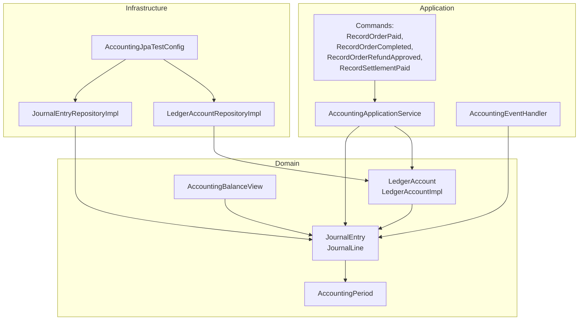
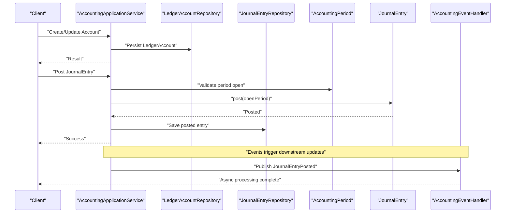
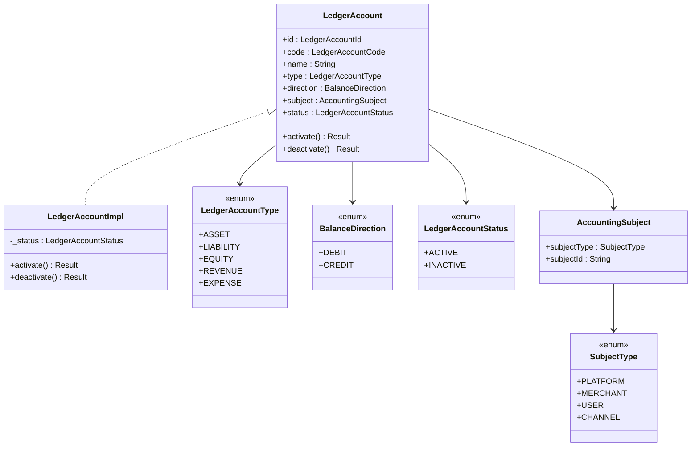
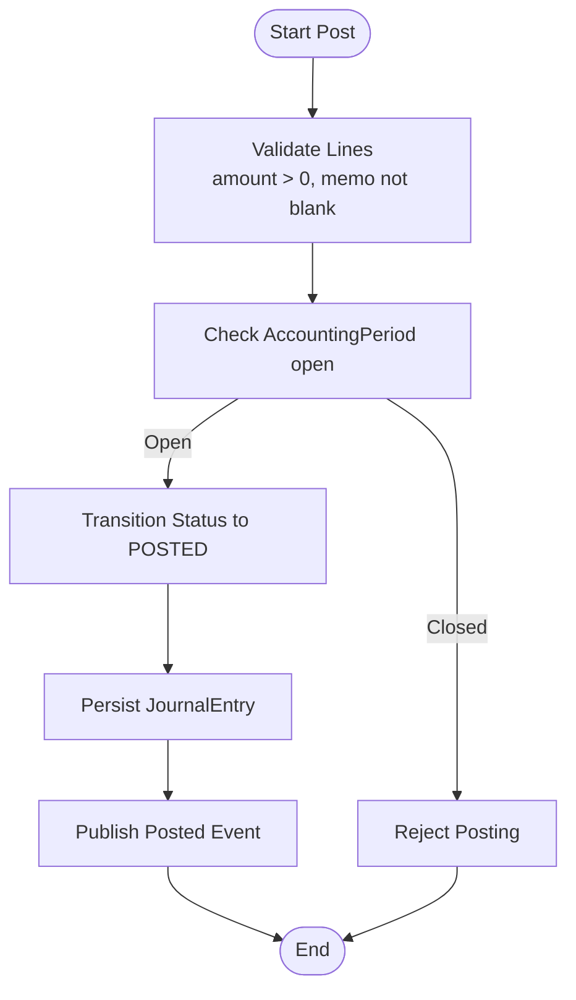
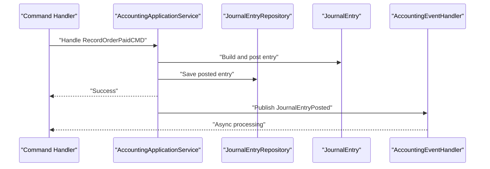
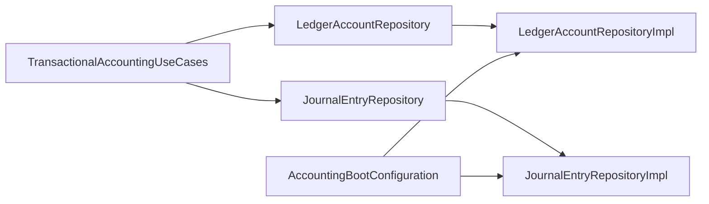
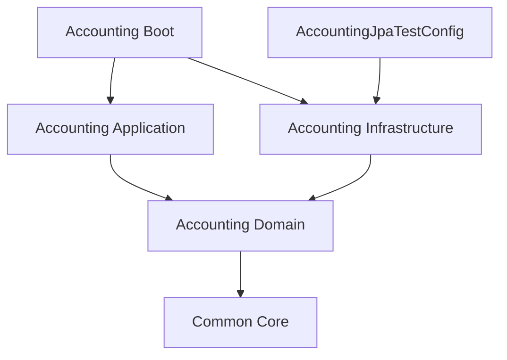

# Ledger Account Management

<cite>
**Referenced Files in This Document**
- [LedgerAccount.kt](file://j-store-accounting-domain/src/main/kotlin/com/jstore/accounting/domain/account/LedgerAccount.kt)
- [LedgerAccountImpl.kt](file://j-store-accounting-domain/src/main/kotlin/com/jstore/accounting/domain/account/LedgerAccountImpl.kt)
- [AccountingAccountErrors.kt](file://j-store-accounting-domain/src/main/kotlin/com/jstore/accounting/domain/account/AccountingAccountErrors.kt)
- [JournalEntry.kt](file://j-store-accounting-domain/src/main/kotlin/com/jstore/accounting/domain/journal/JournalEntry.kt)
- [AccountingPeriod.kt](file://j-store-accounting-domain/src/main/kotlin/com/jstore/accounting/domain/journal/AccountingPeriod.kt)
- [AccountingBalanceView.kt](file://j-store-accounting-domain/src/main/kotlin/com/jstore/accounting/domain/journal/AccountingBalanceView.kt)
- [LedgerAccountRepository.kt](file://j-store-accounting-domain/src/main/kotlin/com/jstore/accounting/domain/account/LedgerAccountRepository.kt)
- [JournalEntryRepository.kt](file://j-store-accounting-domain/src/main/kotlin/com/jstore/accounting/domain/journal/JournalEntryRepository.kt)
- [AccountingApplicationService.kt](file://j-store-accounting-application/src/main/kotlin/com/jstore/accounting/service/AccountingApplicationService.kt)
- [AccountingEventHandler.kt](file://j-store-accounting-application/src/main/kotlin/com/jstore/accounting/service/AccountingEventHandler.kt)
- [RecordOrderCompletedCMD.kt](file://j-store-accounting-application/src/main/kotlin/com/jstore/accounting/service/command/RecordOrderCompletedCMD.kt)
- [RecordOrderPaidCMD.kt](file://j-store-accounting-application/src/main/kotlin/com/jstore/accounting/service/command/RecordOrderPaidCMD.kt)
- [RecordOrderRefundApprovedCMD.kt](file://j-store-accounting-application/src/main/kotlin/com/jstore/accounting/service/command/RecordOrderRefundApprovedCMD.kt)
- [RecordSettlementPaidCMD.kt](file://j-store-accounting-application/src/main/kotlin/com/jstore/accounting/service/command/RecordSettlementPaidCMD.kt)
- [AccountingBootConfiguration.kt](file://j-store-accounting-boot/src/main/kotlin/com/jstore/accounting/config/AccountingBootConfiguration.kt)
- [TransactionalAccountingUseCases.kt](file://j-store-accounting-boot/src/main/kotlin/com/jstore/accounting/config/TransactionalAccountingUseCases.kt)
- [LedgerAccountRepositoryImpl.kt](file://j-store-accounting-infrastructure/src/main/kotlin/com/jstore/accounting/domain/account/LedgerAccountRepositoryImpl.kt)
- [JournalEntryRepositoryImpl.kt](file://j-store-accounting-infrastructure/src/main/kotlin/com/jstore/accounting/domain/journal/JournalEntryRepositoryImpl.kt)
- [AccountingJpaTestConfig.kt](file://j-store-accounting-infrastructure/src/test/kotlin/com/jstore/accounting/AccountingJpaTestConfig.kt)
- [LedgerAccountUnitTest.kt](file://j-store-accounting-domain/src/test/kotlin/com/jstore/accounting/domain/account/LedgerAccountUnitTest.kt)
- [JournalEntryUnitTest.kt](file://j-store-accounting-domain/src/test/kotlin/com/jstore/accounting/domain/journal/JournalEntryUnitTest.kt)
</cite>

## Table of Contents
1. [Introduction](#introduction)
2. [Project Structure](#project-structure)
3. [Core Components](#core-components)
4. [Architecture Overview](#architecture-overview)
5. [Detailed Component Analysis](#detailed-component-analysis)
6. [Dependency Analysis](#dependency-analysis)
7. [Performance Considerations](#performance-considerations)
8. [Troubleshooting Guide](#troubleshooting-guide)
9. [Conclusion](#conclusion)
10. [Appendices](#appendices)

## Introduction
This document explains the Ledger Account management system within the accounting module. It covers account structure, types, balance calculations, and how ledger accounts track financial positions through debit and credit transactions. It also documents the account hierarchy and categorization via subjects, balance verification mechanisms, integration with journal entries for automatic balance updates, account opening and closing procedures, real-time balance queries, validation rules, error handling, and audit trail maintenance for compliance.

## Project Structure
The accounting feature is implemented across three layers:
- Domain layer: core aggregates and value objects (accounts, journals, periods).
- Application layer: use cases and event handlers orchestrating business flows.
- Infrastructure layer: persistence implementations and configuration.

**Diagram sources**
- [LedgerAccount.kt:1-64](file://j-store-accounting-domain/src/main/kotlin/com/jstore/accounting/domain/account/LedgerAccount.kt#L1-L64)
- [LedgerAccountImpl.kt:1-35](file://j-store-accounting-domain/src/main/kotlin/com/jstore/accounting/domain/account/LedgerAccountImpl.kt#L1-L35)
- [JournalEntry.kt:1-93](file://j-store-accounting-domain/src/main/kotlin/com/jstore/accounting/domain/journal/JournalEntry.kt#L1-L93)
- [AccountingPeriod.kt](file://j-store-accounting-domain/src/main/kotlin/com/jstore/accounting/domain/journal/AccountingPeriod.kt)
- [AccountingBalanceView.kt](file://j-store-accounting-domain/src/main/kotlin/com/jstore/accounting/domain/journal/AccountingBalanceView.kt)
- [AccountingApplicationService.kt](file://j-store-accounting-application/src/main/kotlin/com/jstore/accounting/service/AccountingApplicationService.kt)
- [AccountingEventHandler.kt](file://j-store-accounting-application/src/main/kotlin/com/jstore/accounting/service/AccountingEventHandler.kt)
- [RecordOrderPaidCMD.kt](file://j-store-accounting-application/src/main/kotlin/com/jstore/accounting/service/command/RecordOrderPaidCMD.kt)
- [RecordOrderCompletedCMD.kt](file://j-store-accounting-application/src/main/kotlin/com/jstore/accounting/service/command/RecordOrderCompletedCMD.kt)
- [RecordOrderRefundApprovedCMD.kt](file://j-store-accounting-application/src/main/kotlin/com/jstore/accounting/service/command/RecordOrderRefundApprovedCMD.kt)
- [RecordSettlementPaidCMD.kt](file://j-store-accounting-application/src/main/kotlin/com/jstore/accounting/service/command/RecordSettlementPaidCMD.kt)
- [LedgerAccountRepositoryImpl.kt](file://j-store-accounting-infrastructure/src/main/kotlin/com/jstore/accounting/domain/account/LedgerAccountRepositoryImpl.kt)
- [JournalEntryRepositoryImpl.kt](file://j-store-accounting-infrastructure/src/main/kotlin/com/jstore/accounting/domain/journal/JournalEntryRepositoryImpl.kt)
- [AccountingJpaTestConfig.kt](file://j-store-accounting-infrastructure/src/test/kotlin/com/jstore/accounting/AccountingJpaTestConfig.kt)

**Section sources**
- [LedgerAccount.kt:1-64](file://j-store-accounting-domain/src/main/kotlin/com/jstore/accounting/domain/account/LedgerAccount.kt#L1-L64)
- [JournalEntry.kt:1-93](file://j-store-accounting-domain/src/main/kotlin/com/jstore/accounting/domain/journal/JournalEntry.kt#L1-L93)
- [AccountingApplicationService.kt](file://j-store-accounting-application/src/main/kotlin/com/jstore/accounting/service/AccountingApplicationService.kt)
- [AccountingEventHandler.kt](file://j-store-accounting-application/src/main/kotlin/com/jstore/accounting/service/AccountingEventHandler.kt)
- [LedgerAccountRepositoryImpl.kt](file://j-store-accounting-infrastructure/src/main/kotlin/com/jstore/accounting/domain/account/LedgerAccountRepositoryImpl.kt)
- [JournalEntryRepositoryImpl.kt](file://j-store-accounting-infrastructure/src/main/kotlin/com/jstore/accounting/domain/journal/JournalEntryRepositoryImpl.kt)

## Core Components
- LedgerAccount: Represents a financial account with code, name, type, direction, subject, and status. Supports activation and deactivation.
- JournalEntry: Double-entry record composed of multiple lines, each referencing an account, side (debit/credit), amount, and memo. Supports posting, reversal, and creation of reversals.
- AccountingPeriod: Defines open/closed periods used to validate posting dates.
- AccountingBalanceView: Query model for balances derived from posted journal lines.

Key behaviors:
- Account lifecycle: activate/deactivate controlled by domain methods.
- Journal entry lifecycle: draft -> posted; reversible with reversal entries.
- Balance calculation: sum of debits minus credits per account over time.

**Section sources**
- [LedgerAccount.kt:1-64](file://j-store-accounting-domain/src/main/kotlin/com/jstore/accounting/domain/account/LedgerAccount.kt#L1-L64)
- [LedgerAccountImpl.kt:1-35](file://j-store-accounting-domain/src/main/kotlin/com/jstore/accounting/domain/account/LedgerAccountImpl.kt#L1-L35)
- [JournalEntry.kt:1-93](file://j-store-accounting-domain/src/main/kotlin/com/jstore/accounting/domain/journal/JournalEntry.kt#L1-L93)
- [AccountingPeriod.kt](file://j-store-accounting-domain/src/main/kotlin/com/jstore/accounting/domain/journal/AccountingPeriod.kt)
- [AccountingBalanceView.kt](file://j-store-accounting-domain/src/main/kotlin/com/jstore/accounting/domain/journal/AccountingBalanceView.kt)

## Architecture Overview
The system follows a layered architecture with clear separation of concerns:
- Domain aggregates encapsulate business rules and state transitions.
- Application services orchestrate commands and handle domain events.
- Infrastructure provides persistence and test configurations.

**Diagram sources**
- [AccountingApplicationService.kt](file://j-store-accounting-application/src/main/kotlin/com/jstore/accounting/service/AccountingApplicationService.kt)
- [LedgerAccountRepository.kt](file://j-store-accounting-domain/src/main/kotlin/com/jstore/accounting/domain/account/LedgerAccountRepository.kt)
- [JournalEntryRepository.kt](file://j-store-accounting-domain/src/main/kotlin/com/jstore/accounting/domain/journal/JournalEntryRepository.kt)
- [AccountingPeriod.kt](file://j-store-accounting-domain/src/main/kotlin/com/jstore/accounting/domain/journal/AccountingPeriod.kt)
- [JournalEntry.kt:1-93](file://j-store-accounting-domain/src/main/kotlin/com/jstore/accounting/domain/journal/JournalEntry.kt#L1-L93)
- [AccountingEventHandler.kt](file://j-store-accounting-application/src/main/kotlin/com/jstore/accounting/service/AccountingEventHandler.kt)

## Detailed Component Analysis

### Ledger Account Model and Lifecycle
- Account identity and classification:
  - LedgerAccountId: unique identifier.
  - LedgerAccountCode: validated non-blank code.
  - AccountingSubject: pairs subjectType (PLATFORM, MERCHANT, USER, CHANNEL) with subjectId.
  - LedgerAccountType: ASSET, LIABILITY, EQUITY, REVENUE, EXPENSE.
  - BalanceDirection: DEBIT or CREDIT.
  - LedgerAccountStatus: ACTIVE or INACTIVE.
- Lifecycle operations:
  - activate(): sets status to ACTIVE.
  - deactivate(): sets status to INACTIVE.

**Diagram sources**
- [LedgerAccount.kt:1-64](file://j-store-accounting-domain/src/main/kotlin/com/jstore/accounting/domain/account/LedgerAccount.kt#L1-L64)
- [LedgerAccountImpl.kt:1-35](file://j-store-accounting-domain/src/main/kotlin/com/jstore/accounting/domain/account/LedgerAccountImpl.kt#L1-L35)

**Section sources**
- [LedgerAccount.kt:1-64](file://j-store-accounting-domain/src/main/kotlin/com/jstore/accounting/domain/account/LedgerAccount.kt#L1-L64)
- [LedgerAccountImpl.kt:1-35](file://j-store-accounting-domain/src/main/kotlin/com/jstore/accounting/domain/account/LedgerAccountImpl.kt#L1-L35)

### Journal Entry Model and Posting Flow
- JournalEntry fields include entryNo, type, sourceDocument, accountingDate, status, lines, timestamps, and reversal references.
- JournalLine includes accountId, side (DEBIT/CREDIT), amount (>0), and memo (non-blank).
- Posting validates against an open AccountingPeriod and transitions status to POSTED.
- Reversal supports marking reversed and creating a reversal entry.

**Diagram sources**
- [JournalEntry.kt:1-93](file://j-store-accounting-domain/src/main/kotlin/com/jstore/accounting/domain/journal/JournalEntry.kt#L1-L93)
- [AccountingPeriod.kt](file://j-store-accounting-domain/src/main/kotlin/com/jstore/accounting/domain/journal/AccountingPeriod.kt)

**Section sources**
- [JournalEntry.kt:1-93](file://j-store-accounting-domain/src/main/kotlin/com/jstore/accounting/domain/journal/JournalEntry.kt#L1-L93)

### Balance Calculation and Verification
- Balances are computed from posted JournalLine records:
  - Debit increases asset/expenses; Credit increases liability/equity/revenue depending on account type and direction.
  - Net balance = sum(debits) - sum(credits) adjusted by account direction and type semantics.
- AccountingBalanceView provides queryable snapshots of balances per account and period.

Practical guidance:
- Use AccountingBalanceView to retrieve current balances for reporting and reconciliation.
- Ensure all postings occur within open periods to maintain consistent historical balances.

**Section sources**
- [JournalEntry.kt:1-93](file://j-store-accounting-domain/src/main/kotlin/com/jstore/accounting/domain/journal/JournalEntry.kt#L1-L93)
- [AccountingBalanceView.kt](file://j-store-accounting-domain/src/main/kotlin/com/jstore/accounting/domain/journal/AccountingBalanceView.kt)

### Integration with Commands and Events
- Commands drive specific accounting actions:
  - RecordOrderPaidCMD: posts payment-related journal entries.
  - RecordOrderCompletedCMD: posts commission or completion adjustments.
  - RecordOrderRefundApprovedCMD: posts refund reversals.
  - RecordSettlementPaidCMD: posts settlement payments.
- AccountingEventHandler reacts to domain events (e.g., JournalEntryPosted) to perform follow-up tasks.

**Diagram sources**
- [RecordOrderPaidCMD.kt](file://j-store-accounting-application/src/main/kotlin/com/jstore/accounting/service/command/RecordOrderPaidCMD.kt)
- [RecordOrderCompletedCMD.kt](file://j-store-accounting-application/src/main/kotlin/com/jstore/accounting/service/command/RecordOrderCompletedCMD.kt)
- [RecordOrderRefundApprovedCMD.kt](file://j-store-accounting-application/src/main/kotlin/com/jstore/accounting/service/command/RecordOrderRefundApprovedCMD.kt)
- [RecordSettlementPaidCMD.kt](file://j-store-accounting-application/src/main/kotlin/com/jstore/accounting/service/command/RecordSettlementPaidCMD.kt)
- [AccountingApplicationService.kt](file://j-store-accounting-application/src/main/kotlin/com/jstore/accounting/service/AccountingApplicationService.kt)
- [AccountingEventHandler.kt](file://j-store-accounting-application/src/main/kotlin/com/jstore/accounting/service/AccountingEventHandler.kt)
- [JournalEntryRepository.kt](file://j-store-accounting-domain/src/main/kotlin/com/jstore/accounting/domain/journal/JournalEntryRepository.kt)
- [JournalEntry.kt:1-93](file://j-store-accounting-domain/src/main/kotlin/com/jstore/accounting/domain/journal/JournalEntry.kt#L1-L93)

**Section sources**
- [RecordOrderPaidCMD.kt](file://j-store-accounting-application/src/main/kotlin/com/jstore/accounting/service/command/RecordOrderPaidCMD.kt)
- [RecordOrderCompletedCMD.kt](file://j-store-accounting-application/src/main/kotlin/com/jstore/accounting/service/command/RecordOrderCompletedCMD.kt)
- [RecordOrderRefundApprovedCMD.kt](file://j-store-accounting-application/src/main/kotlin/com/jstore/accounting/service/command/RecordOrderRefundApprovedCMD.kt)
- [RecordSettlementPaidCMD.kt](file://j-store-accounting-application/src/main/kotlin/com/jstore/accounting/service/command/RecordSettlementPaidCMD.kt)
- [AccountingApplicationService.kt](file://j-store-accounting-application/src/main/kotlin/com/jstore/accounting/service/AccountingApplicationService.kt)
- [AccountingEventHandler.kt](file://j-store-accounting-application/src/main/kotlin/com/jstore/accounting/service/AccountingEventHandler.kt)

### Persistence and Configuration
- Repository interfaces abstract storage:
  - LedgerAccountRepository: CRUD and queries for accounts.
  - JournalEntryRepository: CRUD and queries for journal entries.
- Implementations provide JPA-backed persistence.
- Boot configuration wires transactional use cases and application components.

**Diagram sources**
- [LedgerAccountRepository.kt](file://j-store-accounting-domain/src/main/kotlin/com/jstore/accounting/domain/account/LedgerAccountRepository.kt)
- [LedgerAccountRepositoryImpl.kt](file://j-store-accounting-infrastructure/src/main/kotlin/com/jstore/accounting/domain/account/LedgerAccountRepositoryImpl.kt)
- [JournalEntryRepository.kt](file://j-store-accounting-domain/src/main/kotlin/com/jstore/accounting/domain/journal/JournalEntryRepository.kt)
- [JournalEntryRepositoryImpl.kt](file://j-store-accounting-infrastructure/src/main/kotlin/com/jstore/accounting/domain/journal/JournalEntryRepositoryImpl.kt)
- [AccountingBootConfiguration.kt](file://j-store-accounting-boot/src/main/kotlin/com/jstore/accounting/config/AccountingBootConfiguration.kt)
- [TransactionalAccountingUseCases.kt](file://j-store-accounting-boot/src/main/kotlin/com/jstore/accounting/config/TransactionalAccountingUseCases.kt)

**Section sources**
- [LedgerAccountRepository.kt](file://j-store-accounting-domain/src/main/kotlin/com/jstore/accounting/domain/account/LedgerAccountRepository.kt)
- [LedgerAccountRepositoryImpl.kt](file://j-store-accounting-infrastructure/src/main/kotlin/com/jstore/accounting/domain/account/LedgerAccountRepositoryImpl.kt)
- [JournalEntryRepository.kt](file://j-store-accounting-domain/src/main/kotlin/com/jstore/accounting/domain/journal/JournalEntryRepository.kt)
- [JournalEntryRepositoryImpl.kt](file://j-store-accounting-infrastructure/src/main/kotlin/com/jstore/accounting/domain/journal/JournalEntryRepositoryImpl.kt)
- [AccountingBootConfiguration.kt](file://j-store-accounting-boot/src/main/kotlin/com/jstore/accounting/config/AccountingBootConfiguration.kt)
- [TransactionalAccountingUseCases.kt](file://j-store-accounting-boot/src/main/kotlin/com/jstore/accounting/config/TransactionalAccountingUseCases.kt)

### Validation Rules and Error Handling
- Account validation:
  - Non-blank code and name enforced at construction.
  - Status transitions managed via activate/deactivate.
  - Errors: not found, inactive account, duplicate code.
- Journal line validation:
  - Amount must be greater than zero.
  - Memo must be non-blank.
- Posting validation:
  - Requires open accounting period.
  - Prevents posting to closed periods.

Common errors:
- Accounting.Account.NotFound
- Accounting.Account.Inactive
- Accounting.Account.CodeDuplicated
- Journal amount/memo validation failures
- Accounting period closed

**Section sources**
- [LedgerAccount.kt:1-64](file://j-store-accounting-domain/src/main/kotlin/com/jstore/accounting/domain/account/LedgerAccount.kt#L1-L64)
- [LedgerAccountImpl.kt:1-35](file://j-store-accounting-domain/src/main/kotlin/com/jstore/accounting/domain/account/LedgerAccountImpl.kt#L1-L35)
- [AccountingAccountErrors.kt:1-11](file://j-store-accounting-domain/src/main/kotlin/com/jstore/accounting/domain/account/AccountingAccountErrors.kt#L1-L11)
- [JournalEntry.kt:1-93](file://j-store-accounting-domain/src/main/kotlin/com/jstore/accounting/domain/journal/JournalEntry.kt#L1-L93)

### Audit Trail and Compliance
- Domain events capture lifecycle changes:
  - JournalEntryPostedEvent, JournalEntryReversedEvent.
- Aggregates record domain events internally for replayability and auditability.
- Use repository queries to reconstruct full history for compliance reporting.

**Section sources**
- [JournalEntry.kt:1-93](file://j-store-accounting-domain/src/main/kotlin/com/jstore/accounting/domain/journal/JournalEntry.kt#L1-L93)

## Dependency Analysis
The accounting module depends on common framework utilities and integrates with other modules via ACLs.

**Diagram sources**
- [AccountingApplicationService.kt](file://j-store-accounting-application/src/main/kotlin/com/jstore/accounting/service/AccountingApplicationService.kt)
- [AccountingEventHandler.kt](file://j-store-accounting-application/src/main/kotlin/com/jstore/accounting/service/AccountingEventHandler.kt)
- [LedgerAccountRepositoryImpl.kt](file://j-store-accounting-infrastructure/src/main/kotlin/com/jstore/accounting/domain/account/LedgerAccountRepositoryImpl.kt)
- [JournalEntryRepositoryImpl.kt](file://j-store-accounting-infrastructure/src/main/kotlin/com/jstore/accounting/domain/journal/JournalEntryRepositoryImpl.kt)
- [AccountingJpaTestConfig.kt](file://j-store-accounting-infrastructure/src/test/kotlin/com/jstore/accounting/AccountingJpaTestConfig.kt)

**Section sources**
- [AccountingApplicationService.kt](file://j-store-accounting-application/src/main/kotlin/com/jstore/accounting/service/AccountingApplicationService.kt)
- [AccountingEventHandler.kt](file://j-store-accounting-application/src/main/kotlin/com/jstore/accounting/service/AccountingEventHandler.kt)
- [LedgerAccountRepositoryImpl.kt](file://j-store-accounting-infrastructure/src/main/kotlin/com/jstore/accounting/domain/account/LedgerAccountRepositoryImpl.kt)
- [JournalEntryRepositoryImpl.kt](file://j-store-accounting-infrastructure/src/main/kotlin/com/jstore/accounting/domain/journal/JournalEntryRepositoryImpl.kt)
- [AccountingJpaTestConfig.kt](file://j-store-accounting-infrastructure/src/test/kotlin/com/jstore/accounting/AccountingJpaTestConfig.kt)

## Performance Considerations
- Batch journal line creation to minimize round-trips during high-volume postings.
- Cache frequently accessed account metadata (code, type, direction) where appropriate.
- Partition balance queries by period to reduce scan scope.
- Use asynchronous event processing for non-critical follow-ups to keep posting latency low.

[No sources needed since this section provides general guidance]

## Troubleshooting Guide
Common issues and resolutions:
- Invalid account code/name: ensure non-blank values during account creation.
- Posting rejected due to closed period: verify AccountingPeriod status before posting.
- Duplicate account code: enforce uniqueness checks prior to save.
- Inactive account usage: reactivate accounts before posting.
- Journal line validation failures: confirm amounts > 0 and memos present.

Error codes to watch:
- Accounting.Account.NotFound
- Accounting.Account.Inactive
- Accounting.Account.CodeDuplicated

**Section sources**
- [AccountingAccountErrors.kt:1-11](file://j-store-accounting-domain/src/main/kotlin/com/jstore/accounting/domain/account/AccountingAccountErrors.kt#L1-L11)
- [JournalEntry.kt:1-93](file://j-store-accounting-domain/src/main/kotlin/com/jstore/accounting/domain/journal/JournalEntry.kt#L1-L93)

## Conclusion
The Ledger Account management system provides a robust double-entry accounting foundation with clear domain models, strict validation, and event-driven integration. Accounts are categorized by type and subject, balances are derived from posted journal lines, and compliance is supported through comprehensive audit trails. The layered architecture ensures maintainability and scalability while enabling real-time balance queries and reliable reconciliation workflows.

[No sources needed since this section summarizes without analyzing specific files]

## Appendices

### Example Workflows

- Create an account:
  - Define LedgerAccountCode, name, type, direction, and AccountingSubject.
  - Persist via LedgerAccountRepository.
  - Activate using activate().

- Post a transaction:
  - Build JournalEntry with multiple JournalLine entries.
  - Validate lines and accounting period.
  - Post via JournalEntry.post(openPeriod).
  - Persist and publish JournalEntryPosted event.

- Query balances:
  - Use AccountingBalanceView to retrieve balances per account and period.
  - Aggregate debits and credits to compute net balances.

- Reconcile accounts:
  - Compare ledger balances with external statements.
  - Investigate discrepancies via journal history and reversal entries.

**Section sources**
- [LedgerAccount.kt:1-64](file://j-store-accounting-domain/src/main/kotlin/com/jstore/accounting/domain/account/LedgerAccount.kt#L1-L64)
- [LedgerAccountImpl.kt:1-35](file://j-store-accounting-domain/src/main/kotlin/com/jstore/accounting/domain/account/LedgerAccountImpl.kt#L1-L35)
- [JournalEntry.kt:1-93](file://j-store-accounting-domain/src/main/kotlin/com/jstore/accounting/domain/journal/JournalEntry.kt#L1-L93)
- [AccountingBalanceView.kt](file://j-store-accounting-domain/src/main/kotlin/com/jstore/accounting/domain/journal/AccountingBalanceView.kt)

### Unit Tests and Validation
- LedgerAccountUnitTest: exercises account lifecycle and validations.
- JournalEntryUnitTest: verifies posting, reversal, and line validation logic.

**Section sources**
- [LedgerAccountUnitTest.kt](file://j-store-accounting-domain/src/test/kotlin/com/jstore/accounting/domain/account/LedgerAccountUnitTest.kt)
- [JournalEntryUnitTest.kt](file://j-store-accounting-domain/src/test/kotlin/com/jstore/accounting/domain/journal/JournalEntryUnitTest.kt)