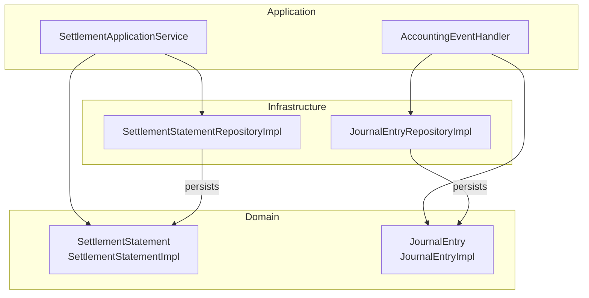
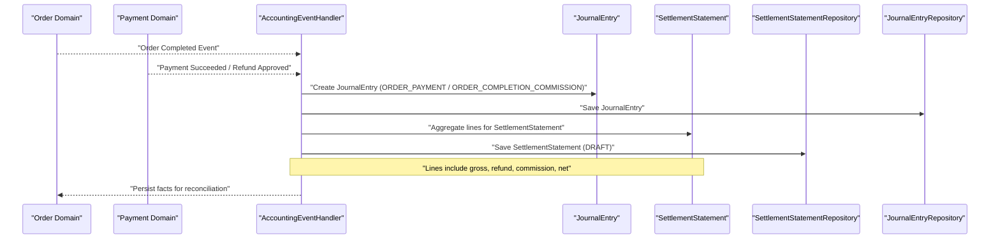
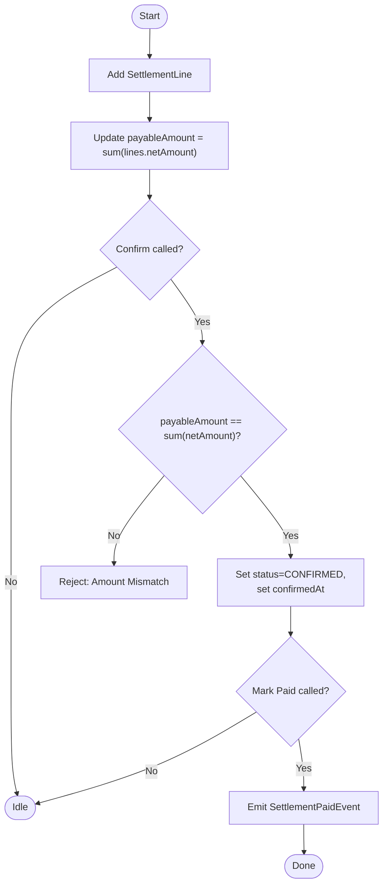
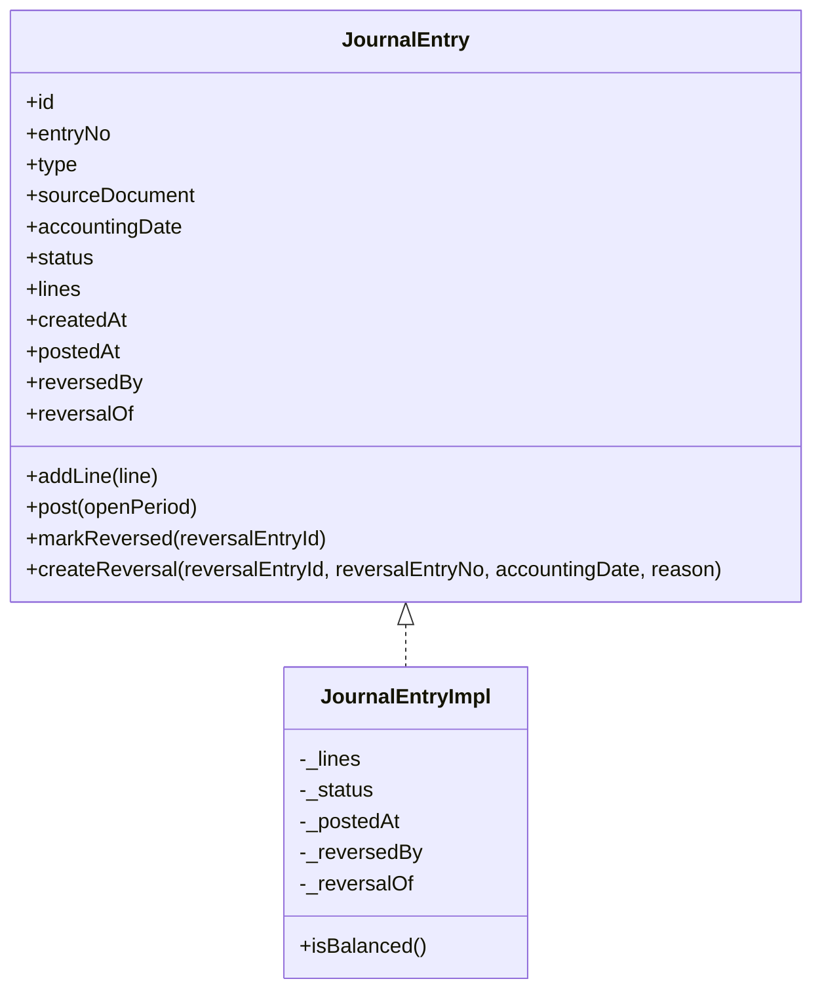
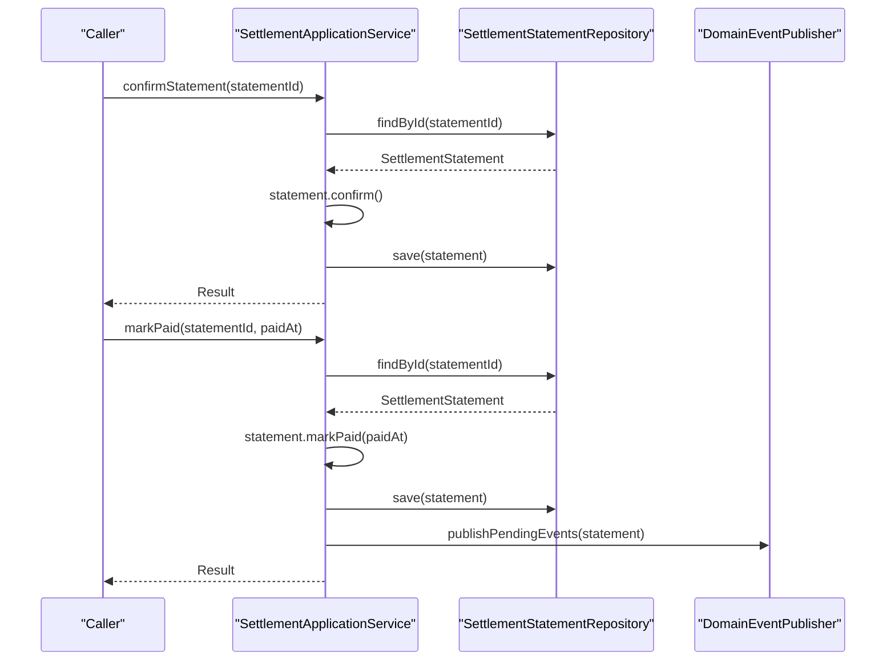
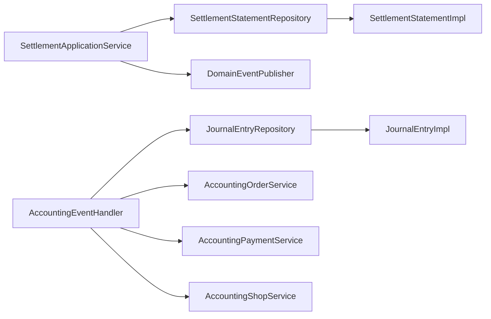

# Settlement Statement Processing

<cite>
**Referenced Files in This Document**
- [SettlementStatement.kt](file://j-store-accounting-domain/src/main/kotlin/com/jstore/accounting/domain/settlement/SettlementStatement.kt)
- [SettlementStatementImpl.kt](file://j-store-accounting-domain/src/main/kotlin/com/jstore/accounting/domain/settlement/SettlementStatementImpl.kt)
- [JournalEntry.kt](file://j-store-accounting-domain/src/main/kotlin/com/jstore/accounting/domain/journal/JournalEntry.kt)
- [JournalEntryImpl.kt](file://j-store-accounting-domain/src/main/kotlin/com/jstore/accounting/domain/journal/JournalEntryImpl.kt)
- [SettlementApplicationService.kt](file://j-store-accounting-application/src/main/kotlin/com/jstore/accounting/service/SettlementApplicationService.kt)
- [SettlementUseCase.kt](file://j-store-accounting-application/src/main/kotlin/com/jstore/accounting/service/SettlementUseCase.kt)
- [AccountingEventHandler.kt](file://j-store-accounting-application/src/main/kotlin/com/jstore/accounting/service/AccountingEventHandler.kt)
- [AccountingOrderService.kt](file://j-store-accounting-domain/src/main/kotlin/com/jstore/accounting/acl/AccountingOrderService.kt)
- [AccountingPaymentService.kt](file://j-store-accounting-domain/src/main/kotlin/com/jstore/accounting/acl/AccountingPaymentService.kt)
- [AccountingShopService.kt](file://j-store-accounting-domain/src/main/kotlin/com/jstore/accounting/acl/AccountingShopService.kt)
- [OrderAccountingInfo.kt](file://j-store-accounting-domain/src/main/kotlin/com/jstore/accounting/acl/OrderAccountingInfo.kt)
- [PaymentAccountingInfo.kt](file://j-store-accounting-domain/src/main/kotlin/com/jstore/accounting/acl/PaymentAccountingInfo.kt)
- [ShopAccountingInfo.kt](file://j-store-accounting-domain/src/main/kotlin/com/jstore/accounting/acl/ShopAccountingInfo.kt)
- [SettlementStatementRepositoryImpl.kt](file://j-store-accounting-infrastructure/src/main/kotlin/com/jstore/accounting/domain/settlement/SettlementStatementRepositoryImpl.kt)
- [SettlementStatementPO.kt](file://j-store-accounting-infrastructure/src/main/kotlin/com/jstore/accounting/domain/settlement/persistence/SettlementStatementPO.kt)
- [SettlementStatementPOJpaRepository.kt](file://j-store-accounting-infrastructure/src/main/kotlin/com/jstore/accounting/domain/settlement/persistence/SettlementStatementPOJpaRepository.kt)
- [JournalEntryRepositoryImpl.kt](file://j-store-accounting-infrastructure/src/main/kotlin/com/jstore/accounting/domain/journal/JournalEntryRepositoryImpl.kt)
- [JournalEntryPO.kt](file://j-store-accounting-infrastructure/src/main/kotlin/com/jstore/accounting/domain/journal/persistence/JournalEntryPO.kt)
- [JournalEntryPOJpaRepository.kt](file://j-store-accounting-infrastructure/src/main/kotlin/com/jstore/accounting/domain/journal/persistence/JournalEntryPOJpaRepository.kt)
- [RecordOrderCompletedCMD.kt](file://j-store-accounting-application/src/main/kotlin/com/jstore/accounting/service/command/RecordOrderCompletedCMD.kt)
- [RecordOrderPaidCMD.kt](file://j-store-accounting-application/src/main/kotlin/com/jstore/accounting/service/command/RecordOrderPaidCMD.kt)
- [RecordOrderRefundApprovedCMD.kt](file://j-store-accounting-application/src/main/kotlin/com/jstore/accounting/service/command/RecordOrderRefundApprovedCMD.kt)
- [RecordSettlementPaidCMD.kt](file://j-store-accounting-application/src/main/kotlin/com/jstore/accounting/service/command/RecordSettlementPaidCMD.kt)
</cite>

## Table of Contents
1. Introduction
2. Project Structure
3. Core Components
4. Architecture Overview
5. Detailed Component Analysis
6. Dependency Analysis
7. Performance Considerations
8. Troubleshooting Guide
9. Conclusion

## Introduction
This document explains the settlement statement processing system within the accounting module. It focuses on how settlement statements aggregate multiple journal entries for merchant settlements, how commissions and fees are reflected through journal lines, and how the settlement confirmation workflow operates. It also documents integration points with order completion events, settlement statement creation and validation, and coordination with payment processing. The document includes concrete examples of creating settlement statements, calculating commissions and net settlement amounts, confirming settlements, and reconciling payments. Finally, it covers settlement period management, dispute handling via reversals, and financial reporting capabilities for settlement analysis.

## Project Structure
The settlement statement processing spans three layers:
- Domain layer defines aggregates for settlement statements and journal entries, including state transitions and business rules.
- Application layer orchestrates use cases such as confirming a settlement statement and marking it paid, publishing domain events, and coordinating with external services via ACLs.
- Infrastructure layer provides persistence implementations for settlement statements and journal entries using JPA repositories.

**Diagram sources**
- [SettlementStatement.kt](file://j-store-accounting-domain/src/main/kotlin/com/jstore/accounting/domain/settlement/SettlementStatement.kt)
- [SettlementStatementImpl.kt](file://j-store-accounting-domain/src/main/kotlin/com/jstore/accounting/domain/settlement/SettlementStatementImpl.kt)
- [JournalEntry.kt](file://j-store-accounting-domain/src/main/kotlin/com/jstore/accounting/domain/journal/JournalEntry.kt)
- [JournalEntryImpl.kt](file://j-store-accounting-domain/src/main/kotlin/com/jstore/accounting/domain/journal/JournalEntryImpl.kt)
- [SettlementApplicationService.kt](file://j-store-accounting-application/src/main/kotlin/com/jstore/accounting/service/SettlementApplicationService.kt)
- [AccountingEventHandler.kt](file://j-store-accounting-application/src/main/kotlin/com/jstore/accounting/service/AccountingEventHandler.kt)
- [SettlementStatementRepositoryImpl.kt](file://j-store-accounting-infrastructure/src/main/kotlin/com/jstore/accounting/domain/settlement/SettlementStatementRepositoryImpl.kt)
- [JournalEntryRepositoryImpl.kt](file://j-store-accounting-infrastructure/src/main/kotlin/com/jstore/accounting/domain/journal/JournalEntryRepositoryImpl.kt)

**Section sources**
- [SettlementStatement.kt](file://j-store-accounting-domain/src/main/kotlin/com/jstore/accounting/domain/settlement/SettlementStatement.kt)
- [SettlementStatementImpl.kt](file://j-store-accounting-domain/src/main/kotlin/com/jstore/accounting/domain/settlement/SettlementStatementImpl.kt)
- [JournalEntry.kt](file://j-store-accounting-domain/src/main/kotlin/com/jstore/accounting/domain/journal/JournalEntry.kt)
- [JournalEntryImpl.kt](file://j-store-accounting-domain/src/main/kotlin/com/jstore/accounting/domain/journal/JournalEntryImpl.kt)
- [SettlementApplicationService.kt](file://j-store-accounting-application/src/main/kotlin/com/jstore/accounting/service/SettlementApplicationService.kt)
- [SettlementStatementRepositoryImpl.kt](file://j-store-accounting-infrastructure/src/main/kotlin/com/jstore/accounting/domain/settlement/SettlementStatementRepositoryImpl.kt)
- [JournalEntryRepositoryImpl.kt](file://j-store-accounting-infrastructure/src/main/kotlin/com/jstore/accounting/domain/journal/JournalEntryRepositoryImpl.kt)

## Core Components
- SettlementStatement: Aggregate representing a merchant settlement for a defined period, containing multiple settlement lines that summarize per-order contributions to the payable amount.
- SettlementLine: Represents one order’s contribution to the settlement, including gross amount, refund amount, commission amount, and computed net amount.
- JournalEntry: Double-entry accounting record with balanced debit and credit lines, supporting posting, reversal, and auditability.
- SettlementApplicationService: Orchestrates confirm and mark-paid workflows, persists changes, and publishes settlement paid events.
- AccountingEventHandler: Bridges domain events from order/payment flows into journal entries and settlement-related updates.
- Repositories: Persistence adapters for settlement statements and journal entries.

Key responsibilities:
- Aggregation: SettlementStatement aggregates multiple SettlementLine items to compute payableAmount.
- Validation: Enforces state transitions (DRAFT -> CONFIRMED -> PAID), ensures payableAmount equals sum of line net amounts before confirmation.
- Eventing: Emits settlement paid event upon successful payment marking.
- Integration: Uses ACL services to fetch order, payment, and shop accounting info when building journal entries and settlement lines.

**Section sources**
- [SettlementStatement.kt](file://j-store-accounting-domain/src/main/kotlin/com/jstore/accounting/domain/settlement/SettlementStatement.kt)
- [SettlementStatementImpl.kt](file://j-store-accounting-domain/src/main/kotlin/com/jstore/accounting/domain/settlement/SettlementStatementImpl.kt)
- [JournalEntry.kt](file://j-store-accounting-domain/src/main/kotlin/com/jstore/accounting/domain/journal/JournalEntry.kt)
- [JournalEntryImpl.kt](file://j-store-accounting-domain/src/main/kotlin/com/jstore/accounting/domain/journal/JournalEntryImpl.kt)
- [SettlementApplicationService.kt](file://j-store-accounting-application/src/main/kotlin/com/jstore/accounting/service/SettlementApplicationService.kt)
- [AccountingOrderService.kt](file://j-store-accounting-domain/src/main/kotlin/com/jstore/accounting/acl/AccountingOrderService.kt)
- [AccountingPaymentService.kt](file://j-store-accounting-domain/src/main/kotlin/com/jstore/accounting/acl/AccountingPaymentService.kt)
- [AccountingShopService.kt](file://j-store-accounting-domain/src/main/kotlin/com/jstore/accounting/acl/AccountingShopService.kt)
- [OrderAccountingInfo.kt](file://j-store-accounting-domain/src/main/kotlin/com/jstore/accounting/acl/OrderAccountingInfo.kt)
- [PaymentAccountingInfo.kt](file://j-store-accounting-domain/src/main/kotlin/com/jstore/accounting/acl/PaymentAccountingInfo.kt)
- [ShopAccountingInfo.kt](file://j-store-accounting-domain/src/main/kotlin/com/jstore/accounting/acl/ShopAccountingInfo.kt)

## Architecture Overview
The settlement statement processing integrates with order completion and payment flows to build accurate settlement records and ensure double-entry integrity.

**Diagram sources**
- [AccountingEventHandler.kt](file://j-store-accounting-application/src/main/kotlin/com/jstore/accounting/service/AccountingEventHandler.kt)
- [JournalEntry.kt](file://j-store-accounting-domain/src/main/kotlin/com/jstore/accounting/domain/journal/JournalEntry.kt)
- [JournalEntryImpl.kt](file://j-store-accounting-domain/src/main/kotlin/com/jstore/accounting/domain/journal/JournalEntryImpl.kt)
- [SettlementStatement.kt](file://j-store-accounting-domain/src/main/kotlin/com/jstore/accounting/domain/settlement/SettlementStatement.kt)
- [SettlementStatementImpl.kt](file://j-store-accounting-domain/src/main/kotlin/com/jstore/accounting/domain/settlement/SettlementStatementImpl.kt)
- [SettlementStatementRepositoryImpl.kt](file://j-store-accounting-infrastructure/src/main/kotlin/com/jstore/accounting/domain/settlement/SettlementStatementRepositoryImpl.kt)
- [JournalEntryRepositoryImpl.kt](file://j-store-accounting-infrastructure/src/main/kotlin/com/jstore/accounting/domain/journal/JournalEntryRepositoryImpl.kt)

## Detailed Component Analysis

### Settlement Statement Lifecycle and Calculations
SettlementStatement enforces a strict lifecycle:
- DRAFT: Lines can be added; payableAmount is recomputed as the sum of line netAmount values.
- CONFIRMED: Requires payableAmount to match the sum of line netAmounts; timestamps confirmedAt.
- PAID: Requires prior CONFIRMED state; sets paidAt and emits SettlementPaidEvent.

SettlementLine captures per-order metrics:
- grossAmount: total order value included in settlement.
- refundAmount: refunds applied against the order.
- commissionAmount: platform fee or merchant commission deducted.
- netAmount: final payable for the order line.

Payable computation:
- payableAmount = sum(netAmount across all lines).
- Confirmation validates consistency between stored payableAmount and computed sum.

**Diagram sources**
- [SettlementStatementImpl.kt](file://j-store-accounting-domain/src/main/kotlin/com/jstore/accounting/domain/settlement/SettlementStatementImpl.kt)
- [SettlementStatement.kt](file://j-store-accounting-domain/src/main/kotlin/com/jstore/accounting/domain/settlement/SettlementStatement.kt)

**Section sources**
- [SettlementStatement.kt](file://j-store-accounting-domain/src/main/kotlin/com/jstore/accounting/domain/settlement/SettlementStatement.kt)
- [SettlementStatementImpl.kt](file://j-store-accounting-domain/src/main/kotlin/com/jstore/accounting/domain/settlement/SettlementStatementImpl.kt)

### Journal Entry Posting and Reversal
JournalEntry supports double-entry accounting:
- addLine: Adds debit or credit lines while in DRAFT.
- post: Validates open accounting period, minimum two lines, and balanced debits/credits; then marks POSTED.
- createReversal: Generates a reversing entry with swapped sides and reason; original entry marked REVERSED.

This mechanism underpins settlement adjustments and dispute handling by ensuring every financial change is mirrored and auditable.

**Diagram sources**
- [JournalEntry.kt](file://j-store-accounting-domain/src/main/kotlin/com/jstore/accounting/domain/journal/JournalEntry.kt)
- [JournalEntryImpl.kt](file://j-store-accounting-domain/src/main/kotlin/com/jstore/accounting/domain/journal/JournalEntryImpl.kt)

**Section sources**
- [JournalEntry.kt](file://j-store-accounting-domain/src/main/kotlin/com/jstore/accounting/domain/journal/JournalEntry.kt)
- [JournalEntryImpl.kt](file://j-store-accounting-domain/src/main/kotlin/com/jstore/accounting/domain/journal/JournalEntryImpl.kt)

### Application Orchestration: Confirm and Pay
SettlementApplicationService implements:
- confirmStatement: Loads statement, calls confirm(), saves result.
- markPaid: Loads statement, calls markPaid(paidAt), saves, and publishes pending domain events.

This ensures idempotent operations and consistent persistence with event-driven side effects.

**Diagram sources**
- [SettlementApplicationService.kt](file://j-store-accounting-application/src/main/kotlin/com/jstore/accounting/service/SettlementApplicationService.kt)
- [SettlementStatementRepositoryImpl.kt](file://j-store-accounting-infrastructure/src/main/kotlin/com/jstore/accounting/domain/settlement/SettlementStatementRepositoryImpl.kt)

**Section sources**
- [SettlementApplicationService.kt](file://j-store-accounting-application/src/main/kotlin/com/jstore/accounting/service/SettlementApplicationService.kt)
- [SettlementUseCase.kt](file://j-store-accounting-application/src/main/kotlin/com/jstore/accounting/service/SettlementUseCase.kt)

### Integration with Order Completion and Payment Events
AccountingEventHandler reacts to order and payment events to:
- Create JournalEntry records for order payments and commissions.
- Build SettlementStatement lines aggregating gross, refund, and commission amounts per order.
- Persist both journal entries and settlement statements, enabling downstream confirmation and payment marking.

ACL services provide necessary data:
- AccountingOrderService: Order accounting info.
- AccountingPaymentService: Payment accounting info.
- AccountingShopService: Shop/merchant accounting info.

Commands used in application layer:
- RecordOrderCompletedCMD
- RecordOrderPaidCMD
- RecordOrderRefundApprovedCMD
- RecordSettlementPaidCMD

These commands drive event translation and projection into accounting artifacts.

**Section sources**
- [AccountingEventHandler.kt](file://j-store-accounting-application/src/main/kotlin/com/jstore/accounting/service/AccountingEventHandler.kt)
- [AccountingOrderService.kt](file://j-store-accounting-domain/src/main/kotlin/com/jstore/accounting/acl/AccountingOrderService.kt)
- [AccountingPaymentService.kt](file://j-store-accounting-domain/src/main/kotlin/com/jstore/accounting/acl/AccountingPaymentService.kt)
- [AccountingShopService.kt](file://j-store-accounting-domain/src/main/kotlin/com/jstore/accounting/acl/AccountingShopService.kt)
- [OrderAccountingInfo.kt](file://j-store-accounting-domain/src/main/kotlin/com/jstore/accounting/acl/OrderAccountingInfo.kt)
- [PaymentAccountingInfo.kt](file://j-store-accounting-domain/src/main/kotlin/com/jstore/accounting/acl/PaymentAccountingInfo.kt)
- [ShopAccountingInfo.kt](file://j-store-accounting-domain/src/main/kotlin/com/jstore/accounting/acl/ShopAccountingInfo.kt)
- [RecordOrderCompletedCMD.kt](file://j-store-accounting-application/src/main/kotlin/com/jstore/accounting/service/command/RecordOrderCompletedCMD.kt)
- [RecordOrderPaidCMD.kt](file://j-store-accounting-application/src/main/kotlin/com/jstore/accounting/service/command/RecordOrderPaidCMD.kt)
- [RecordOrderRefundApprovedCMD.kt](file://j-store-accounting-application/src/main/kotlin/com/jstore/accounting/service/command/RecordOrderRefundApprovedCMD.kt)
- [RecordSettlementPaidCMD.kt](file://j-store-accounting-application/src/main/kotlin/com/jstore/accounting/service/command/RecordSettlementPaidCMD.kt)

### Settlement Period Management
SettlementPeriod encapsulates start and end dates for settlement aggregation. Validation ensures startDate is not after endDate. This enables grouping orders into discrete settlement cycles for merchants.

**Section sources**
- [SettlementStatement.kt](file://j-store-accounting-domain/src/main/kotlin/com/jstore/accounting/domain/settlement/SettlementStatement.kt)

### Dispute Handling and Reversals
Disputes are handled via JournalEntry reversals:
- Original posted entry is marked REVERSED.
- A new reversal entry is created with inverted sides and an explanatory memo.
- This preserves audit trails and maintains double-entry balance.

**Section sources**
- [JournalEntry.kt](file://j-store-accounting-domain/src/main/kotlin/com/jstore/accounting/domain/journal/JournalEntry.kt)
- [JournalEntryImpl.kt](file://j-store-accounting-domain/src/main/kotlin/com/jstore/accounting/domain/journal/JournalEntryImpl.kt)

### Financial Reporting Capabilities
Reporting relies on persisted artifacts:
- SettlementStatement with lines summarizing per-order contributions.
- JournalEntry with balanced debit/credit lines for each transaction type.
- SourceDocument metadata linking entries to orders, refunds, settlements, and adjustments.

Queries can aggregate payable amounts by merchant and period, reconcile payments against settlement totals, and analyze commission deductions.

**Section sources**
- [SettlementStatement.kt](file://j-store-accounting-domain/src/main/kotlin/com/jstore/accounting/domain/settlement/SettlementStatement.kt)
- [JournalEntry.kt](file://j-store-accounting-domain/src/main/kotlin/com/jstore/accounting/domain/journal/JournalEntry.kt)

## Dependency Analysis
The settlement subsystem depends on:
- Domain aggregates for stateful behavior and validation.
- Application services for orchestration and event publishing.
- Infrastructure repositories for persistence.
- ACL services for cross-domain data access.

**Diagram sources**
- [SettlementApplicationService.kt](file://j-store-accounting-application/src/main/kotlin/com/jstore/accounting/service/SettlementApplicationService.kt)
- [AccountingEventHandler.kt](file://j-store-accounting-application/src/main/kotlin/com/jstore/accounting/service/AccountingEventHandler.kt)
- [SettlementStatementRepositoryImpl.kt](file://j-store-accounting-infrastructure/src/main/kotlin/com/jstore/accounting/domain/settlement/SettlementStatementRepositoryImpl.kt)
- [JournalEntryRepositoryImpl.kt](file://j-store-accounting-infrastructure/src/main/kotlin/com/jstore/accounting/domain/journal/JournalEntryRepositoryImpl.kt)
- [AccountingOrderService.kt](file://j-store-accounting-domain/src/main/kotlin/com/jstore/accounting/acl/AccountingOrderService.kt)
- [AccountingPaymentService.kt](file://j-store-accounting-domain/src/main/kotlin/com/jstore/accounting/acl/AccountingPaymentService.kt)
- [AccountingShopService.kt](file://j-store-accounting-domain/src/main/kotlin/com/jstore/accounting/acl/AccountingShopService.kt)

**Section sources**
- [SettlementApplicationService.kt](file://j-store-accounting-application/src/main/kotlin/com/jstore/accounting/service/SettlementApplicationService.kt)
- [AccountingEventHandler.kt](file://j-store-accounting-application/src/main/kotlin/com/jstore/accounting/service/AccountingEventHandler.kt)
- [SettlementStatementRepositoryImpl.kt](file://j-store-accounting-infrastructure/src/main/kotlin/com/jstore/accounting/domain/settlement/SettlementStatementRepositoryImpl.kt)
- [JournalEntryRepositoryImpl.kt](file://j-store-accounting-infrastructure/src/main/kotlin/com/jstore/accounting/domain/journal/JournalEntryRepositoryImpl.kt)
- [AccountingOrderService.kt](file://j-store-accounting-domain/src/main/kotlin/com/jstore/accounting/acl/AccountingOrderService.kt)
- [AccountingPaymentService.kt](file://j-store-accounting-domain/src/main/kotlin/com/jstore/accounting/acl/AccountingPaymentService.kt)
- [AccountingShopService.kt](file://j-store-accounting-domain/src/main/kotlin/com/jstore/accounting/acl/AccountingShopService.kt)

## Performance Considerations
- Batch aggregation: When constructing settlement statements from many orders, prefer batch reads and incremental aggregation to reduce memory pressure.
- Idempotency: Ensure event handlers are idempotent to avoid duplicate journal entries or settlement lines during retries.
- Indexing: Optimize queries on merchantId, period boundaries, and status fields for reporting and reconciliation.
- Transaction boundaries: Keep repository operations within explicit transactions to maintain consistency and enable rollback on failures.

[No sources needed since this section provides general guidance]

## Troubleshooting Guide
Common issues and resolutions:
- Settlement amount mismatch: Occurs when payableAmount does not equal sum of line netAmounts at confirmation. Recalculate lines and update payableAmount before confirming.
- Invalid state transitions: Attempting to add lines or confirm a non-DRAFT statement will fail. Ensure correct lifecycle progression.
- Unbalanced journal entries: Posting requires at least two lines and balanced debits/credits. Verify line sides and amounts.
- Closed accounting periods: Posting fails if the accounting date falls outside an open period. Adjust accountingDate or open the period.
- Missing data via ACL: If order, payment, or shop accounting info is unavailable, validate ACL service responses and handle missing data gracefully.

**Section sources**
- [SettlementStatementImpl.kt](file://j-store-accounting-domain/src/main/kotlin/com/jstore/accounting/domain/settlement/SettlementStatementImpl.kt)
- [JournalEntryImpl.kt](file://j-store-accounting-domain/src/main/kotlin/com/jstore/accounting/domain/journal/JournalEntryImpl.kt)

## Conclusion
The settlement statement processing system provides a robust foundation for merchant settlements by aggregating order-level financials into coherent settlement statements, enforcing double-entry accounting through journal entries, and integrating seamlessly with order and payment events. Its clear lifecycle, validation rules, and event-driven architecture support accurate commission calculations, fee deductions, net settlement computations, and reliable payment reconciliations. With strong support for dispute handling via reversals and comprehensive reporting artifacts, the system enables precise financial analysis and operational control over settlement periods.