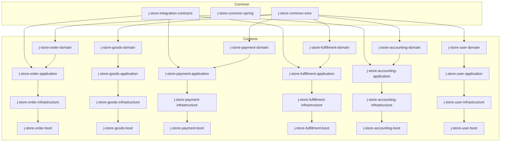
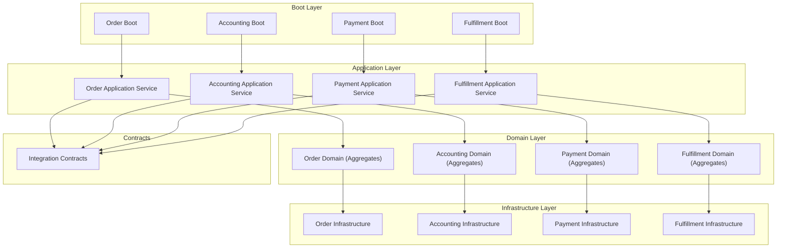
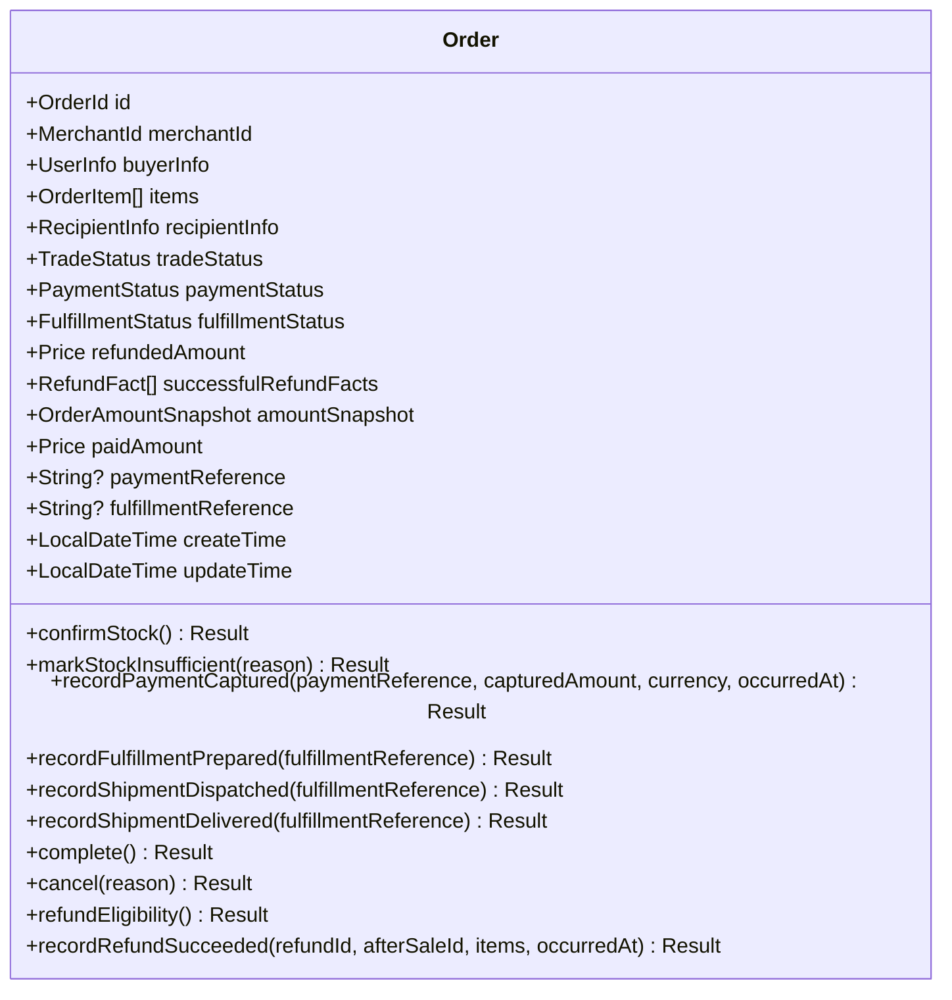
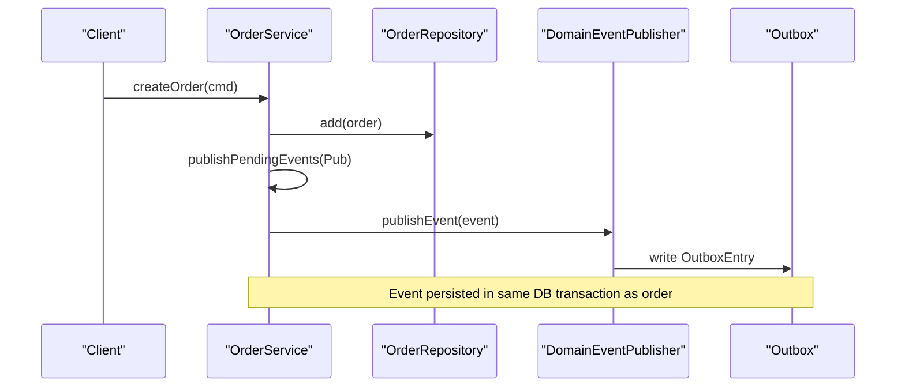
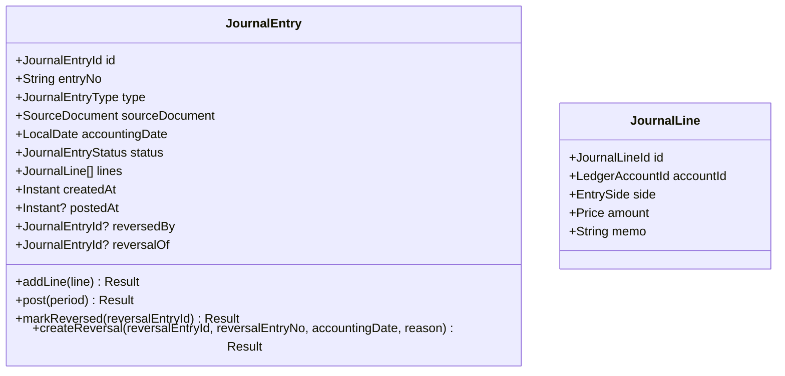
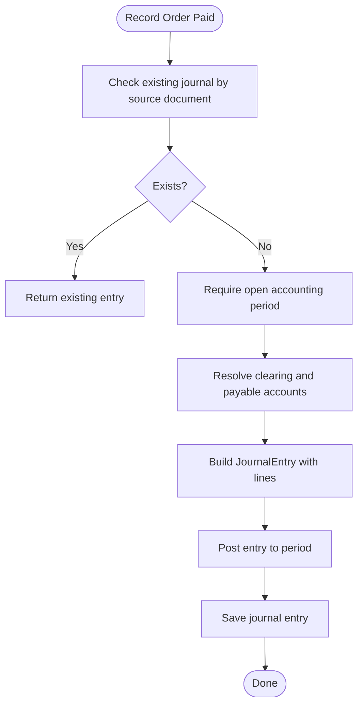
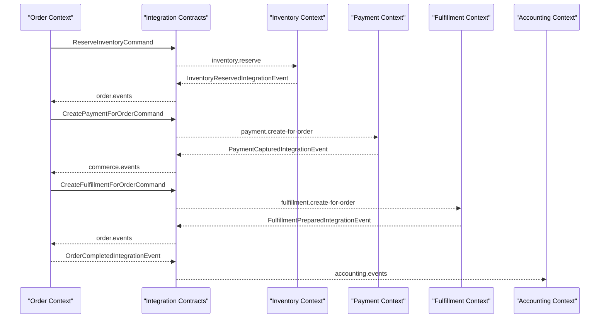
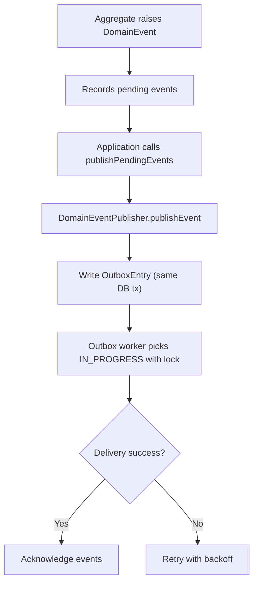
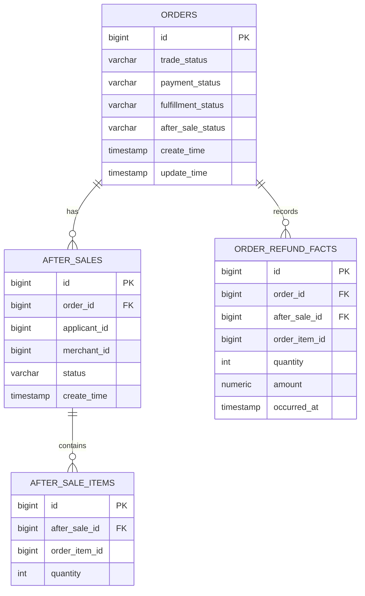
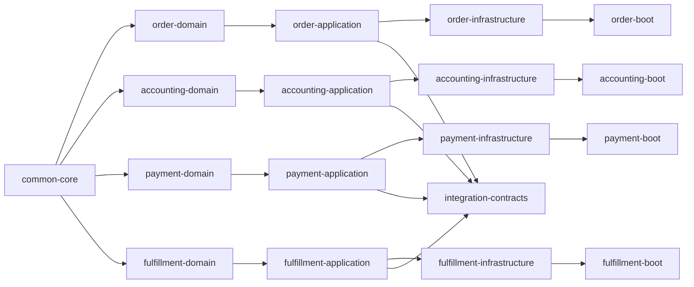

# Architecture & Design

<cite>
**Referenced Files in This Document**
- [settings.gradle.kts](file://settings.gradle.kts)
- [build.gradle.kts](file://build.gradle.kts)
- [AggregateRoot.kt](file://j-store-common-core/src/main/kotlin/com/jstore/common/framework/AggregateRoot.kt)
- [Entity.kt](file://j-store-common-core/src/main/kotlin/com/jstore/common/framework/Entity.kt)
- [DomainEvent.kt](file://j-store-common-core/src/main/kotlin/com/jstore/common/framework/event/DomainEvent.kt)
- [DomainEventPublisher.kt](file://j-store-common-core/src/main/kotlin/com/jstore/common/framework/event/DomainEventPublisher.kt)
- [OutboxEntry.kt](file://j-store-common-core/src/main/kotlin/com/jstore/common/framework/event/outbox/OutboxEntry.kt)
- [AggregateRepository.kt](file://j-store-common-core/src/main/kotlin/com/jstore/common/framework/AggregateRepository.kt)
- [Order.kt](file://j-store-order-domain/src/main/kotlin/com/jstore/order/domain/order/Order.kt)
- [JournalEntry.kt](file://j-store-accounting-domain/src/main/kotlin/com/jstore/accounting/domain/journal/JournalEntry.kt)
- [CommerceIntegrationMessages.kt](file://j-store-integration-contracts/src/main/kotlin/com/jstore/contracts/commerce/CommerceIntegrationMessages.kt)
- [OrderService.kt](file://j-store-order-application/src/main/kotlin/com/jstore/order/service/OrderService.kt)
- [AccountingApplicationService.kt](file://j-store-accounting-application/src/main/kotlin/com/jstore/accounting/service/AccountingApplicationService.kt)
- [V20260731__order_status_dimensions.sql](file://j-store-boot/src/main/resources/db/migration/V20260731__order_status_dimensions.sql)
- [V20260803__order_after_sale_aggregate.sql](file://j-store-boot/src/main/resources/db/migration/V20260803__order_after_sale_aggregate.sql)
</cite>

## Table of Contents
1. Introduction
2. Project Structure
3. Core Components
4. Architecture Overview
5. Detailed Component Analysis
6. Dependency Analysis
7. Performance Considerations
8. Troubleshooting Guide
9. Conclusion

## Introduction
This document explains the J-Store platform’s Domain-Driven Design implementation, focusing on bounded contexts, aggregates, entities, value objects, repositories, and the event-driven architecture with outbox-based delivery and cross-context integration contracts. It also documents the layered architecture (boot, application, domain, infrastructure), component interactions, data flows, technical decisions, trade-offs, constraints, and module dependency structure that enforces DDD boundaries.

## Project Structure
J-Store is a multi-module Gradle project organized by bounded contexts and layers:
- Common core provides foundational DDD primitives, events, messaging, and utilities.
- Each business context (order, goods, payment, fulfillment, accounting, user, shop, warehouse) is split into domain, application, infrastructure, and boot modules.
- Integration contracts are shared across contexts to define stable messages for cross-context communication.
- Boot modules assemble Spring configurations and expose APIs.

**Diagram sources**
- [settings.gradle.kts:1-83](file://settings.gradle.kts#L1-L83)

**Section sources**
- [settings.gradle.kts:12-83](file://settings.gradle.kts#L12-L83)
- [build.gradle.kts:1-64](file://build.gradle.kts#L1-L64)

## Core Components
The foundation of the DDD implementation resides in common-core:
- AggregateRoot and Entity define identity and consistency boundaries.
- RecordsDomainEvents enables aggregates to record and acknowledge pending domain events.
- DomainEvent defines immutable facts with stable metadata for idempotency and tracing.
- DomainEventPublisher abstracts transactional outbox persistence for reliable event emission.
- OutboxEntry models durable outbox records with locking, retry, and routing metadata.
- AggregateRepository defines persistence ports for aggregates.

These components enforce strict separation between domain logic and infrastructure concerns, while providing robust eventing guarantees.

**Section sources**
- [AggregateRoot.kt:1-40](file://j-store-common-core/src/main/kotlin/com/jstore/common/framework/AggregateRoot.kt#L1-L40)
- [Entity.kt:1-6](file://j-store-common-core/src/main/kotlin/com/jstore/common/framework/Entity.kt#L1-L6)
- [DomainEvent.kt:1-46](file://j-store-common-core/src/main/kotlin/com/jstore/common/framework/event/DomainEvent.kt#L1-L46)
- [DomainEventPublisher.kt:1-11](file://j-store-common-core/src/main/kotlin/com/jstore/common/framework/event/DomainEventPublisher.kt#L1-L11)
- [OutboxEntry.kt:1-86](file://j-store-common-core/src/main/kotlin/com/jstore/common/framework/event/outbox/OutboxEntry.kt#L1-L86)
- [AggregateRepository.kt:1-9](file://j-store-common-core/src/main/kotlin/com/jstore/common/framework/AggregateRepository.kt#L1-L9)

## Architecture Overview
J-Store follows a layered architecture per bounded context:
- Boot: Spring configuration, controllers, and wiring.
- Application: Use cases and orchestration; no business rules, delegates to domain.
- Domain: Aggregates, entities, value objects, domain services, and repository interfaces.
- Infrastructure: Repository implementations, persistence, external integrations, and event publishing.

Cross-context communication uses integration contracts (commands/events) published via outbox and consumed by handlers in other contexts.

**Diagram sources**
- [OrderService.kt:1-186](file://j-store-order-application/src/main/kotlin/com/jstore/order/service/OrderService.kt#L1-L186)
- [AccountingApplicationService.kt:1-337](file://j-store-accounting-application/src/main/kotlin/com/jstore/accounting/service/AccountingApplicationService.kt#L1-L337)
- [CommerceIntegrationMessages.kt:1-382](file://j-store-integration-contracts/src/main/kotlin/com/jstore/contracts/commerce/CommerceIntegrationMessages.kt#L1-L382)

## Detailed Component Analysis

### Order Bounded Context
- Aggregate: Order encapsulates trade, payment, fulfillment, and after-sale dimensions as parallel state facets.
- Application: OrderService orchestrates use cases, persists changes, and publishes pending domain events.
- Infrastructure: Repository implementations persist Order and related projections.

**Diagram sources**
- [Order.kt:1-90](file://j-store-order-domain/src/main/kotlin/com/jstore/order/domain/order/Order.kt#L1-L90)

**Diagram sources**
- [OrderService.kt:43-51](file://j-store-order-application/src/main/kotlin/com/jstore/order/service/OrderService.kt#L43-L51)
- [DomainEventPublisher.kt:1-11](file://j-store-common-core/src/main/kotlin/com/jstore/common/framework/event/DomainEventPublisher.kt#L1-L11)
- [OutboxEntry.kt:1-86](file://j-store-common-core/src/main/kotlin/com/jstore/common/framework/event/outbox/OutboxEntry.kt#L1-L86)

**Section sources**
- [Order.kt:1-90](file://j-store-order-domain/src/main/kotlin/com/jstore/order/domain/order/Order.kt#L1-L90)
- [OrderService.kt:1-186](file://j-store-order-application/src/main/kotlin/com/jstore/order/service/OrderService.kt#L1-L186)

### Accounting Bounded Context
- Aggregate: JournalEntry models double-entry bookkeeping with lines, posting, and reversal semantics.
- Application: AccountingApplicationService composes journal entries based on commands, validates periods, and resolves ledger accounts.

**Diagram sources**
- [JournalEntry.kt:1-93](file://j-store-accounting-domain/src/main/kotlin/com/jstore/accounting/domain/journal/JournalEntry.kt#L1-L93)

**Diagram sources**
- [AccountingApplicationService.kt:33-96](file://j-store-accounting-application/src/main/kotlin/com/jstore/accounting/service/AccountingApplicationService.kt#L33-L96)

**Section sources**
- [JournalEntry.kt:1-93](file://j-store-accounting-domain/src/main/kotlin/com/jstore/accounting/domain/journal/JournalEntry.kt#L1-L93)
- [AccountingApplicationService.kt:1-337](file://j-store-accounting-application/src/main/kotlin/com/jstore/accounting/service/AccountingApplicationService.kt#L1-L337)

### Cross-Context Integration Contracts
Integration contracts define stable commands and events exchanged between contexts:
- Inventory commands: reserve, confirm, release, restore-after-refund.
- Payment commands/events: create-for-order, request-refund, captured, refund succeeded/failed.
- Fulfillment commands/events: create-for-order, prepared, dispatched, delivered.
- Order completion event triggers accounting.

**Diagram sources**
- [CommerceIntegrationMessages.kt:1-382](file://j-store-integration-contracts/src/main/kotlin/com/jstore/contracts/commerce/CommerceIntegrationMessages.kt#L1-L382)

**Section sources**
- [CommerceIntegrationMessages.kt:1-382](file://j-store-integration-contracts/src/main/kotlin/com/jstore/contracts/commerce/CommerceIntegrationMessages.kt#L1-L382)

### Outbox Pattern and Event Delivery
Outbox ensures reliable event publication within the same database transaction as business writes:
- Domain events are recorded by aggregates.
- Application layer publishes pending events via DomainEventPublisher.
- OutboxEntry captures message kind, delivery target, destination, partition key, correlation/causation IDs, and tenant context.
- Consumers pick up entries with locking and retry semantics.

**Diagram sources**
- [DomainEvent.kt:1-46](file://j-store-common-core/src/main/kotlin/com/jstore/common/framework/event/DomainEvent.kt#L1-L46)
- [DomainEventPublisher.kt:1-11](file://j-store-common-core/src/main/kotlin/com/jstore/common/framework/event/DomainEventPublisher.kt#L1-L11)
- [OutboxEntry.kt:1-86](file://j-store-common-core/src/main/kotlin/com/jstore/common/framework/event/outbox/OutboxEntry.kt#L1-L86)

**Section sources**
- [DomainEventPublisher.kt:1-11](file://j-store-common-core/src/main/kotlin/com/jstore/common/framework/event/DomainEventPublisher.kt#L1-L11)
- [OutboxEntry.kt:1-86](file://j-store-common-core/src/main/kotlin/com/jstore/common/framework/event/outbox/OutboxEntry.kt#L1-L86)

### Data Model Evolution and Constraints
Schema migrations demonstrate evolving order state modeling and after-sale capabilities:
- Multi-dimensional order statuses enforced via constraints and indexes.
- After-sale tables include command receipts and refund facts for idempotency and auditability.

**Diagram sources**
- [V20260731__order_status_dimensions.sql:1-33](file://j-store-boot/src/main/resources/db/migration/V20260731__order_status_dimensions.sql#L1-L33)
- [V20260803__order_after_sale_aggregate.sql:14-21](file://j-store-boot/src/main/resources/db/migration/V20260803__order_after_sale_aggregate.sql#L14-L21)

**Section sources**
- [V20260731__order_status_dimensions.sql:1-33](file://j-store-boot/src/main/resources/db/migration/V20260731__order_status_dimensions.sql#L1-L33)
- [V20260803__order_after_sale_aggregate.sql:14-21](file://j-store-boot/src/main/resources/db/migration/V20260803__order_after_sale_aggregate.sql#L14-L21)

## Dependency Analysis
Module dependencies enforce DDD boundaries:
- Domain modules depend only on common-core.
- Application modules depend on domain and common-core.
- Infrastructure modules implement repository interfaces from domain.
- Boot modules wire application and infrastructure.
- Integration contracts are shared across application modules.

**Diagram sources**
- [settings.gradle.kts:12-83](file://settings.gradle.kts#L12-L83)

**Section sources**
- [settings.gradle.kts:12-83](file://settings.gradle.kts#L12-L83)

## Performance Considerations
- Outbox locking and retries ensure eventual consistency without blocking domain transactions.
- Partition keys and correlation/causation IDs enable ordered processing and traceability.
- Multi-dimensional order statuses reduce complex joins and support efficient queries via targeted indexes.
- Idempotent consumers rely on stable message IDs and unique constraints (e.g., command receipts).

[No sources needed since this section provides general guidance]

## Troubleshooting Guide
- Duplicate pending domain events are prevented by aggregate-level checks; verify event ID uniqueness when raising events.
- Outbox validation enforces consistent fields (message kind vs delivery target, lease completeness); inspect OutboxEntry construction errors.
- Accounting operations require open periods and valid ledger accounts; validate period availability and account codes before posting.
- Schema constraints (order statuses, after-sale facts) will reject invalid state transitions or inconsistent data; review migration definitions and constraint violations.

**Section sources**
- [AggregateRoot.kt:21-39](file://j-store-common-core/src/main/kotlin/com/jstore/common/framework/AggregateRoot.kt#L21-L39)
- [OutboxEntry.kt:35-72](file://j-store-common-core/src/main/kotlin/com/jstore/common/framework/event/outbox/OutboxEntry.kt#L35-L72)
- [AccountingApplicationService.kt:33-96](file://j-store-accounting-application/src/main/kotlin/com/jstore/accounting/service/AccountingApplicationService.kt#L33-L96)
- [V20260731__order_status_dimensions.sql:1-33](file://j-store-boot/src/main/resources/db/migration/V20260731__order_status_dimensions.sql#L1-L33)

## Conclusion
J-Store’s DDD implementation leverages clear bounded contexts, strong aggregate boundaries, and an event-driven architecture backed by the outbox pattern. The layered design isolates concerns across boot, application, domain, and infrastructure, while integration contracts provide stable cross-context communication. Technical choices emphasize reliability, idempotency, and maintainability, enabling scalable evolution of each context independently.