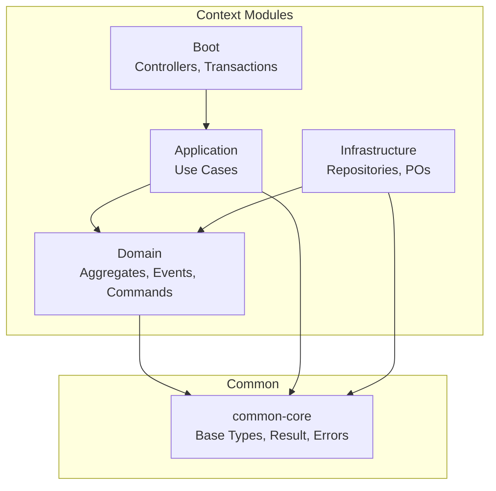
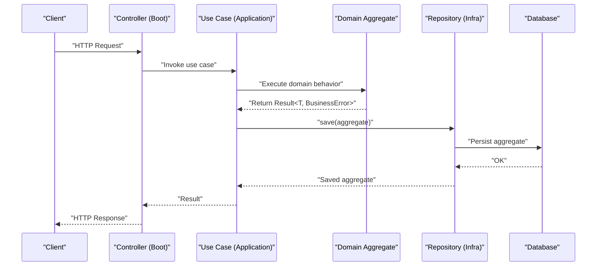
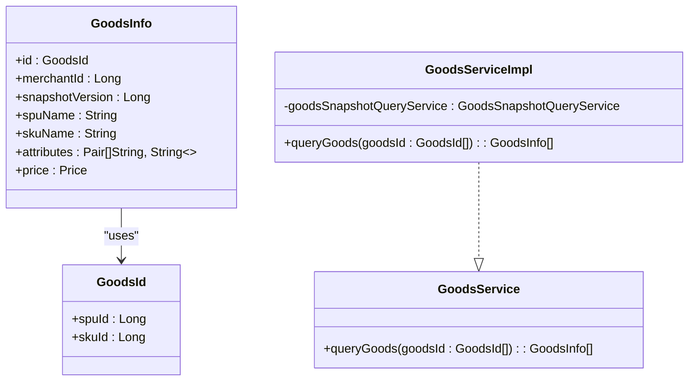
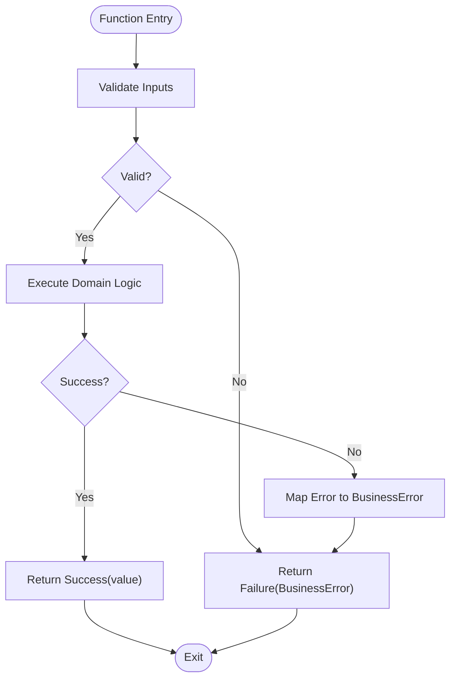
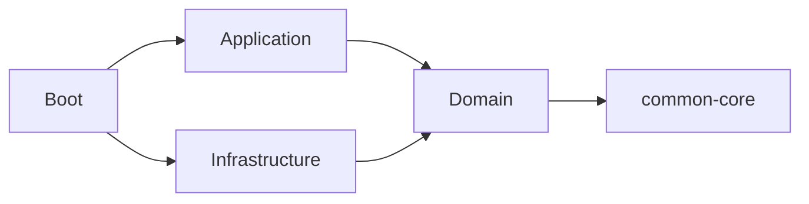

# Design Guidelines & Conventions

<cite>
**Referenced Files in This Document**
- [ddd-guidelines.md](file://docs/steering/ddd-guidelines.md)
- [tdd-guidelines.md](file://docs/steering/tdd-guidelines.md)
- [Result.kt](file://j-store-common-core/src/main/kotlin/com/jstore/common/utils/Result.kt)
- [BusinessError.kt](file://j-store-common-core/src/main/kotlin/com/jstore/common/errors/BusinessError.kt)
- [Errors.kt](file://j-store-common-core/src/main/kotlin/com/jstore/common/errors/Errors.kt)
- [AggregateRoot.kt](file://j-store-common-core/src/main/kotlin/com/jstore/common/framework/AggregateRoot.kt)
- [Entity.kt](file://j-store-common-core/src/main/kotlin/com/jstore/common/framework/Entity.kt)
- [Identifier.kt](file://j-store-common-core/src/main/kotlin/com/jstore/common/framework/Identifier.kt)
- [AggregateRepository.kt](file://j-store-common-core/src/main/kotlin/com/jstore/common/framework/AggregateRepository.kt)
- [GoodsService.kt](file://j-store-order-domain/src/main/kotlin/com/jstore/order/acl/GoodsService.kt)
- [GoodsServiceImpl.kt](file://j-store-order-infrastructure/src/main/kotlin/com/jstore/order/acl/GoodsServiceImpl.kt)
- [AccountingOrderService.kt](file://j-store-accounting-domain/src/main/kotlin/com/jstore/accounting/acl/AccountingOrderService.kt)
- [OrderUseCases.kt](file://j-store-order-application/src/main/kotlin/com/jstore/order/service/OrderUseCases.kt)
</cite>

## Table of Contents
1. Introduction
2. Project Structure
3. Core Components
4. Architecture Overview
5. Detailed Component Analysis
6. Dependency Analysis
7. Performance Considerations
8. Troubleshooting Guide
9. Conclusion
10. Appendices

## Introduction
This document defines the design guidelines and coding conventions for the J-Store platform. It consolidates naming conventions, framework base types, error handling patterns, anti-corruption layer (ACL) usage, testing practices, performance considerations, and code quality standards to ensure consistency across modules and teams. The guidance is grounded in the project’s DDD architecture, Kotlin/Spring Boot stack, and Gradle multi-module layout.

## Project Structure
J-Store follows a modular DDD structure per bounded context:
- Domain module: pure domain logic, events, commands, ACL interfaces
- Application module: use-case ports and orchestration, no Spring dependencies
- Infrastructure module: persistence, external integrations, repository implementations
- Boot module: controllers, transactional decorators, wiring, deployment configuration
- Common modules: shared framework types and utilities

**Diagram sources**
- [ddd-guidelines.md](file://docs/steering/ddd-guidelines.md)

**Section sources**
- [ddd-guidelines.md](file://docs/steering/ddd-guidelines.md)

## Core Components
The platform’s core building blocks are defined in common-core and applied consistently across contexts.

- Base types and identifiers
  - Entity<I : Identifier>: base entity interface requiring a typed id
  - AggregateRoot<I : Identifier>: aggregate boundary marker
  - RecordsDomainEvents: pending event snapshot and acknowledgement contract
  - EventRecordingAggregateRoot<I>: aggregate base with private event queue and protected raise()
  - AggregateRepository<I, A>: repository port for aggregates with save and findById

- Result and BusinessError
  - Result<T, E>: sealed result type with Success/Failure and combinators (map, flatMap, onSuccess, onFailure, fold, getOrThrow, etc.)
  - BusinessError: structured error with message, errorCode, httpCode; use predefined constants or define context-specific errors

- Error exception wrapper
  - Errors: runtime exception variant with errorCode and httpCode for exceptional cases

These components standardize how domain objects, repositories, and application services model success/failure and identity.

**Section sources**
- [Entity.kt](file://j-store-common-core/src/main/kotlin/com/jstore/common/framework/Entity.kt)
- [AggregateRoot.kt](file://j-store-common-core/src/main/kotlin/com/jstore/common/framework/AggregateRoot.kt)
- [Identifier.kt](file://j-store-common-core/src/main/kotlin/com/jstore/common/framework/Identifier.kt)
- [AggregateRepository.kt](file://j-store-common-core/src/main/kotlin/com/jstore/common/framework/AggregateRepository.kt)
- [Result.kt](file://j-store-common-core/src/main/kotlin/com/jstore/common/utils/Result.kt)
- [BusinessError.kt](file://j-store-common-core/src/main/kotlin/com/jstore/common/errors/BusinessError.kt)
- [Errors.kt](file://j-store-common-core/src/main/kotlin/com/jstore/common/errors/Errors.kt)

## Architecture Overview
The platform enforces clear boundaries between layers and contexts:
- Domain layer owns business rules, events, and ACL interfaces
- Application layer orchestrates use cases without framework coupling
- Infrastructure implements persistence and external adapters
- Boot wires transactions and HTTP entry points

**Diagram sources**
- [ddd-guidelines.md](file://docs/steering/ddd-guidelines.md)
- [OrderUseCases.kt](file://j-store-order-application/src/main/kotlin/com/jstore/order/service/OrderUseCases.kt)

**Section sources**
- [ddd-guidelines.md](file://docs/steering/ddd-guidelines.md)
- [OrderUseCases.kt](file://j-store-order-application/src/main/kotlin/com/jstore/order/service/OrderUseCases.kt)

## Detailed Component Analysis

### Naming Conventions
Follow consistent naming across packages, classes, methods, and files:
- Aggregates/Entities: business nouns (e.g., Order, Spu)
- Implementations: Noun + Impl (e.g., NormalOrderImpl)
- Value Objects: business nouns (e.g., Price, PhoneNumber)
- Commands: verb phrase + CMD or Command (e.g., OrderCreateCMD)
- Domain Events: past-tense + Event (e.g., OrderCreatedEvent)
- Repositories: Root + Repository (interface), Root + RepositoryImpl (implementation)
- Application Services: Context + Service (e.g., CommodityService)
- Factories: Root + Factory (e.g., SpuFactory)
- ACL Interfaces: External context + Service (e.g., GoodsService)
- Persistence Objects: Entity + PO (e.g., OrderPO)
- JPA Repositories: Entity + POJpaRepository (e.g., OrderPOJpaRepository)
- Error Constants: Context + Errors (e.g., OrderErrors)

Package structure within modules:
- Domain: domain/{aggregate}/... with command/, event/, acl/
- Application: service/ for use-case ports and handlers
- Infrastructure: domain/{aggregate}/persistence/ for POs and JPA repos

**Section sources**
- [ddd-guidelines.md](file://docs/steering/ddd-guidelines.md)

### Framework Base Types and Usage Patterns
- Entities and Aggregates
  - Use Identifier for strongly typed IDs
  - Prefer EventRecordingAggregateRoot for aggregates that emit domain events
  - Keep pending events private; expose snapshots and acknowledge by stable IDs after publication

- Repositories
  - Extend AggregateRepository for aggregate-only persistence
  - Keep repository interfaces in domain; implementations in infrastructure

- Pagination and Query Wrappers
  - Use Page/SortedPage from common.query for query results

- Result and BusinessError
  - Return Result<T, BusinessError> from application services for expected failures
  - Use combinators like map, flatMap, onSuccess, onFailure, fold for clean composition
  - Define context-specific error objects following CommonBusinessError pattern

- Domain Events
  - Name with past-tense + Event
  - Record via protected raise() inside aggregates
  - Persist Outbox entries after saving aggregates; clear pending events only after successful publish

**Section sources**
- [AggregateRoot.kt](file://j-store-common-core/src/main/kotlin/com/jstore/common/framework/AggregateRoot.kt)
- [AggregateRepository.kt](file://j-store-common-core/src/main/kotlin/com/jstore/common/framework/AggregateRepository.kt)
- [Result.kt](file://j-store-common-core/src/main/kotlin/com/jstore/common/utils/Result.kt)
- [BusinessError.kt](file://j-store-common-core/src/main/kotlin/com/jstore/common/errors/BusinessError.kt)
- [ddd-guidelines.md](file://docs/steering/ddd-guidelines.md)

### Anti-Corruption Layer (ACL) Pattern
ACL isolates external service contracts from internal domain models:
- Define ACL interfaces in the consuming domain module under acl/
- Implement adapters in the infrastructure module
- Convert external models into local domain value objects/types

Examples:
- GoodsService interface in order domain; GoodsServiceImpl adapts goods snapshot data
- AccountingOrderService interface in accounting domain for order accounting info

**Diagram sources**
- [GoodsService.kt](file://j-store-order-domain/src/main/kotlin/com/jstore/order/acl/GoodsService.kt)
- [GoodsServiceImpl.kt](file://j-store-order-infrastructure/src/main/kotlin/com/jstore/order/acl/GoodsServiceImpl.kt)

**Section sources**
- [GoodsService.kt](file://j-store-order-domain/src/main/kotlin/com/jstore/order/acl/GoodsService.kt)
- [GoodsServiceImpl.kt](file://j-store-order-infrastructure/src/main/kotlin/com/jstore/order/acl/GoodsServiceImpl.kt)
- [AccountingOrderService.kt](file://j-store-accounting-domain/src/main/kotlin/com/jstore/accounting/acl/AccountingOrderService.kt)
- [ddd-guidelines.md](file://docs/steering/ddd-guidelines.md)

### Testing Guidelines
Adopt Test-Driven Development and layered testing:
- Write failing tests first, then minimal implementation, then refactor under test protection
- Domain tests: fast unit tests covering invariants, state transitions, events, and error branches
- Value object tests: validation, immutability, serialization round-trips
- Application service tests: fake repositories or mock ACLs; verify orchestration and failure propagation
- Infrastructure tests: narrow integration tests for PO↔domain mapping, JPA queries, transaction boundaries, Outbox persistence
- Controller/boot tests: cover API contracts, auth, parameter validation, key wiring only

Property-based testing is encouraged for large input spaces and invariants.

**Section sources**
- [tdd-guidelines.md](file://docs/steering/tdd-guidelines.md)

### Error Handling Strategies
- Preferred path: return Result<T, BusinessError> for expected business failures
- Exception path: use Errors for unexpected/runtime exceptions with errorCode and httpCode
- Early-return pattern: onFailure { return Failure(it) }
- Define context-specific error objects following CommonBusinessError pattern

**Diagram sources**
- [Result.kt](file://j-store-common-core/src/main/kotlin/com/jstore/common/utils/Result.kt)
- [BusinessError.kt](file://j-store-common-core/src/main/kotlin/com/jstore/common/errors/BusinessError.kt)
- [Errors.kt](file://j-store-common-core/src/main/kotlin/com/jstore/common/errors/Errors.kt)

**Section sources**
- [Result.kt](file://j-store-common-core/src/main/kotlin/com/jstore/common/utils/Result.kt)
- [BusinessError.kt](file://j-store-common-core/src/main/kotlin/com/jstore/common/errors/BusinessError.kt)
- [Errors.kt](file://j-store-common-core/src/main/kotlin/com/jstore/common/errors/Errors.kt)
- [ddd-guidelines.md](file://docs/steering/ddd-guidelines.md)

### Performance Considerations
- Prefer immutable value objects and small, focused aggregates to reduce mutation overhead
- Use Result combinators to avoid unnecessary branching and allocations
- Keep repository methods minimal and focused on aggregate persistence
- Avoid heavy computations in hot paths; defer to background jobs where appropriate
- Use pagination wrappers (Page/SortedPage) for efficient querying
- Ensure Outbox writes are batched and decoupled from critical request paths

[No sources needed since this section provides general guidance]

## Dependency Analysis
Dependency direction is strictly enforced:
- boot → application → domain → common-core
- boot → infrastructure → domain
- Domain/application must not depend on infrastructure or boot

**Diagram sources**
- [ddd-guidelines.md](file://docs/steering/ddd-guidelines.md)

**Section sources**
- [ddd-guidelines.md](file://docs/steering/ddd-guidelines.md)

## Performance Considerations
- Favor read-only transactions for query use cases
- Minimize cross-aggregate mutations; prefer explicit application transactions when necessary
- Use outbox/inbox messaging for external side effects to keep request latency low
- Cache frequently accessed reference data at the ACL layer when safe
- Profile and monitor database queries and event publishing throughput

[No sources needed since this section provides general guidance]

## Troubleshooting Guide
Common issues and resolutions:
- Unexpected exceptions: wrap risky operations with resultOf/runResultOf and handle via onFailure
- Inconsistent state after partial failures: ensure Outbox writes and aggregate saves are in the same transaction; rollback preserves pending events
- ACL adapter failures: validate external responses and map to BusinessError early; add retries or fallbacks at the adapter layer
- Transaction boundaries: confirm MANDATORY semantics for mutating repository adapters; avoid nested independent transactions

**Section sources**
- [Result.kt](file://j-store-common-core/src/main/kotlin/com/jstore/common/utils/Result.kt)
- [ddd-guidelines.md](file://docs/steering/ddd-guidelines.md)

## Conclusion
By adhering to these design guidelines and conventions—DDD boundaries, strong typing, Result-driven error handling, ACL isolation, and disciplined testing—the J-Store platform maintains clarity, reliability, and scalability across its many bounded contexts. Consistent naming, repository patterns, and transaction strategies further reduce cognitive load and risk during evolution.

[No sources needed since this section summarizes without analyzing specific files]

## Appendices

### Code Quality Standards and Review Criteria
- No anemic models; entities must encapsulate behavior
- Domain layer must not import Spring/JPA/Hibernate
- No PO types in domain layer; POs belong to infrastructure only
- Repository interfaces must not leak persistence details
- Immutable value objects; no var on value types
- Clear separation of concerns: application services orchestrate, domain enforces rules
- Tests must precede changes; property tests preferred for invariants

**Section sources**
- [ddd-guidelines.md](file://docs/steering/ddd-guidelines.md)
- [tdd-guidelines.md](file://docs/steering/tdd-guidelines.md)