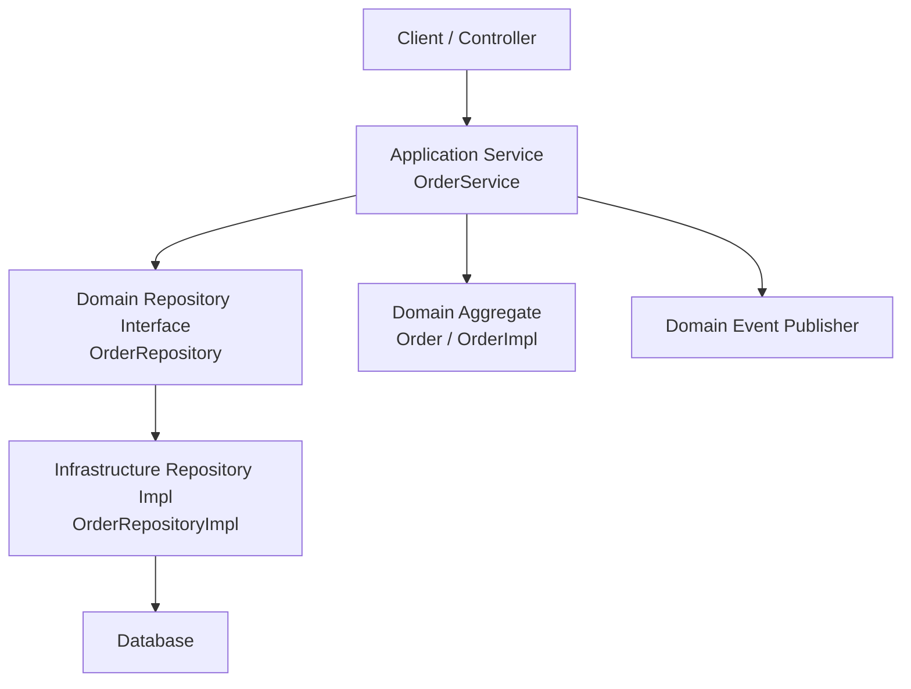
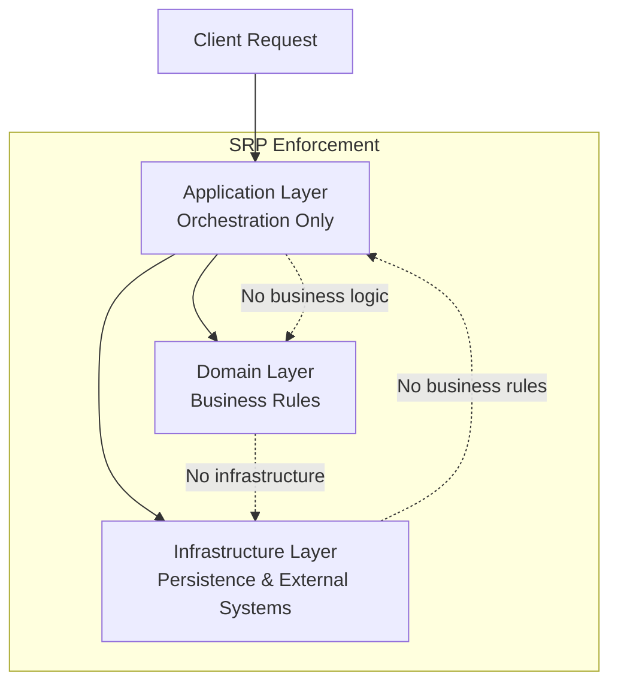
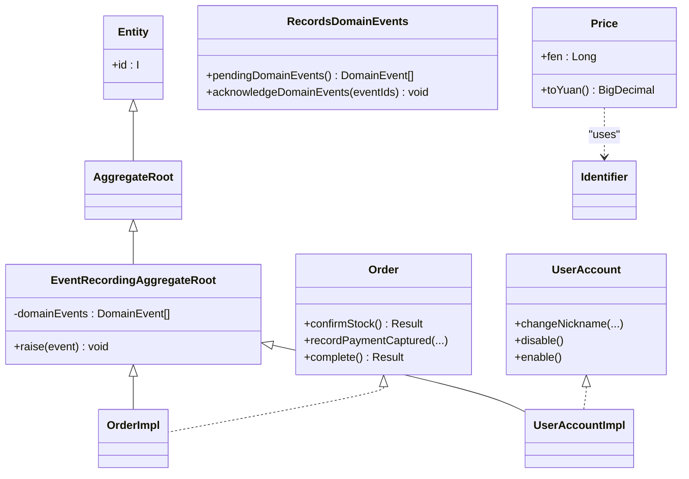
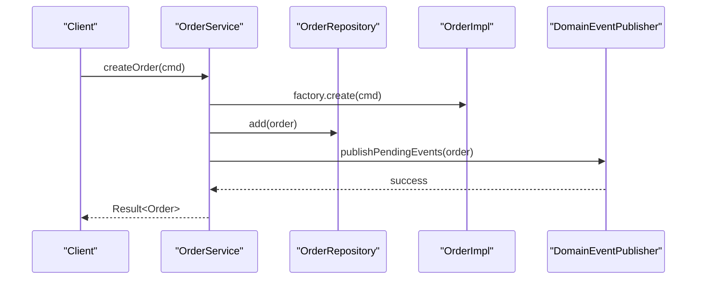
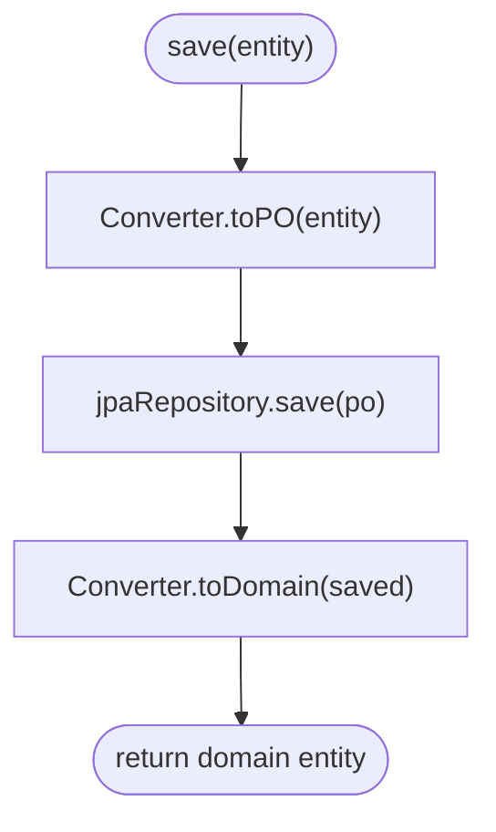
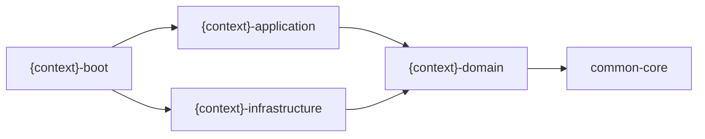

# Domain-Driven Design Principles

<cite>
**Referenced Files in This Document**
- [ddd-guidelines.md](file://docs/steering/ddd-guidelines.md)
- [AggregateRoot.kt](file://j-store-common-core/src/main/kotlin/com/jstore/common/framework/AggregateRoot.kt)
- [Entity.kt](file://j-store-common-core/src/main/kotlin/com/jstore/common/framework/Entity.kt)
- [Identifier.kt](file://j-store-common-core/src/main/kotlin/com/jstore/common/framework/Identifier.kt)
- [DomainEvent.kt](file://j-store-common-core/src/main/kotlin/com/jstore/common/framework/event/DomainEvent.kt)
- [AggregateRepository.kt](file://j-store-common-core/src/main/kotlin/com/jstore/common/framework/AggregateRepository.kt)
- [Order.kt](file://j-store-order-domain/src/main/kotlin/com/jstore/order/domain/order/Order.kt)
- [OrderImpl.kt](file://j-store-order-domain/src/main/kotlin/com/jstore/order/domain/order/OrderImpl.kt)
- [UserAccount.kt](file://j-store-user-domain/src/main/kotlin/com/jstore/user/domain/useraccount/UserAccount.kt)
- [UserAccountImpl.kt](file://j-store-user-domain/src/main/kotlin/com/jstore/user/domain/useraccount/UserAccountImpl.kt)
- [Price.kt](file://j-store-common-core/src/main/kotlin/com/jstore/common/properties/Price.kt)
- [OrderService.kt](file://j-store-order-application/src/main/kotlin/com/jstore/order/service/OrderService.kt)
- [OrderUseCases.kt](file://j-store-order-application/src/main/kotlin/com/jstore/order/service/OrderUseCases.kt)
- [OrderRepositoryImpl.kt](file://j-store-order-infrastructure/src/main/kotlin/com/jstore/order/domain/order/OrderRepositoryImpl.kt)
- [UserId.kt](file://j-store-user-domain/src/main/kotlin/com/jstore/user/domain/useraccount/UserId.kt)
- [OrderFactory.kt](file://j-store-order-domain/src/main/kotlin/com/jstore/order/domain/order/OrderFactory.kt)
- [UserAccountFactory.kt](file://j-store-user-domain/src/main/kotlin/com/jstore/user/domain/useraccount/UserAccountFactory.kt)
- [CommodityService.kt](file://j-store-goods-application/src/main/kotlin/com/jstore/goods/service/CommodityService.kt)
</cite>

## Update Summary
**Changes Made**
- Added comprehensive Single Responsibility Principle (SRP) guidelines section with mandatory coding standards
- Enhanced implementation code quality requirements for modules, classes, and functions
- Updated coding conventions to emphasize separation of responsibilities
- Added practical examples demonstrating SRP application across different layers

## Table of Contents
1. [Introduction](#introduction)
2. [Project Structure](#project-structure)
3. [Core Components](#core-components)
4. [Architecture Overview](#architecture-overview)
5. [Detailed Component Analysis](#detailed-component-analysis)
6. [Dependency Analysis](#dependency-analysis)
7. [Performance Considerations](#performance-considerations)
8. [Troubleshooting Guide](#troubleshooting-guide)
9. [Conclusion](#conclusion)
10. [Appendices](#appendices)

## Introduction
This document explains how DDD is implemented in J-Store with concrete examples from the codebase. It covers bounded contexts, aggregates, entities, value objects, repositories, and the four-layer module structure (domain, application, infrastructure, boot). It also documents coding conventions for commands, domain events, and repositories; provides practical patterns and anti-patterns; and addresses aggregate boundaries, consistency models, and cross-context communication. **Updated** with mandatory Single Responsibility Principle (SRP) guidelines that enforce strict separation of concerns across all implementation code.

## Project Structure
J-Store organizes each bounded context into four Gradle modules:
- j-store-{context}-domain: pure domain logic (entities, aggregates, value objects, repository interfaces, ACL interfaces)
- j-store-{context}-application: framework-free use cases and orchestration services
- j-store-{context}-infrastructure: persistence adapters, JPA POs, Spring Data repositories, and external integrations
- j-store-{context}-boot: wiring, controllers, transaction decorators, and deployment configuration

Shared foundations live in:
- j-store-common-core: base types (Entity, AggregateRoot, Identifier, DomainEvent, AggregateRepository, Result, Price, etc.)
- j-store-common-spring: Spring-specific utilities

Dependency direction:
- boot → application → domain → common-core
- boot → infrastructure → domain
- domain/application must NOT depend on infrastructure or boot

```mermaid
graph TB
subgraph "Boot"
Boot["{context}-boot"]
end
subgraph "Application"
App["{context}-application"]
end
subgraph "Domain"
Dom["{context}-domain"]
end
subgraph "Infrastructure"
Infra["{context}-infrastructure"]
end
Common["common-core"]
Boot --> App
Boot --> Infra
App --> Dom
Infra --> Dom
Dom --> Common
```

**Section sources**
- [ddd-guidelines.md:16-29](file://docs/steering/ddd-guidelines.md#L16-L29)

## Core Components
- Entities and Aggregates:
  - Entity<I> defines identity via a typed Identifier
  - AggregateRoot<I> marks a consistency boundary
  - EventRecordingAggregateRoot<I> provides private event recording and protected raise()
- Value Objects:
  - Immutable data carriers with validation (e.g., Price encapsulates monetary amounts in cents)
- Repositories:
  - AggregateRepository<I, A> exposes save and findById using domain types only
- Domain Events:
  - DomainEvent interface with stable envelope metadata; newDomainEventId() creates IDs

These primitives are used consistently across contexts to enforce DDD boundaries and behavior encapsulation.

**Section sources**
- [Entity.kt:1-6](file://j-store-common-core/src/main/kotlin/com/jstore/common/framework/Entity.kt#L1-L6)
- [AggregateRoot.kt:1-40](file://j-store-common-core/src/main/kotlin/com/jstore/common/framework/AggregateRoot.kt#L1-L40)
- [AggregateRepository.kt:1-9](file://j-store-common-core/src/main/kotlin/com/jstore/common/framework/AggregateRepository.kt#L1-L9)
- [DomainEvent.kt:1-46](file://j-store-common-core/src/main/kotlin/com/jstore/common/framework/event/DomainEvent.kt#L1-L46)
- [Price.kt:1-71](file://j-store-common-core/src/main/kotlin/com/jstore/common/properties/Price.kt#L1-L71)

## Architecture Overview
The system follows a layered architecture per bounded context:
- Application layer orchestrates use cases without business rules
- Domain layer enforces invariants and emits domain events
- Infrastructure adapts persistence and external systems
- Boot wires transactions and endpoints



**Diagram sources**
- [OrderService.kt:25-51](file://j-store-order-application/src/main/kotlin/com/jstore/order/service/OrderService.kt#L25-L51)
- [OrderRepositoryImpl.kt:17-31](file://j-store-order-infrastructure/src/main/kotlin/com/jstore/order/domain/order/OrderRepositoryImpl.kt#L17-L31)
- [Order.kt:13-89](file://j-store-order-domain/src/main/kotlin/com/jstore/order/domain/order/Order.kt#L13-L89)

## Detailed Component Analysis

### Bounded Contexts and Module Boundaries
- Each context (order, user, accounting, payment, fulfillment, goods) has its own domain/application/infrastructure/boot modules
- ACL interfaces isolate external context models; implementations live in infrastructure
- Commands and events follow naming conventions defined by guidelines

Practical example:
- Order context uses OrderUseCase as an inbound port; OrderService implements it
- Accounting context exposes AccountingUseCase for journaling operations

**Section sources**
- [ddd-guidelines.md:31-47](file://docs/steering/ddd-guidelines.md#L31-L47)
- [OrderUseCases.kt:25-70](file://j-store-order-application/src/main/kotlin/com/jstore/order/service/OrderUseCases.kt#L25-L70)

### Single Responsibility Principle (SRP) Guidelines
**Updated** The Single Responsibility Principle is now a mandatory requirement for all implementation code in J-Store:

- **Module Level**: Each module should have one well-defined responsibility and one primary reason to change
- **Class Level**: Each class should encapsulate a single cohesive set of functionality
- **Function Level**: Each function should perform one specific task
- **Separation of Concerns**: Unrelated responsibilities must be separated into distinct units

Examples of SRP application:
- `OrderService` handles order orchestration only, delegating business logic to domain objects
- `OrderRepositoryImpl` focuses solely on persistence concerns with conversion logic
- `OrderFactory` manages aggregate creation without business orchestration
- `CommodityService` coordinates commodity operations while keeping business rules in domain



**Diagram sources**
- [OrderService.kt:24-29](file://j-store-order-application/src/main/kotlin/com/jstore/order/service/OrderService.kt#L24-L29)
- [OrderRepositoryImpl.kt:17-31](file://j-store-order-infrastructure/src/main/kotlin/com/jstore/order/domain/order/OrderRepositoryImpl.kt#L17-L31)
- [OrderFactory.kt:16-25](file://j-store-order-domain/src/main/kotlin/com/jstore/order/domain/order/OrderFactory.kt#L16-L25)

**Section sources**
- [ddd-guidelines.md:77-80](file://docs/steering/ddd-guidelines.md#L77-L80)
- [OrderService.kt:24-29](file://j-store-order-application/src/main/kotlin/com/jstore/order/service/OrderService.kt#L24-L29)

### Entities, Aggregates, and Value Objects
- Entities implement Entity<I> with a strongly-typed Identifier
- Aggregates extend EventRecordingAggregateRoot<I> to record events privately and expose snapshots
- Value objects like Price encapsulate domain concepts and validations

Examples:
- Order and UserAccount aggregates define rich behavior and state transitions
- UserId and Price are value objects with immutable semantics



**Diagram sources**
- [AggregateRoot.kt:1-40](file://j-store-common-core/src/main/kotlin/com/jstore/common/framework/AggregateRoot.kt#L1-L40)
- [Order.kt:13-89](file://j-store-order-domain/src/main/kotlin/com/jstore/order/domain/order/Order.kt#L13-L89)
- [OrderImpl.kt:19-36](file://j-store-order-domain/src/main/kotlin/com/jstore/order/domain/order/OrderImpl.kt#L19-36)
- [UserAccount.kt:15-35](file://j-store-user-domain/src/main/kotlin/com/jstore/user/domain/useraccount/UserAccount.kt#L15-35)
- [UserAccountImpl.kt:13-21](file://j-store-user-domain/src/main/kotlin/com/jstore/user/domain/useraccount/UserAccountImpl.kt#L13-21)
- [Price.kt:15-19](file://j-store-common-core/src/main/kotlin/com/jstore/common/properties/Price.kt#L15-19)

**Section sources**
- [OrderImpl.kt:88-149](file://j-store-order-domain/src/main/kotlin/com/jstore/order/domain/order/OrderImpl.kt#L88-L149)
- [UserAccountImpl.kt:27-55](file://j-store-user-domain/src/main/kotlin/com/jstore/user/domain/useraccount/UserAccountImpl.kt#L27-L55)
- [Price.kt:1-71](file://j-store-common-core/src/main/kotlin/com/jstore/common/properties/Price.kt#L1-L71)

### Commands and Domain Events
- Commands are plain data carriers placed under domain/{aggregate}/command/
- Domain events are named with past-tense verb + Event suffix and recorded via raise()
- Application services publish pending events after saving aggregates

Example flows:
- Order creation raises OrderCreatedEvent
- Payment capture raises OrderPaidEvent
- Fulfillment updates raise corresponding events



**Diagram sources**
- [OrderService.kt:43-51](file://j-store-order-application/src/main/kotlin/com/jstore/order/service/OrderService.kt#L43-L51)
- [OrderImpl.kt:76-86](file://j-store-order-domain/src/main/kotlin/com/jstore/order/domain/order/OrderImpl.kt#L76-L86)

**Section sources**
- [ddd-guidelines.md:90-102](file://docs/steering/ddd-guidelines.md#L90-L102)
- [OrderService.kt:43-51](file://j-store-order-application/src/main/kotlin/com/jstore/order/service/OrderService.kt#L43-L51)

### Repositories and Persistence Adapters
- Repository interfaces live in domain; implementations in infrastructure
- Implementations convert between domain aggregates and POs
- Mutating methods require an existing transaction (MANDATORY propagation)

Example:
- OrderRepositoryImpl persists Order and converts OrderPO to OrderImpl



**Diagram sources**
- [OrderRepositoryImpl.kt:27-31](file://j-store-order-infrastructure/src/main/kotlin/com/jstore/order/domain/order/OrderRepositoryImpl.kt#L27-L31)
- [OrderRepositoryImpl.kt:52-104](file://j-store-order-infrastructure/src/main/kotlin/com/jstore/order/domain/order/OrderRepositoryImpl.kt#L52-L104)

**Section sources**
- [ddd-guidelines.md:104-136](file://docs/steering/ddd-guidelines.md#L104-L136)
- [OrderRepositoryImpl.kt:17-31](file://j-store-order-infrastructure/src/main/kotlin/com/jstore/order/domain/order/OrderRepositoryImpl.kt#L17-L31)

### Cross-Context Communication Patterns
- Anti-corruption layer (ACL) interfaces in consuming domain modules
- Implementations in infrastructure convert external models to local domain models
- Integration messages coordinate across contexts without distributed transactions

Example:
- Order context depends on GoodsService (ACL) to access goods information
- Accounting context receives integration messages to post journal entries

**Section sources**
- [ddd-guidelines.md:124-129](file://docs/steering/ddd-guidelines.md#L124-L129)

### Consistency Models and Aggregate Boundaries
- Aggregates are consistency boundaries; prefer one aggregate per write use case
- Cross-context coordination uses integration messages rather than distributed transactions
- Pending events ensure eventual consistency through Outbox pattern

Guidelines emphasize:
- No unbounded cross-aggregate mutation within a single transaction
- Explicit application transactions when multiple local aggregates must be updated together

**Section sources**
- [ddd-guidelines.md:83-84](file://docs/steering/ddd-guidelines.md#L83-L84)
- [ddd-guidelines.md:138-143](file://docs/steering/ddd-guidelines.md#L138-L143)

### Practical Examples of Proper DDD Implementation
- Order aggregate encapsulates lifecycle transitions and validates states before mutations
- UserAccount aggregate manages account status changes with clear invariants
- Application services orchestrate loading, domain execution, saving, and publishing events
- Value objects like Price provide safe arithmetic and conversions

**Section sources**
- [OrderImpl.kt:88-149](file://j-store-order-domain/src/main/kotlin/com/jstore/order/domain/order/OrderImpl.kt#L88-L149)
- [UserAccountImpl.kt:27-55](file://j-store-user-domain/src/main/kotlin/com/jstore/user/domain/useraccount/UserAccountImpl.kt#L27-L55)
- [OrderService.kt:54-95](file://j-store-order-application/src/main/kotlin/com/jstore/order/service/OrderService.kt#L54-L95)

### Anti-Patterns to Avoid
- Domain layer importing Spring/JPA/Hibernate
- Anemic models with no behavior
- Unbounded cross-aggregate mutations
- PO types leaking into domain layer
- Business logic in application services or controllers
- Direct object references between aggregates
- Persistence details in repository interfaces
- Mutable value objects
- **New**: Violating SRP by combining unrelated responsibilities in single units

**Section sources**
- [ddd-guidelines.md:150-159](file://docs/steering/ddd-guidelines.md#L150-L159)

## Dependency Analysis
The dependency graph enforces strict separation:
- Boot depends on application and infrastructure
- Application depends on domain
- Infrastructure depends on domain
- Domain depends only on common-core



**Diagram sources**
- [ddd-guidelines.md:16-29](file://docs/steering/ddd-guidelines.md#L16-L29)

**Section sources**
- [ddd-guidelines.md:16-29](file://docs/steering/ddd-guidelines.md#L16-L29)

## Performance Considerations
- Prefer single-aggregate writes to minimize contention and simplify transactions
- Use pagination wrappers (Page/SortedPage) for efficient queries
- Avoid heavy transformations in hot paths; keep converters localized in infrastructure
- Leverage immutable value objects to reduce defensive copying overhead
- **Updated**: Apply SRP to improve testability and maintain performance by isolating expensive operations

## Troubleshooting Guide
Common issues and resolutions:
- Duplicate pending domain event IDs: ensure unique eventId generation and avoid re-raising same event
- Illegal state transitions: validate preconditions in aggregate methods
- Missing source documents in accounting: check idempotency checks and repository lookups
- Transaction failures: ensure MANDATORY propagation for mutating repository methods
- **New**: SRP violations causing maintenance difficulties: refactor large classes into focused, single-purpose components

**Section sources**
- [AggregateRoot.kt:24-29](file://j-store-common-core/src/main/kotlin/com/jstore/common/framework/AggregateRoot.kt#L24-L29)
- [OrderRepositoryImpl.kt:20-24](file://j-store-order-infrastructure/src/main/kotlin/com/jstore/order/domain/order/OrderRepositoryImpl.kt#L20-L24)
- [OrderService.kt:33-35](file://j-store-order-application/src/main/kotlin/com/jstore/order/service/OrderService.kt#L33-L35)

## Conclusion
J-Store's DDD implementation emphasizes clear boundaries, behavior-rich aggregates, immutable value objects, and robust event-driven communication. The four-layer module structure and strict dependency rules ensure maintainability and scalability. **Updated** with mandatory Single Responsibility Principle guidelines that enforce separation of concerns across all implementation code, leading to consistent, testable, and evolvable domain models. Following the coding conventions and avoiding anti-patterns ensures high-quality, maintainable software architecture.

## Appendices

### Coding Conventions Summary
- Entities: typed Identifier, behavior encapsulation
- Aggregates: consistency boundaries, event recording via raise()
- Value Objects: immutable, validated in init
- Commands: verb phrase + CMD/Command
- Domain Events: past-tense + Event, stable metadata
- Repositories: interface in domain, impl in infrastructure, domain-only types
- Factories: complex creation logic, framework-free
- Application Services: orchestration only, no business rules
- ACL: external context isolation
- **Updated**: SRP: each unit has one responsibility, separate unrelated concerns

**Section sources**
- [ddd-guidelines.md:75-177](file://docs/steering/ddd-guidelines.md#L75-L177)