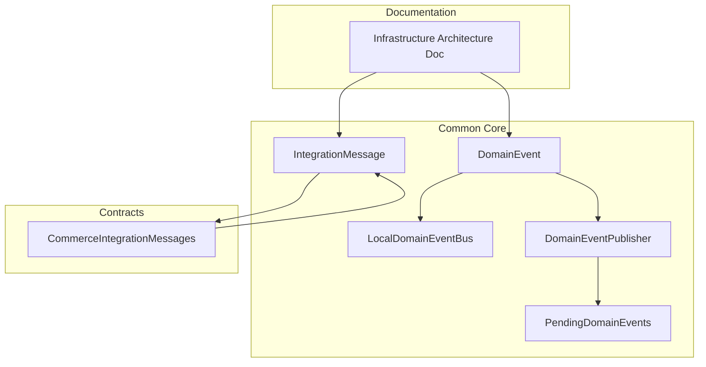
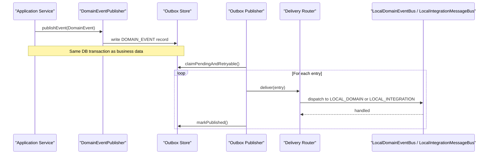
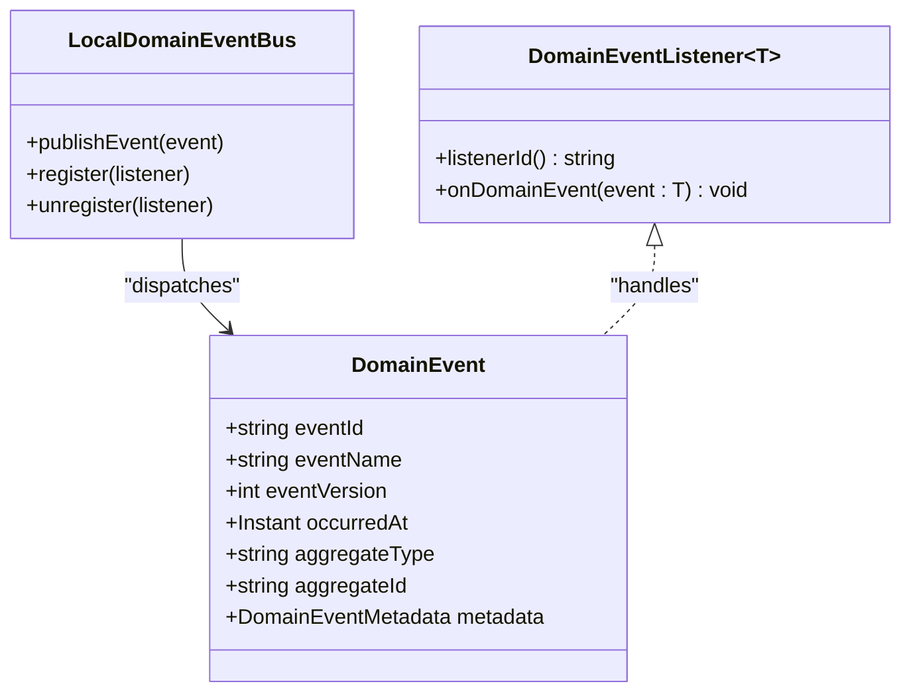
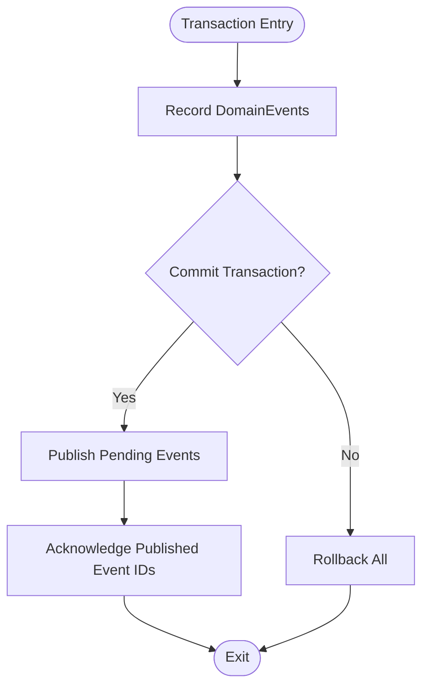
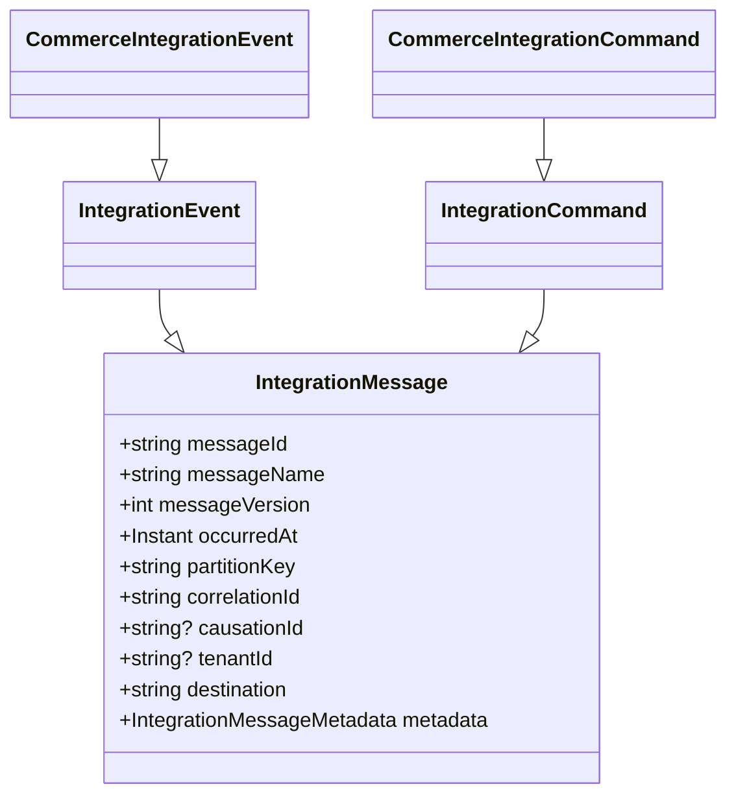
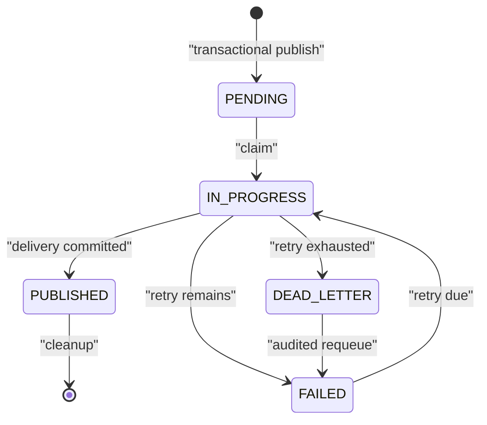
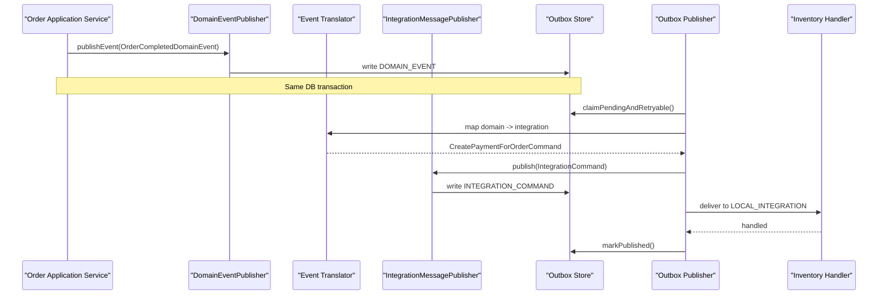
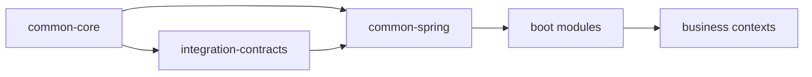

# Event-Driven Architecture

<cite>
**Referenced Files in This Document**
- [DomainEvent.kt](file://j-store-common-core/src/main/kotlin/com/jstore/common/framework/event/DomainEvent.kt)
- [LocalDomainEventBus.kt](file://j-store-common-core/src/main/kotlin/com/jstore/common/framework/event/LocalDomainEventBus.kt)
- [DomainEventPublisher.kt](file://j-store-common-core/src/main/kotlin/com/jstore/common/framework/event/DomainEventPublisher.kt)
- [PendingDomainEvents.kt](file://j-store-common-core/src/main/kotlin/com/jstore/common/framework/event/PendingDomainEvents.kt)
- [IntegrationMessage.kt](file://j-store-common-core/src/main/kotlin/com/jstore/common/framework/messaging/IntegrationMessage.kt)
- [CommerceIntegrationMessages.kt](file://j-store-integration-contracts/src/main/kotlin/com/jstore/contracts/commerce/CommerceIntegrationMessages.kt)
- [领域事件基础设施架构.md](file://docs/technic/领域事件基础设施架构.md)
</cite>

## Table of Contents
1. [Introduction](#introduction)
2. [Project Structure](#project-structure)
3. [Core Components](#core-components)
4. [Architecture Overview](#architecture-overview)
5. [Detailed Component Analysis](#detailed-component-analysis)
6. [Dependency Analysis](#dependency-analysis)
7. [Performance Considerations](#performance-considerations)
8. [Troubleshooting Guide](#troubleshooting-guide)
9. [Conclusion](#conclusion)

## Introduction
This document explains the event-driven architecture implemented across J-Store’s bounded contexts. It covers domain events, integration messages, and the transactional outbox pattern used to guarantee reliable delivery. It also documents the local event bus, handler registration patterns, cross-context communication via integration contracts, and how domain events are translated into integration messages for external systems. The guide includes design patterns, versioning strategies, error handling, ordering guarantees, idempotency, and eventual consistency considerations.

## Project Structure
The event-driven implementation spans a few core modules:
- j-store-common-core: Defines DomainEvent, LocalDomainEventBus, DomainEventPublisher, and IntegrationMessage abstractions.
- j-store-integration-contracts: Declares versioned integration commands and events shared across contexts.
- docs/technic: Provides architectural guidance on event infrastructure, outbox relay, and messaging modes.

**Diagram sources**
- [DomainEvent.kt:1-46](file://j-store-common-core/src/main/kotlin/com/jstore/common/framework/event/DomainEvent.kt#L1-L46)
- [LocalDomainEventBus.kt:1-15](file://j-store-common-core/src/main/kotlin/com/jstore/common/framework/event/LocalDomainEventBus.kt#L1-L15)
- [DomainEventPublisher.kt:1-11](file://j-store-common-core/src/main/kotlin/com/jstore/common/framework/event/DomainEventPublisher.kt#L1-L11)
- [PendingDomainEvents.kt:1-11](file://j-store-common-core/src/main/kotlin/com/jstore/common/framework/event/PendingDomainEvents.kt#L1-L11)
- [IntegrationMessage.kt:1-101](file://j-store-common-core/src/main/kotlin/com/jstore/common/framework/messaging/IntegrationMessage.kt#L1-L101)
- [CommerceIntegrationMessages.kt:1-382](file://j-store-integration-contracts/src/main/kotlin/com/jstore/contracts/commerce/CommerceIntegrationMessages.kt#L1-L382)
- [领域事件基础设施架构.md:1-186](file://docs/technic/领域事件基础设施架构.md#L1-L186)

**Section sources**
- [DomainEvent.kt:1-46](file://j-store-common-core/src/main/kotlin/com/jstore/common/framework/event/DomainEvent.kt#L1-L46)
- [IntegrationMessage.kt:1-101](file://j-store-common-core/src/main/kotlin/com/jstore/common/framework/messaging/IntegrationMessage.kt#L1-L101)
- [领域事件基础设施架构.md:1-186](file://docs/technic/领域事件基础设施架构.md#L1-L186)

## Core Components
- DomainEvent: Immutable domain fact with stable envelope metadata (eventId, eventName, eventVersion, occurredAt, aggregateType, aggregateId).
- LocalDomainEventBus: In-process synchronous dispatcher for domain events; no remote delivery or durability guarantees.
- DomainEventPublisher: Transactional publisher that writes to the outbox within the business transaction.
- PendingDomainEvents: Utility to publish pending domain events atomically and acknowledge them after success.
- IntegrationMessage: Stable contract crossing process boundaries with messageId, messageName, messageVersion, partitionKey, correlationId, causationId, tenantId, destination.
- CommerceIntegrationMessages: Versioned integration commands and events for inventory, payment, fulfillment, and order lifecycle.

Key responsibilities:
- Domain events remain internal to a context and are delivered synchronously via LocalDomainEventBus.
- Cross-context communication uses IntegrationCommand/IntegrationEvent published through the outbox.
- Outbox ensures at-least-once delivery with retry, dead-lettering, and ordered processing per aggregate.

**Section sources**
- [DomainEvent.kt:1-46](file://j-store-common-core/src/main/kotlin/com/jstore/common/framework/event/DomainEvent.kt#L1-L46)
- [LocalDomainEventBus.kt:1-15](file://j-store-common-core/src/main/kotlin/com/jstore/common/framework/event/LocalDomainEventBus.kt#L1-L15)
- [DomainEventPublisher.kt:1-11](file://j-store-common-core/src/main/kotlin/com/jstore/common/framework/event/DomainEventPublisher.kt#L1-L11)
- [PendingDomainEvents.kt:1-11](file://j-store-common-core/src/main/kotlin/com/jstore/common/framework/event/PendingDomainEvents.kt#L1-L11)
- [IntegrationMessage.kt:1-101](file://j-store-common-core/src/main/kotlin/com/jstore/common/framework/messaging/IntegrationMessage.kt#L1-L101)
- [CommerceIntegrationMessages.kt:1-382](file://j-store-integration-contracts/src/main/kotlin/com/jstore/contracts/commerce/CommerceIntegrationMessages.kt#L1-L382)

## Architecture Overview
The system separates domain events from integration messages:
- Domain events are emitted by aggregates/services and dispatched locally.
- Integration messages are versioned contracts used for cross-context communication.
- Both are persisted in an outbox during the same database transaction as business data.
- A relay process claims pending records, routes to appropriate channels (LOCAL_DOMAIN, LOCAL_INTEGRATION, BROKER), and marks them published upon success.

**Diagram sources**
- [DomainEventPublisher.kt:1-11](file://j-store-common-core/src/main/kotlin/com/jstore/common/framework/event/DomainEventPublisher.kt#L1-L11)
- [IntegrationMessage.kt:1-101](file://j-store-common-core/src/main/kotlin/com/jstore/common/framework/messaging/IntegrationMessage.kt#L1-L101)
- [领域事件基础设施架构.md:89-121](file://docs/technic/领域事件基础设施架构.md#L89-L121)

## Detailed Component Analysis

### Domain Events and Local Bus
- DomainEvent defines immutable facts with stable metadata for diagnostics and idempotent consumers.
- LocalDomainEventBus provides register/unregister and publish methods for in-process listeners.
- Handlers implement DomainEventListener<T>, using a stable listenerId for idempotent consumption tracking.

**Diagram sources**
- [DomainEvent.kt:1-46](file://j-store-common-core/src/main/kotlin/com/jstore/common/framework/event/DomainEvent.kt#L1-L46)
- [LocalDomainEventBus.kt:1-15](file://j-store-common-core/src/main/kotlin/com/jstore/common/framework/event/LocalDomainEventBus.kt#L1-L15)
- [DomainEventListener.kt:1-26](file://j-store-common-core/src/main/kotlin/com/jstore/common/framework/event/DomainEventListener.kt#L1-L26)

**Section sources**
- [DomainEvent.kt:1-46](file://j-store-common-core/src/main/kotlin/com/jstore/common/framework/event/DomainEvent.kt#L1-L46)
- [LocalDomainEventBus.kt:1-15](file://j-store-common-core/src/main/kotlin/com/jstore/common/framework/event/LocalDomainEventBus.kt#L1-L15)
- [DomainEventListener.kt:1-26](file://j-store-common-core/src/main/kotlin/com/jstore/common/framework/event/DomainEventListener.kt#L1-L26)

### Transactional Outbox and Pending Events
- DomainEventPublisher writes outbox entries within the caller’s transaction.
- PendingDomainEvents.publishPendingEvents publishes all pending events atomically and acknowledges them only after successful publication.

**Diagram sources**
- [DomainEventPublisher.kt:1-11](file://j-store-common-core/src/main/kotlin/com/jstore/common/framework/event/DomainEventPublisher.kt#L1-L11)
- [PendingDomainEvents.kt:1-11](file://j-store-common-core/src/main/kotlin/com/jstore/common/framework/event/PendingDomainEvents.kt#L1-L11)

**Section sources**
- [DomainEventPublisher.kt:1-11](file://j-store-common-core/src/main/kotlin/com/jstore/common/framework/event/DomainEventPublisher.kt#L1-L11)
- [PendingDomainEvents.kt:1-11](file://j-store-common-core/src/main/kotlin/com/jstore/common/framework/event/PendingDomainEvents.kt#L1-L11)

### Integration Messages and Contracts
- IntegrationMessage enforces stable envelope fields and validation rules for cross-context communication.
- CommerceIntegrationMessages defines versioned commands/events for inventory, payment, fulfillment, and order completion.
- Each message carries partitionKey, correlationId, causationId, and optional tenantId for routing and tracing.

**Diagram sources**
- [IntegrationMessage.kt:1-101](file://j-store-common-core/src/main/kotlin/com/jstore/common/framework/messaging/IntegrationMessage.kt#L1-L101)
- [CommerceIntegrationMessages.kt:1-382](file://j-store-integration-contracts/src/main/kotlin/com/jstore/contracts/commerce/CommerceIntegrationMessages.kt#L1-L382)

**Section sources**
- [IntegrationMessage.kt:1-101](file://j-store-common-core/src/main/kotlin/com/jstore/common/framework/messaging/IntegrationMessage.kt#L1-L101)
- [CommerceIntegrationMessages.kt:1-382](file://j-store-integration-contracts/src/main/kotlin/com/jstore/contracts/commerce/CommerceIntegrationMessages.kt#L1-L382)

### Outbox Relay and Delivery Channels
- The relay claims pending/outbox entries, renews leases, and delivers to exactly one channel based on target type.
- Channels include LOCAL_DOMAIN, LOCAL_INTEGRATION, and BROKER.
- Successful delivery marks entries as published; failures transition to FAILED and eventually DEAD_LETTER after retries.

**Diagram sources**
- [领域事件基础设施架构.md:137-155](file://docs/technic/领域事件基础设施架构.md#L137-L155)

**Section sources**
- [领域事件基础设施架构.md:89-121](file://docs/technic/领域事件基础设施架构.md#L89-L121)
- [领域事件基础设施架构.md:137-155](file://docs/technic/领域事件基础设施架构.md#L137-L155)

### Cross-Context Communication Flow
A typical flow translates domain events into integration messages and delivers them via outbox relay:

**Diagram sources**
- [CommerceIntegrationMessages.kt:164-183](file://j-store-integration-contracts/src/main/kotlin/com/jstore/contracts/commerce/CommerceIntegrationMessages.kt#L164-L183)
- [领域事件基础设施架构.md:89-121](file://docs/technic/领域事件基础设施架构.md#L89-L121)

**Section sources**
- [CommerceIntegrationMessages.kt:164-183](file://j-store-integration-contracts/src/main/kotlin/com/jstore/contracts/commerce/CommerceIntegrationMessages.kt#L164-L183)
- [领域事件基础设施架构.md:89-121](file://docs/technic/领域事件基础设施架构.md#L89-L121)

## Dependency Analysis
- Common core defines interfaces and utilities; contracts module depends only on common-core.
- Spring adapters and outbox relay live in common-spring and boot modules, implementing transports and channels.
- Business contexts depend on contracts for cross-context messages and use publishers to emit domain/integration messages.

**Diagram sources**
- [领域事件基础设施架构.md:14-48](file://docs/technic/领域事件基础设施架构.md#L14-L48)

**Section sources**
- [领域事件基础设施架构.md:14-48](file://docs/technic/领域事件基础设施架构.md#L14-L48)

## Performance Considerations
- Use partitionKey to ensure ordered processing per aggregate while allowing parallelism across different aggregates.
- Prefer batch publishing of pending events to reduce outbox writes overhead.
- Avoid async Spring multicaster for local delivery; rely on relay transactions for reliability.
- Monitor backlog, failure rates, and dead-letter queues to detect bottlenecks early.

[No sources needed since this section provides general guidance]

## Troubleshooting Guide
- If delivery fails, check FAILED and DEAD_LETTER states; audited requeue is supported.
- Ensure consumer ID stability for idempotent handling; unique key conflicts indicate duplicate processing.
- Validate configuration for broker mode: exactly one BrokerIntegrationMessageTransport must exist when switching from local to broker/hybrid.
- Inspect metrics via OutboxMonitor for health indicators and backpressure signals.

**Section sources**
- [领域事件基础设施架构.md:137-166](file://docs/technic/领域事件基础设施架构.md#L137-L166)

## Conclusion
J-Store’s event-driven architecture cleanly separates domain events from integration messages, leveraging a transactional outbox for reliable delivery. The design supports versioned contracts, ordered processing per aggregate, idempotent consumers, and robust error handling. By adhering to these patterns, teams can evolve services independently while maintaining consistency and observability across bounded contexts.

[No sources needed since this section summarizes without analyzing specific files]