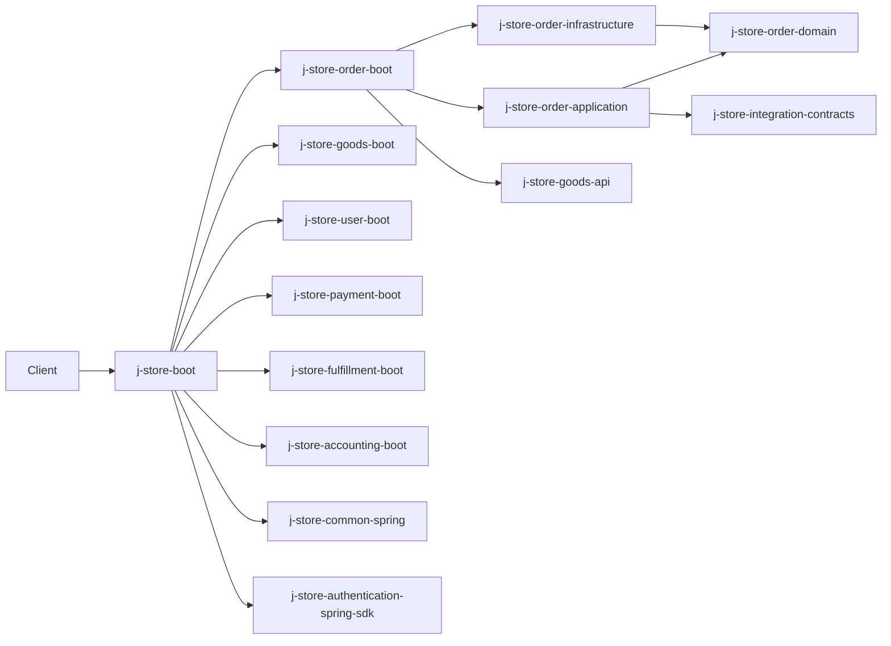
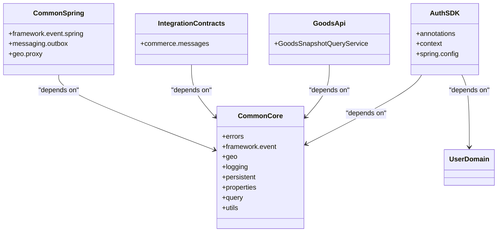
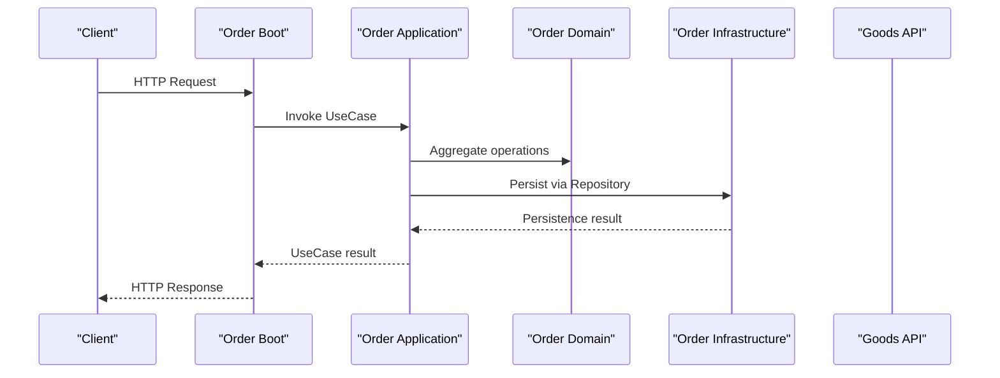
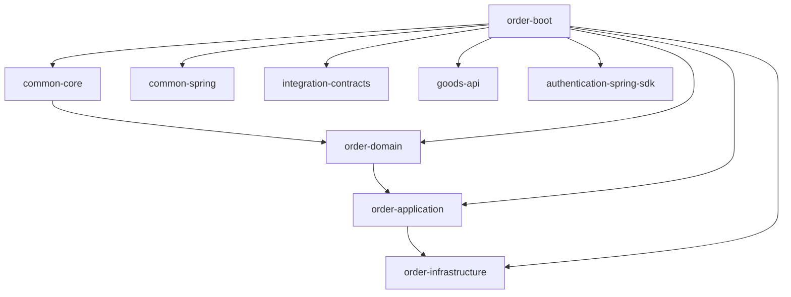

# Module Architecture & Dependencies

<cite>
**Referenced Files in This Document**
- [settings.gradle.kts](file://settings.gradle.kts)
- [build.gradle.kts](file://build.gradle.kts)
- [gradle.properties](file://gradle.properties)
- [gradle/libs.versions.toml](file://gradle/libs.versions.toml)
- [j-store-common-core/build.gradle.kts](file://j-store-common-core/build.gradle.kts)
- [j-store-common-spring/build.gradle.kts](file://j-store-common-spring/build.gradle.kts)
- [j-store-integration-contracts/build.gradle.kts](file://j-store-integration-contracts/build.gradle.kts)
- [j-store-goods-api/build.gradle.kts](file://j-store-goods-api/build.gradle.kts)
- [j-store-order-domain/build.gradle.kts](file://j-store-order-domain/build.gradle.kts)
- [j-store-order-application/build.gradle.kts](file://j-store-order-application/build.gradle.kts)
- [j-store-order-infrastructure/build.gradle.kts](file://j-store-order-infrastructure/build.gradle.kts)
- [j-store-order-boot/build.gradle.kts](file://j-store-order-boot/build.gradle.kts)
- [j-store-authentication-spring-sdk/build.gradle.kts](file://j-store-authentication-spring-sdk/build.gradle.kts)
- [project-overview.md](file://docs/project-overview.md)
</cite>

## Table of Contents
1. Introduction
2. Project Structure
3. Core Components
4. Architecture Overview
5. Detailed Component Analysis
6. Dependency Analysis
7. Performance Considerations
8. Troubleshooting Guide
9. Conclusion
10. Appendices

## Introduction
This document explains the multi-module Gradle architecture of the project, focusing on how bounded contexts are organized across domain, application, infrastructure, and boot modules. It details dependency direction rules that enforce DDD boundaries, describes shared common modules (common-core, common-spring), module interaction patterns, shared dependency management via version catalogs, and build configuration conventions. It also provides guidance for extending existing modules or creating new ones while preserving isolation and architectural integrity.

## Project Structure
The repository is a Gradle multi-project with many modules grouped by bounded context (order, goods, user, payment, fulfillment, accounting, shop, warehouse) plus shared libraries and boot aggregators. The root settings file declares all modules, and the root build config centralizes toolchain, repositories, and formatting. Version catalog defines versions and library coordinates used across modules.

```mermaid
graph TB
subgraph "Root"
ROOT["Root Build<br/>settings.gradle.kts<br/>build.gradle.kts<br/>gradle.properties"]
VCAT["Version Catalog<br/>gradle/libs.versions.toml"]
end
subgraph "Shared Libraries"
CORE["j-store-common-core"]
SPRING["j-store-common-spring"]
CONTRACTS["j-store-integration-contracts"]
GOODS_API["j-store-goods-api"]
AUTH_SDK["j-store-authentication-spring-sdk"]
end
subgraph "Order Context"
O_DOMAIN["j-store-order-domain"]
O_APP["j-store-order-application"]
O_INFRA["j-store-order-infrastructure"]
O_BOOT["j-store-order-boot"]
end
subgraph "Goods Context"
G_DOMAIN["j-store-goods-domain"]
G_APP["j-store-goods-application"]
G_INFRA["j-store-goods-infrastructure"]
G_BOOT["j-store-goods-boot"]
end
subgraph "User Context"
U_DOMAIN["j-store-user-domain"]
U_APP["j-store-user-application"]
U_INFRA["j-store-user-infrastructure"]
U_BOOT["j-store-user-boot"]
end
subgraph "Payment Context"
P_DOMAIN["j-store-payment-domain"]
P_APP["j-store-payment-application"]
P_INFRA["j-store-payment-infrastructure"]
P_BOOT["j-store-payment-boot"]
end
subgraph "Fulfillment Context"
F_DOMAIN["j-store-fulfillment-domain"]
F_APP["j-store-fulfillment-application"]
F_INFRA["j-store-fulfillment-infrastructure"]
F_BOOT["j-store-fulfillment-boot"]
end
subgraph "Accounting Context"
A_DOMAIN["j-store-accounting-domain"]
A_APP["j-store-accounting-application"]
A_INFRA["j-store-accounting-infrastructure"]
A_BOOT["j-store-accounting-boot"]
end
subgraph "Other"
SHOP["j-store-shop / j-store-shop-infrastructure"]
WARE["j-store-warehouse / j-store-warehouse-infrastructure"]
ADMIN["j-store-admin-boot"]
BOOT_ROOT["j-store-boot"]
end
ROOT --> VCAT
CORE --> |api| VCAT
SPRING --> |implementation| CORE
CONTRACTS --> |implementation| CORE
GOODS_API --> |api| CORE
O_DOMAIN --> CORE
O_APP --> O_DOMAIN
O_APP --> CONTRACTS
O_INFRA --> O_DOMAIN
O_BOOT --> O_DOMAIN
O_BOOT --> O_APP
O_BOOT --> O_INFRA
O_BOOT --> CORE
O_BOOT --> SPRING
O_BOOT --> CONTRACTS
O_BOOT --> GOODS_API
O_BOOT --> AUTH_SDK
G_DOMAIN --> CORE
G_APP --> G_DOMAIN
G_INFRA --> G_DOMAIN
G_BOOT --> G_DOMAIN
G_BOOT --> G_APP
G_BOOT --> G_INFRA
U_DOMAIN --> CORE
U_APP --> U_DOMAIN
U_INFRA --> U_DOMAIN
U_BOOT --> U_DOMAIN
U_BOOT --> U_APP
U_BOOT --> U_INFRA
P_DOMAIN --> CORE
P_APP --> P_DOMAIN
P_INFRA --> P_DOMAIN
P_BOOT --> P_DOMAIN
P_BOOT --> P_APP
P_BOOT --> P_INFRA
F_DOMAIN --> CORE
F_APP --> F_DOMAIN
F_INFRA --> F_DOMAIN
F_BOOT --> F_DOMAIN
F_BOOT --> F_APP
F_BOOT --> F_INFRA
A_DOMAIN --> CORE
A_APP --> A_DOMAIN
A_INFRA --> A_DOMAIN
A_BOOT --> A_DOMAIN
A_BOOT --> A_APP
A_BOOT --> A_INFRA
BOOT_ROOT --> O_BOOT
BOOT_ROOT --> G_BOOT
BOOT_ROOT --> U_BOOT
BOOT_ROOT --> P_BOOT
BOOT_ROOT --> F_BOOT
BOOT_ROOT --> A_BOOT
BOOT_ROOT --> SPRING
BOOT_ROOT --> AUTH_SDK
```

**Diagram sources**
- [settings.gradle.kts](file://settings.gradle.kts)
- [build.gradle.kts](file://build.gradle.kts)
- [gradle/libs.versions.toml](file://gradle/libs.versions.toml)
- [j-store-order-domain/build.gradle.kts](file://j-store-order-domain/build.gradle.kts)
- [j-store-order-application/build.gradle.kts](file://j-store-order-application/build.gradle.kts)
- [j-store-order-infrastructure/build.gradle.kts](file://j-store-order-infrastructure/build.gradle.kts)
- [j-store-order-boot/build.gradle.kts](file://j-store-order-boot/build.gradle.kts)
- [j-store-common-core/build.gradle.kts](file://j-store-common-core/build.gradle.kts)
- [j-store-common-spring/build.gradle.kts](file://j-store-common-spring/build.gradle.kts)
- [j-store-integration-contracts/build.gradle.kts](file://j-store-integration-contracts/build.gradle.kts)
- [j-store-goods-api/build.gradle.kts](file://j-store-goods-api/build.gradle.kts)
- [j-store-authentication-spring-sdk/build.gradle.kts](file://j-store-authentication-spring-sdk/build.gradle.kts)

**Section sources**
- [settings.gradle.kts](file://settings.gradle.kts)
- [build.gradle.kts](file://build.gradle.kts)
- [gradle.properties](file://gradle.properties)
- [gradle/libs.versions.toml](file://gradle/libs.versions.toml)
- [project-overview.md](file://docs/project-overview.md)

## Core Components
- j-store-common-core: Pure Kotlin/Java shared types, error handling, domain event primitives, geo utilities, logging abstraction, persistence helpers, and general utilities. No Spring dependencies; exposes stable APIs via api configurations.
- j-store-common-spring: Spring/JPA integration, transactional outbox wiring, event listener registration, and other framework integrations. Depends on common-core and adds Spring Boot starters as needed.
- j-store-integration-contracts: Cross-context contracts for commands/events. Only depends on common-core to keep contracts portable and versionable.
- j-store-goods-api: Public query contract for goods context (e.g., snapshot queries). Depends on common-core only.
- Authentication SDK: Spring MVC-based authentication support depending on user-domain and common-core. Provides interceptors, argument resolvers, and auto-configuration.

Key responsibilities and constraints:
- Domain modules depend only on common-core and their own contracts.
- Application modules orchestrate use cases and depend on domain + contracts.
- Infrastructure modules implement domain ports and introduce framework concerns (JPA, Redis, WebClient).
- Boot modules wire Spring beans, controllers, and transaction boundaries per context.

**Section sources**
- [j-store-common-core/build.gradle.kts](file://j-store-common-core/build.gradle.kts)
- [j-store-common-spring/build.gradle.kts](file://j-store-common-spring/build.gradle.kts)
- [j-store-integration-contracts/build.gradle.kts](file://j-store-integration-contracts/build.gradle.kts)
- [j-store-goods-api/build.gradle.kts](file://j-store-goods-api/build.gradle.kts)
- [j-store-authentication-spring-sdk/build.gradle.kts](file://j-store-authentication-spring-sdk/build.gradle.kts)
- [project-overview.md](file://docs/project-overview.md)

## Architecture Overview
The system follows DDD layering within each bounded context:
- boot/interface -> application -> domain -> common-core
- infrastructure -> domain (and optionally contracts)

Boot modules aggregate context boot modules and shared Spring infrastructure. Root boot aggregates all context boots and cross-cutting concerns.

**Diagram sources**
- [build.gradle.kts](file://build.gradle.kts)
- [j-store-order-boot/build.gradle.kts](file://j-store-order-boot/build.gradle.kts)
- [j-store-order-application/build.gradle.kts](file://j-store-order-application/build.gradle.kts)
- [j-store-order-infrastructure/build.gradle.kts](file://j-store-order-infrastructure/build.gradle.kts)
- [j-store-order-domain/build.gradle.kts](file://j-store-order-domain/build.gradle.kts)
- [j-store-integration-contracts/build.gradle.kts](file://j-store-integration-contracts/build.gradle.kts)
- [j-store-goods-api/build.gradle.kts](file://j-store-goods-api/build.gradle.kts)
- [j-store-common-spring/build.gradle.kts](file://j-store-common-spring/build.gradle.kts)
- [j-store-authentication-spring-sdk/build.gradle.kts](file://j-store-authentication-spring-sdk/build.gradle.kts)

## Detailed Component Analysis

### Shared Modules
- j-store-common-core
  - Purpose: Framework-agnostic foundation types, events, errors, utilities.
  - Dependencies: Kotlin stdlib/reflect, Jackson BOM, SLF4J, Guava, Money API.
  - Exposure: Uses api configurations to expose stable interfaces and types.
- j-store-common-spring
  - Purpose: Spring Boot/JPA integrations, Outbox wiring, event listener registry, Geo address proxy.
  - Dependencies: Spring Boot starters, JPA, Micrometer, common-core.
  - Test scope: Embedded Postgres, Mockito, Kotest, Jackson Kotlin module.
- j-store-integration-contracts
  - Purpose: Versioned cross-context messages and commands.
  - Dependencies: common-core only.
- j-store-goods-api
  - Purpose: Query contracts for goods context (e.g., snapshot query service).
  - Dependencies: common-core only.
- j-store-authentication-spring-sdk
  - Purpose: Spring MVC authentication features, current user context, annotations, auto-configuration.
  - Dependencies: common-core, user-domain, Spring Web, Jackson.

**Diagram sources**
- [j-store-common-core/build.gradle.kts](file://j-store-common-core/build.gradle.kts)
- [j-store-common-spring/build.gradle.kts](file://j-store-common-spring/build.gradle.kts)
- [j-store-integration-contracts/build.gradle.kts](file://j-store-integration-contracts/build.gradle.kts)
- [j-store-goods-api/build.gradle.kts](file://j-store-goods-api/build.gradle.kts)
- [j-store-authentication-spring-sdk/build.gradle.kts](file://j-store-authentication-spring-sdk/build.gradle.kts)

**Section sources**
- [j-store-common-core/build.gradle.kts](file://j-store-common-core/build.gradle.kts)
- [j-store-common-spring/build.gradle.kts](file://j-store-common-spring/build.gradle.kts)
- [j-store-integration-contracts/build.gradle.kts](file://j-store-integration-contracts/build.gradle.kts)
- [j-store-goods-api/build.gradle.kts](file://j-store-goods-api/build.gradle.kts)
- [j-store-authentication-spring-sdk/build.gradle.kts](file://j-store-authentication-spring-sdk/build.gradle.kts)

### Order Context Modules
- j-store-order-domain: Pure domain model, repositories, ACL ports. Depends on common-core.
- j-store-order-application: Use cases and integration message handlers. Depends on order-domain and integration-contracts.
- j-store-order-infrastructure: JPA repositories, POs, ACL adapters. Depends on order-domain and external services (goods-api).
- j-store-order-boot: HTTP endpoints, Spring configuration, transactional use-case decorators. Depends on domain, application, infrastructure, common-core, common-spring, contracts, goods-api, and auth-sdk.

**Diagram sources**
- [j-store-order-boot/build.gradle.kts](file://j-store-order-boot/build.gradle.kts)
- [j-store-order-application/build.gradle.kts](file://j-store-order-application/build.gradle.kts)
- [j-store-order-domain/build.gradle.kts](file://j-store-order-domain/build.gradle.kts)
- [j-store-order-infrastructure/build.gradle.kts](file://j-store-order-infrastructure/build.gradle.kts)
- [j-store-goods-api/build.gradle.kts](file://j-store-goods-api/build.gradle.kts)

**Section sources**
- [j-store-order-domain/build.gradle.kts](file://j-store-order-domain/build.gradle.kts)
- [j-store-order-application/build.gradle.kts](file://j-store-order-application/build.gradle.kts)
- [j-store-order-infrastructure/build.gradle.kts](file://j-store-order-infrastructure/build.gradle.kts)
- [j-store-order-boot/build.gradle.kts](file://j-store-order-boot/build.gradle.kts)

### Other Contexts (Pattern Consistency)
Each additional context (goods, user, payment, fulfillment, accounting) follows the same four-layer pattern:
- domain: pure models and ports
- application: use cases and handlers
- infrastructure: JPA/Redis/WebClient implementations
- boot: Spring wiring, controllers, transactional decorators

Cross-context communication uses integration-contracts for commands/events; synchronous queries may use ACL interfaces exposed by other contexts’ infrastructure or API modules.

**Section sources**
- [project-overview.md](file://docs/project-overview.md)

## Dependency Analysis
Dependency direction enforces DDD boundaries:
- boot/interface -> application -> domain -> common-core
- infrastructure -> domain (and optional contracts)
- common modules have minimal dependencies and are consumed widely via api configurations.

**Diagram sources**
- [j-store-order-domain/build.gradle.kts](file://j-store-order-domain/build.gradle.kts)
- [j-store-order-application/build.gradle.kts](file://j-store-order-application/build.gradle.kts)
- [j-store-order-infrastructure/build.gradle.kts](file://j-store-order-infrastructure/build.gradle.kts)
- [j-store-order-boot/build.gradle.kts](file://j-store-order-boot/build.gradle.kts)
- [j-store-common-core/build.gradle.kts](file://j-store-common-core/build.gradle.kts)
- [j-store-common-spring/build.gradle.kts](file://j-store-common-spring/build.gradle.kts)
- [j-store-integration-contracts/build.gradle.kts](file://j-store-integration-contracts/build.gradle.kts)
- [j-store-goods-api/build.gradle.kts](file://j-store-goods-api/build.gradle.kts)
- [j-store-authentication-spring-sdk/build.gradle.kts](file://j-store-authentication-spring-sdk/build.gradle.kts)

**Section sources**
- [project-overview.md](file://docs/project-overview.md)

## Performance Considerations
- Keep domain modules free of heavy frameworks to minimize compile time and runtime footprint.
- Centralize dependency versions in the version catalog to avoid duplication and ensure consistent transitive graphs.
- Prefer api-only exposure for stable public contracts (common-core, goods-api) to reduce recompilation churn in consumers.
- Use test fixtures and embedded databases judiciously to keep tests fast and deterministic.

[No sources needed since this section provides general guidance]

## Troubleshooting Guide
Common issues and resolutions:
- Root module applying Spring Boot plugins: Remove Boot plugins from root build; only apply where needed in specific boot modules.
- Domain modules pulling in Spring unexpectedly: Ensure domain modules only depend on common-core and their own contracts; do not add Spring starters.
- Missing dependencies in common-core: If code references Spring types, move those usages to common-spring or infrastructure layers.
- Version mismatches: Align all module versions to the root property and rely on libs.versions.toml for library versions.
- Toolchain inconsistencies: Use foojay resolver convention to automatically provision the correct JDK across environments.

**Section sources**
- [build.gradle.kts](file://build.gradle.kts)
- [gradle/libs.versions.toml](file://gradle/libs.versions.toml)
- [gradle.properties](file://gradle.properties)
- [project-overview.md](file://docs/project-overview.md)

## Conclusion
The project’s multi-module structure cleanly separates concerns by bounded context and layer, enforcing DDD through strict dependency directions. Shared libraries encapsulate reusable capabilities without leaking framework specifics into domain logic. Boot modules provide cohesive Spring wiring per context and at the root level. Following the established patterns ensures maintainability, testability, and scalability as the system grows.

[No sources needed since this section summarizes without analyzing specific files]

## Appendices

### How to Extend an Existing Module
- Add behavior to domain modules by introducing new entities/aggregates and repository ports; keep them free of framework imports.
- Implement application use cases that orchestrate domain operations and integrate via contracts or ACL ports.
- Provide infrastructure implementations for repository ports and external integrations; keep POs and JPA details isolated.
- Wire Spring components in the corresponding boot module; avoid adding business logic there.

### How to Create a New Module
- Decide the module type:
  - Domain: pure models and ports, depends on common-core.
  - Application: use cases and handlers, depends on domain and contracts.
  - Infrastructure: implementations, depends on domain and framework libraries.
  - Boot: Spring wiring and controllers, depends on domain/application/infrastructure and shared spring/common.
- Register the module in settings.gradle.kts.
- Define dependencies in the module’s build.gradle.kts using the version catalog.
- Follow naming and package conventions aligned with the bounded context.

### Shared Dependencies Management
- Centralize versions in gradle/libs.versions.toml.
- Use api for stable public interfaces (common-core, goods-api) and implementation for internal/framework details.
- Avoid exposing transitive dependencies unintentionally; audit api vs implementation usage.

### Build Configuration Conventions
- Root build sets Java toolchain, repositories, and Spotless formatting.
- Each module specifies its own plugins and dependencies; prefer alias(libs.plugins.*) for consistency.
- Use gradle.properties for project-wide metadata like group and version.

**Section sources**
- [settings.gradle.kts](file://settings.gradle.kts)
- [build.gradle.kts](file://build.gradle.kts)
- [gradle/libs.versions.toml](file://gradle/libs.versions.toml)
- [gradle.properties](file://gradle.properties)