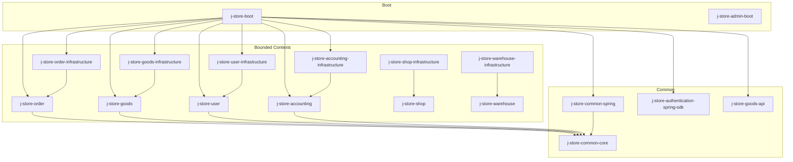
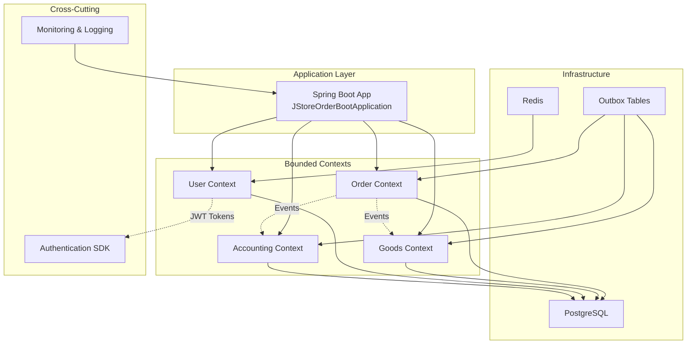
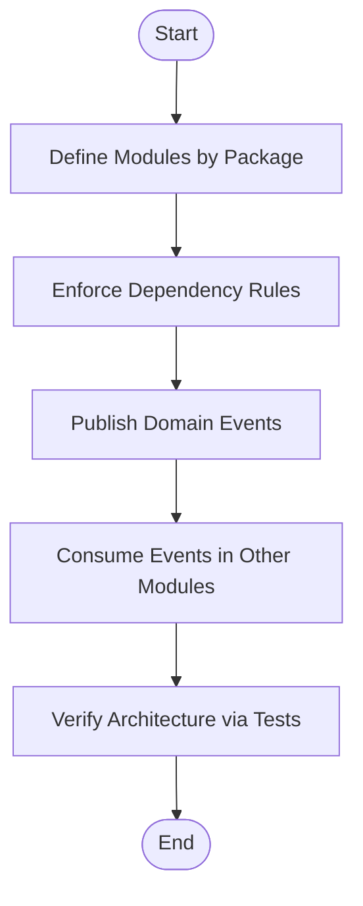
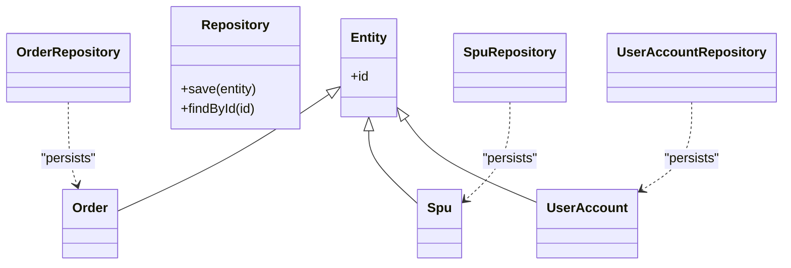
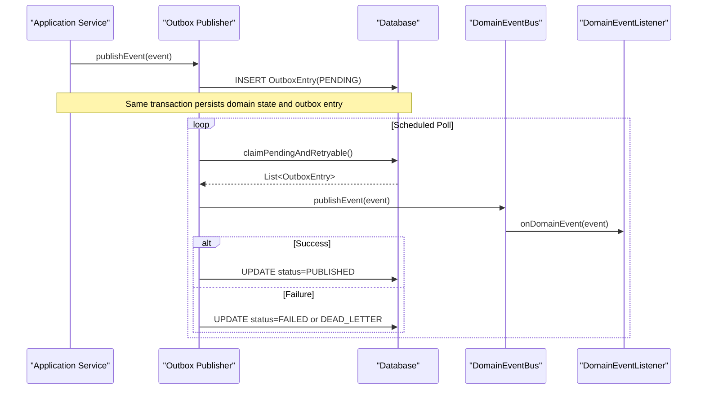
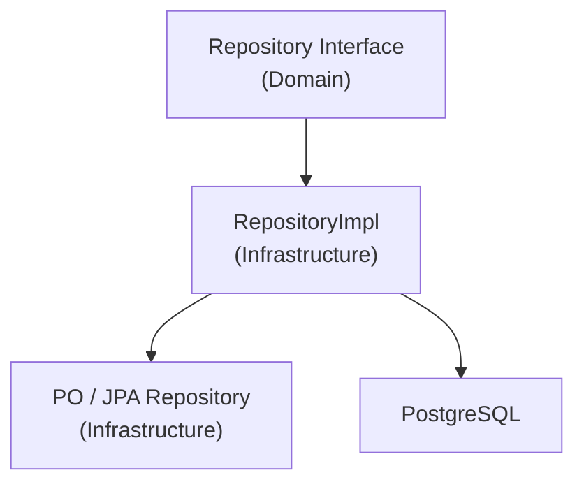
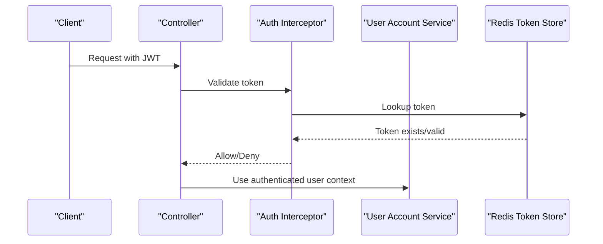
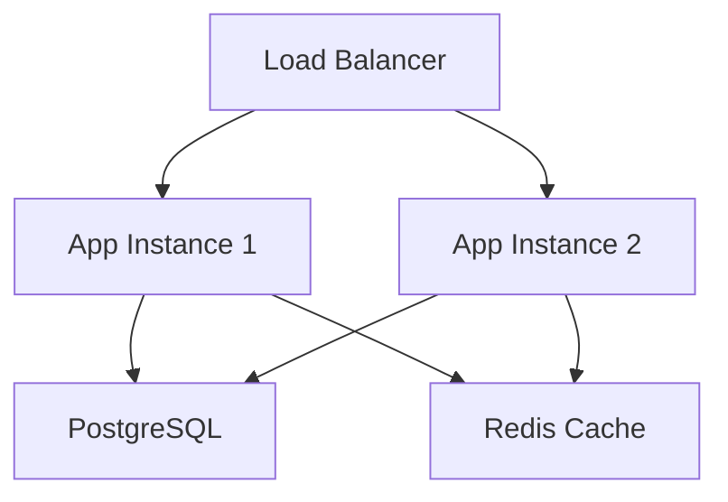
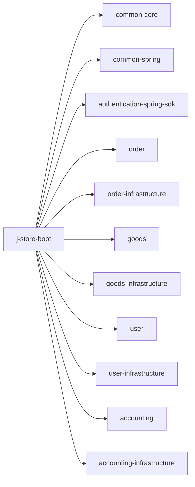

# Architecture and Design

<cite>
**Referenced Files in This Document**
- [README.md](file://README.md)
- [settings.gradle.kts](file://settings.gradle.kts)
- [build.gradle.kts](file://build.gradle.kts)
- [libs.versions.toml](file://gradle/libs.versions.toml)
- [project-overview.md](file://docs/project-overview.md)
- [ddd-guidelines.md](file://docs/steering/ddd-guidelines.md)
- [Spring-Modulith完全指南.md](file://docs/Spring-Modulith完全指南.md)
- [Spring-Modulith快速入门.md](file://docs/Spring-Modulith快速入门.md)
- [领域事件基础设施架构.md](file://docs/technic/领域事件基础设施架构.md)
- [JStoreOrderBootApplication.kt](file://j-store-boot/src/main/kotlin/JStoreOrderBootApplication.kt)
- [Entity.kt](file://j-store-common-core/src/main/kotlin/com/jstore/common/framework/Entity.kt)
- [DomainEvent.kt](file://j-store-common-core/src/main/kotlin/com/jstore/common/framework/event/DomainEvent.kt)
- [OutboxPublisher.kt](file://j-store-common-spring/src/main/kotlin/com/jstore/common/framework/event/outbox/OutboxPublisher.kt)
</cite>

## Table of Contents
1. [Introduction](#introduction)
2. [Project Structure](#project-structure)
3. [Core Components](#core-components)
4. [Architecture Overview](#architecture-overview)
5. [Detailed Component Analysis](#detailed-component-analysis)
6. [Dependency Analysis](#dependency-analysis)
7. [Performance Considerations](#performance-considerations)
8. [Troubleshooting Guide](#troubleshooting-guide)
9. [Conclusion](#conclusion)
10. [Appendices](#appendices)

## Introduction
This document explains J-Store’s architectural design and principles as a modular monolith built with Kotlin and Spring Boot, following Domain-Driven Design (DDD) and event-driven communication. It covers module boundaries, data flows, integration patterns, technical decisions (Kotlin/Spring Boot, PostgreSQL, Redis, JWT), infrastructure requirements, scalability considerations, deployment topology, cross-cutting concerns (security, monitoring, error handling), and the outbox pattern for reliable event delivery along with repository abstraction.

## Project Structure
J-Store is organized as a Gradle multi-module project. Each bounded context is split into a domain/application module and an infrastructure module, plus shared common modules and boot modules that assemble runtime components. The root settings file enumerates all modules, while versioning and dependencies are centralized in a version catalog.

**Diagram sources**
- [settings.gradle.kts:10-27](file://settings.gradle.kts#L10-L27)

**Section sources**
- [settings.gradle.kts:1-28](file://settings.gradle.kts#L1-L28)
- [build.gradle.kts:1-28](file://build.gradle.kts#L1-L28)
- [libs.versions.toml:1-110](file://gradle/libs.versions.toml#L1-L110)
- [project-overview.md:16-35](file://docs/project-overview.md#L16-L35)

## Core Components
- Common core abstractions: base entity interfaces, repository contracts, result types, and domain event markers.
- Spring-integrated event bus and outbox infrastructure: serialization, publishing, polling, retry, dead-letter handling, and consumption tracking.
- Bounded contexts: order, goods, user, accounting, shop, warehouse; each with domain/application layers and separate infrastructure implementations.
- Authentication SDK: Spring MVC interceptor, current user argument resolver, annotations, and auto-configuration.

Key implementation anchors:
- Base entity interface used across aggregates.
- Domain event envelope and metadata contract.
- Outbox publisher responsible for reliable delivery.

**Section sources**
- [Entity.kt:1-5](file://j-store-common-core/src/main/kotlin/com/jstore/common/framework/Entity.kt#L1-L5)
- [DomainEvent.kt:1-74](file://j-store-common-core/src/main/kotlin/com/jstore/common/framework/event/DomainEvent.kt#L1-L74)
- [OutboxPublisher.kt:1-138](file://j-store-common-spring/src/main/kotlin/com/jstore/common/framework/event/outbox/OutboxPublisher.kt#L1-L138)
- [project-overview.md:36-44](file://docs/project-overview.md#L36-L44)

## Architecture Overview
J-Store follows a modular monolith architecture using Spring Modulith concepts to enforce module boundaries and encourage event-driven decoupling. DDD is applied per bounded context with clear separation between domain/application and infrastructure layers. Cross-context interactions occur via domain events and ACL adapters.

**Diagram sources**
- [JStoreOrderBootApplication.kt:1-22](file://j-store-boot/src/main/kotlin/JStoreOrderBootApplication.kt#L1-L22)
- [libs.versions.toml:35-46](file://gradle/libs.versions.toml#L35-L46)
- [README.md:34-53](file://README.md#L34-L53)

**Section sources**
- [project-overview.md:46-75](file://docs/project-overview.md#L46-L75)
- [Spring-Modulith完全指南.md:1-120](file://docs/Spring-Modulith完全指南.md#L1-L120)
- [Spring-Modulith快速入门.md:1-64](file://docs/Spring-Modulith快速入门.md#L1-L64)

## Detailed Component Analysis

### Modular Monolith with Spring Modulith Principles
- Module boundaries are enforced by package structure and dependency rules.
- Events enable asynchronous, decoupled communication between modules.
- Optional explicit module marking and verification can be added to strengthen constraints.

[No sources needed since this diagram shows conceptual workflow, not actual code structure]

**Section sources**
- [Spring-Modulith完全指南.md:120-220](file://docs/Spring-Modulith完全指南.md#L120-L220)
- [Spring-Modulith快速入门.md:25-64](file://docs/Spring-Modulith快速入门.md#L25-L64)

### DDD Implementation and Bounded Contexts
- Each context has domain/application code and separate infrastructure.
- Aggregates implement base entity interfaces; repositories abstract persistence.
- Application services orchestrate use cases without business logic leakage.

**Diagram sources**
- [Entity.kt:1-5](file://j-store-common-core/src/main/kotlin/com/jstore/common/framework/Entity.kt#L1-L5)
- [ddd-guidelines.md:98-102](file://docs/steering/ddd-guidelines.md#L98-L102)

**Section sources**
- [ddd-guidelines.md:16-28](file://docs/steering/ddd-guidelines.md#L16-L28)
- [ddd-guidelines.md:59-102](file://docs/steering/ddd-guidelines.md#L59-L102)

### Event-Driven Communication and Outbox Pattern
- Domain events carry stable metadata for idempotent consumption.
- Outbox ensures reliable delivery by persisting events within the same transaction as domain state changes.
- A background publisher polls pending entries, deserializes, publishes to the event bus, and updates status with retry/dead-letter handling.

**Diagram sources**
- [DomainEvent.kt:1-74](file://j-store-common-core/src/main/kotlin/com/jstore/common/framework/event/DomainEvent.kt#L1-L74)
- [OutboxPublisher.kt:29-116](file://j-store-common-spring/src/main/kotlin/com/jstore/common/framework/event/outbox/OutboxPublisher.kt#L29-L116)
- [领域事件基础设施架构.md:89-134](file://docs/technic/领域事件基础设施架构.md#L89-L134)

**Section sources**
- [DomainEvent.kt:1-74](file://j-store-common-core/src/main/kotlin/com/jstore/common/framework/event/DomainEvent.kt#L1-L74)
- [OutboxPublisher.kt:1-138](file://j-store-common-spring/src/main/kotlin/com/jstore/common/framework/event/outbox/OutboxPublisher.kt#L1-L138)
- [领域事件基础设施架构.md:89-134](file://docs/technic/领域事件基础设施架构.md#L89-L134)

### Repository Pattern for Data Access Abstraction
- Repository interfaces live in domain modules; implementations reside in infrastructure modules.
- POs and JPA repositories are confined to infrastructure, keeping domain clean of framework details.

**Diagram sources**
- [ddd-guidelines.md:98-128](file://docs/steering/ddd-guidelines.md#L98-L128)

**Section sources**
- [ddd-guidelines.md:98-128](file://docs/steering/ddd-guidelines.md#L98-L128)

### Security and Authentication (JWT)
- Authentication SDK provides interceptors, argument resolvers, and annotations to enforce login requirements.
- JWT tokens are issued and stored via Redis-backed token store in the user infrastructure module.

**Diagram sources**
- [project-overview.md:27-29](file://docs/project-overview.md#L27-L29)
- [libs.versions.toml:89-93](file://gradle/libs.versions.toml#L89-L93)

**Section sources**
- [project-overview.md:27-29](file://docs/project-overview.md#L27-L29)
- [libs.versions.toml:89-93](file://gradle/libs.versions.toml#L89-L93)

### Infrastructure Requirements and Deployment Topology
- Local development uses Docker Compose for PostgreSQL and Redis.
- Production typically deploys a single Spring Boot process per instance with horizontal scaling behind a load balancer.
- Database migrations are managed via Flyway scripts under resources/db/migration.

**Diagram sources**
- [README.md:1-53](file://README.md#L1-L53)
- [project-overview.md:70-76](file://docs/project-overview.md#L70-L76)

**Section sources**
- [README.md:1-53](file://README.md#L1-L53)
- [project-overview.md:70-76](file://docs/project-overview.md#L70-L76)

## Dependency Analysis
The build configuration centralizes versions and dependencies. Spring Boot starters for Web, JPA, Redis, and testing are declared. Spring Modulith BOM and related libraries are available for future enforcement and documentation generation.

**Diagram sources**
- [settings.gradle.kts:10-27](file://settings.gradle.kts#L10-L27)
- [libs.versions.toml:28-46](file://gradle/libs.versions.toml#L28-L46)

**Section sources**
- [settings.gradle.kts:10-27](file://settings.gradle.kts#L10-L27)
- [libs.versions.toml:28-46](file://gradle/libs.versions.toml#L28-L46)

## Performance Considerations
- Use Redis for caching and token storage to reduce database pressure.
- Outbox batching and retry policies improve throughput and resilience.
- Keep transactions scoped to single aggregates to minimize contention.
- Prefer read models/projections for heavy queries when necessary.

[No sources needed since this section provides general guidance]

## Troubleshooting Guide
- Outbox failures: Check retry counts, lock ownership, and dead-letter entries. Inspect logs for error messages and last error fields.
- Event consumption idempotency: Ensure consumers handle duplicate deliveries gracefully using event IDs.
- Authentication issues: Validate JWT presence, expiration, and Redis token store consistency.
- Database connectivity: Confirm connection parameters and schema availability.

**Section sources**
- [OutboxPublisher.kt:69-116](file://j-store-common-spring/src/main/kotlin/com/jstore/common/framework/event/outbox/OutboxPublisher.kt#L69-L116)
- [README.md:34-53](file://README.md#L34-L53)

## Conclusion
J-Store adopts a modular monolith architecture grounded in DDD and event-driven design. Clear module boundaries, robust outbox-based reliability, and strong abstractions for persistence and authentication provide a solid foundation for growth. With Spring Modulith principles, the system remains maintainable and ready for incremental evolution toward microservices if needed.

[No sources needed since this section summarizes without analyzing specific files]

## Appendices
- Technical stack references: Kotlin, Spring Boot, PostgreSQL, Redis, JWT.
- Module layout and naming conventions follow DDD guidelines.
- Version management centralized in libs.versions.toml.

**Section sources**
- [project-overview.md:7-14](file://docs/project-overview.md#L7-L14)
- [libs.versions.toml:1-25](file://gradle/libs.versions.toml#L1-L25)