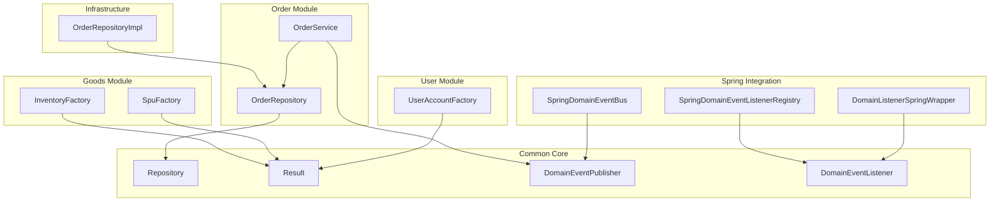
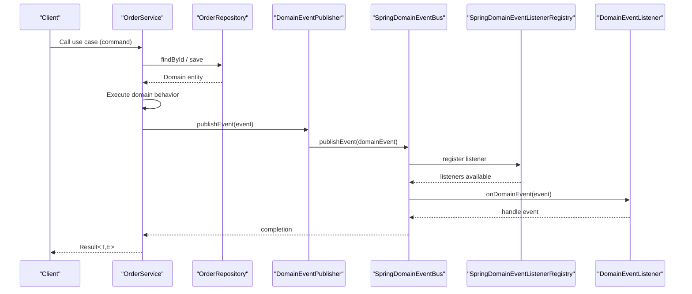
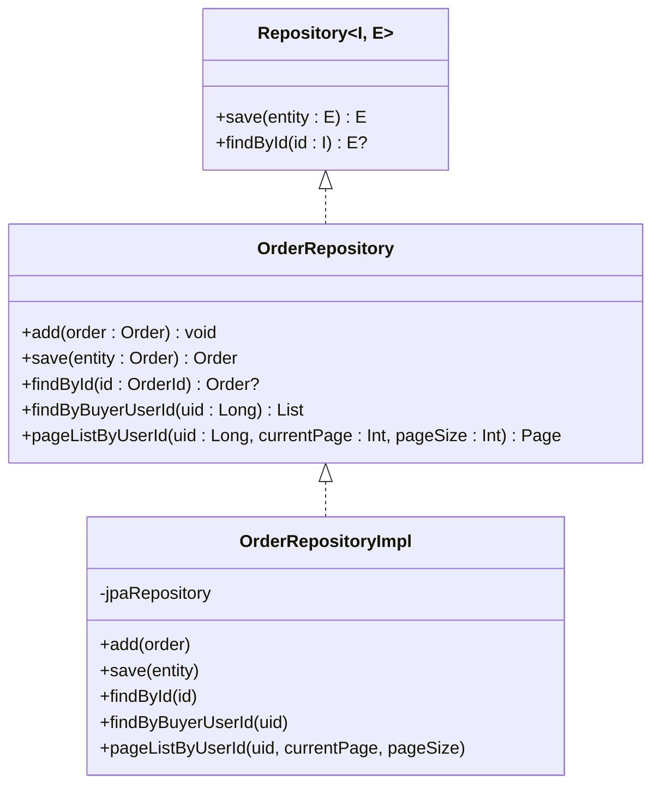
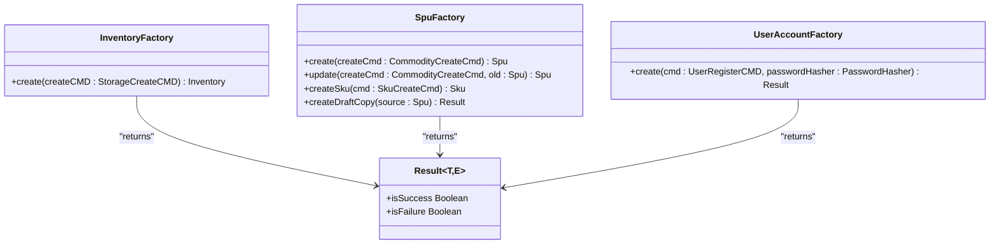
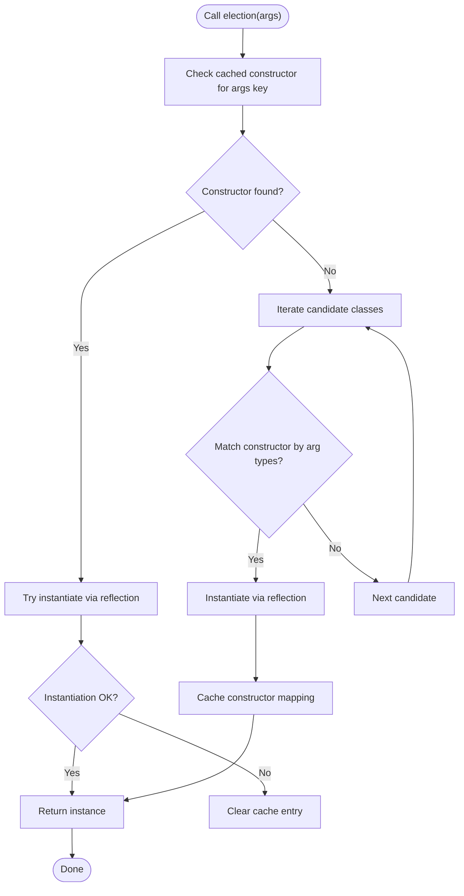
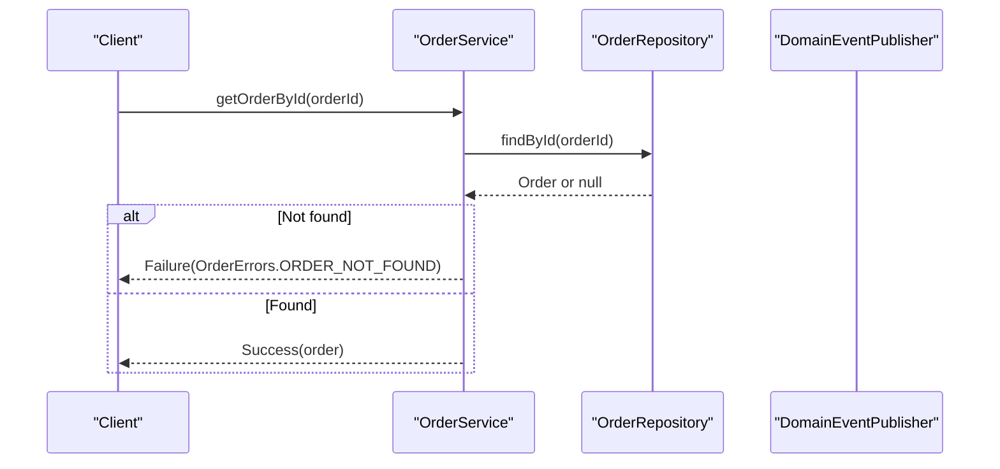
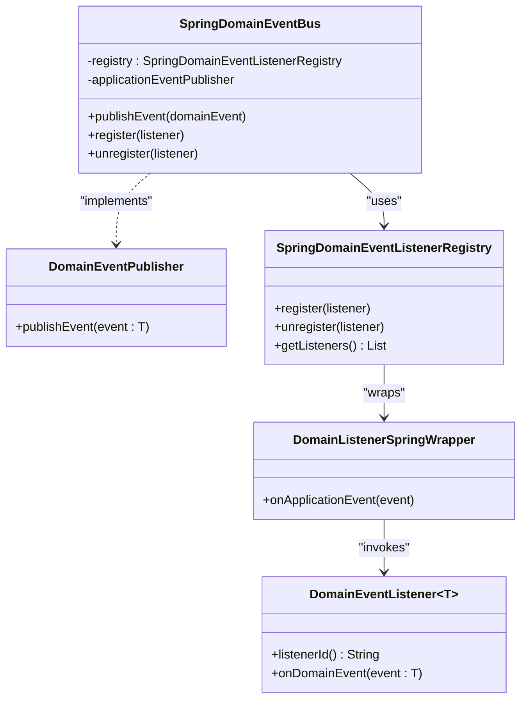
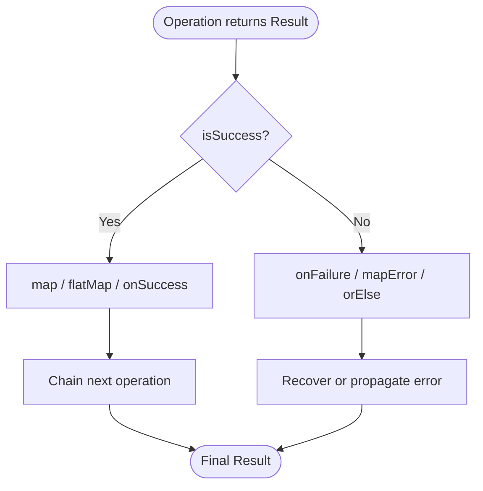
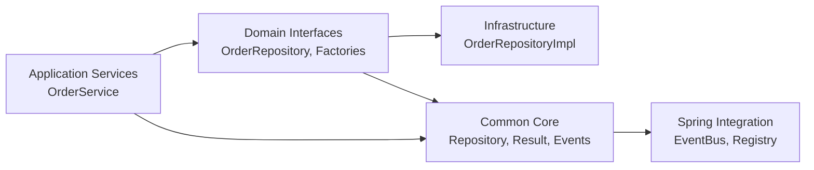

# Design Patterns and Implementation

<cite>
**Referenced Files in This Document**
- [Repository.kt](file://j-store-common-core/src/main/kotlin/com/jstore/common/framework/Repository.kt)
- [OrderRepository.kt](file://j-store-order/src/main/kotlin/com/jstore/order/domain/order/OrderRepository.kt)
- [OrderRepositoryImpl.kt](file://j-store-order-infrastructure/src/main/kotlin/com/jstore/order/domain/order/OrderRepositoryImpl.kt)
- [AbstractFactory.kt](file://j-store-common-core/src/main/kotlin/com/jstore/common/utils/AbstractFactory.kt)
- [InventoryFactory.kt](file://j-store-goods/src/main/kotlin/com/jstore/goods/domain/inventory/InventoryFactory.kt)
- [SpuFactory.kt](file://j-store-goods/src/main/kotlin/com/jstore/goods/domain/commodity/SpuFactory.kt)
- [UserAccountFactory.kt](file://j-store-user/src/main/kotlin/com/jstore/user/domain/useraccount/UserAccountFactory.kt)
- [DomainEventPublisher.kt](file://j-store-common-core/src/main/kotlin/com/jstore/common/framework/event/DomainEventPublisher.kt)
- [DomainEventListener.kt](file://j-store-common-core/src/main/kotlin/com/jstore/common/framework/event/DomainEventListener.kt)
- [SpringDomainEventBus.kt](file://j-store-common-spring/src/main/kotlin/com/jstore/common/framework/event/SpringDomainEventBus.kt)
- [SpringDomainEventListenerRegistry.kt](file://j-store-common-spring/src/main/kotlin/com/jstore/common/framework/event/SpringDomainEventListenerRegistry.kt)
- [DomainListenerSpringWrapper.kt](file://j-store-common-spring/src/main/kotlin/com/jstore/common/framework/event/DomainListenerSpringWrapper.kt)
- [Result.kt](file://j-store-common-core/src/main/kotlin/com/jstore/common/utils/Result.kt)
- [OrderService.kt](file://j-store-order/src/main/kotlin/com/jstore/order/service/OrderService.kt)
- [ddd-guidelines.md](file://docs/steering/ddd-guidelines.md)
</cite>

## Table of Contents
1. Introduction
2. Project Structure
3. Core Components
4. Architecture Overview
5. Detailed Component Analysis
6. Dependency Analysis
7. Performance Considerations
8. Troubleshooting Guide
9. Conclusion

## Introduction
This document explains the design patterns implemented across J-Store to achieve maintainable, testable, and scalable code. It focuses on:
- Repository pattern for data access abstraction
- Factory pattern for object creation
- Strategy pattern for interchangeable algorithms
- Command pattern usage in application services
- CQRS principles where applicable
- Observer pattern via domain event listeners
- Adapter pattern for external integrations
- Error handling using Result types and custom exception hierarchies

The patterns are consistently applied across modules such as Order, Goods, User, and Accounting, with common abstractions provided in j-store-common-core and Spring-specific implementations in j-store-common-spring.

## Project Structure
J-Store is a modular Kotlin project organized by bounded contexts (modules) and layers:
- Domain layer interfaces reside in each module’s domain package
- Infrastructure implementations live in *-infrastructure modules
- Common abstractions and utilities are in j-store-common-core
- Spring integrations are in j-store-common-spring
- Boot modules wire everything together

**Diagram sources**
- [Repository.kt:1-7](file://j-store-common-core/src/main/kotlin/com/jstore/common/framework/Repository.kt#L1-L7)
- [OrderRepository.kt:1-39](file://j-store-order/src/main/kotlin/com/jstore/order/domain/order/OrderRepository.kt#L1-L39)
- [OrderRepositoryImpl.kt:1-157](file://j-store-order-infrastructure/src/main/kotlin/com/jstore/order/domain/order/OrderRepositoryImpl.kt#L1-L157)
- [OrderService.kt:1-37](file://j-store-order/src/main/kotlin/com/jstore/order/service/OrderService.kt#L1-L37)
- [InventoryFactory.kt:1-15](file://j-store-goods/src/main/kotlin/com/jstore/goods/domain/inventory/InventoryFactory.kt#L1-L15)
- [SpuFactory.kt:1-76](file://j-store-goods/src/main/kotlin/com/jstore/goods/domain/commodity/SpuFactory.kt#L1-L76)
- [UserAccountFactory.kt:1-84](file://j-store-user/src/main/kotlin/com/jstore/user/domain/useraccount/UserAccountFactory.kt#L1-L84)
- [DomainEventPublisher.kt:1-12](file://j-store-common-core/src/main/kotlin/com/jstore/common/framework/event/DomainEventPublisher.kt#L1-L12)
- [DomainEventListener.kt:1-24](file://j-store-common-core/src/main/kotlin/com/jstore/common/framework/event/DomainEventListener.kt#L1-L24)
- [SpringDomainEventBus.kt:1-23](file://j-store-common-spring/src/main/kotlin/com/jstore/common/framework/event/SpringDomainEventBus.kt#L1-L23)
- [SpringDomainEventListenerRegistry.kt:1-36](file://j-store-common-spring/src/main/kotlin/com/jstore/common/framework/event/SpringDomainEventListenerRegistry.kt#L1-L36)
- [DomainListenerSpringWrapper.kt:1-30](file://j-store-common-spring/src/main/kotlin/com/jstore/common/framework/event/DomainListenerSpringWrapper.kt#L1-L30)

**Section sources**
- [ddd-guidelines.md:86-115](file://docs/steering/ddd-guidelines.md#L86-L115)

## Core Components
- Repository pattern: A generic repository interface abstracts persistence, with per-aggregate repositories extending it. Implementations map between domain objects and persistence models.
- Factory pattern: Factories encapsulate complex aggregate creation, validation, and initial state setup, returning Result to propagate errors.
- Strategy pattern: Interchangeable algorithm implementations are selected at runtime (e.g., AbstractFactory-based selection).
- Command pattern: Application services accept command-like inputs and orchestrate use cases without containing business rules.
- Observer pattern: Domain events are published and handled by registered listeners; Spring integration wires listeners into the application context.
- Adapter pattern: ACL-style adapters isolate external dependencies from domain logic.
- Error handling: Result<T,E> provides explicit success/failure paths with composable operations.

**Section sources**
- [Repository.kt:1-7](file://j-store-common-core/src/main/kotlin/com/jstore/common/framework/Repository.kt#L1-L7)
- [OrderRepository.kt:1-39](file://j-store-order/src/main/kotlin/com/jstore/order/domain/order/OrderRepository.kt#L1-L39)
- [OrderRepositoryImpl.kt:1-157](file://j-store-order-infrastructure/src/main/kotlin/com/jstore/order/domain/order/OrderRepositoryImpl.kt#L1-L157)
- [InventoryFactory.kt:1-15](file://j-store-goods/src/main/kotlin/com/jstore/goods/domain/inventory/InventoryFactory.kt#L1-L15)
- [SpuFactory.kt:1-76](file://j-store-goods/src/main/kotlin/com/jstore/goods/domain/commodity/SpuFactory.kt#L1-L76)
- [UserAccountFactory.kt:1-84](file://j-store-user/src/main/kotlin/com/jstore/user/domain/useraccount/UserAccountFactory.kt#L1-L84)
- [DomainEventPublisher.kt:1-12](file://j-store-common-core/src/main/kotlin/com/jstore/common/framework/event/DomainEventPublisher.kt#L1-L12)
- [DomainEventListener.kt:1-24](file://j-store-common-core/src/main/kotlin/com/jstore/common/framework/event/DomainEventListener.kt#L1-L24)
- [SpringDomainEventBus.kt:1-23](file://j-store-common-spring/src/main/kotlin/com/jstore/common/framework/event/SpringDomainEventBus.kt#L1-L23)
- [SpringDomainEventListenerRegistry.kt:1-36](file://j-store-common-spring/src/main/kotlin/com/jstore/common/framework/event/SpringDomainEventListenerRegistry.kt#L1-L36)
- [DomainListenerSpringWrapper.kt:1-30](file://j-store-common-spring/src/main/kotlin/com/jstore/common/framework/event/DomainListenerSpringWrapper.kt#L1-L30)
- [Result.kt:1-278](file://j-store-common-core/src/main/kotlin/com/jstore/common/utils/Result.kt#L1-L278)

## Architecture Overview
The system separates concerns through clear boundaries:
- Domain interfaces define contracts (repositories, factories, event bus)
- Infrastructure implements persistence and framework integrations
- Application services orchestrate flows using commands and results
- Events enable decoupled cross-cutting behaviors

**Diagram sources**
- [OrderService.kt:1-37](file://j-store-order/src/main/kotlin/com/jstore/order/service/OrderService.kt#L1-L37)
- [OrderRepository.kt:1-39](file://j-store-order/src/main/kotlin/com/jstore/order/domain/order/OrderRepository.kt#L1-L39)
- [DomainEventPublisher.kt:1-12](file://j-store-common-core/src/main/kotlin/com/jstore/common/framework/event/DomainEventPublisher.kt#L1-L12)
- [SpringDomainEventBus.kt:1-23](file://j-store-common-spring/src/main/kotlin/com/jstore/common/framework/event/SpringDomainEventBus.kt#L1-L23)
- [SpringDomainEventListenerRegistry.kt:1-36](file://j-store-common-spring/src/main/kotlin/com/jstore/common/framework/event/SpringDomainEventListenerRegistry.kt#L1-L36)
- [DomainEventListener.kt:1-24](file://j-store-common-core/src/main/kotlin/com/jstore/common/framework/event/DomainEventListener.kt#L1-L24)

## Detailed Component Analysis

### Repository Pattern
- Generic base Repository defines save and findById for any Identify/Entity pair.
- Aggregate-specific repositories extend the base and add domain-relevant queries.
- Infrastructure implementation maps domain entities to POs and back, isolating persistence details.

**Diagram sources**
- [Repository.kt:1-7](file://j-store-common-core/src/main/kotlin/com/jstore/common/framework/Repository.kt#L1-L7)
- [OrderRepository.kt:1-39](file://j-store-order/src/main/kotlin/com/jstore/order/domain/order/OrderRepository.kt#L1-L39)
- [OrderRepositoryImpl.kt:1-157](file://j-store-order-infrastructure/src/main/kotlin/com/jstore/order/domain/order/OrderRepositoryImpl.kt#L1-L157)

**Section sources**
- [Repository.kt:1-7](file://j-store-common-core/src/main/kotlin/com/jstore/common/framework/Repository.kt#L1-L7)
- [OrderRepository.kt:1-39](file://j-store-order/src/main/kotlin/com/jstore/order/domain/order/OrderRepository.kt#L1-L39)
- [OrderRepositoryImpl.kt:1-157](file://j-store-order-infrastructure/src/main/kotlin/com/jstore/order/domain/order/OrderRepositoryImpl.kt#L1-L157)

### Factory Pattern
- Factories encapsulate creation logic, validation, and initial state setup.
- They return Result to propagate business errors cleanly.
- Examples include InventoryFactory, SpuFactory, and UserAccountFactory.

**Diagram sources**
- [InventoryFactory.kt:1-15](file://j-store-goods/src/main/kotlin/com/jstore/goods/domain/inventory/InventoryFactory.kt#L1-L15)
- [SpuFactory.kt:1-76](file://j-store-goods/src/main/kotlin/com/jstore/goods/domain/commodity/SpuFactory.kt#L1-L76)
- [UserAccountFactory.kt:1-84](file://j-store-user/src/main/kotlin/com/jstore/user/domain/useraccount/UserAccountFactory.kt#L1-L84)
- [Result.kt:1-278](file://j-store-common-core/src/main/kotlin/com/jstore/common/utils/Result.kt#L1-L278)

**Section sources**
- [InventoryFactory.kt:1-15](file://j-store-goods/src/main/kotlin/com/jstore/goods/domain/inventory/InventoryFactory.kt#L1-L15)
- [SpuFactory.kt:1-76](file://j-store-goods/src/main/kotlin/com/jstore/goods/domain/commodity/SpuFactory.kt#L1-L76)
- [UserAccountFactory.kt:1-84](file://j-store-user/src/main/kotlin/com/jstore/user/domain/useraccount/UserAccountFactory.kt#L1-L84)

### Strategy Pattern
- AbstractFactory enables runtime selection among candidate implementations based on constructor arguments.
- This supports pluggable strategies without changing client code.

**Diagram sources**
- [AbstractFactory.kt:1-32](file://j-store-common-core/src/main/kotlin/com/jstore/common/utils/AbstractFactory.kt#L1-L32)

**Section sources**
- [AbstractFactory.kt:1-32](file://j-store-common-core/src/main/kotlin/com/jstore/common/utils/AbstractFactory.kt#L1-L32)

### Command Pattern in Application Services
- Application services accept command-like parameters and orchestrate domain operations.
- They delegate business rules to domain objects and return Result for error propagation.

**Diagram sources**
- [OrderService.kt:1-37](file://j-store-order/src/main/kotlin/com/jstore/order/service/OrderService.kt#L1-L37)
- [OrderRepository.kt:1-39](file://j-store-order/src/main/kotlin/com/jstore/order/domain/order/OrderRepository.kt#L1-L39)
- [DomainEventPublisher.kt:1-12](file://j-store-common-core/src/main/kotlin/com/jstore/common/framework/event/DomainEventPublisher.kt#L1-L12)

**Section sources**
- [OrderService.kt:1-37](file://j-store-order/src/main/kotlin/com/jstore/order/service/OrderService.kt#L1-L37)

### CQRS Principles
- Commands drive state changes through application services that load aggregates, execute domain methods, and persist changes.
- Queries retrieve state via repository methods without side effects.
- Events decouple read-side updates and cross-module interactions.

[No sources needed since this section summarizes conceptual CQRS usage aligned with existing files]

### Observer Pattern via Event Listeners
- DomainEventPublisher publishes events; SpringDomainEventBus delegates to Spring’s ApplicationEventPublisher.
- SpringDomainEventListenerRegistry registers DomainEventListener instances wrapped by DomainListenerSpringWrapper.
- Idempotent consumption can be supported via DomainEventConsumptionRepository.

**Diagram sources**
- [DomainEventPublisher.kt:1-12](file://j-store-common-core/src/main/kotlin/com/jstore/common/framework/event/DomainEventPublisher.kt#L1-L12)
- [SpringDomainEventBus.kt:1-23](file://j-store-common-spring/src/main/kotlin/com/jstore/common/framework/event/SpringDomainEventBus.kt#L1-L23)
- [SpringDomainEventListenerRegistry.kt:1-36](file://j-store-common-spring/src/main/kotlin/com/jstore/common/framework/event/SpringDomainEventListenerRegistry.kt#L1-L36)
- [DomainListenerSpringWrapper.kt:1-30](file://j-store-common-spring/src/main/kotlin/com/jstore/common/framework/event/DomainListenerSpringWrapper.kt#L1-L30)
- [DomainEventListener.kt:1-24](file://j-store-common-core/src/main/kotlin/com/jstore/common/framework/event/DomainEventListener.kt#L1-L24)

**Section sources**
- [SpringDomainEventBus.kt:1-23](file://j-store-common-spring/src/main/kotlin/com/jstore/common/framework/event/SpringDomainEventBus.kt#L1-L23)
- [SpringDomainEventListenerRegistry.kt:1-36](file://j-store-common-spring/src/main/kotlin/com/jstore/common/framework/event/SpringDomainEventListenerRegistry.kt#L1-L36)
- [DomainListenerSpringWrapper.kt:1-30](file://j-store-common-spring/src/main/kotlin/com/jstore/common/framework/event/DomainListenerSpringWrapper.kt#L1-L30)
- [DomainEventListener.kt:1-24](file://j-store-common-core/src/main/kotlin/com/jstore/common/framework/event/DomainEventListener.kt#L1-L24)

### Adapter Pattern for External Integrations
- ACL-style adapters define domain-facing interfaces for external systems (e.g., goods, payment).
- Implementations in infrastructure modules provide concrete integrations while keeping domain pure.

[No sources needed since this section describes the established ACL pattern used across modules]

### Error Handling with Result Types
- Result<T,E> provides explicit success/failure semantics with composable operations like map, flatMap, orElse, and fold.
- Application services and factories return Result to avoid exceptions for expected failures.
- Custom exception hierarchy includes ResultUnwrapException for misuse of unwrap operations.

**Diagram sources**
- [Result.kt:1-278](file://j-store-common-core/src/main/kotlin/com/jstore/common/utils/Result.kt#L1-L278)

**Section sources**
- [Result.kt:1-278](file://j-store-common-core/src/main/kotlin/com/jstore/common/utils/Result.kt#L1-L278)

## Dependency Analysis
- Domain modules depend only on common abstractions (Repository, Result, EventPublisher).
- Infrastructure modules implement domain interfaces and depend on persistence frameworks.
- Spring integration modules depend on Spring APIs to wire event listeners and buses.
- Application services coordinate domain and infrastructure without leaking framework details.

**Diagram sources**
- [OrderRepository.kt:1-39](file://j-store-order/src/main/kotlin/com/jstore/order/domain/order/OrderRepository.kt#L1-L39)
- [OrderRepositoryImpl.kt:1-157](file://j-store-order-infrastructure/src/main/kotlin/com/jstore/order/domain/order/OrderRepositoryImpl.kt#L1-L157)
- [Repository.kt:1-7](file://j-store-common-core/src/main/kotlin/com/jstore/common/framework/Repository.kt#L1-L7)
- [Result.kt:1-278](file://j-store-common-core/src/main/kotlin/com/jstore/common/utils/Result.kt#L1-L278)
- [SpringDomainEventBus.kt:1-23](file://j-store-common-spring/src/main/kotlin/com/jstore/common/framework/event/SpringDomainEventBus.kt#L1-L23)
- [OrderService.kt:1-37](file://j-store-order/src/main/kotlin/com/jstore/order/service/OrderService.kt#L1-L37)

**Section sources**
- [ddd-guidelines.md:86-115](file://docs/steering/ddd-guidelines.md#L86-L115)

## Performance Considerations
- Repository implementations should minimize object conversions and leverage efficient pagination/sorting.
- Event publishing should be asynchronous where appropriate to avoid blocking request threads.
- Factory instantiation caching (as in AbstractFactory) reduces reflection overhead.
- Use Result combinators to avoid unnecessary branching and exception handling costs.

[No sources needed since this section provides general guidance]

## Troubleshooting Guide
- If domain events are not dispatched, verify DomainEventPublisher wiring and Spring registration of listeners.
- For Result misuse, check for getOrThrow or expect calls on Failure values; these throw ResultUnwrapException.
- When repository mappings fail, inspect Converter methods in infrastructure implementations.
- Ensure factory validations pass before creating aggregates; validate inputs early and return Failure with descriptive errors.

**Section sources**
- [Result.kt:1-278](file://j-store-common-core/src/main/kotlin/com/jstore/common/utils/Result.kt#L1-L278)
- [OrderRepositoryImpl.kt:1-157](file://j-store-order-infrastructure/src/main/kotlin/com/jstore/order/domain/order/OrderRepositoryImpl.kt#L1-L157)
- [SpringDomainEventListenerRegistry.kt:1-36](file://j-store-common-spring/src/main/kotlin/com/jstore/common/framework/event/SpringDomainEventListenerRegistry.kt#L1-L36)

## Conclusion
J-Store consistently applies well-known design patterns to create clean, testable, and extensible architecture:
- Repository abstracts persistence behind domain-friendly interfaces
- Factories centralize creation logic and validation
- Strategy enables pluggable algorithms
- Command-driven application services orchestrate use cases
- CQRS principles separate reads and writes, with events enabling decoupling
- Observer pattern via domain events supports cross-cutting behaviors
- Adapter pattern isolates external integrations
- Result types standardize error handling

These patterns work together to ensure modularity, clarity, and resilience across the system.