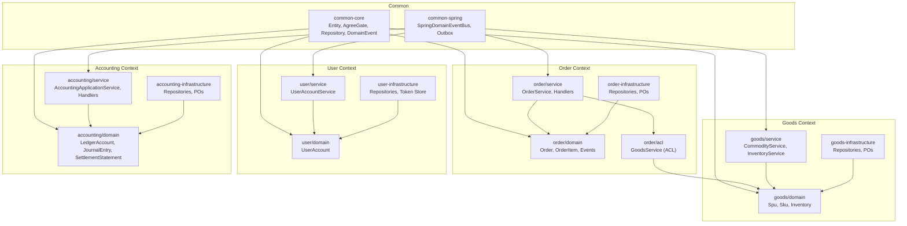
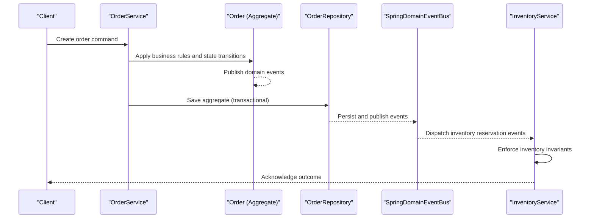
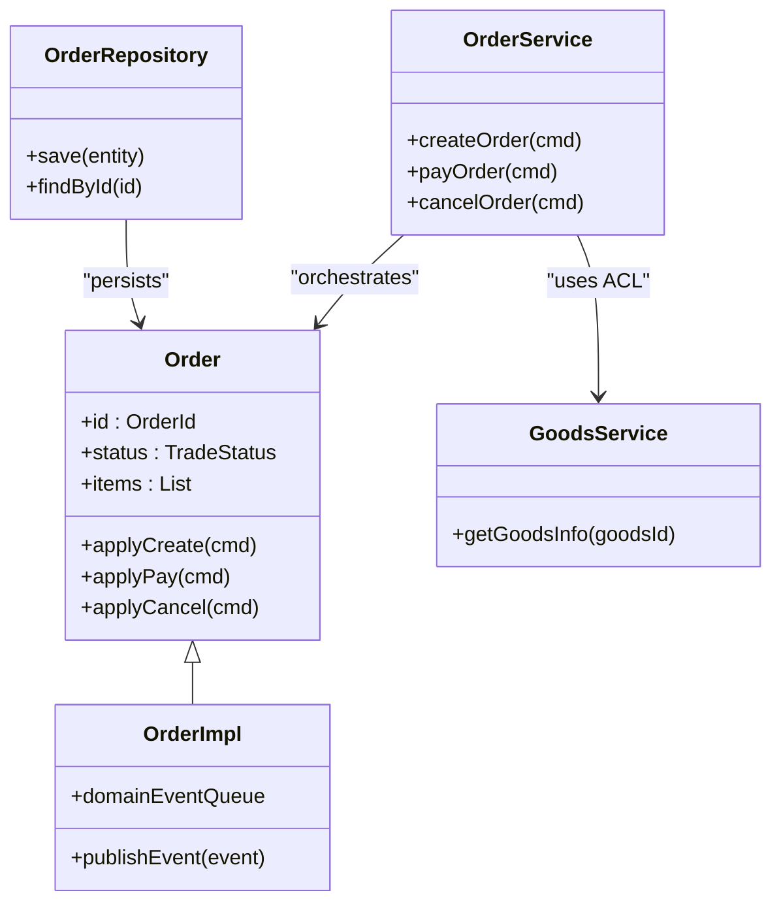
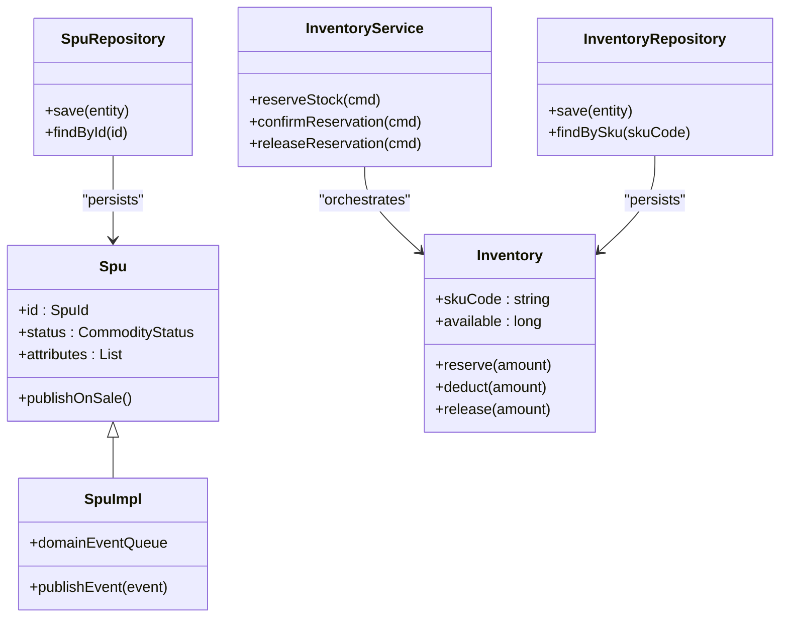
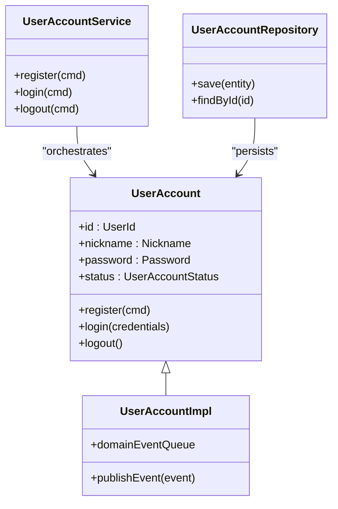
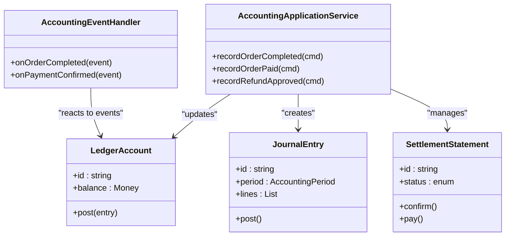
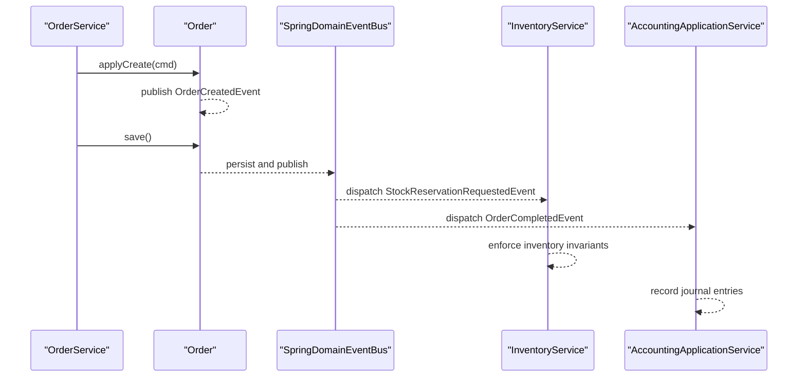
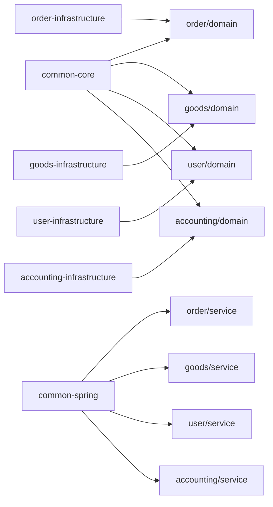

# Domain-Driven Design Principles

<cite>
**Referenced Files in This Document**
- [README.md](file://README.md)
- [ddd-guidelines.md](file://docs/steering/ddd-guidelines.md)
- [Order.kt](file://j-store-order/src/main/kotlin/com/jstore/order/domain/order/Order.kt)
- [OrderImpl.kt](file://j-store-order/src/main/kotlin/com/jstore/order/domain/order/OrderImpl.kt)
- [OrderRepository.kt](file://j-store-order/src/main/kotlin/com/jstore/order/domain/order/OrderRepository.kt)
- [OrderDomainEvent.kt](file://j-store-order/src/main/kotlin/com/jstore/order/domain/order/event/OrderDomainEvent.kt)
- [OrderService.kt](file://j-store-order/src/main/kotlin/com/jstore/order/service/OrderService.kt)
- [OrderStockEventHandler.kt](file://j-store-order/src/main/kotlin/com/jstore/order/service/OrderStockEventHandler.kt)
- [GoodsService.kt](file://j-store-order/src/main/kotlin/com/jstore/order/acl/GoodsService.kt)
- [Spu.kt](file://j-store-goods/src/main/kotlin/com/jstore/goods/domain/commodity/Spu.kt)
- [SpuImpl.kt](file://j-store-goods/src/main/kotlin/com/jstore/goods/domain/commodity/SpuImpl.kt)
- [SpuRepository.kt](file://j-store-goods/src/main/kotlin/com/jstore/goods/domain/commodity/SpuRepository.kt)
- [Inventory.kt](file://j-store-goods/src/main/kotlin/com/jstore/goods/domain/inventory/Inventory.kt)
- [InventoryRepository.kt](file://j-store-goods/src/main/kotlin/com/jstore/goods/domain/inventory/InventoryRepository.kt)
- [InventoryDomainEvent.kt](file://j-store-goods/src/main/kotlin/com/jstore/goods/domain/inventory/event/InventoryDomainEvent.kt)
- [InventoryService.kt](file://j-store-goods/src/main/kotlin/com/jstore/goods/service/InventoryService.kt)
- [UserAccount.kt](file://j-store-user/src/main/kotlin/com/jstore/user/domain/useraccount/UserAccount.kt)
- [UserAccountImpl.kt](file://j-store-user/src/main/kotlin/com/jstore/user/domain/useraccount/UserAccountImpl.kt)
- [UserAccountRepository.kt](file://j-store-user/src/main/kotlin/com/jstore/user/domain/useraccount/UserAccountRepository.kt)
- [UserAccountService.kt](file://j-store-user/src/main/kotlin/com/jstore/user/service/UserAccountService.kt)
- [LedgerAccount.kt](file://j-store-accounting/src/main/kotlin/com/jstore/accounting/domain/account/LedgerAccount.kt)
- [JournalEntry.kt](file://j-store-accounting/src/main/kotlin/com/jstore/accounting/domain/journal/JournalEntry.kt)
- [SettlementStatement.kt](file://j-store-accounting/src/main/kotlin/com/jstore/accounting/domain/settlement/SettlementStatement.kt)
- [AccountingApplicationService.kt](file://j-store-accounting/src/main/kotlin/com/jstore/accounting/service/AccountingApplicationService.kt)
- [AccountingEventHandler.kt](file://j-store-accounting/src/main/kotlin/com/jstore/accounting/service/AccountingEventHandler.kt)
- [Entity.kt](file://j-store-common-core/src/main/kotlin/com/jstore/common/framework/Entity.kt)
- [AgreeGate.kt](file://j-store-common-core/src/main/kotlin/com/jstore/common/framework/AgreeGate.kt)
- [Repository.kt](file://j-store-common-core/src/main/kotlin/com/jstore/common/framework/Repository.kt)
- [DomainEvent.kt](file://j-store-common-core/src/main/kotlin/com/jstore/common/framework/event/DomainEvent.kt)
- [SpringDomainEventBus.kt](file://j-store-common-spring/src/main/kotlin/com/jstore/common/framework/event/SpringDomainEventBus.kt)
</cite>

## Table of Contents
1. Introduction
2. Project Structure
3. Core Components
4. Architecture Overview
5. Detailed Component Analysis
6. Dependency Analysis
7. Performance Considerations
8. Troubleshooting Guide
9. Conclusion

## Introduction
This document explains how Domain-Driven Design is implemented across J-Store’s bounded contexts: Order, Goods, User, and Accounting. It covers aggregate design patterns with rich domain models, value objects, entities, repository pattern usage for data access abstraction, domain events, business rules enforcement, and invariant protection. It also clarifies cross-context communication through domain events and the separation of concerns between modules.

## Project Structure
J-Store follows a modular DDD layout where each bounded context is split into a domain module and an infrastructure module. Shared framework types live in common modules. The dependency direction is boot → infrastructure → domain → common-core. Domain modules must not depend on infrastructure or boot modules.

**Diagram sources**
- [ddd-guidelines.md:16-28](file://docs/steering/ddd-guidelines.md#L16-L28)
- [Entity.kt:1-200](file://j-store-common-core/src/main/kotlin/com/jstore/common/framework/Entity.kt#L1-L200)
- [AgreeGate.kt:1-200](file://j-store-common-core/src/main/kotlin/com/jstore/common/framework/AgreeGate.kt#L1-L200)
- [Repository.kt:1-200](file://j-store-common-core/src/main/kotlin/com/jstore/common/framework/Repository.kt#L1-L200)
- [DomainEvent.kt:1-200](file://j-store-common-core/src/main/kotlin/com/jstore/common/framework/event/DomainEvent.kt#L1-L200)
- [SpringDomainEventBus.kt:1-200](file://j-store-common-spring/src/main/kotlin/com/jstore/common/framework/event/SpringDomainEventBus.kt#L1-L200)

**Section sources**
- [ddd-guidelines.md:16-28](file://docs/steering/ddd-guidelines.md#L16-L28)

## Core Components
- Aggregate roots and entities implement base interfaces from common-core to enforce identity, event publishing, and repository contracts.
- Value objects encapsulate validation and immutability for domain concepts such as IDs, prices, and addresses.
- Repositories are defined in domain modules and implemented in infrastructure modules, keeping persistence details out of the domain.
- Application services orchestrate use cases without containing business rules; they load aggregates, invoke domain behavior, and persist changes.
- Domain events model state transitions and enable cross-aggregate and cross-context communication.

Key base types used throughout:
- Entity and AgreeGate define identity and event publishing capabilities.
- Repository defines save and findById operations for aggregates.
- DomainEvent marks event types for consistent handling.

**Section sources**
- [Entity.kt:1-200](file://j-store-common-core/src/main/kotlin/com/jstore/common/framework/Entity.kt#L1-L200)
- [AgreeGate.kt:1-200](file://j-store-common-core/src/main/kotlin/com/jstore/common/framework/AgreeGate.kt#L1-L200)
- [Repository.kt:1-200](file://j-store-common-core/src/main/kotlin/com/jstore/common/framework/Repository.kt#L1-L200)
- [DomainEvent.kt:1-200](file://j-store-common-core/src/main/kotlin/com/jstore/common/framework/event/DomainEvent.kt#L1-L200)
- [ddd-guidelines.md:59-84](file://docs/steering/ddd-guidelines.md#L59-L84)

## Architecture Overview
The system uses bounded contexts with clear boundaries. Cross-context interactions occur via domain events published by aggregates and consumed by application services or handlers. Anti-corruption layers isolate external models and convert them to local domain models.

**Diagram sources**
- [OrderService.kt:1-200](file://j-store-order/src/main/kotlin/com/jstore/order/service/OrderService.kt#L1-L200)
- [Order.kt:1-200](file://j-store-order/src/main/kotlin/com/jstore/order/domain/order/Order.kt#L1-L200)
- [OrderImpl.kt:1-200](file://j-store-order/src/main/kotlin/com/jstore/order/domain/order/OrderImpl.kt#L1-L200)
- [OrderRepository.kt:1-200](file://j-store-order/src/main/kotlin/com/jstore/order/domain/order/OrderRepository.kt#L1-L200)
- [SpringDomainEventBus.kt:1-200](file://j-store-common-spring/src/main/kotlin/com/jstore/common/framework/event/SpringDomainEventBus.kt#L1-L200)
- [InventoryService.kt:1-200](file://j-store-goods/src/main/kotlin/com/jstore/goods/service/InventoryService.kt#L1-L200)

## Detailed Component Analysis

### Order Bounded Context
The Order context manages order lifecycle and enforces trade, payment, and fulfillment invariants within the Order aggregate. It references Goods via an ACL interface and coordinates inventory through domain events.

- Aggregate root and implementation:
  - Order and OrderImpl encapsulate order state and behavior, including status transitions and item management.
- Repository:
  - OrderRepository defines persistence contract; implementations reside in infrastructure.
- Application service:
  - OrderService orchestrates commands, invokes domain logic, and persists changes.
- Domain events:
  - OrderDomainEvent contains order-related events that trigger downstream processes like inventory reservation and accounting recording.
- ACL:
  - GoodsService abstracts goods context access, converting external models to local domain models.

**Diagram sources**
- [Order.kt:1-200](file://j-store-order/src/main/kotlin/com/jstore/order/domain/order/Order.kt#L1-L200)
- [OrderImpl.kt:1-200](file://j-store-order/src/main/kotlin/com/jstore/order/domain/order/OrderImpl.kt#L1-L200)
- [OrderRepository.kt:1-200](file://j-store-order/src/main/kotlin/com/jstore/order/domain/order/OrderRepository.kt#L1-L200)
- [OrderService.kt:1-200](file://j-store-order/src/main/kotlin/com/jstore/order/service/OrderService.kt#L1-L200)
- [GoodsService.kt:1-200](file://j-store-order/src/main/kotlin/com/jstore/order/acl/GoodsService.kt#L1-L200)

**Section sources**
- [Order.kt:1-200](file://j-store-order/src/main/kotlin/com/jstore/order/domain/order/Order.kt#L1-L200)
- [OrderImpl.kt:1-200](file://j-store-order/src/main/kotlin/com/jstore/order/domain/order/OrderImpl.kt#L1-L200)
- [OrderRepository.kt:1-200](file://j-store-order/src/main/kotlin/com/jstore/order/domain/order/OrderRepository.kt#L1-L200)
- [OrderService.kt:1-200](file://j-store-order/src/main/kotlin/com/jstore/order/service/OrderService.kt#L1-L200)
- [OrderDomainEvent.kt:1-200](file://j-store-order/src/main/kotlin/com/jstore/order/domain/order/event/OrderDomainEvent.kt#L1-L200)
- [GoodsService.kt:1-200](file://j-store-order/src/main/kotlin/com/jstore/order/acl/GoodsService.kt#L1-L200)

### Goods Bounded Context
The Goods context manages product catalog (SPU/SKU) and inventory using a TCC-like reserve/deduct/release pattern. Aggregates include Spu and Inventory, with repositories defining persistence contracts.

- Commodity aggregate:
  - Spu and SpuImpl encapsulate product attributes, status transitions, and snapshotting.
- Inventory aggregate:
  - Inventory and InventoryRepository manage stock levels, reservations, and releases.
- Application services:
  - CommodityService and InventoryService orchestrate commands and handle domain events.
- Domain events:
  - InventoryDomainEvent includes events for reservation confirmation, deduction, and release.

**Diagram sources**
- [Spu.kt:1-200](file://j-store-goods/src/main/kotlin/com/jstore/goods/domain/commodity/Spu.kt#L1-L200)
- [SpuImpl.kt:1-200](file://j-store-goods/src/main/kotlin/com/jstore/goods/domain/commodity/SpuImpl.kt#L1-L200)
- [SpuRepository.kt:1-200](file://j-store-goods/src/main/kotlin/com/jstore/goods/domain/commodity/SpuRepository.kt#L1-L200)
- [Inventory.kt:1-200](file://j-store-goods/src/main/kotlin/com/jstore/goods/domain/inventory/Inventory.kt#L1-L200)
- [InventoryRepository.kt:1-200](file://j-store-goods/src/main/kotlin/com/jstore/goods/domain/inventory/InventoryRepository.kt#L1-L200)
- [InventoryService.kt:1-200](file://j-store-goods/src/main/kotlin/com/jstore/goods/service/InventoryService.kt#L1-L200)

**Section sources**
- [Spu.kt:1-200](file://j-store-goods/src/main/kotlin/com/jstore/goods/domain/commodity/Spu.kt#L1-L200)
- [SpuImpl.kt:1-200](file://j-store-goods/src/main/kotlin/com/jstore/goods/domain/commodity/SpuImpl.kt#L1-L200)
- [SpuRepository.kt:1-200](file://j-store-goods/src/main/kotlin/com/jstore/goods/domain/commodity/SpuRepository.kt#L1-L200)
- [Inventory.kt:1-200](file://j-store-goods/src/main/kotlin/com/jstore/goods/domain/inventory/Inventory.kt#L1-L200)
- [InventoryRepository.kt:1-200](file://j-store-goods/src/main/kotlin/com/jstore/goods/domain/inventory/InventoryRepository.kt#L1-L200)
- [InventoryDomainEvent.kt:1-200](file://j-store-goods/src/main/kotlin/com/jstore/goods/domain/inventory/event/InventoryDomainEvent.kt#L1-L200)
- [InventoryService.kt:1-200](file://j-store-goods/src/main/kotlin/com/jstore/goods/service/InventoryService.kt#L1-L200)

### User Bounded Context
The User context manages user accounts, authentication tokens, and status transitions. The UserAccount aggregate encapsulates password hashing, token generation, and login/logout flows.

- Aggregate root and implementation:
  - UserAccount and UserAccountImpl enforce account status transitions and security invariants.
- Repository:
  - UserAccountRepository defines persistence contract; implementations reside in infrastructure.
- Application service:
  - UserAccountService orchestrates registration, login, and logout commands.

**Diagram sources**
- [UserAccount.kt:1-200](file://j-store-user/src/main/kotlin/com/jstore/user/domain/useraccount/UserAccount.kt#L1-L200)
- [UserAccountImpl.kt:1-200](file://j-store-user/src/main/kotlin/com/jstore/user/domain/useraccount/UserAccountImpl.kt#L1-L200)
- [UserAccountRepository.kt:1-200](file://j-store-user/src/main/kotlin/com/jstore/user/domain/useraccount/UserAccountRepository.kt#L1-L200)
- [UserAccountService.kt:1-200](file://j-store-user/src/main/kotlin/com/jstore/user/service/UserAccountService.kt#L1-L200)

**Section sources**
- [UserAccount.kt:1-200](file://j-store-user/src/main/kotlin/com/jstore/user/domain/useraccount/UserAccount.kt#L1-L200)
- [UserAccountImpl.kt:1-200](file://j-store-user/src/main/kotlin/com/jstore/user/domain/useraccount/UserAccountImpl.kt#L1-L200)
- [UserAccountRepository.kt:1-200](file://j-store-user/src/main/kotlin/com/jstore/user/domain/useraccount/UserAccountRepository.kt#L1-L200)
- [UserAccountService.kt:1-200](file://j-store-user/src/main/kotlin/com/jstore/user/service/UserAccountService.kt#L1-L200)

### Accounting Bounded Context
The Accounting context records financial transactions using ledger accounts, journal entries, and settlement statements. It reacts to order and payment events to maintain accurate balances.

- Aggregates:
  - LedgerAccount tracks account balances and postings.
  - JournalEntry represents debits and credits with period constraints.
  - SettlementStatement captures settlement outcomes and payments.
- Application services:
  - AccountingApplicationService orchestrates recording of order completed, paid, and refund approved events.
  - AccountingEventHandler consumes domain events and updates accounting aggregates.

**Diagram sources**
- [LedgerAccount.kt:1-200](file://j-store-accounting/src/main/kotlin/com/jstore/accounting/domain/account/LedgerAccount.kt#L1-L200)
- [JournalEntry.kt:1-200](file://j-store-accounting/src/main/kotlin/com/jstore/accounting/domain/journal/JournalEntry.kt#L1-L200)
- [SettlementStatement.kt:1-200](file://j-store-accounting/src/main/kotlin/com/jstore/accounting/domain/settlement/SettlementStatement.kt#L1-L200)
- [AccountingApplicationService.kt:1-200](file://j-store-accounting/src/main/kotlin/com/jstore/accounting/service/AccountingApplicationService.kt#L1-L200)
- [AccountingEventHandler.kt:1-200](file://j-store-accounting/src/main/kotlin/com/jstore/accounting/service/AccountingEventHandler.kt#L1-L200)

**Section sources**
- [LedgerAccount.kt:1-200](file://j-store-accounting/src/main/kotlin/com/jstore/accounting/domain/account/LedgerAccount.kt#L1-L200)
- [JournalEntry.kt:1-200](file://j-store-accounting/src/main/kotlin/com/jstore/accounting/domain/journal/JournalEntry.kt#L1-L200)
- [SettlementStatement.kt:1-200](file://j-store-accounting/src/main/kotlin/com/jstore/accounting/domain/settlement/SettlementStatement.kt#L1-L200)
- [AccountingApplicationService.kt:1-200](file://j-store-accounting/src/main/kotlin/com/jstore/accounting/service/AccountingApplicationService.kt#L1-L200)
- [AccountingEventHandler.kt:1-200](file://j-store-accounting/src/main/kotlin/com/jstore/accounting/service/AccountingEventHandler.kt#L1-L200)

### Cross-Context Communication via Domain Events
Domain events bridge bounded contexts while preserving autonomy. For example, Order publishes events that trigger inventory reservation and accounting recording.

**Diagram sources**
- [OrderService.kt:1-200](file://j-store-order/src/main/kotlin/com/jstore/order/service/OrderService.kt#L1-L200)
- [OrderDomainEvent.kt:1-200](file://j-store-order/src/main/kotlin/com/jstore/order/domain/order/event/OrderDomainEvent.kt#L1-L200)
- [SpringDomainEventBus.kt:1-200](file://j-store-common-spring/src/main/kotlin/com/jstore/common/framework/event/SpringDomainEventBus.kt#L1-L200)
- [InventoryService.kt:1-200](file://j-store-goods/src/main/kotlin/com/jstore/goods/service/InventoryService.kt#L1-L200)
- [AccountingApplicationService.kt:1-200](file://j-store-accounting/src/main/kotlin/com/jstore/accounting/service/AccountingApplicationService.kt#L1-L200)

**Section sources**
- [OrderDomainEvent.kt:1-200](file://j-store-order/src/main/kotlin/com/jstore/order/domain/order/event/OrderDomainEvent.kt#L1-L200)
- [InventoryDomainEvent.kt:1-200](file://j-store-goods/src/main/kotlin/com/jstore/goods/domain/inventory/event/InventoryDomainEvent.kt#L1-L200)
- [SpringDomainEventBus.kt:1-200](file://j-store-common-spring/src/main/kotlin/com/jstore/common/framework/event/SpringDomainEventBus.kt#L1-L200)

## Dependency Analysis
Dependencies follow strict layering:
- Domain modules depend only on common-core.
- Infrastructure modules implement repository interfaces and persistence details.
- Boot modules wire controllers and configurations.
- Cross-context dependencies are mediated by ACL interfaces and domain events.

**Diagram sources**
- [ddd-guidelines.md:16-28](file://docs/steering/ddd-guidelines.md#L16-L28)
- [Entity.kt:1-200](file://j-store-common-core/src/main/kotlin/com/jstore/common/framework/Entity.kt#L1-L200)
- [AgreeGate.kt:1-200](file://j-store-common-core/src/main/kotlin/com/jstore/common/framework/AgreeGate.kt#L1-L200)
- [Repository.kt:1-200](file://j-store-common-core/src/main/kotlin/com/jstore/common/framework/Repository.kt#L1-L200)
- [DomainEvent.kt:1-200](file://j-store-common-core/src/main/kotlin/com/jstore/common/framework/event/DomainEvent.kt#L1-L200)
- [SpringDomainEventBus.kt:1-200](file://j-store-common-spring/src/main/kotlin/com/jstore/common/framework/event/SpringDomainEventBus.kt#L1-L200)

**Section sources**
- [ddd-guidelines.md:16-28](file://docs/steering/ddd-guidelines.md#L16-L28)

## Performance Considerations
- Keep aggregate boundaries small to reduce contention and improve concurrency.
- Use domain events for asynchronous side effects where appropriate to avoid blocking transactions.
- Prefer immutable value objects to simplify reasoning and reduce synchronization overhead.
- Implement repository methods efficiently, avoiding N+1 queries and unnecessary object conversions.
- Leverage outbox mechanisms for reliable event publishing and consumption.

[No sources needed since this section provides general guidance]

## Troubleshooting Guide
Common issues and resolutions:
- Anemic models: Ensure entities have behavior methods rather than being data-only classes.
- Cross-aggregate mutations: Avoid mutating multiple aggregates in one transaction; use domain events instead.
- Persistence leaks: Keep PO types out of domain layers; map only in infrastructure.
- Event consistency: Use outbox patterns to guarantee event delivery alongside aggregate persistence.
- Error handling: Use Result types for expected failures and define context-specific error constants.

**Section sources**
- [ddd-guidelines.md:130-145](file://docs/steering/ddd-guidelines.md#L130-L145)

## Conclusion
J-Store applies DDD principles consistently across bounded contexts. Aggregates encapsulate business rules and invariants, repositories abstract data access, and domain events enable decoupled cross-context communication. Clear separation of concerns and strict dependency directions ensure maintainability and scalability. Following the guidelines and patterns documented here will help preserve domain integrity and support future evolution.

[No sources needed since this section summarizes without analyzing specific files]