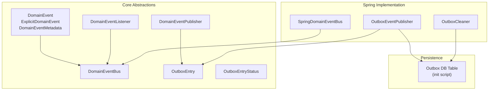
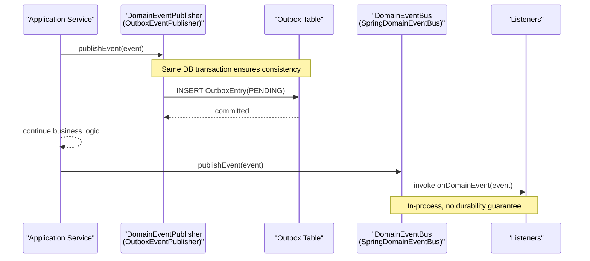
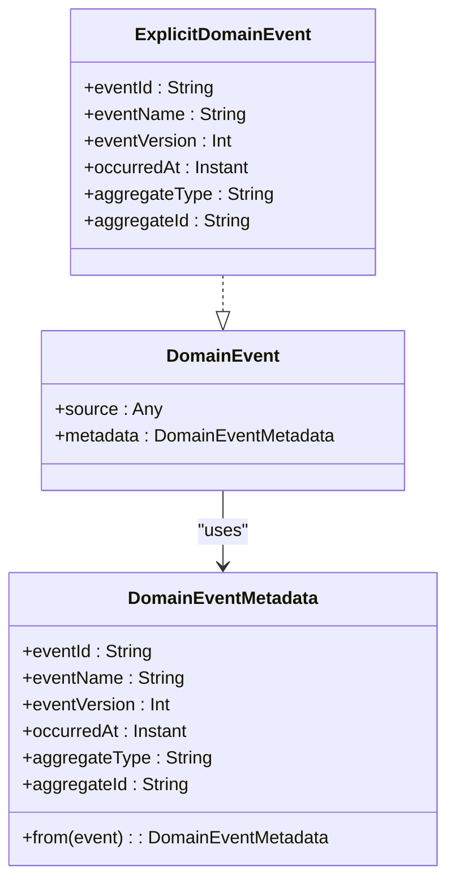
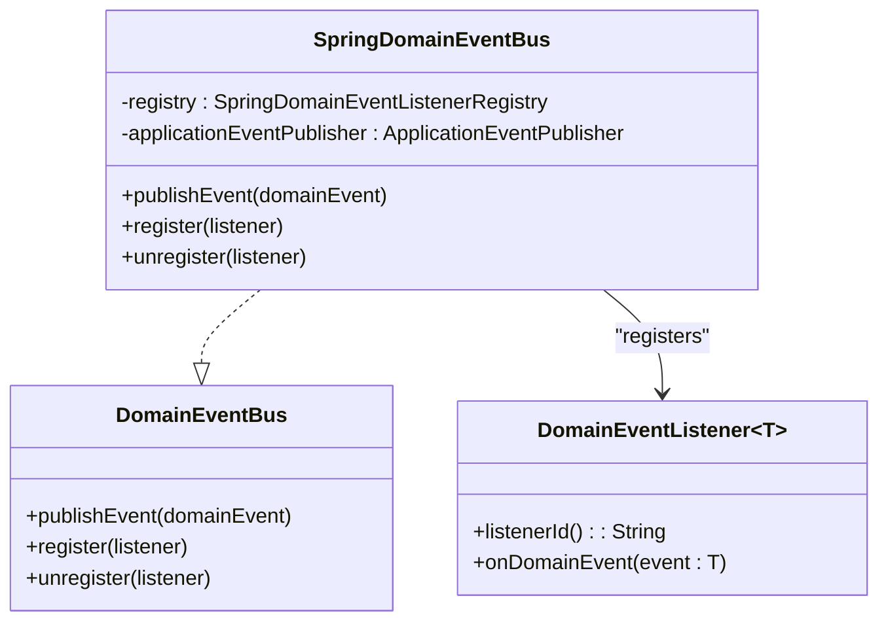
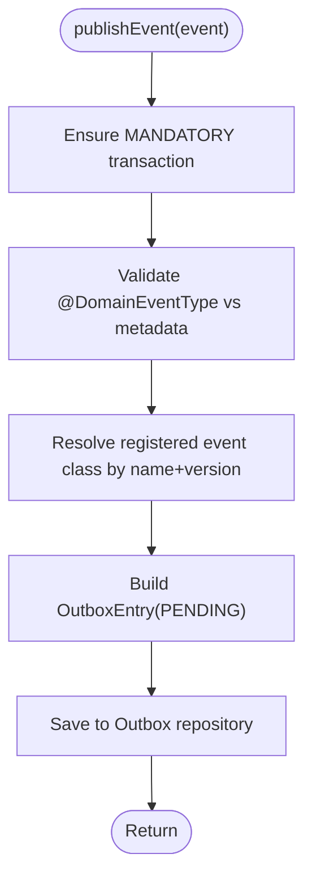
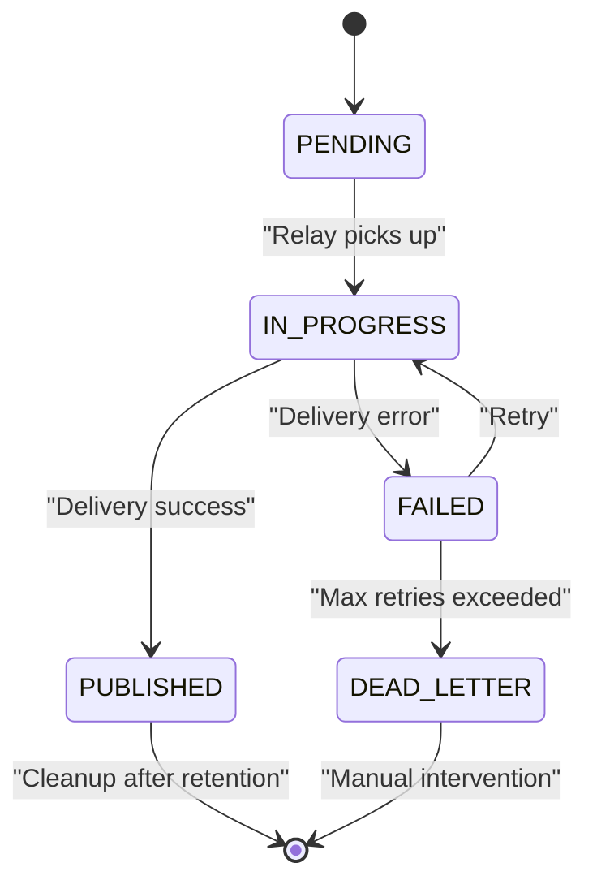
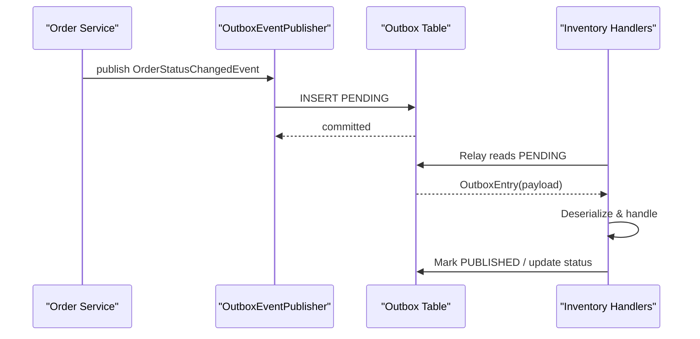
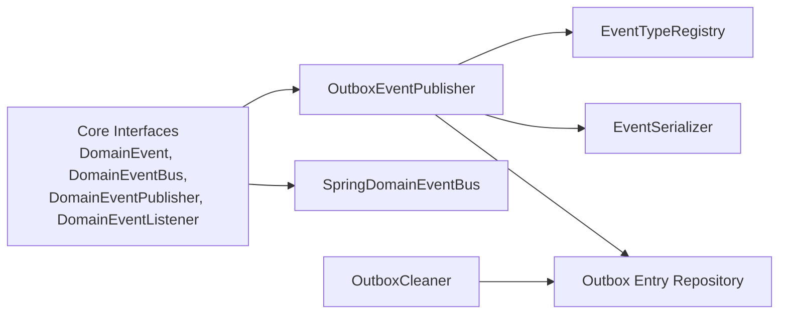

# Event-Driven Architecture

<cite>
**Referenced Files in This Document**
- [DomainEvent.kt](file://j-store-common-core/src/main/kotlin/com/jstore/common/framework/event/DomainEvent.kt)
- [DomainEventBus.kt](file://j-store-common-core/src/main/kotlin/com/jstore/common/framework/event/DomainEventBus.kt)
- [DomainEventListener.kt](file://j-store-common-core/src/main/kotlin/com/jstore/common/framework/event/DomainEventListener.kt)
- [DomainEventPublisher.kt](file://j-store-common-core/src/main/kotlin/com/jstore/common/framework/event/DomainEventPublisher.kt)
- [OutboxEntry.kt](file://j-store-common-core/src/main/kotlin/com/jstore/common/framework/event/outbox/OutboxEntry.kt)
- [OutboxEntryStatus.kt](file://j-store-common-core/src/main/kotlin/com/jstore/common/framework/event/outbox/OutboxEntryStatus.kt)
- [SpringDomainEventBus.kt](file://j-store-common-spring/src/main/kotlin/com/jstore/common/framework/event/SpringDomainEventBus.kt)
- [OutboxEventPublisher.kt](file://j-store-common-spring/src/main/kotlin/com/jstore/common/framework/event/outbox/OutboxEventPublisher.kt)
- [OutboxCleaner.kt](file://j-store-common-spring/src/main/kotlin/com/jstore/common/framework/event/outbox/OutboxCleaner.kt)
- [06-outbox-entry.sql](file://docker/postgres/init/06-outbox-entry.sql)
</cite>

## Table of Contents
1. Introduction
2. Project Structure
3. Core Components
4. Architecture Overview
5. Detailed Component Analysis
6. Dependency Analysis
7. Performance Considerations
8. Troubleshooting Guide
9. Conclusion

## Introduction
This document explains J-Store’s event-driven architecture with a focus on domain events, the event bus, reliable delivery via the transactional outbox pattern, and asynchronous processing across bounded contexts. It covers event design patterns, serialization and versioning, listener registration, error handling for failed deliveries, and how cross-context communication is achieved (for example, order status changes triggering inventory updates).

## Project Structure
J-Store separates core abstractions from Spring-specific implementations:
- Core abstractions live in j-store-common-core under com.jstore.common.framework.event and its outbox subpackage.
- Spring integrations live in j-store-common-spring under the same package namespace.
- Domain modules (order, goods/inventory, accounting, user) emit and consume events through these abstractions.

**Diagram sources**
- [DomainEvent.kt:1-74](file://j-store-common-core/src/main/kotlin/com/jstore/common/framework/event/DomainEvent.kt#L1-L74)
- [DomainEventBus.kt:1-14](file://j-store-common-core/src/main/kotlin/com/jstore/common/framework/event/DomainEventBus.kt#L1-L14)
- [DomainEventListener.kt:1-25](file://j-store-common-core/src/main/kotlin/com/jstore/common/framework/event/DomainEventListener.kt#L1-L25)
- [DomainEventPublisher.kt:1-12](file://j-store-common-core/src/main/kotlin/com/jstore/common/framework/event/DomainEventPublisher.kt#L1-L12)
- [OutboxEntry.kt:1-28](file://j-store-common-core/src/main/kotlin/com/jstore/common/framework/event/outbox/OutboxEntry.kt#L1-L28)
- [OutboxEntryStatus.kt:1-18](file://j-store-common-core/src/main/kotlin/com/jstore/common/framework/event/outbox/OutboxEntryStatus.kt#L1-L18)
- [SpringDomainEventBus.kt:1-24](file://j-store-common-spring/src/main/kotlin/com/jstore/common/framework/event/SpringDomainEventBus.kt#L1-L24)
- [OutboxEventPublisher.kt:1-60](file://j-store-common-spring/src/main/kotlin/com/jstore/common/framework/event/outbox/OutboxEventPublisher.kt#L1-L60)
- [OutboxCleaner.kt:1-28](file://j-store-common-spring/src/main/kotlin/com/jstore/common/framework/event/outbox/OutboxCleaner.kt#L1-L28)
- [06-outbox-entry.sql](file://docker/postgres/init/06-outbox-entry.sql)

**Section sources**
- [DomainEvent.kt:1-74](file://j-store-common-core/src/main/kotlin/com/jstore/common/framework/event/DomainEvent.kt#L1-L74)
- [DomainEventBus.kt:1-14](file://j-store-common-core/src/main/kotlin/com/jstore/common/framework/event/DomainEventBus.kt#L1-L14)
- [DomainEventListener.kt:1-25](file://j-store-common-core/src/main/kotlin/com/jstore/common/framework/event/DomainEventListener.kt#L1-L25)
- [DomainEventPublisher.kt:1-12](file://j-store-common-core/src/main/kotlin/com/jstore/common/framework/event/DomainEventPublisher.kt#L1-L12)
- [OutboxEntry.kt:1-28](file://j-store-common-core/src/main/kotlin/com/jstore/common/framework/event/outbox/OutboxEntry.kt#L1-L28)
- [OutboxEntryStatus.kt:1-18](file://j-store-common-core/src/main/kotlin/com/jstore/common/framework/event/outbox/OutboxEntryStatus.kt#L1-L18)
- [SpringDomainEventBus.kt:1-24](file://j-store-common-spring/src/main/kotlin/com/jstore/common/framework/event/SpringDomainEventBus.kt#L1-L24)
- [OutboxEventPublisher.kt:1-60](file://j-store-common-spring/src/main/kotlin/com/jstore/common/framework/event/outbox/OutboxEventPublisher.kt#L1-L60)
- [OutboxCleaner.kt:1-28](file://j-store-common-spring/src/main/kotlin/com/jstore/common/framework/event/outbox/OutboxCleaner.kt#L1-L28)
- [06-outbox-entry.sql](file://docker/postgres/init/06-outbox-entry.sql)

## Core Components
- DomainEvent and ExplicitDomainEvent define the shape of domain facts and their stable envelope metadata used for idempotency, routing, and diagnostics.
- DomainEventBus provides in-process event publishing and listener registration without transactional guarantees.
- DomainEventPublisher is the transactional publisher that writes to the outbox table within the business transaction.
- OutboxEntry models a pending event record; OutboxEntryStatus enumerates lifecycle states including PENDING, IN_PROGRESS, PUBLISHED, FAILED, and DEAD_LETTER.
- SpringDomainEventBus bridges to Spring’s ApplicationEventPublisher for in-process dispatch.
- OutboxEventPublisher serializes events and persists them as outbox entries with mandatory transaction semantics.
- OutboxCleaner periodically purges successfully published entries beyond retention while preserving dead-lettered items for inspection.

**Section sources**
- [DomainEvent.kt:1-74](file://j-store-common-core/src/main/kotlin/com/jstore/common/framework/event/DomainEvent.kt#L1-L74)
- [DomainEventBus.kt:1-14](file://j-store-common-core/src/main/kotlin/com/jstore/common/framework/event/DomainEventBus.kt#L1-L14)
- [DomainEventPublisher.kt:1-12](file://j-store-common-core/src/main/kotlin/com/jstore/common/framework/event/DomainEventPublisher.kt#L1-L12)
- [OutboxEntry.kt:1-28](file://j-store-common-core/src/main/kotlin/com/jstore/common/framework/event/outbox/OutboxEntry.kt#L1-L28)
- [OutboxEntryStatus.kt:1-18](file://j-store-common-core/src/main/kotlin/com/jstore/common/framework/event/outbox/OutboxEntryStatus.kt#L1-L18)
- [SpringDomainEventBus.kt:1-24](file://j-store-common-spring/src/main/kotlin/com/jstore/common/framework/event/SpringDomainEventBus.kt#L1-L24)
- [OutboxEventPublisher.kt:1-60](file://j-store-common-spring/src/main/kotlin/com/jstore/common/framework/event/outbox/OutboxEventPublisher.kt#L1-L60)
- [OutboxCleaner.kt:1-28](file://j-store-common-spring/src/main/kotlin/com/jstore/common/framework/event/outbox/OutboxCleaner.kt#L1-L28)

## Architecture Overview
The system uses two complementary mechanisms:
- In-process event bus for immediate side effects within the same process.
- Transactional outbox for reliable, eventually consistent delivery across services or processes.

**Diagram sources**
- [OutboxEventPublisher.kt:1-60](file://j-store-common-spring/src/main/kotlin/com/jstore/common/framework/event/outbox/OutboxEventPublisher.kt#L1-L60)
- [SpringDomainEventBus.kt:1-24](file://j-store-common-spring/src/main/kotlin/com/jstore/common/framework/event/SpringDomainEventBus.kt#L1-L24)
- [DomainEventPublisher.kt:1-12](file://j-store-common-core/src/main/kotlin/com/jstore/common/framework/event/DomainEventPublisher.kt#L1-L12)
- [DomainEventBus.kt:1-14](file://j-store-common-core/src/main/kotlin/com/jstore/common/framework/event/DomainEventBus.kt#L1-L14)

## Detailed Component Analysis

### Domain Events and Metadata
- DomainEvent is a marker interface; ExplicitDomainEvent exposes stable envelope fields (eventId, eventName, eventVersion, occurredAt, aggregateType, aggregateId).
- DomainEventMetadata.from enforces explicit metadata for robust idempotency and routing.
- A helper computes a stable eventId from key attributes.

**Diagram sources**
- [DomainEvent.kt:1-74](file://j-store-common-core/src/main/kotlin/com/jstore/common/framework/event/DomainEvent.kt#L1-L74)

**Section sources**
- [DomainEvent.kt:1-74](file://j-store-common-core/src/main/kotlin/com/jstore/common/framework/event/DomainEvent.kt#L1-L74)

### Event Bus and Listener Registration
- DomainEventBus defines publish and register/unregister for in-process listeners.
- SpringDomainEventBus delegates to Spring’s ApplicationEventPublisher and a registry for listener management.

**Diagram sources**
- [DomainEventBus.kt:1-14](file://j-store-common-core/src/main/kotlin/com/jstore/common/framework/event/DomainEventBus.kt#L1-L14)
- [SpringDomainEventBus.kt:1-24](file://j-store-common-spring/src/main/kotlin/com/jstore/common/framework/event/SpringDomainEventBus.kt#L1-L24)
- [DomainEventListener.kt:1-25](file://j-store-common-core/src/main/kotlin/com/jstore/common/framework/event/DomainEventListener.kt#L1-L25)

**Section sources**
- [DomainEventBus.kt:1-14](file://j-store-common-core/src/main/kotlin/com/jstore/common/framework/event/DomainEventBus.kt#L1-L14)
- [SpringDomainEventBus.kt:1-24](file://j-store-common-spring/src/main/kotlin/com/jstore/common/framework/event/SpringDomainEventBus.kt#L1-L24)
- [DomainEventListener.kt:1-25](file://j-store-common-core/src/main/kotlin/com/jstore/common/framework/event/DomainEventListener.kt#L1-L25)

### Transactional Outbox Publisher
- OutboxEventPublisher enforces mandatory transaction context and persists serialized events as PENDING entries.
- Validates @DomainEventType annotation against event metadata and startup-registered type mapping.
- Uses SnowFlake IDs for globally unique outbox entry identifiers.

**Diagram sources**
- [OutboxEventPublisher.kt:1-60](file://j-store-common-spring/src/main/kotlin/com/jstore/common/framework/event/outbox/OutboxEventPublisher.kt#L1-L60)

**Section sources**
- [OutboxEventPublisher.kt:1-60](file://j-store-common-spring/src/main/kotlin/com/jstore/common/framework/event/outbox/OutboxEventPublisher.kt#L1-L60)

### Outbox Lifecycle and Cleanup
- OutboxEntryStatus captures state transitions: PENDING → IN_PROGRESS → PUBLISHED or FAILED → DEAD_LETTER.
- OutboxCleaner deletes PUBLISHED entries older than retention days and preserves DEAD_LETTER for manual review.

**Diagram sources**
- [OutboxEntryStatus.kt:1-18](file://j-store-common-core/src/main/kotlin/com/jstore/common/framework/event/outbox/OutboxEntryStatus.kt#L1-L18)
- [OutboxCleaner.kt:1-28](file://j-store-common-spring/src/main/kotlin/com/jstore/common/framework/event/outbox/OutboxCleaner.kt#L1-L28)

**Section sources**
- [OutboxEntryStatus.kt:1-18](file://j-store-common-core/src/main/kotlin/com/jstore/common/framework/event/outbox/OutboxEntryStatus.kt#L1-L18)
- [OutboxCleaner.kt:1-28](file://j-store-common-spring/src/main/kotlin/com/jstore/common/framework/event/outbox/OutboxCleaner.kt#L1-L28)

### Cross-Context Communication Example
- Order module emits domain events when order status changes.
- Goods/inventory module listens to stock-related events to reserve, confirm, or release inventory.
- The event bus delivers these events asynchronously within the process; durable delivery is ensured via outbox.

[No sources needed since this diagram shows conceptual workflow, not actual code structure]

## Dependency Analysis
- Core interfaces are decoupled from Spring; SpringDomainEventBus and OutboxEventPublisher provide concrete implementations.
- Outbox relies on persistence (repository) and an event serializer; type resolution is enforced at runtime via a registry.
- Cleaners operate independently on the outbox table based on configuration.

**Diagram sources**
- [DomainEventBus.kt:1-14](file://j-store-common-core/src/main/kotlin/com/jstore/common/framework/event/DomainEventBus.kt#L1-L14)
- [DomainEventPublisher.kt:1-12](file://j-store-common-core/src/main/kotlin/com/jstore/common/framework/event/DomainEventPublisher.kt#L1-L12)
- [DomainEventListener.kt:1-25](file://j-store-common-core/src/main/kotlin/com/jstore/common/framework/event/DomainEventListener.kt#L1-L25)
- [SpringDomainEventBus.kt:1-24](file://j-store-common-spring/src/main/kotlin/com/jstore/common/framework/event/SpringDomainEventBus.kt#L1-L24)
- [OutboxEventPublisher.kt:1-60](file://j-store-common-spring/src/main/kotlin/com/jstore/common/framework/event/outbox/OutboxEventPublisher.kt#L1-L60)
- [OutboxCleaner.kt:1-28](file://j-store-common-spring/src/main/kotlin/com/jstore/common/framework/event/outbox/OutboxCleaner.kt#L1-L28)

**Section sources**
- [DomainEventBus.kt:1-14](file://j-store-common-core/src/main/kotlin/com/jstore/common/framework/event/DomainEventBus.kt#L1-L14)
- [DomainEventPublisher.kt:1-12](file://j-store-common-core/src/main/kotlin/com/jstore/common/framework/event/DomainEventPublisher.kt#L1-L12)
- [DomainEventListener.kt:1-25](file://j-store-common-core/src/main/kotlin/com/jstore/common/framework/event/DomainEventListener.kt#L1-L25)
- [SpringDomainEventBus.kt:1-24](file://j-store-common-spring/src/main/kotlin/com/jstore/common/framework/event/SpringDomainEventBus.kt#L1-L24)
- [OutboxEventPublisher.kt:1-60](file://j-store-common-spring/src/main/kotlin/com/jstore/common/framework/event/outbox/OutboxEventPublisher.kt#L1-L60)
- [OutboxCleaner.kt:1-28](file://j-store-common-spring/src/main/kotlin/com/jstore/common/framework/event/outbox/OutboxCleaner.kt#L1-L28)

## Performance Considerations
- Use the transactional outbox for durable, eventually consistent delivery; avoid direct synchronous messaging for cross-context calls.
- Keep event payloads compact; prefer stable, minimal metadata to reduce serialization overhead.
- Configure appropriate retention and batch sizes for cleanup to prevent unbounded growth.
- Ensure listeners are idempotent using listenerId() and eventId-based deduplication where applicable.

[No sources needed since this section provides general guidance]

## Troubleshooting Guide
- Validation errors during publishing indicate mismatched @DomainEventType annotations versus event metadata or missing type registration.
- Failed deliveries move entries to FAILED and eventually DEAD_LETTER; inspect lastError and retryCount.
- Retention cleanup removes PUBLISHED entries but preserves DEAD_LETTER for investigation.
- For debugging, verify that transactions are active when calling the transactional publisher and that the outbox table schema matches expectations.

**Section sources**
- [OutboxEventPublisher.kt:1-60](file://j-store-common-spring/src/main/kotlin/com/jstore/common/framework/event/outbox/OutboxEventPublisher.kt#L1-L60)
- [OutboxCleaner.kt:1-28](file://j-store-common-spring/src/main/kotlin/com/jstore/common/framework/event/outbox/OutboxCleaner.kt#L1-L28)
- [OutboxEntryStatus.kt:1-18](file://j-store-common-core/src/main/kotlin/com/jstore/common/framework/event/outbox/OutboxEntryStatus.kt#L1-L18)
- [06-outbox-entry.sql](file://docker/postgres/init/06-outbox-entry.sql)

## Conclusion
J-Store’s event-driven architecture combines a lightweight in-process event bus with a robust transactional outbox for reliable delivery. Domain events carry stable metadata for idempotency and routing, while the outbox ensures database consistency between business operations and event publication. With clear separation of concerns, strong validation, and operational tooling like cleanup and dead-letter handling, the system supports scalable, loosely-coupled cross-context communication.