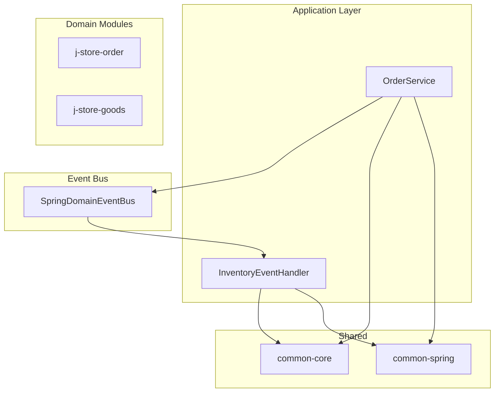
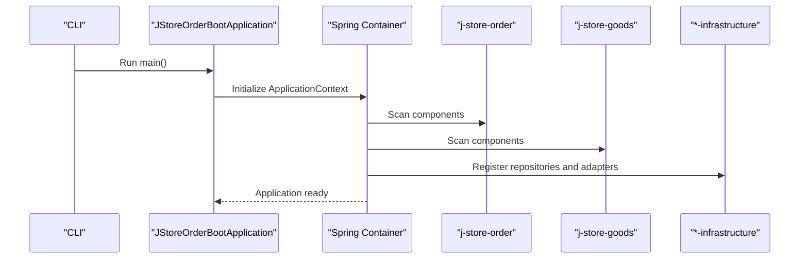
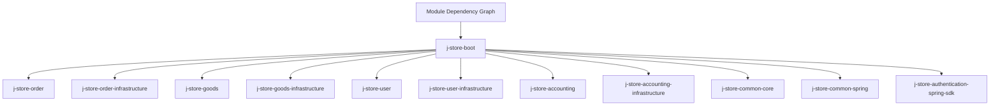
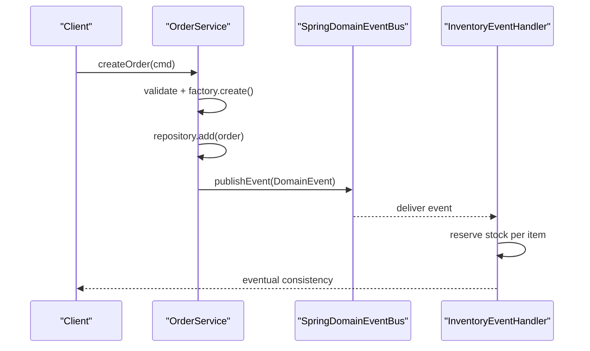
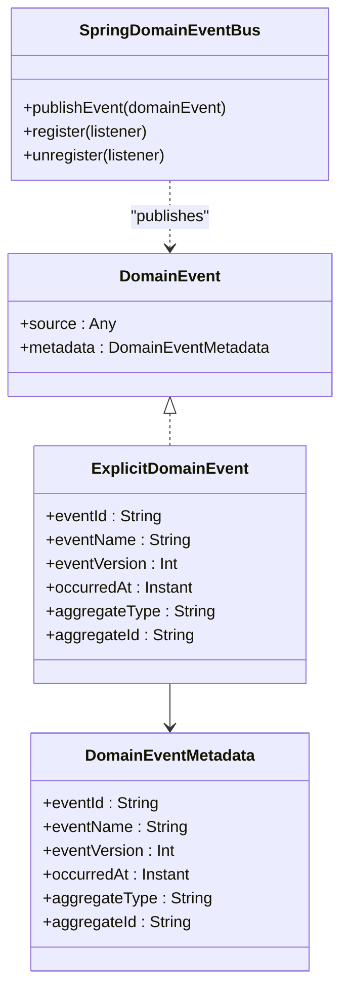
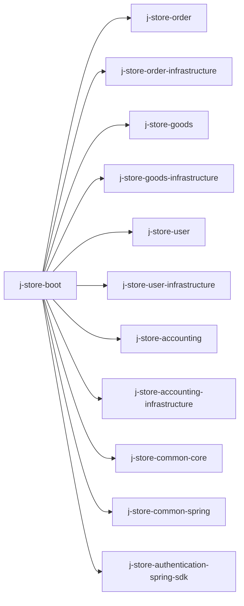

# Modular Monolith Architecture

<cite>
**Referenced Files in This Document**
- [settings.gradle.kts](file://settings.gradle.kts)
- [build.gradle.kts](file://build.gradle.kts)
- [libs.versions.toml](file://gradle/libs.versions.toml)
- [JStoreOrderBootApplication.kt](file://j-store-boot/src/main/kotlin/JStoreOrderBootApplication.kt)
- [build.gradle.kts (boot)](file://j-store-boot/build.gradle.kts)
- [DomainEvent.kt](file://j-store-common-core/src/main/kotlin/com/jstore/common/framework/event/DomainEvent.kt)
- [SpringDomainEventBus.kt](file://j-store-common-spring/src/main/kotlin/com/jstore/common/framework/event/SpringDomainEventBus.kt)
- [OrderService.kt](file://j-store-order/src/main/kotlin/com/jstore/order/service/OrderService.kt)
- [InventoryEventHandler.kt](file://j-store-goods/src/main/kotlin/com/jstore/goods/service/InventoryEventHandler.kt)
- [README.md](file://README.md)
</cite>

## Table of Contents
1. [Introduction](#introduction)
2. [Project Structure](#project-structure)
3. [Core Components](#core-components)
4. [Architecture Overview](#architecture-overview)
5. [Detailed Component Analysis](#detailed-component-analysis)
6. [Dependency Analysis](#dependency-analysis)
7. [Performance Considerations](#performance-considerations)
8. [Troubleshooting Guide](#troubleshooting-guide)
9. [Conclusion](#conclusion)
10. [Appendices](#appendices)

## Introduction
This document explains J-Store’s modular monolith architecture and how it organizes bounded contexts, enforces module boundaries, and coordinates inter-module communication through events. It also covers bootstrapping, configuration for isolation and shared dependencies, cross-module event handling, testing strategies, deployment considerations, and the evolution path toward microservices. The guidance aligns with Spring Modulith principles and the project’s existing domain-driven design patterns.

## Project Structure
J-Store is a Gradle multi-module project that groups code by bounded context and technology layer:
- Domain modules: order, goods, user, accounting, shop, warehouse
- Infrastructure modules: *-infrastructure pairs for persistence and external integrations
- Shared libraries: common-core and common-spring
- Bootstraps: j-store-boot aggregates modules into a single application; j-store-admin-boot provides an admin entry point

```mermaid
graph TB
subgraph "Boot"
BOOT["j-store-boot"]
ADMIN["j-store-admin-boot"]
end
subgraph "Domain Modules"
ORDER["j-store-order"]
GOODS["j-store-goods"]
USER["j-store-user"]
ACCOUNTING["j-store-accounting"]
SHOP["j-store-shop"]
WAREHOUSE["j-store-warehouse"]
end
subgraph "Infrastructure Modules"
ORDER_INFRA["j-store-order-infrastructure"]
GOODS_INFRA["j-store-goods-infrastructure"]
USER_INFRA["j-store-user-infrastructure"]
ACCOUNTING_INFRA["j-store-accounting-infrastructure"]
SHOP_INFRA["j-store-shop-infrastructure"]
WAREHOUSE_INFRA["j-store-warehouse-infrastructure"]
end
subgraph "Shared Libraries"
COMMON_CORE["j-store-common-core"]
COMMON_SPRING["j-store-common-spring"]
AUTH_SDK["j-store-authentication-spring-sdk"]
end
BOOT --> ORDER
BOOT --> ORDER_INFRA
BOOT --> GOODS
BOOT --> GOODS_INFRA
BOOT --> USER
BOOT --> USER_INFRA
BOOT --> ACCOUNTING
BOOT --> ACCOUNTING_INFRA
BOOT --> COMMON_CORE
BOOT --> COMMON_SPRING
BOOT --> AUTH_SDK
```

**Diagram sources**
- [settings.gradle.kts:1-28](file://settings.gradle.kts#L1-L28)
- [build.gradle.kts (boot):23-36](file://j-store-boot/build.gradle.kts#L23-L36)

**Section sources**
- [settings.gradle.kts:1-28](file://settings.gradle.kts#L1-L28)
- [build.gradle.kts:1-28](file://build.gradle.kts#L1-L28)
- [build.gradle.kts (boot):23-36](file://j-store-boot/build.gradle.kts#L23-L36)

## Core Components
The system centers around a small set of core abstractions and patterns:
- Domain events and metadata: explicit, versioned, and stable identifiers to support idempotent consumers and outbox delivery
- Event bus abstraction: decouples publishers from listeners and enables pluggable implementations
- Application services: orchestrate use cases by loading aggregates, invoking domain behavior, persisting state, and publishing domain events
- Event handlers: implement cross-context reactions using the same event bus

Key implementation references:
- Domain event model and metadata: [DomainEvent.kt:1-74](file://j-store-common-core/src/main/kotlin/com/jstore/common/framework/event/DomainEvent.kt#L1-L74)
- Spring-backed event bus: [SpringDomainEventBus.kt:1-24](file://j-store-common-spring/src/main/kotlin/com/jstore/common/framework/event/SpringDomainEventBus.kt#L1-L24)
- Order application service orchestrating domain events: [OrderService.kt:1-131](file://j-store-order/src/main/kotlin/com/jstore/order/service/OrderService.kt#L1-L131)
- Goods inventory event handler reacting to stock reservation requests: [InventoryEventHandler.kt:1-71](file://j-store-goods/src/main/kotlin/com/jstore/goods/service/InventoryEventHandler.kt#L1-L71)

**Section sources**
- [DomainEvent.kt:1-74](file://j-store-common-core/src/main/kotlin/com/jstore/common/framework/event/DomainEvent.kt#L1-L74)
- [SpringDomainEventBus.kt:1-24](file://j-store-common-spring/src/main/kotlin/com/jstore/common/framework/event/SpringDomainEventBus.kt#L1-L24)
- [OrderService.kt:1-131](file://j-store-order/src/main/kotlin/com/jstore/order/service/OrderService.kt#L1-L131)
- [InventoryEventHandler.kt:1-71](file://j-store-goods/src/main/kotlin/com/jstore/goods/service/InventoryEventHandler.kt#L1-L71)

## Architecture Overview
J-Store follows a modular monolith pattern:
- Bounded contexts are implemented as separate Gradle modules
- Module boundaries are enforced via package structure and dependency declarations
- Inter-module communication uses domain events published through a shared event bus
- Infrastructure concerns (persistence, caching, messaging) are isolated in *-infrastructure modules

**Diagram sources**
- [OrderService.kt:1-131](file://j-store-order/src/main/kotlin/com/jstore/order/service/OrderService.kt#L1-L131)
- [InventoryEventHandler.kt:1-71](file://j-store-goods/src/main/kotlin/com/jstore/goods/service/InventoryEventHandler.kt#L1-L71)
- [SpringDomainEventBus.kt:1-24](file://j-store-common-spring/src/main/kotlin/com/jstore/common/framework/event/SpringDomainEventBus.kt#L1-L24)

## Detailed Component Analysis

### Bootstrapping and Module Aggregation
- The main application class configures Spring Boot features such as JPA auditing, scheduling, and configuration properties
- The boot module aggregates all domain and infrastructure modules required for runtime
- Dependencies are declared explicitly to enforce module boundaries at build time

**Diagram sources**
- [JStoreOrderBootApplication.kt:1-22](file://j-store-boot/src/main/kotlin/JStoreOrderBootApplication.kt#L1-L22)
- [build.gradle.kts (boot):23-36](file://j-store-boot/build.gradle.kts#L23-L36)

**Section sources**
- [JStoreOrderBootApplication.kt:1-22](file://j-store-boot/src/main/kotlin/JStoreOrderBootApplication.kt#L1-L22)
- [build.gradle.kts (boot):23-36](file://j-store-boot/build.gradle.kts#L23-L36)

### Module Boundaries and Dependency Management
- Each bounded context lives in its own module (e.g., j-store-order, j-store-goods)
- Infrastructure implementations are separated into *-infrastructure modules
- Shared abstractions live in common-core and common-spring
- Build-time enforcement is achieved by declaring only necessary project dependencies in each module’s build script

**Diagram sources**
- [settings.gradle.kts:1-28](file://settings.gradle.kts#L1-L28)
- [build.gradle.kts (boot):23-36](file://j-store-boot/build.gradle.kts#L23-L36)

**Section sources**
- [settings.gradle.kts:1-28](file://settings.gradle.kts#L1-L28)
- [build.gradle.kts (boot):23-36](file://j-store-boot/build.gradle.kts#L23-L36)

### Inter-Module Communication via Events
- Application services publish domain events after persisting aggregate state changes
- Cross-context handlers consume these events and perform side effects (e.g., reserving inventory)
- The event bus abstracts the underlying mechanism, enabling future replacement (e.g., external message broker)

**Diagram sources**
- [OrderService.kt:44-50](file://j-store-order/src/main/kotlin/com/jstore/order/service/OrderService.kt#L44-L50)
- [SpringDomainEventBus.kt:10-12](file://j-store-common-spring/src/main/kotlin/com/jstore/common/framework/event/SpringDomainEventBus.kt#L10-L12)
- [InventoryEventHandler.kt:28-59](file://j-store-goods/src/main/kotlin/com/jstore/goods/service/InventoryEventHandler.kt#L28-L59)

**Section sources**
- [OrderService.kt:44-50](file://j-store-order/src/main/kotlin/com/jstore/order/service/OrderService.kt#L44-L50)
- [InventoryEventHandler.kt:28-59](file://j-store-goods/src/main/kotlin/com/jstore/goods/service/InventoryEventHandler.kt#L28-L59)

### Domain Event Model and Outbox Integration
- Domain events carry stable metadata (event ID, name, version, aggregate identity, timestamp)
- ExplicitDomainEvent ensures consistent envelope fields for serialization, idempotency, and outbox processing
- The event bus delegates to Spring’s ApplicationEventPublisher, allowing integration with transactional outbox patterns

**Diagram sources**
- [DomainEvent.kt:1-74](file://j-store-common-core/src/main/kotlin/com/jstore/common/framework/event/DomainEvent.kt#L1-L74)
- [SpringDomainEventBus.kt:1-24](file://j-store-common-spring/src/main/kotlin/com/jstore/common/framework/event/SpringDomainEventBus.kt#L1-L24)

**Section sources**
- [DomainEvent.kt:1-74](file://j-store-common-core/src/main/kotlin/com/jstore/common/framework/event/DomainEvent.kt#L1-L74)
- [SpringDomainEventBus.kt:1-24](file://j-store-common-spring/src/main/kotlin/com/jstore/common/framework/event/SpringDomainEventBus.kt#L1-L24)

### Testing Strategies for Modular Applications
- Unit tests should focus on domain logic within each module without involving other modules or infrastructure
- Integration tests can verify event flows across modules using the application context
- Property-based tests are used in some modules to assert invariants and robustness
- For modular verification, consider adding Spring Modulith tests to assert allowed dependencies and module isolation

Recommended practices:
- Keep test fixtures minimal and scoped to the module under test
- Use in-memory databases or embedded Postgres for integration tests
- Validate event contracts with property tests where applicable

[No sources needed since this section provides general guidance]

### Deployment Considerations
- Single JVM process hosts all modules (modular monolith)
- External services (PostgreSQL, Redis) are configured via environment properties
- Docker Compose is provided for local development and quick validation

Operational notes:
- Ensure database migrations run before application startup
- Configure connection details for PostgreSQL and Redis appropriately
- Monitor event queues and outbox tables if enabled

**Section sources**
- [README.md:1-53](file://README.md#L1-L53)

## Dependency Analysis
The boot module composes the runtime by depending on all domain and infrastructure modules plus shared libraries. This centralizes composition while keeping internal module dependencies strict.

**Diagram sources**
- [build.gradle.kts (boot):23-36](file://j-store-boot/build.gradle.kts#L23-L36)

**Section sources**
- [build.gradle.kts (boot):23-36](file://j-store-boot/build.gradle.kts#L23-L36)

## Performance Considerations
- Prefer asynchronous event handling for long-running operations to keep request latency low
- Use efficient serializers for domain events to reduce payload size
- Avoid heavy work in event handlers; offload to background tasks when necessary
- Cache read-heavy data where appropriate (e.g., product catalogs)
- Monitor database query performance and indexing for high-throughput paths

[No sources needed since this section provides general guidance]

## Troubleshooting Guide
Common issues and resolutions:
- Missing dependencies between modules: ensure the boot module includes all required projects and that inter-module dependencies are intentional
- Event not delivered: verify the event implements ExplicitDomainEvent and that the event bus is wired correctly
- Transactional outbox anomalies: check outbox entries status and dead-letter handling; ensure the publisher runs and retries are configured
- Database connectivity: validate PostgreSQL and Redis settings in local and production profiles

[No sources needed since this section provides general guidance]

## Conclusion
J-Store’s modular monolith leverages clear module boundaries, explicit domain events, and a pluggable event bus to achieve loose coupling and strong cohesion. The bootstrapping process aggregates modules into a single deployable unit, while infrastructure concerns remain isolated. This architecture supports incremental evolution toward microservices by extracting modules with well-defined APIs and event contracts.

[No sources needed since this section summarizes without analyzing specific files]

## Appendices

### Configuration for Module Isolation and Shared Dependencies
- Enforce module boundaries via Gradle dependencies in each module’s build script
- Centralize versions and platforms in libs.versions.toml
- Use common-core and common-spring for shared abstractions and Spring integrations

**Section sources**
- [libs.versions.toml:1-110](file://gradle/libs.versions.toml#L1-L110)

### Evolution Path to Microservices
- Identify stable module boundaries and public APIs
- Extract event contracts and externalize them (e.g., Kafka topics)
- Replace in-process event bus with a message broker for cross-service communication
- Deploy extracted modules independently with their own infrastructure modules

[No sources needed since this section provides general guidance]