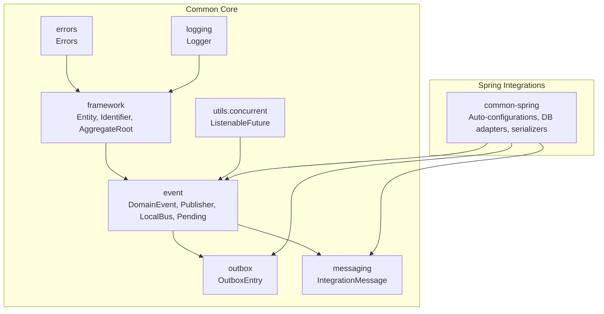
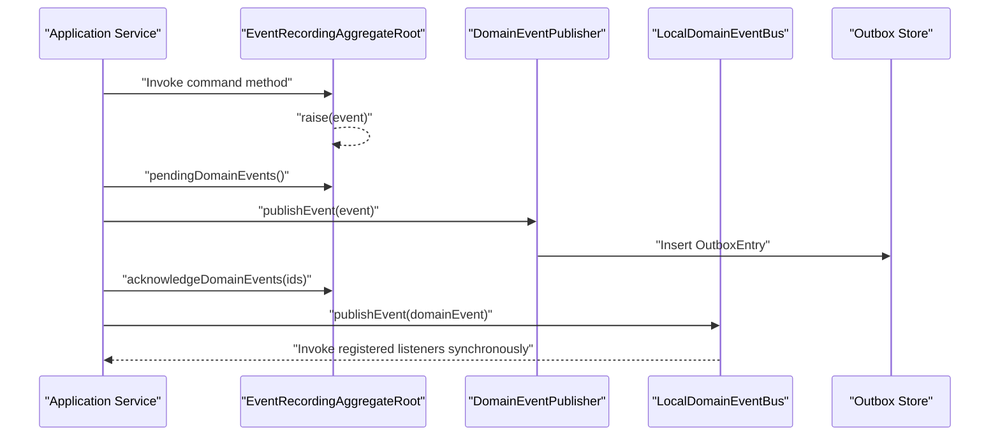
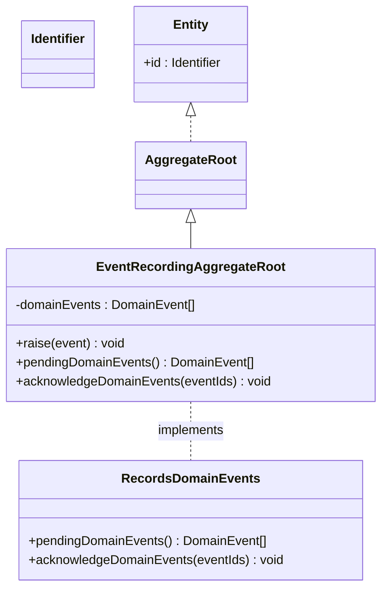
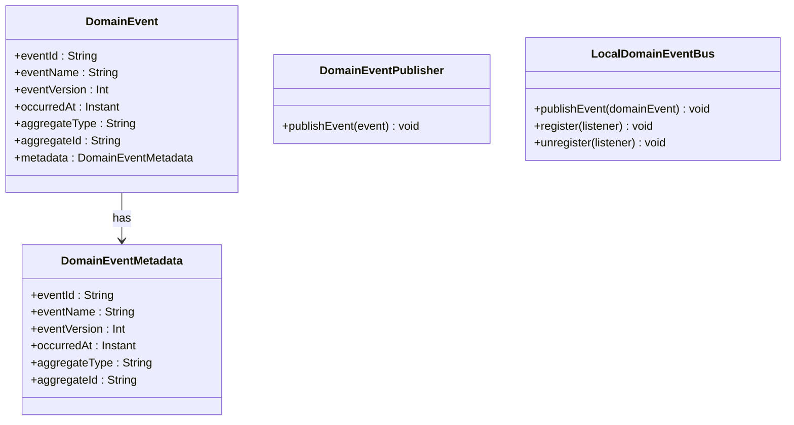
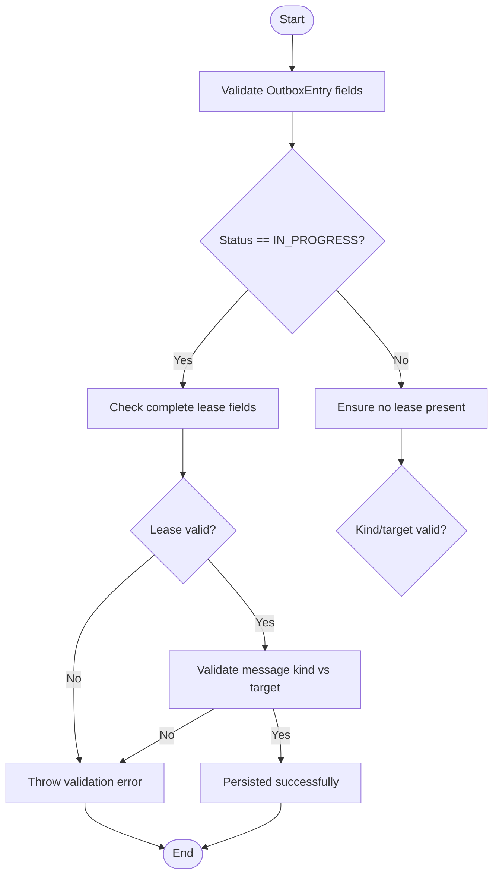
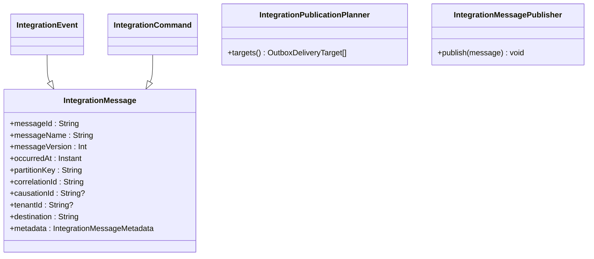
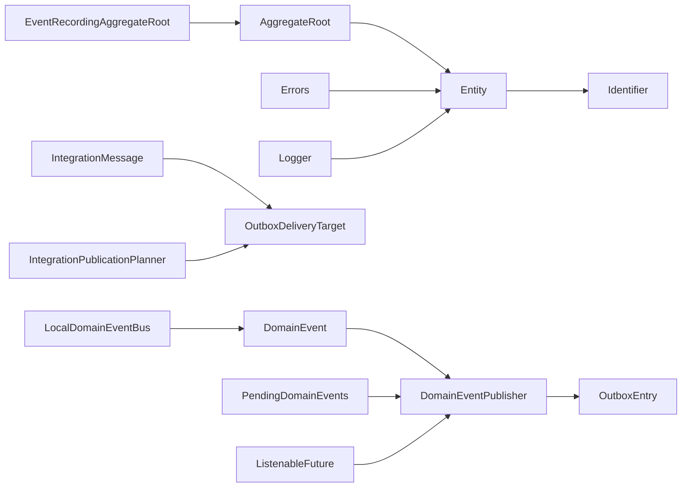

# Common Framework & Utilities

<cite>
**Referenced Files in This Document**
- [AggregateRoot.kt](file://j-store-common-core/src/main/kotlin/com/jstore/common/framework/AggregateRoot.kt)
- [Entity.kt](file://j-store-common-core/src/main/kotlin/com/jstore/common/framework/Entity.kt)
- [Identifier.kt](file://j-store-common-core/src/main/kotlin/com/jstore/common/framework/Identifier.kt)
- [DomainEvent.kt](file://j-store-common-core/src/main/kotlin/com/jstore/common/framework/event/DomainEvent.kt)
- [DomainEventPublisher.kt](file://j-store-common-core/src/main/kotlin/com/jstore/common/framework/event/DomainEventPublisher.kt)
- [LocalDomainEventBus.kt](file://j-store-common-core/src/main/kotlin/com/jstore/common/framework/event/LocalDomainEventBus.kt)
- [PendingDomainEvents.kt](file://j-store-common-core/src/main/kotlin/com/jstore/common/framework/event/PendingDomainEvents.kt)
- [OutboxEntry.kt](file://j-store-common-core/src/main/kotlin/com/jstore/common/framework/event/outbox/OutboxEntry.kt)
- [IntegrationMessage.kt](file://j-store-common-core/src/main/kotlin/com/jstore/common/framework/messaging/IntegrationMessage.kt)
- [Errors.kt](file://j-store-common-core/src/main/kotlin/com/jstore/common/errors/Errors.kt)
- [Logger.kt](file://j-store-common-core/src/main/kotlin/com/jstore/common/logging/Logger.kt)
- [ListenableFuture.kt](file://j-store-common-core/src/main/kotlin/com/jstore/common/utils/concurrent/ListenableFuture.kt)
</cite>

## Table of Contents
1. Introduction
2. Project Structure
3. Core Components
4. Architecture Overview
5. Detailed Component Analysis
6. Dependency Analysis
7. Performance Considerations
8. Troubleshooting Guide
9. Conclusion

## Introduction
This document explains the Common Framework & Utilities layer that underpins domain modeling, eventing, and reliable messaging across the system. It focuses on foundational base classes (AggregateRoot, Entity, Identifier), the domain event infrastructure, and the outbox pattern for reliable message delivery. It also covers shared utilities for error handling, logging, geographic address processing, and concurrent programming, along with Spring-specific integration points and auto-configuration options used by the framework.

The goal is to make the framework accessible to beginners while providing sufficient technical depth for experienced developers who extend or customize it.

## Project Structure
The Common Framework & Utilities are primarily implemented in the j-store-common-core module, with Spring integrations in j-store-common-spring. The key packages include:
- com.jstore.common.framework: Base types for entities, aggregates, and identifiers
- com.jstore.common.framework.event: Domain events, local bus, publisher abstraction, and pending event helpers
- com.jstore.common.framework.event.outbox: Outbox entry model and related enums
- com.jstore.common.framework.messaging: Integration messages and planning for delivery targets
- com.jstore.common.errors: Unified error type and common error codes
- com.jstore.common.logging: Logging abstraction
- com.jstore.common.utils.concurrent: Asynchronous primitives for callbacks and futures
- com.jstore.common.geo: Geographic address processing utilities

**Section sources**
- [AggregateRoot.kt](file://j-store-common-core/src/main/kotlin/com/jstore/common/framework/AggregateRoot.kt)
- [Entity.kt](file://j-store-common-core/src/main/kotlin/com/jstore/common/framework/Entity.kt)
- [Identifier.kt](file://j-store-common-core/src/main/kotlin/com/jstore/common/framework/Identifier.kt)
- [DomainEvent.kt](file://j-store-common-core/src/main/kotlin/com/jstore/common/framework/event/DomainEvent.kt)
- [DomainEventPublisher.kt](file://j-store-common-core/src/main/kotlin/com/jstore/common/framework/event/DomainEventPublisher.kt)
- [LocalDomainEventBus.kt](file://j-store-common-core/src/main/kotlin/com/jstore/common/framework/event/LocalDomainEventBus.kt)
- [PendingDomainEvents.kt](file://j-store-common-core/src/main/kotlin/com/jstore/common/framework/event/PendingDomainEvents.kt)
- [OutboxEntry.kt](file://j-store-common-core/src/main/kotlin/com/jstore/common/framework/event/outbox/OutboxEntry.kt)
- [IntegrationMessage.kt](file://j-store-common-core/src/main/kotlin/com/jstore/common/framework/messaging/IntegrationMessage.kt)
- [Errors.kt](file://j-store-common-core/src/main/kotlin/com/jstore/common/errors/Errors.kt)
- [Logger.kt](file://j-store-common-core/src/main/kotlin/com/jstore/common/logging/Logger.kt)
- [ListenableFuture.kt](file://j-store-common-core/src/main/kotlin/com/jstore/common/utils/concurrent/ListenableFuture.kt)

## Core Components
This section introduces the foundational building blocks that domain models rely on.

- Identifier: Strongly typed identity marker for entities and aggregates.
- Entity: Base interface defining a stable identifier property.
- AggregateRoot: Marker interface indicating an aggregate consistency boundary.
- EventRecordingAggregateRoot: Abstract base that records domain events raised during state transitions and exposes them for publication.

These components ensure consistent identity semantics, clear aggregate boundaries, and safe event recording within transactions.

**Section sources**
- [Identifier.kt](file://j-store-common-core/src/main/kotlin/com/jstore/common/framework/Identifier.kt)
- [Entity.kt](file://j-store-common-core/src/main/kotlin/com/jstore/common/framework/Entity.kt)
- [AggregateRoot.kt](file://j-store-common-core/src/main/kotlin/com/jstore/common/framework/AggregateRoot.kt)

## Architecture Overview
The eventing architecture separates concerns between domain event creation, transactional persistence via the outbox, and local synchronous dispatch.

- DomainEvent: Immutable fact emitted by aggregates with stable metadata.
- DomainEventPublisher: Transactional publisher responsible for persisting events into the outbox within the same database transaction as business data.
- LocalDomainEventBus: In-process dispatcher for synchronous listeners; not responsible for reliability guarantees.
- PendingDomainEvents: Helper to publish all pending events and acknowledge them only after successful publication.
- OutboxEntry: Persistent record representing a pending event/message with status, locking, and retry fields.

**Diagram sources**
- [AggregateRoot.kt](file://j-store-common-core/src/main/kotlin/com/jstore/common/framework/AggregateRoot.kt)
- [DomainEventPublisher.kt](file://j-store-common-core/src/main/kotlin/com/jstore/common/framework/event/DomainEventPublisher.kt)
- [LocalDomainEventBus.kt](file://j-store-common-core/src/main/kotlin/com/jstore/common/framework/event/LocalDomainEventBus.kt)
- [PendingDomainEvents.kt](file://j-store-common-core/src/main/kotlin/com/jstore/common/framework/event/PendingDomainEvents.kt)
- [OutboxEntry.kt](file://j-store-common-core/src/main/kotlin/com/jstore/common/framework/event/outbox/OutboxEntry.kt)

**Section sources**
- [DomainEvent.kt](file://j-store-common-core/src/main/kotlin/com/jstore/common/framework/event/DomainEvent.kt)
- [DomainEventPublisher.kt](file://j-store-common-core/src/main/kotlin/com/jstore/common/framework/event/DomainEventPublisher.kt)
- [LocalDomainEventBus.kt](file://j-store-common-core/src/main/kotlin/com/jstore/common/framework/event/LocalDomainEventBus.kt)
- [PendingDomainEvents.kt](file://j-store-common-core/src/main/kotlin/com/jstore/common/framework/event/PendingDomainEvents.kt)
- [OutboxEntry.kt](file://j-store-common-core/src/main/kotlin/com/jstore/common/framework/event/outbox/OutboxEntry.kt)

## Detailed Component Analysis

### Base Types: Identifier, Entity, AggregateRoot
- Identifier: Defines a strongly-typed identity contract.
- Entity: Adds an id property bound to any Identifier implementation.
- AggregateRoot: Marks an entity as an aggregate root, enforcing consistency boundaries.
- EventRecordingAggregateRoot: Manages a private list of pending domain events, prevents duplicates, and exposes methods to retrieve and acknowledge events after successful publication.

**Diagram sources**
- [Identifier.kt](file://j-store-common-core/src/main/kotlin/com/jstore/common/framework/Identifier.kt)
- [Entity.kt](file://j-store-common-core/src/main/kotlin/com/jstore/common/framework/Entity.kt)
- [AggregateRoot.kt](file://j-store-common-core/src/main/kotlin/com/jstore/common/framework/AggregateRoot.kt)

**Section sources**
- [Identifier.kt](file://j-store-common-core/src/main/kotlin/com/jstore/common/framework/Identifier.kt)
- [Entity.kt](file://j-store-common-core/src/main/kotlin/com/jstore/common/framework/Entity.kt)
- [AggregateRoot.kt](file://j-store-common-core/src/main/kotlin/com/jstore/common/framework/AggregateRoot.kt)

### Domain Events and Local Dispatch
- DomainEvent: Immutable event with stable envelope metadata including eventId, eventName, eventVersion, occurredAt, aggregateType, aggregateId, and metadata accessor.
- newDomainEventId(): Utility to generate a stable unique ID at construction time.
- DomainEventPublisher: Abstraction for transactional publishing to the outbox.
- LocalDomainEventBus: In-process dispatcher for synchronous listeners.
- PendingDomainEvents: Extension function to publish all pending events and acknowledge them atomically after success.

**Diagram sources**
- [DomainEvent.kt](file://j-store-common-core/src/main/kotlin/com/jstore/common/framework/event/DomainEvent.kt)
- [DomainEventPublisher.kt](file://j-store-common-core/src/main/kotlin/com/jstore/common/framework/event/DomainEventPublisher.kt)
- [LocalDomainEventBus.kt](file://j-store-common-core/src/main/kotlin/com/jstore/common/framework/event/LocalDomainEventBus.kt)

**Section sources**
- [DomainEvent.kt](file://j-store-common-core/src/main/kotlin/com/jstore/common/framework/event/DomainEvent.kt)
- [DomainEventPublisher.kt](file://j-store-common-core/src/main/kotlin/com/jstore/common/framework/event/DomainEventPublisher.kt)
- [LocalDomainEventBus.kt](file://j-store-common-core/src/main/kotlin/com/jstore/common/framework/event/LocalDomainEventBus.kt)
- [PendingDomainEvents.kt](file://j-store-common-core/src/main/kotlin/com/jstore/common/framework/event/PendingDomainEvents.kt)

### Outbox Pattern Implementation
The outbox ensures reliable delivery by persisting events/messages in the same transaction as business data.

- OutboxEntry: Represents a pending event/message with fields for status, retryCount, nextAttemptAt, lease information (lockedBy, lockedAt, lockedUntil, lockToken), and routing metadata (destination, partitionKey, correlationId, causationId, tenantId). Includes validation rules for required fields and lease constraints.
- OutboxMessageKind: Enumerates DOMAIN_EVENT, INTEGRATION_EVENT, INTEGRATION_COMMAND.
- OutboxDeliveryTarget: Enumerates LOCAL_DOMAIN, LOCAL_INTEGRATION, BROKER.

**Diagram sources**
- [OutboxEntry.kt](file://j-store-common-core/src/main/kotlin/com/jstore/common/framework/event/outbox/OutboxEntry.kt)

**Section sources**
- [OutboxEntry.kt](file://j-store-common-core/src/main/kotlin/com/jstore/common/framework/event/outbox/OutboxEntry.kt)

### Integration Messaging and Publication Planning
- IntegrationMessage: Stable contract crossing process boundaries with messageId, messageName, messageVersion, occurredAt, partitionKey, correlationId, causationId, tenantId, destination, and metadata accessor.
- IntegrationEvent and IntegrationCommand: Specializations of IntegrationMessage.
- IntegrationPublicationPlanner: Determines delivery targets based on mode (LOCAL, BROKER, HYBRID).
- IntegrationMessagePublisher: Abstraction for publishing integration messages.
- stableIntegrationMessageId(): Deterministic ID generation from message attributes.

**Diagram sources**
- [IntegrationMessage.kt](file://j-store-common-core/src/main/kotlin/com/jstore/common/framework/messaging/IntegrationMessage.kt)

**Section sources**
- [IntegrationMessage.kt](file://j-store-common-core/src/main/kotlin/com/jstore/common/framework/messaging/IntegrationMessage.kt)

### Shared Utilities
- Errors: Unified exception type carrying errorCode and httpCode, with fluent composition helpers.
- Logger: Logging abstraction with debug/info/warn/error overloads.
- ListenableFuture: Callback-based asynchronous primitive with success/failure handlers.

These utilities provide consistent error semantics, logging interfaces, and concurrency patterns across the framework.

**Section sources**
- [Errors.kt](file://j-store-common-core/src/main/kotlin/com/jstore/common/errors/Errors.kt)
- [Logger.kt](file://j-store-common-core/src/main/kotlin/com/jstore/common/logging/Logger.kt)
- [ListenableFuture.kt](file://j-store-common-core/src/main/kotlin/com/jstore/common/utils/concurrent/ListenableFuture.kt)

## Dependency Analysis
The following diagram shows how core components depend on each other and where Spring integrations typically plug in.

**Diagram sources**
- [Entity.kt](file://j-store-common-core/src/main/kotlin/com/jstore/common/framework/Entity.kt)
- [Identifier.kt](file://j-store-common-core/src/main/kotlin/com/jstore/common/framework/Identifier.kt)
- [AggregateRoot.kt](file://j-store-common-core/src/main/kotlin/com/jstore/common/framework/AggregateRoot.kt)
- [DomainEvent.kt](file://j-store-common-core/src/main/kotlin/com/jstore/common/framework/event/DomainEvent.kt)
- [DomainEventPublisher.kt](file://j-store-common-core/src/main/kotlin/com/jstore/common/framework/event/DomainEventPublisher.kt)
- [LocalDomainEventBus.kt](file://j-store-common-core/src/main/kotlin/com/jstore/common/framework/event/LocalDomainEventBus.kt)
- [PendingDomainEvents.kt](file://j-store-common-core/src/main/kotlin/com/jstore/common/framework/event/PendingDomainEvents.kt)
- [OutboxEntry.kt](file://j-store-common-core/src/main/kotlin/com/jstore/common/framework/event/outbox/OutboxEntry.kt)
- [IntegrationMessage.kt](file://j-store-common-core/src/main/kotlin/com/jstore/common/framework/messaging/IntegrationMessage.kt)
- [Errors.kt](file://j-store-common-core/src/main/kotlin/com/jstore/common/errors/Errors.kt)
- [Logger.kt](file://j-store-common-core/src/main/kotlin/com/jstore/common/logging/Logger.kt)
- [ListenableFuture.kt](file://j-store-common-core/src/main/kotlin/com/jstore/common/utils/concurrent/ListenableFuture.kt)

**Section sources**
- [Entity.kt](file://j-store-common-core/src/main/kotlin/com/jstore/common/framework/Entity.kt)
- [Identifier.kt](file://j-store-common-core/src/main/kotlin/com/jstore/common/framework/Identifier.kt)
- [AggregateRoot.kt](file://j-store-common-core/src/main/kotlin/com/jstore/common/framework/AggregateRoot.kt)
- [DomainEvent.kt](file://j-store-common-core/src/main/kotlin/com/jstore/common/framework/event/DomainEvent.kt)
- [DomainEventPublisher.kt](file://j-store-common-core/src/main/kotlin/com/jstore/common/framework/event/DomainEventPublisher.kt)
- [LocalDomainEventBus.kt](file://j-store-common-core/src/main/kotlin/com/jstore/common/framework/event/LocalDomainEventBus.kt)
- [PendingDomainEvents.kt](file://j-store-common-core/src/main/kotlin/com/jstore/common/framework/event/PendingDomainEvents.kt)
- [OutboxEntry.kt](file://j-store-common-core/src/main/kotlin/com/jstore/common/framework/event/outbox/OutboxEntry.kt)
- [IntegrationMessage.kt](file://j-store-common-core/src/main/kotlin/com/jstore/common/framework/messaging/IntegrationMessage.kt)
- [Errors.kt](file://j-store-common-core/src/main/kotlin/com/jstore/common/errors/Errors.kt)
- [Logger.kt](file://j-store-common-core/src/main/kotlin/com/jstore/common/logging/Logger.kt)
- [ListenableFuture.kt](file://j-store-common-core/src/main/kotlin/com/jstore/common/utils/concurrent/ListenableFuture.kt)

## Performance Considerations
- Event deduplication: EventRecordingAggregateRoot enforces uniqueness of pending event IDs to prevent duplicate publications.
- Batch operations: Publishing pending events should be done in a single transaction to minimize round-trips and ensure atomicity.
- Outbox locking: Use lock tokens and lease expiry to avoid stale workers reprocessing entries.
- Serialization: Keep event payloads compact and versioned to reduce storage and network overhead.
- Concurrency: Prefer callback-based async patterns (ListenableFuture) to avoid blocking threads during I/O.
- Indexing: Ensure indexes on OutboxEntry fields such as status, nextAttemptAt, and destination for efficient polling and scheduling.

[No sources needed since this section provides general guidance]

## Troubleshooting Guide
- Duplicate pending event IDs: Raised when attempting to raise an event with an existing pending ID. Resolve by ensuring unique event IDs per aggregate operation.
- Acknowledgment mismatch: Thrown if acknowledging unknown or duplicate pending event IDs. Verify that acknowledged IDs match exactly the published set.
- Outbox lease errors: Occur when IN_PROGRESS entries lack a complete lease or have invalid lease timing. Ensure correct acquisition and expiry settings.
- Message kind/target violations: Domain events must target LOCAL_DOMAIN; integration messages cannot target LOCAL_DOMAIN. Adjust message kind or target accordingly.
- Validation failures: OutboxEntry and IntegrationMessageMetadata enforce strict field requirements. Inspect blank or invalid fields and fix payload construction.

**Section sources**
- [AggregateRoot.kt](file://j-store-common-core/src/main/kotlin/com/jstore/common/framework/AggregateRoot.kt)
- [OutboxEntry.kt](file://j-store-common-core/src/main/kotlin/com/jstore/common/framework/event/outbox/OutboxEntry.kt)
- [IntegrationMessage.kt](file://j-store-common-core/src/main/kotlin/com/jstore/common/framework/messaging/IntegrationMessage.kt)

## Conclusion
The Common Framework & Utilities layer provides a robust foundation for domain modeling, event-driven architectures, and reliable messaging through the outbox pattern. By leveraging strong identities, immutable events, and transactional persistence, teams can build consistent and scalable systems. The shared utilities for errors, logging, and concurrency further standardize cross-cutting concerns. For Spring applications, integrate DomainEventPublisher and IntegrationMessagePublisher implementations to wire outbox persistence and broker delivery, configure serialization formats, and tune performance parameters like batch sizes and retry policies.

[No sources needed since this section summarizes without analyzing specific files]