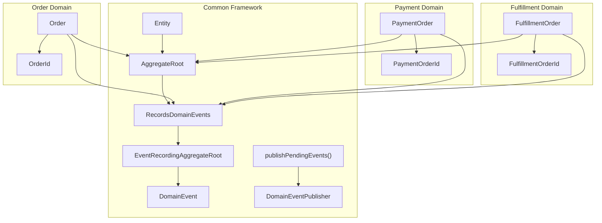
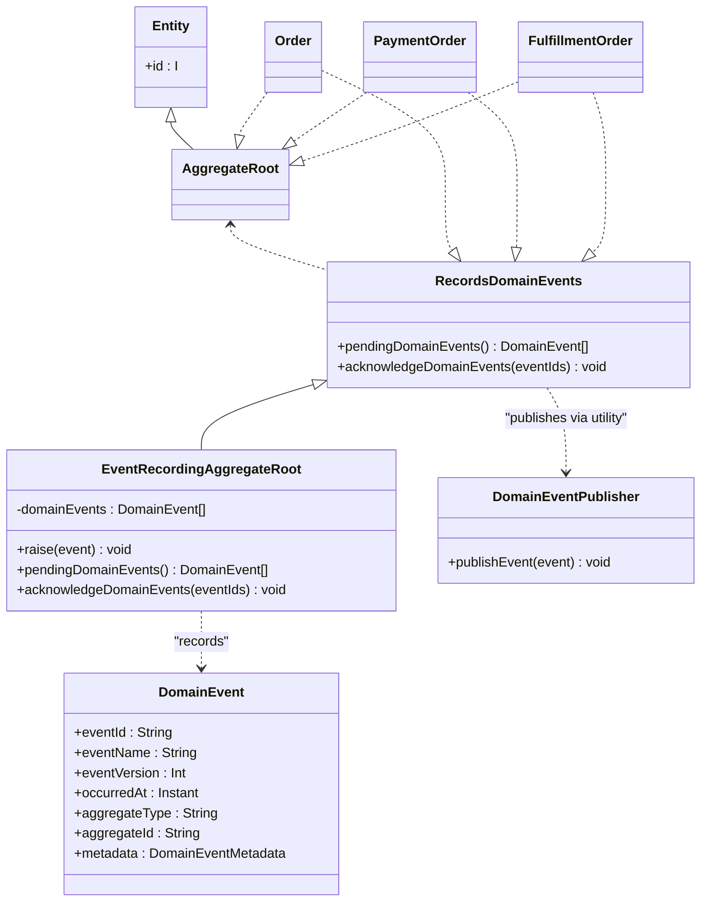
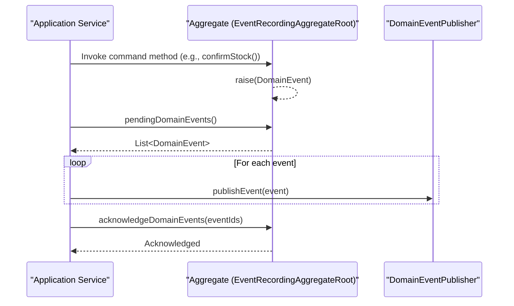
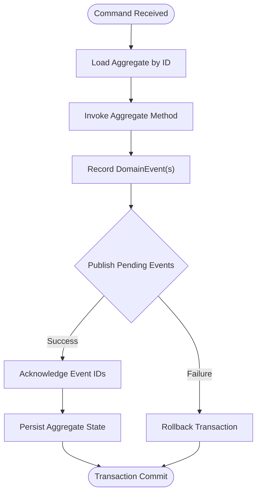
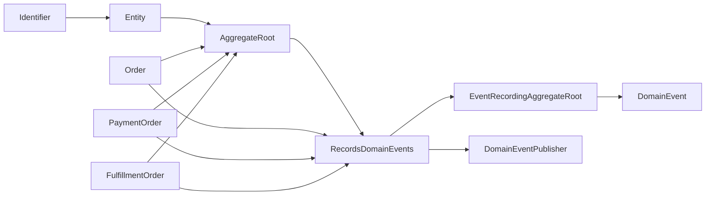

# DDD Core Components

<cite>
**Referenced Files in This Document**
- [AggregateRoot.kt](file://j-store-common-core/src/main/kotlin/com/jstore/common/framework/AggregateRoot.kt)
- [Entity.kt](file://j-store-common-core/src/main/kotlin/com/jstore/common/framework/Entity.kt)
- [Identifier.kt](file://j-store-common-core/src/main/kotlin/com/jstore/common/framework/Identifier.kt)
- [DomainEvent.kt](file://j-store-common-core/src/main/kotlin/com/jstore/common/framework/event/DomainEvent.kt)
- [DomainEventPublisher.kt](file://j-store-common-core/src/main/kotlin/com/jstore/common/framework/event/DomainEventPublisher.kt)
- [PendingDomainEvents.kt](file://j-store-common-core/src/main/kotlin/com/jstore/common/framework/event/PendingDomainEvents.kt)
- [Order.kt](file://j-store-order-domain/src/main/kotlin/com/jstore/order/domain/order/Order.kt)
- [PaymentOrder.kt](file://j-store-payment-domain/src/main/kotlin/com/jstore/payment/domain/payment/PaymentOrder.kt)
- [FulfillmentOrder.kt](file://j-store-fulfillment-domain/src/main/kotlin/com/jstore/fulfillment/domain/FulfillmentOrder.kt)
</cite>

## Table of Contents
1. [Introduction](#introduction)
2. [Project Structure](#project-structure)
3. [Core Components](#core-components)
4. [Architecture Overview](#architecture-overview)
5. [Detailed Component Analysis](#detailed-component-analysis)
6. [Dependency Analysis](#dependency-analysis)
7. [Performance Considerations](#performance-considerations)
8. [Troubleshooting Guide](#troubleshooting-guide)
9. [Conclusion](#conclusion)

## Introduction
This document explains the Domain-Driven Design (DDD) core components that form the backbone of the system’s domain layer. It focuses on the foundational base types AggregateRoot, Entity, and Identifier; the event recording capability via EventRecordingAggregateRoot; and how aggregates publish and acknowledge domain events consistently within a transaction boundary. It also provides guidance for creating custom aggregates, implementing value objects, and maintaining aggregate consistency boundaries with practical examples from the codebase.

## Project Structure
The DDD core abstractions live in the common framework module, while concrete aggregates are defined in their respective domain modules. The core interfaces and base classes provide identity, aggregation boundaries, and event recording capabilities. Concrete aggregates implement these interfaces to express business behavior and emit domain events.

**Diagram sources**
- [AggregateRoot.kt:1-40](file://j-store-common-core/src/main/kotlin/com/jstore/common/framework/AggregateRoot.kt#L1-L40)
- [Entity.kt:1-6](file://j-store-common-core/src/main/kotlin/com/jstore/common/framework/Entity.kt#L1-L6)
- [Identifier.kt:1-5](file://j-store-common-core/src/main/kotlin/com/jstore/common/framework/Identifier.kt#L1-L5)
- [DomainEvent.kt:1-46](file://j-store-common-core/src/main/kotlin/com/jstore/common/framework/event/DomainEvent.kt#L1-L46)
- [DomainEventPublisher.kt:1-11](file://j-store-common-core/src/main/kotlin/com/jstore/common/framework/event/DomainEventPublisher.kt#L1-L11)
- [PendingDomainEvents.kt:1-11](file://j-store-common-core/src/main/kotlin/com/jstore/common/framework/event/PendingDomainEvents.kt#L1-L11)
- [Order.kt:1-90](file://j-store-order-domain/src/main/kotlin/com/jstore/order/domain/order/Order.kt#L1-L90)
- [PaymentOrder.kt:1-94](file://j-store-payment-domain/src/main/kotlin/com/jstore/payment/domain/payment/PaymentOrder.kt#L1-L94)
- [FulfillmentOrder.kt:1-57](file://j-store-fulfillment-domain/src/main/kotlin/com/jstore/fulfillment/domain/FulfillmentOrder.kt#L1-L57)

**Section sources**
- [AggregateRoot.kt:1-40](file://j-store-common-core/src/main/kotlin/com/jstore/common/framework/AggregateRoot.kt#L1-L40)
- [Entity.kt:1-6](file://j-store-common-core/src/main/kotlin/com/jstore/common/framework/Entity.kt#L1-L6)
- [Identifier.kt:1-5](file://j-store-common-core/src/main/kotlin/com/jstore/common/framework/Identifier.kt#L1-L5)
- [DomainEvent.kt:1-46](file://j-store-common-core/src/main/kotlin/com/jstore/common/framework/event/DomainEvent.kt#L1-L46)
- [DomainEventPublisher.kt:1-11](file://j-store-common-core/src/main/kotlin/com/jstore/common/framework/event/DomainEventPublisher.kt#L1-L11)
- [PendingDomainEvents.kt:1-11](file://j-store-common-core/src/main/kotlin/com/jstore/common/framework/event/PendingDomainEvents.kt#L1-L11)
- [Order.kt:1-90](file://j-store-order-domain/src/main/kotlin/com/jstore/order/domain/order/Order.kt#L1-L90)
- [PaymentOrder.kt:1-94](file://j-store-payment-domain/src/main/kotlin/com/jstore/payment/domain/payment/PaymentOrder.kt#L1-L94)
- [FulfillmentOrder.kt:1-57](file://j-store-fulfillment-domain/src/main/kotlin/com/jstore/fulfillment/domain/FulfillmentOrder.kt#L1-L57)

## Core Components
- Entity<I>: Minimal contract for any entity with a strongly typed identifier.
- AggregateRoot<I>: Marker interface extending Entity to denote an aggregate consistency boundary.
- RecordsDomainEvents: Capability interface exposing pending events and acknowledgment.
- EventRecordingAggregateRoot<I>: Base class providing a private mutable list of pending events, safe raising of new events, snapshot retrieval, and acknowledgment by stable IDs.
- DomainEvent: Immutable domain fact with stable envelope metadata used by outbox delivery and idempotent consumers.
- DomainEventPublisher: Transactional publisher abstraction for persisting events (e.g., Outbox).
- publishPendingEvents(): Utility to publish all pending events atomically and acknowledge them only after successful publication.

These components together ensure:
- Strongly typed identity for entities and aggregates.
- Clear aggregate boundaries and encapsulation.
- Reliable event emission and acknowledgment within a single transaction.

**Section sources**
- [Entity.kt:1-6](file://j-store-common-core/src/main/kotlin/com/jstore/common/framework/Entity.kt#L1-L6)
- [AggregateRoot.kt:1-40](file://j-store-common-core/src/main/kotlin/com/jstore/common/framework/AggregateRoot.kt#L1-L40)
- [DomainEvent.kt:1-46](file://j-store-common-core/src/main/kotlin/com/jstore/common/framework/event/DomainEvent.kt#L1-L46)
- [DomainEventPublisher.kt:1-11](file://j-store-common-core/src/main/kotlin/com/jstore/common/framework/event/DomainEventPublisher.kt#L1-L11)
- [PendingDomainEvents.kt:1-11](file://j-store-common-core/src/main/kotlin/com/jstore/common/framework/event/PendingDomainEvents.kt#L1-L11)

## Architecture Overview
The architecture separates identity, aggregation boundaries, and event mechanics from domain-specific logic. Aggregates implement the core contracts and use the base class to record and publish events. Application services orchestrate transactions, load aggregates via repositories, invoke behavior, and then publish pending events using the provided publisher.

**Diagram sources**
- [AggregateRoot.kt:1-40](file://j-store-common-core/src/main/kotlin/com/jstore/common/framework/AggregateRoot.kt#L1-L40)
- [Entity.kt:1-6](file://j-store-common-core/src/main/kotlin/com/jstore/common/framework/Entity.kt#L1-L6)
- [DomainEvent.kt:1-46](file://j-store-common-core/src/main/kotlin/com/jstore/common/framework/event/DomainEvent.kt#L1-L46)
- [DomainEventPublisher.kt:1-11](file://j-store-common-core/src/main/kotlin/com/jstore/common/framework/event/DomainEventPublisher.kt#L1-L11)
- [Order.kt:1-90](file://j-store-order-domain/src/main/kotlin/com/jstore/order/domain/order/Order.kt#L1-L90)
- [PaymentOrder.kt:1-94](file://j-store-payment-domain/src/main/kotlin/com/jstore/payment/domain/payment/PaymentOrder.kt#L1-L94)
- [FulfillmentOrder.kt:1-57](file://j-store-fulfillment-domain/src/main/kotlin/com/jstore/fulfillment/domain/FulfillmentOrder.kt#L1-L57)

## Detailed Component Analysis

### Identity Management with Identifier and Entity
- Identifier is a marker interface for strongly typed identities.
- Entity enforces that every entity exposes its identifier through a read-only property.
- Best practice: define a dedicated type per aggregate or entity (e.g., OrderId, PaymentOrderId, FulfillmentOrderId) to prevent accidental mixing and enable compile-time safety.

Practical implications:
- Prevents stringly-typed identifiers and reduces runtime errors.
- Enables consistent serialization and comparison across persistence and messaging layers.

**Section sources**
- [Identifier.kt:1-5](file://j-store-common-core/src/main/kotlin/com/jstore/common/framework/Identifier.kt#L1-L5)
- [Entity.kt:1-6](file://j-store-common-core/src/main/kotlin/com/jstore/common/framework/Entity.kt#L1-L6)
- [Order.kt:1-90](file://j-store-order-domain/src/main/kotlin/com/jstore/order/domain/order/Order.kt#L1-L90)
- [PaymentOrder.kt:1-94](file://j-store-payment-domain/src/main/kotlin/com/jstore/payment/domain/payment/PaymentOrder.kt#L1-L94)
- [FulfillmentOrder.kt:1-57](file://j-store-fulfillment-domain/src/main/kotlin/com/jstore/fulfillment/domain/FulfillmentOrder.kt#L1-L57)

### Aggregate Root and Consistency Boundaries
- AggregateRoot marks the aggregate as the single source of truth for a set of related entities and invariants.
- All state mutations must go through aggregate methods, preserving invariants and ensuring consistency.
- Example aggregates: Order, PaymentOrder, FulfillmentOrder. Each defines behavior like confirmStock, capture, prepare, dispatch, deliver, etc.

Guidelines:
- Keep aggregates small and cohesive around a single business process.
- Avoid long-running operations inside aggregates; delegate to application services or external systems.
- Use Result types to propagate business errors without throwing unexpected exceptions.

**Section sources**
- [AggregateRoot.kt:1-40](file://j-store-common-core/src/main/kotlin/com/jstore/common/framework/AggregateRoot.kt#L1-L40)
- [Order.kt:1-90](file://j-store-order-domain/src/main/kotlin/com/jstore/order/domain/order/Order.kt#L1-L90)
- [PaymentOrder.kt:1-94](file://j-store-payment-domain/src/main/kotlin/com/jstore/payment/domain/payment/PaymentOrder.kt#L1-L94)
- [FulfillmentOrder.kt:1-57](file://j-store-fulfillment-domain/src/main/kotlin/com/jstore/fulfillment/domain/FulfillmentOrder.kt#L1-L57)

### Event Recording with EventRecordingAggregateRoot
- EventRecordingAggregateRoot maintains a private list of pending DomainEvent instances.
- raise(event) ensures no duplicate pending event IDs and appends the event safely.
- pendingDomainEvents returns a stable snapshot; acknowledgeDomainEvents removes acknowledged events by ID.
- publishPendingEvents coordinates publishing all pending events and acknowledging them only if every publication succeeds.

Sequence of event publishing:

**Diagram sources**
- [AggregateRoot.kt:1-40](file://j-store-common-core/src/main/kotlin/com/jstore/common/framework/AggregateRoot.kt#L1-L40)
- [PendingDomainEvents.kt:1-11](file://j-store-common-core/src/main/kotlin/com/jstore/common/framework/event/PendingDomainEvents.kt#L1-L11)
- [DomainEventPublisher.kt:1-11](file://j-store-common-core/src/main/kotlin/com/jstore/common/framework/event/DomainEventPublisher.kt#L1-L11)

**Section sources**
- [AggregateRoot.kt:1-40](file://j-store-common-core/src/main/kotlin/com/jstore/common/framework/AggregateRoot.kt#L1-L40)
- [PendingDomainEvents.kt:1-11](file://j-store-common-core/src/main/kotlin/com/jstore/common/framework/event/PendingDomainEvents.kt#L1-L11)

### Domain Events and Metadata
- DomainEvent is immutable and carries stable envelope metadata (eventId, eventName, eventVersion, occurredAt, aggregateType, aggregateId).
- newDomainEventId generates a unique ID once per event instance.
- Metadata supports outbox delivery, diagnostics, and idempotent consumption.

Best practices:
- Always generate a new eventId at construction time.
- Include sufficient context in event payloads for downstream consumers.
- Version events when evolving schemas to maintain backward compatibility.

**Section sources**
- [DomainEvent.kt:1-46](file://j-store-common-core/src/main/kotlin/com/jstore/common/framework/event/DomainEvent.kt#L1-L46)

### Implementing Custom Aggregates
Steps:
1. Define a strong Identifier type for your aggregate.
2. Create an interface extending AggregateRoot and RecordsDomainEvents to expose behavior.
3. Implement the aggregate by extending EventRecordingAggregateRoot to gain event recording capabilities.
4. Encapsulate state changes in methods that validate invariants and raise domain events.
5. In application services, load the aggregate, execute commands, and publish pending events using the publisher.

Example patterns in this codebase:
- Order: models trade, payment, fulfillment, and refund states with explicit methods.
- PaymentOrder: manages capture and refund lifecycle.
- FulfillmentOrder: handles preparation, dispatch, and delivery transitions.

**Section sources**
- [Order.kt:1-90](file://j-store-order-domain/src/main/kotlin/com/jstore/order/domain/order/Order.kt#L1-L90)
- [PaymentOrder.kt:1-94](file://j-store-payment-domain/src/main/kotlin/com/jstore/payment/domain/payment/PaymentOrder.kt#L1-L94)
- [FulfillmentOrder.kt:1-57](file://j-store-fulfillment-domain/src/main/kotlin/com/jstore/fulfillment/domain/FulfillmentOrder.kt#L1-L57)

### Value Objects and Immutability
- Value objects should be immutable and compare by value.
- Examples include Price, UserInfo, RecipientInfo, ShippingRecipient, PaymentCapture, PaymentRefundItem, FulfillmentItem.
- Enforce invariants in constructors or init blocks to guarantee valid state.

Guidelines:
- Prefer data classes with validation in init blocks.
- Avoid exposing mutable fields.
- Use composition to build richer domain models while keeping invariants local.

**Section sources**
- [PaymentOrder.kt:1-94](file://j-store-payment-domain/src/main/kotlin/com/jstore/payment/domain/payment/PaymentOrder.kt#L1-L94)
- [FulfillmentOrder.kt:1-57](file://j-store-fulfillment-domain/src/main/kotlin/com/jstore/fulfillment/domain/FulfillmentOrder.kt#L1-L57)

### Relationship Between Entities, Aggregates, and Domain Events
- Entities represent objects with identity; aggregates group related entities and enforce invariants.
- Aggregates emit domain events to describe state changes.
- Events are recorded internally until successfully published and acknowledged.
- Downstream processes consume events asynchronously and update projections or trigger side effects.

**Diagram sources**
- [AggregateRoot.kt:1-40](file://j-store-common-core/src/main/kotlin/com/jstore/common/framework/AggregateRoot.kt#L1-L40)
- [PendingDomainEvents.kt:1-11](file://j-store-common-core/src/main/kotlin/com/jstore/common/framework/event/PendingDomainEvents.kt#L1-L11)

## Dependency Analysis
- Aggregates depend on Identifier and Entity for identity.
- EventRecordingAggregateRoot depends on DomainEvent and RecordsDomainEvents.
- Application services depend on DomainEventPublisher to persist events transactionally.
- Concrete aggregates (Order, PaymentOrder, FulfillmentOrder) implement the core contracts and may reference value objects and domain enums.

**Diagram sources**
- [AggregateRoot.kt:1-40](file://j-store-common-core/src/main/kotlin/com/jstore/common/framework/AggregateRoot.kt#L1-L40)
- [Entity.kt:1-6](file://j-store-common-core/src/main/kotlin/com/jstore/common/framework/Entity.kt#L1-L6)
- [DomainEvent.kt:1-46](file://j-store-common-core/src/main/kotlin/com/jstore/common/framework/event/DomainEvent.kt#L1-L46)
- [DomainEventPublisher.kt:1-11](file://j-store-common-core/src/main/kotlin/com/jstore/common/framework/event/DomainEventPublisher.kt#L1-L11)
- [Order.kt:1-90](file://j-store-order-domain/src/main/kotlin/com/jstore/order/domain/order/Order.kt#L1-L90)
- [PaymentOrder.kt:1-94](file://j-store-payment-domain/src/main/kotlin/com/jstore/payment/domain/payment/PaymentOrder.kt#L1-L94)
- [FulfillmentOrder.kt:1-57](file://j-store-fulfillment-domain/src/main/kotlin/com/jstore/fulfillment/domain/FulfillmentOrder.kt#L1-L57)

**Section sources**
- [AggregateRoot.kt:1-40](file://j-store-common-core/src/main/kotlin/com/jstore/common/framework/AggregateRoot.kt#L1-L40)
- [Entity.kt:1-6](file://j-store-common-core/src/main/kotlin/com/jstore/common/framework/Entity.kt#L1-L6)
- [DomainEvent.kt:1-46](file://j-store-common-core/src/main/kotlin/com/jstore/common/framework/event/DomainEvent.kt#L1-L46)
- [DomainEventPublisher.kt:1-11](file://j-store-common-core/src/main/kotlin/com/jstore/common/framework/event/DomainEventPublisher.kt#L1-L11)
- [Order.kt:1-90](file://j-store-order-domain/src/main/kotlin/com/jstore/order/domain/order/Order.kt#L1-L90)
- [PaymentOrder.kt:1-94](file://j-store-payment-domain/src/main/kotlin/com/jstore/payment/domain/payment/PaymentOrder.kt#L1-L94)
- [FulfillmentOrder.kt:1-57](file://j-store-fulfillment-domain/src/main/kotlin/com/jstore/fulfillment/domain/FulfillmentOrder.kt#L1-L57)

## Performance Considerations
- Minimize event payload size to reduce memory and network overhead.
- Batch event publications where possible; the current design publishes one by one but acknowledges atomically after success.
- Avoid heavy computations inside aggregates; prefer application services for orchestration.
- Ensure repository implementations are efficient and avoid N+1 queries when loading aggregates.
- Use immutable value objects to reduce copying costs and improve concurrency safety.

[No sources needed since this section provides general guidance]

## Troubleshooting Guide
Common issues and resolutions:
- Duplicate pending event IDs: The raise method enforces uniqueness; ensure you do not create multiple events with the same ID.
- Acknowledgment failures: acknowledgeDomainEvents requires exact matching IDs; verify that all pending events were published successfully before acknowledging.
- Event loss: If publishing fails, the transaction should roll back; ensure your DomainEventPublisher writes to a transactional store (e.g., Outbox).
- Identity collisions: Validate Identifier generation strategies and ensure uniqueness across aggregates.

**Section sources**
- [AggregateRoot.kt:1-40](file://j-store-common-core/src/main/kotlin/com/jstore/common/framework/AggregateRoot.kt#L1-L40)
- [PendingDomainEvents.kt:1-11](file://j-store-common-core/src/main/kotlin/com/jstore/common/framework/event/PendingDomainEvents.kt#L1-L11)
- [DomainEvent.kt:1-46](file://j-store-common-core/src/main/kotlin/com/jstore/common/framework/event/DomainEvent.kt#L1-L46)

## Conclusion
The DDD core components provide a robust foundation for building consistent, event-driven aggregates. By leveraging Identifier, Entity, AggregateRoot, and EventRecordingAggregateRoot, teams can implement clear boundaries, enforce invariants, and reliably publish domain events. Following best practices for value objects, event design, and transactional publishing ensures scalability, correctness, and maintainability across domains such as orders, payments, and fulfillment.

[No sources needed since this section summarizes without analyzing specific files]