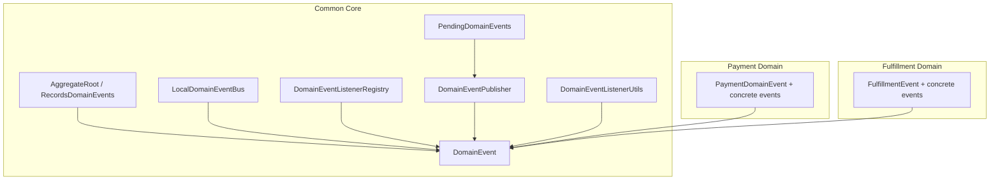
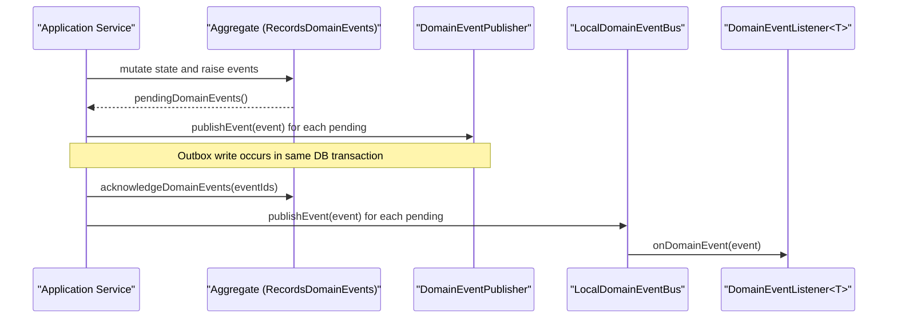
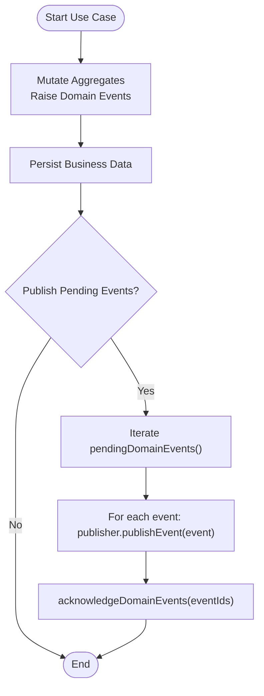
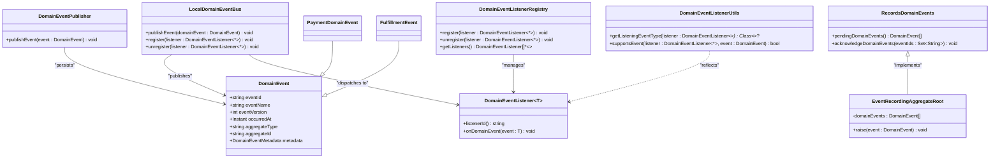

# Event Infrastructure

<cite>
**Referenced Files in This Document**
- [DomainEvent.kt](file://j-store-common-core/src/main/kotlin/com/jstore/common/framework/event/DomainEvent.kt)
- [LocalDomainEventBus.kt](file://j-store-common-core/src/main/kotlin/com/jstore/common/framework/event/LocalDomainEventBus.kt)
- [DomainEventListener.kt](file://j-store-common-core/src/main/kotlin/com/jstore/common/framework/event/Domai nEventListener.kt)
- [DomainEventPublisher.kt](file://j-store-common-core/src/main/kotlin/com/jstore/common/framework/event/DomainEventPublisher.kt)
- [PendingDomainEvents.kt](file://j-store-common-core/src/main/kotlin/com/jstore/common/framework/event/PendingDomainEvents.kt)
- [DomainEventListenerRegistry.kt](file://j-store-common-core/src/main/kotlin/com/jstore/common/framework/event/Domai nEventListenerRegistry.kt)
- [DomainEventListenerUtils.kt](file://j-store-common-core/src/main/kotlin/com/jstore/common/framework/event/Domai nEventListenerUtils.kt)
- [AggregateRoot.kt](file://j-store-common-core/src/main/kotlin/com/jstore/common/framework/AggregateRoot.kt)
- [PaymentEvents.kt](file://j-store-payment-domain/src/main/kotlin/com/jstore/payment/domain/payment/event/PaymentEvents.kt)
- [FulfillmentEvents.kt](file://j-store-fulfillment-domain/src/main/kotlin/com/jstore/fulfillment/domain/event/FulfillmentEvents.kt)
</cite>

## Table of Contents
1. [Introduction](#introduction)
2. [Project Structure](#project-structure)
3. [Core Components](#core-components)
4. [Architecture Overview](#architecture-overview)
5. [Detailed Component Analysis](#detailed-component-analysis)
6. [Dependency Analysis](#dependency-analysis)
7. [Performance Considerations](#performance-considerations)
8. [Troubleshooting Guide](#troubleshooting-guide)
9. [Conclusion](#conclusion)

## Introduction
This document explains the Event Infrastructure component that powers domain events across the system. It covers the DomainEvent interface, LocalDomainEventBus for in-process dispatch, event listener registration and discovery, and how pending domain events are published within transaction boundaries using a transactional outbox pattern. It also provides guidance on creating custom domain events, implementing listeners, handling errors, versioning events, serialization considerations, and debugging event-driven workflows.

## Project Structure
The event infrastructure is defined in the common core module and consumed by domain modules (e.g., payment, fulfillment). Key elements:
- Domain event contract and metadata
- In-process bus and listener registry interfaces
- Transactional publisher abstraction
- Aggregate base class for recording pending events
- Concrete domain event types used by aggregates

**Diagram sources**
- [DomainEvent.kt:1-46](file://j-store-common-core/src/main/kotlin/com/jstore/common/framework/event/DomainEvent.kt#L1-L46)
- [LocalDomainEventBus.kt:1-15](file://j-store-common-core/src/main/kotlin/com/jstore/common/framework/event/LocalDomainEventBus.kt#L1-L15)
- [DomainEventListenerRegistry.kt:1-10](file://j-store-common-core/src/main/kotlin/com/jstore/common/framework/event/Domai nEventListenerRegistry.kt#L1-L10)
- [DomainEventPublisher.kt:1-11](file://j-store-common-core/src/main/kotlin/com/jstore/common/framework/event/DomainEventPublisher.kt#L1-L11)
- [PendingDomainEvents.kt:1-11](file://j-store-common-core/src/main/kotlin/com/jstore/common/framework/event/PendingDomainEvents.kt#L1-L11)
- [AggregateRoot.kt:1-40](file://j-store-common-core/src/main/kotlin/com/jstore/common/framework/AggregateRoot.kt#L1-L40)
- [DomainEventListenerUtils.kt:1-141](file://j-store-common-core/src/main/kotlin/com/jstore/common/framework/event/Domai nEventListenerUtils.kt#L1-L141)
- [PaymentEvents.kt:1-74](file://j-store-payment-domain/src/main/kotlin/com/jstore/payment/domain/payment/event/PaymentEvents.kt#L1-L74)
- [FulfillmentEvents.kt:1-48](file://j-store-fulfillment-domain/src/main/kotlin/com/jstore/fulfillment/domain/event/FulfillmentEvents.kt#L1-L48)

**Section sources**
- [DomainEvent.kt:1-46](file://j-store-common-core/src/main/kotlin/com/jstore/common/framework/event/DomainEvent.kt#L1-L46)
- [LocalDomainEventBus.kt:1-15](file://j-store-common-core/src/main/kotlin/com/jstore/common/framework/event/LocalDomainEventBus.kt#L1-L15)
- [DomainEventListenerRegistry.kt:1-10](file://j-store-common-core/src/main/kotlin/com/jstore/common/framework/event/Domai nEventListenerRegistry.kt#L1-L10)
- [DomainEventPublisher.kt:1-11](file://j-store-common-core/src/main/kotlin/com/jstore/common/framework/event/DomainEventPublisher.kt#L1-L11)
- [PendingDomainEvents.kt:1-11](file://j-store-common-core/src/main/kotlin/com/jstore/common/framework/event/PendingDomainEvents.kt#L1-L11)
- [AggregateRoot.kt:1-40](file://j-store-common-core/src/main/kotlin/com/jstore/common/framework/AggregateRoot.kt#L1-L40)
- [DomainEventListenerUtils.kt:1-141](file://j-store-common-core/src/main/kotlin/com/jstore/common/framework/event/Domai nEventListenerUtils.kt#L1-L141)
- [PaymentEvents.kt:1-74](file://j-store-payment-domain/src/main/kotlin/com/jstore/payment/domain/payment/event/PaymentEvents.kt#L1-L74)
- [FulfillmentEvents.kt:1-48](file://j-store-fulfillment-domain/src/main/kotlin/com/jstore/fulfillment/domain/event/FulfillmentEvents.kt#L1-L48)

## Core Components
- DomainEvent: Immutable event envelope with stable identifiers, name, version, timestamp, aggregate identity, and metadata.
- DomainEventType annotation: Declares stable event name and version for consumers and serializers.
- LocalDomainEventBus: In-process bus to publish events synchronously to registered listeners.
- DomainEventListener<T>: Listener interface with a stable listenerId() for idempotent consumption and onDomainEvent(T) handler.
- DomainEventListenerRegistry: Registry to register/unregister listeners and enumerate them.
- DomainEventListenerUtils: Reflection utilities to discover the generic event type a listener supports and match events to listeners.
- DomainEventPublisher: Abstraction for transactional publishing (typically writes to an outbox table within the same DB transaction as business data).
- PendingDomainEvents: Utility to publish all pending events from an aggregate and acknowledge them only after successful publication.
- AggregateRoot and RecordsDomainEvents: Base contracts and implementation to record pending events and acknowledge them by ID.

These components together enable:
- Aggregates to raise immutable domain facts without coupling to delivery mechanisms.
- Application services to persist changes and publish events atomically via outbox.
- Listeners to react to events within or outside the originating transaction.

**Section sources**
- [DomainEvent.kt:1-46](file://j-store-common-core/src/main/kotlin/com/jstore/common/framework/event/DomainEvent.kt#L1-L46)
- [LocalDomainEventBus.kt:1-15](file://j-store-common-core/src/main/kotlin/com/jstore/common/framework/event/LocalDomainEventBus.kt#L1-L15)
- [DomainEventListener.kt:1-26](file://j-store-common-core/src/main/kotlin/com/jstore/common/framework/event/Domai nEventListener.kt#L1-L26)
- [DomainEventListenerRegistry.kt:1-10](file://j-store-common-core/src/main/kotlin/com/jstore/common/framework/event/Domai nEventListenerRegistry.kt#L1-L10)
- [DomainEventListenerUtils.kt:1-141](file://j-store-common-core/src/main/kotlin/com/jstore/common/framework/event/Domai nEventListenerUtils.kt#L1-L141)
- [DomainEventPublisher.kt:1-11](file://j-store-common-core/src/main/kotlin/com/jstore/common/framework/event/DomainEventPublisher.kt#L1-L11)
- [PendingDomainEvents.kt:1-11](file://j-store-common-core/src/main/kotlin/com/jstore/common/framework/event/PendingDomainEvents.kt#L1-L11)
- [AggregateRoot.kt:1-40](file://j-store-common-core/src/main/kotlin/com/jstore/common/framework/AggregateRoot.kt#L1-L40)

## Architecture Overview
The event architecture separates concerns between domain logic, local dispatch, and durable delivery:
- Aggregates record pending events during state transitions.
- Application use cases orchestrate persistence and call the publisher to write outbox entries.
- After successful persistence, pending events are acknowledged.
- A background process consumes outbox entries and publishes to downstream systems.
- Within the same process, LocalDomainEventBus delivers events synchronously to registered listeners.

**Diagram sources**
- [AggregateRoot.kt:1-40](file://j-store-common-core/src/main/kotlin/com/jstore/common/framework/AggregateRoot.kt#L1-L40)
- [DomainEventPublisher.kt:1-11](file://j-store-common-core/src/main/kotlin/com/jstore/common/framework/event/DomainEventPublisher.kt#L1-L11)
- [LocalDomainEventBus.kt:1-15](file://j-store-common-core/src/main/kotlin/com/jstore/common/framework/event/LocalDomainEventBus.kt#L1-L15)
- [DomainEventListener.kt:1-26](file://j-store-common-core/src/main/kotlin/com/jstore/common/framework/event/Domai nEventListener.kt#L1-L26)
- [PendingDomainEvents.kt:1-11](file://j-store-common-core/src/main/kotlin/com/jstore/common/framework/event/PendingDomainEvents.kt#L1-L11)

## Detailed Component Analysis

### DomainEvent and Metadata
- DomainEvent defines immutable fields: eventId, eventName, eventVersion, occurredAt, aggregateType, aggregateId, and a stable metadata view.
- newDomainEventId() generates unique IDs at construction time.
- DomainEventMetadata encapsulates the envelope fields for diagnostics and idempotent consumers.

Usage patterns:
- Use @DomainEventType to declare stable names and versions for serialization and routing.
- Keep events immutable and free of framework dependencies.

**Section sources**
- [DomainEvent.kt:1-46](file://j-store-common-core/src/main/kotlin/com/jstore/common/framework/event/DomainEvent.kt#L1-L46)

### LocalDomainEventBus and Listener Registration
- LocalDomainEventBus exposes publishEvent and listener management methods.
- DomainEventListenerRegistry centralizes registration and enumeration.
- DomainEventListenerUtils resolves the generic event type a listener supports and matches events to listeners efficiently with caching.

Registration flow:
- Register listeners once at application startup.
- On publish, iterate registered listeners, match by supported event type, and invoke onDomainEvent.

Error isolation:
- Each listener invocation should be wrapped to prevent one failing listener from aborting others.

**Section sources**
- [LocalDomainEventBus.kt:1-15](file://j-store-common-core/src/main/kotlin/com/jstore/common/framework/event/LocalDomainEventBus.kt#L1-L15)
- [DomainEventListenerRegistry.kt:1-10](file://j-store-common-core/src/main/kotlin/com/jstore/common/framework/event/Domai nEventListenerRegistry.kt#L1-L10)
- [DomainEventListenerUtils.kt:1-141](file://j-store-common-core/src/main/kotlin/com/jstore/common/framework/event/Domai nEventListenerUtils.kt#L1-L141)

### DomainEventPublisher and Transactional Outbox
- DomainEventPublisher abstracts durable publishing; default implementation writes to an outbox table within the same database transaction as business data.
- PendingDomainEvents.publishPendingEvents iterates pending events, publishes each, then acknowledges only after all succeed.

Transaction boundary:
- If any publish fails, the transaction rolls back, ensuring no partial outbox entries.
- Acknowledgement happens post-success to clear pending events.

**Section sources**
- [DomainEventPublisher.kt:1-11](file://j-store-common-core/src/main/kotlin/com/jstore/common/framework/event/DomainEventPublisher.kt#L1-L11)
- [PendingDomainEvents.kt:1-11](file://j-store-common-core/src/main/kotlin/com/jstore/common/framework/event/PendingDomainEvents.kt#L1-L11)

### Aggregate Event Recording
- RecordsDomainEvents exposes pendingDomainEvents and acknowledgeDomainEvents.
- EventRecordingAggregateRoot maintains a private list of pending events, prevents duplicates, and validates acknowledgements.

Integration points:
- Aggregates raise events through protected raise method.
- Use cases retrieve pending events, publish via DomainEventPublisher, then acknowledge.

**Section sources**
- [AggregateRoot.kt:1-40](file://j-store-common-core/src/main/kotlin/com/jstore/common/framework/AggregateRoot.kt#L1-L40)

### Creating Custom Domain Events
Steps:
- Define a sealed base class per aggregate (optional but recommended) to group related events.
- Implement concrete event data classes extending the base and DomainEvent.
- Annotate with @DomainEventType(name = "...", version = N).
- Provide eventId via newDomainEventId() default parameter.
- Include aggregate identity fields and relevant payload.

Examples in codebase:
- Payment domain events: PaymentCapturedEvent, PaymentRefundRequestedEvent, PaymentRefundSucceededEvent, PaymentRefundFailedEvent.
- Fulfillment domain events: FulfillmentPreparedEvent, ShipmentDispatchedEvent, ShipmentDeliveredEvent.

**Section sources**
- [PaymentEvents.kt:1-74](file://j-store-payment-domain/src/main/kotlin/com/jstore/payment/domain/payment/event/PaymentEvents.kt#L1-L74)
- [FulfillmentEvents.kt:1-48](file://j-store-fulfillment-domain/src/main/kotlin/com/jstore/fulfillment/domain/event/FulfillmentEvents.kt#L1-L48)

### Implementing Event Listeners
- Implement DomainEventListener<T> where T is your specific DomainEvent subtype.
- Provide a stable listenerId() for idempotent consumption.
- Implement onDomainEvent(T) to handle side effects (e.g., projections, integrations).
- Register listeners via DomainEventListenerRegistry or LocalDomainEventBus depending on your wiring.

Best practices:
- Keep handlers idempotent using listenerId and event metadata.
- Avoid long-running work in synchronous listeners; prefer offloading to async tasks when necessary.
- Log correlation information (eventId, aggregateId) for tracing.

**Section sources**
- [DomainEventListener.kt:1-26](file://j-store-common-core/src/main/kotlin/com/jstore/common/framework/event/Domai nEventListener.kt#L1-L26)
- [DomainEventListenerUtils.kt:1-141](file://j-store-common-core/src/main/kotlin/com/jstore/common/framework/event/Domai nEventListenerUtils.kt#L1-L141)

### Handling Pending Domain Events Within Transactions
Recommended flow:
- Mutate aggregates and collect pending events.
- Persist business data.
- Publish pending events via DomainEventPublisher (writes to outbox).
- Acknowledge pending events on success.

**Diagram sources**
- [AggregateRoot.kt:1-40](file://j-store-common-core/src/main/kotlin/com/jstore/common/framework/AggregateRoot.kt#L1-L40)
- [DomainEventPublisher.kt:1-11](file://j-store-common-core/src/main/kotlin/com/jstore/common/framework/event/DomainEventPublisher.kt#L1-L11)
- [PendingDomainEvents.kt:1-11](file://j-store-common-core/src/main/kotlin/com/jstore/common/framework/event/PendingDomainEvents.kt#L1-L11)

**Section sources**
- [AggregateRoot.kt:1-40](file://j-store-common-core/src/main/kotlin/com/jstore/common/framework/AggregateRoot.kt#L1-L40)
- [PendingDomainEvents.kt:1-11](file://j-store-common-core/src/main/kotlin/com/jstore/common/framework/event/PendingDomainEvents.kt#L1-L11)

### Relationship Between Domain Events and Aggregate State Changes
- Domain events represent immutable facts about state transitions.
- Aggregates should not directly notify external systems; they record events.
- Use cases coordinate persistence and event publishing, ensuring consistency.
- Consumers reconstruct state or trigger side effects based on events.

**Section sources**
- [AggregateRoot.kt:1-40](file://j-store-common-core/src/main/kotlin/com/jstore/common/framework/AggregateRoot.kt#L1-L40)
- [DomainEvent.kt:1-46](file://j-store-common-core/src/main/kotlin/com/jstore/common/framework/event/DomainEvent.kt#L1-L46)

### Event Versioning and Serialization
- Use @DomainEventType to declare stable names and versions.
- Maintain backward compatibility by adding fields rather than changing existing ones.
- Serialize events consistently (e.g., JSON) and include metadata for routing and idempotency.
- Consumers should ignore unknown fields and handle version mismatches gracefully.

**Section sources**
- [DomainEvent.kt:1-46](file://j-store-common-core/src/main/kotlin/com/jstore/common/framework/event/DomainEvent.kt#L1-L46)

### Debugging Techniques for Event-Driven Workflows
- Correlate events using eventId and aggregateId.
- Log listenerId and event name/version in handlers.
- Inspect pending events before publishing and acknowledgements after success.
- Add metrics around publish and acknowledge calls to detect failures.

[No sources needed since this section provides general guidance]

## Dependency Analysis
The following diagram shows key dependencies among event infrastructure components and domain event types.

**Diagram sources**
- [DomainEvent.kt:1-46](file://j-store-common-core/src/main/kotlin/com/jstore/common/framework/event/DomainEvent.kt#L1-L46)
- [LocalDomainEventBus.kt:1-15](file://j-store-common-core/src/main/kotlin/com/jstore/common/framework/event/LocalDomainEventBus.kt#L1-L15)
- [DomainEventListenerRegistry.kt:1-10](file://j-store-common-core/src/main/kotlin/com/jstore/common/framework/event/Domai nEventListenerRegistry.kt#L1-L10)
- [DomainEventPublisher.kt:1-11](file://j-store-common-core/src/main/kotlin/com/jstore/common/framework/event/DomainEventPublisher.kt#L1-L11)
- [AggregateRoot.kt:1-40](file://j-store-common-core/src/main/kotlin/com/jstore/common/framework/AggregateRoot.kt#L1-L40)
- [DomainEventListenerUtils.kt:1-141](file://j-store-common-core/src/main/kotlin/com/jstore/common/framework/event/Domai nEventListenerUtils.kt#L1-L141)
- [PaymentEvents.kt:1-74](file://j-store-payment-domain/src/main/kotlin/com/jstore/payment/domain/payment/event/PaymentEvents.kt#L1-L74)
- [FulfillmentEvents.kt:1-48](file://j-store-fulfillment-domain/src/main/kotlin/com/jstore/fulfillment/domain/event/FulfillmentEvents.kt#L1-L48)

**Section sources**
- [DomainEvent.kt:1-46](file://j-store-common-core/src/main/kotlin/com/jstore/common/framework/event/DomainEvent.kt#L1-L46)
- [LocalDomainEventBus.kt:1-15](file://j-store-common-core/src/main/kotlin/com/jstore/common/framework/event/LocalDomainEventBus.kt#L1-L15)
- [DomainEventListenerRegistry.kt:1-10](file://j-store-common-core/src/main/kotlin/com/jstore/common/framework/event/Domai nEventListenerRegistry.kt#L1-L10)
- [DomainEventPublisher.kt:1-11](file://j-store-common-core/src/main/kotlin/com/jstore/common/framework/event/DomainEventPublisher.kt#L1-L11)
- [AggregateRoot.kt:1-40](file://j-store-common-core/src/main/kotlin/com/jstore/common/framework/AggregateRoot.kt#L1-L40)
- [DomainEventListenerUtils.kt:1-141](file://j-store-common-core/src/main/kotlin/com/jstore/common/framework/event/Domai nEventListenerUtils.kt#L1-L141)
- [PaymentEvents.kt:1-74](file://j-store-payment-domain/src/main/kotlin/com/jstore/payment/domain/payment/event/PaymentEvents.kt#L1-L74)
- [FulfillmentEvents.kt:1-48](file://j-store-fulfillment-domain/src/main/kotlin/com/jstore/fulfillment/domain/event/FulfillmentEvents.kt#L1-L48)

## Performance Considerations
- Prefer batch operations when publishing many events to reduce overhead.
- Cache listener type resolution using DomainEventListenerUtils to avoid repeated reflection.
- Keep listeners lightweight; offload heavy work asynchronously.
- Monitor outbox queue depth and processing latency.

[No sources needed since this section provides general guidance]

## Troubleshooting Guide
Common issues and resolutions:
- Duplicate pending event IDs: Ensure each event uses a unique ID generator and avoid reusing IDs across transactions.
- Listener mismatch: Verify the generic type of DomainEventListener<T> matches the event being published.
- Partial outbox writes: Confirm that publishing occurs within the same transaction as business data; failures should roll back everything.
- Idempotency problems: Use listenerId() and event metadata to implement idempotent handlers.

**Section sources**
- [AggregateRoot.kt:1-40](file://j-store-common-core/src/main/kotlin/com/jstore/common/framework/AggregateRoot.kt#L1-L40)
- [DomainEventListenerUtils.kt:1-141](file://j-store-common-core/src/main/kotlin/com/jstore/common/framework/event/Domai nEventListenerUtils.kt#L1-L141)
- [DomainEventPublisher.kt:1-11](file://j-store-common-core/src/main/kotlin/com/jstore/common/framework/event/DomainEventPublisher.kt#L1-L11)

## Conclusion
The Event Infrastructure provides a clean separation between domain logic and event delivery. By recording pending events in aggregates, publishing via a transactional outbox, and dispatching locally through a simple bus, the system ensures consistency, reliability, and scalability. Following the patterns outlined here—stable event definitions, idempotent listeners, and careful transaction boundaries—enables robust event-driven architectures across domains such as payments and fulfillment.

[No sources needed since this section summarizes without analyzing specific files]