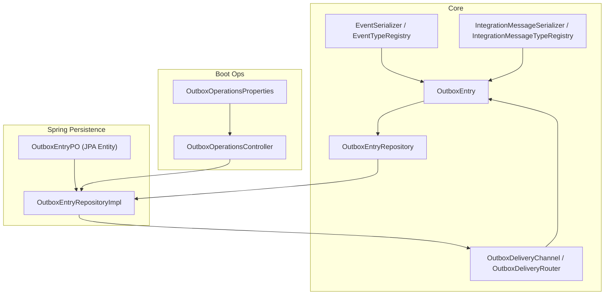
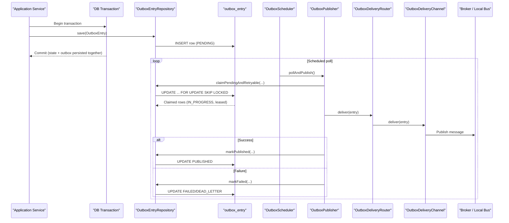
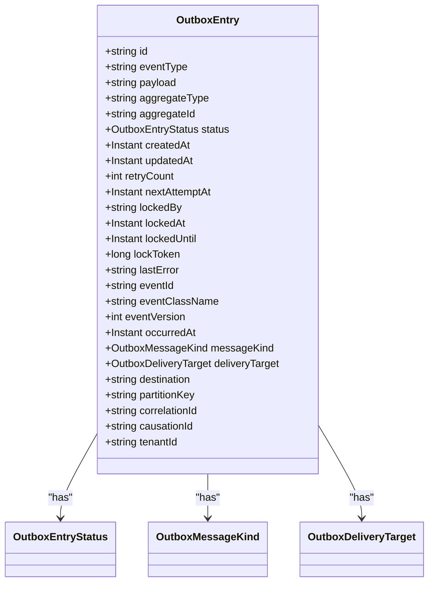
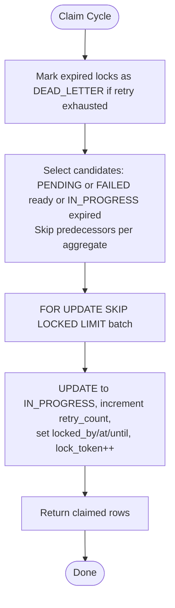
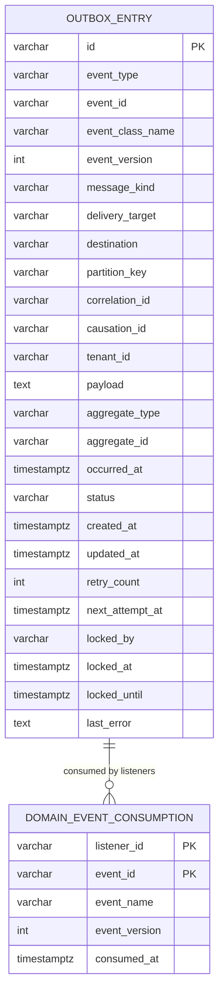
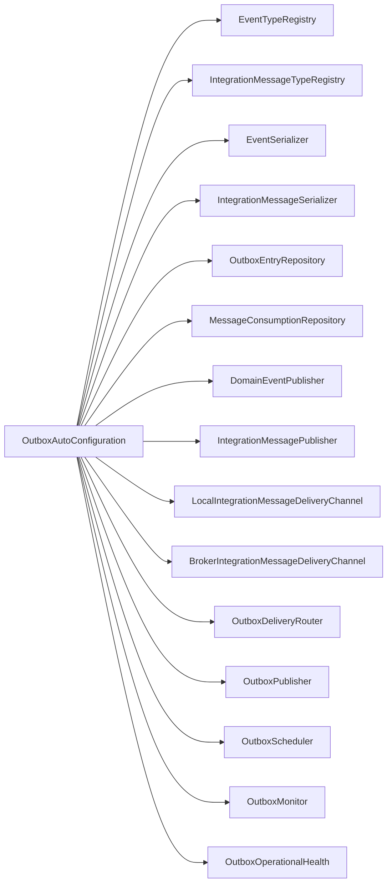
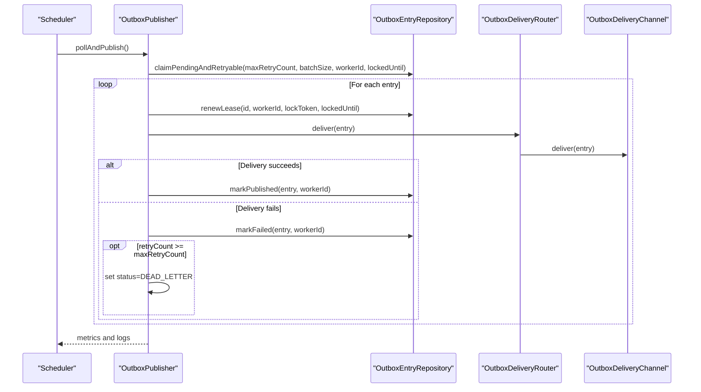
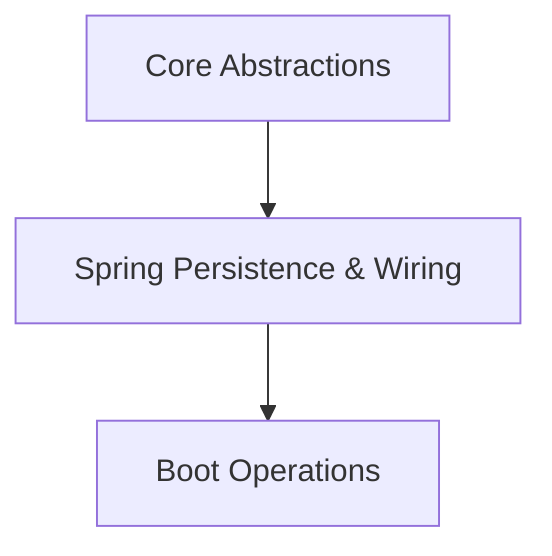

# Outbox Pattern Implementation

<cite>
**Referenced Files in This Document**
- [OutboxEntry.kt](file://j-store-common-core/src/main/kotlin/com/jstore/common/framework/event/outbox/OutboxEntry.kt)
- [OutboxEntryRepository.kt](file://j-store-common-core/src/main/kotlin/com/jstore/common/framework/event/outbox/OutboxEntryRepository.kt)
- [OutboxEntryPO.kt](file://j-store-common-spring/src/main/kotlin/com/jstore/common/framework/event/outbox/persistence/OutboxEntryPO.kt)
- [OutboxEntryRepositoryImpl.kt](file://j-store-common-spring/src/main/kotlin/com/jstore/common/framework/event/outbox/persistence/OutboxEntryRepositoryImpl.kt)
- [06-outbox-entry.sql](file://docker/postgres/init/06-outbox-entry.sql)
- [OutboxAutoConfiguration.kt](file://j-store-common-spring/src/main/kotlin/com/jstore/common/framework/event/outbox/OutboxAutoConfiguration.kt)
- [OutboxPublisher.kt](file://j-store-common-spring/src/main/kotlin/com/jstore/common/framework/event/outbox/OutboxPublisher.kt)
- [EventSerializer.kt](file://j-store-common-core/src/main/kotlin/com/jstore/common/framework/event/outbox/EventSerializer.kt)
- [EventTypeRegistry.kt](file://j-store-common-core/src/main/kotlin/com/jstore/common/framework/event/outbox/EventTypeRegistry.kt)
- [IntegrationMessageSerializer.kt](file://j-store-common-core/src/main/kotlin/com/jstore/common/framework/event/outbox/IntegrationMessageSerializer.kt)
- [OutboxDeliveryRouter.kt](file://j-store-common-core/src/main/kotlin/com/jstore/common/framework/event/outbox/OutboxDeliveryRouter.kt)
- [OutboxOperationsController.kt](file://j-store-boot/src/main/kotlin/com/jstore/outbox/operations/OutboxOperationsController.kt)
- [OutboxOperationsProperties.kt](file://j-store-boot/src/main/kotlin/com/jstore/outbox/operations/OutboxOperationsProperties.kt)
</cite>

## Table of Contents
1. Introduction
2. Project Structure
3. Core Components
4. Architecture Overview
5. Detailed Component Analysis
6. Dependency Analysis
7. Performance Considerations
8. Troubleshooting Guide
9. Conclusion

## Introduction
This document explains the Outbox Pattern implementation used to ensure reliable message delivery by combining database transactions with asynchronous message publishing. It covers the OutboxEntry model, repository interfaces and JPA persistence, Spring auto-configuration, publisher mechanism, event serialization strategies, consumption tracking, dead-letter handling, configuration examples, broker integrations, deployment considerations, performance optimization, scaling strategies, and troubleshooting guidance.

## Project Structure
The outbox implementation spans core domain abstractions, Spring-based persistence and wiring, and operational boot modules:
- Core abstractions define the OutboxEntry model, repository interface, serializers, type registries, and delivery routing.
- Spring persistence provides JPA entities, repository implementation with advanced SQL for claiming and leasing, and Spring Boot auto-configuration.
- Boot module exposes operational endpoints and properties for monitoring and management.

**Diagram sources**
- [OutboxEntry.kt](file://j-store-common-core/src/main/kotlin/com/jstore/common/framework/event/outbox/OutboxEntry.kt)
- [OutboxEntryRepository.kt](file://j-store-common-core/src/main/kotlin/com/jstore/common/framework/event/outbox/OutboxEntryRepository.kt)
- [OutboxEntryPO.kt](file://j-store-common-spring/src/main/kotlin/com/jstore/common/framework/event/outbox/persistence/OutboxEntryPO.kt)
- [OutboxEntryRepositoryImpl.kt](file://j-store-common-spring/src/main/kotlin/com/jstore/common/framework/event/outbox/persistence/OutboxEntryRepositoryImpl.kt)
- [OutboxDeliveryRouter.kt](file://j-store-common-core/src/main/kotlin/com/jstore/common/framework/event/outbox/OutboxDeliveryRouter.kt)
- [OutboxOperationsController.kt](file://j-store-boot/src/main/kotlin/com/jstore/outbox/operations/OutboxOperationsController.kt)
- [OutboxOperationsProperties.kt](file://j-store-boot/src/main/kotlin/com/jstore/outbox/operations/OutboxOperationsProperties.kt)

**Section sources**
- [OutboxEntry.kt](file://j-store-common-core/src/main/kotlin/com/jstore/common/framework/event/outbox/OutboxEntry.kt)
- [OutboxEntryRepository.kt](file://j-store-common-core/src/main/kotlin/com/jstore/common/framework/event/outbox/OutboxEntryRepository.kt)
- [OutboxEntryPO.kt](file://j-store-common-spring/src/main/kotlin/com/jstore/common/framework/event/outbox/persistence/OutboxEntryPO.kt)
- [OutboxEntryRepositoryImpl.kt](file://j-store-common-spring/src/main/kotlin/com/jstore/common/framework/event/outbox/persistence/OutboxEntryRepositoryImpl.kt)
- [OutboxDeliveryRouter.kt](file://j-store-common-core/src/main/kotlin/com/jstore/common/framework/event/outbox/OutboxDeliveryRouter.kt)
- [OutboxOperationsController.kt](file://j-store-boot/src/main/kotlin/com/jstore/outbox/operations/OutboxOperationsController.kt)
- [OutboxOperationsProperties.kt](file://j-store-boot/src/main/kotlin/com/jstore/outbox/operations/OutboxOperationsProperties.kt)

## Core Components
- OutboxEntry: Domain model representing a pending or in-flight message with metadata such as aggregate identity, correlation/causation IDs, tenant context, delivery target, destination, partition key, retry counters, lease fields, and timestamps. Includes validation rules for required fields and consistency between status and lease state.
- OutboxEntryRepository: Repository interface defining save, claim, lease renewal, mark published/failed, dead-letter operations, counts, and health queries.
- JPA Entity and Repository Impl: OutboxEntryPO maps to the outbox_entry table; OutboxEntryRepositoryImpl implements optimistic locking via lock_token, atomic claim with SKIP LOCKED, lease renewal, and robust failure transitions.
- Serializers and Registries: EventSerializer and EventTypeRegistry for domain events; IntegrationMessageSerializer and IntegrationMessageTypeRegistry for integration messages. Supports versioned deserialization and upcasting.
- Delivery Routing: OutboxDeliveryChannel and OutboxDeliveryRouter route entries to local domain bus, local integration bus, or external brokers based on deliveryTarget.

**Section sources**
- [OutboxEntry.kt](file://j-store-common-core/src/main/kotlin/com/jstore/common/framework/event/outbox/OutboxEntry.kt)
- [OutboxEntryRepository.kt](file://j-store-common-core/src/main/kotlin/com/jstore/common/framework/event/outbox/OutboxEntryRepository.kt)
- [OutboxEntryPO.kt](file://j-store-common-spring/src/main/kotlin/com/jstore/common/framework/event/outbox/persistence/OutboxEntryPO.kt)
- [OutboxEntryRepositoryImpl.kt](file://j-store-common-spring/src/main/kotlin/com/jstore/common/framework/event/outbox/persistence/OutboxEntryRepositoryImpl.kt)
- [EventSerializer.kt](file://j-store-common-core/src/main/kotlin/com/jstore/common/framework/event/outbox/EventSerializer.kt)
- [EventTypeRegistry.kt](file://j-store-common-core/src/main/kotlin/com/jstore/common/framework/event/outbox/EventTypeRegistry.kt)
- [IntegrationMessageSerializer.kt](file://j-store-common-core/src/main/kotlin/com/jstore/common/framework/event/outbox/IntegrationMessageSerializer.kt)
- [OutboxDeliveryRouter.kt](file://j-store-common-core/src/main/kotlin/com/jstore/common/framework/event/outbox/OutboxDeliveryRouter.kt)

## Architecture Overview
The outbox pattern ensures reliability by persisting an event record within the same transaction that updates application state. A background scheduler polls the outbox table, claims rows atomically, delivers them through a router to the appropriate channel, and marks them published or failed with exponential backoff. Dead letters are quarantined for manual inspection and requeue.

**Diagram sources**
- [OutboxPublisher.kt](file://j-store-common-spring/src/main/kotlin/com/jstore/common/framework/event/outbox/OutboxPublisher.kt)
- [OutboxEntryRepositoryImpl.kt](file://j-store-common-spring/src/main/kotlin/com/jstore/common/framework/event/outbox/persistence/OutboxEntryRepositoryImpl.kt)
- [OutboxDeliveryRouter.kt](file://j-store-common-core/src/main/kotlin/com/jstore/common/framework/event/outbox/OutboxDeliveryRouter.kt)

## Detailed Component Analysis

### OutboxEntry Model and Status Flow
OutboxEntry encapsulates all metadata needed for reliable delivery and observability. It enforces constraints such as non-blank identifiers, positive versions, consistent lease fields when IN_PROGRESS, and correct pairing of messageKind and deliveryTarget.

**Diagram sources**
- [OutboxEntry.kt](file://j-store-common-core/src/main/kotlin/com/jstore/common/framework/event/outbox/OutboxEntry.kt)

**Section sources**
- [OutboxEntry.kt](file://j-store-common-core/src/main/kotlin/com/jstore/common/framework/event/outbox/OutboxEntry.kt)

### Repository Interface and JPA Implementation
The repository abstracts persistence operations. The implementation uses native SQL for high-performance claiming with SKIP LOCKED, lease renewal, and conditional updates guarded by lock_token to prevent lost updates.

**Diagram sources**
- [OutboxEntryRepositoryImpl.kt](file://j-store-common-spring/src/main/kotlin/com/jstore/common/framework/event/outbox/persistence/OutboxEntryRepositoryImpl.kt)

**Section sources**
- [OutboxEntryRepository.kt](file://j-store-common-core/src/main/kotlin/com/jstore/common/framework/event/outbox/OutboxEntryRepository.kt)
- [OutboxEntryRepositoryImpl.kt](file://j-store-common-spring/src/main/kotlin/com/jstore/common/framework/event/outbox/persistence/OutboxEntryRepositoryImpl.kt)

### Database Schema and Indexes
The schema defines the outbox_entry table and supporting indexes for polling, claiming, cleanup, and diagnostics. A separate domain_event_consumption table tracks listener-level idempotency for domain events.

**Diagram sources**
- [06-outbox-entry.sql](file://docker/postgres/init/06-outbox-entry.sql)

**Section sources**
- [06-outbox-entry.sql](file://docker/postgres/init/06-outbox-entry.sql)

### Spring Auto-Configuration
OutboxAutoConfiguration wires serializers, registries, repositories, publishers, channels, routers, schedulers, monitors, and operational health under a feature flag. It also configures local and broker delivery channels conditionally.

**Diagram sources**
- [OutboxAutoConfiguration.kt](file://j-store-common-spring/src/main/kotlin/com/jstore/common/framework/event/outbox/OutboxAutoConfiguration.kt)

**Section sources**
- [OutboxAutoConfiguration.kt](file://j-store-common-spring/src/main/kotlin/com/jstore/common/framework/event/outbox/OutboxAutoConfiguration.kt)

### Publisher Mechanism and Retry Strategy
OutboxPublisher performs scheduled polling, claims entries, renews leases, delivers via router, and commits success/failure atomically. It applies exponential backoff capped at a maximum delay and moves entries to DEAD_LETTER after exceeding max retries.

**Diagram sources**
- [OutboxPublisher.kt](file://j-store-common-spring/src/main/kotlin/com/jstore/common/framework/event/outbox/OutboxPublisher.kt)
- [OutboxEntryRepositoryImpl.kt](file://j-store-common-spring/src/main/kotlin/com/jstore/common/framework/event/outbox/persistence/OutboxEntryRepositoryImpl.kt)
- [OutboxDeliveryRouter.kt](file://j-store-common-core/src/main/kotlin/com/jstore/common/framework/event/outbox/OutboxDeliveryRouter.kt)

**Section sources**
- [OutboxPublisher.kt](file://j-store-common-spring/src/main/kotlin/com/jstore/common/framework/event/outbox/OutboxPublisher.kt)

### Event Serialization Strategies
- Domain Events: EventSerializer serializes/deserializes using ObjectMapper with EventTypeRegistry to resolve classes by name and version. Supports upcasting via EventUpcaster registry.
- Integration Messages: IntegrationMessageSerializer handles serialization with IntegrationMessageTypeRegistry. Both support versioned evolution and safe upgrades.

**Section sources**
- [EventSerializer.kt](file://j-store-common-core/src/main/kotlin/com/jstore/common/framework/event/outbox/EventSerializer.kt)
- [EventTypeRegistry.kt](file://j-store-common-core/src/main/kotlin/com/jstore/common/framework/event/outbox/EventTypeRegistry.kt)
- [IntegrationMessageSerializer.kt](file://j-store-common-core/src/main/kotlin/com/jstore/common/framework/event/outbox/IntegrationMessageSerializer.kt)

### Consumption Tracking and Idempotency
Domain event consumption is tracked in domain_event_consumption keyed by listener_id and event_id to ensure exactly-once semantics per listener. Integration consumers can use similar patterns via MessageConsumptionRepository.

**Section sources**
- [06-outbox-entry.sql](file://docker/postgres/init/06-outbox-entry.sql)

### Operational Controls and Health
- OutboxOperationsController exposes operational endpoints for querying and managing outbox entries and dead letters.
- OutboxOperationsProperties centralizes configuration for operational features.
- OutboxOperationalHealth aggregates metrics and thresholds for readiness/liveness checks.

**Section sources**
- [OutboxOperationsController.kt](file://j-store-boot/src/main/kotlin/com/jstore/outbox/operations/OutboxOperationsController.kt)
- [OutboxOperationsProperties.kt](file://j-store-boot/src/main/kotlin/com/jstore/outbox/operations/OutboxOperationsProperties.kt)

## Dependency Analysis
The system exhibits clear layering:
- Core abstractions depend only on domain types and minimal utilities.
- Spring persistence depends on JPA and Spring Data.
- Auto-configuration wires components conditionally based on available beans and properties.
- Boot module adds operational APIs and properties.

**Diagram sources**
- [OutboxAutoConfiguration.kt](file://j-store-common-spring/src/main/kotlin/com/jstore/common/framework/event/outbox/OutboxAutoConfiguration.kt)
- [OutboxEntryRepositoryImpl.kt](file://j-store-common-spring/src/main/kotlin/com/jstore/common/framework/event/outbox/persistence/OutboxEntryRepositoryImpl.kt)

**Section sources**
- [OutboxAutoConfiguration.kt](file://j-store-common-spring/src/main/kotlin/com/jstore/common/framework/event/outbox/OutboxAutoConfiguration.kt)
- [OutboxEntryRepositoryImpl.kt](file://j-store-common-spring/src/main/kotlin/com/jstore/common/framework/event/outbox/persistence/OutboxEntryRepositoryImpl.kt)

## Performance Considerations
- Use SKIP LOCKED and targeted indexes to minimize contention during claim cycles.
- Tune batchSize and maxInFlightPerPoll to balance throughput and memory usage.
- Configure lockTimeoutMillis appropriately to avoid premature lease expiry while allowing recovery from stuck workers.
- Enable batching for deletePublishedBefore to reclaim space without long-running transactions.
- Monitor retry backoff parameters to reduce load during transient failures.

[No sources needed since this section provides general guidance]

## Troubleshooting Guide
Common issues and remedies:
- Stuck locks: Expired locks are converted to DEAD_LETTER when retry count is exhausted; otherwise they become eligible again.
- Duplicate deliveries: Ensure consumer-side idempotency using event_id and consumption tables.
- Serialization errors: Verify EventTypeRegistry and IntegrationMessageTypeRegistry registrations and versions.
- High dead-letter volume: Investigate lastError fields and requeue selectively after fixes.
- Slow polling: Review indexes and adjust batchSize/maxInFlightPerPoll.

**Section sources**
- [OutboxEntryRepositoryImpl.kt](file://j-store-common-spring/src/main/kotlin/com/jstore/common/framework/event/outbox/persistence/OutboxEntryRepositoryImpl.kt)
- [OutboxPublisher.kt](file://j-store-common-spring/src/main/kotlin/com/jstore/common/framework/event/outbox/OutboxPublisher.kt)
- [06-outbox-entry.sql](file://docker/postgres/init/06-outbox-entry.sql)

## Conclusion
The outbox implementation combines transactional persistence with robust asynchronous delivery, providing strong guarantees against data loss and ensuring eventual consistency across services. With configurable retry/backoff, dead-letter handling, and operational tooling, it supports scalable and observable event-driven architectures across diverse brokers and environments.

[No sources needed since this section summarizes without analyzing specific files]