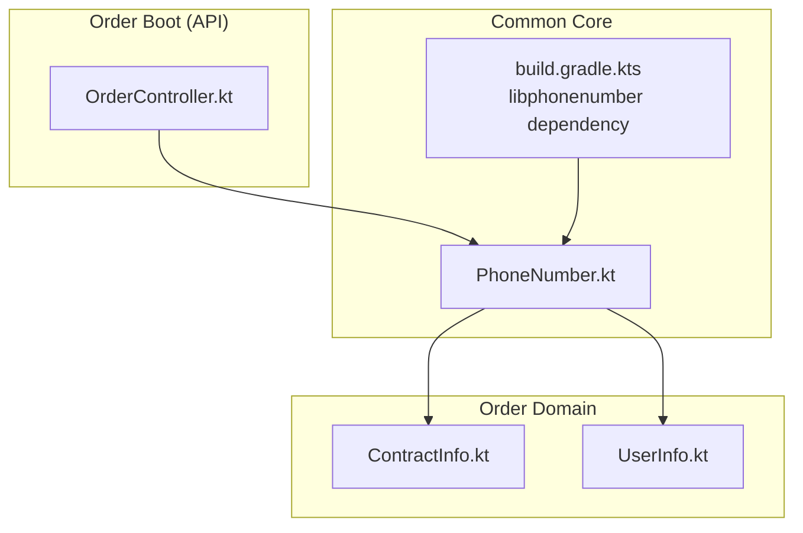
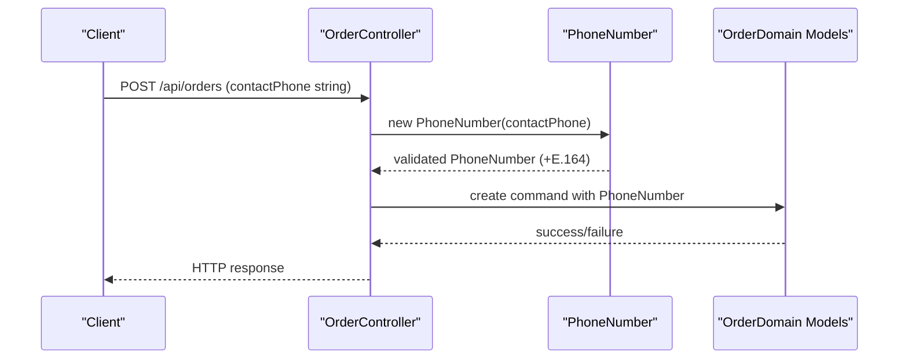
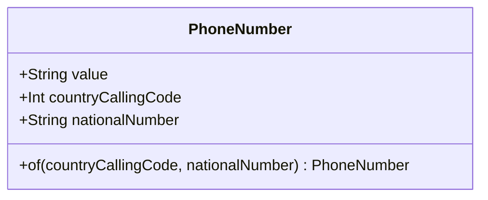
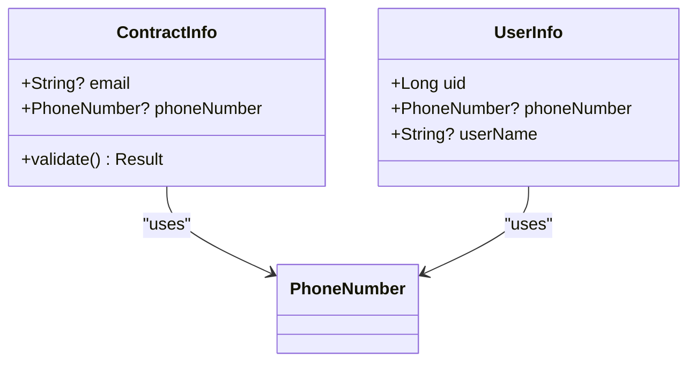
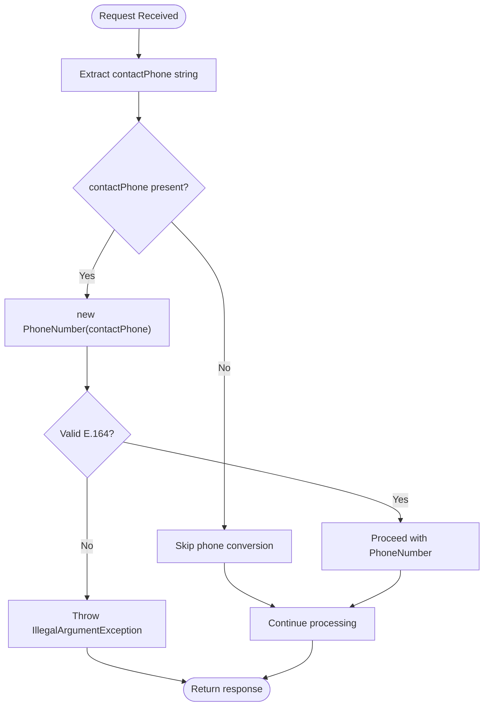
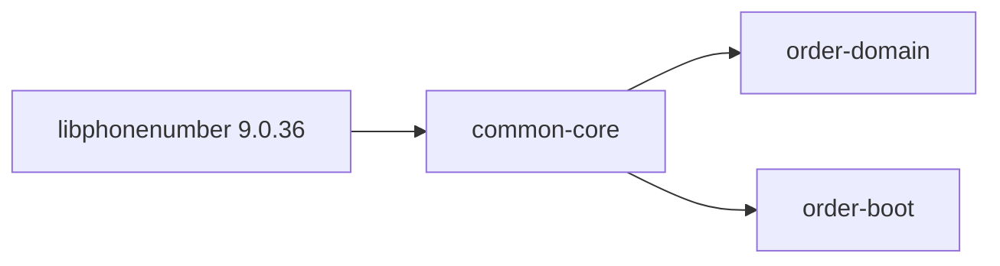

# International Phone Number System

<cite>
**Referenced Files in This Document**
- [PhoneNumber.kt](file://j-store-common-core/src/main/kotlin/com/jstore/common/properties/PhoneNumber.kt)
- [PhoneNumberPropertyTest.kt](file://j-store-common-core/src/test/kotlin/com/jstore/common/properties/PhoneNumberPropertyTest.kt)
- [OrderController.kt](file://j-store-order-boot/src/main/kotlin/com/jstore/order/controller/OrderController.kt)
- [ContractInfo.kt](file://j-store-order-domain/src/main/kotlin/com/jstore/order/domain/order/ContractInfo.kt)
- [UserInfo.kt](file://j-store-order-domain/src/main/kotlin/com/jstore/order/domain/order/UserInfo.kt)
- [build.gradle.kts (common-core)](file://j-store-common-core/build.gradle.kts)
- [libs.versions.toml](file://gradle/libs.versions.toml)
</cite>

## Table of Contents
1. [Introduction](#introduction)
2. [Project Structure](#project-structure)
3. [Core Components](#core-components)
4. [Architecture Overview](#architecture-overview)
5. [Detailed Component Analysis](#detailed-component-analysis)
6. [Dependency Analysis](#dependency-analysis)
7. [Performance Considerations](#performance-considerations)
8. [Troubleshooting Guide](#troubleshooting-guide)
9. [Conclusion](#conclusion)

## Introduction
This document explains the International Phone Number System implemented in the project. It focuses on a strongly-typed, immutable value object that enforces E.164 format and validates phone numbers per region using Google’s libphonenumber. The system is used across domain models to ensure consistent, safe handling of international phone numbers throughout the application.

## Project Structure
The phone number functionality is encapsulated as a reusable value object in the common core module and consumed by domain modules such as order management.

**Diagram sources**
- [PhoneNumber.kt:1-49](file://j-store-common-core/src/main/kotlin/com/jstore/common/properties/PhoneNumber.kt#L1-L49)
- [build.gradle.kts (common-core):19-29](file://j-store-common-core/build.gradle.kts#L19-L29)
- [ContractInfo.kt:1-20](file://j-store-order-domain/src/main/kotlin/com/jstore/order/domain/order/ContractInfo.kt#L1-L20)
- [UserInfo.kt:1-15](file://j-store-order-domain/src/main/kotlin/com/jstore/order/domain/order/UserInfo.kt#L1-L15)
- [OrderController.kt:120-128](file://j-store-order-boot/src/main/kotlin/com/jstore/order/controller/OrderController.kt#L120-L128)

**Section sources**
- [PhoneNumber.kt:1-49](file://j-store-common-core/src/main/kotlin/com/jstore/common/properties/PhoneNumber.kt#L1-L49)
- [build.gradle.kts (common-core):19-29](file://j-store-common-core/build.gradle.kts#L19-L29)
- [ContractInfo.kt:1-20](file://j-store-order-domain/src/main/kotlin/com/jstore/order/domain/order/ContractInfo.kt#L1-L20)
- [UserInfo.kt:1-15](file://j-store-order-domain/src/main/kotlin/com/jstore/order/domain/order/UserInfo.kt#L1-L15)
- [OrderController.kt:120-128](file://j-store-order-boot/src/main/kotlin/com/jstore/order/controller/OrderController.kt#L120-L128)

## Core Components
- PhoneNumber: Immutable value object representing an international phone number in canonical E.164 format. It exposes countryCallingCode and nationalNumber derived from libphonenumber parsing and validation.
- ContractInfo: Domain model holding optional email or PhoneNumber for contact information.
- UserInfo: Domain model storing buyer information including optional PhoneNumber.
- OrderController: API layer that converts incoming request strings into PhoneNumber instances before passing them into domain commands.

Key behaviors enforced by PhoneNumber:
- Requires E.164 string starting with “+”
- Validates against libphonenumber rules for the detected region
- Enforces canonical E.164 without separators
- Provides factory method to construct from calling code and national number

**Section sources**
- [PhoneNumber.kt:14-49](file://j-store-common-core/src/main/kotlin/com/jstore/common/properties/PhoneNumber.kt#L14-L49)
- [ContractInfo.kt:9-19](file://j-store-order-domain/src/main/kotlin/com/jstore/order/domain/order/ContractInfo.kt#L9-L19)
- [UserInfo.kt:6-14](file://j-store-order-domain/src/main/kotlin/com/jstore/order/domain/order/UserInfo.kt#L6-L14)
- [OrderController.kt:120-128](file://j-store-order-boot/src/main/kotlin/com/jstore/order/controller/OrderController.kt#L120-L128)

## Architecture Overview
The system integrates at three layers:
- API Layer: Receives raw phone strings and constructs PhoneNumber via Jackson deserialization or explicit conversion.
- Domain Layer: Uses PhoneNumber as a typed field ensuring business invariants are respected.
- Common Core: Centralizes validation logic and JSON integration.

**Diagram sources**
- [OrderController.kt:120-128](file://j-store-order-boot/src/main/kotlin/com/jstore/order/controller/OrderController.kt#L120-L128)
- [PhoneNumber.kt:14-49](file://j-store-common-core/src/main/kotlin/com/jstore/common/properties/PhoneNumber.kt#L14-L49)

## Detailed Component Analysis

### PhoneNumber Value Object
- Purpose: Provide a robust, globally valid representation of phone numbers.
- Validation pipeline:
  - Ensure leading “+”
  - Parse with libphonenumber
  - Validate region-specific rules
  - Normalize to canonical E.164
  - Expose countryCallingCode and nationalNumber
- Serialization:
  - @JsonCreator delegates construction from JSON string
  - @JsonValue serializes back to canonical E.164 string

**Diagram sources**
- [PhoneNumber.kt:14-49](file://j-store-common-core/src/main/kotlin/com/jstore/common/properties/PhoneNumber.kt#L14-L49)

**Section sources**
- [PhoneNumber.kt:14-49](file://j-store-common-core/src/main/kotlin/com/jstore/common/properties/PhoneNumber.kt#L14-L49)

### Usage in Domain Models
- ContractInfo: Holds optional email or PhoneNumber; validates that at least one is present.
- UserInfo: Stores buyer info including optional PhoneNumber; ensures uid > 0.

**Diagram sources**
- [ContractInfo.kt:9-19](file://j-store-order-domain/src/main/kotlin/com/jstore/order/domain/order/ContractInfo.kt#L9-L19)
- [UserInfo.kt:6-14](file://j-store-order-domain/src/main/kotlin/com/jstore/order/domain/order/UserInfo.kt#L6-L14)
- [PhoneNumber.kt:14-49](file://j-store-common-core/src/main/kotlin/com/jstore/common/properties/PhoneNumber.kt#L14-L49)

**Section sources**
- [ContractInfo.kt:9-19](file://j-store-order-domain/src/main/kotlin/com/jstore/order/domain/order/ContractInfo.kt#L9-L19)
- [UserInfo.kt:6-14](file://j-store-order-domain/src/main/kotlin/com/jstore/order/domain/order/UserInfo.kt#L6-L14)

### API Integration Flow
- OrderController receives contactPhone as a nullable string.
- Converts to PhoneNumber during command creation.
- PhoneNumber constructor performs strict validation; invalid inputs throw IllegalArgumentException.

**Diagram sources**
- [OrderController.kt:120-128](file://j-store-order-boot/src/main/kotlin/com/jstore/order/controller/OrderController.kt#L120-L128)
- [PhoneNumber.kt:24-40](file://j-store-common-core/src/main/kotlin/com/jstore/common/properties/PhoneNumber.kt#L24-L40)

**Section sources**
- [OrderController.kt:120-128](file://j-store-order-boot/src/main/kotlin/com/jstore/order/controller/OrderController.kt#L120-L128)
- [PhoneNumber.kt:24-40](file://j-store-common-core/src/main/kotlin/com/jstore/common/properties/PhoneNumber.kt#L24-L40)

## Dependency Analysis
- External library: com.googlecode.libphonenumber:libphonenumber (version managed centrally).
- Module exposure: common-core exposes PhoneNumber via api dependency so other modules can use it directly.
- JSON integration: jackson annotations enable seamless serialization/deserialization of PhoneNumber.

**Diagram sources**
- [libs.versions.toml:89](file://gradle/libs.versions.toml#L89)
- [build.gradle.kts (common-core):21](file://j-store-common-core/build.gradle.kts#L21)

**Section sources**
- [libs.versions.toml:89](file://gradle/libs.versions.toml#L89)
- [build.gradle.kts (common-core):21](file://j-store-common-core/build.gradle.kts#L21)

## Performance Considerations
- PhoneNumberUtil instance is reused within the companion object to avoid repeated initialization overhead.
- Validation occurs once at construction time; subsequent accessors are O(1).
- Avoid constructing PhoneNumber repeatedly in tight loops; cache when possible.

[No sources needed since this section provides general guidance]

## Troubleshooting Guide
Common errors and resolutions:
- Missing leading “+”: Ensure input is in E.164 format starting with “+”.
- Non-canonical E.164 with separators: Remove spaces, dashes, or parentheses; use plain digits after “+”.
- Region-invalid number: Verify the number matches the expected country’s rules (e.g., length, prefix).
- Parsing exceptions: libphonenumber may fail to parse malformed inputs; validate client-side first.

Validation behavior is covered by property tests which assert acceptance of valid numbers and rejection of invalid formats.

**Section sources**
- [PhoneNumberPropertyTest.kt:23-71](file://j-store-common-core/src/test/kotlin/com/jstore/common/properties/PhoneNumberPropertyTest.kt#L23-L71)

## Conclusion
The International Phone Number System provides a robust, type-safe approach to handling global phone numbers. By enforcing E.164 normalization and leveraging libphonenumber, it guarantees data integrity across the application. Its design promotes reusability and clear boundaries between API, domain, and common utilities.